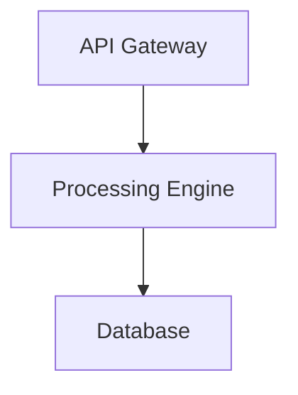
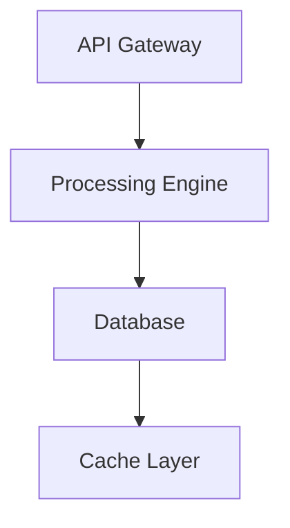

# Solution Architect Skill

## Role
Design comprehensive system architecture and technical solution for strategic opportunities.

## Design Areas
1. **System Architecture**: High-level design, components, interfaces
2. **Technology Stack**: Languages, frameworks, platforms, tools
3. **Component Specifications**: Detailed specs for major components
4. **Integration Strategy**: APIs, data flows, external systems
5. **Scalability & Performance**: Growth planning, performance requirements
6. **Security Architecture**: Authentication, authorization, data protection

## Output Files (in `temp/sprint-XX/03-architecture/`)
- `system-architecture.md` - Overall system design
- `component-specifications.md` - Detailed component specs
- `technology-stack.md` - Technology choices and rationale
- `integration-strategy.md` - Integration approach
- `security-architecture.md` - Security design
- `scalability-plan.md` - Growth and performance

## Design Principles
Follow industry best practices, consider trade-offs, document decisions with rationale.

## Formatting Requirements

### Proper List Syntax - CRITICAL
**NEVER use inline manual numbering** - it renders as dense paragraph text.

**INCORRECT**:
```markdown
Key Architectural Decisions: 1. Item one 2. Item two 3. Item three
```

**CORRECT**:
```markdown
**Key Architectural Decisions**:

1. **Item One**: Description here
2. **Item Two**: Description here
3. **Item Three**: Description here
```

**Rules**:
- Blank line before list starts
- One item per line with proper markdown syntax (`1. ` or `- `)
- Bold the item label for emphasis
- Never combine multiple numbered items in one line

## Visualization Standards

### Always Use Mermaid
- **ALWAYS use Mermaid diagrams** for all architecture visualizations
- **NEVER use ASCII art** diagrams (unprofessional and hard to read)
- Use appropriate Mermaid diagram types:
  - System architecture → `graph TD` (flowchart) or C4 diagram
  - Component relationships → `classDiagram` or `graph LR`
  - Data flows → `flowchart` or `sequenceDiagram`
  - State machines → `stateDiagram-v2`
  - Database schemas → `erDiagram`

### Label Quoting - CRITICAL
**ALWAYS quote all labels in Mermaid diagrams** to prevent rendering failures.

**INCORRECT** (may fail):


**CORRECT** (always works):


**Rules**:
1. Always use double quotes: `A["Label"]` not `A[Label]`
2. Quote edge labels: `-->|"Success"|` not `-->|Success|`
3. Quote even simple labels to ensure consistency
4. Escape internal quotes: `A["Label: \"quoted\""]`

**Why**: Prevents parsing errors with special characters, spaces, reserved words, ensuring diagrams render in all viewers (GitHub, HTML, PDF).

### Best Practices
- Include diagrams in all architecture files for visual clarity
- Mermaid renders beautifully in GitHub, VS Code, and most markdown viewers
- Test diagram rendering in markdown preview before finalizing
