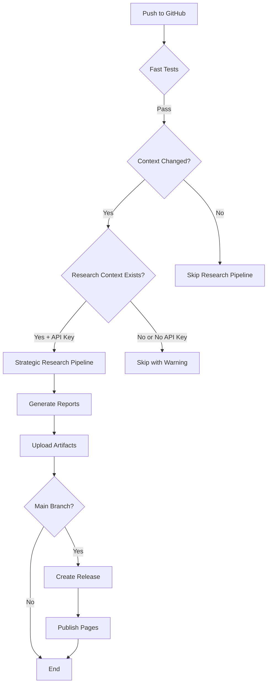

# GitHub Actions Workflows

This directory contains automated workflows for the Strategic Research Automation Template.

## Workflows Overview

### 1. Fast Tests (`fast-tests.yml`)
**Purpose**: Quick validation of template functionality

**Triggers**:
- Push to any branch
- Pull requests

**What it tests**:
- Script syntax validation
- Configuration file structure
- Template variable substitution

**Duration**: ~2-5 minutes

---

### 2. Strategic Research Pipeline (`ci-research-pipeline.yml`)
**Purpose**: Execute full research automation in CI/CD

**Triggers**:
- Push to `main` or `develop` branches when:
  - `config/sprint-config.yml` changes
  - Files in `context/**` change
- Manual trigger via `workflow_dispatch`

**Requirements**:
1. **Initialized Research Context**: Repository must have configured research context (not template placeholders)
2. **API Key Secret**: `ANTHROPIC_API_KEY` must be configured in repository secrets

**What it does**:
1. Verifies research context exists (skips for template repos)
2. Checks required secrets are configured
3. Installs Claude Code CLI
4. Executes research pipeline
5. Validates quality
6. Exports reports (PDF/DOCX/HTML)
7. Uploads artifacts
8. Creates release (main branch only)

**Duration**: 2-6 hours (configurable, max 360 minutes)

**For Template Repositories**:
- Workflow will **skip execution** gracefully if template placeholders detected
- Shows warning: "Template repository detected - no research context configured"
- This is **expected behavior** - prevents failures on template repo

**For Production Repositories**:
- Requires `ANTHROPIC_API_KEY` secret configured
- Executes full research pipeline
- Generates reports and artifacts

---

### 3. Template Sync (`template-sync.yml`)
**Purpose**: Keep template repositories in sync with upstream changes

**Triggers**:
- Manual trigger via `workflow_dispatch`
- Scheduled (if configured)

**What it does**:
- Pulls latest changes from template repository
- Merges template updates into current repository
- Preserves local customizations

---

### 4. Publish Pages (`publish-pages.yml`)
**Purpose**: Generate and deploy GitHub Pages landing page

**Triggers**:
- Push to `main` branch when:
  - `reports/**` changes
  - `scripts/publish/**` changes
- Manual trigger via `workflow_dispatch`

**What it does**:
1. Generates HTML landing page from research reports
2. Deploys to GitHub Pages
3. Creates mobile-responsive site with opportunity cards

**Output**: https://[username].github.io/[repository]/

---

## Setting Up Workflows

### For Template Repository (No Configuration Needed)
- Fast Tests will run automatically
- Strategic Research Pipeline will skip gracefully
- No secrets required

### For Production Research Repository

#### Step 1: Configure API Key
1. Go to repository settings: `https://github.com/[owner]/[repo]/settings/secrets/actions`
2. Click **"New repository secret"**
3. Name: `ANTHROPIC_API_KEY`
4. Value: Your Anthropic API key from https://console.anthropic.com
5. Click **"Add secret"**

#### Step 2: Initialize Research Context
Run project initialization:
```bash
./scripts/setup-template.sh
# OR
claude -p "/init-project 'My Project' 'Industry' 'Company Name'"
```

This creates configured `config/project-config.yml` and `context/*` files.

#### Step 3: Enable GitHub Pages (Optional)
1. Go to repository settings → Pages
2. Source: **GitHub Actions**
3. Save

### Workflow Status

Check workflow status:
- Repository → Actions tab
- View runs, logs, and artifacts

### Troubleshooting

**Strategic Research Pipeline fails immediately**:
- ✅ Check `ANTHROPIC_API_KEY` secret is configured
- ✅ Verify `config/project-config.yml` has no template placeholders (`{{...}}`)
- ✅ Ensure context files are populated

**Claude CLI installation fails**:
- Check logs for "Could not resolve host"
- Verify GitHub Actions runner has internet access
- URL should be: `https://claude.ai/install.sh` (not `install.claude.ai`)

**Workflow skips execution**:
- Expected for template repositories
- Check logs for "Template repository detected" or "ANTHROPIC_API_KEY secret not configured"

---

## Workflow Architecture



---

## Cost Estimates

**Fast Tests**: Free (GitHub Actions included minutes)

**Strategic Research Pipeline**:
- Compute: ~15-30 minutes GitHub Actions time (free tier: 2,000 min/month)
- Claude API: ~$10-$50 per research sprint (usage-based)

**Publish Pages**: Free (GitHub Pages included)

---

## Security Notes

- API keys stored as encrypted secrets
- Workflows run in isolated containers
- No secrets exposed in logs
- Repository secrets not accessible from forked PRs

---

## Support

- Fast Tests failing: Check script syntax and file structure
- Research Pipeline issues: Review detailed logs in Actions tab
- API key problems: Verify at https://console.anthropic.com
- Template sync issues: Check for merge conflicts

For issues: https://github.com/o2alexanderfedin/strategic-research-automation-template/issues
