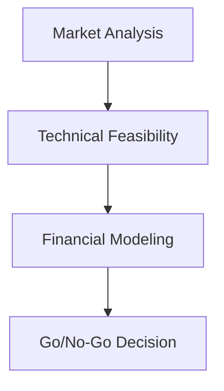
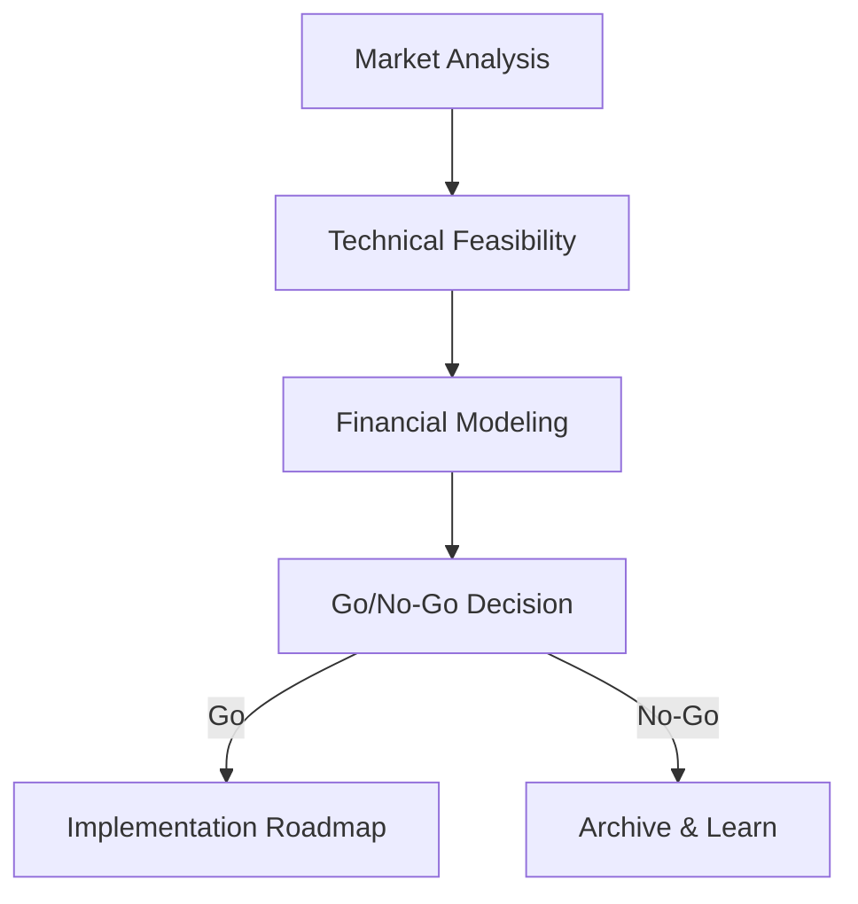

# Claude Code Guidelines for Strategic Research Automation

## Task Execution Strategy

### Context Optimization
Extensively use tasks and subtasks (Task tool) to optimize the context usage.

### Parallel Execution
Extensively use parallel tasks and subtasks (multiple Task tools running in the same message) to make the work be done much faster.

### Map-Reduce Approach
Use map-reduce approach with parallel tasks and subtasks for research decomposition.

### Task Reporting
Ensure each task or subtask reports back a very brief explanation on what was done, and what still needs to be done (if any).

### Problem Resolution
Ensure that in case of any problem that task or subtask experiences, it **must** spawn another [set of] subtask(s) to do necessary research and/or experiments in order to resolve the issue.

### Planning and Tracking
Extensively use planning (with TodoWrite tool), so all work is being thoroughly and reliably tracked, and nothing is skipped or lost.

### Parallelization Limits
The maximum number of tasks or subtasks running in parallel should not be more than CPU cores on this machine.

## Research Principles

### Evidence-Based Research
All claims must be supported by credible citations from:
- Industry regulations and standards
- Academic research and peer-reviewed journals
- Market reports from reputable firms
- Technical documentation and specifications
- Expert interviews (with permission)

### Citation Format
Follow the citation style specified in `config/project-config.yml` (default: APA).

### Source Quality Standards
Prioritize authoritative sources:
1. **Primary sources**: Regulatory documents, standards, official specifications
2. **Secondary sources**: Academic research, industry reports, technical documentation
3. **Tertiary sources**: News articles, blog posts (use sparingly, verify with primary/secondary sources)

### Cross-Referencing
Maintain internal consistency:
- Reference findings from other tasks within the sprint
- Link related research files
- Build upon previously established facts

## Quality Standards

### Dual-Audience Writing
All reports must serve both:
1. **Business Executives**: Clear value propositions, ROI, strategic implications
2. **Technical Decision-Makers**: Technical feasibility, architecture details, implementation requirements

### Document Structure
Every research file must include:
- **Executive Summary**: 2-3 paragraphs summarizing key findings
- **Key Findings**: Bulleted list of main discoveries
- **Supporting Evidence**: Detailed analysis with citations
- **References**: Full citation list

### File Organization
- Minimum 25 research files per sprint (configurable in `config/project-config.yml`)
- Each file should be focused and self-contained (500-5000 words)
- Use clear, descriptive filenames
- Organize files by task (01-technical, 02-market, 03-architecture, etc.)

## Git Workflow

### No Pull Requests
This is a solo research workflow - commit directly to main branch.

### Commit Frequently
Commit research files as they are completed:
```bash
git add temp/sprint-XX/
git commit -m "Sprint XX, Task YY: [brief description of research completed]"
git push
```

### Sprint Milestones
Create a git tag/release after completing each sprint:
```bash
git tag -a sprint-XX-complete -m "Sprint XX: [Sprint Name] - Complete"
git push --tags
```

## Configuration Management

### Project Configuration
All project settings are in `config/` directory:
- **project-config.yml**: Project metadata, research parameters
- **sprint-config.yml**: Sprint definitions and task breakdown
- **quality-standards.yml**: Evidence requirements, quality thresholds
- **scoring-rubric.yml**: Opportunity scoring criteria
- **glossary.yml**: Industry-specific terminology

### Environment Variables
Sensitive data goes in `.env` (never commit):
- API keys (ANTHROPIC_API_KEY, etc.)
- Credentials for external services
- Runtime configuration overrides

### Context Files
Project-specific context in `context/` directory:
- **company-profile.md**: Your company's capabilities, goals, constraints
- **client-info.md**: Client background, requirements, preferences
- **industry-background.md**: Industry-specific knowledge and context

## Skills and Commands

### Skills (Model-Invoked Agents)
Claude Code will automatically invoke skills based on task requirements:
- **sprint-orchestrator**: Coordinates multi-task sprint execution
- **technical-researcher**: Investigates regulatory, technical, standards
- **market-analyst**: Analyzes TAM/SAM/SOM, competitors, customers
- **solution-architect**: Designs system architecture and components
- **compliance-analyst**: Researches certification pathways and testing
- **roadmap-planner**: Creates implementation roadmaps and timelines
- **report-synthesizer**: Synthesizes final reports with scoring

### Commands (User-Invoked)
Execute commands via Claude Code CLI:
- `/init-project`: Initialize new research project
- `/create-sprint <name>`: Create new sprint directory structure
- `/execute-sprint <id>`: Execute all tasks in a sprint
- `/execute-task <sprint-id> <task-id>`: Execute single task
- `/synthesize-report <sprint-id>`: Create final sprint report
- `/score-opportunity <sprint-id>`: Score opportunity using rubric
- `/validate-quality <sprint-id>`: Run quality assurance checks

## Automation Principles

### Autonomous Operation
Skills operate autonomously within their domain:
- Skills make research decisions without asking for permission
- Skills parallelize research where beneficial
- Skills create comprehensive research files (not summaries)

### Human Checkpoints
Stop for human input only for:
- Strategic decisions (which opportunities to pursue)
- Go/No-Go recommendations requiring business judgment
- Ambiguous requirements or conflicting information
- Budget or timeline constraints

### Error Handling
If a skill encounters an issue:
1. Document the issue clearly
2. Attempt alternative approaches (different sources, search strategies)
3. If unresolvable, flag in research notes and continue
4. Never leave placeholders or "TODO" markers

## Output Standards

### Research Files
- Write in markdown format
- Include metadata header (title, date, author skill, sprint/task)
- Use clear section headings
- Include inline citations [Author, Year]
- Add full reference list at end

### Text Formatting and Readability

#### General Principles
- **Break up dense paragraphs** - Use bullet points, numbered lists, or `<br/>` tags
- **Maximum 3-4 sentences per paragraph** before breaking or using bullets
- **Use visual hierarchy** - Headings, subheadings, lists to guide the eye
- **Scannable content** - Busy executives should grasp key points quickly

#### Dense Text - MUST Use Lists or Line Breaks

**Example - INCORRECT (too dense)**:
```markdown
Mega-Trend 1: Self-Driving Labs (SDL) Commercialization - Market Growth: Virtual and remote laboratories $1.32B (2024) → $3.11B (2033), 10% CAGR - Technology Maturation: Academic publications on SDL increased 10x from 2015 to 2024; cost reduction (3D printing, open-source hardware) lowering barriers - Key Drivers: DOE investment ($100M+ in autonomous experimentation initiatives), private sector (Recursion Pharmaceuticals acquired Strateos for drug discovery SDL), materials science (batteries, catalysts requiring rapid iteration) - SRS Opportunity: Verified AI is critical enabler for SDL autonomous operation—hallucination risk too high for unverified AI to run unsupervised
```

**Example - CORRECT (bullet points)**:
```markdown
**Mega-Trend 1: Self-Driving Labs (SDL) Commercialization**

- **Market Growth**: Virtual and remote laboratories $1.32B (2024) → $3.11B (2033), 10% CAGR
- **Technology Maturation**: Academic publications on SDL increased 10x from 2015 to 2024; cost reduction (3D printing, open-source hardware) lowering barriers
- **Key Drivers**:
  - DOE investment ($100M+ in autonomous experimentation initiatives)
  - Private sector (Recursion Pharmaceuticals acquired Strateos for drug discovery SDL)
  - Materials science (batteries, catalysts requiring rapid iteration)
- **SRS Opportunity**: Verified AI is critical enabler for SDL autonomous operation—hallucination risk too high for unverified AI to run unsupervised
```

**OR with `<br/>` tags**:
```markdown
**Mega-Trend 1: Self-Driving Labs (SDL) Commercialization**<br/>
**Market Growth**: Virtual and remote laboratories $1.32B (2024) → $3.11B (2033), 10% CAGR<br/>
**Technology Maturation**: Academic publications increased 10x from 2015 to 2024<br/>
**Key Drivers**: DOE investment ($100M+), private sector (Recursion acquired Strateos), materials science<br/>
**SRS Opportunity**: Verified AI is critical enabler—hallucination risk too high for unverified AI
```

#### Table Formatting

**CRITICAL**: Proper markdown table syntax required for HTML/PDF rendering.

**Table Structure Rules**:
1. **Blank line before table** - Always have empty line before first row
2. **Blank line after table** - Always have empty line after last row
3. **Proper markdown syntax** - Use `|` pipes and `|---|` dashes for header separator
4. **Never inline tables** - Each row on its own line
5. **Align columns** - Use spaces to align pipes for readability

**CORRECT**:
```markdown
Some text before table.

| Category | Weight | Score |
|----------|--------|-------|
| Market   | 25%    | 93.3  |
| Tech     | 25%    | 80.0  |

Some text after table.
```

**INCORRECT** (no blank lines):
```markdown
Some text before table.
| Category | Weight | Score |
|----------|--------|-------|
| Market   | 25%    | 93.3  |
Some text after table.
```

**Line Breaks Within Cells**:
- **ALWAYS use `<br/>` tags for line breaks within table cells**
- **NEVER rely on markdown line breaks in tables** (they don't render properly)
- Keep table cell content readable with proper line breaks
- Use HTML line breaks for multi-line content in cells

**Example - CORRECT**:
```markdown
| Segment | SOM | Customer Count |
|---------|-----|----------------|
| Pharmaceutical R&D | $28M<br/>45% | 50-60<br/>$445K CLV |
| Clinical Labs | $16M<br/>25% | 60-80<br/>$580K CLV |
```

**Example - INCORRECT**:
```markdown
| Segment | SOM | Customer Count |
|---------|-----|----------------|
| Pharmaceutical R&D | $28M | 45% | 50-60 | $445K | 12-24 mo | 40-50% |
```
(Too many columns, wrapping makes it unreadable)

**Rules**:
1. Use `<br/>` to break long cell content into multiple lines
2. Group related data in single cells with line breaks
3. Limit tables to 3-5 columns for readability
4. If data doesn't fit, use nested tables or multiple tables
5. Always preview tables in markdown viewer to verify formatting

#### Lists vs. Paragraphs - When to Use Each

**Use bullet points when**:
- Listing 3+ distinct items
- Describing multiple features/benefits
- Breaking down complex information
- Presenting parallel concepts

**Use numbered lists when**:
- Steps in a process
- Ranked/prioritized items
- Sequential information
- Timeline events

**Use paragraphs when**:
- Narrative flow is needed
- Explaining cause and effect
- Building an argument
- Content is 1-2 sentences

**Use `<br/>` tags when**:
- Within table cells
- Within headings that need breaks
- Short, related statements that don't warrant full bullets
- Preserving specific line structure

#### Markdown List Syntax - CRITICAL

**NEVER use manual numbering** - it renders as dense text, not actual lists.

**INCORRECT** (renders as paragraph):
```markdown
Key Architectural Decisions: 1. Verification-First: Formal verification at center of architecture (not post-processing add-on), with verification gates at pre-calibration, real-time monitoring, and post-calibration 2. Hybrid Deployment: Support both on-premise (air-gapped metrology labs) and cloud SaaS (calibration service providers) with unified codebase 3. SMT-LIB Standard: All calibration models in SMT-LIB 2.6 format for portability and customer flexibility
```

**CORRECT** (renders as proper list):
```markdown
**Key Architectural Decisions**:

1. **Verification-First**: Formal verification at center of architecture (not post-processing add-on), with verification gates at pre-calibration, real-time monitoring, and post-calibration
2. **Hybrid Deployment**: Support both on-premise (air-gapped metrology labs) and cloud SaaS (calibration service providers) with unified codebase
3. **SMT-LIB Standard**: All calibration models in SMT-LIB 2.6 format for portability and customer flexibility
```

**Rules for markdown lists**:
1. **Blank line before list** - Always have empty line before first item
2. **Proper syntax** - Use `1. ` for numbered, `- ` for bullets
3. **Never inline numbers** - Don't write "1. Item 2. Item" in one line
4. **Bold the label** - Use `**Label**:` for emphasis
5. **One item per line** - Each list item on its own line

### Diagrams and Visualizations

#### Always Use Mermaid
- **ALWAYS use Mermaid diagrams** for all visual representations
- **NEVER use ASCII art** for diagrams (hard to read, unprofessional)
- Mermaid supports: flowcharts, sequence diagrams, class diagrams, state diagrams, ER diagrams, Gantt charts, pie charts, and more
- Benefits: Clean, professional, scalable, maintainable, renders beautifully in markdown viewers

#### Mermaid Label Quoting - CRITICAL
**ALWAYS quote labels** in Mermaid diagrams to prevent rendering failures.

**Example - INCORRECT (may fail to render)**:

Problem: Special characters, spaces, or reserved words can break rendering

**Example - CORRECT (always works)**:


**Quoting Rules**:
1. **Always use double quotes** around all node labels: `A["Label"]`
2. **Always quote edge labels**: `-->|"Label"|`
3. **Quote even simple labels**: `A["Start"]` not `A[Start]`
4. **Escape quotes in labels**: `A["Quote: \"text\""]`
5. **Use quotes for all diagram types**: flowcharts, sequence, class, etc.

**Why this matters**:
- Prevents Mermaid parsing errors
- Handles special characters (parentheses, quotes, colons, etc.)
- Avoids reserved word conflicts
- Ensures diagrams render in all viewers (GitHub, HTML, PDF)

#### Common Mermaid Use Cases
- System architecture → Mermaid flowchart or C4 diagram
- Data flows → Mermaid flowchart or sequence diagram
- Process workflows → Mermaid flowchart or state diagram
- Database schemas → Mermaid ER diagram
- Project timelines → Mermaid Gantt chart
- Component relationships → Mermaid class or component diagram

#### PDF Export with Mermaid Diagrams
Mermaid diagrams are automatically rendered in PDF exports when `mermaid-filter` is installed:
- Install: `npm install -g @mermaid-js/mermaid-cli mermaid-filter`
- Diagrams convert to embedded images in PDFs
- Without filter: Diagrams appear as code blocks (not rendered)
- CI/CD: Filter automatically installed in GitHub Actions workflow

### Final Reports
- Professional formatting suitable for stakeholder presentations
- Executive summary (1-2 pages)
- Detailed findings (10-30 pages depending on complexity)
- Appendices for supporting data
- Export in multiple formats (markdown, PDF, DOCX)

### Deliverables
Each sprint produces:
- Research files in `temp/sprint-XX/`
- Final report in `reports/sprint-XX-final-report.md`
- Opportunity score (0-100) with breakdown
- Go/No-Go recommendation with justification
