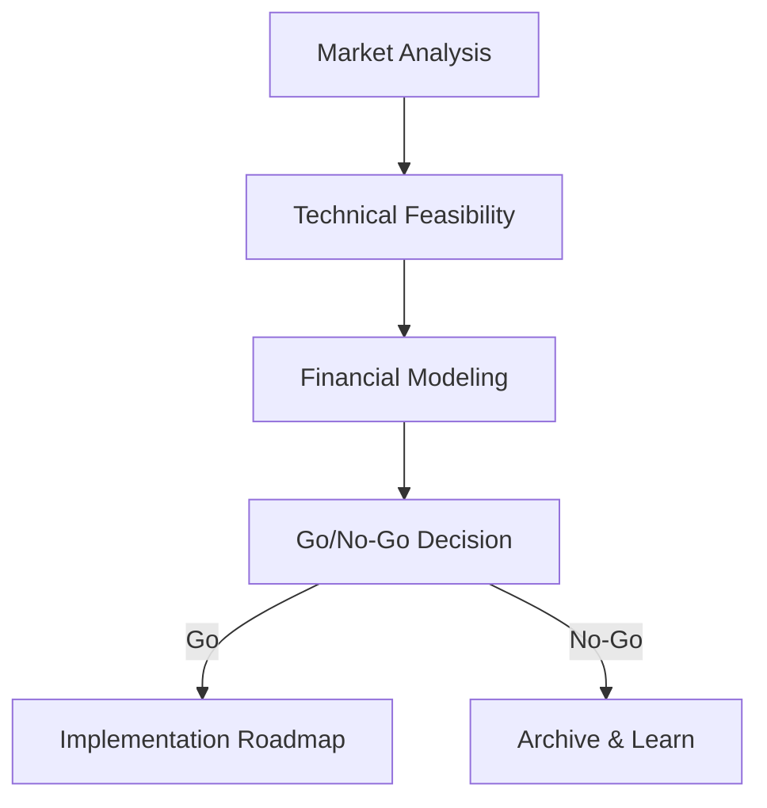

# GitHub Pages Publishing Guide

**Automatically generate and publish professional landing pages for your strategic research.**

---

## Overview

The GitHub Pages feature creates a beautiful, mobile-responsive landing page that showcases all your sprint reports with:

- **Overview Statistics**: Sprint count, research files, total TAM, average scores
- **Sprint Cards**: Each opportunity displayed with score, recommendation, and links
- **Professional Design**: Purple gradient theme, hover effects, responsive layout
- **Multiple Formats**: Links to HTML, PDF, and Markdown versions of each report
- **Diagram Rendering**: Automatic Mermaid.js integration for rendering diagrams in HTML reports

**Example**: https://o2alexanderfedin.github.io/innova-technology-proposals/

---

## Quick Start

### Option 1: Manual Generation

```bash
# Generate the landing page
./scripts/publish/generate-pages.sh

# Output will be in docs/pages/index.html
# Copy reports to pages directory
mkdir -p docs/pages/reports
cp reports/sprint-*-final-report.* docs/pages/reports/

# Commit and push
git add docs/pages/
git commit -m "Add GitHub Pages landing page"
git push origin main
```

### Option 2: Slash Command

```bash
# Use Claude Code slash command
/publish-pages
```

### Option 3: Automatic (on Release)

The `/finalize-release` command automatically generates GitHub Pages as part of the release process.

---

## GitHub Repository Setup

### Step 1: Enable GitHub Pages

1. Go to your repository on GitHub
2. Click **Settings** → **Pages** (left sidebar)
3. Under **Source**, select:
   - **Branch**: `main` (or `gh-pages`)
   - **Folder**: `/docs` (if using docs/pages/) or `/` (root)
4. Click **Save**

### Step 2: Configure Pages Path

If using `docs/pages/` directory (recommended):

1. In GitHub Settings → Pages
2. Select **Branch**: `main`, **Folder**: `/docs`
3. Wait 1-2 minutes for deployment
4. Your site will be at: `https://<username>.github.io/<repo>/pages/`

### Step 3: Verify Deployment

```bash
# Check Pages status via gh CLI
gh api repos/OWNER/REPO/pages

# Or visit your site URL
# https://<username>.github.io/<repo>/pages/
```

---

## How It Works

### 1. Report Scanning

The generator script scans `reports/` directory for:

```
reports/
├── sprint-01-final-report.md
├── sprint-02-final-report.md
├── sprint-03-final-report.md
└── ...
```

### 2. Metadata Extraction

From each report, it extracts:

- **Title**: First `# Heading` in the markdown
- **Score**: Searches for `Score: XX/100` pattern
- **TAM**: Searches for `TAM: $XXB` or `$XX billion` patterns
- **Description**: First paragraph after Executive Summary

### 3. HTML Generation

Creates `docs/pages/index.html` with:

- **Header**: Project name and tagline
- **Stats Grid**: 4 key metrics calculated automatically
- **Sprint Cards**: One card per sprint with extracted data
- **Footer**: Timestamp and attribution

### 4. Styling

Professional, mobile-responsive design using:

- CSS Grid for layout (auto-fit columns)
- Purple gradient theme (`#667eea` to `#764ba2`)
- Hover animations and transitions
- System font stack for cross-platform consistency

---

## Customization

### Change Color Scheme

Edit `scripts/publish/generate-pages.sh` around line 135:

```css
/* Current: Purple gradient */
background: linear-gradient(135deg, #667eea 0%, #764ba2 100%);

/* Example: Blue gradient */
background: linear-gradient(135deg, #3b82f6 0%, #1d4ed8 100%);

/* Example: Green gradient */
background: linear-gradient(135deg, #10b981 0%, #047857 100%);
```

### Modify Card Layout

Change grid columns (line ~230):

```css
/* Current: Auto-fit, minimum 350px */
grid-template-columns: repeat(auto-fit, minmax(350px, 1fr));

/* Example: Always 2 columns */
grid-template-columns: repeat(2, 1fr);

/* Example: Always 3 columns */
grid-template-columns: repeat(3, 1fr);
```

### Add Custom Sections

Insert HTML after line ~180 in the script:

```html
<div class="custom-section">
    <h2>About This Research</h2>
    <p>Your custom content here...</p>
</div>
```

### Change Footer Branding

Edit around line 400 in the script:

```html
<p>Generated with <a href="YOUR_LINK">Your Company Name</a></p>
```

---

## Troubleshooting

### Pages Not Publishing

**Problem**: GitHub Pages shows 404 or "site not found"

**Solutions**:
1. Check GitHub Settings → Pages is enabled
2. Verify correct branch and folder selected
3. Ensure `index.html` exists in the configured path
4. Wait 2-5 minutes after pushing (deployment takes time)
5. Check Actions tab for deployment errors

### Reports Not Linking

**Problem**: Clicking report links shows 404

**Solutions**:
1. Ensure reports are copied to `docs/pages/reports/`
2. Check file paths in HTML match actual file locations
3. Use relative paths: `../reports/sprint-01-final-report.html`
4. Verify reports exist in multiple formats (HTML, PDF, MD)

### Scores Not Extracting

**Problem**: All scores show as 75/100 (default)

**Solutions**:
1. Add `Score: XX/100` to your report markdown
2. Or add `Opportunity Score: XX` anywhere in the report
3. Check the grep pattern in `generate-pages.sh` line ~250
4. Ensure score is numeric (not "High" or "Good")

### TAM Not Calculating

**Problem**: Shows $0B+ or incorrect total

**Solutions**:
1. Use format: `TAM: $XXB` or `Total Addressable Market: $XX billion`
2. Supported suffixes: B (billion), M (million), K (thousand)
3. Ensure TAM appears in the report markdown
4. Check extraction pattern in `generate-pages.sh` line ~260

### Styling Broken

**Problem**: Page looks unstyled or has layout issues

**Solutions**:
1. Check `<style>` block is complete in generated HTML
2. View browser console for CSS errors
3. Test on multiple browsers (Chrome, Firefox, Safari)
4. Validate HTML: https://validator.w3.org/
5. Check mobile view with responsive design mode

---

## Diagram Rendering

### Mermaid.js Integration

All HTML reports automatically include Mermaid.js for rendering diagrams. Any Mermaid code blocks in your markdown reports will be rendered as interactive diagrams.

**Supported diagram types**:
- Flowcharts
- Sequence diagrams
- Class diagrams
- State diagrams
- ER diagrams
- Gantt charts
- Pie charts
- Git graphs

**Example markdown**:
````markdown

````

**Benefits**:
- ✅ Diagrams render automatically in browser
- ✅ No image files to manage
- ✅ Version control friendly (text-based)
- ✅ Professional, scalable graphics
- ✅ Interactive and responsive

**Note**: Diagrams render in HTML reports only. PDF and DOCX exports will show the diagram code (future enhancement planned).

---

## Advanced Usage

### Automated Deployment with GitHub Actions

The included workflow `.github/workflows/publish-pages.yml` automates deployment:

**Triggers**:
- Manual dispatch (Actions tab → Run workflow)
- Push to main branch when reports change
- Push to `docs/pages/**` directory

**Process**:
1. Generates landing page
2. Copies reports to pages directory
3. Uploads to GitHub Pages artifact
4. Deploys to live site

**Enable**:
```bash
# Push the workflow file
git add .github/workflows/publish-pages.yml
git commit -m "Add GitHub Pages automation"
git push origin main

# Trigger manually
gh workflow run publish-pages.yml
```

### Custom Domain

To use a custom domain (e.g., `research.yourcompany.com`):

1. Add `CNAME` file to `docs/pages/`:
   ```bash
   echo "research.yourcompany.com" > docs/pages/CNAME
   ```

2. Configure DNS with your domain provider:
   - Add CNAME record pointing to `<username>.github.io`

3. In GitHub Settings → Pages:
   - Enter custom domain
   - Enable HTTPS enforcement

### Multiple Projects

To publish multiple research projects on one GitHub Pages site:

```bash
# Generate each project to subdirectory
./scripts/publish/generate-pages.sh docs/pages/project-a
./scripts/publish/generate-pages.sh docs/pages/project-b

# Create index page linking to both
cat > docs/pages/index.html << EOF
<h1>Research Projects</h1>
<ul>
  <li><a href="project-a/">Project A</a></li>
  <li><a href="project-b/">Project B</a></li>
</ul>
EOF
```

### Analytics Integration

Add Google Analytics or other tracking:

Edit `generate-pages.sh` around line 90 to add before `</head>`:

```html
<!-- Google Analytics -->
<script async src="https://www.googletagmanager.com/gtag/js?id=GA_MEASUREMENT_ID"></script>
<script>
  window.dataLayer = window.dataLayer || [];
  function gtag(){dataLayer.push(arguments);}
  gtag('js', new Date());
  gtag('config', 'GA_MEASUREMENT_ID');
</script>
```

---

## File Structure

```
template/
├── .github/workflows/
│   └── publish-pages.yml          # Automated deployment
├── .claude/commands/
│   └── publish-pages.md           # Slash command definition
├── scripts/publish/
│   └── generate-pages.sh          # HTML generator script
├── docs/
│   └── pages/                     # Output directory
│       ├── index.html             # Generated landing page
│       └── reports/               # Copied report files
│           ├── sprint-01-final-report.html
│           ├── sprint-01-final-report.pdf
│           └── sprint-01-final-report.md
└── reports/                       # Source reports
    ├── sprint-01-final-report.md
    └── ...
```

---

## Best Practices

### 1. Consistent Report Naming

Use standardized filenames:
```
sprint-01-final-report.md
sprint-02-final-report.md
sprint-03-final-report.md
```

Not:
```
Sprint_1_Report.md
final-report-sprint2.md
sprint-three.md
```

### 2. Include Metadata in Reports

Add these sections to ensure proper extraction:

```markdown
# Sprint 01: Opportunity Title

## Executive Summary

Brief overview of the opportunity...

## Opportunity Score

**Score**: 85/100

## Market Analysis

**Total Addressable Market (TAM)**: $50B
**Serviceable Addressable Market (SAM)**: $10B
**Serviceable Obtainable Market (SOM)**: $1B
```

### 3. Generate All Formats

Export reports in multiple formats for user choice:

```bash
# Markdown (source)
reports/sprint-01-final-report.md

# HTML (for web viewing)
reports/sprint-01-final-report.html

# PDF (for download/print)
reports/sprint-01-final-report.pdf
```

### 4. Update Regularly

Regenerate pages after:
- Completing new sprints
- Updating report scores
- Fixing report content
- Changing project metadata

### 5. Test Locally First

Before pushing, test the generated HTML:

```bash
# Generate
./scripts/publish/generate-pages.sh

# Open in browser
open docs/pages/index.html

# Or use a local server
python3 -m http.server 8000 --directory docs/pages
# Visit http://localhost:8000
```

---

## Examples

### Complete Workflow Example

```bash
# 1. Complete your research sprints
./scripts/run-full.sh

# 2. Generate GitHub Pages
./scripts/publish/generate-pages.sh

# 3. Review the output
open docs/pages/index.html

# 4. Commit and push
git add docs/pages/
git commit -m "Add GitHub Pages for v1.0 release"
git push origin main

# 5. Enable GitHub Pages in repo settings
# Settings → Pages → Source: main branch, /docs folder

# 6. Visit your live site
# https://<username>.github.io/<repo>/pages/
```

### Integration with Finalize Release

```bash
# The /finalize-release command does this automatically:
/finalize-release v1.0

# Which includes:
# 1. Generate release notes
# 2. Update CHANGELOG
# 3. Generate GitHub Pages
# 4. Create git tag
# 5. Push to repository
# 6. Create GitHub release
```

---

## Support

### Resources

- **Example Site**: https://o2alexanderfedin.github.io/innova-technology-proposals/
- **GitHub Pages Docs**: https://docs.github.com/en/pages
- **Template Repo**: https://github.com/o2alexanderfedin/strategic-research-automation-template

### Common Issues

See [Troubleshooting](#troubleshooting) section above for solutions to:
- Pages not publishing
- Reports not linking
- Scores not extracting
- Styling issues

### Getting Help

1. Check this documentation
2. Review example site source
3. Test script locally: `./scripts/publish/generate-pages.sh`
4. Check GitHub Actions logs if using automation
5. Open issue on template repository

---

## License

The GitHub Pages generator is part of the Strategic Research Automation Template and is licensed under MIT.
