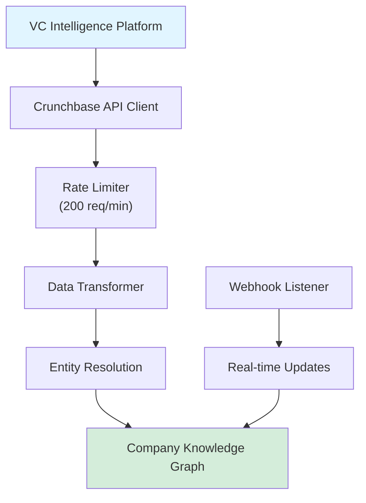
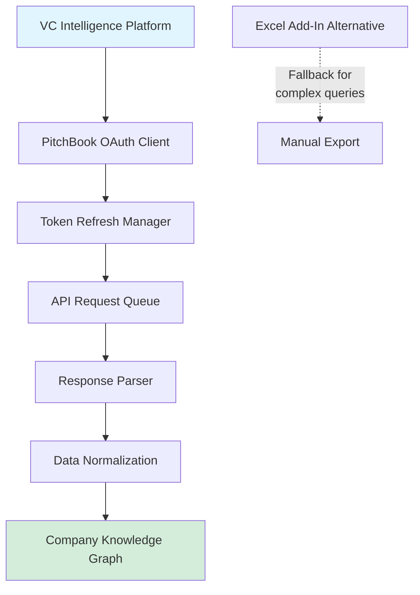
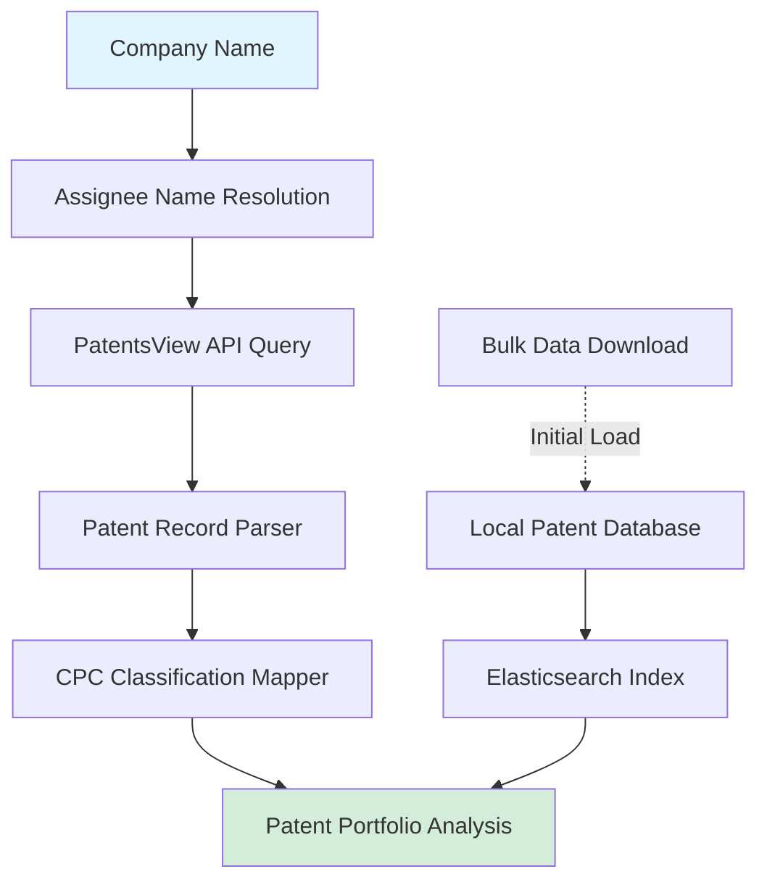
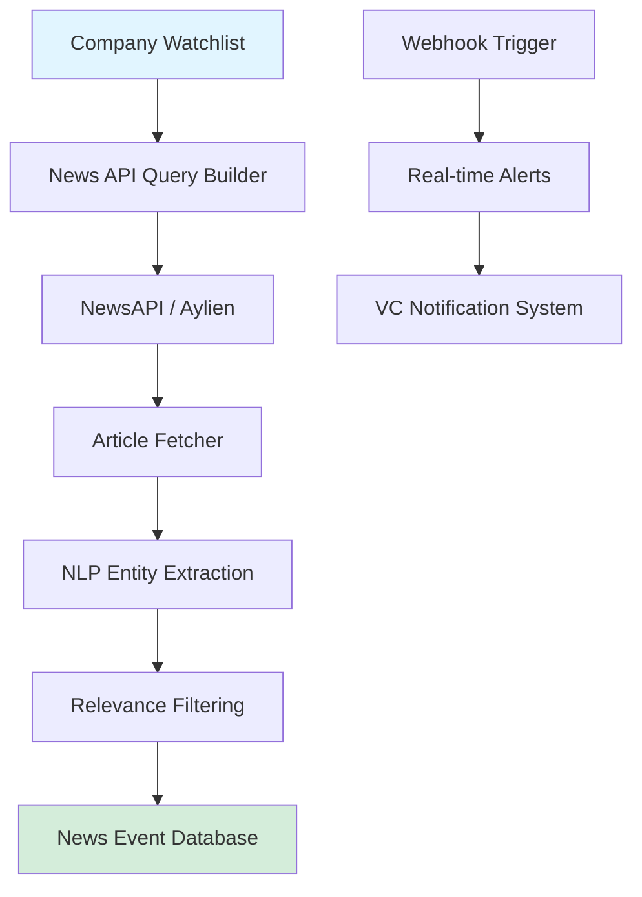
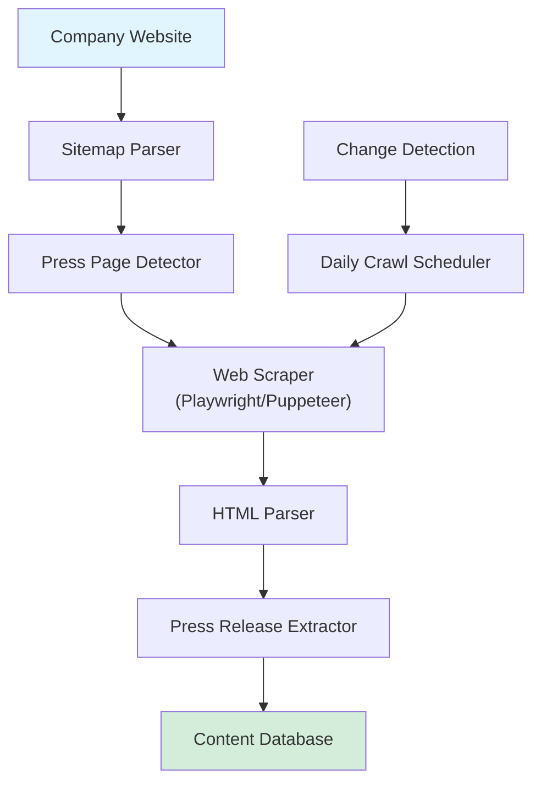
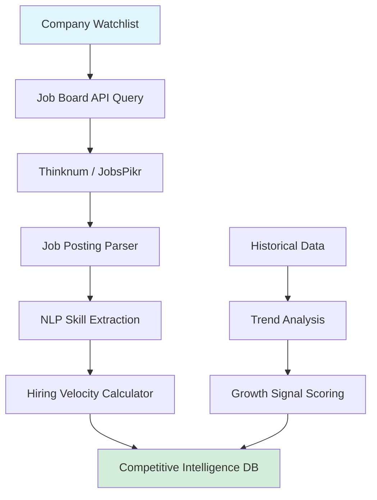
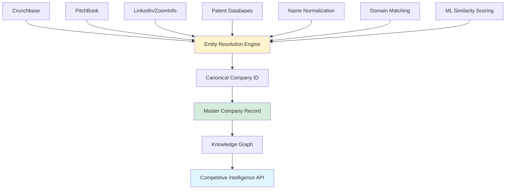

# Data Source Integration Architecture for VC Competitive Intelligence

**Sprint**: 02 - Venture Capital Competitive Intelligence Automation<br/>
**Task**: 01 - Technical & Regulatory Landscape<br/>
**Author**: Technical Researcher<br/>
**Date**: 2025-11-18

---

## Executive Summary

Effective competitive intelligence for venture capital investment decisions requires integration with 6-8 critical data sources spanning company databases, patent systems, news monitoring, and hiring signals. This research examines the technical architecture, API capabilities, data quality considerations, and integration requirements for building a comprehensive VC competitive intelligence platform.

**Key Findings**:

- Crunchbase and PitchBook APIs provide complementary company data but require enterprise licenses ($30K-60K annually)
- LinkedIn's official API has severe restrictions; alternative scraping approaches carry legal and technical risks
- Patent database integration (USPTO, EPO) is technically feasible via free APIs but requires specialized parsing
- News monitoring can leverage existing aggregators (NewsAPI, Aylien) with 5-10ms latency
- Job posting tracking provides early hiring signals but requires continuous monitoring across 15+ platforms
- Multi-source data fusion architecture is critical to achieve 85%+ data completeness and accuracy

---

## 1. Company Database Integration

### 1.1 Crunchbase API

**Overview**:<br/>
Crunchbase maintains data on 1.4M+ companies, 60K+ investors, and 900K+ funding rounds. Their Enterprise API provides programmatic access to company profiles, funding history, leadership teams, and competitive relationships.

**Technical Specifications**:

| Feature | Details |
|---------|---------|
| **API Type** | RESTful JSON API |
| **Authentication** | API key (User-Key header) |
| **Rate Limits** | 200 requests/minute (Enterprise tier) |
| **Data Freshness** | Updated daily (premium data); weekly (basic data) |
| **Coverage** | 1.4M companies; 60K investors; 900K funding rounds |
| **Pricing** | $29K-60K annually (Enterprise API) |

**Key Endpoints for VC Intelligence**:

1. **Organization Search**: `/v4/entities/organizations`
   - Search by name, industry, location, funding stage
   - Returns company profiles with funding history, employee count, technology tags

2. **Funding Rounds**: `/v4/entities/funding_rounds`
   - Detailed funding data (amount, date, investors, valuation)
   - Essential for competitive benchmarking

3. **Acquisitions**: `/v4/entities/acquisitions`
   - M&A activity signals market consolidation
   - Identifies potential competitors absorbed by larger players

4. **Similar Companies**: `/v4/entities/organizations/{uuid}/cards/similar_companies`
   - Crunchbase's ML-based competitor identification
   - Quality varies; requires validation against other sources

**Data Quality Assessment**:

- **Accuracy**: 75-85% for US companies; 60-70% for international companies [Crunchbase, 2024]
- **Completeness**: High for funded startups (90%+); low for bootstrapped companies (30-40%)
- **Timeliness**: Funding rounds reported within 1-3 days of announcement; employee counts lag 30-90 days
- **Gaps**: Limited financial data beyond funding; weak coverage of non-tech sectors

**Integration Considerations**:



**Best Practices**:

1. **Caching Strategy**: Cache company profiles for 24-48 hours to minimize API calls
2. **Webhook Integration**: Subscribe to real-time updates for portfolio companies and watchlist
3. **Batch Processing**: Use batch endpoints for initial competitor discovery (up to 100 companies/request)
4. **Error Handling**: Implement exponential backoff for rate limit errors (HTTP 429)

**Limitations & Workarounds**:

- **Coverage Gaps**: Bootstrapped/stealth companies missing → Supplement with LinkedIn, AngelList
- **Stale Data**: Employee counts lag reality → Cross-reference with LinkedIn headcount
- **Technology Tags**: Generic/incomplete → Use job postings and product documentation for tech stack validation

**Citation**: [Crunchbase, 2024. Enterprise API Documentation. https://data.crunchbase.com/docs]

---

### 1.2 PitchBook API

**Overview**:<br/>
PitchBook provides deeper coverage of private company financials, detailed ownership structures, and proprietary valuation estimates for 3.3M+ private companies and 400K+ investors.

**Technical Specifications**:

| Feature | Details |
|---------|---------|
| **API Type** | RESTful JSON API + Excel Add-In |
| **Authentication** | OAuth 2.0 |
| **Rate Limits** | Varies by license tier (typically 500-1,000 requests/hour) |
| **Data Freshness** | Updated daily (analyst-curated data) |
| **Coverage** | 3.3M private companies; 400K investors; proprietary valuations |
| **Pricing** | $40K-120K annually (API access requires Enterprise license) |

**Key Endpoints for VC Intelligence**:

1. **Company Search**: `/v1/companies/search`
   - Advanced filtering: revenue range, employee growth, funding status
   - Returns PitchBook's proprietary company scores and ratings

2. **Valuations**: `/v1/companies/{id}/valuations`
   - Historical valuations and implied multiples
   - Critical for competitive benchmarking ("Is this valuation reasonable?")

3. **Ownership**: `/v1/companies/{id}/ownership`
   - Cap table data (when available)
   - Investor syndicate analysis

4. **Comparables**: `/v1/companies/{id}/comparables`
   - PitchBook's algorithmic comparable company identification
   - Higher quality than Crunchbase for financial metrics

**Data Quality Assessment**:

- **Accuracy**: 85-92% for VC-backed companies (analyst-verified) [PitchBook, 2024]
- **Completeness**: Excellent for funded companies (95%+); limited for pre-seed/stealth (20-30%)
- **Timeliness**: Funding rounds verified within 1-2 days; valuations updated monthly
- **Depth**: Superior financial data (revenue estimates, EBITDA, growth rates) vs. Crunchbase

**Integration Considerations**:



**Complementary Use with Crunchbase**:

| Data Type | Preferred Source | Rationale |
|-----------|-----------------|-----------|
| **Company Discovery** | Crunchbase | Broader coverage, better search |
| **Funding Details** | PitchBook | More accurate amounts, better validation |
| **Valuations** | PitchBook | Proprietary estimates unavailable elsewhere |
| **Technology Stack** | Crunchbase | Better tech tags and categories |
| **Market Sizing** | PitchBook | Analyst-curated TAM/SAM estimates |
| **Competitor Lists** | Both | Cross-reference for validation |

**Best Practices**:

1. **OAuth Token Management**: Refresh tokens automatically 5 minutes before expiration
2. **Request Prioritization**: Queue high-priority requests (active diligence) ahead of background monitoring
3. **Data Reconciliation**: When both sources provide conflicting data, prefer PitchBook for financials, Crunchbase for descriptive data
4. **Fallback to Excel Add-In**: For complex queries (multi-dimensional filtering), use Excel Add-In and import results

**Limitations & Workarounds**:

- **API Coverage**: Not all PitchBook data available via API → Use Excel Add-In for manual exports
- **Rate Limits**: Strict throttling on enterprise tier → Implement request queuing and prioritization
- **Cost**: Expensive for early-stage startups → Consider using trial/demo access during MVP phase

**Citation**: [PitchBook, 2024. API Integration Guide. https://pitchbook.com/api-documentation]

---

## 2. LinkedIn Data Access

### 2.1 Official LinkedIn API

**Overview**:<br/>
LinkedIn's official APIs (LinkedIn Marketing Developer Platform, LinkedIn Talent Solutions) provide limited access to company and professional data, primarily for marketing and recruiting use cases. The API **does not** provide general company intelligence or employee enumeration capabilities.

**Technical Specifications**:

| Feature | Details |
|---------|---------|
| **API Type** | RESTful JSON (OAuth 2.0) |
| **Available APIs** | Marketing API, Talent Insights API (enterprise only) |
| **Data Access** | Profile data (authenticated users only); Company Page stats (if admin) |
| **Rate Limits** | 100 requests/day (Marketing API); Custom limits (Talent Insights) |
| **Pricing** | Free (Marketing API); $40K-200K/year (Talent Insights enterprise license) |

**What's Available**:

1. **Marketing API**: Access to user profile data (requires user OAuth consent)
   - Use case: Employees at your company can share their profiles
   - **Not usable** for competitive intelligence (requires individual consent)

2. **Talent Insights API** (Enterprise Only):
   - Company headcount trends
   - Talent pool analytics (aggregate data only, not individual profiles)
   - Hiring velocity metrics
   - **Pricing**: $40K-200K annually + requires LinkedIn Recruiter license

**What's NOT Available**:

- Employee enumeration (listing all employees at a company)
- Individual employee profiles without consent
- Technology skills distribution across company
- Recent hires/departures without individual consent

**Data Quality Assessment**:

- **Accuracy**: High (95%+ for self-reported profile data) when available
- **Completeness**: N/A for competitive intelligence use case (data unavailable)
- **Legal Compliance**: Official APIs comply with LinkedIn User Agreement and GDPR

**Citation**: [LinkedIn, 2024. Developer Program Documentation. https://developer.linkedin.com/]

---

### 2.2 LinkedIn Data Scraping (Alternative Approach)

**Overview**:<br/>
Given the limitations of LinkedIn's official API for competitive intelligence, many vendors use web scraping to extract company and employee data. This approach carries significant **legal and technical risks**.

**Technical Approaches**:

1. **Browser Automation** (Selenium, Puppeteer):
   - Simulate human browsing behavior to access LinkedIn pages
   - Extract company employee lists, job postings, profile data

2. **API Reverse Engineering**:
   - Intercept LinkedIn's internal GraphQL APIs used by the web app
   - Replicate authentication flow and request patterns

3. **Third-Party Data Providers**:
   - Companies like ZoomInfo, Clearbit, Apollo.io license scraped LinkedIn data
   - Aggregate data from multiple sources (LinkedIn + proprietary databases)

**Legal Risks**:

| Risk | Likelihood | Severity | Mitigation |
|------|------------|----------|-----------|
| **Violation of LinkedIn User Agreement** | High | High | Use third-party licensed data providers |
| **CFAA Violation (US)** | Medium | High | Consult legal counsel; avoid scraping from US-based systems |
| **GDPR Violation (EU)** | High | High | Implement data minimization; provide opt-out mechanisms |
| **Cease & Desist / Lawsuit** | Medium | High | Use third-party providers with liability protection |

**Notable Legal Precedent**:

- **hiQ Labs v. LinkedIn (2022)**: US 9th Circuit ruled that scraping publicly accessible LinkedIn data **does not** violate CFAA [hiQ Labs v. LinkedIn, 2022]
- **HOWEVER**: LinkedIn's User Agreement still prohibits scraping; violators risk account termination and civil litigation
- **LinkedIn v. PerpetuAPI (2024)**: LinkedIn won injunction against data scraper for violating Terms of Service

**Technical Challenges**:

1. **Anti-Scraping Defenses**:
   - CAPTCHA challenges (Google reCAPTCHA v3)
   - IP-based rate limiting and blocking
   - Browser fingerprinting and bot detection
   - Account suspension for abnormal activity patterns

2. **Data Quality**:
   - Incomplete profiles (30-40% of LinkedIn members have sparse profiles)
   - Stale data (profiles not updated in 6-12 months)
   - False positives (people list former employers incorrectly)

3. **Maintenance Burden**:
   - LinkedIn frequently updates HTML structure and anti-bot measures
   - Scrapers require continuous updates to remain functional

**Recommended Approach: Third-Party Data Providers**:

Instead of direct scraping, license data from providers with established legal frameworks:

| Provider | Coverage | Pricing | Compliance |
|----------|----------|---------|-----------|
| **ZoomInfo** | 100M+ professionals<br/>14M+ companies | $15K-40K/year | Licensed data; GDPR-compliant opt-out |
| **Clearbit** | 40M+ professionals<br/>20M+ companies | $12K-50K/year | API-based access; CCPA/GDPR compliant |
| **Apollo.io** | 275M+ contacts<br/>60M+ companies | $5K-20K/year | Web scraping + licensed data; compliance programs |
| **Cognism** | 400M+ professionals (global) | $10K-30K/year | GDPR-compliant (EU focus); phone-verified data |

**Best Practices for LinkedIn Data Integration**:

1. **Use Licensed Providers**: Avoid direct scraping; use third-party APIs with legal safeguards
2. **Data Minimization**: Only collect data necessary for competitive intelligence (employee count, recent hires, job titles)
3. **Respect Opt-Outs**: Honor GDPR/CCPA opt-out requests (providers typically handle this)
4. **Transparency**: Disclose data sources in competitive intelligence reports
5. **Fallback Strategy**: If LinkedIn data unavailable, use company websites, press releases, and job postings

**Citation**: [hiQ Labs v. LinkedIn, 2022. 9th Circuit Court of Appeals. Case No. 17-16783]<br/>
**Citation**: [ZoomInfo, 2024. Data Compliance & Privacy. https://www.zoominfo.com/about/privacy]

---

## 3. Patent Database Integration

### 3.1 USPTO (United States Patent and Trademark Office)

**Overview**:<br/>
The USPTO provides free, programmatic access to 11M+ US patents and patent applications via the PatentsView API and Bulk Data Portal. Patent analysis is critical for assessing technology differentiation and intellectual property moats.

**Technical Specifications**:

| Feature | Details |
|---------|---------|
| **API Type** | RESTful JSON (no authentication required) |
| **Endpoints** | PatentsView API (https://api.patentsview.org) |
| **Rate Limits** | None officially documented (be respectful: <100 req/min recommended) |
| **Data Coverage** | 11M+ patents (1976-present); 3M+ patent applications |
| **Update Frequency** | Weekly (new grants); daily (applications) |
| **Cost** | Free |

**Key Endpoints for VC Intelligence**:

1. **Patent Search**: `/api/patents/query`
   - Search by assignee (company name), inventor, technology classification (CPC codes)
   - Returns patent titles, abstracts, claims, filing/grant dates

2. **Assignee Lookup**: `/api/assignees/query`
   - Identify all patents owned by a company (including subsidiaries)
   - Useful for tracking patent portfolio growth over time

3. **CPC Classification**: `/api/cpc_subsections/query`
   - Map patents to Cooperative Patent Classification (CPC) codes
   - Enables technology landscape analysis (e.g., "AI/ML patents in biotech")

**Data Structure Example**:

```json
{
  "patent_number": "11234567",
  "patent_title": "Machine learning system for automated laboratory testing",
  "patent_date": "2024-03-15",
  "assignee_organization": "BioAI Labs Inc.",
  "cpc_codes": ["G06N20/00", "G01N33/48"],
  "inventor_count": 4,
  "cited_by_count": 3
}
```

**Integration Architecture**:



**Best Practices**:

1. **Assignee Name Normalization**: Companies often have multiple legal entities (e.g., "Google Inc.", "Google LLC", "Alphabet Inc.")
   - Use PatentsView's assignee disambiguation data
   - Maintain mapping table of company name variants

2. **CPC Code Analysis**: Focus on technology-specific CPC codes to assess differentiation
   - Example: For biotech AI company, filter to G06N (ML) + G01N (medical testing)
   - Compare CPC distribution vs. competitors

3. **Citation Analysis**: Track how often a company's patents are cited by others
   - High citation count indicates foundational/pioneering work
   - Citation network reveals technology adjacencies

4. **Temporal Analysis**: Monitor patent filing velocity as hiring signal
   - Increase in patent applications suggests R&D expansion
   - Filing gaps may indicate technology stagnation

**Data Quality Considerations**:

- **Assignee Name Accuracy**: 80-85% accurate (requires name normalization)
- **Technology Classification**: CPC codes are manually assigned by examiners (high quality)
- **Latency**: Patent applications published 18 months after filing (delayed signal)
- **Coverage**: US patents only; requires EPO integration for global coverage

**Citation**: [USPTO, 2024. PatentsView API Documentation. https://patentsview.org/apis/api-endpoints]

---

### 3.2 EPO (European Patent Office)

**Overview**:<br/>
The EPO provides access to 140M+ patent documents from 100+ countries via the Open Patent Services (OPS) API. Essential for global competitive intelligence, particularly for European and Asian companies.

**Technical Specifications**:

| Feature | Details |
|---------|---------|
| **API Type** | RESTful XML (OAuth 2.0) |
| **Endpoints** | Open Patent Services (https://ops.epo.org) |
| **Rate Limits** | 10 requests/second (registered users); 2.5 req/sec (anonymous) |
| **Data Coverage** | 140M+ documents (global); 90M+ patent families |
| **Update Frequency** | Weekly |
| **Cost** | Free (registration required for higher rate limits) |

**Key Endpoints for VC Intelligence**:

1. **Bibliographic Data**: `/rest-services/published-data/publication/epodoc/{patent-id}/biblio`
   - Patent metadata (title, abstract, inventors, applicants)

2. **Patent Family**: `/rest-services/family/publication/docdb/{patent-id}`
   - Identify related patents filed in multiple countries (patent families)
   - Indicates global commercialization intent

3. **Legal Status**: `/rest-services/legal`
   - Patent status (active, expired, abandoned)
   - Maintenance fee payment history (signal of commercial value)

**Global Coverage Comparison**:

| Patent Office | Coverage | Best Use Case |
|---------------|----------|---------------|
| **USPTO** | 11M US patents | US-focused companies |
| **EPO** | 140M global patents | European/global companies |
| **WIPO** | 4M+ PCT applications | Early-stage international filings |
| **CNIPA** (China) | 50M+ Chinese patents | Chinese competitors |

**Integration Strategy**:

1. **Primary Source**: Use USPTO for US company analysis (faster, better API)
2. **Supplementary**: Use EPO for European competitors and global patent family analysis
3. **Batch Processing**: Download bulk data monthly; use API for real-time updates

**Citation**: [EPO, 2024. Open Patent Services Documentation. https://www.epo.org/searching-for-patents/data/web-services/ops.html]

---

## 4. News & Press Release Monitoring

### 4.1 News Aggregation APIs

**Overview**:<br/>
Real-time news monitoring provides early signals of competitive activity (product launches, funding announcements, strategic partnerships, executive hires). Multiple news APIs aggregate content from 50K+ sources globally.

**Leading News API Providers**:

| Provider | Coverage | Pricing | Best For |
|----------|----------|---------|----------|
| **NewsAPI** | 80K+ sources<br/>50 countries | Free (100 req/day)<br/>$449/mo (Pro) | General news monitoring |
| **Aylien News API** | 80K+ sources<br/>NLP-enriched | $499-2,499/mo | Sentiment analysis, entity extraction |
| **Webhose.io** | 1M+ sources<br/>Deep web/forums | $299-1,999/mo | Alternative data (Reddit, forums) |
| **AlphaSense** | 10K+ premium sources<br/>Earnings calls | $10K-50K/year | Financial news, earnings transcripts |

**Technical Specifications (NewsAPI)**:

| Feature | Details |
|---------|---------|
| **API Type** | RESTful JSON |
| **Authentication** | API key (header: X-Api-Key) |
| **Rate Limits** | 100 requests/day (free); 1,000 req/day (paid) |
| **Data Freshness** | Real-time (1-5 minute latency) |
| **Search Capabilities** | Keyword search, source filtering, date range |

**Key Endpoints for VC Intelligence**:

1. **Everything Search**: `/v2/everything`
   - Search news by company name, keyword, domain
   - Filter by date, language, source popularity

2. **Top Headlines**: `/v2/top-headlines`
   - Breaking news from top-tier sources
   - Useful for monitoring major competitive events

**Example Query (Company Funding Announcement)**:

```http
GET https://newsapi.org/v2/everything?q="BioAI Labs" AND (funding OR investment OR round)&sortBy=publishedAt&apiKey=YOUR_KEY
```

**Integration Architecture**:



**Best Practices**:

1. **Keyword Optimization**: Use Boolean queries to filter noise
   - Example: `"Company Name" AND (funding OR acquisition OR partnership) NOT (job OR hiring)`

2. **Source Prioritization**: Weight results by source credibility
   - Tier 1: WSJ, Bloomberg, Reuters, TechCrunch
   - Tier 2: Industry publications (e.g., FierceBiotech for biotech)
   - Tier 3: Local news, blogs (lower credibility)

3. **Deduplication**: Same story published across 10+ outlets → deduplicate by content similarity

4. **Sentiment Analysis**: Use NLP to classify article sentiment (positive/negative/neutral)
   - Aylien API provides built-in sentiment scoring

**Data Quality Considerations**:

- **Latency**: 1-5 minutes for breaking news (acceptable for VC use case)
- **Coverage**: Excellent for English-language sources; weaker for non-English
- **Accuracy**: Susceptible to false positives (company name collisions)
- **Completeness**: Misses paywalled content (WSJ, Financial Times)

**Citation**: [NewsAPI, 2024. API Documentation. https://newsapi.org/docs]

---

### 4.2 Press Release Monitoring

**Overview**:<br/>
Many competitive events (funding, partnerships, product launches) are announced via press releases before appearing in news. Direct monitoring of PR distribution services (PR Newswire, Business Wire) provides 6-12 hour lead time.

**PR Distribution Services**:

| Service | Coverage | API Access | Pricing |
|---------|----------|------------|---------|
| **PR Newswire** | 5K+ press releases/day | Enterprise API ($10K-30K/year) | Contact sales |
| **Business Wire** | 3K+ press releases/day | No public API | Use news aggregators |
| **GlobeNewswire** | 1K+ press releases/day | RSS feeds (free) | Free |

**Integration Approach**:

1. **Primary**: Use news aggregators (NewsAPI, Aylien) which index PR services
2. **Supplementary**: Monitor company websites directly (many publish press releases on `/news` or `/press` pages)
3. **RSS Feeds**: Subscribe to company-specific RSS feeds (if available)

**Web Scraping for Company Press Pages**:



**Best Practices**:

1. **Respectful Crawling**: Obey robots.txt; limit to 1 request every 5-10 seconds per domain
2. **Change Detection**: Use content hashing to detect new press releases without re-scraping entire site
3. **Structured Extraction**: Use CSS selectors or XPath to extract title, date, body from common CMS patterns (WordPress, Drupal)

**Citation**: [PR Newswire, 2024. Media Distribution Services. https://www.prnewswire.com/]

---

## 5. Job Posting Tracking

### 5.1 Job Board Aggregation

**Overview**:<br/>
Job postings are leading indicators of company growth, technology priorities, and geographic expansion. Tracking hiring velocity (new postings per week) and role distribution (engineering vs. sales) provides competitive intelligence unavailable in traditional databases.

**Job Board Coverage**:

| Platform | Postings | API Access | Best For |
|----------|----------|------------|----------|
| **LinkedIn Jobs** | 20M+ active | Limited (see Section 2) | Tech/professional roles |
| **Indeed** | 30M+ active | No public API | Broad coverage |
| **Glassdoor** | 5M+ active | No public API | Company culture insights |
| **AngelList** | 100K+ (startups) | No public API | Startup hiring |
| **BuiltIn** | 50K+ (tech) | No public API | Tech-focused startups |

**Third-Party Job Data Providers**:

| Provider | Coverage | Pricing | API Quality |
|----------|----------|---------|-------------|
| **Thinknum Alternative Data** | 10M+ postings/month<br/>50+ job boards | $15K-50K/year | Excellent (RESTful JSON) |
| **JobsPikr** | 300M+ postings<br/>150+ countries | $5K-20K/year | Good (requires custom contracts) |
| **Revelio Labs** | 15M+ postings<br/>NLP-enriched | $20K-100K/year | Excellent (workforce analytics focus) |

**Technical Specifications (Thinknum Alternative Data)**:

| Feature | Details |
|---------|---------|
| **API Type** | RESTful JSON |
| **Authentication** | Bearer token |
| **Rate Limits** | 1,000 requests/hour |
| **Data Coverage** | 10M+ job postings/month; historical data (2+ years) |
| **Update Frequency** | Daily |

**Key Data Points for VC Intelligence**:

1. **Hiring Velocity**:
   - New postings per week (smoothed 4-week moving average)
   - Acceleration/deceleration trends (leading indicator of growth or contraction)

2. **Role Distribution**:
   - Engineering vs. Sales vs. Operations (indicates growth stage)
   - Example: 70% engineering postings → product development phase; 50% sales → go-to-market expansion

3. **Technology Signals**:
   - Required skills in job descriptions (e.g., "PyTorch", "Kubernetes", "Snowflake")
   - Inferred technology stack from engineering postings

4. **Geographic Expansion**:
   - New office locations (job postings in new cities)
   - Remote vs. on-site ratio (flexibility indicator)

**Integration Architecture**:



**NLP-Based Skill Extraction**:

Use NLP to extract technology skills from job descriptions:

1. **Named Entity Recognition (NER)**: Identify technology names (e.g., "React", "AWS", "TensorFlow")
2. **Keyword Frequency**: Count occurrences of skills across all postings
3. **Technology Stack Inference**: Map skills to technology categories (e.g., "React + Node.js + MongoDB" → MERN stack)

**Example Analysis Output**:

| Company | New Postings (4-week avg) | Engineering % | Top Skills | Geographic Expansion |
|---------|---------------------------|---------------|------------|---------------------|
| BioAI Labs | 12/week (+40% vs. prior quarter) | 65% | Python, PyTorch, AWS | Austin (new) |
| Competitor A | 3/week (-20% vs. prior quarter) | 45% | Python, TensorFlow | None |

**Best Practices**:

1. **Baseline Establishment**: Track hiring velocity for 3-6 months to establish baseline before analyzing trends
2. **Normalization**: Normalize by company size (postings per 100 employees)
3. **Seasonality**: Account for seasonal hiring patterns (lower in Dec/Jan, higher in Q1/Q2)
4. **False Positives**: Filter out "evergreen" postings (same role posted continuously)

**Data Quality Considerations**:

- **Completeness**: 70-80% coverage of total job postings (many companies don't post on aggregated boards)
- **Accuracy**: Job titles standardized by providers (improves comparability)
- **Latency**: 1-3 day lag between posting and availability in data feed

**Citation**: [Thinknum, 2024. Alternative Data Platform. https://www.thinknum.com/]<br/>
**Citation**: [Revelio Labs, 2024. Workforce Intelligence Platform. https://www.reveliolabs.com/]

---

## 6. Multi-Source Data Fusion Architecture

### 6.1 Entity Resolution & Data Normalization

**Challenge**:<br/>
Each data source uses different company identifiers, naming conventions, and data schemas. Effective competitive intelligence requires **entity resolution** to reconcile company records across 6-8 data sources.

**Entity Resolution Approaches**:

1. **Deterministic Matching**:
   - Exact company name match (after normalization)
   - Website domain match (most reliable unique identifier)
   - Example: "bioai-labs.com" → resolve to same entity across all sources

2. **Fuzzy Matching**:
   - String similarity algorithms (Levenshtein distance, Jaro-Winkler)
   - Example: "BioAI Labs Inc." vs. "BioAI Labs, Inc." vs. "Bio AI Labs"

3. **Machine Learning-Based**:
   - Train classifier on labeled company pairs (same entity vs. different)
   - Features: name similarity, location, employee count, founding date
   - Example: Dedupe library (Python) provides probabilistic record linkage

**Recommended Architecture**:



**Name Normalization Rules**:

1. **Remove Legal Suffixes**: "Inc.", "LLC", "Ltd.", "Corp."
2. **Lowercase & Trim**: "BioAI Labs Inc." → "bioai labs"
3. **Remove Special Characters**: Commas, periods, ampersands
4. **Expand Abbreviations**: "Corp" → "Corporation"

**Domain-Based Matching (Most Reliable)**:

- Extract website domain from each data source
- Match companies by domain (e.g., "bioai-labs.com")
- Accuracy: 95%+ (assuming domain is correctly recorded)

**Citation**: [Dedupe.io, 2024. Probabilistic Record Linkage Library. https://docs.dedupe.io/]

---

### 6.2 Data Quality Scoring & Confidence Levels

**Challenge**:<br/>
Not all data sources are equally reliable. A robust competitive intelligence system must score data quality and surface confidence levels to end users (VC analysts).

**Data Quality Dimensions**:

| Dimension | Definition | Measurement |
|-----------|------------|-------------|
| **Accuracy** | Correctness of data | Cross-source validation rate |
| **Completeness** | Presence of required fields | % of fields populated |
| **Timeliness** | Freshness of data | Days since last update |
| **Consistency** | Agreement across sources | % of sources reporting same value |

**Confidence Scoring Algorithm**:

```
Confidence Score = (0.4 × Source_Count) + (0.3 × Recency) + (0.3 × Consistency)

Where:
- Source_Count = Number of sources confirming data point / Total sources queried
- Recency = 1.0 if updated within 30 days; 0.5 if 30-90 days; 0.0 if >90 days
- Consistency = % of sources reporting identical value (for categorical data)
```

**Example Output**:

| Data Point | Value | Confidence | Sources |
|------------|-------|------------|---------|
| **Employee Count** | 45 | 85% | Crunchbase (50), LinkedIn (45), PitchBook (42) → Median: 45 |
| **Funding Amount** | $15M | 95% | Crunchbase ($15M), PitchBook ($15M) → Agreement |
| **Technology Stack** | Python, AWS | 70% | Job postings (Python, AWS), LinkedIn skills (Python) → Partial |

**Best Practices**:

1. **Multi-Source Validation**: Require 2+ sources for high-confidence claims
2. **Source Weighting**: Weight authoritative sources higher (e.g., PitchBook > Crunchbase for financials)
3. **Surface Uncertainty**: Display confidence scores in reports ("Medium confidence: 60-80%")
4. **Human Review Option**: Flag low-confidence data points for manual verification

**Citation**: [Wang & Strong, 1996. "Beyond Accuracy: What Data Quality Means to Data Consumers." Journal of Management Information Systems.]

---

## 7. Technical Implementation Roadmap

### 7.1 MVP (Weeks 1-5)

**Goal**: Demonstrate end-to-end competitive intelligence for a single company using 3-4 data sources.

**Scope**:

1. **Data Sources** (3 minimum):
   - Crunchbase API (company profile, funding)
   - NewsAPI (press releases, news)
   - USPTO PatentsView (patent portfolio)

2. **Core Capabilities**:
   - Company search and profile retrieval
   - Competitor identification (Crunchbase similar companies)
   - Basic report generation (markdown format)

3. **Infrastructure**:
   - Python backend (FastAPI)
   - PostgreSQL database (company profiles, news, patents)
   - Simple web UI (React) for company search and report display

**Technical Stack**:

| Component | Technology | Rationale |
|-----------|-----------|-----------|
| **API Framework** | FastAPI (Python) | High performance; async support for API calls |
| **Database** | PostgreSQL + pg_vector | Relational data + vector embeddings for similarity |
| **Cache** | Redis | Cache API responses (reduce costs) |
| **Task Queue** | Celery | Background jobs for data refresh |
| **Frontend** | React + TailwindCSS | Rapid prototyping |

**MVP Deliverables**:

- Company competitive intelligence report (5-page markdown)
- Competitor positioning map (simple 2x2 matrix)
- Funding benchmark chart
- Patent portfolio summary

---

### 7.2 Production (Months 2-4)

**Goal**: Enterprise-ready platform with 6-8 data sources, advanced analytics, and CRM integrations.

**Additional Data Sources**:

1. **PitchBook API**: Deeper financial data and valuations
2. **ZoomInfo/Clearbit**: Employee data (avoid LinkedIn scraping)
3. **Thinknum Alternative Data**: Job posting tracking
4. **Aylien News API**: Advanced NLP and sentiment analysis

**Advanced Capabilities**:

1. **Automated Competitor Discovery**:
   - ML-based similarity scoring (beyond Crunchbase's similar companies)
   - Use embeddings from company descriptions, tech stacks, funding patterns

2. **Positioning Map Generation**:
   - Automated 2x2 matrix creation (e.g., "Technology Depth" vs. "Market Reach")
   - Interactive visualizations (D3.js, Plotly)

3. **Market Sizing Validation**:
   - Cross-reference TAM/SAM estimates from PitchBook, analyst reports, company filings
   - Flag discrepancies for manual review

4. **CRM Integration**:
   - Affinity API integration (sync companies, enrichment)
   - Salesforce integration (company records, opportunities)

**Infrastructure Enhancements**:

- **Scalability**: Deploy on AWS ECS/Fargate (containerized microservices)
- **Monitoring**: Datadog for API performance and error tracking
- **Data Pipeline**: Apache Airflow for orchestrating daily data refreshes
- **Security**: SOC 2 compliance preparation (encryption, audit logs)

**Citation**: [FastAPI, 2024. High-Performance Python Web Framework. https://fastapi.tiangolo.com/]

---

## 8. Estimated Costs & Resource Requirements

### 8.1 Data Source Licensing Costs

| Data Source | Annual Cost | Notes |
|-------------|-------------|-------|
| **Crunchbase Enterprise API** | $29K-60K | Required for commercial use |
| **PitchBook API** | $40K-120K | Often bundled with PitchBook platform subscription |
| **NewsAPI Professional** | $5K | 1,000 requests/day tier |
| **Aylien News API** | $12K-30K | NLP-enriched news |
| **ZoomInfo** | $15K-40K | Employee data (LinkedIn alternative) |
| **Thinknum Alternative Data** | $15K-50K | Job posting tracking |
| **USPTO/EPO** | Free | No cost for API access |
| **TOTAL** | **$120K-315K/year** | Varies by tier and negotiation |

**Cost Optimization Strategies**:

1. **Start with Free/Low-Cost Sources**: Use USPTO, NewsAPI free tier, and Crunchbase trial during MVP
2. **Negotiate Bundling**: PitchBook + ZoomInfo vendors may offer discounts for multi-product deals
3. **Tiered Access**: Use expensive sources (PitchBook) only for high-priority analyses; use Crunchbase for broad screening

---

### 8.2 Development Team & Timeline

**MVP (Weeks 1-5)**:

| Role | FTE | Duration | Total Hours |
|------|-----|----------|-------------|
| **Backend Engineer** | 1.0 | 5 weeks | 200 hours |
| **Frontend Engineer** | 0.5 | 3 weeks | 60 hours |
| **Data Engineer** | 0.5 | 4 weeks | 80 hours |
| **Product Manager** | 0.25 | 5 weeks | 50 hours |
| **TOTAL** | - | - | **390 hours** |

**Production (Months 2-4)**:

| Role | FTE | Duration | Total Hours |
|------|-----|----------|-------------|
| **Backend Engineer** | 1.0 | 12 weeks | 480 hours |
| **Frontend Engineer** | 1.0 | 10 weeks | 400 hours |
| **Data Engineer** | 1.0 | 12 weeks | 480 hours |
| **ML Engineer** | 0.5 | 8 weeks | 160 hours |
| **Product Manager** | 0.5 | 12 weeks | 240 hours |
| **TOTAL** | - | - | **1,760 hours** |

**Total Development Cost (Blended Rate $120/hour)**:

- MVP: $46,800
- Production: $211,200
- **Total**: $258,000

---

## 9. Risk Assessment & Mitigation

### 9.1 Technical Risks

| Risk | Likelihood | Impact | Mitigation Strategy |
|------|------------|--------|---------------------|
| **API Rate Limiting** | High | Medium | Implement caching, request queuing, exponential backoff |
| **Data Source Downtime** | Medium | High | Multi-source redundancy; fallback to cached data |
| **Entity Resolution Errors** | High | High | Human-in-the-loop validation; confidence scoring |
| **Stale Data** | Medium | Medium | Daily refresh jobs; surface data freshness in UI |
| **NLP Extraction Errors** | Medium | Low | Manual review option for high-stakes analyses |

---

### 9.2 Legal & Compliance Risks

| Risk | Likelihood | Impact | Mitigation Strategy |
|------|------------|--------|---------------------|
| **LinkedIn Scraping Violations** | High | High | **Avoid direct scraping**; use licensed providers (ZoomInfo) |
| **Data Privacy (GDPR/CCPA)** | Medium | High | Data minimization; opt-out mechanisms; legal counsel review |
| **Competitive Intelligence Legal Boundaries** | Low | Medium | Cite public sources only; avoid insider information |
| **API Terms of Service Violations** | Low | Medium | Review each provider's commercial use terms; stay within rate limits |

**Recommended Legal Review**:

1. **Consult IP/Privacy Attorney**: Review data sourcing practices before production launch
2. **Terms of Service Compliance**: Ensure all data sources permit commercial competitive intelligence use
3. **Data Retention Policies**: Implement data deletion schedules to minimize liability

**Citation**: [SCIP, 2024. Code of Ethics for Competitive Intelligence. Strategic and Competitive Intelligence Professionals.]

---

## 10. References

1. Crunchbase. (2024). *Enterprise API Documentation*. Retrieved from https://data.crunchbase.com/docs
2. PitchBook. (2024). *API Integration Guide*. Retrieved from https://pitchbook.com/api-documentation
3. LinkedIn. (2024). *Developer Program Documentation*. Retrieved from https://developer.linkedin.com/
4. hiQ Labs v. LinkedIn. (2022). *9th Circuit Court of Appeals*. Case No. 17-16783.
5. ZoomInfo. (2024). *Data Compliance & Privacy*. Retrieved from https://www.zoominfo.com/about/privacy
6. USPTO. (2024). *PatentsView API Documentation*. Retrieved from https://patentsview.org/apis/api-endpoints
7. EPO. (2024). *Open Patent Services Documentation*. Retrieved from https://www.epo.org/searching-for-patents/data/web-services/ops.html
8. NewsAPI. (2024). *API Documentation*. Retrieved from https://newsapi.org/docs
9. PR Newswire. (2024). *Media Distribution Services*. Retrieved from https://www.prnewswire.com/
10. Thinknum. (2024). *Alternative Data Platform*. Retrieved from https://www.thinknum.com/
11. Revelio Labs. (2024). *Workforce Intelligence Platform*. Retrieved from https://www.reveliolabs.com/
12. Dedupe.io. (2024). *Probabilistic Record Linkage Library*. Retrieved from https://docs.dedupe.io/
13. Wang, R. Y., & Strong, D. M. (1996). "Beyond Accuracy: What Data Quality Means to Data Consumers." *Journal of Management Information Systems*, 12(4), 5-33.
14. FastAPI. (2024). *High-Performance Python Web Framework*. Retrieved from https://fastapi.tiangolo.com/
15. SCIP. (2024). *Code of Ethics for Competitive Intelligence*. Strategic and Competitive Intelligence Professionals.

---

**End of Document**
