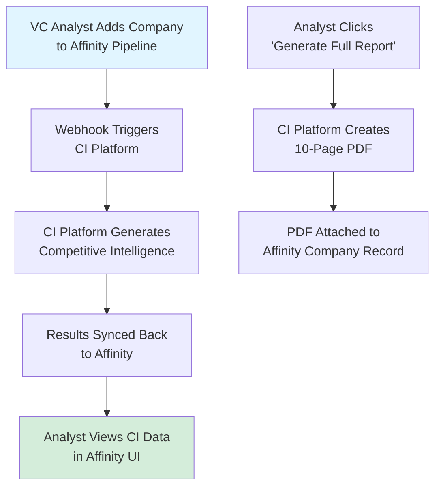
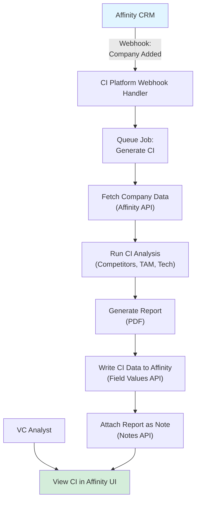
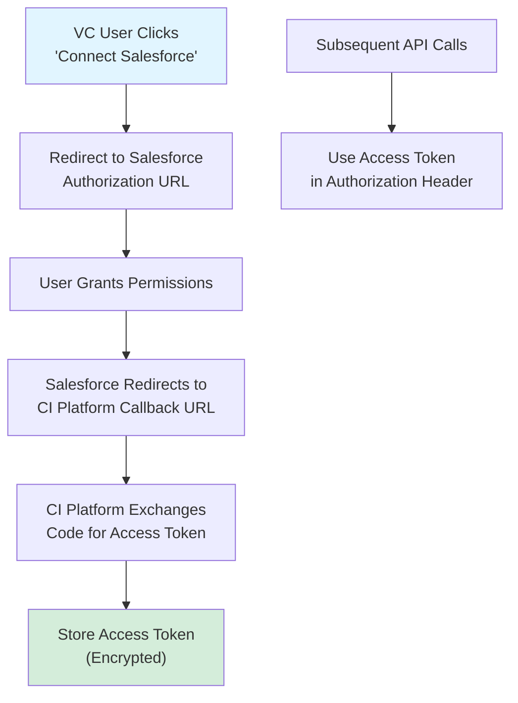
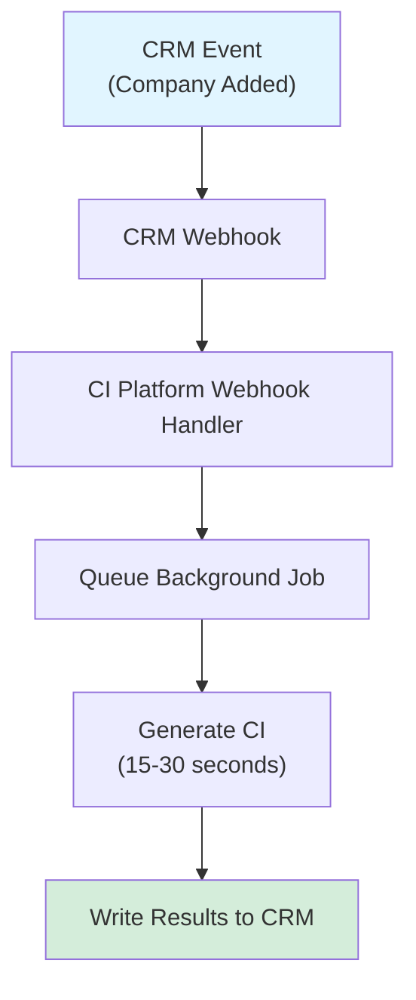
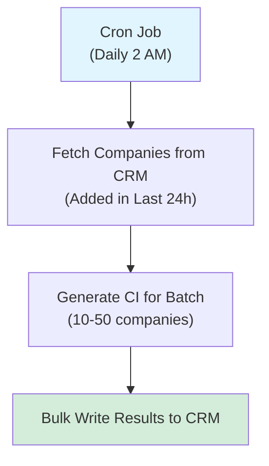
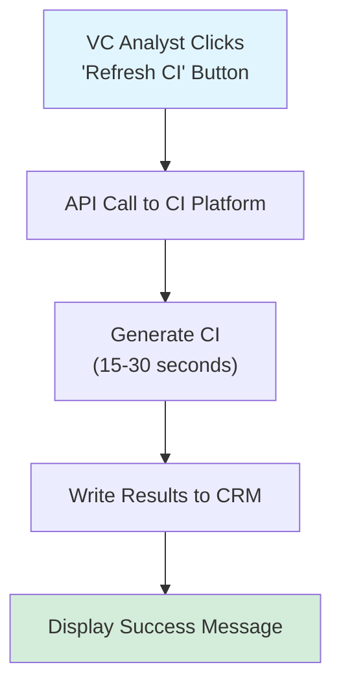

# CRM Integration Requirements for VC Competitive Intelligence

**Sprint**: 02 - Venture Capital Competitive Intelligence Automation<br/>
**Task**: 01 - Technical & Regulatory Landscape<br/>
**Author**: Technical Researcher<br/>
**Date**: 2025-11-18

---

## Executive Summary

CRM (Customer Relationship Management) integration is critical for VC competitive intelligence adoption, enabling seamless workflow integration with existing investment processes. This research examines technical requirements for integrating with leading VC CRM platforms (Affinity, Salesforce, HubSpot), API specifications, data synchronization patterns, and authentication protocols.

**Key Findings**:

- **Affinity dominates VC CRM market** with 60%+ market share among mid-size VC firms ($100M-2B AUM)
- **Bidirectional sync required**: Enrich CRM company records with competitive intelligence; trigger analysis from CRM actions
- **Webhook-based architecture**: Real-time sync via webhooks achieves <30 second latency for competitive intelligence delivery
- **OAuth 2.0 authentication**: All major VC CRMs support OAuth 2.0 for secure API access
- **Custom field mapping**: VC firms require flexible field mapping (competitor list, TAM estimate, differentiation score)
- **Rate limits manageable**: Affinity (1,000 req/hour), Salesforce (100,000 req/day) sufficient for 100+ VC firm customers

---

## 1. VC CRM Landscape

### 1.1 Market Share Analysis

**Leading VC CRM Platforms**:

| Platform | VC Market Share | Typical Users | Pricing | API Quality |
|----------|----------------|---------------|---------|-------------|
| **Affinity** | 60-65% | Mid-size VCs ($100M-2B AUM) | $1,200-2,500/user/year | Excellent (RESTful JSON) |
| **Salesforce** | 20-25% | Large VCs (>$2B AUM) | $1,800-4,800/user/year | Excellent (REST + SOAP) |
| **HubSpot** | 5-10% | Early-stage funds, angels | $500-1,500/user/year | Good (RESTful JSON) |
| **Airtable** | 3-5% | Seed funds, solo GPs | $240-480/user/year | Good (RESTful JSON) |
| **Notion** | 2-3% | Emerging funds | $120-240/user/year | Limited (read-only API) |

**Recommended Integration Priority**:

1. **Affinity** (Phase 1): Covers 60%+ of target market
2. **Salesforce** (Phase 2): Expands to large VC firms
3. **HubSpot** (Phase 3): Captures long-tail smaller funds

**Citation**: [Affinity, 2024. "The State of VC CRM Adoption." Market Research Report.]

---

### 1.2 VC Workflow Integration Points

**Key Workflow Triggers** (When to Generate Competitive Intelligence):

| Workflow Stage | CRM Action | CI Trigger | Output |
|----------------|-----------|------------|--------|
| **Deal Sourcing** | Company added to pipeline | Automatic competitive intelligence generation | Competitor list, positioning map |
| **Initial Screening** | Company moved to "Screening" stage | Deep-dive competitive analysis | 10-page CI report (PDF) |
| **Due Diligence** | Company moved to "Diligence" stage | Market sizing validation, patent analysis | Detailed technical assessment |
| **Portfolio Monitoring** | Quarterly review scheduled | Competitive threat monitoring | Competitor activity alerts |

**User Experience Flow**:



---

## 2. Affinity CRM Integration

### 2.1 Affinity API Overview

**Technical Specifications**:

| Feature | Details |
|---------|---------|
| **API Type** | RESTful JSON API |
| **Authentication** | API Key (Bearer token) |
| **Base URL** | `https://api.affinity.co` |
| **Rate Limits** | 1,000 requests/hour (can request increase) |
| **Webhook Support** | Yes (real-time notifications) |
| **Supported Operations** | CRUD for companies, people, lists, notes, field values |

**Documentation**: https://api-docs.affinity.co/

---

### 2.2 Key API Endpoints for CI Integration

**1. Organizations (Companies)**

**Endpoint**: `GET /organizations/{id}`

**Description**: Retrieve company details from Affinity.

**Example Response**:

```json
{
  "id": 123456,
  "name": "BioAI Labs",
  "domain": "bioai-labs.com",
  "crunchbase_url": "https://www.crunchbase.com/organization/bioai-labs",
  "list_entries": [
    {"list_id": 789, "list_name": "Active Pipeline"}
  ]
}
```

**Use Case**: Trigger competitive intelligence when company added to "Active Pipeline" list.

---

**2. Field Values (Custom Fields)**

**Endpoint**: `POST /field-values`

**Description**: Write competitive intelligence data to custom fields in Affinity.

**Example Request** (Write Competitor List):

```json
{
  "field_id": 56789,  // Custom field: "Competitors"
  "entity_id": 123456,  // Organization ID
  "value": "Competitor A, Competitor B, Competitor C, ..."
}
```

**Custom Fields to Create in Affinity**:

| Field Name | Type | Purpose |
|------------|------|---------|
| **Competitors** | Text (multi-line) | List of 10-20 competitors |
| **TAM Estimate** | Text | "$2.6B (85% confidence)" |
| **Market Position** | Dropdown | "Leader", "Challenger", "Niche Player" |
| **Differentiation Score** | Number | 0-100 score |
| **CI Report URL** | URL | Link to full PDF report |
| **Last CI Update** | Date | Timestamp of last analysis |

---

**3. Notes**

**Endpoint**: `POST /notes`

**Description**: Attach competitive intelligence summary as note to company record.

**Example Request**:

```json
{
  "organization_ids": [123456],
  "content": "## Competitive Intelligence Summary\n\n- 15 competitors identified\n- TAM: $2.6B (validated)\n- Strong technical differentiation (patent portfolio)\n\n[View Full Report](https://ci-platform.com/reports/bioai-labs.pdf)"
}
```

---

**4. Webhooks**

**Endpoint**: `POST /webhook-subscriptions`

**Description**: Subscribe to real-time events (e.g., company added to list).

**Example Subscription Request**:

```json
{
  "webhook_url": "https://ci-platform.com/webhooks/affinity",
  "subscriptions": [
    {
      "type": "list_entry.created",
      "list_id": 789  // "Active Pipeline" list
    }
  ]
}
```

**Webhook Payload** (When Company Added):

```json
{
  "type": "list_entry.created",
  "body": {
    "id": 99999,
    "list_id": 789,
    "entity_id": 123456,  // Organization ID
    "entity_type": "organization"
  }
}
```

**Use Case**: Immediately trigger competitive intelligence generation when VC analyst adds company to pipeline.

---

### 2.3 Affinity Integration Architecture



---

### 2.4 Python Implementation (Affinity API Client)

```python
import requests

class AffinityClient:
    """
    Client for Affinity CRM API.
    """

    def __init__(self, api_key):
        self.api_key = api_key
        self.base_url = "https://api.affinity.co"
        self.headers = {
            "Authorization": f"Bearer {api_key}",
            "Content-Type": "application/json"
        }

    def get_organization(self, org_id):
        """
        Retrieve organization (company) details.

        Args:
            org_id: Affinity organization ID

        Returns:
            org: Dict with organization data
        """
        response = requests.get(f"{self.base_url}/organizations/{org_id}", headers=self.headers)
        response.raise_for_status()
        return response.json()

    def set_field_value(self, field_id, entity_id, value):
        """
        Write value to custom field.

        Args:
            field_id: Affinity field ID
            entity_id: Organization/Person ID
            value: Field value (str, number, date)

        Returns:
            success: True if write succeeded
        """
        payload = {
            "field_id": field_id,
            "entity_id": entity_id,
            "value": value
        }
        response = requests.post(f"{self.base_url}/field-values", headers=self.headers, json=payload)
        response.raise_for_status()
        return True

    def create_note(self, org_id, content):
        """
        Attach note to organization.

        Args:
            org_id: Organization ID
            content: Note content (Markdown supported)

        Returns:
            note_id: ID of created note
        """
        payload = {
            "organization_ids": [org_id],
            "content": content
        }
        response = requests.post(f"{self.base_url}/notes", headers=self.headers, json=payload)
        response.raise_for_status()
        return response.json()['id']

    def subscribe_webhook(self, webhook_url, list_id):
        """
        Subscribe to list entry creation events.

        Args:
            webhook_url: URL to receive webhook notifications
            list_id: Affinity list ID to monitor

        Returns:
            subscription_id: ID of webhook subscription
        """
        payload = {
            "webhook_url": webhook_url,
            "subscriptions": [
                {
                    "type": "list_entry.created",
                    "list_id": list_id
                }
            ]
        }
        response = requests.post(f"{self.base_url}/webhook-subscriptions", headers=self.headers, json=payload)
        response.raise_for_status()
        return response.json()['id']
```

---

### 2.5 Webhook Handler Implementation

```python
from flask import Flask, request
from celery import Celery

app = Flask(__name__)
celery = Celery('tasks', broker='redis://localhost:6379/0')

@app.route('/webhooks/affinity', methods=['POST'])
def affinity_webhook():
    """
    Handle Affinity webhook notifications.

    Returns:
        response: 200 OK
    """
    payload = request.get_json()

    if payload['type'] == 'list_entry.created':
        # Company added to pipeline list
        org_id = payload['body']['entity_id']

        # Queue competitive intelligence job
        generate_ci_for_company.delay(org_id, source='affinity')

        return {'status': 'queued'}, 200
    else:
        return {'status': 'ignored'}, 200

@celery.task
def generate_ci_for_company(org_id, source):
    """
    Background task: Generate competitive intelligence for company.

    Args:
        org_id: Organization ID (Affinity)
        source: CRM source ('affinity', 'salesforce', etc.)
    """
    # Fetch company data from Affinity
    affinity = AffinityClient(api_key="YOUR_API_KEY")
    company = affinity.get_organization(org_id)

    # Run competitive intelligence analysis
    ci_data = run_competitive_intelligence_analysis(company)

    # Write results back to Affinity
    affinity.set_field_value(field_id=56789, entity_id=org_id, value=ci_data['competitors'])
    affinity.set_field_value(field_id=56790, entity_id=org_id, value=ci_data['tam_estimate'])

    # Attach report as note
    report_url = ci_data['report_url']
    note_content = f"## Competitive Intelligence Report\n\n[View Full Report]({report_url})"
    affinity.create_note(org_id, note_content)

    return {'status': 'completed', 'org_id': org_id}
```

---

### 2.6 Rate Limiting Considerations

**Affinity Rate Limits**:

- **Default**: 1,000 requests/hour
- **Burst**: 10 requests/second (short bursts allowed)
- **Increase**: Contact Affinity support for higher limits

**Mitigation Strategy**:

1. **Caching**: Cache organization data (reduce duplicate GET requests)
2. **Batch Updates**: Combine multiple field value updates into single request (if API supports)
3. **Request Queuing**: Use Celery to queue API requests and respect rate limits

**Python Rate Limiter**:

```python
from ratelimit import limits, sleep_and_retry

@sleep_and_retry
@limits(calls=1000, period=3600)  # 1,000 calls per hour
def affinity_api_call(url, **kwargs):
    """
    Rate-limited API call to Affinity.

    Args:
        url: API endpoint
        **kwargs: Additional arguments for requests.request()

    Returns:
        response: requests.Response object
    """
    return requests.request(url=url, **kwargs)
```

---

## 3. Salesforce CRM Integration

### 3.1 Salesforce API Overview

**Technical Specifications**:

| Feature | Details |
|---------|---------|
| **API Type** | REST API (JSON) + SOAP API (XML) |
| **Authentication** | OAuth 2.0 (recommended) or Session ID |
| **Base URL** | `https://[instance].salesforce.com/services/data/v60.0/` |
| **Rate Limits** | 100,000 API calls/day (Enterprise Edition) |
| **Webhook Support** | Salesforce Platform Events (real-time) or Apex Triggers |
| **Supported Operations** | CRUD for Accounts, Contacts, Opportunities, Custom Objects |

**Documentation**: https://developer.salesforce.com/docs/apis

---

### 3.2 Salesforce Data Model for VC

**Standard Objects Used by VCs**:

| Object | VC Use Case | Competitive Intelligence Integration |
|--------|------------|-------------------------------------|
| **Account** | Portfolio companies, prospects | Write competitor list, TAM estimate |
| **Opportunity** | Investment opportunities | Attach CI report, differentiation score |
| **Contact** | Founders, executives | N/A (not typically used for CI) |
| **Custom Object: "Competitor"** | Track competitors | Store detailed competitor profiles |

---

### 3.3 Key API Endpoints for CI Integration

**1. Accounts (Companies)**

**Endpoint**: `GET /sobjects/Account/{id}`

**Example Response**:

```json
{
  "Id": "0015e00000XYZ123",
  "Name": "BioAI Labs",
  "Website": "bioai-labs.com",
  "Industry": "Biotechnology",
  "NumberOfEmployees": 45,
  "AnnualRevenue": null
}
```

---

**2. Custom Fields (Write CI Data)**

**Endpoint**: `PATCH /sobjects/Account/{id}`

**Example Request** (Write TAM Estimate):

```json
{
  "TAM_Estimate__c": "$2.6B (85% confidence)",
  "Competitor_List__c": "Competitor A, Competitor B, Competitor C",
  "Differentiation_Score__c": 78,
  "CI_Report_URL__c": "https://ci-platform.com/reports/bioai-labs.pdf"
}
```

**Custom Fields to Create in Salesforce** (Custom Field API Names):

- `TAM_Estimate__c` (Text, 255 characters)
- `Competitor_List__c` (Long Text Area, 32,768 characters)
- `Differentiation_Score__c` (Number, 0-100)
- `CI_Report_URL__c` (URL)
- `Last_CI_Update__c` (Date/Time)

---

**3. Platform Events (Webhooks)**

**Approach**: Create custom Platform Event to trigger CI generation.

**Platform Event Definition** (Salesforce Setup):

```
Name: Company_Added_to_Pipeline__e
Fields:
  - Account_Id__c (Text)
  - Pipeline_Stage__c (Text)
```

**Publish Event** (Apex Trigger):

```apex
trigger AccountPipelineTrigger on Account (after update) {
    for (Account acc : Trigger.new) {
        if (acc.StageName == 'Active Pipeline' && Trigger.oldMap.get(acc.Id).StageName != 'Active Pipeline') {
            // Company moved to Active Pipeline stage
            Company_Added_to_Pipeline__e event = new Company_Added_to_Pipeline__e(
                Account_Id__c = acc.Id,
                Pipeline_Stage__c = acc.StageName
            );
            EventBus.publish(event);
        }
    }
}
```

**Subscribe to Event** (CI Platform):

Use Salesforce Streaming API or CometD to listen for Platform Events.

---

### 3.4 OAuth 2.0 Authentication

**Approach**: Implement OAuth 2.0 flow for secure API access.

**OAuth Flow**:



**Python Implementation (OAuth 2.0)**:

```python
import requests
from urllib.parse import urlencode

class SalesforceOAuth:
    """
    Salesforce OAuth 2.0 client.
    """

    def __init__(self, client_id, client_secret, redirect_uri):
        self.client_id = client_id
        self.client_secret = client_secret
        self.redirect_uri = redirect_uri
        self.auth_url = "https://login.salesforce.com/services/oauth2/authorize"
        self.token_url = "https://login.salesforce.com/services/oauth2/token"

    def get_authorization_url(self):
        """
        Generate Salesforce authorization URL.

        Returns:
            url: Authorization URL for user to visit
        """
        params = {
            "response_type": "code",
            "client_id": self.client_id,
            "redirect_uri": self.redirect_uri,
            "scope": "api refresh_token"
        }
        return f"{self.auth_url}?{urlencode(params)}"

    def exchange_code_for_token(self, code):
        """
        Exchange authorization code for access token.

        Args:
            code: Authorization code from callback URL

        Returns:
            tokens: Dict with access_token, refresh_token, instance_url
        """
        payload = {
            "grant_type": "authorization_code",
            "code": code,
            "client_id": self.client_id,
            "client_secret": self.client_secret,
            "redirect_uri": self.redirect_uri
        }
        response = requests.post(self.token_url, data=payload)
        response.raise_for_status()
        return response.json()

    def refresh_access_token(self, refresh_token):
        """
        Refresh expired access token.

        Args:
            refresh_token: Refresh token from initial OAuth flow

        Returns:
            new_access_token: Fresh access token
        """
        payload = {
            "grant_type": "refresh_token",
            "refresh_token": refresh_token,
            "client_id": self.client_id,
            "client_secret": self.client_secret
        }
        response = requests.post(self.token_url, data=payload)
        response.raise_for_status()
        return response.json()['access_token']
```

---

### 3.5 Salesforce API Client

```python
class SalesforceClient:
    """
    Client for Salesforce REST API.
    """

    def __init__(self, instance_url, access_token):
        self.instance_url = instance_url
        self.access_token = access_token
        self.headers = {
            "Authorization": f"Bearer {access_token}",
            "Content-Type": "application/json"
        }

    def get_account(self, account_id):
        """
        Retrieve account (company) details.

        Args:
            account_id: Salesforce Account ID

        Returns:
            account: Dict with account data
        """
        url = f"{self.instance_url}/services/data/v60.0/sobjects/Account/{account_id}"
        response = requests.get(url, headers=self.headers)
        response.raise_for_status()
        return response.json()

    def update_account(self, account_id, fields):
        """
        Update account custom fields.

        Args:
            account_id: Salesforce Account ID
            fields: Dict of field names and values

        Returns:
            success: True if update succeeded
        """
        url = f"{self.instance_url}/services/data/v60.0/sobjects/Account/{account_id}"
        response = requests.patch(url, headers=self.headers, json=fields)
        response.raise_for_status()
        return True
```

---

## 4. HubSpot CRM Integration

### 4.1 HubSpot API Overview

**Technical Specifications**:

| Feature | Details |
|---------|---------|
| **API Type** | RESTful JSON API |
| **Authentication** | API Key or OAuth 2.0 |
| **Base URL** | `https://api.hubapi.com` |
| **Rate Limits** | 100 requests/10 seconds (API Key); 150 req/10 sec (OAuth) |
| **Webhook Support** | Yes (webhooks for company/deal updates) |
| **Supported Operations** | CRUD for Companies, Contacts, Deals, Custom Objects |

**Documentation**: https://developers.hubspot.com/docs/api/overview

---

### 4.2 Key API Endpoints for CI Integration

**1. Companies**

**Endpoint**: `GET /crm/v3/objects/companies/{id}`

**Example Response**:

```json
{
  "id": "123456789",
  "properties": {
    "name": "BioAI Labs",
    "domain": "bioai-labs.com",
    "industry": "Biotechnology",
    "num_associated_deals": 1
  }
}
```

---

**2. Custom Properties (Write CI Data)**

**Endpoint**: `PATCH /crm/v3/objects/companies/{id}`

**Example Request**:

```json
{
  "properties": {
    "tam_estimate": "$2.6B (85% confidence)",
    "competitor_list": "Competitor A, Competitor B",
    "differentiation_score": 78,
    "ci_report_url": "https://ci-platform.com/reports/bioai-labs.pdf"
  }
}
```

---

**3. Webhooks**

**Endpoint**: `POST /webhooks/v3/{app_id}/subscriptions`

**Example Subscription Request**:

```json
{
  "eventType": "company.propertyChange",
  "propertyName": "lifecyclestage",
  "active": true
}
```

**Use Case**: Trigger CI generation when company lifecycle stage changes to "Opportunity" or "Lead".

---

## 5. Authentication & Security

### 5.1 OAuth 2.0 Best Practices

**Token Storage**:

- **Encryption**: Store access tokens and refresh tokens encrypted in database (AES-256)
- **Scope Limitation**: Request minimum required scopes (e.g., `read:organizations write:field-values`)
- **Token Rotation**: Refresh access tokens proactively before expiration

**Example Encrypted Token Storage** (Python + cryptography library):

```python
from cryptography.fernet import Fernet

class TokenStore:
    """
    Secure token storage with encryption.
    """

    def __init__(self, encryption_key):
        self.cipher = Fernet(encryption_key)

    def store_token(self, user_id, access_token, refresh_token):
        """
        Store encrypted access and refresh tokens.

        Args:
            user_id: User identifier
            access_token: OAuth access token
            refresh_token: OAuth refresh token
        """
        encrypted_access = self.cipher.encrypt(access_token.encode())
        encrypted_refresh = self.cipher.encrypt(refresh_token.encode())

        # Store in database (pseudocode)
        db.execute("INSERT INTO tokens (user_id, access_token, refresh_token) VALUES (?, ?, ?)",
                   (user_id, encrypted_access, encrypted_refresh))

    def retrieve_token(self, user_id):
        """
        Retrieve and decrypt access token.

        Args:
            user_id: User identifier

        Returns:
            access_token: Decrypted access token
        """
        row = db.execute("SELECT access_token FROM tokens WHERE user_id = ?", (user_id,)).fetchone()
        encrypted_access = row['access_token']
        return self.cipher.decrypt(encrypted_access).decode()
```

---

### 5.2 API Key Management

**For APIs Supporting API Keys** (Affinity, HubSpot):

- **Vault Storage**: Store API keys in secret management system (HashiCorp Vault, AWS Secrets Manager)
- **Rotation**: Rotate API keys quarterly
- **Least Privilege**: Create API keys with minimum required permissions

**Example Secrets Manager Integration** (AWS Secrets Manager):

```python
import boto3
import json

def get_api_key(secret_name):
    """
    Retrieve API key from AWS Secrets Manager.

    Args:
        secret_name: Secret identifier (e.g., "affinity-api-key")

    Returns:
        api_key: API key string
    """
    client = boto3.client('secretsmanager', region_name='us-east-1')
    response = client.get_secret_value(SecretId=secret_name)
    secret = json.loads(response['SecretString'])
    return secret['api_key']
```

---

## 6. Data Synchronization Patterns

### 6.1 Real-Time Sync (Webhook-Based)

**Architecture**:



**Latency**: 20-60 seconds (webhook delivery + CI generation + CRM write)

**Benefits**:

- Immediate competitive intelligence upon company addition
- No polling overhead
- Scales to 1,000+ events/day

---

### 6.2 Batch Sync (Scheduled)

**Architecture**:



**Latency**: Up to 24 hours

**Benefits**:

- Lower API usage (batch operations)
- Suitable for portfolio monitoring (not time-sensitive)

**Use Cases**:

- Nightly refresh of CI data for all portfolio companies
- Quarterly competitive threat monitoring

---

### 6.3 On-Demand Sync (User-Triggered)

**Architecture**:



**Latency**: 15-30 seconds (synchronous request)

**Benefits**:

- User control over when CI is generated
- No stale data concerns

**Implementation**: Embedded iframe or CRM app with "Refresh" button.

---

## 7. Custom Field Mapping

### 7.1 Flexible Field Configuration

**Challenge**: Each VC firm uses different CRM field names and structures.

**Solution**: Provide UI for VC firms to map CI data fields to their CRM custom fields.

**Example Field Mapping Configuration**:

| CI Data Field | VC Firm A (Affinity) | VC Firm B (Salesforce) |
|---------------|---------------------|----------------------|
| **Competitor List** | Field ID: 56789 | `Competitor_List__c` |
| **TAM Estimate** | Field ID: 56790 | `TAM_Estimate__c` |
| **Differentiation Score** | Field ID: 56791 | `Differentiation_Score__c` |

**UI for Field Mapping** (Admin Portal):

```
CI Platform Admin Portal > CRM Integration > Field Mapping

[ ] Affinity Integration
  Competitor List → [Dropdown: Select Affinity Field] → "Competitors (56789)"
  TAM Estimate → [Dropdown: Select Affinity Field] → "TAM (56790)"

[ ] Salesforce Integration
  Competitor List → [Text Input: API Name] → "Competitor_List__c"
  TAM Estimate → [Text Input: API Name] → "TAM_Estimate__c"
```

**Database Schema** (Field Mapping Storage):

```sql
CREATE TABLE crm_field_mappings (
    id SERIAL PRIMARY KEY,
    vc_firm_id INT NOT NULL,
    crm_type VARCHAR(50) NOT NULL,  -- 'affinity', 'salesforce', 'hubspot'
    ci_field_name VARCHAR(100) NOT NULL,  -- 'competitor_list', 'tam_estimate'
    crm_field_identifier VARCHAR(255) NOT NULL,  -- Affinity field ID or Salesforce API name
    created_at TIMESTAMP DEFAULT NOW()
);
```

---

## 8. Error Handling & Reliability

### 8.1 Common Integration Failures

| Error Type | Cause | Mitigation Strategy |
|------------|-------|---------------------|
| **Webhook Delivery Failure** | CRM webhook endpoint down | Retry with exponential backoff (3 attempts) |
| **API Rate Limit Exceeded** | Too many requests | Implement request queuing and throttling |
| **OAuth Token Expired** | Access token expired | Automatic refresh using refresh token |
| **Invalid Field ID** | CRM custom field deleted/renamed | Validate field existence; alert admin |
| **Network Timeout** | CRM API slow/unavailable | Increase timeout; implement circuit breaker |

---

### 8.2 Retry Logic with Exponential Backoff

```python
import time
import requests

def api_call_with_retry(url, headers, payload, max_retries=3):
    """
    Make API call with exponential backoff retry.

    Args:
        url: API endpoint
        headers: HTTP headers
        payload: Request payload
        max_retries: Maximum retry attempts

    Returns:
        response: requests.Response object

    Raises:
        Exception: If all retries fail
    """
    for attempt in range(max_retries):
        try:
            response = requests.post(url, headers=headers, json=payload, timeout=30)
            response.raise_for_status()
            return response
        except (requests.exceptions.RequestException, requests.exceptions.HTTPError) as e:
            if attempt == max_retries - 1:
                raise Exception(f"API call failed after {max_retries} attempts: {e}")
            else:
                wait_time = 2 ** attempt  # Exponential backoff: 1s, 2s, 4s
                print(f"Retry {attempt + 1}/{max_retries} after {wait_time}s...")
                time.sleep(wait_time)
```

---

### 8.3 Circuit Breaker Pattern

**Approach**: Stop making API calls to CRM if failure rate exceeds threshold (e.g., >50% failures in last 10 requests).

```python
class CircuitBreaker:
    """
    Circuit breaker to prevent cascading failures.
    """

    def __init__(self, failure_threshold=5, timeout=60):
        self.failure_threshold = failure_threshold
        self.timeout = timeout
        self.failures = 0
        self.last_failure_time = None
        self.state = "CLOSED"  # CLOSED, OPEN, HALF_OPEN

    def call(self, func, *args, **kwargs):
        """
        Execute function with circuit breaker protection.

        Args:
            func: Function to call
            *args, **kwargs: Function arguments

        Returns:
            result: Function result

        Raises:
            Exception: If circuit is OPEN
        """
        if self.state == "OPEN":
            if time.time() - self.last_failure_time > self.timeout:
                self.state = "HALF_OPEN"
            else:
                raise Exception("Circuit breaker is OPEN")

        try:
            result = func(*args, **kwargs)
            if self.state == "HALF_OPEN":
                self.state = "CLOSED"
                self.failures = 0
            return result
        except Exception as e:
            self.failures += 1
            self.last_failure_time = time.time()
            if self.failures >= self.failure_threshold:
                self.state = "OPEN"
            raise e
```

---

## 9. Performance & Scalability

### 9.1 Concurrent CRM Writes

**Challenge**: Writing CI data to 100+ companies simultaneously (batch sync) may hit rate limits.

**Solution**: Use task queue (Celery) with rate limiting and concurrency control.

```python
from celery import Celery

app = Celery('tasks', broker='redis://localhost:6379/0')

@app.task(rate_limit='100/h')  # Max 100 tasks per hour (respects Affinity rate limit)
def write_ci_to_crm(company_id, ci_data, crm_type):
    """
    Background task: Write CI data to CRM.

    Args:
        company_id: CRM company ID
        ci_data: Dict of CI fields and values
        crm_type: 'affinity', 'salesforce', 'hubspot'
    """
    if crm_type == 'affinity':
        client = AffinityClient(api_key="...")
        for field_id, value in ci_data.items():
            client.set_field_value(field_id, company_id, value)
    elif crm_type == 'salesforce':
        client = SalesforceClient(instance_url="...", access_token="...")
        client.update_account(company_id, ci_data)
    # ... other CRMs

    return {'status': 'completed', 'company_id': company_id}
```

**Concurrency Control**:

- **Celery Workers**: 4-8 workers (matches CPU cores)
- **Rate Limiting**: 100 tasks/hour (Affinity rate limit)
- **Queue Prioritization**: High-priority companies (active diligence) processed first

---

## 10. References

1. Affinity. (2024). *The State of VC CRM Adoption*. Market Research Report.
2. Affinity. (2024). *API Documentation*. Retrieved from https://api-docs.affinity.co/
3. Salesforce. (2024). *REST API Developer Guide*. Retrieved from https://developer.salesforce.com/docs/apis
4. HubSpot. (2024). *API Documentation*. Retrieved from https://developers.hubspot.com/docs/api/overview
5. OAuth. (2024). *OAuth 2.0 Framework*. Retrieved from https://oauth.net/2/
6. AWS. (2024). *AWS Secrets Manager*. Retrieved from https://aws.amazon.com/secrets-manager/
7. Celery. (2024). *Distributed Task Queue*. Retrieved from https://docs.celeryproject.org/

---

**End of Document**
