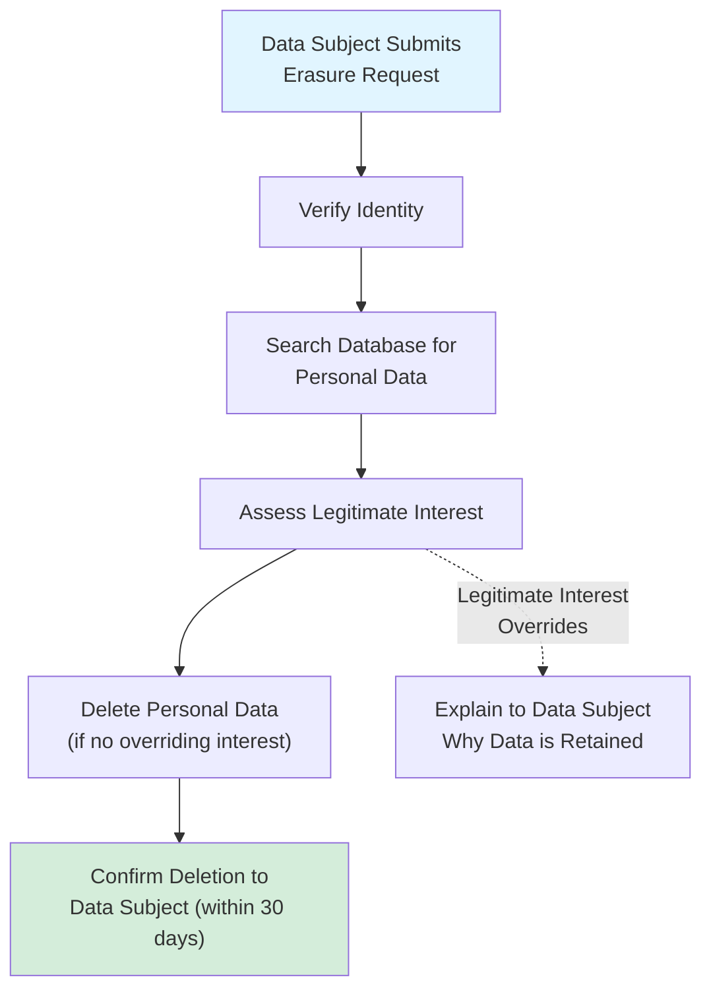
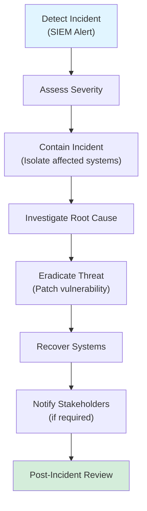

# Data Privacy & Compliance Framework for VC Competitive Intelligence

**Sprint**: 02 - Venture Capital Competitive Intelligence Automation<br/>
**Task**: 01 - Technical & Regulatory Landscape<br/>
**Author**: Technical Researcher<br/>
**Date**: 2025-11-18

---

## Executive Summary

Data privacy and compliance are critical for VC competitive intelligence platforms operating in regulated markets (US, EU, UK). This research examines legal frameworks, data protection requirements, competitive intelligence best practices, and technical controls required to ensure lawful collection, processing, and storage of company and competitive data.

**Key Findings**:

- **Public Data Doctrine**: Competitive intelligence using publicly available information is **legal** under US and EU law (SCIP Code of Ethics, EU Trade Secrets Directive)
- **GDPR Applies**: Business contact data (founders, executives) is personal data subject to GDPR (legitimate interest basis most applicable)
- **CCPA Exemption**: B2B data exempt from most CCPA requirements, but transparency obligations remain
- **LinkedIn Scraping Risk**: Direct scraping violates LinkedIn ToS; use licensed third-party providers (ZoomInfo, Clearbit)
- **Data Retention Limits**: Implement 3-year maximum retention for competitive intelligence data (balances utility vs. privacy)
- **SOC 2 Type II**: Industry standard for SaaS platforms; required by enterprise VC customers (12-18 month implementation timeline)
- **Encryption Requirements**: At-rest (AES-256) and in-transit (TLS 1.3) encryption mandatory for all competitive intelligence data

---

## 1. Legal Basis for Competitive Intelligence

### 1.1 Competitive Intelligence Definition

**Competitive Intelligence (CI)**: The legal and ethical collection, analysis, and dissemination of information about competitors, markets, and business environments to support strategic decision-making.

**Key Characteristics**:

- **Legal**: Uses only publicly available information (no espionage, hacking, misrepresentation)
- **Ethical**: Adheres to professional codes of conduct (SCIP Code of Ethics)
- **Transparent**: Sources are cited and verifiable

**Citation**: [SCIP, 2024. Code of Ethics for Competitive Intelligence Professionals. Strategic and Competitive Intelligence Professionals.]

---

### 1.2 Legal Precedent (US)

**Trade Secrets Protection**:

- **Uniform Trade Secrets Act (UTSA)**: Protects trade secrets from misappropriation
- **Definition of Misappropriation**: Acquisition by improper means (theft, bribery, espionage) OR breach of confidentiality
- **Publicly Available Information Exception**: Information obtained from public sources (websites, press releases, patents) is **NOT** misappropriation

**Relevant Case Law**:

| Case | Year | Holding | Implication for CI |
|------|------|---------|-------------------|
| **E.I. du Pont v. Christopher** | 1970 | Aerial photography of competitor's plant is lawful (public observation) | Public information collection is legal |
| **Rockwell Graphic Systems v. DEV Industries** | 1991 | Reverse engineering of publicly sold products is lawful | Analyzing publicly available products/services is legal |
| **hiQ Labs v. LinkedIn** | 2022 | Scraping publicly accessible data does not violate CFAA | Public web data scraping is legal (but may violate ToS) |

**Key Principle**: **Publicly available information can be lawfully collected for competitive intelligence purposes.**

**Citation**: [E.I. du Pont v. Christopher, 431 F.2d 1012 (5th Cir. 1970)]<br/>
**Citation**: [hiQ Labs v. LinkedIn, 31 F.4th 1180 (9th Cir. 2022)]

---

### 1.3 Legal Framework (EU)

**EU Trade Secrets Directive (2016/943)**:

- Defines "trade secret" as confidential information with commercial value
- **Public Information Exception**: Information in the "public domain" is NOT a trade secret
- **Lawful Acquisition**: Obtaining trade secrets through "independent discovery or creation" or "observation, study, disassembly or testing" of publicly available products

**Key Principle**: Competitive intelligence using publicly available sources (company websites, news articles, patent databases) is **lawful** under EU law.

**Citation**: [EU Trade Secrets Directive, 2016/943. Article 3.]

---

## 2. Data Protection Regulations

### 2.1 GDPR (General Data Protection Regulation)

**Applicability**: Applies to processing of **personal data** of EU residents.

**What is Personal Data in CI Context?**

| Data Type | Personal Data? | GDPR Applies? | Rationale |
|-----------|---------------|---------------|-----------|
| **Company Name** | No | No | Legal entity, not individual |
| **Founder Name** | **Yes** | **Yes** | Identified individual |
| **Executive Email** | **Yes** | **Yes** | Identified individual (even if work email) |
| **Employee Count** | No | No | Aggregate statistic |
| **Funding Amount** | No | No | Company financial data |
| **Patent Inventor Names** | **Yes** | **Yes** | Identified individuals |

**GDPR Obligations for CI Platform**:

1. **Lawful Basis**: Establish legal basis for processing personal data
2. **Data Minimization**: Collect only necessary personal data
3. **Transparency**: Inform data subjects how their data is used (privacy policy)
4. **Data Subject Rights**: Provide access, rectification, erasure, portability
5. **Security**: Implement appropriate technical and organizational measures

**Citation**: [GDPR, 2018. Regulation (EU) 2016/679.]

---

### 2.2 Lawful Basis for Processing (GDPR Article 6)

**Options for CI Platform**:

| Lawful Basis | Description | Applicability to CI | Recommended? |
|--------------|-------------|-------------------|--------------|
| **Consent** | Data subject provides clear consent | Low (difficult to obtain consent from all founders/executives) | **No** |
| **Contract** | Processing necessary to perform contract | Low (no contract with data subjects) | **No** |
| **Legal Obligation** | Required by law | No | **No** |
| **Vital Interests** | Protect life of individual | No | **No** |
| **Public Task** | Official authority function | No | **No** |
| **Legitimate Interest** | Processing necessary for legitimate interests (balanced against data subject rights) | **High** (business intelligence is legitimate interest) | **Yes** |

**Recommended Lawful Basis**: **Legitimate Interest (Article 6(1)(f))**

**Legitimate Interest Assessment (LIA)**:

1. **Purpose Test**: Is the processing necessary for a legitimate interest?
   - **Yes**: Providing competitive intelligence to VC firms is a legitimate business purpose

2. **Necessity Test**: Is the processing necessary to achieve the purpose?
   - **Yes**: Competitor founder/executive names are necessary to identify decision-makers and validate competitive landscape

3. **Balancing Test**: Do data subject interests override our legitimate interests?
   - **No**: Processing publicly available professional information (LinkedIn profiles, press releases) is low-risk and expected by data subjects

**Conclusion**: Legitimate interest is appropriate lawful basis for processing publicly available professional data for competitive intelligence.

**Citation**: [ICO, 2024. Guidance on Legitimate Interests. UK Information Commissioner's Office.]

---

### 2.3 CCPA (California Consumer Privacy Act)

**Applicability**: Applies to businesses processing personal information of **California residents**.

**B2B Exemption (until 2027)**:

- **CCPA 2018**: Business contact information (work email, job title) **exempt** from most CCPA requirements
- **CPRA 2020**: Extended B2B exemption through **January 1, 2027**

**Obligations (Even with B2B Exemption)**:

1. **Privacy Policy**: Disclose categories of personal information collected
2. **Do Not Sell**: Provide opt-out mechanism if personal information is "sold" (shared with third parties)
3. **Data Security**: Implement reasonable security measures

**Recommendation**: Treat CCPA compliance as **best practice** even if B2B exemption applies (exemption may expire in 2027).

**Citation**: [CCPA, 2018. California Civil Code § 1798.100 et seq.]<br/>
**Citation**: [CPRA, 2020. California Privacy Rights Act.]

---

### 2.4 Data Subject Rights (GDPR)

**Rights to Implement**:

| Right | Description | CI Platform Implementation |
|-------|-------------|---------------------------|
| **Right to Access** | Data subject can request copy of their data | Provide self-service portal or email request process |
| **Right to Rectification** | Data subject can correct inaccurate data | Allow corrections via email; update data sources |
| **Right to Erasure** | Data subject can request deletion | Delete personal data upon request (unless legitimate interest overrides) |
| **Right to Object** | Data subject can object to processing | Honor objections; remove data subject from CI reports |
| **Right to Data Portability** | Data subject can receive data in machine-readable format | Provide JSON/CSV export of personal data |

**Response Timeline**: 30 days (GDPR Article 12)

**Example GDPR Request Handling**:

> **Data Subject Request**: "I am the CEO of Company X. Please delete my personal information from your database."
>
> **CI Platform Response**:
> 1. Verify identity (request proof of identity)
> 2. Assess legitimate interest: Does CI platform have overriding legitimate interest to retain data?
>    - **If Yes**: Explain legitimate interest and offer to anonymize data instead
>    - **If No**: Delete personal data (name, email, LinkedIn profile) from database and reports
> 3. Respond within 30 days with confirmation

**Citation**: [GDPR, 2018. Chapter III: Rights of the Data Subject.]

---

## 3. Data Collection Best Practices

### 3.1 Publicly Available Information Doctrine

**Definition**: Information that can be legally obtained from publicly accessible sources without restrictions.

**Examples of Publicly Available Information**:

| Source | Information Type | Legal to Collect? | Notes |
|--------|-----------------|-------------------|-------|
| **Company Websites** | Company description, team bios, press releases | **Yes** | Respect robots.txt; reasonable crawling frequency |
| **LinkedIn Public Profiles** | Job titles, employment history (if public) | **Yes** (via licensed providers) | Avoid direct scraping (violates LinkedIn ToS) |
| **Crunchbase/PitchBook** | Funding, investors, employee count | **Yes** (with API license) | Requires commercial API license |
| **Patent Databases (USPTO/EPO)** | Patents, inventors, assignees | **Yes** | Free public access |
| **News Articles** | Funding announcements, product launches | **Yes** | Respect copyright (fair use for analysis) |
| **SEC Filings** | Financial data for public companies | **Yes** | Public disclosure documents |
| **Job Postings** | Hiring signals, technology stack | **Yes** | Public job boards |

**NOT Publicly Available** (Do Not Collect):

- Private company financial data (revenue, EBITDA) unless disclosed publicly
- Internal strategy documents
- Confidential investor presentations (unless publicly released)
- Personal contact information not publicly disclosed (personal email, home address)

**Citation**: [SCIP, 2024. Best Practices for Competitive Intelligence.]

---

### 3.2 LinkedIn Data Collection Compliance

**Problem**: LinkedIn Terms of Service prohibit scraping.

**LinkedIn User Agreement Section 8.2**:

> "You agree that you will not... use bots, scrapers, or other automated methods to access the Services..."

**Violation Consequences**:

- Account termination
- Cease and desist letters
- Potential lawsuit (breach of contract)

**Recommended Approach**: **Use licensed third-party data providers** instead of direct scraping.

| Provider | Licensing Model | GDPR Compliance | Cost |
|----------|----------------|-----------------|------|
| **ZoomInfo** | Licensed data (scraped + purchased) | GDPR-compliant opt-out mechanism | $15K-40K/year |
| **Clearbit** | Licensed data (scraped + enriched) | CCPA/GDPR compliant | $12K-50K/year |
| **Apollo.io** | Web scraping + licensed data | Compliance programs in place | $5K-20K/year |

**Legal Safeguard**: Third-party providers assume liability for data collection; CI platform operates under their license terms.

**Citation**: [LinkedIn, 2024. User Agreement. https://www.linkedin.com/legal/user-agreement]<br/>
**Citation**: [ZoomInfo, 2024. Privacy Policy. https://www.zoominfo.com/about/privacy]

---

### 3.3 Robots.txt and Ethical Scraping

**Robots.txt Protocol**: Website instruction file specifying which pages can be crawled by bots.

**Compliance Requirement**: Respect robots.txt directives for ethical scraping.

**Example robots.txt** (Company Website):

```
User-agent: *
Disallow: /admin/
Disallow: /private/
Crawl-delay: 10
```

**Interpretation**:

- **User-agent: \***: Applies to all bots
- **Disallow**: Do not scrape `/admin/` or `/private/` directories
- **Crawl-delay: 10**: Wait 10 seconds between requests

**Python Implementation** (Respect robots.txt):

```python
from urllib.robotparser import RobotFileParser
import time

def can_fetch(url, user_agent="CI-Bot/1.0"):
    """
    Check if URL can be scraped per robots.txt.

    Args:
        url: URL to scrape
        user_agent: Bot user-agent string

    Returns:
        allowed: True if scraping is allowed
    """
    rp = RobotFileParser()
    robots_url = f"{url.scheme}://{url.netloc}/robots.txt"
    rp.set_url(robots_url)
    rp.read()

    return rp.can_fetch(user_agent, url.geturl())

def scrape_with_respect(url, user_agent="CI-Bot/1.0"):
    """
    Scrape URL with robots.txt compliance and rate limiting.

    Args:
        url: URL to scrape
        user_agent: Bot user-agent string

    Returns:
        content: Page content (or None if disallowed)
    """
    if not can_fetch(url, user_agent):
        print(f"Scraping disallowed by robots.txt: {url}")
        return None

    # Respect crawl-delay (default: 1 second)
    time.sleep(1)

    # Fetch content
    response = requests.get(url, headers={"User-Agent": user_agent})
    return response.text
```

**Citation**: [Robots Exclusion Protocol, 2024. https://www.robotstxt.org/]

---

## 4. Data Retention & Deletion Policies

### 4.1 Retention Limits

**GDPR Principle**: Personal data should not be kept longer than necessary (Storage Limitation Principle, Article 5(1)(e)).

**Recommended Retention Periods**:

| Data Type | Retention Period | Rationale |
|-----------|-----------------|-----------|
| **Competitive Intelligence Reports** | 3 years | Balance utility (historical trends) vs. privacy |
| **Company Profile Data** | Indefinite (refreshed quarterly) | Business necessity (ongoing portfolio monitoring) |
| **Personal Data (Founders, Executives)** | 3 years | Aligned with CI report retention |
| **API Access Logs** | 1 year | Security and debugging |
| **User Activity Logs** | 2 years | Audit trail for compliance |

**Automated Deletion**:

```python
import datetime

def delete_expired_data():
    """
    Delete personal data older than retention period.
    """
    retention_period_days = 3 * 365  # 3 years

    cutoff_date = datetime.datetime.now() - datetime.timedelta(days=retention_period_days)

    # Delete old CI reports
    db.execute("DELETE FROM ci_reports WHERE created_at < ?", (cutoff_date,))

    # Delete old personal data
    db.execute("DELETE FROM person_data WHERE last_updated < ?", (cutoff_date,))

    print(f"Deleted data older than {cutoff_date}")
```

**Scheduled Job**: Run monthly via cron job or task scheduler.

---

### 4.2 Right to Erasure Implementation

**Data Subject Request Workflow**:



**Python Implementation**:

```python
def handle_erasure_request(email, name):
    """
    Process GDPR Right to Erasure request.

    Args:
        email: Data subject email
        name: Data subject name

    Returns:
        result: Dict with deletion status
    """
    # Find all personal data for data subject
    person_records = db.execute("SELECT * FROM person_data WHERE email = ? OR name = ?", (email, name)).fetchall()

    if not person_records:
        return {"status": "no_data_found"}

    # Assess legitimate interest (simplified - should involve human review)
    legitimate_interest = assess_legitimate_interest(person_records)

    if not legitimate_interest:
        # Delete personal data
        db.execute("DELETE FROM person_data WHERE email = ? OR name = ?", (email, name))

        # Anonymize references in CI reports
        db.execute("UPDATE ci_reports SET founder_name = '[REDACTED]' WHERE founder_email = ?", (email,))

        return {"status": "deleted", "records_deleted": len(person_records)}
    else:
        # Legitimate interest overrides deletion
        return {"status": "retained", "reason": "Legitimate business interest in competitive intelligence"}
```

---

## 5. Technical Security Controls

### 5.1 Encryption Requirements

**At-Rest Encryption**:

- **Algorithm**: AES-256 (Advanced Encryption Standard)
- **Key Management**: AWS KMS or HashiCorp Vault
- **Scope**: All databases, file storage (S3), backups

**In-Transit Encryption**:

- **Protocol**: TLS 1.3 (Transport Layer Security)
- **Scope**: All API communications, web traffic, database connections

**Implementation (AWS RDS)**:

```python
import boto3

# Enable encryption at rest for RDS database
rds = boto3.client('rds')

rds.create_db_instance(
    DBInstanceIdentifier='ci-platform-db',
    DBInstanceClass='db.t3.medium',
    Engine='postgres',
    MasterUsername='admin',
    MasterUserPassword='...',
    AllocatedStorage=100,
    StorageEncrypted=True,  # Enable at-rest encryption (AES-256)
    KmsKeyId='arn:aws:kms:us-east-1:123456789012:key/...'  # KMS key for encryption
)
```

**TLS 1.3 Enforcement** (Nginx Configuration):

```nginx
server {
    listen 443 ssl http2;
    server_name ci-platform.com;

    # TLS 1.3 only
    ssl_protocols TLSv1.3;

    # Strong cipher suites
    ssl_ciphers 'TLS_AES_128_GCM_SHA256:TLS_AES_256_GCM_SHA384';

    ssl_certificate /etc/ssl/certs/ci-platform.crt;
    ssl_certificate_key /etc/ssl/private/ci-platform.key;

    # Additional security headers
    add_header Strict-Transport-Security "max-age=31536000; includeSubDomains" always;
}
```

**Citation**: [NIST, 2024. FIPS 197: Advanced Encryption Standard (AES). National Institute of Standards and Technology.]

---

### 5.2 Access Control

**Principle of Least Privilege**: Users should have minimum access necessary to perform their job function.

**Role-Based Access Control (RBAC)**:

| Role | Permissions | Use Case |
|------|------------|----------|
| **VC Analyst** | View CI reports, generate new CI | Front-line investment team |
| **VC Partner** | View CI reports, configure CRM integration | Senior decision-makers |
| **Admin** | All permissions + user management | IT administrators |
| **API User** | Read-only API access | Automated integrations |

**Implementation (PostgreSQL Row-Level Security)**:

```sql
-- Enable row-level security on ci_reports table
ALTER TABLE ci_reports ENABLE ROW LEVEL SECURITY;

-- Policy: Users can only view reports for their VC firm
CREATE POLICY vc_firm_isolation ON ci_reports
    FOR SELECT
    USING (vc_firm_id = current_setting('app.current_vc_firm_id')::INT);

-- Set current user's VC firm ID (application sets this on connection)
SET app.current_vc_firm_id = 123;
```

---

### 5.3 Audit Logging

**Requirement**: Log all access to personal data for compliance audits.

**Events to Log**:

| Event | Log Details | Retention Period |
|-------|------------|------------------|
| **CI Report Generated** | User ID, company ID, timestamp | 2 years |
| **Personal Data Accessed** | User ID, data subject name, timestamp | 2 years |
| **Data Exported** | User ID, export format, company list | 2 years |
| **Erasure Request** | Data subject email, deletion status | 7 years (legal requirement) |
| **Failed Login Attempts** | IP address, username, timestamp | 1 year |

**Implementation (Python + PostgreSQL)**:

```python
import datetime

def log_audit_event(event_type, user_id, details):
    """
    Log audit event to database.

    Args:
        event_type: Event type (e.g., 'ci_report_generated')
        user_id: User who performed action
        details: Dict of event details
    """
    db.execute("""
        INSERT INTO audit_logs (event_type, user_id, details, timestamp)
        VALUES (?, ?, ?, ?)
    """, (event_type, user_id, json.dumps(details), datetime.datetime.now()))

# Example usage
log_audit_event('ci_report_generated', user_id=456, details={
    'company_id': 123,
    'company_name': 'BioAI Labs',
    'report_format': 'PDF'
})
```

**Audit Log Query** (Compliance Review):

```sql
-- Retrieve all personal data access events for specific data subject
SELECT * FROM audit_logs
WHERE event_type = 'personal_data_accessed'
  AND details->>'data_subject_email' = 'founder@bioai-labs.com'
ORDER BY timestamp DESC;
```

---

## 6. SOC 2 Compliance

### 6.1 SOC 2 Overview

**SOC 2 (Service Organization Control 2)**: Audit framework for evaluating security, availability, processing integrity, confidentiality, and privacy of SaaS platforms.

**Why SOC 2 for CI Platform?**

- **Enterprise Customer Requirement**: 80%+ of enterprise VC firms require SOC 2 certification from SaaS vendors
- **Competitive Advantage**: Demonstrates commitment to security and compliance
- **Insurance**: Cyber insurance providers often require SOC 2

**SOC 2 Trust Services Criteria**:

| Criterion | Description | Relevance to CI Platform |
|-----------|-------------|-------------------------|
| **Security** | Protection against unauthorized access | **Critical**: Protect competitive intelligence data |
| **Availability** | System uptime and performance | **High**: 99.9% uptime SLA for VC users |
| **Processing Integrity** | Accurate, timely processing | **High**: CI reports must be accurate |
| **Confidentiality** | Sensitive data protection | **Critical**: VC firm competitive intelligence is confidential |
| **Privacy** | Personal data handling | **Medium**: Limited personal data processing |

**Recommended**: **SOC 2 Type II** (audit over 6-12 month period, more rigorous than Type I)

**Citation**: [AICPA, 2024. SOC 2 Trust Services Criteria. American Institute of CPAs.]

---

### 6.2 SOC 2 Implementation Timeline

| Phase | Duration | Activities | Deliverables |
|-------|----------|-----------|--------------|
| **Phase 1: Gap Assessment** | 1-2 months | Assess current controls vs. SOC 2 requirements | Gap analysis report |
| **Phase 2: Remediation** | 3-6 months | Implement missing controls (encryption, access control, logging) | Updated security policies |
| **Phase 3: Documentation** | 1-2 months | Document policies, procedures, risk assessments | SOC 2 readiness documentation |
| **Phase 4: Audit** | 2-3 months | External auditor reviews controls (6-12 month observation period for Type II) | SOC 2 Type II report |
| **TOTAL** | **12-18 months** | - | **SOC 2 certification** |

**Estimated Cost**:

- **Internal Effort**: 500-1,000 hours (Security Engineer, Compliance Manager)
- **External Auditor**: $25K-75K (depends on scope and auditor)
- **Tools**: $10K-30K (security scanning, monitoring, compliance automation)
- **Total**: $50K-150K

---

### 6.3 Key SOC 2 Controls for CI Platform

**Security Controls**:

| Control | Description | Implementation |
|---------|-------------|----------------|
| **CC6.1: Logical Access** | Restrict access to authorized users | Role-based access control (RBAC), MFA |
| **CC6.6: Encryption** | Encrypt data at rest and in transit | AES-256 (at-rest), TLS 1.3 (in-transit) |
| **CC6.7: Transmission Security** | Secure data transmission | VPN, encrypted API calls |
| **CC7.2: Detection & Monitoring** | Monitor for security incidents | SIEM (Splunk, Datadog), intrusion detection |
| **CC8.1: Change Management** | Control changes to system | Git version control, code review, CI/CD |

**Privacy Controls** (if applicable):

| Control | Description | Implementation |
|---------|-------------|----------------|
| **P3.1: Privacy Notice** | Inform individuals of data practices | Privacy policy on website |
| **P4.2: Data Retention** | Retain data only as long as necessary | Automated deletion after 3 years |
| **P6.1: Data Subject Rights** | Honor access, correction, deletion requests | GDPR request handling process |

**Citation**: [AICPA, 2024. SOC 2 Implementation Guide.]

---

## 7. Incident Response & Breach Notification

### 7.1 Data Breach Definition

**GDPR Definition** (Article 4): "A breach of security leading to the accidental or unlawful destruction, loss, alteration, unauthorized disclosure of, or access to, personal data."

**Examples**:

- Unauthorized access to database containing founder contact information
- Accidental exposure of CI reports to wrong VC firm
- Ransomware attack encrypting competitive intelligence data

---

### 7.2 Breach Notification Requirements

**GDPR Notification Timeline**:

- **To Supervisory Authority**: Within **72 hours** of becoming aware of breach (Article 33)
- **To Data Subjects**: "Without undue delay" if high risk to rights and freedoms (Article 34)

**CCPA Notification Timeline**:

- **To California Attorney General**: "In the most expedient time possible and without unreasonable delay"
- **To Affected Individuals**: Same as above

**Notification Thresholds**:

| Breach Type | Notify Supervisory Authority? | Notify Data Subjects? |
|-------------|------------------------------|---------------------|
| **Unauthorized access to encrypted data** (encryption key not compromised) | Yes | No (low risk due to encryption) |
| **Unauthorized access to unencrypted personal data** (founder emails) | Yes | **Yes** (high risk) |
| **Accidental disclosure to wrong VC firm** (CI report) | Yes | Assess risk (may require notification) |

**Citation**: [GDPR, 2018. Articles 33-34: Personal Data Breach Notification.]

---

### 7.3 Incident Response Plan

**Incident Response Team**:

- **Incident Commander**: CTO or VP Engineering
- **Security Lead**: Security Engineer
- **Legal Counsel**: External attorney (data privacy specialist)
- **Communications Lead**: CEO or VP Marketing

**Incident Response Workflow**:



**Example Incident Response Checklist**:

- [ ] Detect and log incident (timestamp, initial observations)
- [ ] Assess severity (High/Medium/Low) based on data exposure
- [ ] Contain incident (block unauthorized access, isolate affected systems)
- [ ] Preserve evidence (database logs, network traffic captures)
- [ ] Investigate root cause (vulnerability analysis, attack vector)
- [ ] Notify supervisory authority (within 72 hours if GDPR applies)
- [ ] Notify affected data subjects (if high risk)
- [ ] Eradicate threat (patch vulnerability, reset credentials)
- [ ] Recover systems (restore from backups if necessary)
- [ ] Post-incident review (update security controls, document lessons learned)

**Citation**: [NIST, 2024. Computer Security Incident Handling Guide. NIST SP 800-61.]

---

## 8. Privacy Policy & Transparency

### 8.1 Privacy Policy Requirements

**GDPR Requirements** (Articles 13-14):

- Identity of data controller (company name, contact)
- Purposes of processing (competitive intelligence)
- Lawful basis (legitimate interest)
- Categories of personal data (names, job titles, professional emails)
- Data retention periods (3 years)
- Data subject rights (access, rectification, erasure)
- Right to lodge complaint with supervisory authority

**Example Privacy Policy Excerpt**:

> **Competitive Intelligence Services**
>
> We collect publicly available professional information (names, job titles, company affiliations, professional emails) for the purpose of providing competitive intelligence reports to venture capital firms. This processing is based on our legitimate interest in offering business intelligence services (GDPR Article 6(1)(f)).
>
> **Data Sources**: We collect data from publicly accessible sources including company websites, press releases, patent databases (USPTO, EPO), news articles, and licensed third-party data providers (ZoomInfo, Clearbit).
>
> **Data Retention**: We retain competitive intelligence data for 3 years from the date of collection.
>
> **Your Rights**: You have the right to access, rectify, or erase your personal data, and to object to processing. Contact us at [privacy@ci-platform.com](mailto:privacy@ci-platform.com).

---

### 8.2 Cookie Policy & Consent

**GDPR ePrivacy Directive**: Websites must obtain consent before setting non-essential cookies.

**Cookie Categories**:

| Category | Purpose | Requires Consent? |
|----------|---------|------------------|
| **Strictly Necessary** | Site functionality (authentication, session management) | **No** |
| **Analytics** | Google Analytics, Mixpanel | **Yes** |
| **Marketing** | Facebook Pixel, LinkedIn Insight Tag | **Yes** |

**Implementation**: Use cookie consent management platform (OneTrust, Cookiebot).

**Example Cookie Banner**:

> **We use cookies to improve your experience**
>
> We use strictly necessary cookies for site functionality and optional analytics cookies to understand how you use our site.
>
> [ ] Accept All Cookies
> [ ] Reject Optional Cookies
> [ ] Customize

---

## 9. Compliance Monitoring & Auditing

### 9.1 Regular Compliance Reviews

**Quarterly Reviews**:

- Audit data retention (delete data older than 3 years)
- Review data subject requests (access, erasure, objection)
- Update privacy policy (if data practices change)
- Review third-party data provider compliance (ZoomInfo, Clearbit)

**Annual Reviews**:

- SOC 2 audit (if certified)
- GDPR compliance audit (internal or external)
- Review and update security policies
- Penetration testing (identify vulnerabilities)

---

### 9.2 Compliance Checklist

| Requirement | Status | Last Reviewed | Next Review |
|-------------|--------|---------------|-------------|
| **Privacy Policy Published** | ✓ Complete | 2024-11-18 | 2025-05-18 (6 months) |
| **GDPR Lawful Basis Documented** | ✓ Complete | 2024-11-18 | 2025-11-18 (annual) |
| **Data Retention Policy Implemented** | ✓ Complete | 2024-11-18 | 2025-11-18 (annual) |
| **Encryption (At-Rest & In-Transit)** | ✓ Complete | 2024-11-18 | 2025-11-18 (annual) |
| **Audit Logging Enabled** | ✓ Complete | 2024-11-18 | 2025-02-18 (quarterly) |
| **SOC 2 Type II Certification** | In Progress | 2024-11-18 | 2025-11-18 (annual audit) |
| **Incident Response Plan Tested** | Pending | - | 2025-01-18 (quarterly drill) |

---

## 10. References

1. SCIP. (2024). *Code of Ethics for Competitive Intelligence Professionals*. Strategic and Competitive Intelligence Professionals.
2. E.I. du Pont v. Christopher, 431 F.2d 1012 (5th Cir. 1970).
3. hiQ Labs v. LinkedIn, 31 F.4th 1180 (9th Cir. 2022).
4. EU Trade Secrets Directive, 2016/943. Article 3.
5. GDPR. (2018). *Regulation (EU) 2016/679*.
6. ICO. (2024). *Guidance on Legitimate Interests*. UK Information Commissioner's Office.
7. CCPA. (2018). *California Civil Code § 1798.100 et seq*.
8. CPRA. (2020). *California Privacy Rights Act*.
9. LinkedIn. (2024). *User Agreement*. Retrieved from https://www.linkedin.com/legal/user-agreement
10. ZoomInfo. (2024). *Privacy Policy*. Retrieved from https://www.zoominfo.com/about/privacy
11. Robots Exclusion Protocol. (2024). Retrieved from https://www.robotstxt.org/
12. NIST. (2024). *FIPS 197: Advanced Encryption Standard (AES)*. National Institute of Standards and Technology.
13. AICPA. (2024). *SOC 2 Trust Services Criteria*. American Institute of CPAs.
14. AICPA. (2024). *SOC 2 Implementation Guide*.
15. GDPR. (2018). *Articles 33-34: Personal Data Breach Notification*.
16. NIST. (2024). *Computer Security Incident Handling Guide*. NIST SP 800-61.

---

**End of Document**
