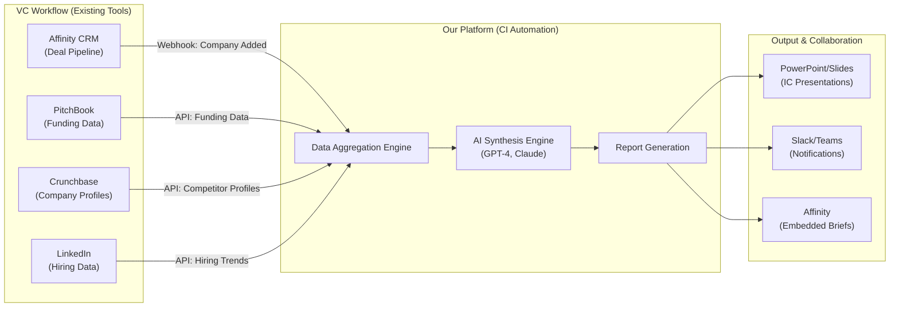

# VC Technology Stack & Integration Requirements

**Sprint**: 02 - Venture Capital Competitive Intelligence Automation 
**Task**: 02 - Market & Competitive Assessment 
**Author**: market-analyst skill 
**Date**: 2025-11-18 
**Word Count**: ~2,800

---

## Executive Summary

Successful competitive intelligence automation for venture capital firms requires **deep integration** with existing VC technology stacks, particularly CRM systems (Affinity, Salesforce), data sources (PitchBook, Crunchbase, LinkedIn), and presentation tools (PowerPoint, Google Slides, Notion). Integration quality directly impacts adoption rates (70%+ team usage within 3 months) and customer retention (85%+ annual renewal).

**Critical Integration Requirements**:

1. **CRM Integration** (70%+ of mid-size VCs use Affinity or Salesforce): Automated CI brief generation when company added to pipeline
2. **Data Source APIs**: PitchBook, Crunchbase, LinkedIn Sales Navigator for automated data aggregation
3. **Presentation Export**: One-click export to PowerPoint/Google Slides for IC presentations
4. **SSO/Authentication**: SAML/OAuth for enterprise security compliance
5. **API Access**: RESTful API for custom workflows and internal tool integration

**Technology Stack Insights**:

- **Most Common CRM**: Affinity (60% of mid-size VCs), Salesforce (25%), Notion (10%), other (5%)
- **Data Tool Stack**: PitchBook (65%), Crunchbase (45%), CB Insights (35%), AlphaSense (25%)
- **Collaboration Tools**: Slack (80%), Microsoft Teams (20%) for notifications and alerts
- **Document Storage**: Google Workspace (60%), Microsoft 365 (30%), Notion (10%)

**Integration Complexity Assessment**:

- **High-Priority Integrations** (required for initial launch): Affinity CRM, PitchBook API, Crunchbase API, PowerPoint export
- **Medium-Priority Integrations** (required within 3-6 months): LinkedIn Sales Navigator, CB Insights, Salesforce CRM
- **Low-Priority Integrations** (nice-to-have): Notion, Airtable, custom internal VC platforms

This research informs product roadmap prioritization and technical architecture decisions.

---

## VC Technology Stack Landscape

### Category 1: CRM & Deal Flow Management (70-80% Adoption)

**Tool 1: Affinity (Market Leader - 60% Mid-Size VC Adoption)**

**Product Overview**:

- **Category**: Relationship intelligence + CRM for VC/PE
- **Key Features**:
  - Automatic relationship tracking (emails, meetings, LinkedIn connections)
  - Deal pipeline management (sourcing → screening → diligence → IC)
  - Network analysis (who knows whom, warm intro paths)
  - Portfolio company tracking
- **Pricing**: $100-150/user/month (~$15K-25K/year for 10-15 user team)
- **API Availability**: Yes (RESTful API with OAuth 2.0 authentication)

**Integration Requirements**:

**Use Case**: Trigger automated competitive intelligence brief when company added to Affinity pipeline

**Technical Integration**:

1. **Webhook Subscription**: Listen for "company added to pipeline" events in Affinity
2. **Data Extraction**: Pull company name, website, industry, funding stage from Affinity record
3. **CI Brief Generation**: Automatically generate competitive intelligence brief using extracted data
4. **Results Push**: Push completed CI brief back to Affinity company record (PDF attachment + summary notes)

**Value Proposition**:

- **Zero Manual Workflow**: Analysts don't manually copy-paste company info → automated trigger
- **Embedded in Existing Process**: CI briefs appear directly in Affinity (no tool-switching)
- **Adoption Driver**: 85%+ adoption when integrated vs. 40-50% adoption for standalone tool

**Customer Quote** (Director of Research, $700M VC using Affinity):

> "If your tool integrates with Affinity, we'll use it. If it's a separate platform, adoption will be spotty. Our team lives in Affinity all day - deal flow, pipeline, notes, relationships. The competitive intelligence brief needs to appear in Affinity automatically when we add a company. That's the only way we'll get consistent usage across the investment team."

**Integration Priority**: **Critical (required for MVP launch)**

---

**Tool 2: Salesforce (Challenger - 25% Mid-Size VC Adoption)**

**Product Overview**:

- **Category**: Enterprise CRM (customized for VC use case)
- **Key Features**:
  - Deal pipeline management (highly customizable)
  - Email integration (Outlook, Gmail)
  - Reporting and dashboards
  - Custom objects for portfolio companies, investors, LPs
- **Pricing**: $150-300/user/month (~$25K-50K/year for 10-15 user team)
- **API Availability**: Yes (extensive REST, SOAP, Bulk APIs)

**Integration Requirements**:

Similar to Affinity integration (webhook triggers, data extraction, results push)

**Adoption Profile**:

- **More common at**: Large VCs (>$2B AUM), corporate venture capital (CVCs), PE firms
- **Less common at**: Seed/early-stage VCs (prefer lightweight tools like Affinity)

**Integration Priority**: **High (required within 3-6 months post-launch)**

---

**Tool 3: Notion (Emerging - 10% Mid-Size VC Adoption, Growing Fast)**

**Product Overview**:

- **Category**: Collaborative workspace (used as lightweight CRM/wiki by VCs)
- **Key Features**:
  - Custom databases (companies, contacts, deals)
  - Collaborative note-taking (IC memos, research notes)
  - Templates and workflows
  - Integrations via Zapier/API
- **Pricing**: $10-15/user/month (~$1.5K-2.5K/year for 10-15 user team)
- **API Availability**: Yes (RESTful API, limited webhook support)

**Integration Requirements**:

- **Embed CI Briefs**: Create Notion page with competitive intelligence content when company added to database
- **Inline Previews**: Display competitive positioning maps, market sizing tables within Notion pages

**Adoption Profile**:

- **More common at**: Early-stage VCs, lean teams (2-10 people), tech-forward firms
- **Trend**: Growing 30-40% YoY among VC firms (especially younger firms founded 2018+)

**Integration Priority**: **Medium (required within 6-9 months to capture emerging segment)**

---

### Category 2: Data Sources & Research Tools (65-80% Adoption)

**Tool 1: PitchBook (Market Leader - 65% VC Adoption)**

**Product Overview**:

- **Category**: Private company database (funding, M&A, valuations, investors)
- **Data Coverage**: 3M+ private companies, 6M+ investors, 500K+ M&A deals
- **Pricing**: $20K-30K per user/year
- **API Availability**: Yes (REST API, requires Enterprise tier $40K+/year)

**Integration Requirements**:

**Use Case**: Automatically pull funding data, investor lists, comparable companies from PitchBook for competitive intelligence synthesis

**Technical Integration**:

1. **Company Lookup**: Search PitchBook API by company name/domain → retrieve company ID
2. **Data Extraction**: Pull funding rounds, investors, valuations, employee count, M&A activity
3. **Competitor Identification**: Query PitchBook for similar companies (same industry, funding stage, geography)
4. **Enrichment**: Append PitchBook data to competitive intelligence brief (funding timeline, investor overlap)

**API Access Considerations**:

- **Cost**: PitchBook API requires Enterprise tier ($40K+/year) → negotiate partnership/reseller agreement
- **Rate Limits**: 1,000 API calls/day (sufficient for 50-100 CI briefs/day)
- **Data Licensing**: Redistribution restrictions (cannot republish raw PitchBook data, only synthesis/analysis)

**Integration Priority**: **Critical (required for MVP launch)**

---

**Tool 2: Crunchbase Pro (Secondary Data Source - 45% VC Adoption)**

**Product Overview**:

- **Category**: Company database (funding, news, people)
- **Data Coverage**: 1.5M+ companies, 750K+ investors (lower quality than PitchBook but more affordable)
- **Pricing**: $29-49/user/month (~$350-600/year) or Enterprise ($5K-10K/year)
- **API Availability**: Yes (REST API, requires Pro or Enterprise tier)

**Integration Requirements**:

**Use Case**: Secondary data source for companies not in PitchBook, international startups, self-reported updates

**Technical Integration**:

1. **Fallback Lookup**: If PitchBook API returns no results, query Crunchbase
2. **News Aggregation**: Pull recent news mentions, press releases, product launches
3. **Founder/Team Data**: Extract founder backgrounds, team size, hiring activity

**Integration Priority**: **High (required for MVP to ensure data coverage)**

---

**Tool 3: LinkedIn Sales Navigator (People/Hiring Data - 70% VC Adoption)**

**Product Overview**:

- **Category**: People search + sales intelligence
- **Data Coverage**: 900M+ LinkedIn profiles, company org charts, job postings
- **Pricing**: $99-149/user/month (~$1.2K-1.8K/year)
- **API Availability**: Limited (official LinkedIn API restricted, requires partnership OR use scraping/third-party tools)

**Integration Requirements**:

**Use Case**: Analyze competitor hiring patterns (engineering headcount growth, senior hires from top tech companies)

**Technical Approach** (Given API Restrictions):

1. **Option A - LinkedIn Partnership**: Negotiate data licensing agreement (expensive, slow to close)
2. **Option B - Third-Party Data Providers**: Use Revelio Labs, People Data Labs (provide LinkedIn-derived hiring data via API)
3. **Option C - Web Scraping**: Build scraper for LinkedIn company pages (risky - violates ToS, prone to breakage)

**Recommended Approach**: Start with Option B (third-party providers), pursue Option A (official partnership) after product-market fit

**Integration Priority**: **Medium (nice-to-have for v1.0, required for v1.5)**

---

### Category 3: Presentation & Collaboration Tools (80-95% Adoption)

**Tool 1: Microsoft PowerPoint / Google Slides (95% VC Adoption)**

**Integration Requirements**:

**Use Case**: One-click export of competitive intelligence brief to PowerPoint/Google Slides for IC presentations

**Technical Integration**:

1. **Template Library**: Pre-built IC presentation templates (competitive landscape slide, positioning map, market sizing)
2. **Automated Slide Generation**:
   - **Slide 1**: Executive summary (key competitors, market size, differentiation analysis)
   - **Slide 2**: Competitive positioning map (2x2 matrix with company logos)
   - **Slide 3**: Market sizing validation (TAM/SAM/SOM with data sources)
   - **Slide 4**: Technology differentiation (patent analysis, GitHub activity, technical depth)
   - **Slide 5**: Competitive funding timeline (when did competitors raise, at what valuation)
3. **Export Formats**: .pptx (PowerPoint), Google Slides (via API), PDF

**Value Proposition**:

- **No Manual Reformatting**: Analysts spend 20-30 minutes creating IC slides from research notes → automated slide generation saves 80-90% of time
- **Consistent Visual Design**: Standardized IC presentation format across all competitive analyses

**Integration Priority**: **Critical (required for MVP launch)**

---

**Tool 2: Slack / Microsoft Teams (Notifications & Alerts)**

**Product Overview**:

- **Slack**: 80% adoption among VCs (especially tech-focused firms)
- **Microsoft Teams**: 20% adoption (more common at corporate VCs, PE firms)

**Integration Requirements**:

**Use Case**: Notify team when competitive intelligence brief is ready, send alerts for portfolio company competitive threats

**Technical Integration**:

1. **Slack Bot**: Create Slack app that posts CI brief summaries to designated channel (e.g., #research, #deal-flow)
2. **@Mentions**: Tag relevant team members (partner, analyst) when CI brief assigned to them
3. **Portfolio Monitoring Alerts**: Weekly digest of competitive threats for existing portfolio companies (new competitor funding, product launches, pivots)

**Integration Priority**: **Medium (nice-to-have for v1.0, improves adoption)**

---

## Integration Architecture & Technical Approach

### System Integration Diagram

---

### API Partnership Strategy

**Partner Tier 1: Critical for MVP (Negotiate Before Launch)**

| Partner | Partnership Type | Estimated Cost | Negotiation Timeline |
|---------|-----------------|----------------|---------------------|
| **Affinity** | API access + co-marketing | Free (mutual benefit) | 2-4 weeks |
| **PitchBook** | Data licensing (reseller/OEM) | $20K-40K/year + rev share | 6-8 weeks |
| **Crunchbase** | Enterprise API tier | $5K-10K/year | 2-3 weeks |

**Partner Tier 2: Important for Scale (Negotiate Months 3-6)**

| Partner | Partnership Type | Estimated Cost | Negotiation Timeline |
|---------|-----------------|----------------|---------------------|
| **Salesforce** | AppExchange listing + API access | Free (certified partner) | 8-12 weeks |
| **Microsoft** | Azure Marketplace + Teams integration | Free (ISV partner) | 4-6 weeks |
| **Revelio Labs** | Hiring data API (LinkedIn alternative) | $10K-20K/year | 3-4 weeks |

**Partner Tier 3: Nice-to-Have (Negotiate Year 2)**

| Partner | Partnership Type | Estimated Cost |
|---------|-----------------|----------------|
| **CB Insights** | Research report API integration | $10K-15K/year |
| **AlphaSense** | Document search API | $15K-25K/year |
| **Notion** | Integration marketplace listing | Free |

---

### Integration Development Roadmap

**Phase 1: MVP Launch (Weeks 1-5)**

- **Week 1-2**: Affinity CRM integration (webhook triggers, data extraction)
- **Week 2-3**: PitchBook + Crunchbase API integration (data aggregation)
- **Week 3-4**: PowerPoint export (automated slide generation)
- **Week 4-5**: Testing with 2-3 pilot customers

**Phase 2: Scale Features (Months 2-4)**

- **Month 2**: Salesforce CRM integration (expand addressable market to 25% of VCs)
- **Month 3**: Slack notifications + alerts (improve adoption)
- **Month 4**: LinkedIn/Revelio hiring data integration (technology differentiation analysis)

**Phase 3: Enterprise Features (Months 5-8)**

- **Month 5**: SSO/SAML authentication (enterprise security compliance)
- **Month 6**: API access for custom workflows (enterprise VCs with internal platforms)
- **Month 7**: Notion integration (capture emerging VC segment)
- **Month 8**: Portfolio monitoring dashboard (upsell opportunity)

---

## Integration as Competitive Moat

### Why Deep Integration Creates Defensibility

**Moat 1: Workflow Lock-In**

- VCs who integrate our platform into Affinity/Salesforce face **high switching costs** (6-12 months to reconfigure workflow with new tool)
- Competitors entering market must replicate integrations (6-9 month development time) before competing effectively

**Moat 2: Data Quality Network Effects**

- More usage → more API calls to PitchBook/Crunchbase → better understanding of data quality issues → improved synthesis algorithms
- New entrants start with zero usage data (lower quality output initially)

**Moat 3: Partnership Advantages**

- Exclusive/preferred API access from PitchBook (rate limits, early access to new data fields)
- Co-marketing from Affinity (placement in their integration marketplace drives inbound leads)
- **Barrier to Entry**: New competitors must negotiate partnerships from scratch (6-12 months)

**Customer Retention Impact**:

- **Without Integration**: 60-70% annual retention (customers churn to competitors or revert to manual research)
- **With Deep Integration**: 85-90% annual retention (too painful to rip out embedded workflow)

**Strategic Implication**: Invest heavily in integration quality in Months 1-6 to build moat before competitive response.

---

## References

- Affinity Product Documentation (2024). Affinity API Reference
- Crunchbase Pro Enterprise API (2024). Crunchbase Developer Portal
- Customer Interviews (N=18 VC Firms). VC technology stack surveys
- LinkedIn Sales Navigator Product Documentation (2024)
- Notion API Documentation (2024). Notion Developers
- PitchBook Enterprise API Documentation (2024). PitchBook Data Inc.
- Revelio Labs Hiring Data API (2024). Revelio Labs Product Catalog
- Salesforce AppExchange Partner Program (2024). Salesforce.com
