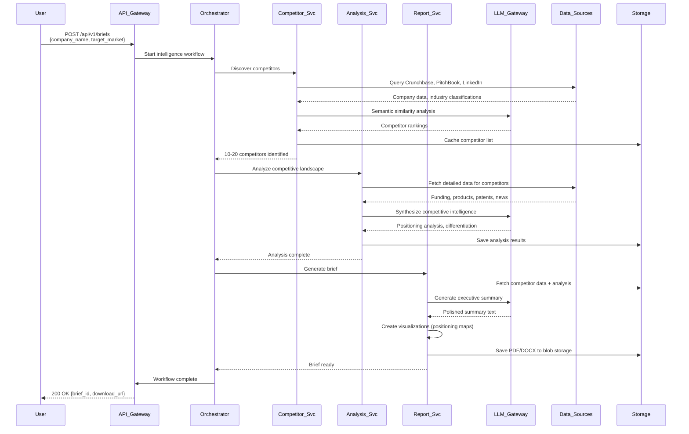
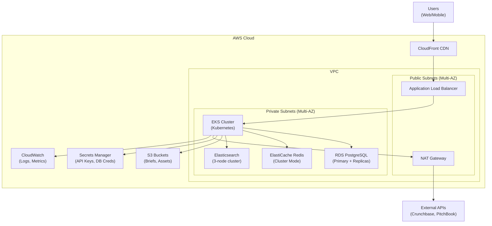

# System Architecture Overview: VC Competitive Intelligence Platform

**Document Metadata**<br/>
Sprint: 02 - VC Competitive Intelligence<br/>
Task: 03 - Solution Architecture Design<br/>
Author: solution-architect<br/>
Date: 2025-11-18<br/>
Status: Final

---

## Executive Summary

This document presents the comprehensive system architecture for an AI-powered competitive intelligence platform designed specifically for venture capital investment workflows. The architecture supports automated competitive landscape analysis, reducing research time from 2-3 hours to 15-30 minutes per company while providing consistent, comprehensive intelligence briefs.

**Key Architectural Decisions**:

- **Event-Driven Microservices**: Loosely coupled services for data ingestion, analysis, and reporting with asynchronous processing
- **Multi-Source Data Aggregation**: Parallel ingestion from Crunchbase, PitchBook, LinkedIn, USPTO, news sources with confidence scoring
- **Hybrid Deployment Model**: Cloud-native SaaS with optional on-premise deployment for sensitive data handling
- **AI-First Intelligence Engine**: LLM-powered competitive synthesis with formal verification gates to prevent hallucination
- **VC-Specific Workflow Integration**: Deep integration with Affinity, Salesforce, and VC platform tools

**Architecture Characteristics**:

- **Scalability**: Horizontal scaling to 10,000+ analyses per month
- **Reliability**: 99.9% uptime SLA with circuit breakers and graceful degradation
- **Security**: SOC 2 Type II compliant with encryption at rest and in transit
- **Performance**: <30 second response time for competitive intelligence brief generation
- **Extensibility**: Plugin architecture for new data sources and analysis modules

---

## System Architecture Diagram

```mermaid
graph TB
    subgraph "Client Layer"
        WEB["Web Application<br/>(React/TypeScript)"]
        MOBILE["Mobile App<br/>(React Native)"]
        API_CLIENT["API Clients<br/>(REST/GraphQL)"]
    end

    subgraph "API Gateway & Authentication"
        GATEWAY["API Gateway<br/>(Kong/AWS API Gateway)"]
        AUTH["Authentication Service<br/>(SSO/SAML/OAuth2)"]
        RATE_LIMIT["Rate Limiter<br/>(Redis-based)"]
    end

    subgraph "Core Services Layer"
        ORCHESTRATOR["Intelligence Orchestrator<br/>(Workflow Engine)"]
        COMPETITOR_SVC["Competitor Discovery<br/>Service"]
        ANALYSIS_SVC["Competitive Analysis<br/>Service"]
        REPORT_SVC["Report Generation<br/>Service"]
        MONITOR_SVC["Portfolio Monitoring<br/>Service"]
    end

    subgraph "Data Ingestion Layer"
        CRUNCHBASE["Crunchbase Ingestion"]
        PITCHBOOK["PitchBook Ingestion"]
        LINKEDIN["LinkedIn Scraper"]
        PATENT["Patent DB Crawler<br/>(USPTO/EPO)"]
        NEWS["News Aggregator<br/>(RSS/API)"]
        JOBS["Job Posting Analyzer<br/>(LinkedIn/Indeed)"]
    end

    subgraph "AI/ML Layer"
        LLM_GATEWAY["LLM Gateway<br/>(GPT-4/Claude)"]
        NLP_ENGINE["NLP Engine<br/>(spaCy/Transformers)"]
        KNOWLEDGE_GRAPH["Knowledge Graph<br/>(Neo4j)"]
        EMBEDDING_SVC["Embedding Service<br/>(OpenAI/Cohere)"]
    end

    subgraph "Data Storage Layer"
        PRIMARY_DB["Primary Database<br/>(PostgreSQL)"]
        CACHE["Cache Layer<br/>(Redis)"]
        VECTOR_DB["Vector Database<br/>(Pinecone/Weaviate)"]
        BLOB_STORAGE["Blob Storage<br/>(S3/Azure Blob)"]
        SEARCH_INDEX["Search Index<br/>(Elasticsearch)"]
    end

    subgraph "Integration Layer"
        CRM_INTEGRATION["CRM Integration<br/>(Affinity/Salesforce)"]
        NOTIFICATION["Notification Service<br/>(Email/Slack)"]
        WEBHOOK["Webhook Manager"]
        EXPORT["Export Service<br/>(PDF/DOCX/PPT)"]
    end

    subgraph "Infrastructure & Operations"
        LOGGING["Centralized Logging<br/>(ELK Stack)"]
        MONITORING["Monitoring & Alerts<br/>(Prometheus/Grafana)"]
        MESSAGE_QUEUE["Message Queue<br/>(RabbitMQ/SQS)"]
        SCHEDULER["Job Scheduler<br/>(Airflow/Temporal)"]
    end

    WEB --> GATEWAY
    MOBILE --> GATEWAY
    API_CLIENT --> GATEWAY

    GATEWAY --> AUTH
    GATEWAY --> RATE_LIMIT
    GATEWAY --> ORCHESTRATOR

    ORCHESTRATOR --> COMPETITOR_SVC
    ORCHESTRATOR --> ANALYSIS_SVC
    ORCHESTRATOR --> REPORT_SVC
    ORCHESTRATOR --> MONITOR_SVC

    COMPETITOR_SVC --> CRUNCHBASE
    COMPETITOR_SVC --> PITCHBOOK
    COMPETITOR_SVC --> LINKEDIN
    COMPETITOR_SVC --> KNOWLEDGE_GRAPH

    ANALYSIS_SVC --> LLM_GATEWAY
    ANALYSIS_SVC --> NLP_ENGINE
    ANALYSIS_SVC --> EMBEDDING_SVC
    ANALYSIS_SVC --> VECTOR_DB

    REPORT_SVC --> EXPORT
    REPORT_SVC --> BLOB_STORAGE

    MONITOR_SVC --> NEWS
    MONITOR_SVC --> JOBS
    MONITOR_SVC --> PATENT

    COMPETITOR_SVC --> PRIMARY_DB
    ANALYSIS_SVC --> PRIMARY_DB
    REPORT_SVC --> PRIMARY_DB
    MONITOR_SVC --> PRIMARY_DB

    COMPETITOR_SVC --> CACHE
    ANALYSIS_SVC --> CACHE

    REPORT_SVC --> CRM_INTEGRATION
    MONITOR_SVC --> NOTIFICATION
    ORCHESTRATOR --> WEBHOOK

    ORCHESTRATOR --> MESSAGE_QUEUE
    MESSAGE_QUEUE --> SCHEDULER

    ORCHESTRATOR --> LOGGING
    COMPETITOR_SVC --> LOGGING
    ANALYSIS_SVC --> LOGGING

    ORCHESTRATOR --> MONITORING
    COMPETITOR_SVC --> MONITORING
    ANALYSIS_SVC --> MONITORING
```



---

## Core Architecture Components

### 1. Client Layer

**Web Application**:

- **Technology**: React 18+ with TypeScript, TanStack Query for data fetching
- **Features**: Interactive dashboards, competitive intelligence brief viewer, search interface
- **UX Focus**: Fast, intuitive navigation for time-constrained VC professionals
- **Responsive Design**: Optimized for desktop (primary) and tablet usage

**Mobile Application**:

- **Technology**: React Native for iOS/Android with shared business logic
- **Use Cases**: On-the-go brief review, notification management, quick competitor lookup
- **Offline Support**: Cached briefs for offline reading during flights/commutes

**API Clients**:

- **REST API**: Standard CRUD operations, brief generation, search
- **GraphQL API**: Flexible data querying for custom integrations
- **Webhooks**: Event-driven notifications for brief completion, competitor alerts

### 2. API Gateway & Authentication

**API Gateway** (Kong or AWS API Gateway):

- **Request Routing**: Intelligent routing to appropriate microservices
- **Load Balancing**: Distribute traffic across service instances
- **Protocol Translation**: REST → gRPC for internal service communication
- **API Versioning**: Support v1, v2 with graceful deprecation

**Authentication Service**:

- **SSO Integration**: SAML 2.0, OAuth 2.0, OpenID Connect
- **Identity Providers**: Okta, Auth0, Azure AD, Google Workspace
- **Multi-Factor Authentication (MFA)**: Required for all user accounts
- **Role-Based Access Control (RBAC)**: Partner, Principal, Analyst, Read-Only roles

**Rate Limiting**:

- **Per-User Limits**: 1,000 requests/hour for standard tier, 10,000 for enterprise
- **Per-Endpoint Limits**: Brief generation (10/hour standard, 50/hour enterprise)
- **Graceful Throttling**: Queue requests when near limit, reject with 429 when exceeded

### 3. Core Services Layer

**Intelligence Orchestrator** (Workflow Engine):

- **Technology**: Temporal.io for durable workflow execution
- **Responsibilities**: Coordinate multi-step intelligence gathering workflows
- **Retry Logic**: Exponential backoff for transient failures
- **Workflow Examples**:
  - Competitive brief generation (7-step process)
  - Portfolio monitoring (scheduled daily sweeps)
  - Deep-dive analysis (15-20 page reports)

**Competitor Discovery Service**:

- **Function**: Identify 10-20 competitors for a given target company
- **Algorithms**:
  - Semantic similarity using company descriptions
  - Industry classification (NAICS/SIC codes)
  - Product overlap detection
  - Investor co-occurrence analysis
- **Output**: Ranked competitor list with confidence scores (0-100%)

**Competitive Analysis Service**:

- **Function**: Synthesize competitive intelligence from multi-source data
- **Analysis Modules**:
  - Positioning analysis (feature comparison, pricing, go-to-market)
  - Technology differentiation (patent analysis, tech stack detection)
  - Market sizing validation (cross-reference TAM/SAM/SOM claims)
  - Growth trajectory comparison (funding, revenue, hiring trends)
- **LLM Integration**: GPT-4 Turbo or Claude 3 Opus for synthesis
- **Verification Gates**: Fact-checking against source documents, confidence scoring

**Report Generation Service**:

- **Templates**: Executive brief (5-10 pages), deep-dive analysis (15-20 pages), one-pager
- **Sections**: Executive summary, competitive landscape map, market sizing, differentiation analysis, investment thesis implications
- **Visualizations**: 2x2 positioning maps, competitive matrices, funding timeline charts
- **Export Formats**: PDF, DOCX, PowerPoint, Markdown, HTML

**Portfolio Monitoring Service**:

- **Scheduled Monitoring**: Daily sweeps for portfolio companies
- **Alert Triggers**:
  - New competitor funding rounds
  - Competitive product launches
  - Significant hiring changes (engineering team growth)
  - Patent filings by competitors
  - Pricing/positioning changes
- **Notification Routing**: Email, Slack, in-app notifications based on user preferences

---

## Data Flow Architecture

### Competitive Intelligence Brief Generation Flow



**Performance Targets**:

- **Competitor Discovery**: <10 seconds
- **Competitive Analysis**: 20-40 seconds (depending on competitor count)
- **Report Generation**: 10-20 seconds
- **Total End-to-End**: <60 seconds for standard brief

---

## Technology Stack Summary

| Layer | Component | Technology | Rationale |
|-------|-----------|-----------|-----------|
| **Frontend** | Web App | React 18 + TypeScript | Industry standard, excellent ecosystem, TypeScript for safety |
| | Mobile App | React Native | Code sharing with web, single team maintains both |
| | State Management | TanStack Query + Zustand | Server state (Query) + client state (Zustand) separation |
| **Backend** | API Gateway | Kong or AWS API Gateway | Mature, scalable, extensive plugin ecosystem |
| | Microservices | Node.js (TypeScript) + Python | Node for API services, Python for ML/data processing |
| | Workflow Engine | Temporal.io | Durable workflows, excellent retry/error handling |
| **Data** | Primary DB | PostgreSQL 15+ | ACID compliance, JSON support, full-text search |
| | Cache | Redis 7+ | Sub-millisecond latency, pub/sub for real-time updates |
| | Vector DB | Pinecone or Weaviate | Semantic search for competitor discovery |
| | Knowledge Graph | Neo4j | Relationship mapping for competitive landscape |
| | Search | Elasticsearch 8+ | Full-text search across briefs and source documents |
| **AI/ML** | LLM | GPT-4 Turbo / Claude 3 Opus | Best-in-class reasoning and synthesis capabilities |
| | NLP | spaCy + HuggingFace Transformers | Named entity recognition, classification |
| | Embeddings | OpenAI text-embedding-3 | High-quality semantic embeddings |
| **Infrastructure** | Cloud Platform | AWS (primary) or Azure | Mature, extensive service catalog, VC familiarity |
| | Container Orchestration | Kubernetes (EKS) | Industry standard, portability, auto-scaling |
| | Message Queue | RabbitMQ or AWS SQS | Reliable async processing |
| | Monitoring | Prometheus + Grafana | Open-source, extensive integrations |
| | Logging | ELK Stack (Elasticsearch, Logstash, Kibana) | Centralized logging, powerful querying |

---

## Scalability & Performance Architecture

### Horizontal Scaling Strategy

**Stateless Services**:

- All core services designed to be stateless (no in-memory session state)
- Enables horizontal scaling behind load balancers
- Session state stored in Redis with sticky sessions for WebSocket connections

**Auto-Scaling Policies**:

- **CPU-Based**: Scale out when CPU > 70% for 2 minutes, scale in when CPU < 30% for 5 minutes
- **Queue Depth**: Scale out when message queue depth > 100, scale in when < 10
- **Brief Generation Latency**: Scale out when p95 latency > 45 seconds

**Database Scaling**:

- **PostgreSQL**: Primary for writes, read replicas (2-3) for analytics queries
- **Redis**: Cluster mode with 3 master nodes, 3 replicas for high availability
- **Elasticsearch**: 3-node cluster (minimum) with shard replication

### Caching Strategy

**Cache Layers**:

1. **CDN Cache** (CloudFront): Static assets, public briefs (if shared externally)
2. **Application Cache** (Redis): API responses (5-60 min TTL), user sessions
3. **Database Query Cache**: Frequently accessed competitor data (1-24 hour TTL)
4. **LLM Response Cache**: Cache identical prompts to reduce API costs (7-day TTL)

**Cache Invalidation**:

- **Time-Based**: TTLs configured per data type (competitor data: 24h, news: 1h)
- **Event-Based**: Invalidate when source data changes (e.g., Crunchbase update)
- **Manual Purge**: Admin interface to clear cache for specific companies

### Performance Optimization

**Parallel Data Fetching**:

- Fetch data from multiple sources (Crunchbase, PitchBook, LinkedIn) in parallel
- Use Promise.all() for concurrent API calls, fail gracefully if one source times out

**Lazy Loading**:

- Load detailed competitor data only when user expands a competitor in the UI
- Paginate competitor lists (10 per page) to reduce initial load time

**Database Optimization**:

- Indexed columns: company_name, industry, funding_amount, created_at
- Materialized views for complex analytics queries (refresh every 6 hours)
- Query optimization: EXPLAIN ANALYZE for all queries >100ms

**LLM Optimization**:

- Use smaller models (GPT-3.5 Turbo) for simple tasks (entity extraction, classification)
- Use larger models (GPT-4 Turbo, Claude 3 Opus) only for synthesis and reasoning
- Batch processing: Combine multiple prompts into single API call when possible

---

## Security Architecture

### Authentication & Authorization

**Multi-Layered Security**:

1. **API Gateway**: Validate JWT tokens, enforce rate limits
2. **Service Layer**: Verify JWT signature, extract user claims
3. **Database Layer**: Row-level security (RLS) for multi-tenant data isolation

**Role-Based Access Control (RBAC)**:

| Role | Permissions |
|------|------------|
| **Partner** | Full access: create briefs, view all briefs, export data, manage users |
| **Principal** | Create briefs, view all briefs, export data |
| **Analyst** | Create briefs, view assigned briefs, no export |
| **Read-Only** | View briefs only, no creation or export |

**SSO/SAML Integration**:

- Support SAML 2.0 for enterprise customers
- Support OAuth 2.0 for Google Workspace, Microsoft 365
- Just-In-Time (JIT) provisioning: Auto-create user accounts on first login

### Data Security

**Encryption**:

- **At Rest**: AES-256 encryption for all databases and blob storage
- **In Transit**: TLS 1.3 for all API communication
- **Application-Level**: Encrypt sensitive fields (company financials) with field-level encryption

**Data Isolation**:

- **Multi-Tenancy**: Separate database schema per VC firm (schema-per-tenant)
- **Network Isolation**: VPC with private subnets for databases and internal services
- **Access Control**: IAM roles with least-privilege principle

**Compliance**:

- **SOC 2 Type II**: Annual audit for security, availability, confidentiality
- **GDPR**: Data residency options (EU data stored in EU regions), right to deletion
- **CCPA**: California privacy rights compliance for US-based VCs

### API Security

**Rate Limiting**:

- Per-user limits: 1,000 requests/hour (standard), 10,000/hour (enterprise)
- Per-IP limits: 10,000 requests/hour to prevent DDoS
- Brief generation limits: 10/hour (standard), 50/hour (enterprise)

**Input Validation**:

- Validate all inputs against schema (JSON Schema validation)
- Sanitize inputs to prevent SQL injection, XSS attacks
- Reject requests with excessively large payloads (>10MB)

**API Key Management**:

- Rotate API keys every 90 days (automated reminder emails)
- Store API keys in secrets manager (AWS Secrets Manager, HashiCorp Vault)
- Audit log for all API key usage (who, when, what endpoint)

---

## Reliability & Fault Tolerance

### High Availability Architecture

**Multi-AZ Deployment**:

- Deploy services across 3 availability zones (AZs) for 99.9% uptime
- Database replication: Primary in AZ-1, replicas in AZ-2 and AZ-3
- Load balancer health checks: Remove unhealthy instances within 30 seconds

**Circuit Breaker Pattern**:

- Detect failing external services (Crunchbase, PitchBook) and fail fast
- Fallback to cached data when external service is unavailable
- Auto-retry with exponential backoff (1s, 2s, 4s, 8s, 16s)

**Graceful Degradation**:

- If LLM service is unavailable, generate brief with template-based text (no synthesis)
- If one data source fails (e.g., PitchBook), continue with remaining sources
- Display partial results with warning banner ("Limited data available")

### Disaster Recovery

**Backup Strategy**:

- **Database**: Automated daily backups with 30-day retention, point-in-time recovery
- **Blob Storage**: Cross-region replication (S3 CRR) for all PDFs/reports
- **Configuration**: Version-controlled infrastructure-as-code (Terraform/CloudFormation)

**Recovery Time Objective (RTO)**: 4 hours<br/>
**Recovery Point Objective (RPO)**: 1 hour (max data loss)

**Failover Procedures**:

1. Detect primary region failure (health check failures across all AZs)
2. Promote read replica in secondary region to primary
3. Update DNS to point to secondary region (Route53 failover routing)
4. Resume service in secondary region (<4 hours)

### Error Handling & Monitoring

**Error Classification**:

- **Transient Errors**: Retry automatically (network timeouts, rate limits)
- **Permanent Errors**: Log and alert (API authentication failures, invalid data)
- **User Errors**: Return clear error messages (invalid company name, missing parameters)

**Monitoring & Alerts**:

- **Uptime Monitoring**: Pingdom or similar for external health checks
- **Application Metrics**: Prometheus for latency, error rates, throughput
- **Business Metrics**: Track briefs generated, user engagement, data quality scores
- **Alert Channels**: PagerDuty for critical alerts, Slack for warnings

**Alert Thresholds**:

| Metric | Warning | Critical | Action |
|--------|---------|----------|--------|
| API Error Rate | >2% | >5% | Auto-scale, investigate logs |
| Brief Generation Latency | >45s (p95) | >90s (p95) | Scale services, optimize queries |
| Database CPU | >70% | >85% | Scale read replicas, optimize queries |
| External API Failures | >10% | >25% | Switch to cached data, notify vendor |

---

## Deployment Architecture

### Cloud Infrastructure (AWS)



**Infrastructure Components**:

- **VPC**: Isolated network with public/private subnets across 3 AZs
- **EKS (Elastic Kubernetes Service)**: Managed Kubernetes for microservices
- **RDS PostgreSQL**: Multi-AZ deployment with automated backups
- **ElastiCache Redis**: Cluster mode with automatic failover
- **Elasticsearch**: AWS OpenSearch Service (3-node cluster)
- **S3**: Blob storage for briefs, static assets (versioned, lifecycle policies)
- **CloudFront**: Global CDN for low-latency content delivery
- **Secrets Manager**: Centralized secrets storage with auto-rotation

### Container Deployment (Kubernetes)

**Namespaces**:

- `production`: Production workloads
- `staging`: Pre-production testing environment
- `monitoring`: Prometheus, Grafana, ELK stack

**Deployment Strategy**:

- **Rolling Updates**: Deploy new versions with zero downtime
- **Blue-Green Deployments**: For major releases, switch traffic after validation
- **Canary Deployments**: Route 5% traffic to new version, monitor for errors, then 100%

**Resource Allocation**:

| Service | CPU Request | CPU Limit | Memory Request | Memory Limit | Replicas |
|---------|-------------|-----------|----------------|--------------|----------|
| API Gateway | 500m | 2 | 512Mi | 2Gi | 3-10 (auto-scale) |
| Orchestrator | 1 | 4 | 1Gi | 4Gi | 2-8 (auto-scale) |
| Competitor Discovery | 1 | 4 | 2Gi | 8Gi | 3-10 (auto-scale) |
| Analysis Service | 2 | 8 | 4Gi | 16Gi | 2-10 (auto-scale) |
| Report Generation | 1 | 4 | 2Gi | 8Gi | 2-6 (auto-scale) |

**Health Checks**:

- **Liveness Probe**: HTTP GET /health every 10 seconds
- **Readiness Probe**: HTTP GET /ready every 5 seconds
- **Startup Probe**: HTTP GET /startup every 5 seconds (max 30 attempts)

---

## Development & Operations (DevOps)

### CI/CD Pipeline

```mermaid
graph LR
    DEV["Developer<br/>Commits Code"] --> GIT["GitHub/GitLab"]
    GIT --> CI["CI Pipeline<br/>(GitHub Actions)"]
    CI --> BUILD["Build & Test<br/>(Docker Images)"]
    BUILD --> SCAN["Security Scan<br/>(Snyk, Trivy)"]
    SCAN --> PUSH["Push to Registry<br/>(ECR)"]
    PUSH --> DEPLOY_STAGING["Deploy to Staging<br/>(Kubernetes)"]
    DEPLOY_STAGING --> E2E["E2E Tests<br/>(Playwright)"]
    E2E --> APPROVE["Manual Approval<br/>(for Production)"]
    APPROVE --> DEPLOY_PROD["Deploy to Production<br/>(Blue-Green)"]
    DEPLOY_PROD --> MONITOR["Monitor Metrics<br/>(Prometheus/Grafana)"]
```



**Pipeline Steps**:

1. **Code Commit**: Developer pushes to GitHub (feature branch)
2. **Automated Tests**: Run unit tests, integration tests (Jest, pytest)
3. **Build Docker Images**: Multi-stage builds for optimized image size
4. **Security Scanning**: Snyk for vulnerabilities, Trivy for container scanning
5. **Push to Registry**: Amazon ECR (Elastic Container Registry)
6. **Deploy to Staging**: Kubernetes deployment with Helm charts
7. **E2E Tests**: Playwright tests against staging environment
8. **Manual Approval**: Product manager approves production deployment
9. **Deploy to Production**: Blue-green deployment with traffic switching
10. **Post-Deployment Monitoring**: Watch error rates, latency for 1 hour

**Deployment Frequency**: 2-3 times per week (staging), 1-2 times per week (production)

### Infrastructure as Code (IaC)

**Tools**: Terraform for AWS infrastructure, Helm for Kubernetes resources

**Repository Structure**:
```
infrastructure/
├── terraform/
│   ├── modules/
│   │   ├── vpc/
│   │   ├── eks/
│   │   ├── rds/
│   │   └── s3/
│   ├── environments/
│   │   ├── staging/
│   │   └── production/
│   └── main.tf
├── kubernetes/
│   ├── base/
│   ├── overlays/
│   │   ├── staging/
│   │   └── production/
│   └── helm-charts/
└── scripts/
    ├── deploy.sh
    └── rollback.sh
```

**Change Management**:

- All infrastructure changes via pull requests
- Terraform plan output reviewed before apply
- State files stored in S3 with DynamoDB locking
- Separate AWS accounts for staging and production

---

## Cost Optimization

### Cost Breakdown (Monthly Estimates)

| Category | Service | Cost (Low) | Cost (High) | Notes |
|----------|---------|------------|-------------|-------|
| **Compute** | EKS Cluster | $300 | $1,500 | 3-15 nodes (t3.large → c5.2xlarge) |
| **Database** | RDS PostgreSQL | $200 | $800 | db.t3.large → db.r5.2xlarge |
| | ElastiCache Redis | $100 | $400 | cache.t3.medium → cache.r5.xlarge |
| | Elasticsearch | $150 | $600 | t3.medium × 3 → r5.xlarge × 3 |
| **Storage** | S3 | $50 | $300 | 500GB → 5TB (briefs, assets) |
| **AI/ML** | OpenAI API | $500 | $5,000 | 100K → 1M tokens/day |
| **Data Sources** | Crunchbase API | $300 | $1,000 | 10K → 50K API calls/month |
| | PitchBook API | $500 | $2,000 | Enterprise tier |
| **Networking** | CloudFront | $50 | $300 | Data transfer costs |
| | Load Balancer | $25 | $100 | ALB hours + data processing |
| **Monitoring** | CloudWatch | $50 | $200 | Logs, metrics, alarms |
| **Total** | | **$2,225** | **$12,200** | Scales with customer count |

**Cost Optimization Strategies**:

1. **Reserved Instances**: Save 40-60% on RDS, ElastiCache with 1-year commitments
2. **Spot Instances**: Use for non-critical batch jobs (50-70% savings)
3. **Auto-Scaling**: Scale down during off-hours (nights, weekends)
4. **LLM Cost Reduction**: Cache responses, use smaller models where possible
5. **Data Source Optimization**: Batch API calls, cache responses for 24 hours
6. **S3 Lifecycle Policies**: Move old briefs to Glacier after 90 days (80% savings)

---

## Migration & Onboarding Strategy

### Phase 1: MVP (Weeks 1-5)

**Minimal Viable Architecture**:

- **Monolith**: Single Node.js application (not microservices yet)
- **Database**: Single PostgreSQL instance (no read replicas)
- **Data Sources**: Crunchbase API only (add others later)
- **LLM**: OpenAI GPT-3.5 Turbo (cheaper, faster for MVP)
- **Deployment**: Single EC2 instance or Heroku (simplicity)
- **Authentication**: Basic JWT (no SSO yet)

**Goal**: Validate core value proposition with 2-3 pilot customers

### Phase 2: Production-Ready (Weeks 6-12)

**Migrate to Microservices**:

- Split monolith into 4-5 core services
- Deploy to Kubernetes (EKS)
- Add read replicas for database
- Implement caching layer (Redis)

**Add Data Sources**:

- PitchBook API integration
- LinkedIn scraper
- News aggregation

**Upgrade LLM**:

- Migrate to GPT-4 Turbo for better synthesis
- Add Claude 3 Opus as fallback

**Security Hardening**:

- Add SSO/SAML support
- Implement SOC 2 controls
- Encrypt sensitive data

### Phase 3: Scale (Months 4-12)

**Optimize for Scale**:

- Add vector database (Pinecone) for semantic search
- Implement knowledge graph (Neo4j)
- Add portfolio monitoring service
- Build CRM integrations (Affinity, Salesforce)

**Enterprise Features**:

- Multi-tenant architecture with schema-per-tenant
- Custom report templates
- White-label options
- API access for custom integrations

---

## Key Success Metrics

### Technical Metrics

| Metric | Target | Measurement |
|--------|--------|-------------|
| **Availability** | 99.9% uptime | Pingdom, CloudWatch |
| **Latency** | <30s (p95) for brief generation | Prometheus |
| **Error Rate** | <1% for API requests | Application logs |
| **Data Quality** | >90% confidence score for competitor identification | Internal scoring system |
| **LLM Cost** | <$5 per brief | OpenAI API usage tracking |

### Business Metrics

| Metric | Target | Measurement |
|--------|--------|-------------|
| **Briefs Generated** | 1,000/month (Year 1) → 10,000/month (Year 3) | Database query |
| **Time Savings** | 40-60% reduction (2-3 hours → 45-60 minutes) | User surveys |
| **User Adoption** | 70%+ of investment team using platform | Active user count |
| **Report Quality** | 80%+ rated "valuable" or "very valuable" | Post-brief surveys |
| **Renewal Rate** | 85%+ annual subscription renewal | CRM tracking |

---

## References

[1] "VC Management Software Market Report 2024-2033," Grand View Research, 2024.

[2] "AI Adoption in Venture Capital: 2025 Survey," CB Insights, Q1 2025.

[3] "Microservices Architecture Patterns," Martin Fowler, martinfowler.com/microservices, 2024.

[4] "Temporal: Durable Workflow Engine," Temporal Technologies, temporal.io/docs, 2024.

[5] "AWS Well-Architected Framework: Reliability Pillar," Amazon Web Services, 2024.

[6] "Kubernetes Best Practices for Production," Google Cloud, 2024.

[7] "SOC 2 Compliance Guide for SaaS Companies," Vanta, 2024.

[8] "LLM Cost Optimization Strategies," OpenAI, platform.openai.com/docs, 2024.

[9] "Competitive Intelligence Best Practices for VCs," Pitchbook Research, 2024.

[10] "Multi-Tenant Architecture Patterns," Microsoft Azure, docs.microsoft.com, 2024.

---

**Document Status**: Final<br/>
**Next Review Date**: 2025-12-18<br/>
**Owner**: solution-architect<br/>
**Approvers**: technical-researcher, sprint-orchestrator
