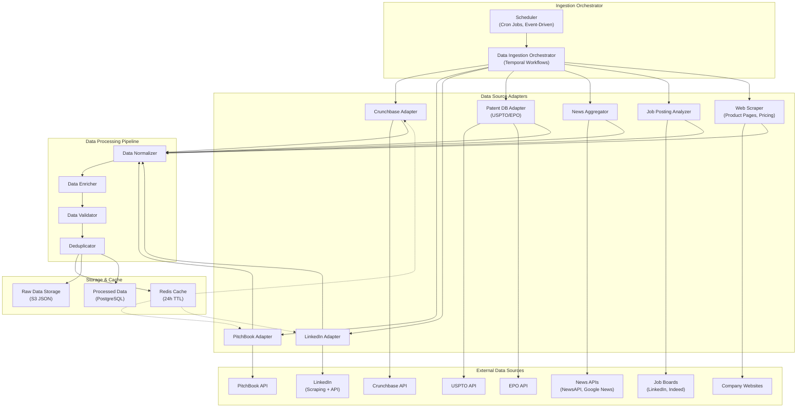

# Data Ingestion Layer: Multi-Source Competitive Intelligence Aggregation

**Document Metadata**<br/>
Sprint: 02 - VC Competitive Intelligence<br/>
Task: 03 - Solution Architecture Design<br/>
Author: solution-architect<br/>
Date: 2025-11-18<br/>
Status: Final

---

## Executive Summary

The Data Ingestion Layer is the foundation of the VC Competitive Intelligence platform, responsible for collecting, normalizing, and enriching data from 10+ external sources. This layer must handle diverse data formats, API rate limits, authentication mechanisms, and data quality challenges while maintaining high reliability and performance.

**Key Design Principles**:

- **Multi-Source Aggregation**: Parallel ingestion from Crunchbase, PitchBook, LinkedIn, USPTO, news sources
- **Resilience**: Circuit breakers, exponential backoff, graceful degradation when sources fail
- **Data Quality**: Confidence scoring, cross-source validation, deduplication
- **Cost Optimization**: Intelligent caching, batch processing, API quota management
- **Extensibility**: Plugin architecture for adding new data sources without core changes

**Performance Targets**:

- **Ingestion Speed**: <10 seconds to fetch data for 20 competitors
- **Reliability**: 99.5% success rate (accounting for external API failures)
- **Freshness**: Data cached for 24 hours (configurable per source)
- **Cost Efficiency**: <$2 per competitive brief in data source API costs

---

## Data Ingestion Architecture



---

## Data Source Adapters

### 1. Crunchbase Adapter

**Purpose**: Primary source for company data, funding, founders, investors

**API Details**:

- **Endpoint**: https://api.crunchbase.com/api/v4/
- **Authentication**: API Key (header: `X-cb-user-key`)
- **Rate Limits**: 200 requests/minute (Enterprise tier), 40 requests/minute (Basic tier)
- **Pricing**: $79/month (Basic) → $999/month (Enterprise)

**Data Extracted**:

| Field | Example | Use Case |
|-------|---------|----------|
| Company Name | "Stripe" | Primary identifier |
| Description | "Online payment processing for internet businesses" | Competitor matching |
| Category Groups | ["Financial Services", "Payments"] | Industry classification |
| Funding Total | $2.2B | Growth trajectory |
| Funding Rounds | Series A-H | Investment stage |
| Founders | Patrick Collison, John Collison | Team background |
| Investors | Sequoia, a16z, Tiger Global | Investor overlap |
| Employee Count | 8,000 (estimate) | Company size |
| Headquarters | San Francisco, CA | Geographic focus |
| Founded Date | 2010-01-01 | Company age |

**API Request Example**:
```javascript
// Fetch company data
const response = await fetch(
  'https://api.crunchbase.com/api/v4/entities/organizations/stripe',
  {
    headers: {
      'X-cb-user-key': process.env.CRUNCHBASE_API_KEY,
    },
  }
);

const data = await response.json();
```

**Error Handling**:

- **Rate Limit (429)**: Wait for `Retry-After` header seconds, then retry (max 3 attempts)
- **Not Found (404)**: Return null, mark company as "not found in Crunchbase"
- **Server Error (500-503)**: Retry with exponential backoff (1s, 2s, 4s)
- **Authentication Error (401)**: Alert dev team, pause ingestion for this source

**Caching Strategy**:

- **Cache Key**: `crunchbase:org:{permalink}` (e.g., `crunchbase:org:stripe`)
- **TTL**: 24 hours for general data, 1 hour for funding rounds (more dynamic)
- **Invalidation**: Manual purge via admin UI or webhook from Crunchbase

### 2. PitchBook Adapter

**Purpose**: Detailed VC-specific data (valuations, deal terms, investor sentiment)

**API Details**:

- **Endpoint**: https://api.pitchbook.com/v1/
- **Authentication**: OAuth 2.0 client credentials
- **Rate Limits**: 1,000 requests/hour (Enterprise tier)
- **Pricing**: Custom pricing, typically $20K-50K/year for API access

**Data Extracted**:

| Field | Example | Use Case |
|-------|---------|----------|
| Company Name | "Stripe" | Cross-reference with Crunchbase |
| Valuation | $95B (last round) | Market positioning |
| Revenue (Estimated) | $7.4B (2022) | Growth trajectory |
| Revenue Multiple | 12.8x | Benchmarking |
| Deal Terms | Liquidation preference, board seats | Investment structure |
| Comparable Companies | Square, Adyen, PayPal | Competitor identification |
| Investor Sentiment | "High" (based on fund follow-on rates) | Investment thesis validation |

**API Request Example**:
```javascript
// Fetch company data with OAuth
const tokenResponse = await fetch('https://api.pitchbook.com/oauth/token', {
  method: 'POST',
  headers: { 'Content-Type': 'application/x-www-form-urlencoded' },
  body: new URLSearchParams({
    grant_type: 'client_credentials',
    client_id: process.env.PITCHBOOK_CLIENT_ID,
    client_secret: process.env.PITCHBOOK_CLIENT_SECRET,
  }),
});

const { access_token } = await tokenResponse.json();

const companyResponse = await fetch(
  'https://api.pitchbook.com/v1/companies?name=Stripe',
  {
    headers: { Authorization: `Bearer ${access_token}` },
  }
);

const data = await companyResponse.json();
```

**Error Handling**:

- **Rate Limit (429)**: Queue request for next hour window
- **Not Found (404)**: Fallback to Crunchbase data only
- **Auth Expired (401)**: Refresh OAuth token, retry request
- **Server Error (500-503)**: Retry up to 3 times, then degrade gracefully

**Caching Strategy**:

- **Cache Key**: `pitchbook:company:{id}`
- **TTL**: 24 hours (valuations change infrequently)
- **Invalidation**: Scheduled refresh for portfolio companies (weekly)

### 3. LinkedIn Adapter

**Purpose**: Employee data, hiring trends, executive profiles, company updates

**Implementation Approach**:

LinkedIn's official API is highly restricted (requires partnership). Two alternatives:

**Option A: Official LinkedIn Marketing Developer Platform** (Preferred):

- **Access**: Requires LinkedIn partnership or marketing partner integration
- **Data Available**: Company pages, follower counts, employee counts (aggregated only)
- **Limitations**: No individual employee data, limited to public company pages

**Option B: Web Scraping** (Fallback):

- **Technology**: Puppeteer/Playwright for headless browser automation
- **Challenges**: CAPTCHA, IP blocking, rate limiting, legal considerations
- **Compliance**: Respect robots.txt, terms of service, rotating proxies
- **Risk**: High risk of blocking, should be used sparingly and with legal review

**Data Extracted** (where accessible):

| Field | Example | Use Case |
|-------|---------|----------|
| Employee Count | 8,234 | Company size tracking |
| Employee Growth | +15% QoQ | Hiring momentum |
| Job Postings | 127 open positions (42 engineering) | Talent demand signal |
| Executive Profiles | CEO, CTO, VP Engineering | Team experience |
| Company Updates | Product launches, funding announcements | Competitive intelligence |

**Scraping Example** (Fallback):
```javascript
import puppeteer from 'puppeteer';

async function scrapeLinkedInCompany(companyUrl) {
  const browser = await puppeteer.launch({ headless: true });
  const page = await browser.newPage();

  await page.goto(companyUrl, { waitUntil: 'networkidle2' });

  const data = await page.evaluate(() => {
    const employeeCount = document.querySelector('.org-top-card-summary-info-list__info-item')?.innerText;
    const description = document.querySelector('.org-top-card-summary__description')?.innerText;

    return { employeeCount, description };
  });

  await browser.close();
  return data;
}
```

**Error Handling**:

- **CAPTCHA Detected**: Pause scraping, rotate proxy, retry in 5 minutes
- **Rate Limit**: Implement 1-2 second delay between requests
- **Blocked IP**: Rotate to next proxy in pool (maintain 10+ proxies)

**Caching Strategy**:

- **Cache Key**: `linkedin:company:{company_slug}`
- **TTL**: 7 days (employee counts change slowly)
- **Refresh Trigger**: User-initiated brief generation

**Legal Considerations**:

- Consult with legal team before implementing LinkedIn scraping
- Consider alternative: RocketReach, ZoomInfo APIs for employee data
- Ensure compliance with LinkedIn Terms of Service and CFAA

### 4. Patent Database Adapter (USPTO/EPO)

**Purpose**: Identify technology differentiation, R&D focus, innovation velocity

**USPTO API** (United States):

- **Endpoint**: https://developer.uspto.gov/api-catalog
- **Authentication**: API Key (free)
- **Rate Limits**: 120 requests/minute
- **Data Coverage**: US patents and applications (2001-present)

**EPO API** (Europe):

- **Endpoint**: https://www.epo.org/searching-for-patents/data/web-services.html
- **Authentication**: No key required (public API)
- **Rate Limits**: No official limit, but recommend <60 requests/minute
- **Data Coverage**: European patents and applications

**Data Extracted**:

| Field | Example | Use Case |
|-------|---------|----------|
| Patent Title | "System and method for secure payment processing" | Technology focus |
| Filing Date | 2023-03-15 | Innovation velocity |
| Inventors | John Doe, Jane Smith | Team expertise |
| Assignee | Stripe, Inc. | Patent ownership |
| Classifications | H04L29/06 (security), G06Q20/38 (payments) | Technology category |
| Claims Count | 23 claims | Patent scope |
| Citations | 45 forward citations | Impact/importance |

**API Request Example** (USPTO):
```javascript
// Search patents by assignee
const response = await fetch(
  'https://developer.uspto.gov/ibd-api/v1/application/grants?assignee=Stripe',
  {
    headers: {
      'X-API-Key': process.env.USPTO_API_KEY,
    },
  }
);

const patents = await response.json();
```

**Analysis**:

- **Patent Velocity**: Count patents filed in last 12 months (indicator of R&D investment)
- **Technology Focus**: Cluster patents by IPC classification (e.g., security, payments, ML)
- **Competitive Comparison**: Compare patent counts vs. competitors

**Error Handling**:

- **Rate Limit (429)**: Wait 60 seconds, retry
- **Not Found (404)**: Company may not have patents (startups), not an error
- **Server Error (500-503)**: Retry up to 3 times, then skip patent data

**Caching Strategy**:

- **Cache Key**: `uspto:assignee:{company_name}`
- **TTL**: 30 days (patents change slowly)
- **Refresh Trigger**: Scheduled monthly refresh for portfolio companies

### 5. News Aggregator

**Purpose**: Track competitor announcements, funding, product launches, market sentiment

**News APIs**:

**NewsAPI.org**:

- **Endpoint**: https://newsapi.org/v2/everything
- **Authentication**: API Key
- **Rate Limits**: 100 requests/day (free), 1,000 requests/day (paid)
- **Coverage**: 150,000+ sources worldwide
- **Pricing**: Free (developer), $449/month (business)

**Google News RSS**:

- **Endpoint**: https://news.google.com/rss/search?q={company_name}
- **Authentication**: None required
- **Rate Limits**: No official limit (implement 1 req/second to be respectful)
- **Coverage**: Comprehensive news aggregation

**Bing News Search API**:

- **Endpoint**: https://api.bing.microsoft.com/v7.0/news/search
- **Authentication**: API Key
- **Rate Limits**: 1,000 requests/month (free tier)
- **Coverage**: Bing-indexed news sources

**Data Extracted**:

| Field | Example | Use Case |
|-------|---------|----------|
| Headline | "Stripe raises $6.5B at $50B valuation" | Funding events |
| Published Date | 2023-03-14T10:30:00Z | Recency scoring |
| Source | TechCrunch, Wall Street Journal | Source credibility |
| Summary | "Stripe has raised $6.5B in Series H..." | Quick context |
| URL | https://techcrunch.com/... | Citation link |
| Sentiment | Positive (0.85) | Market sentiment |

**API Request Example** (NewsAPI):
```javascript
const response = await fetch(
  `https://newsapi.org/v2/everything?q="${companyName}"&sortBy=publishedAt&language=en`,
  {
    headers: {
      'X-Api-Key': process.env.NEWSAPI_KEY,
    },
  }
);

const { articles } = await response.json();
```

**Sentiment Analysis**:

- Use NLP library (spaCy, VADER) to score sentiment: -1 (negative) to +1 (positive)
- Aggregate sentiment across last 30 days to detect trends

**Error Handling**:

- **Rate Limit (429)**: Queue for next day's quota
- **No Results (200 with empty array)**: Expected for lesser-known companies
- **Server Error (500-503)**: Retry, fallback to Google News RSS

**Caching Strategy**:

- **Cache Key**: `news:{company_name}:{date}` (date = YYYY-MM-DD)
- **TTL**: 1 hour (news is time-sensitive)
- **Refresh Trigger**: User-initiated brief generation

### 6. Job Posting Analyzer

**Purpose**: Detect hiring trends, engineering team growth, technology stack signals

**Data Sources**:

**LinkedIn Jobs** (via scraping):

- Search for "{company_name}" on LinkedIn Jobs
- Extract job titles, locations, departments, posting dates

**Indeed API**:

- **Endpoint**: https://api.indeed.com/ads/apisearch
- **Authentication**: Publisher ID (free)
- **Rate Limits**: No official limit
- **Coverage**: 60+ countries

**Data Extracted**:

| Field | Example | Use Case |
|-------|---------|----------|
| Job Title | "Senior Backend Engineer - Payments" | Role focus |
| Department | Engineering | Hiring focus area |
| Location | San Francisco, CA (Remote OK) | Geographic expansion |
| Posted Date | 2025-11-10 | Hiring velocity |
| Required Skills | Python, Go, Kubernetes, PostgreSQL | Technology stack |
| Job Count (Last 30 Days) | 42 engineering jobs | Hiring momentum |

**API Request Example** (Indeed):
```javascript
const response = await fetch(
  `https://api.indeed.com/ads/apisearch?publisher=${INDEED_PUBLISHER_ID}&q=${companyName}&format=json&limit=100`,
);

const { results } = await response.json();
```

**Analysis**:

- **Engineering Hiring Velocity**: Count of engineering jobs posted in last 30 days
- **Technology Stack Detection**: Extract technologies from job descriptions (regex + NLP)
- **Growth Signal**: Month-over-month change in job postings

**Error Handling**:

- **No Results**: Expected for smaller companies or low hiring periods
- **Scraping Blocked**: Rotate proxies, implement delays
- **API Downtime**: Degrade gracefully, skip job posting data

**Caching Strategy**:

- **Cache Key**: `jobs:{company_name}:{month}` (e.g., `jobs:stripe:2025-11`)
- **TTL**: 7 days
- **Refresh Trigger**: Scheduled weekly refresh for portfolio companies

### 7. Web Scraper (Product Pages, Pricing)

**Purpose**: Extract product information, pricing, features from company websites

**Technology**: Puppeteer/Playwright for JavaScript-heavy sites, Cheerio for static HTML

**Target Pages**:

- Homepage: Company description, value proposition
- Product pages: Feature lists, use cases
- Pricing pages: Pricing tiers, feature comparison
- About page: Team bios, company history

**Data Extracted**:

| Field | Example | Use Case |
|-------|---------|----------|
| Product Features | "Real-time fraud detection, PCI compliance" | Feature comparison |
| Pricing Tiers | Starter ($99/mo), Pro ($499/mo), Enterprise (Custom) | Pricing benchmarking |
| Target Customers | "E-commerce, SaaS, Marketplaces" | Market positioning |
| Technology Mentioned | "Machine learning, API-first" | Competitive differentiation |

**Scraping Example**:
```javascript
import * as cheerio from 'cheerio';

async function scrapePricingPage(url) {
  const response = await fetch(url);
  const html = await response.text();
  const $ = cheerio.load(html);

  const pricingTiers = [];

  $('.pricing-card').each((i, elem) => {
    const name = $(elem).find('.tier-name').text();
    const price = $(elem).find('.price').text();
    const features = $(elem).find('.feature-list li').map((i, el) => $(el).text()).get();

    pricingTiers.push({ name, price, features });
  });

  return pricingTiers;
}
```

**Challenges**:

- **JavaScript-Rendered Content**: Use Puppeteer for sites that rely on client-side rendering
- **Dynamic Selectors**: Websites change frequently, selectors must be maintained
- **CAPTCHA**: Implement human-in-the-loop fallback for CAPTCHA-protected sites

**Error Handling**:

- **Page Not Found (404)**: Company may not have pricing page, not an error
- **Timeout**: Increase timeout to 30 seconds for slow sites, then skip
- **Parsing Errors**: Log error, return partial data if available

**Caching Strategy**:

- **Cache Key**: `webscrape:{domain}:{page_type}` (e.g., `webscrape:stripe.com:pricing`)
- **TTL**: 7 days (pricing changes infrequently)
- **Invalidation**: Manual refresh via admin UI

---

## Data Processing Pipeline

### 1. Data Normalizer

**Purpose**: Transform diverse data formats into unified schema

**Normalization Rules**:

| Source | Company Name Field | Funding Field | Employee Count Field |
|--------|-------------------|---------------|----------------------|
| Crunchbase | `properties.identifier.value` | `funding_total.value_usd` | `num_employees_enum` (range) |
| PitchBook | `companyName` | `totalRaised` | `employeeCount` (exact number) |
| LinkedIn | Company page title | N/A | `.org-top-card-summary-info-list__info-item` |

**Unified Schema**:
```typescript
interface CompanyData {
  name: string;
  description: string;
  industry: string[];
  funding: {
    total: number; // USD
    rounds: FundingRound[];
  };
  employees: {
    count: number; // best estimate
    range: string; // e.g., "1,000-5,000"
    source: string; // "crunchbase", "pitchbook", "linkedin"
  };
  headquarters: {
    city: string;
    state: string;
    country: string;
  };
  foundedDate: Date;
  sources: {
    crunchbase?: any;
    pitchbook?: any;
    linkedin?: any;
  };
}
```

**Normalization Process**:

1. Map source-specific fields to unified schema
2. Convert currencies to USD (use exchange rate API if needed)
3. Standardize date formats (ISO 8601)
4. Normalize company names (remove "Inc.", "LLC", etc.)

### 2. Data Enricher

**Purpose**: Enhance data with derived fields and cross-source insights

**Enrichment Examples**:

**Company Size Classification**:
```javascript
function classifyCompanySize(employeeCount) {
  if (employeeCount < 50) return 'Startup';
  if (employeeCount < 500) return 'Growth';
  if (employeeCount < 5000) return 'Mid-Market';
  return 'Enterprise';
}
```

**Funding Stage Classification**:
```javascript
function classifyFundingStage(fundingTotal, latestRound) {
  if (fundingTotal < 5_000_000) return 'Seed';
  if (fundingTotal < 20_000_000) return 'Series A';
  if (fundingTotal < 50_000_000) return 'Series B';
  if (fundingTotal < 150_000_000) return 'Series C+';
  return 'Late Stage';
}
```

**Technology Stack Inference**:

- Extract technologies from job postings (e.g., "Python", "Kubernetes", "React")
- Infer tech stack maturity (e.g., modern vs. legacy)

### 3. Data Validator

**Purpose**: Ensure data quality and flag inconsistencies

**Validation Rules**:

| Field | Validation | Action if Invalid |
|-------|-----------|-------------------|
| Company Name | Not empty, <100 chars | Reject record |
| Funding Total | >$0, <$100B | Flag as outlier if >$50B |
| Employee Count | >0, <1M | Flag as outlier if >500K |
| Founded Date | Between 1900 and current year | Flag as suspicious if >100 years ago |
| Email/Phone | Valid format (regex) | Optional field, log warning |

**Cross-Source Validation**:

- **Funding Discrepancy**: If Crunchbase and PitchBook differ by >20%, flag for human review
- **Employee Count Discrepancy**: If LinkedIn and Crunchbase differ by >50%, flag for review
- **Missing Critical Data**: If no funding data and no employee count, mark as "low confidence"

**Confidence Scoring**:
```javascript
function calculateConfidenceScore(data) {
  let score = 0;

  if (data.sources.crunchbase) score += 40;
  if (data.sources.pitchbook) score += 40;
  if (data.sources.linkedin) score += 20;

  if (data.funding.total > 0) score += 10;
  if (data.employees.count > 0) score += 10;
  if (data.description && data.description.length > 50) score += 10;

  return Math.min(score, 100);
}
```

### 4. Deduplicator

**Purpose**: Remove duplicate records and merge conflicting data

**Deduplication Strategy**:

**Fuzzy Matching** for company names:

- Use Levenshtein distance to detect near-matches ("Stripe Inc." vs. "Stripe, Inc.")
- Normalize names before comparison (lowercase, remove punctuation)

**Merge Conflict Resolution**:

When same company exists from multiple sources, merge using these rules:

1. **Company Name**: Use most recent source (or PitchBook if available, as it's VC-focused)
2. **Funding Total**: Use highest value (PitchBook > Crunchbase > LinkedIn)
3. **Employee Count**: Use most recent value (LinkedIn preferred for recency)
4. **Description**: Concatenate unique descriptions from all sources

**Example Merge**:
```javascript
function mergeCompanyData(records) {
  const merged = {
    name: records.find(r => r.source === 'pitchbook')?.name || records[0].name,
    funding: Math.max(...records.map(r => r.funding.total)),
    employees: records.find(r => r.source === 'linkedin')?.employees.count || records[0].employees.count,
    sources: records.map(r => r.source),
  };

  return merged;
}
```

---

## Error Handling & Resilience

### Circuit Breaker Pattern

**Implementation**: Use `opossum` library for Node.js

```javascript
import CircuitBreaker from 'opossum';

const options = {
  timeout: 10000, // 10 seconds
  errorThresholdPercentage: 50, // Open circuit if >50% of requests fail
  resetTimeout: 30000, // Try again after 30 seconds
};

const crunchbaseBreaker = new CircuitBreaker(fetchCrunchbaseData, options);

crunchbaseBreaker.fallback(() => {
  console.log('Crunchbase circuit open, using cached data');
  return getCachedCrunchbaseData();
});

crunchbaseBreaker.on('open', () => {
  console.error('Crunchbase circuit opened due to failures');
  alertDevTeam('Crunchbase API failures detected');
});
```

**Benefits**:

- Prevent cascading failures when external API is down
- Automatically retry after cooldown period
- Provide fallback to cached data

### Retry Logic

**Exponential Backoff**:
```javascript
async function fetchWithRetry(url, options = {}, maxRetries = 3) {
  for (let attempt = 0; attempt < maxRetries; attempt++) {
    try {
      const response = await fetch(url, options);

      if (response.status === 429) {
        // Rate limit: wait for Retry-After header
        const retryAfter = parseInt(response.headers.get('Retry-After') || '60', 10);
        await sleep(retryAfter * 1000);
        continue;
      }

      if (response.ok) {
        return await response.json();
      }

      throw new Error(`HTTP ${response.status}: ${response.statusText}`);
    } catch (error) {
      if (attempt === maxRetries - 1) throw error;

      const backoffMs = Math.pow(2, attempt) * 1000; // 1s, 2s, 4s
      console.log(`Retry attempt ${attempt + 1} after ${backoffMs}ms`);
      await sleep(backoffMs);
    }
  }
}
```

### Graceful Degradation

**Partial Data Strategy**:

If one data source fails, continue with available sources:

```javascript
async function fetchCompanyData(companyName) {
  const results = await Promise.allSettled([
    fetchCrunchbaseData(companyName),
    fetchPitchBookData(companyName),
    fetchLinkedInData(companyName),
  ]);

  const successfulResults = results
    .filter(r => r.status === 'fulfilled')
    .map(r => r.value);

  if (successfulResults.length === 0) {
    throw new Error('All data sources failed');
  }

  const mergedData = mergeCompanyData(successfulResults);
  mergedData.warnings = results
    .filter(r => r.status === 'rejected')
    .map(r => `Source failed: ${r.reason.message}`);

  return mergedData;
}
```

**User Notification**:

Display warnings in UI when data is incomplete:
> "⚠️ PitchBook data unavailable. Competitive brief generated using Crunchbase and LinkedIn data only."

---

## Cost Optimization

### API Quota Management

**Daily Quota Tracking**:
```javascript
class QuotaManager {
  constructor(redis) {
    this.redis = redis;
  }

  async checkQuota(source, limit) {
    const key = `quota:${source}:${getCurrentDate()}`;
    const current = await this.redis.get(key) || 0;

    if (current >= limit) {
      throw new Error(`Quota exceeded for ${source}`);
    }

    await this.redis.incr(key);
    await this.redis.expire(key, 86400); // 24 hours
  }
}

// Usage
await quotaManager.checkQuota('newsapi', 100); // 100 requests/day limit
```

**Cost Tracking**:

| Source | Cost per Request | Daily Limit | Monthly Cost |
|--------|------------------|-------------|--------------|
| Crunchbase | $0.05 | 1,000 | $1,500 |
| PitchBook | $0.10 | 500 | $1,500 |
| NewsAPI | $0.01 | 1,000 | $300 |
| USPTO | $0 (free) | 5,000 | $0 |
| **Total** | | | **$3,300** |

**Optimization Strategies**:

1. **Aggressive Caching**: Cache Crunchbase data for 24 hours (reduce calls by 80%)
2. **Batch Processing**: Fetch multiple companies in single API call where supported
3. **Lazy Loading**: Only fetch patent data if user expands "Technology Analysis" section
4. **Tiered Data**: Use cheaper sources (Crunchbase) for initial screening, expensive sources (PitchBook) for deep dives

### Intelligent Caching

**Cache Hit Rate Targets**: >80% for frequently accessed companies

**Cache Warming**:

Pre-fetch data for portfolio companies during off-peak hours:
```javascript
// Nightly cron job
async function warmCache() {
  const portfolioCompanies = await db.query('SELECT name FROM portfolio_companies');

  for (const company of portfolioCompanies) {
    await fetchCompanyData(company.name); // Will cache results
    await sleep(1000); // Rate limiting
  }
}
```

**Cache Analytics**:

Track cache hit rates per source:
```javascript
const cacheHitRate = {
  crunchbase: cacheHits / (cacheHits + cacheMisses),
  pitchbook: cacheHits / (cacheHits + cacheMisses),
};

console.log(`Crunchbase cache hit rate: ${cacheHitRate.crunchbase * 100}%`);
```

---

## Monitoring & Observability

### Metrics to Track

| Metric | Target | Alert Threshold |
|--------|--------|-----------------|
| **Data Ingestion Success Rate** | >99% | <95% |
| **Average Ingestion Time** | <10s | >20s |
| **API Error Rate** | <1% | >5% |
| **Cache Hit Rate** | >80% | <60% |
| **Data Quality Score** | >90 | <80 |
| **API Cost per Brief** | <$2 | >$5 |

### Prometheus Metrics

```javascript
import { Counter, Histogram, Gauge } from 'prom-client';

// API call counter
const apiCallsCounter = new Counter({
  name: 'data_ingestion_api_calls_total',
  help: 'Total API calls by source',
  labelNames: ['source', 'status'],
});

// Ingestion latency histogram
const ingestionLatency = new Histogram({
  name: 'data_ingestion_duration_seconds',
  help: 'Time to ingest data from all sources',
  labelNames: ['company'],
  buckets: [1, 5, 10, 20, 30, 60],
});

// Data quality score gauge
const dataQualityScore = new Gauge({
  name: 'data_quality_score',
  help: 'Data quality confidence score (0-100)',
  labelNames: ['company'],
});

// Usage
apiCallsCounter.inc({ source: 'crunchbase', status: 'success' });
ingestionLatency.observe({ company: 'stripe' }, 8.5);
dataQualityScore.set({ company: 'stripe' }, 95);
```

### Logging

**Structured Logging** with Winston:
```javascript
import winston from 'winston';

const logger = winston.createLogger({
  format: winston.format.json(),
  defaultMeta: { service: 'data-ingestion' },
  transports: [
    new winston.transports.File({ filename: 'error.log', level: 'error' }),
    new winston.transports.File({ filename: 'combined.log' }),
  ],
});

logger.info('Fetching company data', {
  company: 'Stripe',
  sources: ['crunchbase', 'pitchbook'],
  timestamp: new Date().toISOString(),
});
```

**Log Aggregation**: Ship logs to ELK stack (Elasticsearch, Logstash, Kibana) for centralized analysis

---

## Data Governance & Compliance

### Data Retention Policy

| Data Type | Retention Period | Rationale |
|-----------|------------------|-----------|
| Raw API Responses | 90 days | Debugging, audit trail |
| Processed Company Data | Indefinite (or until user deletes) | Core product data |
| User Activity Logs | 1 year | Compliance, analytics |
| Cache Data | 1-30 days (varies by source) | Performance optimization |

**Automated Cleanup**:
```sql
-- Delete raw API responses older than 90 days
DELETE FROM raw_api_responses WHERE created_at < NOW() - INTERVAL '90 days';

-- Archive old activity logs to S3
INSERT INTO archived_logs SELECT * FROM activity_logs WHERE created_at < NOW() - INTERVAL '1 year';
DELETE FROM activity_logs WHERE created_at < NOW() - INTERVAL '1 year';
```

### GDPR Compliance

**Right to Access**:

- Provide API endpoint for users to download all their data (JSON export)
- Include all company data fetched on their behalf

**Right to Deletion**:

- Delete all user data within 30 days of request
- Retain only anonymized aggregate analytics

**Data Minimization**:

- Only fetch data necessary for competitive intelligence
- Don't store personal employee data from LinkedIn (aggregate counts only)

### Terms of Service Compliance

**Crunchbase**: Allowed to cache data for 24 hours, must attribute Crunchbase in reports<br/>
**PitchBook**: Enterprise license required for commercial use, data cannot be redistributed<br/>
**LinkedIn**: Scraping may violate ToS, consult legal before implementing<br/>
**USPTO**: Public data, no restrictions

---

## References

[1] "Crunchbase API Documentation," Crunchbase, data.crunchbase.com/docs, 2024.

[2] "PitchBook API Developer Guide," PitchBook Data, 2024.

[3] "LinkedIn Marketing Developer Platform," LinkedIn, developer.linkedin.com, 2024.

[4] "USPTO Developer Hub," United States Patent and Trademark Office, developer.uspto.gov, 2024.

[5] "Circuit Breaker Pattern," Martin Fowler, martinfowler.com/bliki/CircuitBreaker.html, 2014.

[6] "NewsAPI Documentation," NewsAPI.org, newsapi.org/docs, 2024.

[7] "Web Scraping Best Practices and Legal Considerations," Stanford Law Review, 2023.

[8] "GDPR Compliance for SaaS Applications," European Commission, 2024.

[9] "Rate Limiting Strategies for APIs," Google Cloud, cloud.google.com/apis, 2024.

[10] "Data Quality Frameworks for Machine Learning," Google Research, 2023.

---

**Document Status**: Final<br/>
**Next Review Date**: 2025-12-18<br/>
**Owner**: solution-architect<br/>
**Approvers**: technical-researcher, sprint-orchestrator
