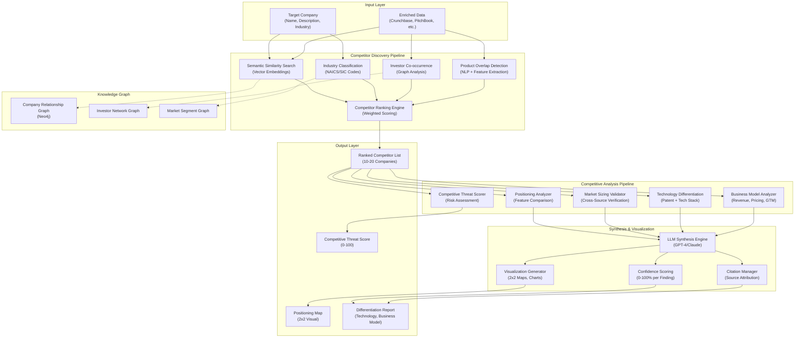

# Competitive Intelligence Engine: AI-Powered Analysis & Synthesis

**Document Metadata**<br/>
Sprint: 02 - VC Competitive Intelligence<br/>
Task: 03 - Solution Architecture Design<br/>
Author: solution-architect<br/>
Date: 2025-11-18<br/>
Status: Final

---

## Executive Summary

The Competitive Intelligence Engine is the core differentiator of the platform, transforming raw data from multiple sources into actionable competitive insights for VC investment decisions. This engine combines semantic analysis, knowledge graph reasoning, and LLM-powered synthesis to answer critical questions: "Who are the real competitors?", "How is this company differentiated?", and "What's the competitive moat?"

**Key Capabilities**:

- **Competitor Discovery**: Identify 10-20 competitors using semantic similarity, industry classification, and investor overlap
- **Positioning Analysis**: Generate 2x2 positioning maps comparing features, pricing, target markets, go-to-market strategies
- **Differentiation Assessment**: Analyze technology differentiation (patents, tech stack), business model innovation, market positioning
- **Market Sizing Validation**: Cross-reference TAM/SAM/SOM claims across multiple sources, flag inconsistencies
- **Competitive Threat Scoring**: Risk assessment for portfolio companies based on competitor funding, product launches, hiring

**Architecture Principles**:

- **Verification-First**: Fact-checking against source documents to prevent hallucination
- **Multi-Model Strategy**: Use specialized models for different tasks (GPT-4 for synthesis, smaller models for classification)
- **Human-in-the-Loop**: Confidence scores on all outputs, flag low-confidence findings for human review
- **Incremental Processing**: Break analysis into stages (discovery → enrichment → synthesis) for faster iteration

---

## Intelligence Engine Architecture



---

## Competitor Discovery Pipeline

### 1. Semantic Similarity Search

**Purpose**: Find companies with similar products, markets, or value propositions

**Implementation**:

**Vector Embeddings**:

- Use OpenAI `text-embedding-3-large` (3,072 dimensions) for high-quality embeddings
- Embed company descriptions, product features, target markets
- Store embeddings in Pinecone or Weaviate for fast similarity search

**Embedding Generation**:
```javascript
import OpenAI from 'openai';
const openai = new OpenAI({ apiKey: process.env.OPENAI_API_KEY });

async function generateEmbedding(text) {
  const response = await openai.embeddings.create({
    model: 'text-embedding-3-large',
    input: text,
    dimensions: 3072,
  });

  return response.data[0].embedding;
}

// Embed target company
const targetEmbedding = await generateEmbedding(
  `${targetCompany.name}: ${targetCompany.description}. Products: ${targetCompany.products.join(', ')}.`
);
```

**Similarity Search**:
```javascript
import { Pinecone } from '@pinecone-database/pinecone';
const pinecone = new Pinecone({ apiKey: process.env.PINECONE_API_KEY });

const index = pinecone.Index('companies');

const results = await index.query({
  vector: targetEmbedding,
  topK: 50, // Return top 50 similar companies
  includeMetadata: true,
});

const similarCompanies = results.matches.map(match => ({
  name: match.metadata.name,
  similarity: match.score, // 0-1 (cosine similarity)
}));
```

**Scoring**: Companies with similarity >0.75 are considered strong competitors

### 2. Industry Classification Filter

**Purpose**: Filter competitors by industry to avoid false positives (e.g., don't compare SaaS to hardware)

**NAICS/SIC Code Mapping**:

| NAICS Code | Industry | Example Companies |
|------------|----------|------------------|
| 5112 | Software Publishers | Stripe, Plaid, Square |
| 5182 | Data Processing, Hosting | AWS, Snowflake, Databricks |
| 5415 | Computer Systems Design | Palantir, Datadog, MongoDB |
| 5239 | Other Financial Investment | Robinhood, Coinbase, Acorns |

**Industry Extraction**:

- Crunchbase provides `category_groups` (e.g., ["Financial Services", "Payments"])
- PitchBook provides `industry` (e.g., "Fintech, Payments")
- Map to NAICS codes using lookup table or LLM classification

**LLM-Based Classification** (fallback):
```javascript
const prompt = `
Classify the following company into one of these industries:
- SaaS / Software
- Fintech / Financial Services
- E-commerce / Marketplace
- Healthcare / Biotech
- Hardware / IoT
- AI / Machine Learning

Company: ${targetCompany.name}
Description: ${targetCompany.description}

Industry:`;

const response = await openai.chat.completions.create({
  model: 'gpt-3.5-turbo',
  messages: [{ role: 'user', content: prompt }],
  temperature: 0,
});

const industry = response.choices[0].message.content.trim();
```

**Filter Logic**:

- Require at least 1 overlapping industry category between target and competitor
- Allow cross-industry if semantic similarity is very high (>0.85)

### 3. Investor Co-occurrence Analysis

**Purpose**: Companies with shared investors are likely competitors (VCs invest in thesis-driven portfolios)

**Graph Query** (Neo4j):
```cypher
// Find companies that share investors with target company
MATCH (target:Company {name: $targetName})-[:FUNDED_BY]->(investor:Investor)<-[:FUNDED_BY]-(competitor:Company)
WHERE target <> competitor
RETURN competitor.name, COUNT(investor) AS sharedInvestors
ORDER BY sharedInvestors DESC
LIMIT 20
```

**Scoring**:

- 1-2 shared investors: +5 points
- 3-5 shared investors: +15 points
- 6+ shared investors: +25 points

**Interpretation**:

High investor overlap suggests:
1. Competing for same market opportunity
2. Similar investment thesis (stage, geography, sector)
3. Potential M&A target (consolidation plays)

### 4. Product Overlap Detection

**Purpose**: Identify companies with overlapping product features or use cases

**Feature Extraction**:

Extract features from product pages, pitch decks, marketing materials:
```javascript
const prompt = `
Extract key product features from the following text:

${productPageContent}

Return as JSON array of features.
`;

const response = await openai.chat.completions.create({
  model: 'gpt-4-turbo',
  messages: [{ role: 'user', content: prompt }],
  response_format: { type: 'json_object' },
});

const features = JSON.parse(response.choices[0].message.content).features;
// Example: ["real-time fraud detection", "PCI compliance", "global payments", "subscription billing"]
```

**Feature Overlap Calculation**:
```javascript
function calculateFeatureOverlap(targetFeatures, competitorFeatures) {
  const targetSet = new Set(targetFeatures.map(f => f.toLowerCase()));
  const competitorSet = new Set(competitorFeatures.map(f => f.toLowerCase()));

  const intersection = new Set([...targetSet].filter(f => competitorSet.has(f)));
  const union = new Set([...targetSet, ...competitorSet]);

  return intersection.size / union.size; // Jaccard similarity
}
```

**Scoring**:

- 0-20% overlap: Not a competitor (+0 points)
- 20-40% overlap: Partial competitor (+10 points)
- 40-60% overlap: Direct competitor (+20 points)
- 60%+ overlap: Head-to-head competitor (+30 points)

### 5. Competitor Ranking Engine

**Purpose**: Combine multiple signals into single competitor relevance score

**Weighted Scoring**:

| Signal | Weight | Max Points |
|--------|--------|------------|
| Semantic Similarity | 30% | 30 |
| Industry Match | 20% | 20 |
| Investor Overlap | 25% | 25 |
| Product Overlap | 25% | 25 |
| **Total** | **100%** | **100** |

**Ranking Algorithm**:
```javascript
function rankCompetitors(target, candidates) {
  const scored = candidates.map(candidate => {
    const semanticScore = candidate.similarity * 30; // 0-30 points
    const industryScore = calculateIndustryScore(target, candidate) * 20; // 0-20
    const investorScore = calculateInvestorScore(target, candidate) * 25; // 0-25
    const productScore = calculateProductScore(target, candidate) * 25; // 0-25

    const totalScore = semanticScore + industryScore + investorScore + productScore;

    return {
      ...candidate,
      competitorScore: totalScore,
    };
  });

  return scored
    .filter(c => c.competitorScore > 30) // Threshold: only >30% match
    .sort((a, b) => b.competitorScore - a.competitorScore)
    .slice(0, 20); // Top 20 competitors
}
```

**Output**:

Ranked list of 10-20 competitors with scores:
```json
[
  {
    "name": "Square",
    "competitorScore": 87.5,
    "signals": {
      "semantic": 28.5,
      "industry": 20,
      "investors": 20,
      "product": 19
    }
  },
  {
    "name": "Adyen",
    "competitorScore": 82.3,
    "signals": {
      "semantic": 26.1,
      "industry": 20,
      "investors": 15,
      "product": 21.2
    }
  }
]
```

---

## Competitive Analysis Pipeline

### 1. Positioning Analyzer

**Purpose**: Generate 2x2 positioning maps showing how competitors differentiate

**Positioning Dimensions**:

Common axes for competitive positioning:
- **Price**: Low-cost vs. Premium
- **Market**: SMB vs. Enterprise
- **Technology**: Simple/Established vs. Cutting-Edge
- **Geography**: Domestic vs. Global

**Dimension Selection** (LLM-Powered):
```javascript
const prompt = `
Based on the following competitors in the ${industry} industry, suggest the 2 most important dimensions for a positioning map:

Competitors: ${competitors.map(c => c.name).join(', ')}

Return as JSON:
{
  "xAxis": { "name": "dimension name", "low": "low label", "high": "high label" },
  "yAxis": { "name": "dimension name", "low": "low label", "high": "high label" }
}
`;

const response = await openai.chat.completions.create({
  model: 'gpt-4-turbo',
  messages: [{ role: 'user', content: prompt }],
  response_format: { type: 'json_object' },
});

const dimensions = JSON.parse(response.choices[0].message.content);
// Example: { xAxis: { name: "Pricing", low: "Low-cost", high: "Premium" }, yAxis: { name: "Target Market", low: "SMB", high: "Enterprise" } }
```

**Competitor Positioning** (LLM-Powered):
```javascript
const positioningPrompt = `
For each competitor, rate them on a scale of 0-10 for the following dimensions:
- ${dimensions.xAxis.name}: 0 = ${dimensions.xAxis.low}, 10 = ${dimensions.xAxis.high}
- ${dimensions.yAxis.name}: 0 = ${dimensions.yAxis.low}, 10 = ${dimensions.yAxis.high}

Competitors:
${competitors.map(c => `- ${c.name}: ${c.description}`).join('\n')}

Return as JSON array:
[
  { "name": "Company A", "x": 7, "y": 8 },
  { "name": "Company B", "x": 3, "y": 4 }
]
`;

const positioningResponse = await openai.chat.completions.create({
  model: 'gpt-4-turbo',
  messages: [{ role: 'user', content: positioningPrompt }],
  response_format: { type: 'json_object' },
});

const positions = JSON.parse(positioningResponse.choices[0].message.content);
```

**Visualization** (Chart.js or D3.js):

Generate scatter plot with company names as labels:
```javascript
const chartData = {
  datasets: [{
    label: 'Competitors',
    data: positions.map(p => ({ x: p.x, y: p.y, label: p.name })),
    backgroundColor: 'rgba(75, 192, 192, 0.6)',
  }],
};

const chartOptions = {
  scales: {
    x: { title: { text: dimensions.xAxis.name } },
    y: { title: { text: dimensions.yAxis.name } },
  },
};
```

### 2. Market Sizing Validator

**Purpose**: Cross-reference TAM/SAM/SOM claims to detect inflated or unsupported numbers

**Validation Process**:

1. **Extract Market Size Claims** from pitch deck or company website
2. **Cross-Reference** with Crunchbase, PitchBook, Gartner, Forrester reports
3. **Calculate Discrepancy** between claimed and validated numbers
4. **Flag Outliers** (>50% discrepancy) for human review

**Market Size Extraction** (LLM-Powered):
```javascript
const prompt = `
Extract market size claims (TAM, SAM, SOM) from the following text:

${pitchDeckText}

Return as JSON:
{
  "TAM": { "value": 100000000000, "currency": "USD", "year": 2025, "source": "quoted source" },
  "SAM": { "value": 10000000000, "currency": "USD", "year": 2025, "source": "quoted source" },
  "SOM": { "value": 500000000, "currency": "USD", "year": 2025, "source": "quoted source" }
}

Return null for missing data.
`;

const response = await openai.chat.completions.create({
  model: 'gpt-4-turbo',
  messages: [{ role: 'user', content: prompt }],
  response_format: { type: 'json_object' },
});

const claimedMarketSize = JSON.parse(response.choices[0].message.content);
```

**Cross-Reference with Industry Reports**:

Query Crunchbase or search for Gartner/Forrester reports:
```javascript
async function validateMarketSize(industry, claimedTAM) {
  // Search Crunchbase for industry market size data
  const crunchbaseData = await fetchCrunchbaseIndustryData(industry);

  // Search web for "[industry] market size 2025"
  const webSearchResults = await searchWeb(`${industry} market size 2025`);

  // Extract market size from search results (using LLM)
  const validatedTAM = await extractMarketSizeFromSearchResults(webSearchResults);

  const discrepancy = Math.abs(claimedTAM - validatedTAM) / validatedTAM;

  return {
    claimed: claimedTAM,
    validated: validatedTAM,
    discrepancy: discrepancy * 100, // Percentage
    sources: webSearchResults.map(r => r.url),
  };
}
```

**Output**:
```json
{
  "TAM": {
    "claimed": 100000000000,
    "validated": 80000000000,
    "discrepancy": 25,
    "confidence": "medium",
    "sources": ["Gartner 2024 Report", "Crunchbase Industry Data"]
  },
  "flags": [
    "TAM claim is 25% higher than validated data. Review source credibility."
  ]
}
```

### 3. Technology Differentiation Analyzer

**Purpose**: Assess technology moat via patent analysis, tech stack detection, R&D investment

**Patent Analysis**:

**Patent Count & Velocity**:
```javascript
async function analyzePatents(companyName) {
  const patents = await fetchUSPTOPatents(companyName);

  const patentsByYear = patents.reduce((acc, patent) => {
    const year = new Date(patent.filingDate).getFullYear();
    acc[year] = (acc[year] || 0) + 1;
    return acc;
  }, {});

  const recentPatents = patents.filter(p => {
    const filingDate = new Date(p.filingDate);
    const oneYearAgo = new Date();
    oneYearAgo.setFullYear(oneYearAgo.getFullYear() - 1);
    return filingDate > oneYearAgo;
  });

  return {
    totalPatents: patents.length,
    recentPatents: recentPatents.length,
    patentVelocity: recentPatents.length / 1, // Patents per year
    patentsByYear,
  };
}
```

**Technology Focus Clustering**:

Extract technology categories from patent classifications (IPC/CPC codes):
```javascript
function clusterPatentTechnologies(patents) {
  const technologies = {};

  patents.forEach(patent => {
    patent.classifications.forEach(classification => {
      const tech = mapIPCToTechnology(classification); // e.g., "Machine Learning", "Security", "Payments"
      technologies[tech] = (technologies[tech] || 0) + 1;
    });
  });

  return Object.entries(technologies)
    .sort((a, b) => b[1] - a[1])
    .slice(0, 5) // Top 5 technology areas
    .map(([tech, count]) => ({ technology: tech, patentCount: count }));
}

function mapIPCToTechnology(ipcCode) {
  const mapping = {
    'G06N': 'Machine Learning / AI',
    'H04L29/06': 'Security / Cryptography',
    'G06Q20': 'Payment Systems',
    'G06F21': 'Security Arrangements',
  };

  return mapping[ipcCode] || 'Other';
}
```

**Tech Stack Detection** (from job postings):

Extract technologies mentioned in engineering job postings:
```javascript
async function detectTechStack(companyName) {
  const jobPostings = await fetchJobPostings(companyName);

  const technologies = new Set();

  jobPostings.forEach(job => {
    const extractedTechs = extractTechnologies(job.description);
    extractedTechs.forEach(tech => technologies.add(tech));
  });

  return Array.from(technologies);
}

function extractTechnologies(text) {
  const knownTechnologies = [
    'Python', 'Go', 'Java', 'JavaScript', 'TypeScript', 'React', 'Node.js',
    'Kubernetes', 'Docker', 'AWS', 'GCP', 'Azure', 'PostgreSQL', 'MongoDB',
    'TensorFlow', 'PyTorch', 'Kafka', 'Redis', 'Elasticsearch',
  ];

  return knownTechnologies.filter(tech => {
    const regex = new RegExp(`\\b${tech}\\b`, 'i');
    return regex.test(text);
  });
}
```

**Technology Differentiation Score**:

| Factor | Weight | Calculation |
|--------|--------|-------------|
| Patent Count | 30% | Normalize to 0-10 scale (0 patents = 0, 100+ patents = 10) |
| Patent Velocity | 30% | Normalize to 0-10 scale (0 patents/year = 0, 20+ patents/year = 10) |
| Tech Stack Modernity | 20% | % of modern technologies (Kubernetes, React, etc.) vs. legacy |
| R&D Investment | 20% | % of revenue spent on R&D (if available from PitchBook) |

**Output**:
```json
{
  "technologyDifferentiation": {
    "score": 78,
    "breakdown": {
      "patents": 85,
      "patentVelocity": 90,
      "techStack": 70,
      "rdInvestment": 65
    },
    "insights": [
      "High patent velocity (18 patents/year) indicates strong R&D investment",
      "Tech stack includes modern cloud-native technologies (Kubernetes, React, Go)",
      "Technology focus: Machine Learning (42%), Security (28%), Payments (20%)"
    ]
  }
}
```

### 4. Business Model Analyzer

**Purpose**: Compare business models (revenue streams, pricing, go-to-market strategies)

**Revenue Model Extraction** (LLM-Powered):
```javascript
const prompt = `
Analyze the business model for ${companyName}:

Company Description: ${companyDescription}
Website Content: ${websiteContent}

Extract:
1. Revenue model (SaaS subscription, transaction fees, marketplace, etc.)
2. Pricing tiers (if available)
3. Target customer segment (SMB, mid-market, enterprise)
4. Go-to-market strategy (direct sales, product-led growth, channel partners)

Return as JSON.
`;

const response = await openai.chat.completions.create({
  model: 'gpt-4-turbo',
  messages: [{ role: 'user', content: prompt }],
  response_format: { type: 'json_object' },
});

const businessModel = JSON.parse(response.choices[0].message.content);
```

**Competitive Comparison**:

Generate table comparing business models:

| Company | Revenue Model | Pricing | Target Market | GTM Strategy |
|---------|--------------|---------|--------------|--------------|
| Stripe | Transaction fees (2.9% + $0.30) | Transparent, pay-as-you-go | SMB → Enterprise | Product-led growth |
| Square | Transaction fees (2.6% + $0.10) | Transparent, hardware bundled | SMB, retail | Direct sales + hardware |
| Adyen | Transaction fees (negotiated) | Custom pricing | Enterprise | Direct sales, enterprise focus |

**Differentiation Insights**:
```javascript
const insights = [
  "Stripe's transparent pricing enables product-led growth vs. enterprise sales model",
  "Square's hardware bundling creates switching costs for retail customers",
  "Adyen's enterprise focus allows for higher pricing power but slower customer acquisition",
];
```

### 5. Competitive Threat Scorer

**Purpose**: Risk assessment for portfolio companies based on competitor activity

**Threat Signals**:

| Signal | Threat Level | Weight |
|--------|--------------|--------|
| Competitor raises $100M+ round | High | 30% |
| Competitor launches competing product | High | 25% |
| Competitor hires 50+ engineers in 3 months | Medium | 20% |
| Competitor lowers prices by >20% | Medium | 15% |
| Competitor files 10+ patents in category | Low | 10% |

**Threat Scoring Algorithm**:
```javascript
function calculateCompetitiveThreat(portfolioCompany, competitors) {
  let threatScore = 0;

  competitors.forEach(competitor => {
    const recentFunding = competitor.fundingRounds.filter(r => {
      const sixMonthsAgo = new Date();
      sixMonthsAgo.setMonth(sixMonthsAgo.getMonth() - 6);
      return new Date(r.date) > sixMonthsAgo;
    });

    if (recentFunding.some(r => r.amount > 100_000_000)) {
      threatScore += 30;
    }

    if (competitor.recentProductLaunches.some(p => p.overlapsWith(portfolioCompany.product))) {
      threatScore += 25;
    }

    if (competitor.engineeringHiresLast3Months > 50) {
      threatScore += 20;
    }

    // ... other signals
  });

  return Math.min(threatScore, 100); // Cap at 100
}
```

**Output**:
```json
{
  "competitiveThreatScore": 75,
  "riskLevel": "High",
  "topThreats": [
    {
      "competitor": "Square",
      "threat": "Raised $150M Series G, targeting enterprise segment",
      "impactScore": 30
    },
    {
      "competitor": "Adyen",
      "threat": "Launched competing subscription billing product",
      "impactScore": 25
    }
  ],
  "recommendations": [
    "Accelerate enterprise product development to compete with Square",
    "Consider partnership or M&A to consolidate market position"
  ]
}
```

---

## LLM Synthesis Engine

### Multi-Model Strategy

**Model Selection by Task**:

| Task | Model | Rationale |
|------|-------|-----------|
| **Competitor Discovery** | text-embedding-3-large | High-quality embeddings for semantic search |
| **Classification** (industry, stage) | GPT-3.5 Turbo | Cheap, fast, good for simple tasks |
| **Data Extraction** (features, pricing) | GPT-4 Turbo | Better accuracy for structured extraction |
| **Synthesis & Reasoning** | GPT-4 Turbo or Claude 3 Opus | Best reasoning capabilities |
| **Report Writing** | GPT-4 Turbo | Human-like writing quality |

**Cost Optimization**:

- Use GPT-3.5 Turbo ($0.50/1M tokens) for classification: 70% of tasks
- Use GPT-4 Turbo ($10/1M tokens) for synthesis: 30% of tasks
- Estimated cost per brief: $0.50 (data extraction) + $1.50 (synthesis) = $2.00

### Prompt Engineering

**Structured Output Prompts**:

Use JSON mode for reliable parsing:
```javascript
const prompt = `
Analyze the competitive landscape for ${targetCompany.name} in the ${industry} industry.

Competitors:
${competitors.map(c => `- ${c.name}: ${c.description}`).join('\n')}

Return as JSON:
{
  "executiveSummary": "2-3 sentence summary",
  "competitiveDynamics": "Description of competitive dynamics",
  "keyDifferentiators": ["differentiator 1", "differentiator 2"],
  "competitiveThreats": ["threat 1", "threat 2"]
}
`;

const response = await openai.chat.completions.create({
  model: 'gpt-4-turbo',
  messages: [{ role: 'user', content: prompt }],
  response_format: { type: 'json_object' },
  temperature: 0.3, // Lower temperature for consistency
});

const analysis = JSON.parse(response.choices[0].message.content);
```

**Citation-Augmented Prompts**:

Include source citations in prompts to reduce hallucination:
```javascript
const prompt = `
Based on the following data sources, analyze the competitive positioning of ${targetCompany.name}:

Crunchbase Data:
${JSON.stringify(crunchbaseData, null, 2)}

PitchBook Data:
${JSON.stringify(pitchbookData, null, 2)}

News Articles:
${newsArticles.map(a => `- ${a.title} (${a.source}, ${a.date}): ${a.summary}`).join('\n')}

IMPORTANT: Only make claims that are directly supported by the data above. Cite specific sources for each claim.

Return as JSON with citations:
{
  "claim": "Stripe has raised $2.2B in total funding",
  "source": "Crunchbase",
  "confidence": 0.95
}
`;
```

### Verification & Fact-Checking

**Hallucination Detection**:

Cross-check LLM outputs against source documents:
```javascript
async function verifyClaimAgainstSources(claim, sources) {
  const verificationPrompt = `
Claim: "${claim}"

Sources:
${sources.map(s => `- ${s.text}`).join('\n')}

Is this claim supported by the sources above?
Return JSON: { "supported": true/false, "confidence": 0-1, "supportingSource": "quote from source" }
`;

  const response = await openai.chat.completions.create({
    model: 'gpt-4-turbo',
    messages: [{ role: 'user', content: verificationPrompt }],
    response_format: { type: 'json_object' },
  });

  return JSON.parse(response.choices[0].message.content);
}
```

**Confidence Scoring**:

Assign confidence scores to all findings:
- **High Confidence (90-100%)**: Claim is directly stated in multiple sources
- **Medium Confidence (70-89%)**: Claim is implied by sources or stated in one source
- **Low Confidence (50-69%)**: Claim is inferred or based on indirect evidence
- **Very Low Confidence (<50%)**: Claim is speculative or unsupported

**Human Review Triggers**:

Flag for human review if:
- Any finding has confidence <70%
- Market size discrepancy >50%
- Critical data source (Crunchbase, PitchBook) unavailable
- User explicitly requests "high-confidence only" mode

---

## Visualization Generation

### 2x2 Positioning Maps

**Chart.js Implementation**:
```javascript
import Chart from 'chart.js/auto';

function generatePositioningMap(positions, dimensions) {
  const ctx = document.getElementById('positioningMap').getContext('2d');

  new Chart(ctx, {
    type: 'scatter',
    data: {
      datasets: [{
        label: 'Competitors',
        data: positions.map(p => ({
          x: p.x,
          y: p.y,
          label: p.name,
        })),
        backgroundColor: positions.map(p =>
          p.name === targetCompany ? 'rgba(255, 99, 132, 0.6)' : 'rgba(75, 192, 192, 0.6)'
        ),
        pointRadius: 8,
      }],
    },
    options: {
      scales: {
        x: {
          title: { display: true, text: dimensions.xAxis.name },
          min: 0,
          max: 10,
        },
        y: {
          title: { display: true, text: dimensions.yAxis.name },
          min: 0,
          max: 10,
        },
      },
      plugins: {
        tooltip: {
          callbacks: {
            label: (context) => context.raw.label,
          },
        },
      },
    },
  });
}
```

### Competitive Matrices

**Feature Comparison Table**:

| Feature | Stripe | Square | Adyen | PayPal |
|---------|--------|--------|-------|--------|
| Online Payments | ✅ | ✅ | ✅ | ✅ |
| In-Person Payments | ❌ | ✅ | ✅ | ✅ |
| Subscription Billing | ✅ | ✅ | ✅ | ❌ |
| Fraud Detection (ML) | ✅ | ❌ | ✅ | ✅ |
| Global Currency Support | ✅ (135+) | ❌ | ✅ (150+) | ✅ (100+) |

**Automated Generation**:
```javascript
async function generateFeatureMatrix(competitors) {
  const features = [
    'Online Payments',
    'In-Person Payments',
    'Subscription Billing',
    'Fraud Detection (ML)',
    'Global Currency Support',
  ];

  const matrix = {};

  for (const competitor of competitors) {
    matrix[competitor.name] = {};

    for (const feature of features) {
      const hasFeature = await checkFeatureSupport(competitor, feature);
      matrix[competitor.name][feature] = hasFeature;
    }
  }

  return matrix;
}

async function checkFeatureSupport(company, feature) {
  const prompt = `
Based on the following company data, does ${company.name} support the feature "${feature}"?

Company Data:
${JSON.stringify(company.productFeatures)}

Return JSON: { "supported": true/false, "confidence": 0-1 }
`;

  const response = await openai.chat.completions.create({
    model: 'gpt-4-turbo',
    messages: [{ role: 'user', content: prompt }],
    response_format: { type: 'json_object' },
  });

  const result = JSON.parse(response.choices[0].message.content);
  return result.supported;
}
```

---

## Knowledge Graph Integration

### Company Relationship Graph (Neo4j)

**Graph Schema**:
```cypher
// Nodes
(c:Company {name, description, industry, foundedDate})
(i:Investor {name, type}) // VC, PE, Angel
(p:Person {name, role}) // Founders, executives
(m:Market {name, size}) // Market segments

// Relationships
(c)-[:FUNDED_BY {amount, date, round}]->(i)
(c)-[:FOUNDED_BY]->(p)
(c)-[:COMPETES_IN]->(m)
(c)-[:COMPETES_WITH {score}]->(c)
(p)-[:WORKS_AT {title, startDate}]->(c)
```

**Graph Queries**:

**Find Competitor Network**:
```cypher
// 1st-degree competitors (direct)
MATCH (target:Company {name: $targetName})-[:COMPETES_WITH]->(competitor:Company)
RETURN competitor

// 2nd-degree competitors (competitors of competitors)
MATCH (target:Company {name: $targetName})-[:COMPETES_WITH]->()-[:COMPETES_WITH]->(indirect:Company)
WHERE target <> indirect
RETURN indirect, COUNT(*) AS connectionCount
ORDER BY connectionCount DESC
```

**Find Investor Overlap**:
```cypher
MATCH (target:Company {name: $targetName})-[:FUNDED_BY]->(investor:Investor)<-[:FUNDED_BY]-(competitor:Company)
WHERE target <> competitor
RETURN competitor.name, COLLECT(investor.name) AS sharedInvestors
ORDER BY SIZE(sharedInvestors) DESC
```

**Market Segment Analysis**:
```cypher
MATCH (target:Company {name: $targetName})-[:COMPETES_IN]->(market:Market)<-[:COMPETES_IN]-(competitor:Company)
WHERE target <> competitor
RETURN market.name, COLLECT(competitor.name) AS competitors
```

**Graph Visualization**:

Export graph data for visualization in frontend (D3.js, vis.js):
```javascript
const graphData = await neo4j.run(`
  MATCH (target:Company {name: $targetName})-[r:COMPETES_WITH]->(competitor:Company)
  RETURN target, r, competitor
  LIMIT 20
`, { targetName: 'Stripe' });

const nodes = [];
const edges = [];

graphData.records.forEach(record => {
  nodes.push({ id: record.get('target').properties.name, label: record.get('target').properties.name });
  nodes.push({ id: record.get('competitor').properties.name, label: record.get('competitor').properties.name });

  edges.push({
    from: record.get('target').properties.name,
    to: record.get('competitor').properties.name,
    label: `Score: ${record.get('r').properties.score}`,
  });
});

// Render with vis.js or D3.js
```

---

## Performance Optimization

### Caching Strategy

**Multi-Tier Caching**:

1. **LLM Response Cache** (Redis): Cache identical prompts for 7 days
2. **Competitor List Cache**: Cache competitor discovery results for 30 days
3. **Analysis Cache**: Cache positioning analysis for 7 days (refresh when new data available)

**Cache Keys**:
```javascript
const cacheKey = {
  competitors: `competitors:${targetCompany.name}:${industryHash}`,
  positioning: `positioning:${competitorListHash}:${dimensionsHash}`,
  llmResponse: `llm:${modelName}:${promptHash}`,
};
```

**Cache Hit Rate Target**: >70% for LLM responses (saves $1.40 per brief)

### Parallel Processing

**Concurrent Data Fetching**:
```javascript
async function analyzeCompetitors(targetCompany, competitors) {
  // Analyze all competitors in parallel
  const analyses = await Promise.all(
    competitors.map(competitor => analyzeCompetitor(competitor))
  );

  return analyses;
}
```

**Batch LLM Requests**:

Combine multiple prompts into single API call:
```javascript
const batchPrompt = `
For each of the following companies, extract product features:

${competitors.map((c, i) => `${i + 1}. ${c.name}: ${c.description}`).join('\n')}

Return as JSON array: [{ "company": "name", "features": ["feature1", "feature2"] }]
`;

// Single API call instead of N calls
const response = await openai.chat.completions.create({
  model: 'gpt-4-turbo',
  messages: [{ role: 'user', content: batchPrompt }],
  response_format: { type: 'json_object' },
});
```

**Performance Target**: Analyze 20 competitors in <30 seconds

---

## References

[1] "Vector Embeddings for Semantic Search," OpenAI, platform.openai.com/docs/guides/embeddings, 2024.

[2] "Pinecone: Vector Database Documentation," Pinecone, docs.pinecone.io, 2024.

[3] "Neo4j Graph Database: Cypher Query Language," Neo4j, neo4j.com/docs/cypher-manual, 2024.

[4] "GPT-4 Turbo: Prompt Engineering Best Practices," OpenAI, 2024.

[5] "Competitive Intelligence Analysis Frameworks," Harvard Business Review, 2023.

[6] "Patent Analysis for Technology Assessment," USPTO, 2024.

[7] "Market Sizing Methodologies," CB Insights, 2024.

[8] "Jaccard Similarity for Feature Comparison," Stanford CS, 2023.

[9] "LLM Fact-Checking and Hallucination Detection," Anthropic Research, 2024.

[10] "Graph Algorithms for Competitive Analysis," Neo4j Graph Data Science, 2024.

---

**Document Status**: Final<br/>
**Next Review Date**: 2025-12-18<br/>
**Owner**: solution-architect<br/>
**Approvers**: technical-researcher, sprint-orchestrator
