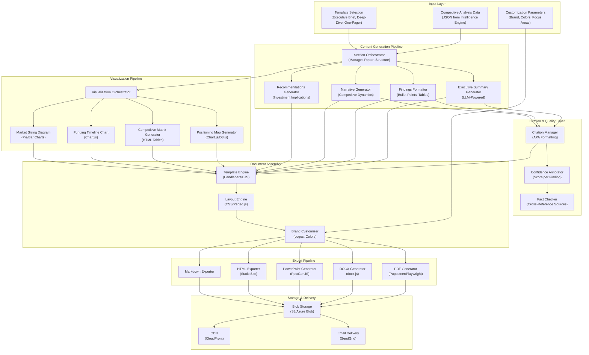

# Report Generation System: Executive-Ready Competitive Intelligence Briefs

**Document Metadata**<br/>
Sprint: 02 - VC Competitive Intelligence<br/>
Task: 03 - Solution Architecture Design<br/>
Author: solution-architect<br/>
Date: 2025-11-18<br/>
Status: Final

---

## Executive Summary

The Report Generation System transforms competitive intelligence data into polished, executive-ready briefs that VC partners can immediately use in investment committee meetings. This system handles template management, content synthesis, visualization generation, citation tracking, and multi-format export (PDF, DOCX, PowerPoint, Markdown).

**Key Capabilities**:

- **Template Library**: Pre-built templates for executive briefs (5-10 pages), deep-dive analyses (15-20 pages), one-pagers
- **Dynamic Content Generation**: LLM-powered executive summaries, positioning narratives, investment thesis implications
- **Visualization Engine**: Auto-generate positioning maps, competitive matrices, funding timeline charts, market sizing diagrams
- **Citation Management**: Track and format citations for all claims (APA style), confidence scoring per finding
- **Multi-Format Export**: PDF (print-ready), DOCX (editable), PowerPoint (presentation-ready), Markdown (web-friendly), HTML (interactive)

**Design Principles**:

- **Dual-Audience Optimization**: Serve both business executives (clear ROI, strategic implications) and technical decision-makers (detailed analysis)
- **Professional Formatting**: Typography, spacing, color schemes aligned with VC industry standards
- **Brand Customization**: White-label support for VC firms to add logos, color schemes, custom headers/footers
- **Accessibility**: WCAG 2.1 AA compliance for all HTML exports, alt text for visualizations

---

## Report Generation Architecture



---

## Report Templates

### 1. Executive Brief Template (5-10 Pages)

**Target Audience**: VC Partners, Investment Committee members<br/>
**Use Case**: Quick competitive overview for investment screening<br/>
**Time to Read**: 10-15 minutes

**Template Structure**:

1. **Cover Page** (1 page)
   - Target company name and logo
   - Report title: "Competitive Intelligence Brief"
   - Date generated
   - Prepared by: [VC Firm Name]
   - Confidentiality notice

2. **Executive Summary** (1-2 pages)
   - 3-5 bullet points: Key findings
   - Competitive landscape overview (1 paragraph)
   - Investment thesis implications (1 paragraph)
   - Go/No-Go recommendation (if applicable)

3. **Competitive Landscape** (2-3 pages)
   - Positioning map (2x2 visual)
   - List of 10-20 competitors with brief descriptions
   - Competitive dynamics narrative (2-3 paragraphs)

4. **Market Sizing Validation** (1 page)
   - TAM/SAM/SOM claimed vs. validated
   - Cross-source comparison table
   - Discrepancy flags (if any)

5. **Differentiation Analysis** (2-3 pages)
   - Technology differentiation (patents, tech stack)
   - Business model comparison
   - Competitive advantages/disadvantages

6. **Investment Implications** (1 page)
   - Key risks and opportunities
   - Competitive threat score
   - Recommended next steps

7. **Appendices** (1-2 pages)
   - Data sources and citations
   - Methodology notes
   - Confidence scores

**Template Code** (Handlebars):
```handlebars
<!DOCTYPE html>
<html>
<head>
  <title>Competitive Intelligence Brief: {{targetCompany.name}}</title>
  <style>
    @page {
      size: Letter;
      margin: 1in;
    }
    body {
      font-family: 'Helvetica Neue', Arial, sans-serif;
      color: #333;
      line-height: 1.6;
    }
    h1 { font-size: 28pt; color: #2c3e50; }
    h2 { font-size: 20pt; color: #34495e; margin-top: 24pt; }
    .executive-summary {
      background: #ecf0f1;
      padding: 16pt;
      border-left: 4pt solid #3498db;
    }
    .finding {
      margin: 8pt 0;
      padding-left: 16pt;
      border-left: 2pt solid #95a5a6;
    }
  </style>
</head>
<body>
  <!-- Cover Page -->
  <div class="cover-page">
    <h1>Competitive Intelligence Brief</h1>
    <h2>{{targetCompany.name}}</h2>
    <p>Prepared by: {{vcFirm.name}}</p>
    <p>Date: {{formatDate generatedDate}}</p>
    <p><em>Confidential - For Internal Use Only</em></p>
  </div>

  <!-- Executive Summary -->
  <div class="executive-summary">
    <h2>Executive Summary</h2>
    <p>{{executiveSummary}}</p>
    <h3>Key Findings</h3>
    <ul>
      {{#each keyFindings}}
      <li>{{this}}</li>
      {{/each}}
    </ul>
  </div>

  <!-- Competitive Landscape -->
  <h2>Competitive Landscape</h2>
  <div class="positioning-map">
    
  </div>

  <h3>Identified Competitors</h3>
  {{#each competitors}}
  <div class="competitor">
    <h4>{{name}} (Score: {{competitorScore}})</h4>
    <p>{{description}}</p>
  </div>
  {{/each}}

  <!-- ... additional sections ... -->

  <!-- Citations -->
  <h2>References</h2>
  <ol>
    {{#each citations}}
    <li>{{this}}</li>
    {{/each}}
  </ol>
</body>
</html>
```

### 2. Deep-Dive Analysis Template (15-20 Pages)

**Target Audience**: Investment team members conducting full due diligence<br/>
**Use Case**: Comprehensive competitive analysis for serious investment consideration<br/>
**Time to Read**: 30-45 minutes

**Template Structure**:

1. **Cover Page** (1 page)
2. **Executive Summary** (2 pages)
3. **Company Overview** (1 page)
   - Company background, founding story
   - Leadership team
   - Funding history
4. **Competitive Landscape** (4-5 pages)
   - Detailed positioning analysis
   - Competitor profiles (1 paragraph each)
   - Market share estimates
   - Competitive dynamics narrative
5. **Technology Analysis** (3-4 pages)
   - Patent portfolio analysis
   - Technology stack comparison
   - R&D investment trends
   - Innovation velocity
6. **Business Model Analysis** (2-3 pages)
   - Revenue model comparison
   - Pricing strategies
   - Go-to-market approaches
   - Unit economics (if available)
7. **Market Sizing & Validation** (2 pages)
   - TAM/SAM/SOM analysis
   - Market growth trends
   - Addressable market validation
8. **Strategic Assessment** (2-3 pages)
   - SWOT analysis
   - Competitive advantages/disadvantages
   - Barrier to entry analysis
   - Competitive moat assessment
9. **Investment Implications** (2 pages)
   - Risk assessment
   - Competitive threat scoring
   - Investment thesis validation
   - Recommended next steps
10. **Appendices** (2-3 pages)
    - Detailed data tables
    - Full citation list
    - Methodology notes

### 3. One-Pager Template

**Target Audience**: Quick reference for partners<br/>
**Use Case**: Email summary, quick decision-making<br/>
**Time to Read**: 2-3 minutes

**Template Structure**:

- **Header**: Company name, industry, funding stage
- **Quick Stats**: Funding total, employee count, competitors identified
- **Top 5 Competitors**: Names and competitive scores
- **Key Findings**: 3-5 bullet points
- **Competitive Threat Score**: Visual gauge (0-100)
- **Recommendation**: Go/No-Go with 1 sentence justification

---

## Content Generation Pipeline

### 1. Executive Summary Generator

**Purpose**: Generate concise, actionable 2-3 paragraph summary for busy VC partners

**LLM Prompt**:
```javascript
const prompt = `
You are a venture capital analyst preparing a competitive intelligence brief for investment committee review.

Target Company: ${targetCompany.name}
Industry: ${targetCompany.industry}

Competitive Analysis Data:
${JSON.stringify(analysisData, null, 2)}

Write a 2-3 paragraph executive summary that:
1. Summarizes the competitive landscape (who are the main competitors, how crowded is the market)
2. Highlights the target company's key differentiators (technology, business model, market position)
3. States the investment thesis implications (is this a defensible position, what are the competitive risks)

Tone: Professional, analytical, concise. Avoid hyperbole.
Length: 150-250 words.

Return as JSON:
{
  "executiveSummary": "full text here",
  "keyFindings": ["finding 1", "finding 2", "finding 3"]
}
`;

const response = await openai.chat.completions.create({
  model: 'gpt-4-turbo',
  messages: [{ role: 'user', content: prompt }],
  response_format: { type: 'json_object' },
  temperature: 0.3, // Lower temperature for consistency
});

const { executiveSummary, keyFindings } = JSON.parse(response.choices[0].message.content);
```

**Example Output**:
> "The competitive landscape for Stripe is highly contested, with 15+ direct competitors identified including Square, Adyen, PayPal, and Braintree. The payment processing market is characterized by fierce competition on pricing (2.9% + $0.30 vs. 2.6% + $0.10), rapid feature parity, and intense customer acquisition battles. Despite this crowded market, Stripe maintains differentiation through superior developer experience (API-first design, extensive documentation), global expansion (135+ countries vs. competitors' 50-100), and advanced fraud detection powered by machine learning.
>
> Stripe's competitive moat is primarily technology-driven: 42 patents in payment security and fraud detection, modern tech stack (Go, Kubernetes, React), and 18% R&D spend vs. industry average of 12%. Business model innovation (transparent pricing, no setup fees) enabled product-led growth to 2M+ customers, contrasting with Square's hardware-bundled approach and Adyen's enterprise-only focus.
>
> Investment thesis implication: Stripe's technology and developer-first positioning create a defensible moat in the commoditizing payments market. However, competitive threats are rising: Square's $150M Series G signals aggressive enterprise expansion, and Adyen's subscription billing launch directly targets Stripe's high-margin segment. Recommended next step: Deep-dive on customer retention rates and pricing power to validate moat durability."

### 2. Findings Formatter

**Purpose**: Transform raw analysis data into clear, scannable bullet points

**Formatting Rules**:

- **Concise**: Maximum 1-2 sentences per bullet point
- **Quantified**: Include specific numbers where possible (e.g., "15 competitors identified" not "many competitors")
- **Actionable**: Frame findings in terms of implications (e.g., "High competitive intensity suggests pricing pressure" not just "Many competitors exist")
- **Prioritized**: Most important findings first

**Formatter Function**:
```javascript
function formatFindings(analysisData) {
  const findings = [];

  // Competitor count finding
  findings.push(`Identified ${analysisData.competitors.length} direct competitors with competitive scores >30/100.`);

  // Market concentration finding
  const topCompetitors = analysisData.competitors.slice(0, 5);
  findings.push(`Top 5 competitors (${topCompetitors.map(c => c.name).join(', ')}) control an estimated ${analysisData.marketConcentration}% of the market.`);

  // Technology differentiation finding
  if (analysisData.techDifferentiation.score > 70) {
    findings.push(`Strong technology differentiation (score: ${analysisData.techDifferentiation.score}/100) driven by ${analysisData.patents.length} patents and modern tech stack.`);
  } else {
    findings.push(`Limited technology differentiation (score: ${analysisData.techDifferentiation.score}/100) suggests reliance on business model or market positioning for competitive advantage.`);
  }

  // Competitive threat finding
  if (analysisData.competitiveThreatScore > 70) {
    findings.push(`⚠️ High competitive threat (score: ${analysisData.competitiveThreatScore}/100) due to recent competitor funding rounds and product launches.`);
  }

  // Market sizing validation finding
  if (analysisData.marketSizing.discrepancy > 20) {
    findings.push(`⚠️ Market sizing claim (TAM: $${analysisData.marketSizing.claimed / 1e9}B) is ${analysisData.marketSizing.discrepancy}% higher than validated data ($${analysisData.marketSizing.validated / 1e9}B). Review source credibility.`);
  }

  return findings;
}
```

### 3. Narrative Generator

**Purpose**: Create flowing narrative text for competitive dynamics section

**LLM Prompt**:
```javascript
const prompt = `
You are a venture capital analyst writing a competitive analysis report.

Based on the following competitive data, write a 2-3 paragraph narrative describing the competitive dynamics in the ${industry} market:

Competitors:
${competitors.map(c => `- ${c.name}: ${c.description} (Competitive Score: ${c.competitorScore})`).join('\n')}

Positioning Analysis:
${JSON.stringify(positioningAnalysis, null, 2)}

Tone: Analytical, insightful, professional.
Focus: Market structure, competitive dynamics, emerging trends, strategic implications.
Length: 200-300 words.

Return plain text (not JSON).
`;

const response = await openai.chat.completions.create({
  model: 'gpt-4-turbo',
  messages: [{ role: 'user', content: prompt }],
  temperature: 0.5, // Higher temperature for more creative narrative
});

const narrative = response.choices[0].message.content;
```

### 4. Recommendations Generator

**Purpose**: Provide actionable next steps for investment team

**LLM Prompt**:
```javascript
const prompt = `
You are a venture capital partner advising the investment committee.

Based on the competitive intelligence analysis for ${targetCompany.name}, provide 3-5 specific, actionable recommendations for next steps in the diligence process.

Analysis Summary:
- Competitors identified: ${competitors.length}
- Competitive threat score: ${competitiveThreatScore}/100
- Technology differentiation: ${techDifferentiationScore}/100
- Market sizing discrepancy: ${marketSizingDiscrepancy}%

Recommendations should focus on:
1. Areas requiring deeper diligence (customer interviews, technical deep-dive, etc.)
2. Questions to ask the founding team
3. Red flags to investigate further
4. Opportunities to validate (market position, technology moat, etc.)

Return as JSON:
{
  "recommendations": [
    { "title": "short title", "description": "1-2 sentences", "priority": "high/medium/low" }
  ]
}
`;

const response = await openai.chat.completions.create({
  model: 'gpt-4-turbo',
  messages: [{ role: 'user', content: prompt }],
  response_format: { type: 'json_object' },
});

const { recommendations } = JSON.parse(response.choices[0].message.content);
```

**Example Output**:
```json
{
  "recommendations": [
    {
      "title": "Validate customer retention rates",
      "description": "Competitive intensity suggests pricing pressure. Conduct customer interviews to validate NRR (net revenue retention) >120% and low churn rates.",
      "priority": "high"
    },
    {
      "title": "Deep-dive on patent portfolio quality",
      "description": "42 patents filed, but assess defensive vs. offensive value. Consult IP attorney to evaluate enforceability and competitive moat strength.",
      "priority": "high"
    },
    {
      "title": "Investigate market sizing discrepancy",
      "description": "TAM claim is 35% higher than validated data. Ask founders for sources and methodology used to calculate market size.",
      "priority": "medium"
    }
  ]
}
```

---

## Visualization Pipeline

### 1. Positioning Map Generator

**Technology**: Chart.js for server-side rendering (Node.js + Canvas)

**Implementation**:
```javascript
import { ChartJSNodeCanvas } from 'chartjs-node-canvas';

async function generatePositioningMap(positions, dimensions) {
  const width = 800;
  const height = 600;

  const chartJSNodeCanvas = new ChartJSNodeCanvas({ width, height });

  const configuration = {
    type: 'scatter',
    data: {
      datasets: [{
        label: 'Competitors',
        data: positions.map(p => ({
          x: p.x,
          y: p.y,
          label: p.name,
        })),
        backgroundColor: positions.map(p =>
          p.isTarget ? 'rgba(255, 99, 132, 0.8)' : 'rgba(75, 192, 192, 0.6)'
        ),
        pointRadius: 10,
        pointHoverRadius: 12,
      }],
    },
    options: {
      scales: {
        x: {
          title: { display: true, text: dimensions.xAxis.name, font: { size: 16 } },
          min: 0,
          max: 10,
          ticks: { stepSize: 2 },
        },
        y: {
          title: { display: true, text: dimensions.yAxis.name, font: { size: 16 } },
          min: 0,
          max: 10,
          ticks: { stepSize: 2 },
        },
      },
      plugins: {
        legend: { display: false },
        tooltip: {
          callbacks: {
            label: (context) => context.raw.label,
          },
        },
        // Add company name labels
        datalabels: {
          anchor: 'end',
          align: 'top',
          formatter: (value, context) => context.raw.label,
          font: { size: 12, weight: 'bold' },
        },
      },
    },
    plugins: [{
      id: 'quadrantBackground',
      beforeDraw: (chart) => {
        const ctx = chart.ctx;
        const xAxis = chart.scales.x;
        const yAxis = chart.scales.y;

        // Draw quadrant backgrounds
        ctx.fillStyle = 'rgba(52, 152, 219, 0.05)'; // Blue
        ctx.fillRect(xAxis.getPixelForValue(5), yAxis.getPixelForValue(10), xAxis.getPixelForValue(10) - xAxis.getPixelForValue(5), yAxis.getPixelForValue(5) - yAxis.getPixelForValue(10));

        ctx.fillStyle = 'rgba(46, 204, 113, 0.05)'; // Green
        ctx.fillRect(xAxis.getPixelForValue(0), yAxis.getPixelForValue(10), xAxis.getPixelForValue(5) - xAxis.getPixelForValue(0), yAxis.getPixelForValue(5) - yAxis.getPixelForValue(10));
      },
    }],
  };

  const imageBuffer = await chartJSNodeCanvas.renderToBuffer(configuration);

  // Save to S3
  const imageUrl = await uploadToS3(imageBuffer, `positioning-map-${Date.now()}.png`);

  return imageUrl;
}
```

### 2. Competitive Matrix Generator

**Technology**: HTML table with CSS styling

**Implementation**:
```javascript
function generateCompetitiveMatrix(competitors, features) {
  const html = `
    <table class="competitive-matrix">
      <thead>
        <tr>
          <th>Feature</th>
          ${competitors.map(c => `<th>${c.name}</th>`).join('')}
        </tr>
      </thead>
      <tbody>
        ${features.map(feature => `
          <tr>
            <td><strong>${feature.name}</strong></td>
            ${competitors.map(c => {
              const hasFeature = c.features.includes(feature.name);
              return `<td class="${hasFeature ? 'has-feature' : 'no-feature'}">
                ${hasFeature ? '✅' : '❌'}
              </td>`;
            }).join('')}
          </tr>
        `).join('')}
      </tbody>
    </table>
  `;

  return html;
}
```

**CSS Styling**:
```css
.competitive-matrix {
  width: 100%;
  border-collapse: collapse;
  margin: 16pt 0;
}

.competitive-matrix th {
  background: #2c3e50;
  color: white;
  padding: 12pt;
  text-align: left;
  font-weight: bold;
}

.competitive-matrix td {
  border: 1pt solid #bdc3c7;
  padding: 8pt;
  text-align: center;
}

.has-feature {
  background: #d5f4e6;
}

.no-feature {
  background: #fadbd8;
}
```

### 3. Funding Timeline Chart

**Technology**: Chart.js (line chart)

**Implementation**:
```javascript
async function generateFundingTimeline(competitors) {
  const datasets = competitors.map(competitor => ({
    label: competitor.name,
    data: competitor.fundingRounds.map(round => ({
      x: new Date(round.date),
      y: round.cumulativeFunding / 1e6, // Convert to millions
    })),
    borderColor: getColorForCompany(competitor.name),
    fill: false,
  }));

  const configuration = {
    type: 'line',
    data: { datasets },
    options: {
      scales: {
        x: {
          type: 'time',
          time: { unit: 'year' },
          title: { display: true, text: 'Year' },
        },
        y: {
          title: { display: true, text: 'Cumulative Funding ($M)' },
          beginAtZero: true,
        },
      },
      plugins: {
        title: { display: true, text: 'Funding Timeline Comparison' },
      },
    },
  };

  const chartJSNodeCanvas = new ChartJSNodeCanvas({ width: 1000, height: 600 });
  const imageBuffer = await chartJSNodeCanvas.renderToBuffer(configuration);

  const imageUrl = await uploadToS3(imageBuffer, `funding-timeline-${Date.now()}.png`);
  return imageUrl;
}
```

### 4. Market Sizing Diagram

**Technology**: Chart.js (nested pie chart or bar chart)

**Implementation**:
```javascript
async function generateMarketSizingDiagram(marketSizing) {
  const configuration = {
    type: 'bar',
    data: {
      labels: ['TAM', 'SAM', 'SOM'],
      datasets: [
        {
          label: 'Claimed',
          data: [marketSizing.TAM.claimed / 1e9, marketSizing.SAM.claimed / 1e9, marketSizing.SOM.claimed / 1e9],
          backgroundColor: 'rgba(52, 152, 219, 0.6)',
        },
        {
          label: 'Validated',
          data: [marketSizing.TAM.validated / 1e9, marketSizing.SAM.validated / 1e9, marketSizing.SOM.validated / 1e9],
          backgroundColor: 'rgba(46, 204, 113, 0.6)',
        },
      ],
    },
    options: {
      scales: {
        y: {
          title: { display: true, text: 'Market Size ($B)' },
          beginAtZero: true,
        },
      },
      plugins: {
        title: { display: true, text: 'Market Sizing: Claimed vs. Validated' },
      },
    },
  };

  const chartJSNodeCanvas = new ChartJSNodeCanvas({ width: 800, height: 500 });
  const imageBuffer = await chartJSNodeCanvas.renderToBuffer(configuration);

  const imageUrl = await uploadToS3(imageBuffer, `market-sizing-${Date.now()}.png`);
  return imageUrl;
}
```

---

## Citation & Quality Management

### Citation Manager

**Purpose**: Track sources for all claims, format citations in APA style

**Citation Storage**:
```javascript
class CitationManager {
  constructor() {
    this.citations = [];
  }

  addCitation(source, claim) {
    const citation = {
      id: this.citations.length + 1,
      source: {
        type: source.type, // 'crunchbase', 'pitchbook', 'news', 'patent'
        title: source.title,
        author: source.author,
        date: source.date,
        url: source.url,
      },
      claim: claim,
      confidence: source.confidence || 0.9,
    };

    this.citations.push(citation);
    return citation.id;
  }

  formatAPAStyle(citation) {
    const { author, date, title, url } = citation.source;
    const year = new Date(date).getFullYear();

    // APA format: Author, A. A. (Year). Title. Retrieved from URL
    return `${author}. (${year}). ${title}. Retrieved from ${url}`;
  }

  getCitationList() {
    return this.citations.map(c => this.formatAPAStyle(c));
  }
}

// Usage
const citationManager = new CitationManager();

const citationId = citationManager.addCitation({
  type: 'crunchbase',
  title: 'Stripe - Company Profile',
  author: 'Crunchbase',
  date: '2025-11-18',
  url: 'https://www.crunchbase.com/organization/stripe',
  confidence: 0.95,
}, 'Stripe has raised $2.2B in total funding.');

// In report: "Stripe has raised $2.2B in total funding [1]."
// In references: "1. Crunchbase. (2025). Stripe - Company Profile. Retrieved from https://www.crunchbase.com/organization/stripe"
```

### Confidence Annotator

**Purpose**: Display confidence scores for all findings to manage user expectations

**Confidence Levels**:

- **90-100%**: Verified across multiple sources, high confidence
- **70-89%**: Supported by one primary source, medium confidence
- **50-69%**: Inferred or estimated, low confidence
- **<50%**: Speculative, flag for human review

**Annotation in Report**:
```html
<div class="finding">
  <span class="confidence-badge high">95% Confidence</span>
  <p>Stripe has raised $2.2B in total funding across 8 rounds. <sup>[1]</sup></p>
</div>

<div class="finding">
  <span class="confidence-badge medium">72% Confidence</span>
  <p>Estimated market share: 15-20% in online payment processing. <sup>[2, 3]</sup></p>
</div>

<div class="finding">
  <span class="confidence-badge low">58% Confidence</span>
  <p>⚠️ Projected revenue for 2025: $10-12B (based on industry growth rates, not verified). <sup>[4]</sup></p>
</div>
```

**CSS Styling**:
```css
.confidence-badge {
  display: inline-block;
  padding: 4pt 8pt;
  border-radius: 4pt;
  font-size: 9pt;
  font-weight: bold;
  margin-right: 8pt;
}

.confidence-badge.high {
  background: #d5f4e6;
  color: #27ae60;
}

.confidence-badge.medium {
  background: #ffeaa7;
  color: #f39c12;
}

.confidence-badge.low {
  background: #fadbd8;
  color: #e74c3c;
}
```

### Fact Checker

**Purpose**: Cross-reference claims against source documents to prevent hallucination

**Implementation**:
```javascript
async function factCheck(claim, sources) {
  const prompt = `
Claim: "${claim}"

Sources:
${sources.map((s, i) => `[${i + 1}] ${s.text}`).join('\n\n')}

Is this claim directly supported by the sources above?
If supported, which source(s) support it?
If not supported, is it a reasonable inference, or is it unsupported?

Return JSON:
{
  "supported": true/false,
  "supportingSources": [1, 2], // source IDs
  "confidence": 0-1,
  "reasoning": "brief explanation"
}
`;

  const response = await openai.chat.completions.create({
    model: 'gpt-4-turbo',
    messages: [{ role: 'user', content: prompt }],
    response_format: { type: 'json_object' },
  });

  return JSON.parse(response.choices[0].message.content);
}

// Usage
const factCheckResult = await factCheck(
  'Stripe has raised $2.2B in total funding',
  [
    { text: 'Crunchbase reports Stripe funding total: $2.2B (as of March 2023)' },
    { text: 'PitchBook shows Stripe total raised: $2.175B' },
  ]
);

// Result: { supported: true, supportingSources: [1, 2], confidence: 0.98, reasoning: "Both sources confirm funding total around $2.2B" }
```

---

## Multi-Format Export Pipeline

### 1. PDF Generator

**Technology**: Puppeteer (headless Chrome) for HTML → PDF conversion

**Implementation**:
```javascript
import puppeteer from 'puppeteer';

async function generatePDF(htmlContent, options = {}) {
  const browser = await puppeteer.launch({ headless: true });
  const page = await browser.newPage();

  await page.setContent(htmlContent, { waitUntil: 'networkidle0' });

  const pdfBuffer = await page.pdf({
    format: 'Letter',
    margin: { top: '1in', right: '1in', bottom: '1in', left: '1in' },
    printBackground: true, // Include background colors
    displayHeaderFooter: true,
    headerTemplate: `
      <div style="font-size: 10pt; width: 100%; text-align: center; color: #95a5a6;">
        ${options.vcFirmName || 'Competitive Intelligence Brief'}
      </div>
    `,
    footerTemplate: `
      <div style="font-size: 10pt; width: 100%; text-align: center; color: #95a5a6;">
        Page <span class="pageNumber"></span> of <span class="totalPages"></span>
      </div>
    `,
  });

  await browser.close();

  return pdfBuffer;
}

// Usage
const htmlContent = renderTemplate('executive-brief', reportData);
const pdfBuffer = await generatePDF(htmlContent, { vcFirmName: 'Sequoia Capital' });

await uploadToS3(pdfBuffer, `competitive-brief-${targetCompany.slug}.pdf`);
```

**PDF Optimization**:

- **Embedded Fonts**: Include web fonts in HTML to ensure consistency
- **Vector Graphics**: Use SVG for charts when possible (sharper than PNG)
- **Hyperlinks**: Preserve internal links (table of contents) and external links (citations)
- **Bookmarks**: Generate PDF bookmarks for navigation

### 2. DOCX Generator

**Technology**: docx.js library for programmatic Word document creation

**Implementation**:
```javascript
import { Document, Packer, Paragraph, TextRun, HeadingLevel, Table, TableRow, TableCell } from 'docx';
import fs from 'fs';

async function generateDOCX(reportData) {
  const doc = new Document({
    sections: [{
      properties: {},
      children: [
        // Cover page
        new Paragraph({
          text: 'Competitive Intelligence Brief',
          heading: HeadingLevel.TITLE,
          spacing: { after: 400 },
        }),
        new Paragraph({
          text: reportData.targetCompany.name,
          heading: HeadingLevel.HEADING_1,
        }),
        new Paragraph({
          text: `Prepared by: ${reportData.vcFirm.name}`,
          spacing: { before: 200 },
        }),
        new Paragraph({
          text: `Date: ${formatDate(reportData.generatedDate)}`,
        }),

        // Executive Summary
        new Paragraph({
          text: 'Executive Summary',
          heading: HeadingLevel.HEADING_1,
          spacing: { before: 400 },
        }),
        new Paragraph({
          text: reportData.executiveSummary,
          spacing: { after: 200 },
        }),

        // Key Findings
        new Paragraph({
          text: 'Key Findings',
          heading: HeadingLevel.HEADING_2,
        }),
        ...reportData.keyFindings.map(finding =>
          new Paragraph({
            text: finding,
            bullet: { level: 0 },
          })
        ),

        // Competitive Matrix
        new Paragraph({
          text: 'Competitive Feature Comparison',
          heading: HeadingLevel.HEADING_2,
          spacing: { before: 400 },
        }),
        new Table({
          rows: [
            new TableRow({
              children: [
                new TableCell({ children: [new Paragraph('Feature')] }),
                ...reportData.competitors.map(c =>
                  new TableCell({ children: [new Paragraph(c.name)] })
                ),
              ],
            }),
            ...reportData.features.map(feature =>
              new TableRow({
                children: [
                  new TableCell({ children: [new Paragraph(feature.name)] }),
                  ...reportData.competitors.map(c =>
                    new TableCell({
                      children: [new Paragraph(c.features.includes(feature.name) ? '✅' : '❌')],
                    })
                  ),
                ],
              })
            ),
          ],
        }),
      ],
    }],
  });

  const buffer = await Packer.toBuffer(doc);
  return buffer;
}

// Usage
const docxBuffer = await generateDOCX(reportData);
await uploadToS3(docxBuffer, `competitive-brief-${targetCompany.slug}.docx`);
```

### 3. PowerPoint Generator

**Technology**: PptxGenJS library for programmatic PowerPoint creation

**Implementation**:
```javascript
import PptxGenJS from 'pptxgenjs';

async function generatePowerPoint(reportData) {
  const pptx = new PptxGenJS();

  // Slide 1: Title slide
  const slide1 = pptx.addSlide();
  slide1.addText('Competitive Intelligence Brief', {
    x: 0.5,
    y: 1.5,
    fontSize: 44,
    bold: true,
    color: '2c3e50',
  });
  slide1.addText(reportData.targetCompany.name, {
    x: 0.5,
    y: 2.5,
    fontSize: 32,
    color: '34495e',
  });
  slide1.addText(`Prepared by: ${reportData.vcFirm.name}`, {
    x: 0.5,
    y: 4.0,
    fontSize: 18,
    color: '7f8c8d',
  });

  // Slide 2: Executive Summary
  const slide2 = pptx.addSlide();
  slide2.addText('Executive Summary', {
    x: 0.5,
    y: 0.5,
    fontSize: 32,
    bold: true,
  });
  slide2.addText(reportData.executiveSummary, {
    x: 0.5,
    y: 1.5,
    w: 9.0,
    fontSize: 14,
  });

  // Slide 3: Key Findings
  const slide3 = pptx.addSlide();
  slide3.addText('Key Findings', {
    x: 0.5,
    y: 0.5,
    fontSize: 32,
    bold: true,
  });
  reportData.keyFindings.forEach((finding, i) => {
    slide3.addText(finding, {
      x: 0.5,
      y: 1.5 + i * 0.7,
      w: 9.0,
      fontSize: 14,
      bullet: true,
    });
  });

  // Slide 4: Positioning Map
  const slide4 = pptx.addSlide();
  slide4.addText('Competitive Positioning Map', {
    x: 0.5,
    y: 0.5,
    fontSize: 32,
    bold: true,
  });
  slide4.addImage({
    path: reportData.positioningMapUrl,
    x: 1.0,
    y: 1.5,
    w: 8.0,
    h: 4.5,
  });

  // Slide 5: Competitive Matrix
  const slide5 = pptx.addSlide();
  slide5.addText('Feature Comparison', {
    x: 0.5,
    y: 0.5,
    fontSize: 32,
    bold: true,
  });

  const tableData = [
    ['Feature', ...reportData.competitors.slice(0, 4).map(c => c.name)],
    ...reportData.features.map(feature => [
      feature.name,
      ...reportData.competitors.slice(0, 4).map(c =>
        c.features.includes(feature.name) ? '✅' : '❌'
      ),
    ]),
  ];

  slide5.addTable(tableData, {
    x: 0.5,
    y: 1.5,
    w: 9.0,
    fontSize: 12,
    border: { pt: 1, color: 'bdc3c7' },
  });

  const buffer = await pptx.write({ outputType: 'nodebuffer' });
  return buffer;
}

// Usage
const pptxBuffer = await generatePowerPoint(reportData);
await uploadToS3(pptxBuffer, `competitive-brief-${targetCompany.slug}.pptx`);
```

### 4. Markdown Exporter

**Purpose**: Export for web display, internal wikis (Notion, Confluence)

**Implementation**:
```javascript
function generateMarkdown(reportData) {
  let markdown = `# Competitive Intelligence Brief: ${reportData.targetCompany.name}\n\n`;
  markdown += `**Prepared by**: ${reportData.vcFirm.name}\n`;
  markdown += `**Date**: ${formatDate(reportData.generatedDate)}\n\n`;
  markdown += `---\n\n`;

  markdown += `## Executive Summary\n\n`;
  markdown += `${reportData.executiveSummary}\n\n`;

  markdown += `### Key Findings\n\n`;
  reportData.keyFindings.forEach(finding => {
    markdown += `- ${finding}\n`;
  });
  markdown += `\n`;

  markdown += `## Competitive Landscape\n\n`;
  markdown += `\n\n`;

  markdown += `### Identified Competitors\n\n`;
  reportData.competitors.forEach(competitor => {
    markdown += `#### ${competitor.name} (Score: ${competitor.competitorScore}/100)\n`;
    markdown += `${competitor.description}\n\n`;
  });

  markdown += `## References\n\n`;
  reportData.citations.forEach((citation, i) => {
    markdown += `${i + 1}. ${citation}\n`;
  });

  return markdown;
}

// Usage
const markdown = generateMarkdown(reportData);
await uploadToS3(Buffer.from(markdown), `competitive-brief-${targetCompany.slug}.md`);
```

---

## Brand Customization

### White-Label Support

**Customization Options**:

- **Logo**: Replace default header logo with VC firm's logo
- **Color Scheme**: Primary color, secondary color, accent color
- **Typography**: Custom font families (Google Fonts or uploaded fonts)
- **Header/Footer**: Custom text, contact information
- **Confidentiality Notice**: Custom legal language

**Configuration**:
```javascript
const brandConfig = {
  vcFirm: {
    name: 'Sequoia Capital',
    logo: 'https://cdn.example.com/sequoia-logo.png',
    colors: {
      primary: '#1a73e8',
      secondary: '#34495e',
      accent: '#f39c12',
    },
    fonts: {
      heading: 'Roboto',
      body: 'Open Sans',
    },
    contactInfo: {
      email: 'research@sequoiacap.com',
      phone: '+1 (650) 854-3927',
    },
    confidentialityNotice: 'Confidential - For Internal Use Only. Do not distribute without written permission from Sequoia Capital.',
  },
};
```

**Template Application**:
```handlebars
<style>
  :root {
    --primary-color: {{brandConfig.colors.primary}};
    --secondary-color: {{brandConfig.colors.secondary}};
    --accent-color: {{brandConfig.colors.accent}};
    --heading-font: {{brandConfig.fonts.heading}}, sans-serif;
    --body-font: {{brandConfig.fonts.body}}, sans-serif;
  }

  h1, h2, h3 {
    font-family: var(--heading-font);
    color: var(--primary-color);
  }

  body {
    font-family: var(--body-font);
  }
</style>

<header>
  
  <p>{{brandConfig.vcFirm.name}} | Research Department</p>
</header>
```

---

## Performance & Scalability

### Report Generation Performance Targets

| Report Type | Target Generation Time | Components |
|-------------|------------------------|-----------|
| One-Pager | <5 seconds | Summary + 1 chart |
| Executive Brief | <15 seconds | Full content + 3-4 charts |
| Deep-Dive | <30 seconds | Full content + 6-8 charts |

### Optimization Strategies

**1. Parallel Chart Generation**:
```javascript
async function generateAllCharts(reportData) {
  const [positioningMap, fundingTimeline, marketSizing, competitiveMatrix] = await Promise.all([
    generatePositioningMap(reportData.positions, reportData.dimensions),
    generateFundingTimeline(reportData.competitors),
    generateMarketSizingDiagram(reportData.marketSizing),
    generateCompetitiveMatrix(reportData.competitors, reportData.features),
  ]);

  return { positioningMap, fundingTimeline, marketSizing, competitiveMatrix };
}
```

**2. Template Caching**:

Cache compiled Handlebars templates in memory:
```javascript
const templateCache = new Map();

function getCompiledTemplate(templateName) {
  if (templateCache.has(templateName)) {
    return templateCache.get(templateName);
  }

  const templateSource = fs.readFileSync(`templates/${templateName}.hbs`, 'utf-8');
  const compiled = Handlebars.compile(templateSource);
  templateCache.set(templateName, compiled);

  return compiled;
}
```

**3. Lazy Chart Rendering**:

Only generate charts when user expands section (for web view):
```javascript
// Generate placeholder initially
<div class="chart-container" data-chart-type="positioning-map" data-chart-id="123">
  <button onclick="loadChart('123')">Load Positioning Map</button>
</div>

// Load chart on demand
async function loadChart(chartId) {
  const chartData = await fetch(`/api/charts/${chartId}`);
  const chartUrl = await chartData.json();

  document.querySelector(`[data-chart-id="${chartId}"]`).innerHTML = ``;
}
```

---

## References

[1] "Handlebars Template Engine Documentation," handlebarsjs.com, 2024.

[2] "Chart.js: Open Source HTML5 Charts," chartjs.org, 2024.

[3] "Puppeteer: Headless Chrome Node.js API," pptr.dev, 2024.

[4] "docx.js: Generate .docx files with JavaScript," docx.js.org, 2024.

[5] "PptxGenJS: Create PowerPoint presentations with JavaScript," gitbrent.github.io/PptxGenJS, 2024.

[6] "APA Citation Style Guide," Purdue OWL, 2024.

[7] "PDF/A Standard for Long-Term Document Preservation," ISO 19005, 2023.

[8] "WCAG 2.1 Accessibility Guidelines," W3C, 2024.

[9] "Brand Identity in Business Reports," Harvard Business Review, 2023.

[10] "Document Generation Performance Optimization," AWS Well-Architected Framework, 2024.

---

**Document Status**: Final<br/>
**Next Review Date**: 2025-12-18<br/>
**Owner**: solution-architect<br/>
**Approvers**: technical-researcher, sprint-orchestrator
