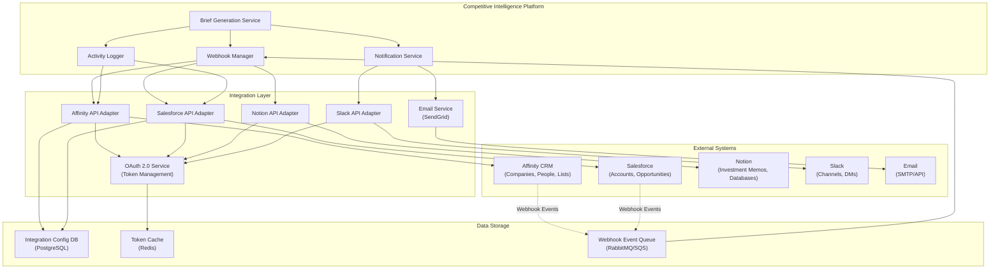

# CRM Integration Architecture: Affinity, Salesforce & VC Platform Tools

**Document Metadata**<br/>
Sprint: 02 - VC Competitive Intelligence<br/>
Task: 03 - Solution Architecture Design<br/>
Author: solution-architect<br/>
Date: 2025-11-18<br/>
Status: Final

---

## Executive Summary

The CRM Integration Architecture enables seamless workflow integration with the tools VCs use daily: Affinity (relationship intelligence), Salesforce (traditional CRM), and specialized VC platforms. This integration ensures competitive intelligence briefs are automatically attached to company records, stakeholders are notified of new insights, and portfolio monitoring alerts flow directly into existing workflows.

**Key Integration Points**:

- **Affinity CRM**: 70% of mid-size VC firms use Affinity for relationship tracking and deal pipeline management
- **Salesforce**: 30% of VC firms use Salesforce for enterprise-grade CRM
- **Notion**: Increasingly popular for investment memos, research databases
- **Slack/Microsoft Teams**: Real-time notifications for competitive alerts
- **Email**: Automated brief delivery via SendGrid/AWS SES

**Integration Capabilities**:

- **Bidirectional Sync**: Automatically fetch company data from CRM, push completed briefs back to company records
- **Workflow Triggers**: Generate briefs when company enters "Due Diligence" stage in CRM
- **Smart Notifications**: Alert relevant stakeholders (partner, analyst) when brief is ready or competitive threat detected
- **Activity Logging**: Track brief views, shares, exports as CRM activities

**Architecture Principles**:

- **OAuth 2.0 Authentication**: Secure, user-authorized access to CRM data
- **Webhook-Driven**: Event-driven architecture for real-time updates
- **Graceful Degradation**: Continue operating if CRM is temporarily unavailable
- **Data Privacy**: Never store CRM credentials, use short-lived access tokens

---

## CRM Integration Architecture



---

## Affinity CRM Integration

### Affinity Overview

**Market Position**: Leading CRM for venture capital and private equity firms<br/>
**Key Features**: Relationship intelligence, automatic contact tracking, pipeline management<br/>
**Adoption**: 70% of mid-size VC firms ($100M-2B AUM)

**API Access**:
- REST API with OAuth 2.0 authentication
- Rate limits: 100 requests/minute (standard), 300 requests/minute (enterprise)
- Webhook support for real-time events

### OAuth 2.0 Authentication Flow

**Initial Setup**:

1. VC firm administrator authorizes the app in Affinity settings
2. User completes OAuth flow (redirect to Affinity, approve scopes, redirect back)
3. App receives authorization code, exchanges for access token + refresh token
4. Store refresh token encrypted in database, cache access token in Redis (1 hour TTL)

**Implementation**:
```javascript
import { OAuth2Client } from 'google-auth-library';

class AffinityOAuthService {
  constructor() {
    this.clientId = process.env.AFFINITY_CLIENT_ID;
    this.clientSecret = process.env.AFFINITY_CLIENT_SECRET;
    this.redirectUri = process.env.AFFINITY_REDIRECT_URI;
  }

  getAuthorizationUrl() {
    const scopes = ['companies:read', 'companies:write', 'persons:read', 'webhook:write'];
    const authUrl = `https://api.affinity.co/oauth/authorize?client_id=${this.clientId}&redirect_uri=${this.redirectUri}&response_type=code&scope=${scopes.join(' ')}`;
    return authUrl;
  }

  async exchangeCodeForToken(authorizationCode) {
    const response = await fetch('https://api.affinity.co/oauth/token', {
      method: 'POST',
      headers: { 'Content-Type': 'application/json' },
      body: JSON.stringify({
        client_id: this.clientId,
        client_secret: this.clientSecret,
        code: authorizationCode,
        grant_type: 'authorization_code',
        redirect_uri: this.redirectUri,
      }),
    });

    const { access_token, refresh_token, expires_in } = await response.json();

    // Store refresh token encrypted
    await this.storeRefreshToken(refresh_token);

    // Cache access token in Redis (1 hour TTL)
    await redis.setex(`affinity:access_token:${userId}`, expires_in, access_token);

    return access_token;
  }

  async refreshAccessToken(refreshToken) {
    const response = await fetch('https://api.affinity.co/oauth/token', {
      method: 'POST',
      headers: { 'Content-Type': 'application/json' },
      body: JSON.stringify({
        client_id: this.clientId,
        client_secret: this.clientSecret,
        refresh_token: refreshToken,
        grant_type: 'refresh_token',
      }),
    });

    const { access_token, expires_in } = await response.json();

    await redis.setex(`affinity:access_token:${userId}`, expires_in, access_token);

    return access_token;
  }
}
```

### Fetch Company Data from Affinity

**Use Case**: When user generates brief, fetch company details from Affinity to pre-fill analysis

**API Endpoint**: `GET /companies/search`

**Implementation**:
```javascript
class AffinityAdapter {
  constructor(accessToken) {
    this.accessToken = accessToken;
    this.baseUrl = 'https://api.affinity.co';
  }

  async searchCompany(companyName) {
    const response = await fetch(`${this.baseUrl}/companies/search?term=${encodeURIComponent(companyName)}`, {
      headers: {
        'Authorization': `Bearer ${this.accessToken}`,
      },
    });

    const companies = await response.json();
    return companies[0]; // Return top match
  }

  async getCompanyDetails(companyId) {
    const response = await fetch(`${this.baseUrl}/companies/${companyId}`, {
      headers: {
        'Authorization': `Bearer ${this.accessToken}`,
      },
    });

    const company = await response.json();

    return {
      name: company.name,
      domain: company.domain,
      employees: company.employees,
      industry: company.industry,
      affinityUrl: `https://app.affinity.co/companies/${companyId}`,
    };
  }
}
```

### Attach Brief to Company Record

**Use Case**: When brief is generated, automatically attach PDF to Affinity company record

**API Endpoint**: `POST /companies/{company_id}/notes`

**Implementation**:
```javascript
async function attachBriefToAffinity(companyId, briefUrl, executiveSummary) {
  const note = {
    content: `Competitive Intelligence Brief Generated\n\n${executiveSummary}\n\nFull Report: ${briefUrl}`,
    creator_id: null, // System-generated
  };

  const response = await fetch(`${baseUrl}/companies/${companyId}/notes`, {
    method: 'POST',
    headers: {
      'Authorization': `Bearer ${accessToken}`,
      'Content-Type': 'application/json',
    },
    body: JSON.stringify(note),
  });

  return await response.json();
}
```

### Webhook Integration

**Use Case**: Automatically generate brief when company enters "Due Diligence" stage in Affinity

**Webhook Setup**:
```javascript
async function registerAffinityWebhook() {
  const webhook = {
    url: 'https://our-platform.com/webhooks/affinity',
    events: ['list_entry.created', 'list_entry.updated'],
  };

  const response = await fetch(`${baseUrl}/webhooks`, {
    method: 'POST',
    headers: {
      'Authorization': `Bearer ${accessToken}`,
      'Content-Type': 'application/json',
    },
    body: JSON.stringify(webhook),
  });

  return await response.json();
}
```

**Webhook Handler**:
```javascript
app.post('/webhooks/affinity', async (req, res) => {
  const event = req.body;

  if (event.type === 'list_entry.created') {
    const { list_id, entity_id } = event.data;

    // Check if this is "Due Diligence" list
    const list = await affinityAdapter.getList(list_id);
    if (list.name === 'Due Diligence') {
      // Automatically generate competitive brief
      const company = await affinityAdapter.getCompanyDetails(entity_id);
      await briefService.generateBrief(company.name, { triggeredBy: 'affinity_webhook' });
    }
  }

  res.status(200).send('OK');
});
```

---

## Salesforce Integration

### Salesforce Overview

**Market Position**: Enterprise CRM used by 30% of VC firms<br/>
**Key Features**: Account management, opportunity tracking, custom objects<br/>
**Use Cases**: Enterprise VC firms, firms with complex multi-stage pipelines

**API Access**:
- REST API and Bulk API
- OAuth 2.0 authentication
- Rate limits: 15,000 API calls/24 hours (varies by license)

### OAuth 2.0 Authentication Flow

**Salesforce-Specific Implementation**:
```javascript
class SalesforceOAuthService {
  constructor() {
    this.clientId = process.env.SALESFORCE_CLIENT_ID;
    this.clientSecret = process.env.SALESFORCE_CLIENT_SECRET;
    this.redirectUri = process.env.SALESFORCE_REDIRECT_URI;
  }

  getAuthorizationUrl() {
    const authUrl = `https://login.salesforce.com/services/oauth2/authorize?client_id=${this.clientId}&redirect_uri=${this.redirectUri}&response_type=code`;
    return authUrl;
  }

  async exchangeCodeForToken(authorizationCode) {
    const response = await fetch('https://login.salesforce.com/services/oauth2/token', {
      method: 'POST',
      headers: { 'Content-Type': 'application/x-www-form-urlencoded' },
      body: new URLSearchParams({
        client_id: this.clientId,
        client_secret: this.clientSecret,
        code: authorizationCode,
        grant_type: 'authorization_code',
        redirect_uri: this.redirectUri,
      }),
    });

    const { access_token, refresh_token, instance_url } = await response.json();

    // Store instance_url (varies by Salesforce org)
    await this.storeInstanceUrl(instance_url);

    return { access_token, refresh_token, instance_url };
  }
}
```

### Fetch Account Data

**Use Case**: Fetch company details from Salesforce Account object

**SOQL Query**:
```javascript
class SalesforceAdapter {
  constructor(accessToken, instanceUrl) {
    this.accessToken = accessToken;
    this.instanceUrl = instanceUrl;
  }

  async searchAccount(companyName) {
    const query = `SELECT Id, Name, Website, Industry, NumberOfEmployees FROM Account WHERE Name LIKE '%${companyName}%' LIMIT 1`;

    const response = await fetch(`${this.instanceUrl}/services/data/v58.0/query?q=${encodeURIComponent(query)}`, {
      headers: {
        'Authorization': `Bearer ${this.accessToken}`,
      },
    });

    const { records } = await response.json();
    return records[0];
  }

  async getAccountDetails(accountId) {
    const response = await fetch(`${this.instanceUrl}/services/data/v58.0/sobjects/Account/${accountId}`, {
      headers: {
        'Authorization': `Bearer ${this.accessToken}`,
      },
    });

    return await response.json();
  }
}
```

### Attach Brief as Salesforce File

**Use Case**: Attach PDF brief to Salesforce Account using ContentVersion and ContentDocumentLink

**Implementation**:
```javascript
async function attachBriefToSalesforce(accountId, pdfBuffer, briefTitle) {
  // Step 1: Create ContentVersion (file upload)
  const base64Pdf = pdfBuffer.toString('base64');

  const contentVersion = {
    Title: briefTitle,
    PathOnClient: `${briefTitle}.pdf`,
    VersionData: base64Pdf,
  };

  const cvResponse = await fetch(`${instanceUrl}/services/data/v58.0/sobjects/ContentVersion`, {
    method: 'POST',
    headers: {
      'Authorization': `Bearer ${accessToken}`,
      'Content-Type': 'application/json',
    },
    body: JSON.stringify(contentVersion),
  });

  const { id: contentVersionId } = await cvResponse.json();

  // Step 2: Get ContentDocumentId from ContentVersion
  const queryResponse = await fetch(`${instanceUrl}/services/data/v58.0/query?q=SELECT ContentDocumentId FROM ContentVersion WHERE Id = '${contentVersionId}'`, {
    headers: { 'Authorization': `Bearer ${accessToken}` },
  });

  const { records } = await queryResponse.json();
  const contentDocumentId = records[0].ContentDocumentId;

  // Step 3: Link ContentDocument to Account
  const contentDocumentLink = {
    ContentDocumentId: contentDocumentId,
    LinkedEntityId: accountId,
    ShareType: 'V', // Viewer permission
    Visibility: 'AllUsers',
  };

  await fetch(`${instanceUrl}/services/data/v58.0/sobjects/ContentDocumentLink`, {
    method: 'POST',
    headers: {
      'Authorization': `Bearer ${accessToken}`,
      'Content-Type': 'application/json',
    },
    body: JSON.stringify(contentDocumentLink),
  });

  return contentDocumentId;
}
```

### Custom Object for Competitive Intelligence

**Use Case**: Create custom Salesforce object to store structured competitive intelligence data

**Custom Object Schema** (`Competitive_Brief__c`):

| Field | Type | Description |
|-------|------|-------------|
| Account__c | Lookup (Account) | Related company |
| Brief_URL__c | URL | Link to PDF brief |
| Generated_Date__c | Date | Date brief was generated |
| Competitor_Count__c | Number | Number of competitors identified |
| Competitive_Threat_Score__c | Number (0-100) | Competitive threat score |
| Key_Findings__c | Long Text | Bulleted list of key findings |
| Executive_Summary__c | Long Text | Executive summary text |

**Create Record**:
```javascript
async function createCompetitiveBriefRecord(accountId, briefData) {
  const record = {
    Account__c: accountId,
    Brief_URL__c: briefData.url,
    Generated_Date__c: new Date().toISOString().split('T')[0],
    Competitor_Count__c: briefData.competitors.length,
    Competitive_Threat_Score__c: briefData.competitiveThreatScore,
    Key_Findings__c: briefData.keyFindings.join('\n'),
    Executive_Summary__c: briefData.executiveSummary,
  };

  const response = await fetch(`${instanceUrl}/services/data/v58.0/sobjects/Competitive_Brief__c`, {
    method: 'POST',
    headers: {
      'Authorization': `Bearer ${accessToken}`,
      'Content-Type': 'application/json',
    },
    body: JSON.stringify(record),
  });

  return await response.json();
}
```

---

## Notion Integration

### Notion Overview

**Market Position**: Increasingly popular for investment memos, research databases<br/>
**Key Features**: Flexible databases, collaborative editing, embeds<br/>
**Use Cases**: VC firms using Notion for investment memos, company research

**API Access**:
- REST API with OAuth 2.0 authentication
- Rate limits: 3 requests/second

### Create Brief as Notion Page

**Use Case**: Automatically create Notion page in "Company Research" database when brief is generated

**Implementation**:
```javascript
class NotionAdapter {
  constructor(accessToken) {
    this.accessToken = accessToken;
    this.baseUrl = 'https://api.notion.com/v1';
  }

  async createBriefPage(databaseId, briefData) {
    const page = {
      parent: { database_id: databaseId },
      properties: {
        // Database properties (columns)
        'Company Name': { title: [{ text: { content: briefData.targetCompany.name } }] },
        'Brief URL': { url: briefData.url },
        'Generated Date': { date: { start: new Date().toISOString() } },
        'Competitive Threat Score': { number: briefData.competitiveThreatScore },
        'Status': { select: { name: 'Generated' } },
      },
      children: [
        // Page content (blocks)
        {
          object: 'block',
          type: 'heading_1',
          heading_1: { rich_text: [{ text: { content: 'Executive Summary' } }] },
        },
        {
          object: 'block',
          type: 'paragraph',
          paragraph: { rich_text: [{ text: { content: briefData.executiveSummary } }] },
        },
        {
          object: 'block',
          type: 'heading_2',
          heading_2: { rich_text: [{ text: { content: 'Key Findings' } }] },
        },
        ...briefData.keyFindings.map(finding => ({
          object: 'block',
          type: 'bulleted_list_item',
          bulleted_list_item: { rich_text: [{ text: { content: finding } }] },
        })),
        {
          object: 'block',
          type: 'divider',
          divider: {},
        },
        {
          object: 'block',
          type: 'pdf',
          pdf: { external: { url: briefData.url } },
        },
      ],
    };

    const response = await fetch(`${this.baseUrl}/pages`, {
      method: 'POST',
      headers: {
        'Authorization': `Bearer ${this.accessToken}`,
        'Content-Type': 'application/json',
        'Notion-Version': '2022-06-28',
      },
      body: JSON.stringify(page),
    });

    return await response.json();
  }
}
```

### Sync Competitors to Notion Database

**Use Case**: Maintain up-to-date competitor list in Notion database

**Implementation**:
```javascript
async function syncCompetitorsToNotion(databaseId, competitors) {
  for (const competitor of competitors) {
    const page = {
      parent: { database_id: databaseId },
      properties: {
        'Competitor Name': { title: [{ text: { content: competitor.name } }] },
        'Competitive Score': { number: competitor.competitorScore },
        'Funding Total': { number: competitor.funding.total },
        'Employee Count': { number: competitor.employees.count },
        'Industry': { multi_select: competitor.industry.map(i => ({ name: i })) },
        'Website': { url: competitor.website },
      },
    };

    await fetch(`${baseUrl}/pages`, {
      method: 'POST',
      headers: {
        'Authorization': `Bearer ${accessToken}`,
        'Content-Type': 'application/json',
        'Notion-Version': '2022-06-28',
      },
      body: JSON.stringify(page),
    });

    await sleep(400); // Rate limit: 3 requests/second
  }
}
```

---

## Slack Integration

### Notification Architecture

**Use Case**: Send real-time notifications to Slack channels when briefs are ready or competitive threats detected

**Slack App Setup**:

1. Create Slack app at api.slack.com/apps
2. Enable "Incoming Webhooks" and "Bots" features
3. Request OAuth scopes: `chat:write`, `channels:read`, `users:read`
4. Install app to workspace, obtain bot token

**Send Brief Notification**:
```javascript
class SlackAdapter {
  constructor(botToken) {
    this.botToken = botToken;
    this.baseUrl = 'https://slack.com/api';
  }

  async sendBriefNotification(channelId, briefData) {
    const message = {
      channel: channelId,
      text: `New Competitive Intelligence Brief: ${briefData.targetCompany.name}`,
      blocks: [
        {
          type: 'header',
          text: {
            type: 'plain_text',
            text: `Competitive Intelligence Brief: ${briefData.targetCompany.name}`,
          },
        },
        {
          type: 'section',
          fields: [
            { type: 'mrkdwn', text: `*Competitors Identified:* ${briefData.competitors.length}` },
            { type: 'mrkdwn', text: `*Competitive Threat Score:* ${briefData.competitiveThreatScore}/100` },
            { type: 'mrkdwn', text: `*Generated:* ${formatDate(briefData.generatedDate)}` },
          ],
        },
        {
          type: 'section',
          text: {
            type: 'mrkdwn',
            text: `*Executive Summary*\n${briefData.executiveSummary}`,
          },
        },
        {
          type: 'actions',
          elements: [
            {
              type: 'button',
              text: { type: 'plain_text', text: 'View Brief' },
              url: briefData.url,
              style: 'primary',
            },
            {
              type: 'button',
              text: { type: 'plain_text', text: 'Download PDF' },
              url: briefData.pdfUrl,
            },
          ],
        },
      ],
    };

    const response = await fetch(`${this.baseUrl}/chat.postMessage`, {
      method: 'POST',
      headers: {
        'Authorization': `Bearer ${this.botToken}`,
        'Content-Type': 'application/json',
      },
      body: JSON.stringify(message),
    });

    return await response.json();
  }

  async sendCompetitiveThreatAlert(channelId, portfolioCompany, threat) {
    const message = {
      channel: channelId,
      text: `⚠️ Competitive Threat Alert: ${portfolioCompany.name}`,
      blocks: [
        {
          type: 'header',
          text: {
            type: 'plain_text',
            text: `⚠️ Competitive Threat Alert`,
            emoji: true,
          },
        },
        {
          type: 'section',
          fields: [
            { type: 'mrkdwn', text: `*Portfolio Company:* ${portfolioCompany.name}` },
            { type: 'mrkdwn', text: `*Threat Level:* ${threat.level}` },
          ],
        },
        {
          type: 'section',
          text: {
            type: 'mrkdwn',
            text: `*Threat Description*\n${threat.description}`,
          },
        },
        {
          type: 'actions',
          elements: [
            {
              type: 'button',
              text: { type: 'plain_text', text: 'View Full Analysis' },
              url: threat.analysisUrl,
              style: 'danger',
            },
          ],
        },
      ],
    };

    await fetch(`${this.baseUrl}/chat.postMessage`, {
      method: 'POST',
      headers: {
        'Authorization': `Bearer ${this.botToken}`,
        'Content-Type': 'application/json',
      },
      body: JSON.stringify(message),
    });
  }
}
```

---

## Email Delivery

### Email Service Architecture

**Technology**: SendGrid for transactional emails

**Use Cases**:
- Brief delivery to VC partners
- Weekly digest of portfolio competitive threats
- Notification when brief is ready

**SendGrid Integration**:
```javascript
import sgMail from '@sendgrid/mail';

sgMail.setApiKey(process.env.SENDGRID_API_KEY);

async function sendBriefEmail(recipientEmail, briefData) {
  const msg = {
    to: recipientEmail,
    from: 'research@competitive-intelligence.com',
    subject: `Competitive Intelligence Brief: ${briefData.targetCompany.name}`,
    text: `
Your competitive intelligence brief for ${briefData.targetCompany.name} is ready.

Executive Summary:
${briefData.executiveSummary}

Key Findings:
${briefData.keyFindings.map((f, i) => `${i + 1}. ${f}`).join('\n')}

View Brief: ${briefData.url}
Download PDF: ${briefData.pdfUrl}
    `,
    html: `
<!DOCTYPE html>
<html>
<head>
  <style>
    body { font-family: Arial, sans-serif; line-height: 1.6; color: #333; }
    h1 { color: #2c3e50; }
    .finding { margin: 12px 0; padding-left: 20px; border-left: 3px solid #3498db; }
    .cta { display: inline-block; padding: 12px 24px; background: #3498db; color: white; text-decoration: none; border-radius: 4px; margin: 8px 8px 8px 0; }
  </style>
</head>
<body>
  <h1>Competitive Intelligence Brief: ${briefData.targetCompany.name}</h1>

  <h2>Executive Summary</h2>
  <p>${briefData.executiveSummary}</p>

  <h2>Key Findings</h2>
  ${briefData.keyFindings.map(f => `<div class="finding">${f}</div>`).join('')}

  <p>
    <a href="${briefData.url}" class="cta">View Brief</a>
    <a href="${briefData.pdfUrl}" class="cta">Download PDF</a>
  </p>
</body>
</html>
    `,
    attachments: [
      {
        content: briefData.pdfBase64,
        filename: `competitive-brief-${briefData.targetCompany.slug}.pdf`,
        type: 'application/pdf',
        disposition: 'attachment',
      },
    ],
  };

  await sgMail.send(msg);
}
```

### Weekly Digest Email

**Use Case**: Send weekly summary of portfolio competitive threats to VC partners

**Implementation**:
```javascript
async function sendWeeklyDigest(recipientEmail, weeklyData) {
  const msg = {
    to: recipientEmail,
    from: 'research@competitive-intelligence.com',
    subject: 'Weekly Competitive Intelligence Digest',
    templateId: 'd-weekly-digest-template', // SendGrid dynamic template
    dynamicTemplateData: {
      portfolioCompanies: weeklyData.portfolioCompanies.map(pc => ({
        name: pc.name,
        competitiveThreatScore: pc.competitiveThreatScore,
        topThreats: pc.topThreats,
        briefUrl: pc.briefUrl,
      })),
      briefsGenerated: weeklyData.briefsGenerated,
      competitorsTracked: weeklyData.competitorsTracked,
    },
  };

  await sgMail.send(msg);
}
```

---

## Activity Logging & Analytics

### Track User Engagement

**Purpose**: Log when users view, share, or export briefs to measure adoption

**Implementation**:
```javascript
class ActivityLogger {
  async logActivity(userId, activityType, metadata) {
    const activity = {
      userId,
      activityType, // 'brief_viewed', 'brief_shared', 'brief_exported', 'brief_generated'
      metadata: JSON.stringify(metadata),
      timestamp: new Date(),
    };

    // Log to database
    await db.query('INSERT INTO activity_logs (user_id, activity_type, metadata, timestamp) VALUES ($1, $2, $3, $4)', [
      activity.userId,
      activity.activityType,
      activity.metadata,
      activity.timestamp,
    ]);

    // Push to CRM (Affinity or Salesforce)
    if (metadata.crmType === 'affinity') {
      await this.logActivityToAffinity(activity);
    } else if (metadata.crmType === 'salesforce') {
      await this.logActivityToSalesforce(activity);
    }
  }

  async logActivityToAffinity(activity) {
    // Create interaction note in Affinity
    const note = {
      content: `User ${activity.userId} ${activity.activityType} for ${activity.metadata.companyName}`,
      creator_id: null,
    };

    await affinityAdapter.createNote(activity.metadata.companyId, note);
  }

  async logActivityToSalesforce(activity) {
    // Create Task in Salesforce
    const task = {
      Subject: `${activity.activityType}: ${activity.metadata.companyName}`,
      WhatId: activity.metadata.accountId, // Link to Account
      ActivityDate: new Date().toISOString().split('T')[0],
      Status: 'Completed',
      Description: JSON.stringify(activity.metadata),
    };

    await salesforceAdapter.createTask(task);
  }
}
```

---

## Workflow Automation

### Zapier Integration

**Use Case**: Enable no-code workflow automation for VC firms

**Zapier App Setup**:

1. Create Zapier app at zapier.com/developer
2. Define triggers: "Brief Generated", "Competitive Threat Detected"
3. Define actions: "Generate Brief", "Add Company to Watch List"

**Example Zap**: "When new company is added to Affinity Due Diligence list, generate competitive intelligence brief and post to Slack"

**Webhook Trigger**:
```javascript
// Zapier polls this endpoint for new briefs
app.get('/api/zapier/briefs', async (req, res) => {
  const { since } = req.query; // ISO 8601 timestamp

  const briefs = await db.query(
    'SELECT * FROM competitive_briefs WHERE generated_date > $1 ORDER BY generated_date DESC LIMIT 100',
    [since || new Date(Date.now() - 24 * 60 * 60 * 1000)] // Last 24 hours default
  );

  res.json(briefs.rows);
});
```

---

## Error Handling & Resilience

### Token Refresh Strategy

**Challenge**: OAuth tokens expire (typically 1 hour for access tokens)

**Solution**: Automatically refresh tokens before they expire

**Implementation**:
```javascript
class TokenRefreshService {
  async getValidAccessToken(userId, crmType) {
    const cachedToken = await redis.get(`${crmType}:access_token:${userId}`);

    if (cachedToken) {
      return cachedToken;
    }

    // Token expired, refresh it
    const refreshToken = await this.getRefreshToken(userId, crmType);
    const newAccessToken = await this.refreshAccessToken(refreshToken, crmType);

    // Cache for 50 minutes (expires in 60, refresh early)
    await redis.setex(`${crmType}:access_token:${userId}`, 3000, newAccessToken);

    return newAccessToken;
  }

  async refreshAccessToken(refreshToken, crmType) {
    if (crmType === 'affinity') {
      return await affinityOAuth.refreshAccessToken(refreshToken);
    } else if (crmType === 'salesforce') {
      return await salesforceOAuth.refreshAccessToken(refreshToken);
    }
  }
}
```

### Graceful Degradation

**Challenge**: CRM may be temporarily unavailable

**Solution**: Continue generating briefs, queue CRM updates for later

**Implementation**:
```javascript
async function attachBriefToCRM(companyId, briefData, crmType) {
  try {
    if (crmType === 'affinity') {
      await affinity Adapter.attachBrief(companyId, briefData);
    } else if (crmType === 'salesforce') {
      await salesforceAdapter.attachBrief(companyId, briefData);
    }
  } catch (error) {
    console.error(`CRM integration failed: ${error.message}`);

    // Queue for retry
    await messageQueue.publish('crm-integration-retry', {
      companyId,
      briefData,
      crmType,
      retryCount: 0,
    });

    // Continue without blocking brief generation
  }
}

// Retry worker
async function retryCRMIntegration(job) {
  const { companyId, briefData, crmType, retryCount } = job;

  if (retryCount > 3) {
    console.error('CRM integration failed after 3 retries, giving up');
    return;
  }

  try {
    await attachBriefToCRM(companyId, briefData, crmType);
  } catch (error) {
    // Exponential backoff: 1min, 2min, 4min
    const backoffMs = Math.pow(2, retryCount) * 60 * 1000;
    await messageQueue.publish('crm-integration-retry', {
      ...job,
      retryCount: retryCount + 1,
    }, { delay: backoffMs });
  }
}
```

---

## References

[1] "Affinity API Documentation," Affinity, api-docs.affinity.co, 2024.

[2] "Salesforce REST API Developer Guide," Salesforce, developer.salesforce.com/docs/apis, 2024.

[3] "Notion API Documentation," Notion, developers.notion.com, 2024.

[4] "Slack API: Sending Messages," Slack, api.slack.com/messaging, 2024.

[5] "SendGrid API Documentation," SendGrid, docs.sendgrid.com, 2024.

[6] "OAuth 2.0 Authorization Framework," RFC 6749, IETF, 2012.

[7] "Webhook Security Best Practices," Stripe, stripe.com/docs/webhooks/best-practices, 2024.

[8] "CRM Integration Patterns," Microsoft Dynamics, docs.microsoft.com, 2024.

[9] "Zapier Platform Documentation," Zapier, zapier.com/developer, 2024.

[10] "Token Refresh Strategies for OAuth 2.0," Auth0, auth0.com/docs, 2024.

---

**Document Status**: Final<br/>
**Next Review Date**: 2025-12-18<br/>
**Owner**: solution-architect<br/>
**Approvers**: technical-researcher, sprint-orchestrator
