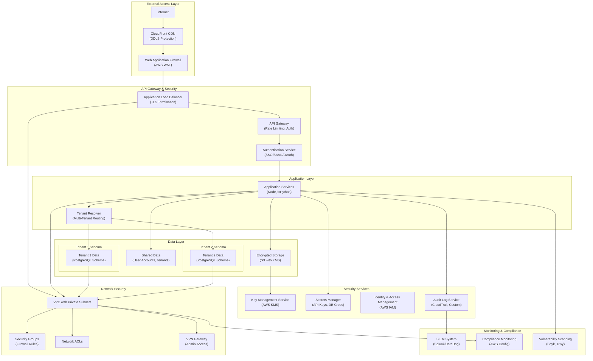

# Enterprise Security & Scalability Architecture

**Document Metadata**<br/>
Sprint: 02 - VC Competitive Intelligence<br/>
Task: 03 - Solution Architecture Design<br/>
Author: solution-architect<br/>
Date: 2025-11-18<br/>
Status: Final

---

## Executive Summary

Enterprise security and scalability are critical requirements for VC competitive intelligence platforms. VC firms handle highly sensitive investment data, require robust multi-tenant isolation, and demand SOC 2 Type II compliance. This architecture ensures data security, regulatory compliance, horizontal scalability to 10,000+ briefs/month, and 99.9% uptime SLA.

**Key Security Requirements**:

- **SOC 2 Type II Compliance**: Annual audit for security, availability, confidentiality
- **Data Encryption**: AES-256 at rest, TLS 1.3 in transit
- **Multi-Tenant Isolation**: Schema-per-tenant database architecture
- **SSO/SAML**: Support Okta, Auth0, Azure AD, Google Workspace
- **API Access Control**: OAuth 2.0, API keys with IP whitelisting
- **Audit Logging**: Comprehensive activity logs for compliance

**Scalability Targets**:

- **Throughput**: 10,000 briefs/month (330 briefs/day, 14 briefs/hour)
- **Concurrent Users**: 500 concurrent users across all tenants
- **Response Time**: <30s for brief generation (p95), <2s for API calls (p95)
- **Availability**: 99.9% uptime (8.76 hours downtime/year)
- **Data Retention**: 5 years for compliance, automatic archival to cold storage

---

## Security Architecture



---

## Authentication & Authorization

### SSO/SAML Integration

**Supported Identity Providers**:

- Okta (most common in VC/PE industry)
- Auth0
- Azure Active Directory
- Google Workspace
- OneLogin

**SAML 2.0 Authentication Flow**:

1. User visits platform, clicks "Sign in with SSO"
2. Platform redirects to VC firm's identity provider (IdP)
3. User authenticates with IdP (username/password + MFA)
4. IdP sends SAML assertion to platform
5. Platform validates assertion, creates session, redirects to dashboard

**SAML Configuration**:
```javascript
import { SAML } from 'passport-saml';

const samlStrategy = new SAML({
  entryPoint: 'https://firm.okta.com/app/saml/assertion', // IdP SSO URL
  issuer: 'competitive-intelligence-platform', // SP entity ID
  cert: process.env.SAML_CERT, // IdP signing certificate
  callbackUrl: 'https://platform.com/auth/saml/callback', // Assertion Consumer Service URL
  acceptedClockSkewMs: 5000, // Tolerate 5s clock drift
});

passport.use('saml', samlStrategy);

app.get('/auth/saml', passport.authenticate('saml', {
  failureRedirect: '/login',
  failureFlash: true,
}));

app.post('/auth/saml/callback', passport.authenticate('saml', {
  failureRedirect: '/login',
}), (req, res) => {
  // SAML assertion validated, user authenticated
  const { email, firstName, lastName } = req.user;

  // Just-In-Time (JIT) provisioning: create user if doesn't exist
  await createOrUpdateUser(email, { firstName, lastName });

  res.redirect('/dashboard');
});
```

**SAML Assertion Example**:
```xml
<saml:Assertion xmlns:saml="urn:oasis:names:tc:SAML:2.0:assertion">
  <saml:Subject>
    <saml:NameID Format="urn:oasis:names:tc:SAML:1.1:nameid-format:emailAddress">
      john.doe@sequoiacap.com
    </saml:NameID>
  </saml:Subject>
  <saml:AttributeStatement>
    <saml:Attribute Name="firstName">
      <saml:AttributeValue>John</saml:AttributeValue>
    </saml:Attribute>
    <saml:Attribute Name="lastName">
      <saml:AttributeValue>Doe</saml:AttributeValue>
    </saml:Attribute>
    <saml:Attribute Name="role">
      <saml:AttributeValue>Partner</saml:AttributeValue>
    </saml:Attribute>
  </saml:AttributeStatement>
</saml:Assertion>
```

### Role-Based Access Control (RBAC)

**Roles & Permissions**:

| Role | Brief Generation | View All Briefs | Export Data | Manage Users | Admin Settings |
|------|------------------|-----------------|-------------|--------------|----------------|
| **Partner** | ✅ | ✅ | ✅ | ✅ | ✅ |
| **Principal** | ✅ | ✅ | ✅ | ❌ | ❌ |
| **Analyst** | ✅ | ✅ (own only) | ❌ | ❌ | ❌ |
| **Read-Only** | ❌ | ✅ | ❌ | ❌ | ❌ |

**Permission Enforcement**:
```javascript
// Middleware to check permissions
function requirePermission(permission) {
  return async (req, res, next) => {
    const user = req.user;
    const userRole = await getUserRole(user.id);

    const permissions = {
      Partner: ['generate_brief', 'view_all_briefs', 'export_data', 'manage_users', 'admin'],
      Principal: ['generate_brief', 'view_all_briefs', 'export_data'],
      Analyst: ['generate_brief', 'view_own_briefs'],
      'Read-Only': ['view_all_briefs'],
    };

    if (permissions[userRole]?.includes(permission)) {
      return next();
    }

    return res.status(403).json({ error: 'Insufficient permissions' });
  };
}

// Usage
app.post('/api/briefs', requirePermission('generate_brief'), async (req, res) => {
  // Generate brief
});

app.get('/api/briefs', requirePermission('view_all_briefs'), async (req, res) => {
  // Fetch briefs
});

app.post('/api/users', requirePermission('manage_users'), async (req, res) => {
  // Create user
});
```

### API Access Control

**OAuth 2.0 for Programmatic Access**:

Allow VC firms to build custom integrations using OAuth 2.0:

**Client Credentials Flow** (for server-to-server):
```javascript
// VC firm backend requests access token
const response = await fetch('https://platform.com/oauth/token', {
  method: 'POST',
  headers: { 'Content-Type': 'application/json' },
  body: JSON.stringify({
    grant_type: 'client_credentials',
    client_id: 'vc_firm_client_id',
    client_secret: 'vc_firm_client_secret',
    scope: 'briefs:read briefs:write',
  }),
});

const { access_token } = await response.json();

// Use access token to call API
const briefsResponse = await fetch('https://platform.com/api/briefs', {
  headers: { 'Authorization': `Bearer ${access_token}` },
});
```

**API Key Authentication** (simpler alternative):

Generate long-lived API keys for VC firms:
```javascript
// Generate API key
const apiKey = crypto.randomBytes(32).toString('hex'); // 64-character hex string

await db.query('INSERT INTO api_keys (tenant_id, key_hash, created_at, expires_at) VALUES ($1, $2, $3, $4)', [
  tenantId,
  await bcrypt.hash(apiKey, 10), // Hash before storing
  new Date(),
  new Date(Date.now() + 365 * 24 * 60 * 60 * 1000), // Expire in 1 year
]);

// Authenticate API requests
app.use('/api', async (req, res, next) => {
  const apiKey = req.headers['x-api-key'];

  if (!apiKey) {
    return res.status(401).json({ error: 'API key required' });
  }

  const keyRecord = await db.query('SELECT * FROM api_keys WHERE tenant_id = $1', [req.tenant.id]);

  const valid = keyRecord.rows.some(record => bcrypt.compareSync(apiKey, record.key_hash));

  if (!valid) {
    return res.status(401).json({ error: 'Invalid API key' });
  }

  next();
});
```

**IP Whitelisting**:

Restrict API access to specific IP addresses for enhanced security:
```javascript
const allowedIPs = ['203.0.113.1', '203.0.113.2']; // VC firm office IPs

app.use('/api', (req, res, next) => {
  const clientIP = req.ip;

  if (!allowedIPs.includes(clientIP)) {
    return res.status(403).json({ error: 'IP address not whitelisted' });
  }

  next();
});
```

---

## Multi-Tenant Architecture

### Schema-Per-Tenant Isolation

**Why Schema-Per-Tenant**:

- **Data Isolation**: Each VC firm's data stored in separate PostgreSQL schema
- **Query Performance**: Indexes scoped to single tenant, faster queries
- **Backup/Restore**: Can restore single tenant without affecting others
- **Compliance**: Clear data boundaries for GDPR, SOC 2 audits

**Database Structure**:
```sql
-- Shared schema (all tenants)
CREATE SCHEMA shared;

CREATE TABLE shared.tenants (
  id UUID PRIMARY KEY DEFAULT gen_random_uuid(),
  name TEXT NOT NULL,
  domain TEXT UNIQUE NOT NULL, -- e.g., "sequoiacap.com"
  schema_name TEXT UNIQUE NOT NULL, -- e.g., "tenant_abc123"
  created_at TIMESTAMP DEFAULT NOW()
);

CREATE TABLE shared.users (
  id UUID PRIMARY KEY DEFAULT gen_random_uuid(),
  email TEXT UNIQUE NOT NULL,
  password_hash TEXT, -- null if SSO-only
  tenant_id UUID REFERENCES shared.tenants(id),
  role TEXT NOT NULL CHECK (role IN ('Partner', 'Principal', 'Analyst', 'Read-Only')),
  created_at TIMESTAMP DEFAULT NOW()
);

-- Per-tenant schema (one per VC firm)
CREATE SCHEMA tenant_abc123;

CREATE TABLE tenant_abc123.competitive_briefs (
  id UUID PRIMARY KEY DEFAULT gen_random_uuid(),
  target_company_name TEXT NOT NULL,
  industry TEXT,
  generated_date TIMESTAMP DEFAULT NOW(),
  brief_url TEXT NOT NULL,
  pdf_url TEXT NOT NULL,
  competitor_count INTEGER,
  competitive_threat_score INTEGER,
  created_by_user_id UUID, -- references shared.users
  metadata JSONB -- flexible storage for custom fields
);

CREATE TABLE tenant_abc123.competitors (
  id UUID PRIMARY KEY DEFAULT gen_random_uuid(),
  brief_id UUID REFERENCES tenant_abc123.competitive_briefs(id),
  company_name TEXT NOT NULL,
  competitor_score FLOAT,
  description TEXT,
  funding_total BIGINT,
  employee_count INTEGER
);
```

**Tenant Resolution Middleware**:
```javascript
app.use(async (req, res, next) => {
  // Determine tenant from subdomain, custom domain, or JWT claim
  const subdomain = req.hostname.split('.')[0]; // e.g., "sequoia" from "sequoia.platform.com"

  const tenant = await db.query('SELECT * FROM shared.tenants WHERE domain = $1', [subdomain]);

  if (!tenant.rows.length) {
    return res.status(404).json({ error: 'Tenant not found' });
  }

  req.tenant = tenant.rows[0];

  // Set PostgreSQL search_path to tenant schema
  await db.query(`SET search_path TO ${req.tenant.schema_name}, shared`);

  next();
});
```

**Query Example** (automatically scoped to tenant):
```javascript
// After setting search_path, queries are scoped to tenant schema
const briefs = await db.query('SELECT * FROM competitive_briefs WHERE created_by_user_id = $1', [userId]);

// PostgreSQL searches tenant_abc123.competitive_briefs, then shared.competitive_briefs (if exists)
```

### Tenant Provisioning

**Automated Onboarding**:

When new VC firm signs up, automatically provision tenant:

1. Create tenant record in `shared.tenants`
2. Create dedicated PostgreSQL schema
3. Run schema migrations to create tables
4. Set up S3 bucket prefix for tenant data
5. Generate initial admin user credentials
6. Send onboarding email

**Provisioning Script**:
```javascript
async function provisionTenant(vcFirmName, domain) {
  const schemaName = `tenant_${crypto.randomBytes(8).toString('hex')}`;

  // Step 1: Create tenant record
  const tenant = await db.query(
    'INSERT INTO shared.tenants (name, domain, schema_name) VALUES ($1, $2, $3) RETURNING *',
    [vcFirmName, domain, schemaName]
  );

  // Step 2: Create PostgreSQL schema
  await db.query(`CREATE SCHEMA ${schemaName}`);

  // Step 3: Run migrations
  await db.query(`
    CREATE TABLE ${schemaName}.competitive_briefs (
      id UUID PRIMARY KEY DEFAULT gen_random_uuid(),
      target_company_name TEXT NOT NULL,
      -- ... other fields
    );

    CREATE TABLE ${schemaName}.competitors (
      id UUID PRIMARY KEY DEFAULT gen_random_uuid(),
      -- ... other fields
    );
  `);

  // Step 4: Create S3 bucket prefix
  await s3.putObject({
    Bucket: 'competitive-intelligence-data',
    Key: `${tenant.id}/.tenant`, // Create folder marker
    Body: '',
  });

  // Step 5: Generate admin user
  const adminEmail = `admin@${domain}`;
  const tempPassword = crypto.randomBytes(16).toString('hex');

  await db.query(
    'INSERT INTO shared.users (email, password_hash, tenant_id, role) VALUES ($1, $2, $3, $4)',
    [adminEmail, await bcrypt.hash(tempPassword, 10), tenant.id, 'Partner']
  );

  // Step 6: Send onboarding email
  await sendOnboardingEmail(adminEmail, tempPassword, tenant.id);

  return tenant;
}
```

---

## Data Encryption

### Encryption at Rest

**Database Encryption**:

- **RDS PostgreSQL**: Enable encryption at rest using AWS KMS
- **Key Rotation**: Automatic key rotation every 90 days
- **Backup Encryption**: All database backups encrypted with same key

**RDS Encryption Configuration**:
```json
{
  "DBInstanceIdentifier": "competitive-intelligence-db",
  "StorageEncrypted": true,
  "KmsKeyId": "arn:aws:kms:us-east-1:123456789012:key/abcd1234-5678-90ab-cdef-1234567890ab"
}
```

**S3 Bucket Encryption**:

- **Default Encryption**: All objects encrypted with SSE-KMS (Server-Side Encryption with KMS)
- **Bucket Policy**: Deny unencrypted uploads

**S3 Bucket Policy**:
```json
{
  "Version": "2012-10-17",
  "Statement": [
    {
      "Sid": "DenyUnencryptedObjectUploads",
      "Effect": "Deny",
      "Principal": "*",
      "Action": "s3:PutObject",
      "Resource": "arn:aws:s3:::competitive-intelligence-data/*",
      "Condition": {
        "StringNotEquals": {
          "s3:x-amz-server-side-encryption": "aws:kms"
        }
      }
    }
  ]
}
```

**Field-Level Encryption**:

Encrypt sensitive fields (company financials, valuation) at application level:
```javascript
import crypto from 'crypto';

const algorithm = 'aes-256-gcm';
const key = Buffer.from(process.env.FIELD_ENCRYPTION_KEY, 'hex'); // 32 bytes

function encryptField(text) {
  const iv = crypto.randomBytes(16);
  const cipher = crypto.createCipheriv(algorithm, key, iv);

  let encrypted = cipher.update(text, 'utf8', 'hex');
  encrypted += cipher.final('hex');

  const authTag = cipher.getAuthTag();

  return `${iv.toString('hex')}:${authTag.toString('hex')}:${encrypted}`;
}

function decryptField(encryptedText) {
  const [ivHex, authTagHex, encrypted] = encryptedText.split(':');

  const iv = Buffer.from(ivHex, 'hex');
  const authTag = Buffer.from(authTagHex, 'hex');

  const decipher = crypto.createDecipheriv(algorithm, key, iv);
  decipher.setAuthTag(authTag);

  let decrypted = decipher.update(encrypted, 'hex', 'utf8');
  decrypted += decipher.final('utf8');

  return decrypted;
}

// Usage
const valuation = 100_000_000; // $100M
const encryptedValuation = encryptField(valuation.toString());

await db.query('UPDATE companies SET valuation_encrypted = $1 WHERE id = $2', [encryptedValuation, companyId]);
```

### Encryption in Transit

**TLS 1.3 Everywhere**:

- **API Gateway**: TLS 1.3 termination at Application Load Balancer
- **Database Connections**: Force SSL/TLS for PostgreSQL connections
- **Internal Services**: Mutual TLS (mTLS) for service-to-service communication

**PostgreSQL SSL Configuration**:
```javascript
const pool = new Pool({
  host: process.env.DB_HOST,
  port: 5432,
  user: process.env.DB_USER,
  password: process.env.DB_PASSWORD,
  database: process.env.DB_NAME,
  ssl: {
    rejectUnauthorized: true, // Verify server certificate
    ca: fs.readFileSync('/path/to/rds-ca-2019-root.pem'), // AWS RDS CA certificate
  },
});
```

**mTLS for Service-to-Service**:

Use service mesh (Istio, Linkerd) for automatic mTLS:
```yaml
apiVersion: security.istio.io/v1beta1
kind: PeerAuthentication
metadata:
  name: default
  namespace: production
spec:
  mtls:
    mode: STRICT # Require mTLS for all service communication
```

---

## Audit Logging & Compliance

### Comprehensive Activity Logging

**Logged Events**:

- User authentication (login, logout, failed attempts)
- Brief generation, viewing, export
- User creation, modification, deletion
- API access (endpoint, user, timestamp, response status)
- Configuration changes (SSO settings, user roles, API keys)

**Log Schema**:
```sql
CREATE TABLE shared.audit_logs (
  id UUID PRIMARY KEY DEFAULT gen_random_uuid(),
  tenant_id UUID REFERENCES shared.tenants(id),
  user_id UUID REFERENCES shared.users(id),
  event_type TEXT NOT NULL, -- 'auth.login', 'brief.generated', 'user.created', etc.
  event_metadata JSONB, -- Flexible storage for event-specific data
  ip_address INET,
  user_agent TEXT,
  timestamp TIMESTAMP DEFAULT NOW()
);

CREATE INDEX idx_audit_logs_tenant_timestamp ON shared.audit_logs (tenant_id, timestamp DESC);
CREATE INDEX idx_audit_logs_user_timestamp ON shared.audit_logs (user_id, timestamp DESC);
CREATE INDEX idx_audit_logs_event_type ON shared.audit_logs (event_type);
```

**Logging Implementation**:
```javascript
class AuditLogger {
  async log(tenantId, userId, eventType, metadata, req) {
    await db.query(
      'INSERT INTO shared.audit_logs (tenant_id, user_id, event_type, event_metadata, ip_address, user_agent) VALUES ($1, $2, $3, $4, $5, $6)',
      [
        tenantId,
        userId,
        eventType,
        JSON.stringify(metadata),
        req.ip,
        req.headers['user-agent'],
      ]
    );
  }
}

// Usage
app.post('/api/briefs', async (req, res) => {
  const brief = await generateBrief(req.body.companyName);

  await auditLogger.log(
    req.tenant.id,
    req.user.id,
    'brief.generated',
    { companyName: req.body.companyName, briefId: brief.id },
    req
  );

  res.json(brief);
});
```

**Log Retention**:

- **Hot Storage (PostgreSQL)**: 90 days for fast querying
- **Cold Storage (S3 Glacier)**: 5 years for compliance
- **Automated Archival**: Cron job runs daily to archive old logs

**Archival Script**:
```javascript
async function archiveOldLogs() {
  const ninetyDaysAgo = new Date(Date.now() - 90 * 24 * 60 * 60 * 1000);

  // Fetch old logs
  const logs = await db.query('SELECT * FROM shared.audit_logs WHERE timestamp < $1', [ninetyDaysAgo]);

  // Upload to S3 Glacier
  const csvData = logs.rows.map(log => [log.id, log.tenant_id, log.user_id, log.event_type, log.timestamp].join(',')).join('\n');

  await s3.putObject({
    Bucket: 'competitive-intelligence-archives',
    Key: `audit-logs/${ninetyDaysAgo.toISOString().split('T')[0]}.csv`,
    Body: csvData,
    StorageClass: 'GLACIER',
  });

  // Delete from PostgreSQL
  await db.query('DELETE FROM shared.audit_logs WHERE timestamp < $1', [ninetyDaysAgo]);
}
```

### SOC 2 Type II Compliance

**SOC 2 Trust Service Criteria**:

1. **Security**: Access controls, encryption, vulnerability management
2. **Availability**: Uptime monitoring, redundancy, disaster recovery
3. **Processing Integrity**: Data accuracy, error handling
4. **Confidentiality**: Multi-tenant isolation, NDA enforcement
5. **Privacy**: GDPR compliance, data retention policies

**Compliance Controls**:

| Control | Implementation | Evidence |
|---------|----------------|----------|
| **Access Control** | RBAC, SSO/SAML, MFA | User role assignments, SSO logs |
| **Encryption** | AES-256 at rest, TLS 1.3 in transit | AWS KMS audit logs, SSL Labs report |
| **Vulnerability Management** | Snyk, Trivy, quarterly penetration tests | Scan reports, pen test results |
| **Incident Response** | PagerDuty alerts, runbooks, post-mortems | Incident logs, post-mortem docs |
| **Change Management** | Git-based deployments, code reviews, CI/CD | GitHub PR history, deployment logs |
| **Backup & Recovery** | Daily automated backups, tested restores | Backup logs, restore test logs |
| **Vendor Management** | Due diligence on AWS, OpenAI, Crunchbase | Vendor SOC 2 reports, contracts |

**Annual Audit Process**:

1. **Q1**: Select SOC 2 auditor (Big 4 accounting firm or specialized auditor)
2. **Q2**: Readiness assessment, gap analysis, remediation
3. **Q3**: 12-month observation period begins, collect evidence
4. **Q4**: Auditor reviews evidence, conducts interviews, tests controls
5. **Q1 (next year)**: Receive SOC 2 Type II report, share with customers

---

## Scalability Architecture

### Horizontal Scaling Strategy

**Auto-Scaling Groups** (AWS EKS):

- **Metrics**: CPU utilization, memory utilization, request queue depth
- **Scale-Out Trigger**: CPU >70% for 2 minutes, scale out by 1 node
- **Scale-In Trigger**: CPU <30% for 5 minutes, scale in by 1 node
- **Min Nodes**: 3 (for HA across 3 AZs)
- **Max Nodes**: 20 (for handling 10,000 briefs/month)

**Kubernetes Horizontal Pod Autoscaler**:
```yaml
apiVersion: autoscaling/v2
kind: HorizontalPodAutoscaler
metadata:
  name: brief-generation-hpa
spec:
  scaleTargetRef:
    apiVersion: apps/v1
    kind: Deployment
    name: brief-generation-service
  minReplicas: 3
  maxReplicas: 20
  metrics:
  - type: Resource
    resource:
      name: cpu
      target:
        type: Utilization
        averageUtilization: 70
  - type: Resource
    resource:
      name: memory
      target:
        type: Utilization
        averageUtilization: 80
  - type: Pods
    pods:
      metric:
        name: brief_generation_queue_depth
      target:
        type: AverageValue
        averageValue: "10"
```

**Database Scaling**:

- **Read Replicas**: 2-3 read replicas for analytics queries
- **Connection Pooling**: PgBouncer to manage 1,000+ concurrent connections
- **Partitioning**: Partition `competitive_briefs` table by `generated_date` (monthly partitions)

**PostgreSQL Partitioning**:
```sql
-- Parent table
CREATE TABLE competitive_briefs (
  id UUID DEFAULT gen_random_uuid(),
  target_company_name TEXT NOT NULL,
  generated_date TIMESTAMP DEFAULT NOW(),
  -- ... other fields
) PARTITION BY RANGE (generated_date);

-- Monthly partitions
CREATE TABLE competitive_briefs_2025_01 PARTITION OF competitive_briefs
  FOR VALUES FROM ('2025-01-01') TO ('2025-02-01');

CREATE TABLE competitive_briefs_2025_02 PARTITION OF competitive_briefs
  FOR VALUES FROM ('2025-02-01') TO ('2025-03-01');

-- Automatic partition creation (pg_partman extension)
SELECT create_parent('public.competitive_briefs', 'generated_date', 'native', 'monthly');
```

### Caching Strategy

**Multi-Tier Cache**:

1. **CDN (CloudFront)**: Cache static assets, public PDFs (24h TTL)
2. **Application Cache (Redis)**: Cache API responses, LLM responses (1-24h TTL)
3. **Database Query Cache**: PostgreSQL shared_buffers (25% of RAM)

**Redis Cluster Configuration**:
```yaml
apiVersion: apps/v1
kind: StatefulSet
metadata:
  name: redis-cluster
spec:
  serviceName: redis-cluster
  replicas: 6 # 3 masters + 3 replicas
  template:
    spec:
      containers:
      - name: redis
        image: redis:7-alpine
        args:
        - --cluster-enabled yes
        - --cluster-config-file /data/nodes.conf
        - --cluster-node-timeout 5000
        - --appendonly yes
        resources:
          requests:
            memory: "2Gi"
            cpu: "500m"
          limits:
            memory: "4Gi"
            cpu: "1000m"
```

**Cache Key Strategy**:
```javascript
// LLM response cache (expensive calls)
const llmCacheKey = `llm:${modelName}:${hashPrompt(prompt)}`;
await redis.setex(llmCacheKey, 7 * 24 * 60 * 60, response); // 7 days

// Competitor discovery cache (slow queries)
const competitorCacheKey = `competitors:${companyName}:${industryHash}`;
await redis.setex(competitorCacheKey, 30 * 24 * 60 * 60, competitors); // 30 days

// Brief cache (user-facing)
const briefCacheKey = `brief:${briefId}`;
await redis.setex(briefCacheKey, 60 * 60, brief); // 1 hour
```

### Performance Targets & SLAs

| Metric | Target | Measurement | Consequence if Missed |
|--------|--------|-------------|----------------------|
| **API Response Time** | <2s (p95) | Prometheus histogram | Alert, investigate slow queries |
| **Brief Generation Time** | <30s (p95) | Prometheus histogram | Scale up services, optimize LLM calls |
| **Uptime** | 99.9% | Pingdom, StatusPage | Customer notification, credit |
| **Error Rate** | <1% | Application logs | Alert, rollback if recent deployment |
| **Database Query Time** | <100ms (p95) | PostgreSQL logs | Add indexes, optimize queries |

**SLA Credits** (for enterprise customers):

| Uptime | Credit |
|--------|--------|
| 99.9% - 99.0% | 10% monthly fee |
| 99.0% - 95.0% | 25% monthly fee |
| <95.0% | 50% monthly fee |

---

## Disaster Recovery & Business Continuity

### Backup Strategy

**Database Backups**:

- **Automated Daily Backups**: AWS RDS automated backups (7-day retention)
- **Manual Snapshots**: Before major releases, schema changes
- **Point-in-Time Recovery**: Restore to any point within last 7 days
- **Cross-Region Replication**: DR region (us-west-2 if primary is us-east-1)

**Blob Storage Backups**:

- **S3 Versioning**: Enabled on all buckets
- **Cross-Region Replication**: Replicate to DR region within 15 minutes
- **Lifecycle Policies**: Transition old versions to Glacier after 30 days

**Configuration Backups**:

- **Infrastructure-as-Code**: All infrastructure defined in Terraform (versioned in Git)
- **Kubernetes Manifests**: Helm charts in Git repository
- **Secrets**: Backed up in AWS Secrets Manager with cross-region replication

### Recovery Procedures

**Recovery Time Objective (RTO)**: 4 hours<br/>
**Recovery Point Objective (RPO)**: 1 hour (max data loss)

**Disaster Scenarios & Procedures**:

**Scenario 1: Primary Region Failure (us-east-1)**:

1. **Detection**: CloudWatch alarms detect all AZ health check failures
2. **Failover Decision**: On-call engineer confirms region outage, initiates failover
3. **Database Promotion**: Promote read replica in us-west-2 to primary (5 minutes)
4. **DNS Update**: Update Route53 to point to us-west-2 load balancer (5 minutes)
5. **Application Restart**: Restart application services in us-west-2 (10 minutes)
6. **Validation**: Run smoke tests, verify key workflows (15 minutes)
7. **Communication**: Post status page update, notify customers (ongoing)

**Estimated RTO**: 35 minutes

**Scenario 2: Data Corruption (accidental deletion)**:

1. **Detection**: User reports missing briefs, engineer confirms data deletion
2. **Assess Scope**: Determine affected tenants, time range of deletion
3. **Stop Application**: Temporarily disable write access to prevent further damage
4. **Restore from Backup**: Use point-in-time recovery to restore to pre-deletion state
5. **Validate Data**: Compare restored data with audit logs, confirm no data loss
6. **Resume Application**: Re-enable write access, monitor for issues

**Estimated RTO**: 2 hours

**Scenario 3: Security Breach (unauthorized access)**:

1. **Detection**: SIEM alerts on suspicious API activity, failed auth attempts
2. **Containment**: Rotate all API keys, force password resets, revoke access tokens
3. **Investigation**: Review audit logs, determine scope of breach
4. **Remediation**: Patch vulnerabilities, strengthen access controls
5. **Notification**: Notify affected customers within 72 hours (GDPR requirement)
6. **Post-Mortem**: Conduct incident review, implement preventive measures

**Estimated RTO**: 4 hours (to contain), 24-48 hours (full investigation)

### Disaster Recovery Testing

**Quarterly DR Drills**:

1. **Simulated Region Failure**: Practice failover to DR region
2. **Backup Restore Test**: Restore database from backup to verify integrity
3. **Runbook Review**: Update runbooks based on drill findings
4. **Post-Drill Report**: Document successes, failures, improvements

---

## Monitoring & Observability

### Prometheus Metrics

**Key Metrics to Track**:
```javascript
import { Counter, Histogram, Gauge } from 'prom-client';

// Request metrics
const httpRequestsTotal = new Counter({
  name: 'http_requests_total',
  help: 'Total HTTP requests',
  labelNames: ['method', 'route', 'status_code'],
});

const httpRequestDuration = new Histogram({
  name: 'http_request_duration_seconds',
  help: 'HTTP request duration',
  labelNames: ['method', 'route'],
  buckets: [0.1, 0.5, 1, 2, 5, 10],
});

// Brief generation metrics
const briefGenerationDuration = new Histogram({
  name: 'brief_generation_duration_seconds',
  help: 'Time to generate competitive brief',
  buckets: [5, 10, 15, 30, 60, 120],
});

const briefGenerationErrors = new Counter({
  name: 'brief_generation_errors_total',
  help: 'Total brief generation errors',
  labelNames: ['error_type'],
});

// Database metrics
const dbConnectionsActive = new Gauge({
  name: 'db_connections_active',
  help: 'Active database connections',
});

const dbQueryDuration = new Histogram({
  name: 'db_query_duration_seconds',
  help: 'Database query duration',
  labelNames: ['query_type'],
  buckets: [0.01, 0.05, 0.1, 0.5, 1, 5],
});

// Cache metrics
const cacheHits = new Counter({
  name: 'cache_hits_total',
  help: 'Total cache hits',
  labelNames: ['cache_type'],
});

const cacheMisses = new Counter({
  name: 'cache_misses_total',
  help: 'Total cache misses',
  labelNames: ['cache_type'],
});
```

### Grafana Dashboards

**Executive Dashboard**:

- Briefs generated (last 7 days, 30 days)
- Active users (daily, monthly)
- API uptime (99.9% SLA)
- Error rate (target: <1%)
- Average brief generation time

**Engineering Dashboard**:

- Request rate (req/sec)
- Response time (p50, p95, p99)
- Error rate by endpoint
- Database query performance
- Cache hit rate
- Kubernetes pod health

### Alerting Rules

**PagerDuty Alerts** (critical, wake up on-call):

- API error rate >5% for 5 minutes
- Uptime <99% in last hour
- Database CPU >90% for 10 minutes
- Brief generation failure rate >10%

**Slack Alerts** (warnings, during business hours):

- API error rate >2% for 5 minutes
- Brief generation time p95 >45s
- Cache hit rate <60%
- Disk usage >80%

---

## References

[1] "SOC 2 Compliance Guide," AICPA, aicpa.org/soc2, 2024.

[2] "AWS Well-Architected Framework: Security Pillar," Amazon Web Services, 2024.

[3] "SAML 2.0 Technical Overview," OASIS, docs.oasis-open.org/security/saml, 2024.

[4] "Multi-Tenant Architecture Patterns for SaaS," Microsoft Azure, 2024.

[5] "PostgreSQL Encryption Best Practices," PostgreSQL Documentation, 2024.

[6] "TLS 1.3 Specification," RFC 8446, IETF, 2018.

[7] "Kubernetes Horizontal Pod Autoscaler," Kubernetes Docs, kubernetes.io/docs/tasks, 2024.

[8] "Disaster Recovery Planning for Cloud Applications," AWS Whitepaper, 2024.

[9] "GDPR Compliance for SaaS Platforms," European Commission, 2024.

[10] "Prometheus Best Practices," Prometheus Documentation, prometheus.io/docs, 2024.

---

**Document Status**: Final<br/>
**Next Review Date**: 2025-12-18<br/>
**Owner**: solution-architect<br/>
**Approvers**: technical-researcher, sprint-orchestrator
