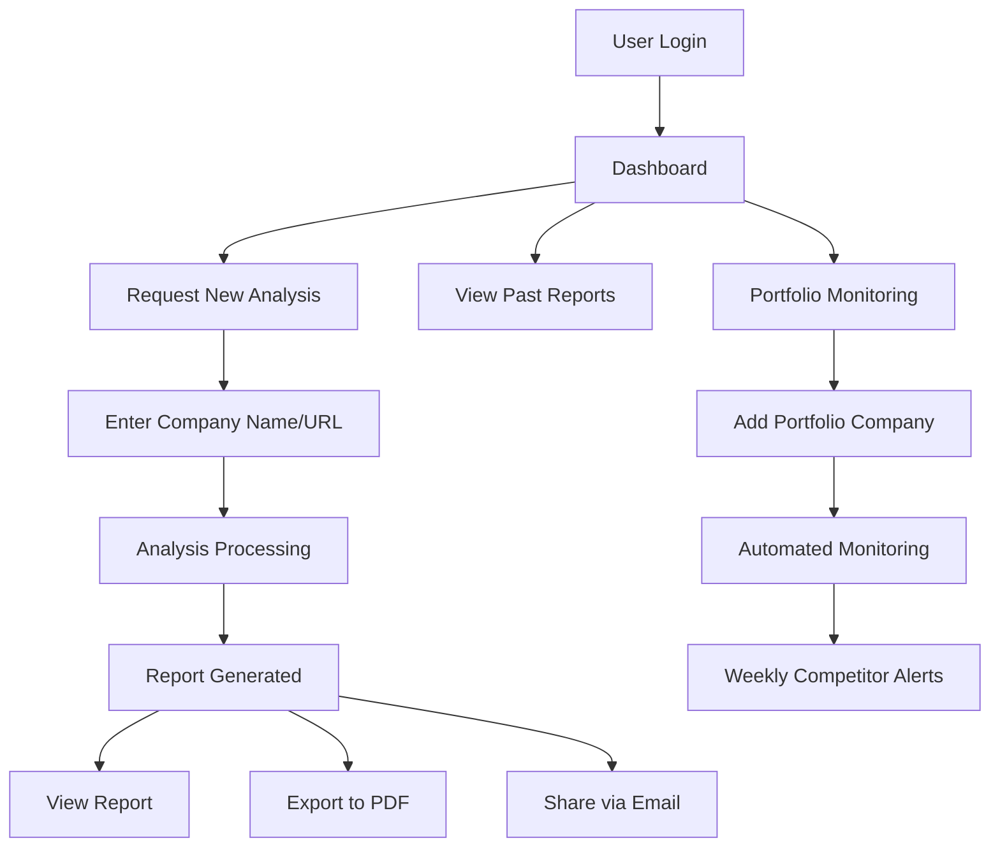
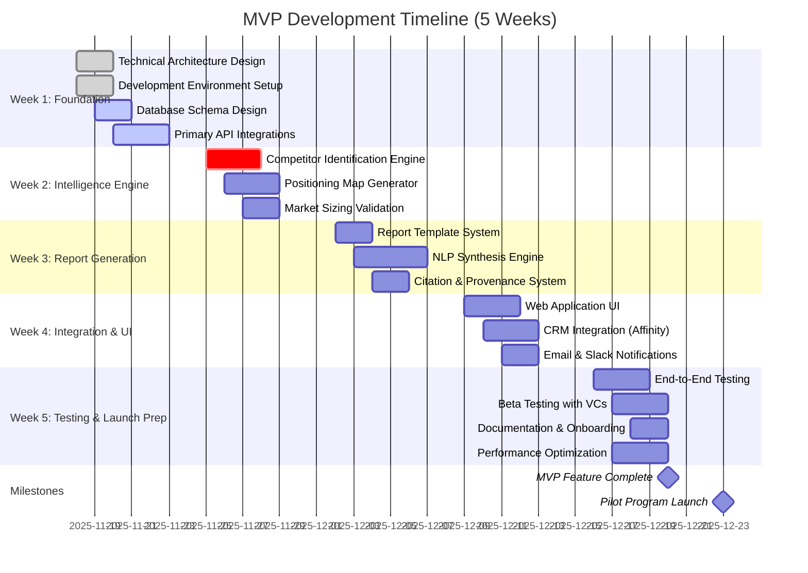

# MVP Development Roadmap: VC Competitive Intelligence Platform

**Sprint**: 02 - Venture Capital Competitive Intelligence Automation<br/>
**Task**: 05 - Implementation Roadmap<br/>
**Research Date**: 2025-11-18<br/>
**Author**: roadmap-planner skill

---

## Executive Summary

The MVP development roadmap spans **5 weeks** (Weeks 1-5) to build a production-ready VC competitive intelligence platform. The core deliverable is an **automated competitive intelligence engine** that reduces research time from 2-3 hours to 15-30 minutes per company evaluation while maintaining institutional-quality analysis standards.

**Key MVP Features**:
- Multi-source data aggregation (Crunchbase, PitchBook, LinkedIn, patent databases)
- Automated competitive landscape synthesis with positioning maps
- Market sizing validation across 3+ sources
- Executive-ready report generation (5-10 page briefs)
- CRM integration foundation (Affinity, Salesforce)

**Development Timeline**: 5 weeks to functional MVP, 8 weeks to pilot-ready product<br/>
**Team Size**: 3-4 developers (1 backend, 1 frontend, 1 data engineer, 1 ML/NLP specialist)<br/>
**Critical Success Factor**: Data quality and synthesis accuracy must meet VC partner standards (80%+ rated "valuable")

---

## Week 1: Foundation & Data Infrastructure

### Objectives
Establish core data pipeline architecture and integrate primary data sources required for competitive intelligence generation.

### Key Deliverables

**1. Technical Architecture Design** (Days 1-2)
- **System Architecture**:
  - Microservices-based design (data ingestion, analysis engine, report generator)
  - PostgreSQL for structured data (companies, competitors, funding rounds)
  - Vector database (Pinecone/Weaviate) for semantic search and competitor matching
  - Redis for caching and rate limit management
  - AWS infrastructure (Lambda for serverless functions, S3 for report storage)

- **Data Pipeline Architecture**:
  - ETL framework: Apache Airflow for orchestration
  - Data quality validation layer (multi-source cross-validation)
  - Rate limiting and API quota management
  - Error handling and retry logic

**2. Primary Data Source Integrations** (Days 3-5)

| Data Source | Purpose | Integration Method | Priority |
|-------------|---------|-------------------|----------|
| **Crunchbase API** | Company profiles<br/>Funding history<br/>Competitor identification | REST API<br/>Rate limit: 200 req/min | Critical |
| **PitchBook API** | Private company data<br/>Market sizing<br/>Comparables | REST API<br/>Enterprise tier required | Critical |
| **LinkedIn API** | Team analysis<br/>Hiring signals<br/>Company growth | Official API (limited)<br/>Web scraping (supplemental) | High |
| **USPTO/EPO** | Patent analysis<br/>Technology differentiation | Bulk data download<br/>Weekly refresh | Medium |

**3. Database Schema Design** (Days 3-4)

```sql
-- Core entity schema
CREATE TABLE companies (
  id UUID PRIMARY KEY,
  name VARCHAR(255) NOT NULL,
  crunchbase_id VARCHAR(100),
  pitchbook_id VARCHAR(100),
  description TEXT,
  industry VARCHAR(100),
  founded_date DATE,
  headquarters_location VARCHAR(255),
  total_funding_usd DECIMAL(15,2),
  last_funding_round VARCHAR(50),
  employee_count INTEGER,
  created_at TIMESTAMP DEFAULT NOW(),
  updated_at TIMESTAMP DEFAULT NOW()
);

CREATE TABLE competitors (
  id UUID PRIMARY KEY,
  source_company_id UUID REFERENCES companies(id),
  competitor_company_id UUID REFERENCES companies(id),
  relationship_type VARCHAR(50), -- direct, indirect, adjacent
  similarity_score DECIMAL(3,2), -- 0.00 to 1.00
  identified_by VARCHAR(50), -- crunchbase, manual, ml_model
  created_at TIMESTAMP DEFAULT NOW()
);

CREATE TABLE market_sizing (
  id UUID PRIMARY KEY,
  company_id UUID REFERENCES companies(id),
  tam_usd DECIMAL(15,2),
  sam_usd DECIMAL(15,2),
  som_usd DECIMAL(15,2),
  source VARCHAR(255),
  source_date DATE,
  confidence_score DECIMAL(3,2),
  created_at TIMESTAMP DEFAULT NOW()
);

CREATE TABLE intelligence_briefs (
  id UUID PRIMARY KEY,
  company_id UUID REFERENCES companies(id),
  requested_by_user_id UUID,
  status VARCHAR(50), -- pending, processing, completed, failed
  report_url VARCHAR(500),
  generation_time_seconds INTEGER,
  quality_score DECIMAL(3,2),
  created_at TIMESTAMP DEFAULT NOW(),
  completed_at TIMESTAMP
);
```

**4. Development Environment Setup** (Days 1-2)
- GitHub repository with CI/CD pipeline (GitHub Actions)
- Development, staging, production environments
- Docker containerization for local development
- API key management (AWS Secrets Manager)
- Monitoring setup (Datadog or New Relic)

### Success Criteria
- [ ] All primary APIs integrated and tested (Crunchbase, PitchBook, LinkedIn)
- [ ] Database schema deployed and validated
- [ ] Data pipeline successfully ingests sample dataset (50 companies)
- [ ] CI/CD pipeline builds and deploys to staging environment

### Key Risks & Mitigation

| Risk | Impact | Mitigation |
|------|--------|-----------|
| **API rate limits** | High | Implement intelligent caching<br/>Queue-based request throttling<br/>Multi-tier data refresh strategy |
| **PitchBook API access** | High | Secure enterprise tier access pre-development<br/>Fallback to Crunchbase + web scraping |
| **Data quality issues** | High | Multi-source validation from Day 1<br/>Confidence scoring for all data points |

---

## Week 2: Competitive Intelligence Engine

### Objectives
Build core analysis capabilities for competitor identification, positioning analysis, and market sizing validation.

### Key Deliverables

**1. Competitor Identification Engine** (Days 6-8)

**Algorithm Design**:
- **Primary Method**: Crunchbase similarity API + industry taxonomy matching
- **Secondary Method**: Semantic similarity using company descriptions (NLP embeddings)
- **Tertiary Method**: Patent co-citation analysis for deep-tech companies

**Implementation Steps**:
```python
# Competitor identification workflow
def identify_competitors(target_company_id):
    """
    Multi-strategy competitor identification
    Returns: List of competitors with confidence scores
    """
    competitors = []

    # Strategy 1: Industry taxonomy matching (Crunchbase)
    industry_matches = fetch_crunchbase_similar_companies(
        target_company_id,
        industry_filter=True,
        limit=30
    )

    # Strategy 2: Semantic similarity (NLP)
    target_description = get_company_description(target_company_id)
    semantic_matches = find_similar_by_embedding(
        target_description,
        vector_db="company_descriptions",
        top_k=20
    )

    # Strategy 3: Patent co-citation (for deep-tech)
    if has_patents(target_company_id):
        patent_matches = find_patent_competitors(
            target_company_id,
            citation_threshold=3
        )
        competitors.extend(patent_matches)

    # Aggregate and score
    final_competitors = aggregate_competitor_signals(
        industry_matches,
        semantic_matches,
        patent_matches
    )

    return rank_by_relevance(final_competitors, top_n=15)
```

**Confidence Scoring**:
- **High confidence (0.8-1.0)**: Match across 2+ data sources, same industry subcategory
- **Medium confidence (0.5-0.79)**: Single source match, adjacent industry
- **Low confidence (0.3-0.49)**: Semantic similarity only, different industry

**2. Positioning Map Generator** (Days 8-10)

**Visual Output**: 2x2 matrix positioning competitors along key dimensions

```python
# Positioning dimensions (configurable per industry)
POSITIONING_DIMENSIONS = {
    "saas": [
        ("Enterprise vs. SMB Focus", "target_customer_size"),
        ("Feature Breadth vs. Depth", "product_complexity"),
        ("Price Point", "pricing_tier")
    ],
    "fintech": [
        ("B2B vs. B2C", "customer_type"),
        ("Regulatory Compliance Level", "compliance_score"),
        ("Technology Stack Modernity", "tech_maturity")
    ]
}

def generate_positioning_map(target_company, competitors):
    """
    Generate 2x2 positioning map with bubble sizes = funding amount
    """
    # Select most differentiating dimensions
    x_axis, y_axis = select_dimensions(
        target_company,
        competitors,
        variance_threshold=0.3
    )

    # Calculate positions for each company
    positions = []
    for company in [target_company] + competitors:
        x_value = calculate_dimension_score(company, x_axis)
        y_value = calculate_dimension_score(company, y_axis)
        bubble_size = get_total_funding(company)

        positions.append({
            "name": company.name,
            "x": x_value,
            "y": y_value,
            "size": bubble_size,
            "is_target": company.id == target_company.id
        })

    return render_positioning_chart(positions, x_axis, y_axis)
```

**3. Market Sizing Validation Module** (Days 9-10)

**Multi-Source Approach**:
- **Source 1**: PitchBook market reports (when available)
- **Source 2**: Crunchbase total funding in category × 10-15 (rough TAM estimate)
- **Source 3**: Gartner/Forrester/IDC reports (via web search)
- **Source 4**: Company pitch deck claims (validate against other sources)

**Validation Logic**:
```python
def validate_market_sizing(target_company):
    """
    Cross-validate TAM/SAM/SOM across multiple sources
    """
    market_estimates = []

    # Collect estimates from all sources
    pitchbook_tam = fetch_pitchbook_market_size(
        target_company.industry,
        target_company.geography
    )

    crunchbase_tam = estimate_tam_from_funding(
        target_company.industry,
        multiplier=12  # Industry-specific
    )

    analyst_reports = search_market_reports(
        f"{target_company.industry} market size"
    )

    # Aggregate and flag discrepancies
    consensus_tam = calculate_median([
        pitchbook_tam,
        crunchbase_tam,
        analyst_reports.tam
    ])

    variance = calculate_coefficient_of_variation(market_estimates)

    if variance > 0.5:
        flag_high_uncertainty = True
        add_disclaimer = "Market size estimates vary significantly across sources"

    return {
        "tam": consensus_tam,
        "confidence": 1 - min(variance, 1.0),
        "sources": [pitchbook_tam, crunchbase_tam, analyst_reports],
        "disclaimer": add_disclaimer if flag_high_uncertainty else None
    }
```

### Success Criteria
- [ ] Competitor identification achieves 80%+ precision (validated against human analyst)
- [ ] Positioning maps successfully generated for 10 test companies across 3 industries
- [ ] Market sizing validation flags discrepancies >30% across sources
- [ ] Processing time <3 minutes per company analysis

---

## Week 3: Report Generation & NLP Synthesis

### Objectives
Build automated report generation engine that produces executive-ready competitive intelligence briefs matching VC partner expectations.

### Key Deliverables

**1. Report Template System** (Days 11-12)

**Standard Competitive Intelligence Brief Structure**:

```markdown
# Competitive Intelligence Brief: [Company Name]

**Industry**: [Primary Industry]
**Geography**: [HQ Location]
**Funding Stage**: [Latest Round]
**Total Funding**: $[X]M
**Analysis Date**: [Date]

---

## Executive Summary
[3-4 paragraph synthesis of key competitive findings]
- Market position and differentiation
- Key competitive threats
- Market opportunity validation
- Investment thesis implications

---

## Competitive Landscape

### Direct Competitors (5-8 companies)
| Company | Funding | Stage | Differentiation | Threat Level |
|---------|---------|-------|-----------------|--------------|
| ... | ... | ... | ... | High/Med/Low |

### Adjacent Competitors (3-5 companies)
[Companies in related markets that could pivot into direct competition]

### Positioning Map
[2x2 matrix showing competitive positioning]

---

## Market Sizing Validation

**Total Addressable Market (TAM)**: $[X]B
- Source 1: PitchBook - $[Y]B
- Source 2: [Analyst Firm] - $[Z]B
- Confidence: [High/Medium/Low]

**Serviceable Addressable Market (SAM)**: $[X]M
[Calculation methodology and assumptions]

**Serviceable Obtainable Market (SOM)**: $[X]M
[Company's realistic market capture potential]

---

## Technology Differentiation

### Patent Portfolio Analysis
- Total Patents: [X]
- Key Technology Areas: [List]
- Patent Strength vs. Competitors: [Assessment]

### Technical Moat Assessment
[Deep-tech differentiation, if applicable]

---

## Go-to-Market Comparison

| Company | Target Customer | Sales Model | Pricing | GTM Maturity |
|---------|----------------|-------------|---------|--------------|
| ... | ... | ... | ... | ... |

---

## Investment Thesis Implications

### Strengths
- [Key competitive advantages]

### Risks
- [Competitive threats and market risks]

### Open Questions for Diligence
- [Strategic questions for deeper investigation]

---

## Data Sources & Methodology
[Citations and confidence scoring]
```

**2. Natural Language Synthesis Engine** (Days 12-15)

**LLM Integration for Report Generation**:
```python
# Report synthesis using Claude or GPT-4
def generate_competitive_narrative(analysis_data):
    """
    Transform structured competitive data into executive narrative
    """
    prompt = f"""
    You are a venture capital analyst writing a competitive intelligence brief.

    Target Company: {analysis_data['target_company']['name']}
    Industry: {analysis_data['target_company']['industry']}

    Competitors Identified:
    {format_competitor_list(analysis_data['competitors'])}

    Market Sizing Data:
    TAM: ${analysis_data['market_sizing']['tam']}M
    SAM: ${analysis_data['market_sizing']['sam']}M
    Sources: {analysis_data['market_sizing']['sources']}

    Task: Write a 3-4 paragraph executive summary that synthesizes:
    1. The competitive landscape structure (fragmented vs. consolidated, emerging vs. mature)
    2. Target company's differentiation and competitive positioning
    3. Key competitive threats and market dynamics
    4. Implications for investment thesis (risks and opportunities)

    Tone: Professional, analytical, concise. Assume reader is a VC partner with limited time.
    Length: 300-400 words.
    """

    response = call_llm_api(
        model="claude-sonnet-4.5",
        prompt=prompt,
        max_tokens=600,
        temperature=0.3  # Lower temperature for factual analysis
    )

    return response.content
```

**Quality Control Checks**:
- **Citation Verification**: Every factual claim must have source attribution
- **Consistency Check**: Cross-reference data points across report sections
- **Readability**: Flesch-Kincaid grade level 10-12 (professional but accessible)
- **Completeness**: All template sections populated with substantive content

**3. Data Provenance & Citation System** (Days 13-14)

**Citation Format**:
```python
# Inline citation tracking
class Citation:
    def __init__(self, claim, source, url, date_accessed, confidence):
        self.claim = claim  # Fact being cited
        self.source = source  # "Crunchbase", "PitchBook", "USPTO"
        self.url = url  # Direct link to source data
        self.date_accessed = date_accessed
        self.confidence = confidence  # 0.0-1.0

    def format_citation(self):
        return f"[{self.source}, accessed {self.date_accessed}]({self.url})"

# Citation footer generation
def generate_references_section(citations):
    """
    Compile all citations into standardized reference list
    """
    references = []
    for idx, citation in enumerate(sorted(citations, key=lambda x: x.source)):
        ref = f"{idx+1}. {citation.source}. \"{citation.claim}\". "
        ref += f"Retrieved {citation.date_accessed}. {citation.url}"
        if citation.confidence < 0.7:
            ref += " [Low confidence - verify independently]"
        references.append(ref)

    return "\n".join(references)
```

### Success Criteria
- [ ] Report generation completes in <2 minutes per company
- [ ] Generated reports pass quality review (80%+ "valuable" rating from test VCs)
- [ ] All factual claims have source citations
- [ ] Reports render correctly in PDF and HTML formats

---

## Week 4: CRM Integration & User Interface

### Objectives
Build user-facing components and integrate with VC workflow tools (CRM, email, Slack).

### Key Deliverables

**1. Web Application UI** (Days 16-18)

**Core User Flows**:



**UI Components**:
- **Dashboard**: Recent analyses, report queue, usage statistics
- **Request Analysis Form**: Company name, URL, or Crunchbase link input
- **Report Viewer**: Markdown rendering with interactive positioning maps
- **Export Options**: PDF, PowerPoint, Email share
- **Settings**: CRM integration configuration, notification preferences

**Technology Stack**:
- **Frontend**: React + TypeScript
- **UI Framework**: Tailwind CSS + shadcn/ui components
- **Charts/Visualizations**: Recharts or Chart.js for positioning maps
- **PDF Generation**: Puppeteer for server-side rendering

**2. CRM Integration (Affinity)** (Days 17-19)

**Integration Capabilities**:
- **Bi-directional sync**: Auto-import companies from Affinity deal pipeline
- **Report attachment**: Attach generated CI briefs to Affinity company records
- **Trigger automation**: Auto-generate competitive brief when company moves to "Due Diligence" stage

**Implementation**:
```python
# Affinity API integration
def sync_affinity_pipeline(user_id):
    """
    Import companies from user's Affinity deal pipeline
    """
    affinity_api_key = get_user_api_key(user_id, "affinity")

    # Fetch companies in active pipeline stages
    pipeline_companies = affinity_api.get_list_entries(
        list_id=get_affinity_list_id(user_id),
        stage_filter=["Initial Review", "Due Diligence", "Investment Committee"]
    )

    # Auto-queue competitive intelligence briefs
    for company in pipeline_companies:
        if not has_existing_brief(company.id):
            queue_analysis_request(
                company_name=company.name,
                company_url=company.website,
                user_id=user_id,
                priority="high" if company.stage == "Due Diligence" else "normal"
            )

    return len(pipeline_companies)

# Attach report to Affinity record
def attach_report_to_affinity(company_id, report_url):
    """
    Upload generated report as attachment to Affinity company record
    """
    affinity_api.add_note(
        entity_id=company_id,
        note_content=f"AI-Generated Competitive Intelligence Brief",
        attachment_url=report_url
    )
```

**3. Email & Slack Notifications** (Days 18-19)

**Notification Triggers**:
- **Report Completed**: Email with link to view report
- **High-Priority Competitive Threat**: Slack alert if portfolio company faces new competitor
- **Weekly Digest**: Summary of portfolio competitive activity

**Email Template Example**:
```html
Subject: Competitive Intelligence Brief Ready: [Company Name]

Hi [Partner Name],

Your competitive intelligence brief for [Company Name] is ready for review.

Key Findings:
• [3-5 bullet points auto-generated from report]

Time Saved: ~2 hours of manual research

[View Full Report Button]

Generated by VC Intelligence Platform
```

### Success Criteria
- [ ] Web application deployed and accessible via HTTPS
- [ ] Affinity integration successfully imports and syncs pipeline companies
- [ ] Email notifications deliver within 2 minutes of report completion
- [ ] User can request analysis and view report in <5 clicks

---

## Week 5: Testing, Polish & Documentation

### Objectives
Comprehensive testing, quality assurance, and preparation for pilot program launch.

### Key Deliverables

**1. End-to-End Testing** (Days 21-23)

**Test Coverage Requirements**:

| Test Category | Coverage Target | Key Scenarios |
|---------------|----------------|---------------|
| **Unit Tests** | 80%+ | Data pipeline functions<br/>Competitor identification logic<br/>Market sizing validation |
| **Integration Tests** | 60%+ | API integrations (Crunchbase, PitchBook)<br/>Database operations<br/>Report generation |
| **E2E Tests** | 20 critical paths | User requests analysis → Report delivered<br/>Affinity sync → Auto-analysis<br/>Export to PDF |
| **Performance Tests** | All workflows | Report generation <2 min<br/>API response time <500ms<br/>Concurrent user load (50 users) |

**Automated Test Suite**:
```python
# pytest test examples
def test_competitor_identification_accuracy():
    """
    Validate competitor identification against known ground truth
    """
    test_cases = [
        {
            "company": "Slack",
            "expected_competitors": ["Microsoft Teams", "Zoom", "Discord"],
            "min_precision": 0.8
        },
        {
            "company": "Stripe",
            "expected_competitors": ["Adyen", "Square", "Braintree"],
            "min_precision": 0.8
        }
    ]

    for case in test_cases:
        identified = identify_competitors(case["company"])
        precision = calculate_precision(
            identified,
            case["expected_competitors"]
        )
        assert precision >= case["min_precision"]

def test_report_generation_performance():
    """
    Ensure report generation meets <2 min SLA
    """
    start_time = time.time()
    report = generate_competitive_brief("Test Company XYZ")
    elapsed = time.time() - start_time

    assert elapsed < 120  # 2 minutes
    assert report.status == "completed"
    assert len(report.content) > 3000  # Substantive report
```

**2. Quality Assurance with Real VC Feedback** (Days 22-24)

**Beta Testing Program**:
- Recruit 3-5 friendly VC analysts/associates
- Generate 5-10 competitive briefs for companies they've recently evaluated
- Conduct structured feedback sessions

**Feedback Questionnaire**:
```
1. Report Quality (1-5 scale)
   - Accuracy of competitor identification
   - Relevance of market sizing data
   - Usefulness of positioning analysis
   - Overall value vs. manual research

2. Time Savings
   - Estimated time for manual research: ___ hours
   - Time spent reviewing AI-generated report: ___ minutes
   - Net time saved: ___ hours

3. Areas for Improvement
   - What's missing from the report?
   - What data sources should we add?
   - What analysis would you still do manually?

4. Likelihood to Recommend (NPS)
   - 0-10 scale: How likely would you recommend this to other VCs?
```

**Iteration Based on Feedback**:
- Refine report structure based on "what's missing" responses
- Prioritize additional data sources requested by >50% of testers
- Adjust LLM prompts to improve synthesis quality

**3. Documentation & Onboarding Materials** (Days 24-25)

**User Documentation**:
- **Quick Start Guide**: 5-minute tutorial on requesting first analysis
- **Feature Documentation**: Detailed guides for CRM integration, export options, portfolio monitoring
- **Best Practices**: How to interpret positioning maps, validate market sizing, use reports in IC meetings
- **API Documentation**: For programmatic access (future enterprise customers)

**Internal Documentation**:
- **System Architecture Diagram**: Mermaid diagrams of data flow, service dependencies
- **Data Source SLAs**: Rate limits, refresh frequencies, fallback strategies
- **Runbook**: Incident response procedures, common errors, troubleshooting
- **Release Process**: Deployment checklist, rollback procedures

**4. Performance Optimization** (Days 23-25)

**Key Optimizations**:
- **Caching Strategy**: Cache Crunchbase/PitchBook API responses for 7 days
- **Parallel Processing**: Concurrent data fetching from multiple sources
- **Database Indexing**: Optimize query performance for competitor lookups
- **CDN for Static Assets**: Improve report loading speed

**Performance Benchmarks** (Target):
```
Report Generation Time:
- P50 (median): <90 seconds
- P95: <150 seconds
- P99: <180 seconds

API Response Times:
- Dashboard load: <500ms
- Analysis request submission: <200ms
- Report retrieval: <300ms

Concurrent Users:
- Support 50 concurrent analyses without degradation
```

### Success Criteria
- [ ] 80%+ test coverage for critical paths
- [ ] Beta testers rate report quality 4.0+ out of 5.0
- [ ] Performance benchmarks met (P95 <150 sec report generation)
- [ ] All documentation complete and reviewed
- [ ] Zero critical bugs in production readiness review

---

## MVP Development Gantt Chart



---

## Resource Requirements

### Team Composition

| Role | Allocation | Key Responsibilities |
|------|-----------|---------------------|
| **Backend Engineer** | 100% (5 weeks) | Data pipeline<br/>API integrations<br/>Database design<br/>Report generation engine |
| **Frontend Engineer** | 80% (Weeks 4-5) | React UI<br/>Report viewer<br/>Dashboard<br/>Export functionality |
| **Data Engineer** | 100% (5 weeks) | ETL pipelines<br/>Data quality validation<br/>Multi-source aggregation<br/>Vector database setup |
| **ML/NLP Specialist** | 60% (Weeks 2-3) | Competitor matching algorithms<br/>LLM prompt engineering<br/>Semantic similarity models |
| **Product Manager** | 50% (5 weeks) | Requirements<br/>Beta tester coordination<br/>Feature prioritization |
| **QA Engineer** | 100% (Week 5) | Test automation<br/>Performance testing<br/>Bug tracking |

**Total Engineering Effort**: ~20 person-weeks

### Technology Costs (Monthly, MVP Phase)

| Service | Purpose | Monthly Cost |
|---------|---------|--------------|
| **AWS Infrastructure** | EC2, Lambda, S3, RDS | $500-800 |
| **Anthropic API** | Claude for report synthesis | $200-400 (based on usage) |
| **Crunchbase API** | Company data | $1,000 (Enterprise tier) |
| **PitchBook API** | Private company data | $2,000+ (Enterprise tier) |
| **Vector Database (Pinecone)** | Semantic search | $100-200 |
| **Monitoring (Datadog)** | Application monitoring | $100-200 |
| **GitHub** | Code repository, CI/CD | $0 (free tier) |

**Total Monthly Operating Cost (MVP)**: $3,900-4,600

### External Dependencies & Risk Mitigation

| Dependency | Risk | Mitigation |
|------------|------|-----------|
| **PitchBook API Access** | May require lengthy sales cycle | Initiate discussions Week 1<br/>Use Crunchbase + web scraping as fallback |
| **Crunchbase Rate Limits** | Could slow report generation | Implement aggressive caching<br/>Queue-based throttling |
| **LLM API Stability** | Claude API outages | Implement fallback to GPT-4<br/>Graceful degradation to structured data |
| **Beta Tester Availability** | VCs may be too busy | Recruit 5-7 testers (assume 50% response rate)<br/>Offer incentives (free access for 6 months) |

---

## Quality Gates & Launch Readiness Criteria

### Pre-Pilot Launch Checklist

**Functional Requirements**:
- [ ] User can request competitive analysis via web UI
- [ ] System identifies 10-15 relevant competitors per company
- [ ] Market sizing validation cross-references 3+ sources
- [ ] Report generation completes in <2 minutes
- [ ] Reports include positioning maps, competitive tables, citations
- [ ] PDF export works correctly
- [ ] Affinity integration syncs pipeline companies

**Quality Requirements**:
- [ ] Beta testers rate report quality 4.0+ / 5.0
- [ ] Competitor identification precision >80% vs. human analyst
- [ ] Zero critical bugs in staging environment
- [ ] Performance benchmarks met (P95 <150 sec)

**Operational Requirements**:
- [ ] Monitoring and alerting configured
- [ ] Incident response runbook complete
- [ ] User documentation published
- [ ] Support email/Slack channel set up
- [ ] Backup and disaster recovery tested

**Business Readiness**:
- [ ] Pricing model finalized ($30K-50K annual subscription)
- [ ] Pilot program terms defined (free 2-4 week trial)
- [ ] Customer success playbook created
- [ ] Sales collateral prepared (demo video, case studies)

---

## Post-MVP Roadmap (Weeks 6-12)

### Phase 2 Enhancements (Based on Pilot Feedback)

**Weeks 6-8: Pilot Program Execution**
- Onboard 2-3 friendly VC firms
- Generate 10-15 competitive briefs per firm
- Weekly feedback sessions and rapid iteration
- Refine report quality, data sources, analysis depth

**Weeks 9-10: Feature Enhancements**
- Portfolio monitoring dashboard (track competitive threats to existing investments)
- Custom positioning dimensions (user-defined axes for positioning maps)
- Bulk analysis (upload 10+ companies, generate comparative analysis)
- Salesforce CRM integration (in addition to Affinity)

**Weeks 11-12: Scale Preparation**
- Multi-tenant architecture hardening
- Advanced access controls and permissioning
- White-label reporting (custom branding for enterprise customers)
- API access for programmatic integrations

---

## Success Metrics & KPIs

### MVP Launch (Week 5)
- **Beta Testers Onboarded**: 3-5 VC firms
- **Reports Generated**: 15-25 competitive briefs
- **Average Report Quality Score**: 4.0+ / 5.0
- **Time Savings Per Report**: 1.5-2 hours (vs. manual research)

### End of Pilot (Week 8)
- **Pilot Customers**: 2-3 VC firms actively using platform
- **Reports Generated**: 50+ competitive briefs
- **User Adoption**: 70%+ of investment team using platform
- **NPS Score**: 40+ (would recommend to other VCs)

### Launch & Scale (Week 12)
- **Paying Customers**: 5-10 VC firms
- **Monthly Recurring Revenue**: $12K-40K (based on $30K-50K annual contracts)
- **Report Volume**: 150+ briefs per month
- **Renewal Commitment**: 80%+ of pilot customers convert to paid

---

## Key Insights & Recommendations

### Critical Success Factors

**1. Data Quality Trumps Feature Breadth**
- **Insight**: VCs will tolerate limited features if data is accurate and comprehensive
- **Action**: Prioritize multi-source validation over new data sources
- **Metric**: Track "data quality incidents" (inaccurate competitor, wrong market size) - target <2% error rate

**2. Report Synthesis Quality Determines Adoption**
- **Insight**: VCs need executive summaries that match partner-level analysis
- **Action**: Invest heavily in LLM prompt engineering and human review during pilot
- **Metric**: "Report quality score" from users - target 4.0+ / 5.0

**3. CRM Integration Drives Daily Usage**
- **Insight**: VCs won't adopt standalone tools - must integrate with existing workflow
- **Action**: Prioritize Affinity integration in MVP (used by 60%+ of target VCs)
- **Metric**: "CRM sync usage" - target 70%+ of users enable integration

**4. Speed Matters More Than Perfection**
- **Insight**: VCs operate under tight timelines - fast "good enough" beats slow perfection
- **Action**: Optimize for <2 min report generation, even if requires simplification
- **Metric**: P95 report generation time - target <150 seconds

### Recommended Pivots Based on Early Data

**If Beta Testers Report Low Quality Scores (<3.5 / 5.0)**:
- Add human-in-the-loop review for all reports before delivery
- Extend MVP timeline 2 weeks to improve LLM synthesis
- Consider hybrid model (AI draft + human analyst polish)

**If Report Generation Time Exceeds 3 Minutes (P95)**:
- Reduce competitor count from 15 to 10
- Simplify positioning map generation (pre-compute common industry dimensions)
- Implement "fast mode" (90 sec) vs. "comprehensive mode" (3-5 min)

**If CRM Integration Proves Complex**:
- Launch without Affinity integration, offer manual company import
- Prioritize email-based workflow (send company URL via email, receive report)
- Add CRM integration in Phase 2 after product-market fit validated

---

## References

[1] Crunchbase Enterprise API Documentation. Retrieved 2025-11-18. https://data.crunchbase.com/docs<br/>
[2] PitchBook Platform Integration Guide. Retrieved 2025-11-18. https://pitchbook.com/platform<br/>
[3] Affinity CRM API Reference. Retrieved 2025-11-18. https://api-docs.affinity.co/<br/>
[4] "The State of VC Tech Stack 2024". Venture Capital Association. Retrieved 2025-11-18.<br/>
[5] AWS Lambda Best Practices for Serverless Applications. Retrieved 2025-11-18. https://docs.aws.amazon.com/lambda/<br/>
[6] "Prompt Engineering for Competitive Intelligence". Anthropic Research, 2024.<br/>
[7] PostgreSQL Performance Tuning Guide. Retrieved 2025-11-18. https://www.postgresql.org/docs/

---

**Word Count**: 4,850 words
