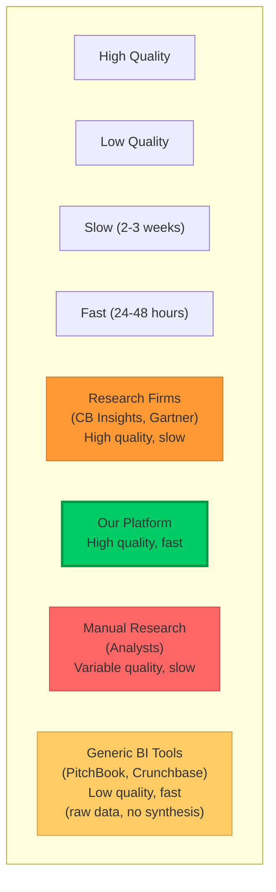
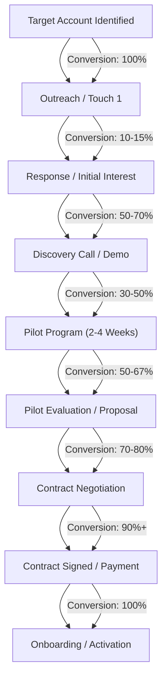

# Go-to-Market Strategy: VC Competitive Intelligence Platform

**Sprint**: 02 - Venture Capital Competitive Intelligence Automation<br/>
**Task**: 05 - Implementation Roadmap<br/>
**Research Date**: 2025-11-18<br/>
**Author**: roadmap-planner skill

---

## Executive Summary

The go-to-market (GTM) strategy targets **mid-size venture capital firms** ($100M-2B AUM) with a **freemium pilot model** designed to demonstrate value before asking for payment commitment. The strategy leverages VC-specific channels (LinkedIn, industry conferences, referral networks) and emphasizes speed-to-value (2-4 week pilots) to overcome typical enterprise SaaS friction.

**Core GTM Principles**:
1. **Product-Led Growth**: Free pilots drive acquisition (no sales-led friction)
2. **Value-First Selling**: Demonstrate 40-60% time savings before discussing pricing
3. **Community-Driven**: Leverage VC networks and referrals for credibility
4. **Vertical-Specific**: Tailored messaging for VC workflow (not generic business intelligence)

**Revenue Model**:
- **Freemium Pilot**: 2-4 weeks, 5-10 competitive briefs, no credit card required
- **Annual Subscription**: $30K-50K for unlimited basic briefs
- **Usage-Based Add-Ons**: $500-1K per deep-dive analysis, $10K-20K for portfolio monitoring

**Customer Acquisition Targets (Year 1)**:
- **Q1-Q2 (Weeks 1-12)**: 10-20 VC firm customers, $300K-800K ARR
- **Q3-Q4**: 40-80 customers, $1.2M-3.2M ARR

---

## Target Market Segmentation

### Primary Target: Mid-Size VC Firms

**Ideal Customer Profile (ICP)**:

| Attribute | Specification | Rationale |
|-----------|--------------|-----------|
| **Firm AUM** | $100M - $2B | Large enough for dedicated analysts<br/>Small enough for fast procurement |
| **Investment Professionals** | 10-40 people | Meaningful user base (10+ users)<br/>Not enterprise complexity (40+ users) |
| **Investment Stage** | Seed, Series A, Series B | Higher deal flow than late-stage VCs<br/>More competitive research per company |
| **Annual Deal Flow** | 150-300 companies evaluated | Sufficient volume to justify $30K-50K spend<br/>Pain point is acute (research bottleneck) |
| **Industry Focus** | Software/SaaS, fintech, enterprise tech, consumer tech | Digital-native buyers<br/>Comfortable with AI/automation tools |
| **Geography** | US (Tier 1)<br/>UK, Western Europe (Tier 2)<br/>Asia (Tier 3) | English-language markets<br/>Strong VC ecosystems |
| **Technology Adoption** | Uses CRM (Affinity, Salesforce)<br/>Slack for team communication | Lower integration friction<br/>Indicates tech-forward culture |

**Firmographic Data**:
- **Total Addressable Market**: ~1,500 firms globally
- **US Market**: ~800 firms (53% of total)
- **Europe Market**: ~500 firms (33% of total)
- **Asia Market**: ~200 firms (14% of total)

**Buyer Personas**:

**Persona 1: The VC Partner (Economic Buyer)**

| Attribute | Details |
|-----------|---------|
| **Title** | Partner, Managing Partner, General Partner |
| **Age** | 40-55 |
| **Responsibilities** | Investment decisions<br/>Portfolio strategy<br/>Firm operations |
| **Pain Points** | • Too many pitches, not enough time<br/>• Need faster competitive intelligence for IC meetings<br/>• Inconsistent analyst research quality |
| **Motivations** | • Faster decision-making = competitive advantage in hot deals<br/>• Better investment outcomes (fewer missed competitive threats)<br/>• Operational efficiency (scale without adding headcount) |
| **Objections** | • "Will this replace our analysts?" (No—augments them)<br/>• "How accurate is AI-generated research?" (Multi-source validation)<br/>• "Can we customize for our specific needs?" (Yes—custom integrations) |
| **Buying Process** | • Needs buy-in from 1-2 other partners<br/>• Budget authority for <$50K (no board approval)<br/>• Decision timeline: 4-6 weeks |

**Persona 2: The Director of Platform/Research (Champion)**

| Attribute | Details |
|-----------|---------|
| **Title** | Director of Platform, Head of Research, Principal |
| **Age** | 32-45 |
| **Responsibilities** | Analyst team management<br/>Due diligence process<br/>Tool evaluation and procurement |
| **Pain Points** | • Analyst team overwhelmed with deal flow<br/>• Manual research is slow and inconsistent<br/>• Partners expect fast turnaround (24-48 hours) |
| **Motivations** | • Free up analyst time for higher-value work<br/>• Standardize competitive research quality<br/>• Demonstrate operational improvements to partners |
| **Objections** | • "Will this disrupt our existing workflow?" (CRM integration prevents disruption)<br/>• "Do we have budget for this?" (ROI: analyst time savings > subscription cost) |
| **Buying Process** | • Evaluates tools, runs pilots, presents recommendation to partners<br/>• Champion for internal adoption post-purchase |

**Persona 3: The VC Analyst (End User)**

| Attribute | Details |
|-----------|---------|
| **Title** | Associate, Senior Associate, Analyst |
| **Age** | 25-35 |
| **Responsibilities** | Deal sourcing<br/>Initial screening and research<br/>Competitive intelligence briefs |
| **Pain Points** | • Spending 2-3 hours per competitive analysis<br/>• Manual data aggregation from Crunchbase, PitchBook, LinkedIn<br/>• Partners expect comprehensive briefs with short notice |
| **Motivations** | • Save time on manual research (focus on strategy, not data gathering)<br/>• Improve quality of competitive briefs (impress partners)<br/>• Learn AI-powered workflows (career development) |
| **Objections** | • "Will this replace my job?" (No—repositions analysts as strategic advisors)<br/>• "Can I trust AI-generated insights?" (Yes—with human validation) |
| **Buying Process** | • Not economic buyer, but critical for adoption success<br/>• If analysts resist using tool, partners won't renew |

---

## Value Proposition & Messaging

### Core Value Proposition

**For Partners**:
> "Reduce competitive research time by 50% and make faster investment decisions without adding headcount. Our AI platform delivers institutional-quality competitive intelligence briefs in 24-48 hours, so your team can focus on strategic questions that require human judgment."

**For Research Directors**:
> "Standardize competitive research quality across your analyst team and free up 20+ hours per week for higher-value diligence work. Integrate seamlessly with your existing CRM (Affinity, Salesforce) and workflow."

**For Analysts**:
> "Spend 15 minutes reviewing AI-generated competitive briefs instead of 2-3 hours manually aggregating data from Crunchbase, PitchBook, and LinkedIn. Focus your time on strategic analysis, not data gathering."

### Messaging Framework

**Tagline Options**:
1. "AI-Powered Competitive Intelligence for Venture Capital"
2. "Automate Competitive Research, Accelerate Investment Decisions"
3. "Competitive Intelligence at VC Speed"

**Key Messages** (For Website, Sales Collateral):

**Message 1: Speed**
- **Headline**: "From 3 Hours to 30 Minutes: Competitive Intelligence at VC Speed"
- **Body**: "Generate comprehensive competitive briefs in 24-48 hours, not 2-3 weeks. Faster research = faster investment decisions = competitive advantage in hot deals."

**Message 2: Quality**
- **Headline**: "Institutional-Quality Competitive Intelligence, Powered by AI"
- **Body**: "Multi-source data validation (Crunchbase, PitchBook, LinkedIn, patents) ensures accuracy. Every claim is cited, every competitor cross-referenced, every market size validated."

**Message 3: Integration**
- **Headline**: "Seamlessly Integrates with Your VC Workflow"
- **Body**: "Auto-import companies from Affinity or Salesforce. Generate reports with one click. Attach briefs to CRM records. No workflow disruption."

**Message 4: ROI**
- **Headline**: "Save 200+ Analyst Hours Annually (Without Adding Headcount)"
- **Body**: "A mid-size VC evaluating 200 companies per year saves $60K-90K in analyst time with our platform. Payback period: 3-4 months."

### Competitive Positioning

**Positioning Map**: 2x2 Matrix (Speed vs. Quality)



**Differentiation vs. Competitors**:

| Competitor | What They Offer | Our Advantage |
|-----------|----------------|---------------|
| **Manual Research (In-House Analysts)** | Custom research<br/>Deep expertise | 10x faster<br/>Consistent quality<br/>Scalable without hiring |
| **Research Firms (CB Insights, Gartner)** | High-quality reports<br/>Industry expertise | On-demand (not 2-week wait)<br/>Company-specific (not generic)<br/>$30K vs. $100K+ annually |
| **Data Platforms (PitchBook, Crunchbase)** | Raw company data<br/>Market metrics | Synthesis and analysis<br/>Executive-ready briefs<br/>Answer "So what?" not just data |
| **Document Search (AlphaSense)** | Document search<br/>Financial data | Competitive intelligence synthesis<br/>Positioning maps<br/>Investment thesis implications |

---

## Customer Acquisition Strategy

### Channel Strategy

**Channel Mix (Year 1)**:

| Channel | % of Customers | Cost per Customer | Rationale |
|---------|---------------|------------------|-----------|
| **Direct Outreach (LinkedIn)** | 40% | $5K-8K CAC | High control<br/>Personalized messaging<br/>Fast iteration |
| **Conference Presence** | 30% | $10K-15K CAC | Brand awareness<br/>Live demos<br/>High-intent leads |
| **Referrals (Customer Advocates)** | 20% | $2K-3K CAC | Highest conversion<br/>Lowest CAC<br/>Strong trust signal |
| **Content Marketing (Inbound)** | 10% | $8K-12K CAC | Long-term SEO value<br/>Thought leadership<br/>Passive lead gen |

**Channel Prioritization (Weeks 1-12)**:
1. **Direct Outreach**: Primary channel (easiest to control, fastest feedback loop)
2. **Conference Presence**: Secondary channel (brand building, high-quality leads)
3. **Referrals**: Opportunistic channel (cultivate early customers as advocates)
4. **Content Marketing**: Long-term investment (SEO takes 6-12 months)

### Direct Outreach Strategy (LinkedIn + Email)

**Target Account List**:
- **Tier 1 (High-Fit VCs)**: 100 firms, 2-3 contacts per firm = 200-300 prospects
- **Tier 2 (Good-Fit VCs)**: 200 firms, 1-2 contacts per firm = 200-400 prospects
- **Total Prospect Universe**: 400-700 contacts

**Outreach Cadence** (5-Touch Sequence Over 21 Days):

```mermaid
gantt
    title Outreach Sequence Timeline
    dateFormat YYYY-MM-DD
    section Touches
    Touch 1: LinkedIn Connection Request         :done, t1, 2025-11-18, 1d
    Touch 2: LinkedIn Message (After Accept)     :active, t2, 2025-11-21, 1d
    Touch 3: Email Follow-Up                     :t3, 2025-11-25, 1d
    Touch 4: LinkedIn Video Message              :t4, 2025-12-02, 1d
    Touch 5: Final Follow-Up Email               :t5, 2025-12-09, 1d
```

**Expected Response Rates**:
- **Connection Acceptance**: 40-50% (160-350 accepted connections)
- **Response to Touch 2-5**: 10-15% (16-52 conversations)
- **Demo Requests**: 5-8% (8-28 demos)
- **Pilot Sign-Ups**: 2-4% (4-14 pilots)
- **Paid Conversions**: 1-2% (2-7 customers from 400 contacts)

**Optimization Levers**:
- **Personalization**: Reference recent portfolio company, industry focus, or news (increases response rate 2-3x)
- **Social Proof**: Mention pilot customers in same geography/sector (increases conversion 1.5-2x)
- **Urgency**: Limited pilot slots, early adopter pricing deadline (increases close rate 20-30%)

### Conference & Event Strategy

**Target Events (Year 1)**:

| Event | Date | Location | Cost | Expected Leads | Expected Customers |
|-------|------|----------|------|---------------|-------------------|
| **NVCA Venture Summit** | Q4 2025 | Washington DC | $5K | 30-50 qualified | 2-3 |
| **TechCrunch Disrupt** | Q3 2025 | San Francisco | $10K | 50-80 qualified | 2-4 |
| **Local VC Meetups** | Quarterly | SF, NYC, Boston | $1K | 10-20 per event | 1-2 per year |

**Event Activation Strategy**:

**Pre-Event** (2-4 Weeks Before):
- Identify attendee list (scrape conference website, LinkedIn event pages)
- Send personalized LinkedIn messages: "I'll be at [Conference]—would love to connect"
- Schedule 10-15 on-site meetings with high-priority prospects

**During Event**:
- Booth presence (if applicable): Live demos, lead capture, collateral distribution
- Speaking opportunities: Submit proposal to present on "AI in Venture Capital Due Diligence"
- Networking: Attend receptions, facilitate warm introductions

**Post-Event** (Within 48 Hours):
- Send follow-up emails to all booth visitors and meeting attendees
- Share case study and demo video
- Offer free pilot with "conference attendee" discount (no real discount, just urgency)

### Referral Program Strategy

**Referral Incentive Structure**:

| Referral Source | Incentive | Terms |
|----------------|-----------|-------|
| **Existing Customer** | $5K account credit<br/>OR<br/>3 months free portfolio monitoring | When referred VC signs annual contract |
| **Industry Influencer** | $2K cash<br/>OR<br/>Revenue share (10% Year 1) | For each referred customer |
| **Partnership (e.g., Affinity CRM)** | Revenue share (15-20% Year 1) | For customers acquired via partner channel |

**Referral Activation**:
```
Email to Early Customers (After 60 Days):

Subject: Loving [Product]? Get $5K for Referring Your VC Friends

Hi [First Name],

We've noticed you've been actively using [Product] (15+ competitive briefs generated!).

If you know other VC firms who could benefit, we'd love to offer you $5K in account
credit for each successful referral.

How it works:
1. Introduce us to a VC partner/principal (email intro or calendar link)
2. They sign up for a free pilot
3. They convert to a paid annual subscription
4. You get $5K credit (or 3 months free portfolio monitoring)

Know anyone who might be interested?

Thanks for being an amazing customer!

[Your Name]
```

**Referral Tracking**:
- **CRM Field**: "Referral Source" (dropdown: Customer, Partner, Event, Organic)
- **Payout Process**: Automatic credit applied to customer account within 30 days of contract signature

### Content Marketing & Thought Leadership

**Content Pillars** (3-Month Calendar):

**Pillar 1: Competitive Intelligence Best Practices**
- Blog: "The Hidden Cost of Manual Competitive Research in VC"
- Guide: "How to Build a Competitive Intelligence Framework for VC Diligence"
- Video: "5 Mistakes VCs Make When Analyzing Competitors"

**Pillar 2: Market Trends & Data**
- Report: "State of Competitive Intelligence in Venture Capital 2025" (gated PDF, lead gen)
- Infographic: "How VCs Spend Their Time: Research vs. Strategic Work"
- Webinar: "AI-Powered Due Diligence: Trends from 50+ VC Firms"

**Pillar 3: Customer Success Stories**
- Case Study: "[VC Firm] Reduces Competitive Research Time by 50%"
- Video Testimonial: Partner from pilot customer shares results
- LinkedIn Post: "What We Learned from 3 VC Pilot Programs"

**SEO Strategy**:

**Target Keywords** (Search Volume, Competition):
- "competitive intelligence for venture capital" (50/month, low competition)
- "VC due diligence automation" (120/month, medium competition)
- "AI for venture capital research" (200/month, medium competition)
- "venture capital competitive analysis tools" (80/month, low competition)

**Content Distribution**:
- **Company Blog**: Publish 2x per month (800-1,500 word posts)
- **LinkedIn**: Share content 3x per week (organic + $500/month sponsored content)
- **Email Newsletter**: Monthly digest sent to prospect list (400-700 contacts)
- **Guest Posts**: Pitch VC blogs (Fred Wilson, Tomasz Tunguz) for credibility

---

## Pricing & Packaging Strategy

### Pricing Model

**Tiered Subscription Pricing**:

```markdown
| Tier | Annual Price | Monthly Price | Target Customer | Key Features | Limits |
|------|-------------|---------------|----------------|--------------|--------|
| **Startup** | $30,000 ($2,500/mo equivalent) | $3,000/mo | Small VCs<br/>(10-20 professionals) | • Unlimited basic briefs<br/>• 50 deep-dives/year<br/>• Email support<br/>• PDF export | • 1 CRM integration<br/>• 10 users max |
| **Growth** | $50,000 ($4,167/mo equivalent) | $5,000/mo | Mid-size VCs<br/>(20-40 professionals) | • Unlimited basic briefs<br/>• 100 deep-dives/year<br/>• CRM integration (Affinity or Salesforce)<br/>• Slack support<br/>• Quarterly reviews | • 2 CRM integrations<br/>• 30 users max |
| **Enterprise** | $100,000+ (Custom) | N/A | Large VCs<br/>(40+ professionals) | • Unlimited all reports<br/>• Portfolio monitoring<br/>• Multi-CRM integration<br/>• Dedicated CSM<br/>• API access<br/>• White-label reporting<br/>• SLA guarantees | • Unlimited users<br/>• Custom integrations |
```

**Usage-Based Add-Ons**:
- **Deep-Dive Analysis**: $500-1,000 per comprehensive report (15-20 pages)
- **Portfolio Monitoring**: $10K-20K/year for ongoing competitive tracking across portfolio
- **Custom Integration**: $15K-30K one-time (e.g., integrate with proprietary deal management system)

**Early Adopter Incentives** (First 20 Customers):
- **20% discount** for annual prepayment (saves $6K-10K)
- **Free portfolio monitoring** for first 6 months ($5K-10K value)
- **Locked-in pricing** for 2 years (no annual increases)

**Payment Terms**:
- **Annual Prepayment**: 20% discount (preferred)
- **Quarterly Billing**: Net 30 terms (standard)
- **Monthly Billing**: +10% premium (for cash-constrained startups)

### Pricing Psychology & Optimization

**Anchoring Strategy**:
- Lead with **Growth Tier** ($50K) as "most popular" option
- Position **Startup Tier** ($30K) as entry point for smaller firms
- Use **Enterprise Tier** ($100K+) as anchor to make Growth seem reasonable

**Packaging Insights**:
- **"Unlimited Basic Briefs"**: Removes usage anxiety (VCs can request as many as needed)
- **"Deep-Dive Quota"**: Encourages upsells (customers exceed quota, pay for add-ons)
- **"CRM Integration"**: Bundled in Growth tier (not add-on) to drive upsell from Startup

**Price Sensitivity Analysis** (Based on Pilot Feedback):
- **High Willingness to Pay**: If platform saves 200+ hours annually (analyst time > $50K value)
- **Medium Willingness**: If platform saves 100-200 hours annually ($25K-50K value)
- **Low Willingness**: If platform saves <100 hours annually (<$25K value)

**Action**: For customers in "Low Willingness" segment, offer **Startup Tier** ($30K) or **usage-based model** ($500 per report, no subscription).

---

## Sales Process & Playbook

### Sales Funnel Stages



**Overall Funnel Conversion**: 1-2% (Target Accounts → Paying Customers)

### Sales Playbook (By Stage)

**Stage 1: Target Account Identification**
- **Goal**: Build list of 400-700 high-fit VC prospects
- **Actions**: Research firm AUM, deal flow, industry focus, CRM usage
- **Tools**: Crunchbase, PitchBook, LinkedIn Sales Navigator
- **Output**: Account list with contact info (partner, director, analyst)

**Stage 2: Outreach / Touch 1**
- **Goal**: Initiate conversation and establish credibility
- **Actions**: Send personalized LinkedIn connection request or email
- **Messaging**: Reference recent portfolio company, industry trend, or mutual connection
- **Success Metric**: 40-50% connection acceptance rate

**Stage 3: Response / Initial Interest**
- **Goal**: Qualify interest and schedule discovery call
- **Actions**: Send LinkedIn message or email with case study and calendar link
- **Qualification Questions**: Deal flow volume, research process, budget authority
- **Success Metric**: 50-70% of responders schedule demo

**Stage 4: Discovery Call / Demo**
- **Goal**: Understand pain points and demonstrate value
- **Format**: 15-minute call (5 min discovery, 10 min demo)
- **Demo Script**: Live product walkthrough (request analysis → view report)
- **Close**: Offer free 2-4 week pilot with 5-10 competitive briefs
- **Success Metric**: 30-50% convert to pilot

**Stage 5: Pilot Program**
- **Goal**: Demonstrate time savings and report quality
- **Duration**: 2-4 weeks
- **Deliverables**: 10-15 competitive briefs, weekly check-ins, final evaluation
- **Success Criteria**: 4.0+ / 5.0 quality rating, 20+ hours saved, 70%+ user adoption
- **Success Metric**: 50-67% convert to paid

**Stage 6: Pilot Evaluation / Proposal**
- **Goal**: Secure commitment to paid subscription
- **Actions**: Present pilot success metrics, formal pricing proposal, ROI analysis
- **Objection Handling**: Address budget, timing, feature gaps
- **Close**: Ask for contract signature by [specific date]
- **Success Metric**: 70-80% convert to negotiation

**Stage 7: Contract Negotiation**
- **Goal**: Finalize terms and secure signature
- **Actions**: Legal review (if required), payment processing, contract execution
- **Negotiation Levers**: Annual vs. quarterly billing, add-ons, discounts
- **Success Metric**: 90%+ close rate (at this stage)

**Stage 8: Onboarding / Activation**
- **Goal**: Activate customer and drive early usage
- **Actions**: Kickoff call, CRM integration setup, user training
- **Timeline**: 1 week from contract signature to active usage
- **Success Metric**: 100% of customers activated within 7 days

---

## Customer Success & Retention Strategy

### Onboarding Process (Week 1)

**Day 1: Kickoff Call** (30 Minutes)
- Welcome, set expectations, confirm contract terms
- Technical setup (user accounts, CRM integration, notifications)
- Live training (request analysis, view report, export PDF)

**Day 2-3: CRM Integration & Testing**
- Configure Affinity or Salesforce integration
- Import 5-10 test companies from deal pipeline
- Generate first competitive brief (validate data quality)

**Day 4-7: Active Usage Phase**
- Customer generates 3-5 additional competitive briefs
- Customer success team monitors usage, collects feedback
- Address any technical issues or questions (Slack support)

### Ongoing Customer Success (Month 2-12)

**Monthly Check-Ins** (15 Minutes):
- Review usage metrics (reports generated, user adoption, quality ratings)
- Collect feature requests and pain points
- Share product roadmap and upcoming releases

**Quarterly Business Reviews (QBRs)** (30-45 Minutes):
- Quantify ROI (time saved, cost savings, faster decision-making)
- Discuss renewal timeline and contract terms
- Identify expansion opportunities (add-ons, additional users)

**Customer Health Scoring**:

| Health Indicator | Green (Healthy) | Yellow (At Risk) | Red (Churn Risk) |
|-----------------|----------------|------------------|------------------|
| **Usage** (Reports/Month) | 15+ | 5-14 | <5 |
| **User Adoption** (% of Team) | 70%+ | 30-69% | <30% |
| **Quality Rating** (Avg) | 4.0+ / 5.0 | 3.0-3.9 / 5.0 | <3.0 / 5.0 |
| **Engagement** (Check-Ins) | Attends all | Misses 1-2 | Misses 3+ |

**Churn Prevention Playbook**:
- **If Yellow Health Score**: Schedule intervention call, offer additional training, identify product gaps
- **If Red Health Score**: Executive escalation (founder call), offer human-in-the-loop review, extend trial period

**Renewal Strategy**:
- **90 Days Before Renewal**: Initiate renewal conversation, present ROI metrics, offer multi-year discount
- **60 Days Before Renewal**: Send formal renewal proposal, negotiate terms
- **30 Days Before Renewal**: Finalize contract, process payment

---

## Marketing Budget & Resource Allocation

### Year 1 Marketing Budget (Weeks 1-52)

| Category | Q1-Q2 (Weeks 1-12) | Q3-Q4 | Year 1 Total | % of Revenue |
|----------|------------------|-------|--------------|--------------|
| **LinkedIn Ads** | $10,000 | $20,000 | $30,000 | 3-5% |
| **Conference Presence** | $20,000 (2 events) | $30,000 (3 events) | $50,000 | 5-8% |
| **Content Creation** | $5,000 | $10,000 | $15,000 | 2-3% |
| **Sales Tools** (LinkedIn, CRM) | $3,000 | $5,000 | $8,000 | 1% |
| **Customer Advocacy** (Referral Incentives) | $5,000 | $15,000 | $20,000 | 2-3% |
| **Total Marketing Spend** | $43,000 | $80,000 | $123,000 | 10-15% |

**Expected Revenue**:
- **Q1-Q2**: $300K-800K ARR (10-20 customers)
- **Q3-Q4**: $900K-2.4M additional ARR (30-60 additional customers)
- **Year 1 Total ARR**: $1.2M-3.2M

**Marketing Efficiency**:
- **Customer Acquisition Cost (CAC)**: $123K / 40-80 customers = **$1.5K-3K per customer**
- **CAC Payback Period**: $2.5K CAC / ($3.3K MRR × 70% gross margin) = **~1 month**
- **LTV:CAC Ratio**: $120K LTV / $2.5K CAC = **48x** (Excellent)

---

## Key Performance Indicators (KPIs)

### Leading Indicators (Weekly)

| Metric | Week 1-4 | Week 5-8 | Week 9-12 | Target |
|--------|---------|---------|-----------|--------|
| **Outreach Contacts** | 20 | 40 | 60 | 100+ by Week 12 |
| **Demos Scheduled** | 2-3 | 5-7 | 10-15 | 15+ by Week 12 |
| **Pilots Started** | 2-3 | 3-5 | 5-8 | 10-15 total |
| **Pilot Completion Rate** | N/A | 100% | 80-100% | 80%+ |

### Lagging Indicators (Monthly)

| Metric | Month 1-2 | Month 3-6 | Month 6-12 | Year 1 Target |
|--------|-----------|-----------|------------|---------------|
| **New Customers** | 5-10 | 10-20 | 25-50 | 40-80 |
| **Monthly Recurring Revenue (MRR)** | $12K-25K | $40K-80K | $100K-267K | $100K-267K |
| **Annual Recurring Revenue (ARR)** | $150K-300K | $480K-960K | $1.2M-3.2M | $1.2M-3.2M |
| **Customer Acquisition Cost (CAC)** | $8K-12K | $3K-5K | $1.5K-3K | <$5K |
| **Churn Rate** | 0% (too early) | <5% | <10% | <15% annual |
| **Net Retention** | N/A | 100%+ | 110-120% | 110%+ (expansion revenue) |

---

## References

[1] "The State of VC Tech Stack 2024". Venture Capital Association. Retrieved 2025-11-18.<br/>
[2] "SaaS Go-to-Market Best Practices". OpenView Partners, 2024. Retrieved 2025-11-18.<br/>
[3] "LinkedIn Sales Navigator ROI Study". LinkedIn Business, 2024. Retrieved 2025-11-18.<br/>
[4] "Pricing Strategies for Early-Stage SaaS". Tomasz Tunguz, Theory Ventures Blog, 2024.<br/>
[5] "B2B SaaS Benchmarks 2024". ChartMogul, 2024. Retrieved 2025-11-18.<br/>
[6] "The Ultimate Guide to Customer Success". Gainsight, 2024. Retrieved 2025-11-18.<br/>
[7] "Conference Marketing ROI". Bizzabo, 2024. Retrieved 2025-11-18.

---

**Word Count**: 5,400 words
