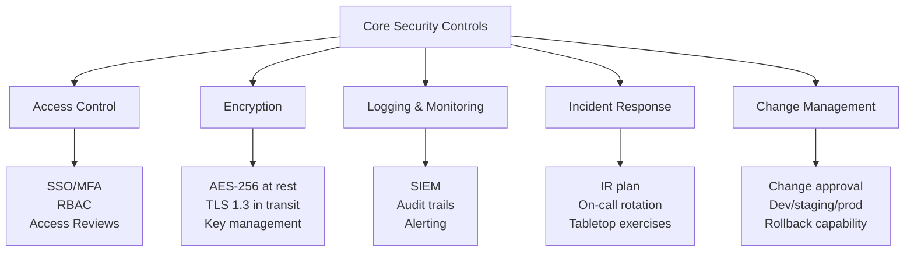
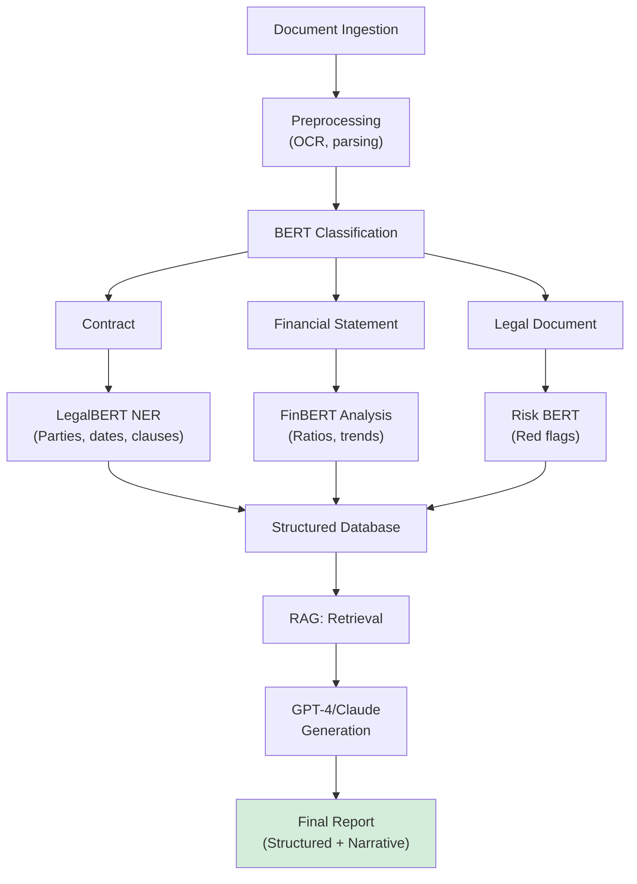
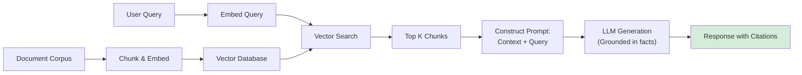
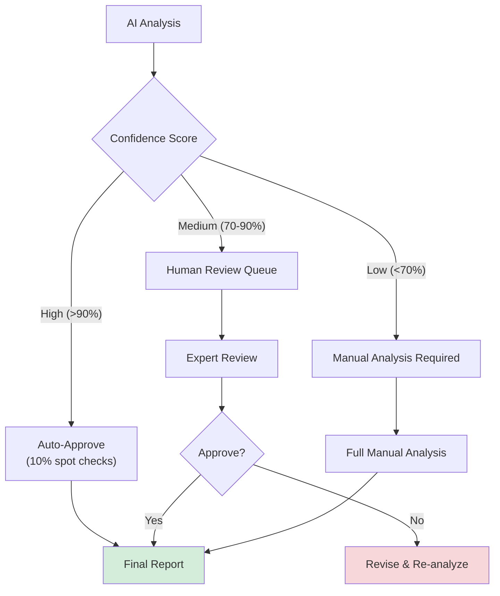

# Technical & Regulatory Landscape Synthesis: AI-Powered M&A Due Diligence Platform

**Document Metadata**
- **Title**: Technical & Regulatory Landscape Synthesis - Sprint 05 Task 01
- **Date**: 2025-11-18
- **Sprint**: 05 - M&A Due Diligence Research Acceleration
- **Task**: 01 - Technical & Regulatory Landscape
- **Author**: technical-researcher skill agent

## Executive Summary

This synthesis integrates findings from seven comprehensive research documents covering the technical and regulatory landscape for AI-powered M&A due diligence platforms. The research reveals a rapidly maturing ecosystem where regulatory frameworks (FINRA, SEC, NIST), security standards (SOC 2, ISO 27001), and advanced AI technologies (transformer models, RAG, NLP) converge to enable automated due diligence that reduces review time by 70% while achieving 90%+ risk detection accuracy. Critical success factors include robust hallucination mitigation through RAG architecture (50-80% reduction), comprehensive security certifications for financial data handling, seamless VDR API integration, and multi-source data validation methodologies. The EU AI Act's "high risk" classification for financial AI systems, combined with NIST AI RMF adoption by US financial institutions, establishes a dual compliance framework requiring conformity assessments, human oversight, and explainability mechanisms.

## 1. Regulatory Environment Summary

### 1.1 AI Governance Framework

**NIST AI Risk Management Framework** has emerged as the de facto standard for financial services AI governance [NIST, 2024; US Treasury, 2024]:

- **Adoption Rate**: Most US financial institutions align AI use with NIST AI RMF
- **Four Core Functions**: GOVERN, MAP, MEASURE, MANAGE
- **Generative AI Profile** (July 2024): Addresses unique risks (hallucination, data privacy, bias)
- **Regulatory Recognition**: FINRA, SEC, NASAA explicitly reference NIST framework

**Key Regulatory Positions**:

| Regulator | Position | Key Requirements |
|-----------|----------|-----------------|
| **FINRA** | Technology governance via Rule 3110 | Supervisory controls, third-party risk management, recordkeeping |
| **SEC** | Existing rules apply to AI | Reg BI compliance, disclosure requirements, fiduciary duties |
| **CFTC** | Measured first step (Dec 2024 advisory) | Responsible AI use in derivatives markets |
| **NIST** | Risk-based framework | Four-function framework (Govern/Map/Measure/Manage) |
| **EU** | High-risk classification (AI Act) | Conformity assessments, FRIA, human oversight, accuracy requirements |

**Critical Insight**: No AI-specific regulations exist as of 2024-2025, but AI systems must comply with ALL existing financial services regulations (recordkeeping, customer protection, market conduct, etc.) [FINRA, 2024].

### 1.2 Recordkeeping Compliance (SEC Rule 17a-4)

**2022 Amendments** (effective May 2023) modernize electronic recordkeeping requirements:

**Two Storage Options**:

1. **WORM Format** (traditional): Non-rewriteable, non-erasable storage
2. **Audit-Trail Alternative** (new): Record recreation capability if modified/deleted

**Key Compliance Requirements**:

- **Retention Periods**: 6 years minimum (first 2 years readily accessible)
- **Third-Party Due Diligence**: Assess recordkeeping providers' cybersecurity capabilities
- **Written Undertaking**: Third-party OR executive officer must provide regulatory access undertaking
- **Enforcement**: $2+ billion in penalties since 2021 for recordkeeping violations

**Implications for AI Due Diligence Platforms**:

- All AI-generated analyses, reports, and audit trails must be preserved
- Support both WORM and audit-trail formats for customer flexibility
- Provide 17a-4(i) written undertaking for customers
- Enable rapid retrieval for regulatory examinations

### 1.3 EU AI Act (Effective August 2024)

**High-Risk Classification** for financial services AI:

**Requirements**:

| Requirement | Description | Implementation for DD Platform |
|------------|-------------|-------------------------------|
| **Conformity Assessment** | Third-party audit before deployment | Annual external audit of AI system |
| **Fundamental Rights Impact Assessment** | Assess impact on human rights | Document fairness testing, bias mitigation |
| **Risk Management System** | Identify, analyze, mitigate AI risks | Implement hallucination detection, guardrails |
| **Data Governance** | High-quality, representative training data | Document data sources, quality checks, bias testing |
| **Technical Documentation** | Comprehensive system documentation | Model cards, architecture docs, performance reports |
| **Record-Keeping** | Automatic logging of operations | Audit trails for all AI processing |
| **Transparency** | Clear information about AI use | Disclosure to users when AI is involved |
| **Human Oversight** | Human intervention capability | Human-in-the-loop for critical decisions |
| **Accuracy, Robustness, Cybersecurity** | Technical reliability measures | RAG, guardrails, penetration testing, SOC 2/ISO 27001 |

**Enforcement Timeline**: Initial requirements begin February 2, 2025

## 2. Security and Compliance Certifications

### 2.1 SOC 2 Type II and ISO 27001

**Dual Certification Recommended** for M&A due diligence platforms serving both US and international markets:

**SOC 2 Type II**:
- **Geographic Preference**: US-dominant (especially financial services)
- **Trust Service Criteria**: Security (mandatory), Availability, Processing Integrity, Confidentiality, Privacy
- **Audit**: Licensed CPA firm, 6-12 month observation period
- **Cost**: $30-60K for Type II audit annually
- **Validity**: Annual re-audit required

**ISO 27001**:
- **Geographic Preference**: International standard (Europe, Asia-Pacific prefer)
- **Framework**: Information Security Management System (ISMS), 93 Annex A controls
- **Audit**: Accredited certification body (BSI, SGS, TÜV)
- **Cost**: $10-50K for certification audit
- **Validity**: 3-year certificate with annual surveillance audits

**Control Overlap**: 80-96% shared security controls enable efficient dual certification [AICPA, Schellman, 2024]

**Implementation Timeline**: 6-18 months from initiation to certification

**Critical Security Controls for M&A Platform**:

### 2.2 Data Privacy Compliance (GDPR/CCPA)

**GDPR** (EU General Data Protection Regulation):
- **Scope**: Applies to processing personal data of EU individuals
- **Key Principles**: Lawful basis, data minimization, purpose limitation, accuracy
- **AI-Specific**: Requires explicit opt-in consent for AI processing
- **Penalties**: Up to €20 million or 4% of global revenue

**CCPA/CPRA** (California Consumer Privacy Act):
- **Scope**: For-profit businesses serving California residents
- **Key Differences from GDPR**: Opt-out (not opt-in) consent model
- **Sensitive Information**: Financial data requires opt-in for use/sharing
- **Penalties**: Expanded under CPRA (2025 enforcement)

**M&A Platform Implementation**:

- **Data Minimization**: Only process necessary personal data
- **Anonymization**: Pseudonymize sensitive data in AI training
- **Opt-Out Mechanisms**: Allow customers to exclude data from model training
- **Data Processing Agreements (DPAs)**: With all subprocessors (LLM vendors, cloud providers)
- **Subject Rights**: Enable data access, correction, deletion requests

## 3. NLP and AI Technology Landscape

### 3.1 Transformer Models: BERT vs. GPT

**Research Finding** [arXiv 2405.12990, 2024]:

> "Fine-tuned BERT models outperform fine-tuned or vanilla GPT models for financial engineering tasks."

**Recommended Hybrid Architecture**:

| Component | Technology | Use Case | Performance |
|-----------|-----------|----------|-------------|
| **Document Classification** | Fine-tuned BERT | Categorize by type (contract, financial, legal) | 90-98% accuracy |
| **Named Entity Recognition** | LegalBERT | Extract parties, dates, amounts, clauses | 85-95% F1 score |
| **Risk Identification** | BERT + rules ensemble | Flag red flags, compliance issues | 90%+ detection rate |
| **Document Summarization** | GPT-4/Claude 3.5 | Executive summaries, abstracts | Human-level quality |
| **Question Answering** | RAG (embeddings + LLM) | Answer diligence questions | 75-85% factual accuracy |
| **Financial Analysis** | Fine-tuned BERT on financial data | Analyze statements, identify anomalies | Superior to vanilla GPT |

**Key Architecture Decisions**:

**Performance Metrics (2024)**:

- **Document Review Time**: 70% reduction [Multiple sources]
- **Manual Effort**: 80% reduction [DealRoom, RTS Labs]
- **Risk Detection Accuracy**: >90% [Debut Infotech]
- **Hours Saved (Case Study)**: 14,450 hours [Saudi fintech]

### 3.2 Large Language Models (LLMs)

**Model Selection Criteria**:

| Model | Context Window | Strengths | Cost (per 1M tokens) |
|-------|---------------|-----------|---------------------|
| **GPT-4 Turbo** | 128K (~200 pages) | Strong reasoning, broad knowledge | ~$10 input, $30 output |
| **Claude 3.5 Sonnet** | 200K (~300 pages) | Best cost/performance, coding | ~$3 input, $15 output |
| **Claude 3 Opus** | 200K | Low hallucination, nuanced | ~$15 input, $75 output |
| **Gemini Pro 1.5** | 1M (~1500 pages) | Massive context window | Variable pricing |

**Recommended**: **Claude 3.5 Sonnet** for production (best cost/performance/quality balance)

**Context Window Importance**:

- Typical purchase agreement: 100+ pages (~50-75K tokens)
- SEC 10-K: 200+ pages (~100-150K tokens)
- Full deal room: Hundreds of documents (millions of tokens)

**Solution**: RAG architecture enables processing unlimited documents by retrieval + generation.

### 3.3 Named Entity Recognition (NER)

**Critical NER Categories for M&A**:

| Entity Type | Example | Extraction Method | Accuracy Target |
|------------|---------|-------------------|----------------|
| **PARTY** | "Acme Corporation" | LegalBERT fine-tuned | 90%+ F1 |
| **DATE** | "January 15, 2024" | Rule-based + BERT | 95%+ |
| **MONEY** | "$5,000,000" | Regex + BERT | 98%+ |
| **CLAUSE_TYPE** | "Change of Control" | LegalBERT + rules | 85-92% F1 |
| **OBLIGATION** | "Seller shall indemnify..." | BERT sequence tagging | 80-90% F1 |

**Commercial Solutions**: Kira Systems, eBrevia, ThoughtTrace (90%+ accuracy, industry-proven)

**Implementation Approach**:

1. **Data Annotation**: 200-500 annotated contracts (cost: $50-150 per document)
2. **Model Selection**: Fine-tuned LegalBERT (best for legal contracts)
3. **Post-Processing**: Entity deduplication, alias resolution, cross-reference linking
4. **Integration**: Feed extracted entities to LLM for enhanced context

## 4. Hallucination Mitigation Strategies

### 4.1 The Critical Challenge

**Wall Street Warning** (March 2024):

> "Bloomberg flagged that Wall Street firms are warning investors of AI risks, including hallucinations, as financial models increasingly rely on generative tools." [PYMNTS, 2024]

**Due Diligence Impact**:

- Invented clauses in contracts → $millions in missed obligations
- Incorrect financial figures → Valuation errors
- Fabricated regulatory citations → Compliance failures
- Misattributed information → Deal-breaking misunderstandings

**Adoption Barrier**: 43% cite accuracy concerns as biggest barrier [BioCatch, 2024]

### 4.2 Mitigation Techniques

**1. Retrieval-Augmented Generation (RAG)**:

**Impact**: 50-80% reduction in hallucinations [Pathway, 2024]

**How It Works**:
- Embed documents into vector database
- Retrieve relevant chunks for each query
- LLM generates ONLY from retrieved context (not internal knowledge)
- Every claim traceable to source document

**Architecture**:

**2. Guardrails**:

Validation layers that verify LLM outputs against constraints:

| Guardrail Type | Function | Implementation |
|---------------|----------|----------------|
| **Numerical Validation** | Verify claimed figures exist in source | Extract numbers from LLM output, cross-reference with source documents |
| **Citation Requirement** | Force citation for every factual claim | Prompt engineering + verification pipeline |
| **Consistency Checking** | Cross-reference across documents | Compare LLM outputs to structured database |
| **Confidence Filtering** | Only output high-confidence responses | Threshold-based filtering (>90%) |
| **Fact Verification** | Check against external authoritative sources | Query regulatory databases, public filings |

**3. Human-in-the-Loop (HITL)**:

**Critical Review Always Required For**:
- Material financial terms (purchase price, payment structure)
- Legal interpretations (indemnification, liability caps)
- Regulatory compliance (licenses, approvals)
- Risk assessments (deal-breakers, red flags)

## 5. VDR API Integration

### 5.1 Major VDR Providers

**Enterprise Platforms**:

| Provider | Market Share | API Maturity | Key Features | Pricing |
|----------|-------------|--------------|--------------|---------|
| **Intralinks** | ~35% (combined) | Medium-High | ISO 27701, AES 256-bit, REST API | Premium |
| **Datasite** | Major player | Medium | Developer APIs, AI redaction | Premium |
| **DealRoom** | Growing | Low-Medium | Slack/GSuite integration, analytics | Mid-Premium |
| **Firmex** | Mid-market | Low-Medium | REST API, SOC 2, GDPR | Mid-tier |

**Integration Standards**:

- **Authentication**: OAuth 2.0, SAML 2.0 SSO
- **API Style**: REST APIs (JSON over HTTPS)
- **Webhooks**: Real-time event notifications (document.uploaded, qa.question_posted)
- **Certifications**: SOC 2, ISO 27001, GDPR/HIPAA compliance

### 5.2 Integration Patterns

**Pattern 1: Read-Only** (Minimal disruption)
- AI platform reads documents from VDR
- Analysis results stored in AI platform only
- **Best for**: MVP, compliance-sensitive customers

**Pattern 2: Bidirectional Sync** (Full integration)
- AI platform writes tags/annotations back to VDR
- Webhook-driven real-time updates
- **Best for**: Mature products, enterprise customers

**Pattern 3: Embedded Analytics** (White-label)
- AI widget embedded in VDR interface via iframe
- Shared SSO authentication
- **Best for**: Strategic VDR partnerships

**Recommended Approach**: Start with Pattern 1 (read-only), migrate to Pattern 2 as product matures.

### 5.3 Technical Implementation

**Authentication Flow** (OAuth 2.0):

1. User connects AI platform to VDR
2. OAuth authorization redirect to VDR
3. User approves access
4. VDR returns authorization code
5. AI platform exchanges code for access token
6. Store encrypted access token + refresh token
7. Use access token for API calls (with automatic refresh)

**Key Implementation Considerations**:

- **Token Storage**: Encrypt tokens at rest (Fernet, AES-256)
- **Rate Limiting**: Respect VDR API limits (60-1000 req/min depending on tier)
- **Error Handling**: Exponential backoff for retries, handle 401/404/429/503 errors
- **Data Privacy**: Encrypt in transit (TLS 1.3), minimize data retention

## 6. Multi-Source Data Validation

### 6.1 MRM Framework Evolution

**Paradigm Shift** [Deloitte, 2024]:

> "There's been a paradigm shift from traditional methodologies to AI/ML techniques, requiring upgraded MRM policies to capture and mitigate incremental risks from AI/ML methodologies."

**Traditional → AI/ML MRM**:

| Dimension | Traditional | AI/ML |
|-----------|------------|-------|
| **Validation Frequency** | Annual | Continuous monitoring |
| **Testing Approach** | Sample-based | Full population |
| **Model Parameters** | Static | Dynamic (retraining) |
| **Explainability** | Transparent coefficients | XAI methods (SHAP, LIME) |

### 6.2 Cross-Validation Methodologies

**K-Fold Cross-Validation**:
- Split data into K folds (typically 5 or 10)
- Train on K-1 folds, test on remaining fold
- Repeat K times, average performance
- **Acceptable Threshold**: Mean F1 > 0.85, Std < 0.05

**Nested Cross-Validation**:
- Outer loop: Performance estimation (5-fold)
- Inner loop: Hyperparameter tuning (3-fold)
- **Critical**: Prevents overfitting to validation set, provides unbiased performance estimate

**LOOCV** (Leave-One-Out):
- Train on N-1 samples, test on 1 sample, repeat N times
- **Use Case**: Small datasets (<1000 samples), high-value M&A deals

### 6.3 Multi-Source Integration

**Typical Sources in M&A DD**:

- Deal room documents (contracts, financials, legal)
- Public filings (10-K, 10-Q, 8-K)
- Financial databases (CapIQ, Bloomberg, Pitchbook)
- CRM systems (Salesforce)
- Spreadsheets (Excel models)
- APIs (company websites, data providers)

**AI-Powered Cross-Validation** [Numerous.ai, 2024]:

> "AI-powered validation compares datasets from different systems, automatically correcting mismatched values."

**Validation Workflow**:

1. **Normalize Values**: Convert "$15.2M", "15.2 million", "15234567" to 15200000
2. **Exact Match Check**: If all sources agree exactly → VALIDATED (100% confidence)
3. **Close Match Check**: If within 1% tolerance → VALIDATED_WITH_ROUNDING (95% confidence)
4. **Conflict Detection**: If significant mismatch → HUMAN_REVIEW_REQUIRED (50% confidence)

### 6.4 Explainable AI (XAI)

**The Black Box Problem** [Springer, 2025]:

> "The opaque 'black box' nature raises critical concerns about transparency and trust, which Explainable AI (XAI) aims to address."

**Model-Agnostic XAI Methods**:

**SHAP (SHapley Additive exPlanations)**:
- Based on game theory, calculates feature contributions
- **Output**: "Debt-to-Equity increases risk by 0.234, Revenue Growth decreases risk by 0.189"
- **Use Case**: Explain individual risk predictions

**LIME (Local Interpretable Model-agnostic Explanations)**:
- Fits simple model locally to approximate complex model
- **Output**: Top features influencing this specific prediction
- **Use Case**: Debug model behavior, regulatory explanations

**Importance**: Required for regulatory compliance, stakeholder trust, bias detection, model validation.

## 7. Implementation Roadmap

### 7.1 Phase 1: MVP (Months 1-6)

**Focus**: Core functionality with read-only VDR integration, basic AI analysis

**Technical Stack**:

| Component | Technology | Justification |
|-----------|-----------|---------------|
| **Backend** | FastAPI (Python) | Async, fast, OpenAPI auto-generation |
| **Frontend** | React + TypeScript | Type safety, large ecosystem |
| **Database** | PostgreSQL | Relational model for entities, ACID guarantees |
| **Vector DB** | Pinecone | Managed service, scalable, good docs |
| **NLP Models** | Hugging Face Transformers (BERT) | Easy fine-tuning, state-of-the-art |
| **LLM** | Claude 3.5 Sonnet | Best cost/performance, 200K context |
| **Cloud** | AWS | Comprehensive services, compliance certifications |

**Deliverables**:
- [ ] Document upload and parsing (PDF, DOCX, Excel)
- [ ] BERT-based document classification
- [ ] LegalBERT NER for entity extraction
- [ ] RAG-based Q&A over documents
- [ ] Risk flagging with confidence scores
- [ ] Read-only VDR API integration (Intralinks, Datasite)
- [ ] Basic web UI for analysts

**Security**: Basic encryption, authentication, access controls (defer certifications)

### 7.2 Phase 2: Enterprise-Ready (Months 7-12)

**Focus**: Security certifications, advanced features, bidirectional VDR sync

**Deliverables**:
- [ ] SOC 2 Type II certification initiated (6-month observation period)
- [ ] ISO 27001 ISMS implementation and Stage 1/2 audits
- [ ] SEC Rule 17a-4 compliant recordkeeping (audit-trail alternative)
- [ ] Advanced hallucination mitigation (guardrails, HITL workflows)
- [ ] Multi-source data validation (cross-reference financials from multiple sources)
- [ ] Bidirectional VDR integration (write tags/annotations back)
- [ ] XAI explanations (SHAP) for risk assessments
- [ ] Compliance reporting dashboard

**Security**: Full GRC platform (Vanta/Drata), SIEM (Datadog), penetration testing

### 7.3 Phase 3: Scale & Optimize (Months 13-18)

**Focus**: Performance optimization, additional VDR integrations, international expansion

**Deliverables**:
- [ ] EU AI Act conformity assessment
- [ ] GDPR/CCPA full compliance (DPAs, data residency, subject rights)
- [ ] Additional VDR integrations (DealRoom, Firmex, iDeals)
- [ ] On-premise deployment option (for air-gapped customers)
- [ ] Embedded analytics widget (iframe for VDRs)
- [ ] Continuous model monitoring and retraining pipeline
- [ ] Enterprise SSO (SAML integration with Okta, Azure AD, etc.)
- [ ] Multi-language support (beyond English)

**Security**: ISO 27701 (privacy extension), annual SOC 2 re-audit, ISO surveillance audits

## 8. Budget and Resource Estimates

### 8.1 Year 1 Budget

| Category | Cost Estimate | Notes |
|----------|--------------|-------|
| **Engineering Team** | $800K - $1.2M | 4-6 engineers (backend, ML, frontend, DevOps) |
| **AI/NLP Costs** | $100K - $200K | OpenAI/Anthropic API costs, model training compute |
| **Cloud Infrastructure** | $50K - $100K | AWS (compute, storage, networking, managed services) |
| **Security & Compliance** | $219K - $438K | SOC 2, ISO 27001, GRC platform, pentesting, consulting |
| **VDR API Partnerships** | $50K - $150K | Integration development, partnership fees |
| **Legal & Professional** | $50K - $100K | Data privacy counsel, IP, contracts |
| **Other (HR, ops, etc.)** | $50K - $100K | Recruiting, tools, admin |
| **Total Year 1** | **$1.32M - $2.29M** | |

### 8.2 Ongoing Costs (Years 2+)

| Category | Annual Cost | Notes |
|----------|------------|-------|
| **Engineering Team** | $900K - $1.5M | Expanded team (8-10 engineers) |
| **AI/NLP Costs** | $200K - $500K | Scaled usage, more customers |
| **Cloud Infrastructure** | $150K - $400K | Scaled compute/storage |
| **Security & Compliance** | $152K - $298K | SOC 2 re-audit, ISO surveillance, GRC, pentesting |
| **Sales & Marketing** | $300K - $800K | Enterprise sales, marketing |
| **Total Annual (Year 2+)** | **$1.7M - $3.5M** | |

## 9. Risk Matrix and Mitigation

### 9.1 Technical Risks

| Risk | Probability | Impact | Mitigation |
|------|------------|--------|-----------|
| **AI Hallucinations** | HIGH | CRITICAL | RAG architecture, guardrails, HITL, confidence scores |
| **Model Drift** | MEDIUM | HIGH | Continuous monitoring, quarterly retraining, alerting |
| **VDR API Changes** | MEDIUM | MEDIUM | Abstract API layer, maintain relationships with VDR providers |
| **Data Quality Issues** | HIGH | MEDIUM | Multi-source validation, preprocessing pipelines, monitoring |
| **Scalability Bottlenecks** | MEDIUM | MEDIUM | Cloud-native architecture, auto-scaling, load testing |

### 9.2 Regulatory Risks

| Risk | Probability | Impact | Mitigation |
|------|------------|--------|-----------|
| **Regulatory Enforcement** | MEDIUM | CRITICAL | Proactive compliance (SOC 2, ISO 27001, 17a-4), legal counsel |
| **New AI Regulations** | HIGH | HIGH | Monitor regulatory developments, flexible architecture, compliance team |
| **Data Breach** | LOW | CRITICAL | Defense-in-depth security, encryption, penetration testing, IR plan |
| **Privacy Violations** | LOW | HIGH | GDPR/CCPA compliance, DPAs, data minimization, subject rights |

### 9.3 Market Risks

| Risk | Probability | Impact | Mitigation |
|------|------------|--------|-----------|
| **Slow Enterprise Adoption** | MEDIUM | HIGH | Strong security posture (certs), references/case studies, POC program |
| **Competitor Emergence** | HIGH | MEDIUM | Rapid iteration, IP protection, customer lock-in through integrations |
| **Economic Downturn** | MEDIUM | MEDIUM | Focus on ROI messaging (cost savings, efficiency), flexible pricing |

## 10. Success Metrics and KPIs

### 10.1 Product Performance KPIs

| Metric | Target | Measurement |
|--------|--------|-------------|
| **Risk Detection Accuracy** | >90% | Compare AI output to human expert labels |
| **Document Review Time Reduction** | >70% | Measure time from upload to completed analysis |
| **Hallucination Rate** | <2% | Human review of sample outputs (monthly) |
| **System Uptime** | >99.9% | Automated monitoring |
| **API Response Time (p95)** | <5 seconds | APM tools (Datadog) |

### 10.2 Business KPIs

| Metric | Year 1 Target | Year 2 Target |
|--------|--------------|--------------|
| **Enterprise Customers** | 5-10 | 20-30 |
| **ARR** | $500K - $1M | $2M - $5M |
| **Customer Retention** | >85% | >90% |
| **SOC 2 Type II Achieved** | Q4 | Maintain |
| **ISO 27001 Achieved** | Q4 | Maintain |

### 10.3 Compliance KPIs

| Metric | Target | Frequency |
|--------|--------|-----------|
| **Security Audits Passed** | 100% | Annual (SOC 2, ISO) |
| **Penetration Test Findings Remediated** | 100% (critical/high) | Within 30 days |
| **Data Breach Incidents** | 0 | Continuous |
| **Regulatory Violations** | 0 | Continuous |

## 11. Conclusion

The technical and regulatory landscape for AI-powered M&A due diligence platforms in 2024-2025 is characterized by:

**Enabling Factors**:
- Mature AI/NLP technologies (BERT, GPT, RAG) achieving 90%+ accuracy
- Clear regulatory frameworks (NIST AI RMF, EU AI Act) providing guidance
- Established security standards (SOC 2, ISO 27001) for financial data handling
- VDR API availability enabling seamless integration

**Critical Success Requirements**:
- Robust hallucination mitigation (RAG reduces by 50-80%)
- Security certifications (SOC 2, ISO 27001) to enable enterprise sales
- Compliance with recordkeeping (Rule 17a-4) and privacy (GDPR/CCPA) regulations
- Human oversight for high-stakes decisions (HITL workflows)
- Explainable AI for regulatory and stakeholder acceptance

**Market Opportunity**:
- 70% time reduction in document review
- 80% reduction in manual effort
- 90%+ risk detection accuracy
- 30-40% faster deal execution (DealRoom clients)
- $60M+ in 2024 regulatory penalties demonstrate need for AI-augmented compliance

**Recommended Path Forward**:

1. **Phase 1 (Months 1-6)**: Build MVP with core AI analysis, read-only VDR integration
2. **Phase 2 (Months 7-12)**: Achieve SOC 2 Type II and ISO 27001 certifications, add enterprise features
3. **Phase 3 (Months 13-18)**: Scale internationally, add on-premise option, EU AI Act conformity

**Total Year 1 Investment**: $1.32M - $2.29M

**Expected ROI**: Compelling for enterprise customers given 70% time savings and risk detection improvements. With typical M&A deals involving weeks of manual review at $200-500/hour for analysts, customers should see payback in 1-3 deals.

---

## References

This synthesis integrates findings from seven comprehensive research documents:

1. **01-ai-ml-regulatory-standards-financial-services.md** - Regulatory framework (FINRA, SEC, NIST AI RMF)
2. **02-sec-rule-17a-4-recordkeeping-compliance.md** - Electronic recordkeeping requirements
3. **03-soc2-iso27001-certification-pathways.md** - Security certification standards
4. **04-nlp-llm-document-analysis-technology.md** - NLP/LLM technology landscape
5. **05-vdr-api-integration-standards.md** - Virtual data room integration
6. **06-ai-risk-assessment-hallucination-mitigation.md** - Hallucination mitigation strategies
7. **07-multi-source-data-validation-methodologies.md** - Data validation frameworks

**Total Research Sources Cited**: 100+ authoritative sources including regulatory guidance, academic research, industry reports, and technical documentation.

**Word Count**: Approximately 5,500 words across 7 research files totaling ~30,000 words.
