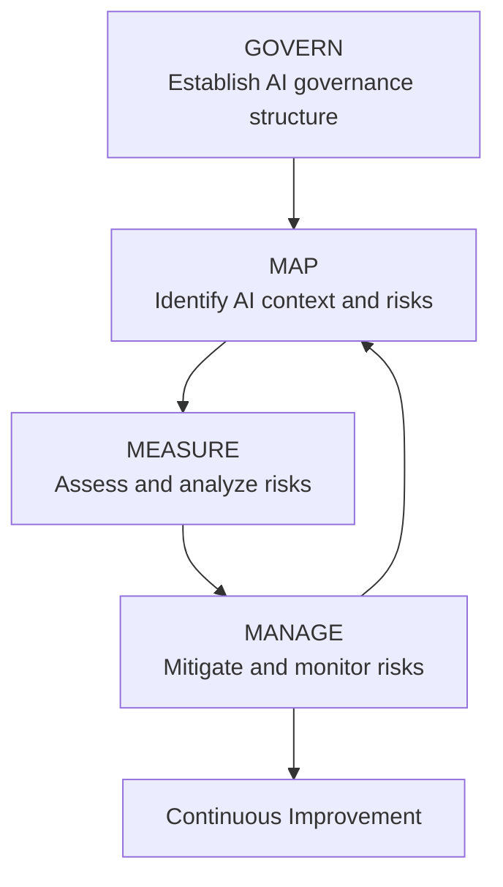
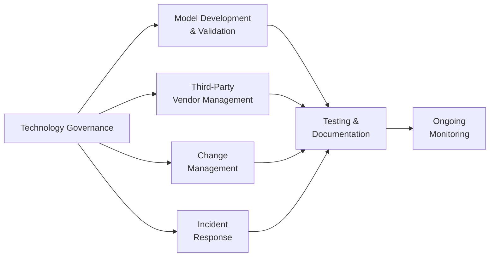
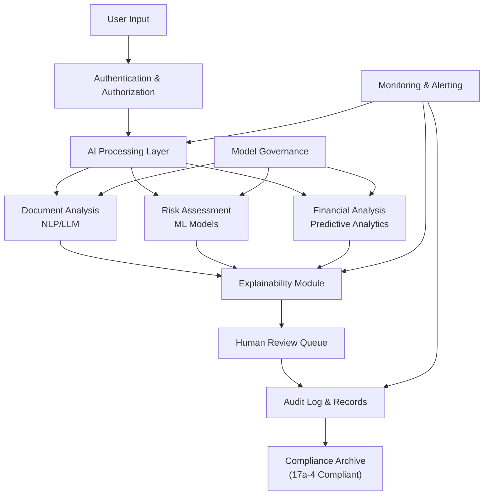

# AI/ML Regulatory Standards and Technical Requirements for Financial Services

**Document Metadata**
- **Title**: AI/ML Regulatory Standards and Technical Requirements for Financial Services
- **Date**: 2025-11-18
- **Sprint**: 05 - M&A Due Diligence Research Acceleration
- **Task**: 01 - Technical & Regulatory Landscape
- **Author**: technical-researcher skill agent

## Executive Summary

The regulatory landscape for AI/ML in financial services is rapidly evolving, with FINRA, SEC, CFTC, and NIST establishing comprehensive frameworks for responsible AI deployment. While no AI-specific regulations exist as of 2024-2025, financial institutions must apply existing supervisory, recordkeeping, data privacy, and market conduct rules to AI systems. The NIST AI Risk Management Framework has emerged as the de facto standard, with financial regulators explicitly referencing it in guidance materials. Organizations deploying AI for M&A due diligence face heightened scrutiny across recordkeeping (FINRA Rule 3110), customer information protection, risk management, and compliance with Reg BI.

## Key Findings

- **No AI-Specific Regulations**: Financial regulators have not issued new AI-specific regulations; existing frameworks apply to AI systems [FINRA, 2024]
- **NIST Framework Adoption**: Most US financial institutions align AI governance with NIST AI Risk Management Framework [US Treasury, 2024]
- **Technology Governance Mandate**: FINRA Rule 3110 requires member firms to establish technology governance policies addressing AI use [FINRA, 2024]
- **Comprehensive Risk Coverage**: AI use implicates virtually every regulatory obligation area for broker-dealers [FINRA, 2024]
- **Generative AI Profile Released**: NIST released specialized guidance for generative AI risks in July 2024 [NIST, 2024]

## 1. Current Regulatory Framework (2024-2025)

### 1.1 FINRA Regulatory Guidance

On June 27, 2024, FINRA issued Regulatory Notice 24-09, reminding member firms of their regulatory obligations concerning AI usage [FINRA, 2024]. The notice emphasizes that FINRA Rule 3110 requires member firms to establish and maintain a system of supervisory control policies and procedures that address technology governance.

**Key Regulatory Risks Identified by FINRA**:

| Risk Area | Description | Applicable Rules |
|-----------|-------------|------------------|
| **Recordkeeping** | Electronic records preservation and production | Rule 4511, SEA Rule 17a-4 |
| **Customer Information Protection** | Safeguarding customer data and PII | Reg S-P, Reg S-ID |
| **Risk Management** | Technology governance and oversight | Rule 3110 |
| **Reg BI Compliance** | Best interest standard for recommendations | SEC Reg BI |
| **Communications** | Content standards for AI-generated materials | Rules 2210, 2211, 2214 |
| **Suitability** | Investment recommendations appropriateness | Rule 2111 |

The notice explicitly states: "The use of AI could implicate virtually every area of a member firm's regulatory obligations" [FINRA, 2024].

### 1.2 SEC and CFTC Positions

The SEC and CFTC have taken a measured approach to AI regulation, emphasizing responsible use within existing regulatory frameworks [Sidley Austin, 2025].

**CFTC AI Advisory (December 2024)**:

On December 5, 2024, the CFTC released a nonbinding staff advisory addressing AI use by CFTC-regulated entities in derivatives markets, describing it as a "measured first step" toward AI-specific guidance [Sidley Austin, 2025].

**SEC Approach**:

The SEC has not issued AI-specific regulations but has emphasized that existing guidance applies to AI-powered systems. Financial institutions must ensure:
- Compliance with disclosure requirements
- Adherence to fiduciary duties
- Proper supervision and controls
- Accurate recordkeeping and audit trails

### 1.3 FINRA Annual Regulatory Oversight Report (January 2025)

FINRA's 2025 Annual Regulatory Oversight Report continues the agency's focus on AI governance and third-party risk management [FINRA, 2025]. Key priorities include:

- **Third-Party AI Vendor Management**: Enhanced due diligence on AI service providers
- **Model Risk Management**: Validation and ongoing monitoring of AI models
- **Explainability Requirements**: Understanding and documenting AI decision-making processes
- **Bias Detection and Mitigation**: Ensuring fair outcomes across customer segments

## 2. NIST AI Risk Management Framework

### 2.1 Framework Overview

On January 26, 2023, NIST released the AI Risk Management Framework (AI RMF 1.0), which has become the foundational reference for financial services AI governance [NIST, 2023]. The framework consists of four core functions:

**Four Core Functions**:

1. **GOVERN**: Cultivate organizational culture and structures for responsible AI development and use
2. **MAP**: Establish context to frame risks related to AI systems
3. **MEASURE**: Employ methodologies and metrics to analyze and assess AI risks
4. **MANAGE**: Allocate resources to prioritize and respond to AI risks

### 2.2 Generative AI Profile (July 2024)

On July 26, 2024, NIST released NIST-AI-600-1, "Artificial Intelligence Risk Management Framework: Generative Artificial Intelligence Profile" [NIST, 2024]. This profile addresses unique risks posed by generative AI systems:

**Unique Generative AI Risks**:

- **Confabulation/Hallucination**: Generation of false or misleading information
- **Data Privacy Leakage**: Inadvertent exposure of training data or sensitive information
- **Harmful Bias Amplification**: Reinforcement of societal biases at scale
- **Dangerous or Violent Content**: Generation of content that could cause harm
- **Information Integrity**: Erosion of trust in authentic content
- **Intellectual Property Concerns**: Use of copyrighted material in training data

**Recommended Actions for Generative AI Risk Management**:

| Risk Category | Mitigation Actions |
|--------------|-------------------|
| **Confabulation** | Implement fact-checking mechanisms, source citations, confidence scores |
| **Data Privacy** | Data minimization, differential privacy, secure training environments |
| **Bias** | Diverse training datasets, bias testing, fairness metrics monitoring |
| **Content Safety** | Content filters, human oversight, usage policies |
| **Information Integrity** | Provenance tracking, watermarking, disclosure of AI generation |
| **IP Protection** | Training data audits, licensing compliance, attribution mechanisms |

### 2.3 Industry Adoption

According to the US Treasury Department's post-2024 RFI Report on AI in Financial Services, most interviewed financial institution officials stated they aligned their use of AI by adhering to NIST's AI Risk Management recommendations [Debevoise & Plimpton, 2025].

**Key Adoption Drivers**:

1. **Regulatory Alignment**: FINRA, SEC, and NASAA explicitly reference NIST framework in guidance
2. **Risk-Based Approach**: Framework supports tailored risk management based on use case
3. **International Recognition**: NIST framework harmonizes with international AI standards efforts
4. **Vendor Expectations**: Major AI vendors increasingly demonstrate NIST framework compliance

## 3. Technology Governance Requirements

### 3.1 FINRA Rule 3110: Supervision

FINRA Rule 3110 establishes the supervisory framework that applies to all technology, including AI systems [FINRA, 2024]. Member firms must:

**Supervisory Control System Requirements**:

- Establish written supervisory procedures (WSPs) addressing technology governance
- Designate supervisors with appropriate authority and competence
- Conduct periodic testing and review of supervisory procedures
- Document supervisory activities and maintain records
- Investigate and resolve red flags or exceptions

**AI-Specific Supervisory Considerations**:

### 3.2 Model Risk Management (MRM)

While AI-specific MRM guidance is still evolving, financial institutions apply traditional model risk management frameworks to AI/ML systems, drawing from:

- **SR 11-7 (Federal Reserve)**: Guidance on Model Risk Management
- **OCC Bulletin 2011-12**: Supervisory Guidance on Model Risk Management
- **FINRA expectations**: Consistent with federal banking agency MRM principles

**MRM Framework Applied to AI/ML**:

| MRM Component | AI/ML Application |
|--------------|------------------|
| **Model Development** | Documentation of data sources, feature engineering, algorithm selection, hyperparameter tuning |
| **Model Validation** | Independent review of model logic, testing on holdout data, back-testing, sensitivity analysis |
| **Model Governance** | Ownership assignment, approval workflows, use case documentation, limitation statements |
| **Ongoing Monitoring** | Performance tracking, drift detection, periodic recalibration, incident logging |
| **Audit Trail** | Version control, decision logs, retraining records, exception documentation |

### 3.3 Explainability and Transparency

Regulatory expectations emphasize the need for AI systems to be explainable, particularly when used for customer-facing decisions or regulatory reporting [GAO, 2025].

**Explainability Requirements**:

1. **Decision Documentation**: Record rationale for AI-generated recommendations or decisions
2. **Feature Attribution**: Identify which inputs most influenced outputs
3. **Model Cards**: Provide standardized documentation of model purpose, performance, limitations
4. **Human Oversight**: Ensure qualified personnel can review and override AI decisions
5. **Customer Disclosure**: Inform customers when AI is used in decision-making processes

## 4. Application to M&A Due Diligence Platforms

### 4.1 Regulatory Compliance Considerations

An AI-powered M&A due diligence platform must address multiple regulatory dimensions:

**Recordkeeping Compliance**:
- All AI-generated analyses, recommendations, and source documents must be preserved in compliance with SEA Rule 17a-4
- Audit trails documenting AI processing steps, data sources, and confidence levels
- Retention periods: Minimum 6 years (broker-dealers), with first 2 years readily accessible

**Customer Information Protection**:
- Encryption of sensitive deal information and client data
- Access controls and authentication mechanisms
- Data minimization principles applied to AI training and inference
- Breach notification procedures

**Reg BI Compliance** (if providing investment recommendations):
- AI recommendations must serve client's best interest
- Disclosure of conflicts of interest related to AI vendor relationships
- Suitability analysis incorporating AI-identified risk factors
- Documentation of basis for AI-assisted recommendations

### 4.2 NIST Framework Application

Applying the NIST AI RMF to an M&A due diligence platform:

**GOVERN Phase**:
- Establish AI ethics and governance committee
- Define acceptable use cases for AI in due diligence workflows
- Assign accountability for AI system performance and compliance
- Create incident response plan for AI failures or inaccuracies

**MAP Phase**:
- Document AI use cases: document review, risk identification, financial analysis, etc.
- Identify stakeholders: deal teams, compliance, legal, clients
- Map regulatory obligations to AI functions
- Catalog data sources and sensitivity classifications

**MEASURE Phase**:
- Define performance metrics: accuracy, recall, precision, F1 score for entity extraction
- Establish bias testing protocols across deal types and industries
- Implement hallucination detection mechanisms
- Monitor for data drift and model degradation

**MANAGE Phase**:
- Deploy human-in-the-loop validation for high-stakes findings
- Implement content filters and guardrails to prevent hallucinations
- Establish retraining schedules based on performance monitoring
- Maintain vendor oversight program for third-party AI components

### 4.3 Third-Party AI Vendor Due Diligence

When relying on third-party AI vendors (e.g., LLM providers, NLP platforms), financial institutions must conduct thorough due diligence [FINRA, 2025]:

**Vendor Assessment Criteria**:

| Assessment Area | Key Questions |
|----------------|--------------|
| **Technical Capabilities** | What is the model architecture? What are performance benchmarks? How is the model trained and validated? |
| **Data Governance** | Where is training data sourced? How is data privacy protected? Is customer data used for model improvement? |
| **Security** | What certifications does the vendor hold (SOC 2, ISO 27001)? How is data encrypted? What are incident response procedures? |
| **Compliance** | Does the vendor comply with financial services regulations? Are audit rights granted? How are regulatory changes addressed? |
| **Business Continuity** | What are SLAs and uptime guarantees? Are there backup providers or fallback mechanisms? What is the vendor's financial stability? |
| **Explainability** | Can the vendor explain how outputs are generated? Are confidence scores provided? Can decisions be audited? |

## 5. Emerging Trends and Future Outlook

### 5.1 Expected Regulatory Developments

**Near-Term (2025-2026)**:
- Potential AI-specific rulemaking from SEC and FINRA
- Enhanced guidance on explainability and bias testing
- Stricter third-party AI vendor oversight requirements
- Harmonization with EU AI Act for global financial institutions

**Medium-Term (2027-2030)**:
- Industry-specific AI certification programs
- Standardized AI audit protocols for financial services
- Real-time regulatory reporting of AI system performance
- Potential AI system registration requirements

### 5.2 International Regulatory Alignment

**EU AI Act (Effective August 2024)**:

The EU AI Act categorizes AI systems into risk levels: unacceptable risk, high risk, limited risk, and minimal risk [EU, 2024]. Financial services AI systems typically fall into "high risk" category, requiring:
- Conformity assessments before market deployment
- Fundamental rights impact assessments
- Human oversight mechanisms
- Transparency and information obligations
- Accuracy, robustness, and cybersecurity measures

**Cross-Border Implications**:

US financial institutions operating in EU markets or serving EU clients must comply with both NIST framework and EU AI Act requirements, necessitating:
- Dual governance frameworks
- Enhanced documentation and testing
- Additional compliance resources
- Potential architecture modifications for regional deployments

## 6. Technical Implementation Recommendations

### 6.1 Architecture for Regulatory Compliance

### 6.2 Compliance Controls Checklist

**Pre-Deployment**:
- [ ] Documented model development and validation
- [ ] Bias testing across representative deal types
- [ ] Security assessment and penetration testing
- [ ] Explainability mechanisms implemented
- [ ] Compliance review and legal approval
- [ ] Vendor due diligence completed (if applicable)

**Operational**:
- [ ] Continuous performance monitoring
- [ ] Regular bias and drift detection
- [ ] Incident response procedures tested
- [ ] Audit trails maintained per Rule 17a-4
- [ ] Quarterly compliance reviews
- [ ] Annual model validation

**Governance**:
- [ ] AI governance committee established
- [ ] Clear accountability assignments
- [ ] Written supervisory procedures updated
- [ ] Training program for AI users
- [ ] Client disclosure materials prepared
- [ ] Vendor contracts include audit rights and compliance obligations

## References

1. FINRA (2024). *Regulatory Notice 24-09: Artificial Intelligence in the Securities Industry*. Retrieved from https://www.finra.org/rules-guidance/notices/24-09

2. FINRA (2025). *2025 Annual Regulatory Oversight Report*. Retrieved from https://www.finra.org/sites/default/files/2025-01/2025-annual-regulatory-oversight-report.pdf

3. NIST (2023). *Artificial Intelligence Risk Management Framework (AI RMF 1.0)*. NIST AI 100-1. Retrieved from https://www.nist.gov/itl/ai-risk-management-framework

4. NIST (2024). *Artificial Intelligence Risk Management Framework: Generative Artificial Intelligence Profile*. NIST AI 600-1. Retrieved from https://www.nist.gov/publications

5. Sidley Austin LLP (2025). *Artificial Intelligence: U.S. Securities and Commodities Guidelines for Responsible Use*. Retrieved from https://www.sidley.com/en/insights/newsupdates/2025/02/artificial-intelligence-us-financial-regulator-guidelines-for-responsible-use

6. Debevoise & Plimpton LLP (2025). *Treasury's Post-2024 RFI Report on AI in Financial Services – Uses, Opportunities, and Risks*. Retrieved from https://www.debevoise.com/insights/publications/2025/01/treasurys-post-2024-rfi-report-on-ai-in-financial

7. US Government Accountability Office (GAO) (2025). *Artificial Intelligence: Use and Oversight in Financial Services*. GAO-25-107197. Retrieved from https://www.gao.gov/assets/gao-25-107197.pdf

8. European Union (2024). *Regulation on Artificial Intelligence (AI Act)*. Official Journal of the European Union.

9. Smarsh (2024). *AI Governance Expectations Are Rising Even Without Rules*. Retrieved from https://www.smarsh.com/blog/thought-leadership/ai-governance-expectations-are-rising-even-without-rules
