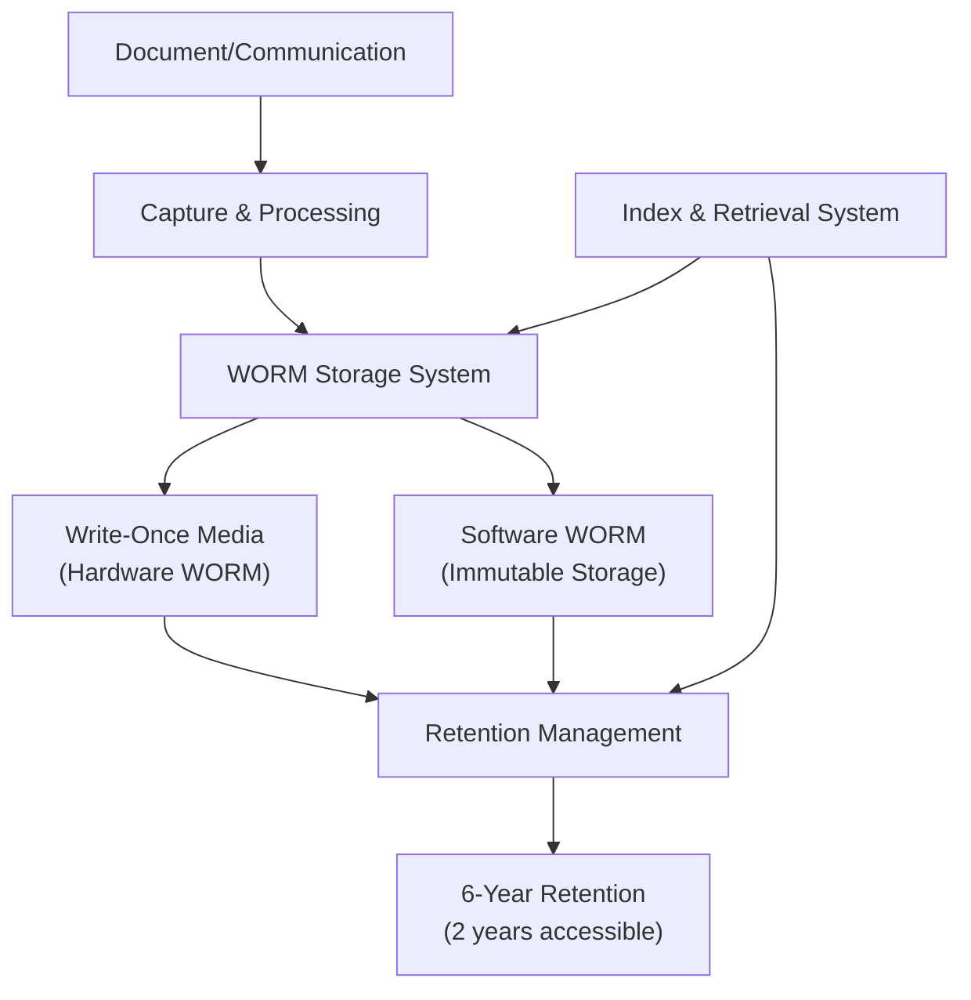
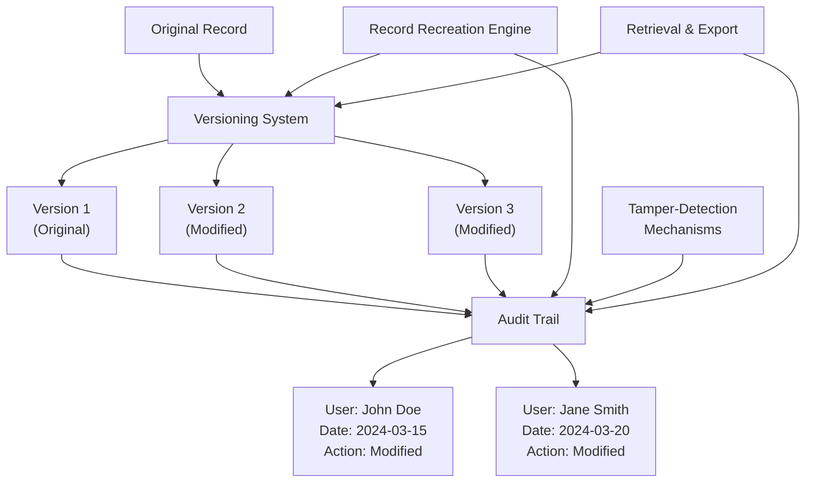
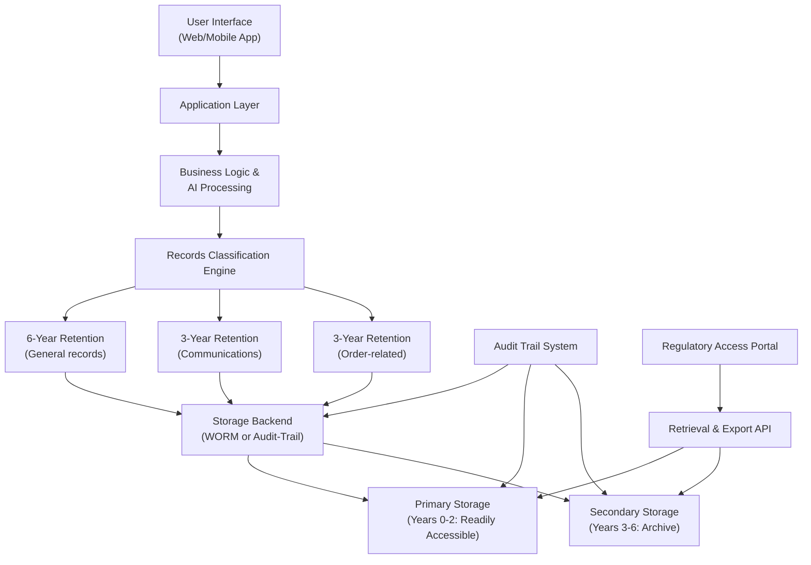
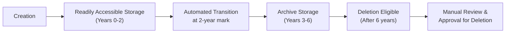

# SEC Rule 17a-4 Electronic Recordkeeping and Compliance Requirements for AI Due Diligence Systems

**Document Metadata**
- **Title**: SEC Rule 17a-4 Electronic Recordkeeping and Compliance Requirements for AI Due Diligence Systems
- **Date**: 2025-11-18
- **Sprint**: 05 - M&A Due Diligence Research Acceleration
- **Task**: 01 - Technical & Regulatory Landscape
- **Author**: technical-researcher skill agent

## Executive Summary

SEC Rule 17a-4 establishes comprehensive electronic recordkeeping requirements for broker-dealers, with significant amendments effective May 3, 2023. The rule now offers firms two options for electronic storage: traditional WORM (Write Once, Read Many) format or a new audit-trail alternative. For AI-powered due diligence platforms, compliance requires not only secure, tamper-proof storage but also rigorous due diligence on recordkeeping service providers, particularly regarding cybersecurity capabilities. The SEC's 2024 enforcement actions demonstrate serious consequences for non-compliance, with over $600 million in penalties assessed and $2 billion in fines since late 2021 for off-channel communications and recordkeeping failures.

## Key Findings

- **Dual Storage Options**: Firms may use WORM format OR audit-trail alternative for electronic records [SEC, 2023]
- **Audit-Trail Requirements**: New option requires recreation capability for modified/deleted records [SEC, 2023]
- **Third-Party Due Diligence Mandate**: Firms must assess recordkeeping providers' cybersecurity capabilities [FINRA, 2023]
- **Retention Periods**: 6 years minimum, first 2 years readily accessible [SEC Rule 17a-4(b)]
- **Massive Enforcement**: $2+ billion in penalties since 2021 for recordkeeping violations [SEC, 2024]
- **Executive Officer Alternative**: Firms can have executive provide undertaking instead of third-party [SEC, 2023]

## 1. SEC Rule 17a-4 Overview and 2022 Amendments

### 1.1 Rule Purpose and Scope

SEC Rule 17a-4 under the Securities Exchange Act of 1934 prescribes minimum requirements for the retention and preservation of specified records by broker-dealers registered with the SEC [SEC, 2023]. The rule addresses:

- Types of records that must be retained
- Duration of retention periods
- Format and accessibility requirements
- Third-party recordkeeping arrangements
- Procedures for record production to regulators

### 1.2 October 2022 Amendments

On October 12, 2022, the SEC amended Rule 17a-4 to modernize electronic recordkeeping requirements [SEC, 2022]. Key changes included:

| Amendment Area | Previous Requirement | New Requirement (Effective May 3, 2023) |
|---------------|---------------------|----------------------------------------|
| **Storage Format** | WORM format mandatory | WORM format OR audit-trail alternative |
| **Third-Party Undertaking** | Only third-party option | Third-party OR executive officer undertaking |
| **Technology Neutrality** | Format-specific language | Technology-neutral language |
| **Cybersecurity** | Not explicitly addressed | Due diligence on cyber capabilities required |

**Effective Dates**:
- Final rule adopted: October 12, 2022
- Effective date: January 3, 2023
- Compliance date: May 3, 2023

## 2. Electronic Storage Requirements

### 2.1 Option 1: WORM Format (Traditional)

Prior to the 2022 amendments, Rule 17a-4 required broker-dealers to maintain electronic records exclusively in a non-rewriteable, non-erasable format (WORM) [SEC, 2023]. This option remains available for firms that prefer it.

**WORM Format Characteristics**:

- **Immutability**: Once written, records cannot be altered or deleted
- **Hardware or Software WORM**: Can be achieved through hardware (e.g., write-once optical media) or software controls
- **Verification**: System must verify that records cannot be overwritten or erased
- **Index**: Records must be indexed and preserved for required retention period

**Technical Implementation**:



**Advantages**:
- Proven compliance approach with regulatory acceptance
- Clear immutability guarantees
- Simplified audit and verification

**Disadvantages**:
- Higher storage costs for long retention periods
- Limited flexibility for corrections or updates
- Potential technology lock-in with vendors

### 2.2 Option 2: Audit-Trail Alternative (New)

The 2022 amendments introduced an audit-trail alternative to the WORM requirement [SEC, 2023]. This option provides greater flexibility while maintaining record integrity through comprehensive audit capabilities.

**Audit-Trail Alternative Requirements**:

The audit-trail alternative requires that a broker-dealer use an electronic recordkeeping system that:

1. **Preserves Original Records**: Maintains and preserves electronic records in a manner that permits recreation of an original record if it is modified or deleted
2. **Audit Trail Capabilities**: Generates a complete audit trail showing:
   - All changes made to records (including modifications and deletions)
   - Identity of the person making the change
   - Date and time of each change
   - Previous versions of the record
3. **Tamper Resistance**: Prevents unauthorized alteration of the audit trail itself
4. **Accessibility**: Permits download and transfer of records and audit trails

**Technical Architecture**:



**Implementation Considerations**:

| Requirement | Technical Approach |
|------------|-------------------|
| **Version Control** | Git-like versioning, blockchain-based ledgers, immutable append-only logs |
| **Change Tracking** | Timestamped change logs with cryptographic hashes |
| **User Attribution** | Integration with authentication systems (SSO, MFA) |
| **Tamper Prevention** | Cryptographic signatures, hash chains, separate audit storage |
| **Recreation Capability** | Delta compression, full snapshot storage, revert functions |
| **Accessibility** | REST APIs, bulk export tools, format conversion utilities |

**Advantages**:
- Greater operational flexibility for legitimate corrections
- Lower storage costs (incremental rather than full duplication)
- Alignment with modern software development practices
- Easier integration with cloud-native architectures

**Disadvantages**:
- More complex implementation and testing requirements
- Greater risk of misconfiguration leading to non-compliance
- Requires ongoing validation of audit trail integrity

## 3. Record Retention Periods and Accessibility

### 3.1 Retention Periods by Record Type

Rule 17a-4 specifies different retention periods for different categories of records:

| Record Type | Rule Citation | Retention Period | Accessibility Requirement |
|------------|--------------|------------------|--------------------------|
| **Blotters and ledgers** | 17a-4(b)(1) | 6 years | First 2 years: readily accessible |
| **General ledger, securities records** | 17a-4(b)(2) | 6 years | First 2 years: readily accessible |
| **Checkbooks, statements, cancelled checks** | 17a-4(b)(3) | 6 years | First 2 years: readily accessible |
| **Trial balances, computations** | 17a-4(b)(4) | 6 years | First 2 years: readily accessible |
| **Customer account records** | 17a-4(b)(5) | 6 years after account closure | First 2 years: readily accessible |
| **Confirmations, purchase/sale documents** | 17a-4(b)(6) | 3 years | First 2 years: readily accessible |
| **Order tickets** | 17a-4(b)(7) | 3 years | First 2 years: readily accessible |
| **Written communications** | 17a-4(b)(4) | 3 years | Not specified |

### 3.2 "Readily Accessible" Definition

**Readily Accessible** means records must be available for examination by SEC and FINRA staff within a reasonable time frame, typically interpreted as:

- **Electronic records**: Accessible within minutes to hours
- **Physical location**: No requirement for on-site storage; cloud and off-site facilities acceptable
- **Retrieval capability**: Indexed and searchable
- **Format**: Readable and printable without special software (or software provided to regulators)

### 3.3 Application to AI Due Diligence Platforms

For an AI-powered M&A due diligence platform used by broker-dealers, the following records must be retained:

**Platform-Generated Records** (6-year retention):
- AI-generated analysis reports and recommendations
- Risk assessments and scoring outputs
- Data extraction results from reviewed documents
- Model performance logs and validation results
- User interaction logs showing queries and results

**Communications Records** (3-year retention):
- Platform messages between users
- Comments and annotations on documents
- Emails sent through or about platform findings
- Collaboration threads and decision rationales

**Source Documents**:
- Uploaded deal documents and data room contents (retention depends on document type)
- Third-party data sources used for analysis
- Training data for AI models (if customer-specific)

## 4. Third-Party Recordkeeping Services

### 4.1 Due Diligence Requirements

The amended Rule 17a-4 emphasizes that firms must conduct thorough due diligence on recordkeeping service providers [FINRA, 2023]. The SEC's guidance states:

> "Firms should ensure that their policies and procedures provide for the due diligence analysis of the recordkeeping service provider to determine whether the recordkeeping service is capable of performing these functions, particularly in light of the risks of cyberattacks."

**Due Diligence Checklist**:

| Assessment Area | Key Questions | Evidence to Review |
|----------------|--------------|-------------------|
| **Technical Capabilities** | Does the vendor support WORM or audit-trail format?<br/>Can the system recreate modified records?<br/>What are SLAs for retrieval? | Architecture documentation<br/>Technical specifications<br/>SLA agreements |
| **Cybersecurity** | What security certifications does vendor hold?<br/>How is data encrypted at rest and in transit?<br/>What are incident response procedures? | SOC 2 Type II reports<br/>ISO 27001 certification<br/>Penetration test results |
| **Business Continuity** | What are backup and disaster recovery capabilities?<br/>What is vendor's financial stability?<br/>Are there data escrow arrangements? | BCP documentation<br/>Financial statements<br/>Escrow agreements |
| **Compliance** | Does vendor understand 17a-4 requirements?<br/>Will vendor provide required undertakings?<br/>Does vendor grant audit rights? | Compliance attestations<br/>Contract terms<br/>Audit rights provisions |
| **Operational Track Record** | How long has vendor provided recordkeeping services?<br/>Have there been compliance failures?<br/>What is customer retention rate? | Client references<br/>Regulatory history<br/>Industry reputation |

### 4.2 Third-Party Undertaking Requirements

Rule 17a-4(i) requires a written undertaking from either a third-party recordkeeping provider OR an executive officer of the broker-dealer [SEC, 2023].

**Third-Party Undertaking Must Include**:

1. **Examination Rights**: Agreement to permit examination of the broker-dealer's records by SEC representatives and FINRA at any time or from time to time
2. **Prompt Furnishing**: Agreement to promptly furnish copies of or access to any records requested
3. **Contact Information**: Designated contacts for regulatory requests

**Executive Officer Alternative**:

Under the amendments, a broker-dealer may elect to have an executive officer provide the undertaking instead of a third party. The executive officer must:
- Hold a senior position (e.g., CEO, CFO, COO, Chief Compliance Officer)
- Have authority over the recordkeeping system
- Acknowledge personal responsibility for compliance

**Practical Implications**:

Most firms using third-party cloud providers or SaaS platforms for AI due diligence will require the vendor to provide the undertaking. Standard vendor agreements often include 17a-4 undertaking addendums.

### 4.3 Vendor Responsibility vs. Broker-Dealer Responsibility

**Critical Principle**: Outsourcing a recordkeeping function to a third party does NOT relieve the broker-dealer of its ultimate responsibility for compliance with applicable FINRA and SEC rules [FINRA, 2023].

**Broker-Dealer Remains Responsible For**:

- Selecting a qualified vendor through due diligence
- Monitoring vendor performance and compliance
- Ensuring records are actually preserved per requirements
- Responding to regulatory requests and examinations
- Maintaining evidence of vendor oversight

**Vendor Responsibilities**:

- Operating systems in compliance with 17a-4 requirements
- Providing undertakings and audit access
- Maintaining security and business continuity
- Notifying broker-dealer of system changes or incidents
- Cooperating with regulatory examinations

## 5. 2024 Enforcement Landscape

### 5.1 Off-Channel Communications Sweep

Since late 2021, the SEC has imposed over $2 billion in fines across more than 100 firms for recordkeeping failures related to "off-channel communications" [SEC, 2024]. These violations involved:

- Use of personal messaging apps (WhatsApp, Signal, iMessage) for business communications
- Failure to retain business-related text messages
- Inadequate supervision of communication channels
- Lack of policies prohibiting unapproved communication methods

**Fiscal Year 2024 Penalties**: Over $600 million across more than 70 financial institutions [SEC, 2024].

### 5.2 Key Enforcement Themes

**Widespread Systemic Failures**:

Enforcement actions have revealed that recordkeeping failures were not isolated incidents but widespread practices involving senior executives and supervisory personnel.

**Personal Device Use**:

Many violations involved business communications on personal devices that were not captured by firm recordkeeping systems.

**Supervision Breakdowns**:

Firms failed to implement adequate controls to detect and prevent off-channel communications.

### 5.3 Implications for AI Due Diligence Platforms

**Design Considerations to Prevent Violations**:

1. **Platform-Embedded Communications**: Build collaboration features directly into the platform to reduce use of external messaging tools
2. **Capture All Interactions**: Log and retain all user activities, queries, comments, and decisions within the platform
3. **Integration Restrictions**: Limit or control integration with external communication tools
4. **User Training**: Educate users on recordkeeping requirements and prohibitions on off-platform communications
5. **Monitoring and Alerts**: Implement automated detection of potential off-channel activities (e.g., mentions of external messaging in platform discussions)

## 6. Technical Implementation for AI Due Diligence Platforms

### 6.1 Architecture for Rule 17a-4 Compliance



### 6.2 Key Technical Components

**1. Records Classification Engine**

Automatically classify generated content based on record type:

```python
# Pseudo-code example
def classify_record(content, metadata):
    if metadata['type'] == 'communication':
        return {'retention_years': 3, 'category': '17a-4(b)(4)'}
    elif metadata['type'] == 'analysis_report':
        return {'retention_years': 6, 'category': '17a-4(b)(1)'}
    elif metadata['type'] == 'order_ticket':
        return {'retention_years': 3, 'category': '17a-4(b)(7)'}
    # ... additional classifications
```

**2. Audit Trail System (for audit-trail alternative)**

Capture and protect change history:

| Audit Field | Description | Example Value |
|------------|-------------|---------------|
| `record_id` | Unique identifier for the record | `dd-2024-001-report-v3` |
| `version_number` | Sequential version | `3` |
| `user_id` | Who made the change | `jdoe@firm.com` |
| `timestamp` | When change occurred | `2024-03-15T14:32:18Z` |
| `change_type` | Type of modification | `EDIT`, `DELETE`, `RESTORE` |
| `previous_hash` | Hash of prior version | `sha256:a1b2c3...` |
| `current_hash` | Hash of current version | `sha256:d4e5f6...` |
| `change_description` | User-provided reason | `Corrected financial figure per source doc` |

**3. Retention and Lifecycle Management**

Automate transitions between storage tiers:



**4. Retrieval and Regulatory Access**

Provide mechanisms for rapid retrieval:

- **Search and Filter**: By date range, record type, user, deal ID, etc.
- **Bulk Export**: CSV, PDF, or native format downloads
- **Regulatory Portal**: Separate interface for SEC/FINRA staff with read-only access
- **Audit Trail Export**: Downloadable logs showing all record modifications

### 6.3 Cloud Provider Selection Criteria

When selecting a cloud storage provider for 17a-4 compliant recordkeeping:

| Criterion | Requirements | Example Providers/Solutions |
|----------|--------------|---------------------------|
| **WORM Support** | Immutable storage options, object lock features | AWS S3 Object Lock, Azure Immutable Blob Storage, Google Cloud Storage Retention Policies |
| **Audit Trail** | Versioning, change logs, access logs | AWS S3 Versioning + CloudTrail, Azure Blob Versioning + Monitor |
| **Certifications** | SOC 2 Type II, ISO 27001 | Major cloud providers hold these certifications |
| **Data Residency** | US data centers (or region-specific for international firms) | All major clouds offer regional control |
| **Encryption** | At-rest and in-transit encryption | Standard feature in major clouds |
| **Access Controls** | Fine-grained IAM, MFA, SSO integration | AWS IAM, Azure AD, Google Cloud IAM |
| **SLAs** | High availability (99.9%+), retrieval time guarantees | Tier-dependent SLAs available |
| **Cost** | Storage + retrieval costs over 6+ years | Lifecycle policies to optimize costs |

**Specialized Compliance Solutions**:

Some vendors offer turnkey 17a-4 compliant storage solutions:
- **Global Relay**: Archive and recordkeeping for financial services
- **Smarsh**: Communications compliance and archiving
- **Microsoft 365 Compliance**: Records management with 17a-4 configuration
- **Archive360**: Cloud-native archive platform with regulatory compliance features

## 7. Testing and Validation

### 7.1 Pre-Deployment Testing

Before deploying an AI due diligence platform for regulated broker-dealer use, conduct comprehensive testing:

**Functional Testing**:
- [ ] Verify all record types are captured and classified correctly
- [ ] Test WORM immutability or audit-trail recreation capability
- [ ] Validate retention period calculations and automated transitions
- [ ] Confirm retrieval functionality across all record types and date ranges
- [ ] Test regulatory access portal with simulated examiner requests

**Security Testing**:
- [ ] Penetration testing to identify vulnerabilities
- [ ] Encryption validation (at-rest and in-transit)
- [ ] Access control testing (ensure proper segregation)
- [ ] Tamper-resistance testing (attempt unauthorized modifications)

**Performance Testing**:
- [ ] Load testing for concurrent users and high-volume record creation
- [ ] Retrieval speed testing for various query types
- [ ] Storage scalability testing over simulated multi-year periods

**Compliance Testing**:
- [ ] Legal review of system capabilities vs. 17a-4 requirements
- [ ] Third-party audit or attestation (e.g., by accounting firm)
- [ ] Documentation review (policies, procedures, user guides)

### 7.2 Ongoing Validation

**Annual Compliance Review**:
- Review of system performance and any incidents
- Sample testing of record retrieval and integrity
- Vendor performance assessment (if third-party storage used)
- Update to policies and procedures as needed

**Incident Response Drills**:
- Simulate regulatory examination requests
- Test disaster recovery and business continuity procedures
- Validate backup restoration and data integrity

## 8. Practical Recommendations for AI Due Diligence Platform Providers

### 8.1 For SaaS Platform Vendors

**Built-in Compliance Features**:
- Offer 17a-4 compliant storage as a standard or premium feature
- Provide clear documentation of WORM or audit-trail implementation
- Include retention policy configuration tools
- Build regulatory access portals into the platform

**Vendor Undertaking**:
- Prepare standard 17a-4(i) undertaking agreement
- Designate compliance contacts for regulatory requests
- Maintain documentation demonstrating compliance capabilities

**Customer Enablement**:
- Provide compliance guides and best practices documentation
- Offer training on recordkeeping requirements
- Supply audit reports (SOC 2, penetration tests) to support customer due diligence

### 8.2 For Broker-Dealer Users

**Vendor Due Diligence**:
- Request SOC 2 Type II reports and compliance certifications
- Review vendor's 17a-4 documentation and undertaking
- Assess cybersecurity capabilities and incident history
- Evaluate business continuity and financial stability

**Policies and Procedures**:
- Update written supervisory procedures (WSPs) to address AI platform recordkeeping
- Define roles and responsibilities for platform oversight
- Establish procedures for responding to regulatory requests
- Implement training program for platform users

**Ongoing Monitoring**:
- Conduct periodic reviews of vendor performance
- Monitor platform usage for off-channel communication risks
- Maintain documentation of oversight activities
- Stay informed of regulatory developments and vendor updates

## References

1. SEC (2022). *Amendments to Electronic Recordkeeping Requirements for Broker-Dealers*. Release No. 34-96034. Retrieved from https://www.sec.gov/investment/amendments-electronic-recordkeeping-requirements-broker-dealers

2. SEC (2023). *Frequently Asked Questions Regarding Rule Amendments to Broker-Dealer, Security-Based Swap Dealer, and Major Security-Based Swap Participant Electronic Recordkeeping Requirements*. Retrieved from https://www.sec.gov/rules-regulations/staff-guidance/trading-markets-frequently-asked-questions/rule-amendments-broker

3. FINRA (2023). *Exchange Act Rule 17a-4 Amendments—Chart of Significant Changes*. Retrieved from https://www.finra.org/sites/default/files/2022-12/rule-17a-4-amendments.pdf

4. FINRA. *SEA Rule 17a-4 and Related Interpretations*. Retrieved from https://www.finra.org/rules-guidance/guidance/interpretations-financial-operational-rules/sea-rule-17a-4-and-related-interpretations

5. Luthor.ai (2024). *SEC Rule 17a-4: Recordkeeping Compliance for Broker-Dealers*. Retrieved from https://www.luthor.ai/blog-post/sec-rule-17a-4

6. Archive360 (2024). *SEC Rule 17a-4 Amended: WORM vs. Audit Trail Requirements*. Retrieved from https://www.archive360.com/blog/sec-rule-17a-4-amended-taking-the-worm-requirement-out-of-our-misery

7. Global Relay (2024). *SEC Rules 17a-4 and 17a-3 Explained*. Retrieved from https://www.globalrelay.com/resources/the-compliance-hub/rules-and-regulations/sec-rules-17a-4-and-17a-3-explained/

8. 17a-4.com. *SEC Rule 17a-4 & FINRA Rules & Regulations Summary*. Retrieved from https://www.17a-4.com/rules-and-regulations-sec-finra-doj-cftc/

9. Microsoft (2024). *Securities and Exchange Commission (SEC) Rule 17a-4, SEC Rule 18a-6, FINRA 4511, & CFTC 1.31*. Retrieved from https://learn.microsoft.com/en-us/compliance/regulatory/offering-sec-docs
