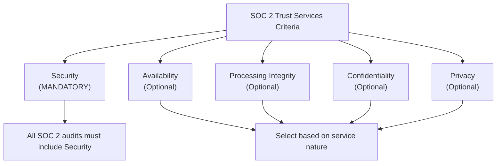
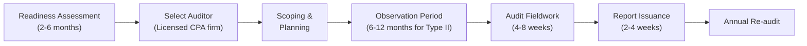
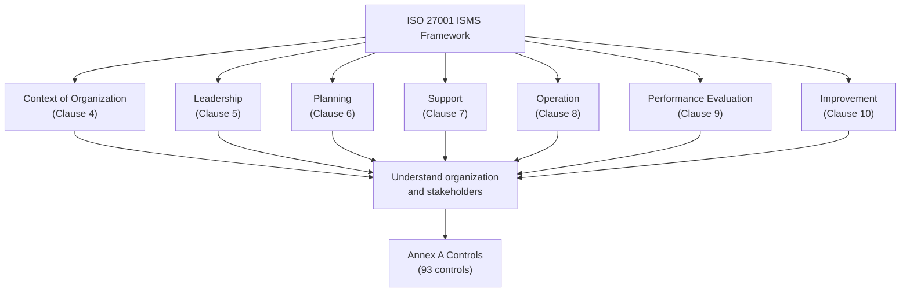
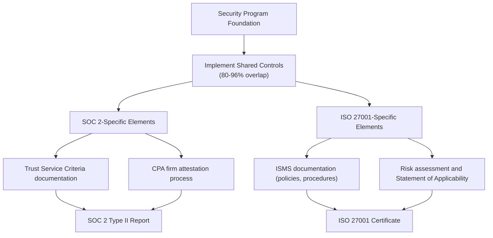
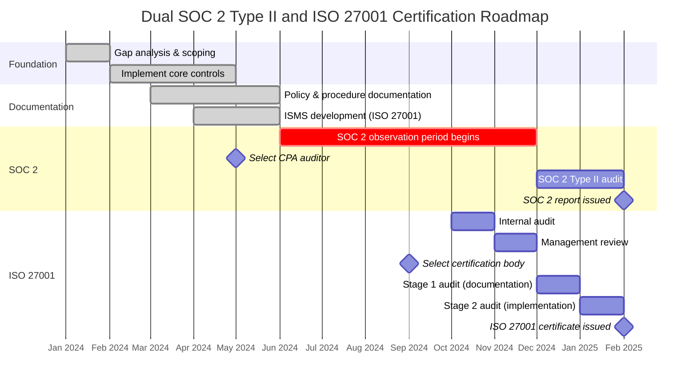

# SOC 2 Type II and ISO 27001 Certification: Requirements and Implementation for Financial Data Security

**Document Metadata**
- **Title**: SOC 2 Type II and ISO 27001 Certification Requirements and Implementation
- **Date**: 2025-11-18
- **Sprint**: 05 - M&A Due Diligence Research Acceleration
- **Task**: 01 - Technical & Regulatory Landscape
- **Author**: technical-researcher skill agent

## Executive Summary

SOC 2 Type II and ISO 27001 represent the gold standards for information security compliance in financial services. SOC 2 Type II, developed by the AICPA, is the preferred standard for US-based financial services firms, while ISO 27001 dominates internationally. Both frameworks share approximately 80-96% overlap in security controls, making dual certification feasible and increasingly common. For an AI-powered M&A due diligence platform handling sensitive financial data, achieving both certifications demonstrates robust security posture and opens access to both US and international markets. Certification costs range from $10-50K for ISO 27001 and $30-60K for SOC 2 Type II, with implementation timelines of 6-18 months.

## Key Findings

- **High Control Overlap**: SOC 2 and ISO 27001 share 80-96% of security controls [AICPA, Schellman, 2024]
- **Geographic Preferences**: SOC 2 dominant in US, ISO 27001 preferred internationally [DataGuard, 2024]
- **Financial Sector Requirement**: Both certifications highly valued in financial services and healthcare [Sprinto, 2024]
- **Certification Costs**: ISO 27001 $10-50K, SOC 2 Type II $30-60K average [Vanta, StrongDM, 2024]
- **Validity Periods**: ISO 27001 valid 3 years (with annual surveillance), SOC 2 typically annual [BARR Advisory, 2024]
- **Dual Certification Feasible**: Shared controls enable efficient pursuit of both standards [Schellman, 2024]

## 1. SOC 2 Overview

### 1.1 What is SOC 2?

SOC 2 (System and Organization Controls 2) is a voluntary compliance framework developed by the American Institute of Certified Public Accountants (AICPA) for service organizations that handle customer data [AICPA, 2024]. The framework focuses on controls relevant to security, availability, processing integrity, confidentiality, and privacy.

**SOC 2 Type I vs. Type II**:

| Aspect | SOC 2 Type I | SOC 2 Type II |
|--------|-------------|---------------|
| **Evaluation Period** | Point-in-time assessment | Operational effectiveness over time (typically 6-12 months) |
| **What's Tested** | Design of controls | Design AND effectiveness of controls |
| **Duration** | Snapshot on specific date | Minimum 6-month observation period |
| **Depth** | Less rigorous | More comprehensive and rigorous |
| **Market Value** | Limited acceptance | Industry standard for vendor assurance |
| **Cost** | $10-20K average | $30-60K average |

**For financial services applications, SOC 2 Type II is the expected standard** [Sprinto, 2024].

### 1.2 Trust Services Criteria (TSC)

SOC 2 is built on five Trust Services Criteria:

**1. Security (CC - Common Criteria - Mandatory)**

The Security criterion addresses whether the system is protected against unauthorized access (both physical and logical). All SOC 2 reports must include the Security criterion.

**Key Control Areas**:
- Access controls and authentication
- Logical and physical access security
- System operations and change management
- Risk mitigation and incident response
- Network and data security

**2. Availability (Optional)**

The Availability criterion addresses whether the system is available for operation and use as committed or agreed.

**Key Control Areas**:
- System monitoring and performance
- Backup and disaster recovery
- Incident handling and business continuity
- Capacity planning and scalability

**3. Processing Integrity (Optional)**

Processing Integrity addresses whether system processing is complete, valid, accurate, timely, and authorized.

**Key Control Areas**:
- Data input validation and processing controls
- Error detection and correction
- Transaction authorization and completeness
- Data quality monitoring

**4. Confidentiality (Optional)**

Confidentiality addresses whether information designated as confidential is protected as committed or agreed.

**Key Control Areas**:
- Data classification and handling
- Confidential data encryption
- Non-disclosure agreements
- Confidential data disposal

**5. Privacy (Optional)**

Privacy addresses whether personal information is collected, used, retained, disclosed, and disposed of in conformity with commitments in the entity's privacy notice and with criteria set forth in the AICPA's generally accepted privacy principles.

**Key Control Areas**:
- Privacy notice and consent management
- Data collection limitation and purpose specification
- Access, correction, and deletion rights
- Privacy incident response

### 1.3 SOC 2 Control Requirements

SOC 2 requires organizations to implement **70 to 150+ controls** depending on which Trust Service Categories are selected [Sprinto, 2024].

**Example Security Controls** (Common Criteria):

| Control ID | Control Objective | Implementation Example |
|-----------|------------------|------------------------|
| **CC6.1** | Logical and physical access controls restrict access | Multi-factor authentication, role-based access control (RBAC), office badge systems |
| **CC6.2** | Authentication mechanisms prevent unauthorized access | Password policies, SSO integration, biometric authentication |
| **CC6.3** | System access is removed in a timely manner | Automated deprovisioning upon termination, quarterly access reviews |
| **CC6.6** | Vulnerabilities are identified and remediated | Regular vulnerability scanning, patch management, penetration testing |
| **CC6.7** | Incident response plans are in place | Documented incident response procedures, incident logging, post-incident reviews |
| **CC7.2** | Detection mechanisms identify anomalies | SIEM (Security Information and Event Management), IDS/IPS, log monitoring |
| **CC8.1** | Changes to system components are authorized and tested | Change management process, dev/staging/prod environments, change approval board |

### 1.4 SOC 2 Audit Process

**Key Steps**:

1. **Readiness Assessment**: Gap analysis against TSC, remediation of deficiencies, documentation preparation
2. **Auditor Selection**: Must be a licensed CPA firm with SOC 2 experience
3. **Scoping**: Define systems, services, and TSC to be audited
4. **Observation Period**: Evidence collection over 6-12 months (Type II)
5. **Fieldwork**: Auditor testing of controls, interviews, evidence review
6. **Report**: Auditor's opinion on control design and operating effectiveness
7. **Ongoing**: Annual re-audit required to maintain current SOC 2 status

**Who Can Access SOC 2 Reports?**

SOC 2 reports are **confidential** and shared under NDA with:
- Current and prospective customers
- Business partners and vendors
- Investors and stakeholders
- Regulators (upon request)

SOC 2 reports are **not publicly disclosed** (unlike ISO 27001 certificates which can be published).

## 2. ISO 27001 Overview

### 2.1 What is ISO 27001?

ISO 27001 (formally ISO/IEC 27001) is an international standard published by the International Organization for Standardization (ISO) and the International Electrotechnical Commission (IEC) [ISO, 2022]. It specifies requirements for establishing, implementing, maintaining, and continually improving an Information Security Management System (ISMS).

**Current Version**: ISO/IEC 27001:2022 (updated from 2013 version)

### 2.2 ISMS Framework

ISO 27001 is built on the concept of an Information Security Management System (ISMS), which is a systematic approach to managing sensitive company information.

**ISMS Components**:

### 2.3 Annex A Controls

ISO 27001:2022 includes **93 controls** organized into 4 themes (updated from 14 domains in 2013 version):

| Theme | Number of Controls | Example Controls |
|-------|-------------------|------------------|
| **Organizational Controls** | 37 | Information security policies, asset management, supplier relationships |
| **People Controls** | 8 | Screening, terms and conditions of employment, awareness training |
| **Physical Controls** | 14 | Physical security perimeters, secure areas, equipment security |
| **Technological Controls** | 34 | Access control, cryptography, network security, secure development |

**Not all controls are mandatory**. Organizations perform a risk assessment to determine which controls are applicable based on their specific risks and context [ISO, 2022].

### 2.4 ISO 27001 Certification Process

```mermaid
graph LR
    A["Gap Analysis<br/>(1-3 months)"] --> B["ISMS Implementation<br/>(6-12 months)"]
    B --> C["Internal Audit"]
    C --> D["Management Review"]
    D --> E["Select Certification Body"]
    E --> F["Stage 1 Audit<br/>(Documentation review)"]
    F --> G["Stage 2 Audit<br/>(Implementation assessment)"]
    G --> H["Certificate Issued<br/>(3-year validity)"]
    H --> I["Annual Surveillance Audits<br/>(Years 1 & 2)"]
    I --> J["Recertification Audit<br/>(Year 3)"]
```

**Key Differences from SOC 2**:

| Aspect | SOC 2 | ISO 27001 |
|--------|-------|-----------|
| **Auditor** | Licensed CPA firm | Accredited certification body (e.g., BSI, SGS, TÜV) |
| **Validity** | Annual re-audit required | 3-year certificate with annual surveillance audits |
| **Public Disclosure** | Confidential (shared under NDA) | Certificate can be published; registry available |
| **Flexibility** | Prescriptive Trust Service Criteria | Risk-based control selection from Annex A |
| **Geographic Focus** | US-centric | International standard |

### 2.5 ISO 27001 Certificate

Upon successful audit, the certification body issues a certificate that includes:
- Organization name and address
- Scope of certification (e.g., "Cloud-based M&A due diligence platform")
- Certificate number
- Issue date and expiry date (3 years from issue)
- Certification body accreditation details

**Surveillance Audits**: Annual audits (typically years 1 and 2 of the 3-year cycle) to ensure ongoing compliance. These are less extensive than the initial certification audit but verify that the ISMS is maintained and improved.

## 3. SOC 2 vs. ISO 27001: Detailed Comparison

### 3.1 Control Overlap and Mapping

Multiple studies have analyzed the overlap between SOC 2 and ISO 27001:

- **AICPA Mapping**: Approximately 80% overlap between ISO 27001 and SOC 2 criteria [AICPA, 2024]
- **Independent Analysis**: One study suggests 96% shared security controls [Schellman, 2024]

**Example Control Mapping**:

| ISO 27001:2022 Control | SOC 2 TSC | Description |
|-----------------------|-----------|-------------|
| **A.5.1** Information security policy | CC1.2 | Documented security policies |
| **A.5.10** Acceptable use of information | CC6.1, CC6.2 | User access and authentication policies |
| **A.5.15** Access control | CC6.1, CC6.2, CC6.3 | Logical and physical access restrictions |
| **A.8.1** User endpoint devices | CC6.1, CC6.6 | Device security and management |
| **A.8.2** Privileged access rights | CC6.2 | Administrative access controls |
| **A.8.5** Secure authentication | CC6.2 | MFA, password policies, SSO |
| **A.8.9** Configuration management | CC7.2, CC8.1 | System configuration and change management |
| **A.8.16** Monitoring activities | CC7.2, CC7.3 | Log monitoring, SIEM, alerting |
| **A.8.23** Web filtering | CC6.6, CC6.7 | Network security and threat protection |
| **A.8.28** Secure coding | CC8.1 | Secure development lifecycle |

### 3.2 When to Choose Each Certification

**Choose SOC 2 Type II if**:
- Primary customers are US-based enterprises
- Operating in US financial services, healthcare, or SaaS industries
- Customers explicitly request SOC 2 reports
- Need to demonstrate operational effectiveness over time
- Selling to other service organizations that require vendor attestations

**Choose ISO 27001 if**:
- Targeting international markets, especially Europe, Asia, APAC
- Need publicly verifiable certification (e.g., for marketing)
- Operating in highly regulated industries globally
- Customers or regulators require ISO certification
- Prefer risk-based approach to control selection

**Choose BOTH if**:
- Serving both US and international customers
- Financial services or healthcare sectors with global operations
- Want competitive differentiation
- High-value contracts justify dual certification costs
- Organizational maturity and resources support dual compliance

### 3.3 Cost and Timeline Comparison

**ISO 27001**:

| Cost Component | Range |
|---------------|-------|
| **Consulting/Implementation** | $20,000 - $100,000+ |
| **Certification Audit** | $10,000 - $50,000 |
| **Annual Surveillance Audits** | $5,000 - $20,000 per year |
| **Ongoing Maintenance** | $10,000 - $50,000 per year (internal resources) |
| **Total First Year** | $40,000 - $200,000+ |

**Timeline**: 6-18 months from start to certificate issuance [DataGuard, Vanta, 2024]

**SOC 2 Type II**:

| Cost Component | Range |
|---------------|-------|
| **Readiness/Implementation** | $20,000 - $150,000+ |
| **Type II Audit** | $30,000 - $60,000 (can exceed $100K for complex orgs) |
| **Annual Re-audit** | $30,000 - $60,000+ per year |
| **Ongoing Maintenance** | $15,000 - $75,000 per year (internal resources) |
| **Total First Year** | $65,000 - $285,000+ |

**Timeline**: 8-18 months (including 6-12 month observation period for Type II) [Secureframe, 2024]

**Cost Factors**:
- Organization size and complexity
- Number of systems and locations in scope
- Current maturity of security program
- Internal vs. external implementation resources
- Auditor/certification body selected
- Number of TSC (SOC 2) or controls (ISO 27001) in scope

### 3.4 Pursuing Dual Certification

Given the 80-96% control overlap, many organizations pursue both certifications efficiently by:

**Unified Implementation Approach**:

**Efficiency Strategies**:

1. **Leverage Shared Evidence**: Use same policies, logs, test results for both audits
2. **Coordinate Audit Timing**: Schedule audits in sequence or parallel to reuse evidence
3. **Use GRC Platform**: Tools like Vanta, Drata, Sprinto automate evidence collection for both
4. **Train Unified Team**: Build one team with expertise in both frameworks
5. **Integrated Documentation**: Write policies that satisfy both frameworks

**Cost Savings**: Organizations report 20-40% cost reduction when pursuing both certifications simultaneously vs. sequentially [BARR Advisory, 2024].

## 4. Application to M&A Due Diligence Platform

### 4.1 Why Both Certifications Matter

For an AI-powered M&A due diligence platform:

**SOC 2 Type II is critical because**:
- Investment banks, private equity firms, and corporate development teams (primary customers) expect SOC 2
- Handling highly sensitive deal data (financial statements, strategic plans, IP) requires robust attestation
- US-based financial institutions have vendor risk management programs requiring SOC 2
- Demonstrates operational maturity over time (not just point-in-time)

**ISO 27001 is valuable because**:
- Cross-border M&A deals involve international parties requiring ISO certification
- European PE firms, banks, and corporations prefer or mandate ISO 27001
- Publicly verifiable certification strengthens brand trust
- GDPR compliance alignment (ISO 27701 builds on ISO 27001)

### 4.2 Recommended Scope Definition

**In-Scope Systems**:
- Web application (front-end and back-end)
- AI/ML processing infrastructure (LLM APIs, NLP pipelines)
- Data storage (databases, file storage, archives)
- Authentication and access control systems
- Monitoring and logging infrastructure
- Development and deployment pipelines (CI/CD)

**In-Scope Data**:
- Customer deal data (uploaded documents, financial models)
- User credentials and access logs
- AI-generated analyses and reports
- Audit trails and compliance records

**Out-of-Scope** (if applicable):
- Marketing website (separate from application)
- HR systems not integrated with product
- Office IT infrastructure (unless hosting product components)

### 4.3 Control Implementation Priorities

**Phase 1: Foundation (Months 1-3)**

Critical controls to implement first:

| Control Area | Actions |
|-------------|---------|
| **Access Control** | Implement SSO, MFA, RBAC; document access provisioning/deprovisioning procedures |
| **Encryption** | Enable encryption at-rest and in-transit; document key management |
| **Logging & Monitoring** | Deploy SIEM or log aggregation; configure alerts for security events |
| **Incident Response** | Document incident response plan; establish on-call rotation |
| **Policies** | Draft core policies: information security, acceptable use, data classification |

**Phase 2: Operational Controls (Months 4-6)**

| Control Area | Actions |
|-------------|---------|
| **Change Management** | Implement change approval process; separate dev/staging/prod environments |
| **Vulnerability Management** | Establish vulnerability scanning; define patching SLAs |
| **Backup & Recovery** | Automated backups; test restore procedures; document RTO/RPO |
| **Vendor Management** | Perform due diligence on subprocessors; maintain vendor inventory |
| **Business Continuity** | Document BCP/DR plan; conduct tabletop exercise |

**Phase 3: Advanced & Continuous Improvement (Months 7-12)**

| Control Area | Actions |
|-------------|---------|
| **Penetration Testing** | Annual third-party penetration test |
| **Security Awareness** | Quarterly security training; phishing simulations |
| **Risk Assessment** | Formal risk assessment process; maintain risk register |
| **Compliance Monitoring** | Quarterly internal audits; compliance dashboard |
| **Metrics & Reporting** | Security KPIs; executive reporting |

### 4.4 Technology Stack for Compliance

**Governance, Risk, and Compliance (GRC) Platforms**:

Automate evidence collection and audit preparation:

| Platform | SOC 2 Support | ISO 27001 Support | Key Features | Pricing |
|----------|--------------|-------------------|--------------|---------|
| **Vanta** | Yes | Yes | Automated monitoring, 50+ integrations, audit management | $3K-4K/month |
| **Drata** | Yes | Yes | Continuous control monitoring, personnel management | $2K-5K/month |
| **Sprinto** | Yes | Yes | Compliance automation, risk management | $2K-4K/month |
| **Secureframe** | Yes | Yes | Automated evidence collection, audit support | $2K-4K/month |
| **Tugboat Logic** | Yes | Yes | Enterprise GRC, multiple frameworks | Custom pricing |

**Security Infrastructure**:

| Category | Tool Examples | Purpose |
|----------|--------------|---------|
| **SIEM/Log Management** | Splunk, Datadog, Sumo Logic, ELK Stack | Centralized logging, monitoring, alerting |
| **Vulnerability Scanning** | Tenable, Qualys, Rapid7 | Infrastructure and application vulnerability detection |
| **SAST/DAST** | Snyk, Checkmarx, Veracode | Secure code scanning |
| **Access Management** | Okta, Auth0, Azure AD | SSO, MFA, identity governance |
| **Endpoint Security** | CrowdStrike, Carbon Black, SentinelOne | EDR, antivirus, device management |
| **Cloud Security** | AWS Security Hub, Azure Security Center, Wiz | Cloud posture management, CSPM |

### 4.5 AI-Specific Compliance Considerations

For the AI components of the platform, additional controls are needed:

**Model Security**:
- [ ] Access controls on AI model training and inference environments
- [ ] Version control and change management for model updates
- [ ] Validation testing before deploying new models
- [ ] Monitoring for model drift and degradation

**Data Privacy in AI**:
- [ ] Data minimization for AI training (use only necessary data)
- [ ] Anonymization/pseudonymization of sensitive data in training sets
- [ ] Opt-out mechanisms for customers who don't want data used for model improvement
- [ ] Documentation of data flows between customer data and AI models

**Third-Party AI Vendors** (e.g., OpenAI, Anthropic):
- [ ] Vendor SOC 2 or ISO 27001 certification verification
- [ ] Data processing agreements (DPAs) covering AI processing
- [ ] Ensure customer data is not used for vendor's model training (if required)
- [ ] Incident response coordination with AI vendor

**Explainability and Auditability**:
- [ ] Logging of AI-generated outputs and confidence scores
- [ ] Documentation of AI decision-making processes
- [ ] Ability to reproduce AI outputs from same inputs (deterministic where possible)
- [ ] Human review workflows for high-risk AI outputs

## 5. Certification Roadmap

### 5.1 12-Month Dual Certification Plan

**Month-by-Month Plan**:

| Month | SOC 2 Activities | ISO 27001 Activities | Shared Activities |
|-------|-----------------|---------------------|-------------------|
| **1** | Scope definition | Gap analysis | Hire consultant or assign internal team |
| **2** | TSC control mapping | Annex A control selection | Implement access controls, encryption |
| **3** | Policy documentation | ISMS policies & procedures | Deploy SIEM, logging infrastructure |
| **4** | Control testing preparation | Risk assessment | Vendor due diligence, contracts |
| **5** | Select CPA auditor | - | Implement change management, backups |
| **6** | **Begin observation period** | ISMS implementation complete | Penetration testing |
| **7** | Evidence collection | Internal audit preparation | Security awareness training |
| **8** | Quarterly control testing | - | Vulnerability management process |
| **9** | - | Select certification body | Incident response drill |
| **10** | Evidence collection | Internal audit | Business continuity planning |
| **11** | Pre-audit readiness | Management review | Final control testing |
| **12** | Pre-audit assessment | Stage 1 audit (docs) | Prepare audit evidence packages |
| **13** | SOC 2 audit fieldwork | Stage 2 audit (implementation) | Support auditors |
| **14** | Report finalization | Certificate issuance | Celebrate! |

### 5.2 Budget Allocation

**Example Budget for Dual Certification (Startup/Mid-Size Company)**:

| Category | Cost Estimate | Notes |
|----------|--------------|-------|
| **Consulting** | $40,000 - $80,000 | vCISO or compliance consultant for 6-12 months |
| **GRC Platform** | $24,000 - $48,000 | Annual subscription (Vanta, Drata, etc.) |
| **Security Tools** | $30,000 - $60,000 | SIEM, vulnerability scanning, EDR, etc. |
| **Penetration Testing** | $15,000 - $30,000 | Annual third-party pentest |
| **SOC 2 Audit** | $35,000 - $60,000 | CPA firm Type II audit |
| **ISO 27001 Audit** | $15,000 - $40,000 | Certification body audit |
| **Internal Resources** | $50,000 - $100,000 | Dedicated security/compliance staff time |
| **Training & Misc** | $10,000 - $20,000 | Employee training, minor tools |
| **Total Year 1** | $219,000 - $438,000 | |

**Annual Recurring Costs (Years 2+)**:

| Category | Cost Estimate |
|----------|--------------|
| **GRC Platform** | $24,000 - $48,000 |
| **Security Tools** | $30,000 - $60,000 |
| **SOC 2 Re-audit** | $35,000 - $60,000 |
| **ISO 27001 Surveillance** | $8,000 - $20,000 |
| **Penetration Testing** | $15,000 - $30,000 |
| **Internal Resources** | $40,000 - $80,000 |
| **Total Annual** | $152,000 - $298,000 |

**Note**: Costs vary significantly based on organization size, complexity, and maturity. Enterprise organizations may spend 2-5x these amounts.

## 6. Maintaining Certifications

### 6.1 Ongoing Requirements

**SOC 2 Type II**:
- **Annual Re-audit**: Full audit every 12 months covering a new observation period
- **Continuous Evidence Collection**: Maintain logs, access reviews, change tickets, incident reports
- **Control Testing**: Regular testing of controls (monthly or quarterly depending on control)
- **Policy Updates**: Keep policies current with business changes
- **Issue Remediation**: Address any exceptions or deficiencies noted in prior audits

**ISO 27001**:
- **Annual Surveillance Audits** (Years 1 & 2 of certificate): Less extensive than initial audit; verify ISMS maintenance
- **Recertification Audit** (Year 3): Full re-audit similar to initial certification
- **Internal Audits**: At least annually; document findings and corrective actions
- **Management Review**: At least annually; senior leadership reviews ISMS performance
- **Continuous Improvement**: Update risk assessments, implement new controls as threats evolve

### 6.2 Common Compliance Pitfalls to Avoid

| Pitfall | Impact | Prevention |
|---------|--------|-----------|
| **Documentation Gaps** | Audit findings, delays | Maintain documentation templates; use GRC platform |
| **Inconsistent Control Execution** | Failed audit, qualified opinion | Automate controls where possible; regular monitoring |
| **Poor Evidence Collection** | Unable to prove controls work | Calendar reminders; automated evidence capture |
| **Scope Creep** | Increased costs, failed controls | Clear scoping; manage system changes carefully |
| **Vendor Non-Compliance** | Inherited risk, audit issues | Annual vendor reviews; require vendor certifications |
| **Staff Turnover** | Knowledge loss, control gaps | Document procedures; cross-train team members |
| **Executive Disengagement** | Under-resourced program | Regular executive reporting; tie to business goals |

## 7. Competitive Advantages of Dual Certification

### 7.1 Market Differentiation

**In RFP Responses**:
- Meets security requirements for 95%+ of enterprise buyers
- Demonstrates commitment to security beyond minimum compliance
- Reduces customer due diligence burden (pre-vetted by third parties)

**In Sales Conversations**:
- Shortens sales cycles (objections removed earlier)
- Enables access to security-conscious markets (finance, healthcare, government)
- Supports premium pricing for enterprise tiers

**In Marketing**:
- Display trust badges on website and marketing materials
- Publish ISO 27001 certificate in registry
- Create security/compliance landing page showcasing certifications

### 7.2 Operational Benefits

**Beyond Compliance**:
- Reduced security incidents through robust controls
- Faster detection and response when incidents occur
- Improved employee security awareness
- Better vendor risk management
- Documented, repeatable processes reducing operational chaos
- Foundation for additional certifications (HITRUST, FedRAMP, etc.)

### 7.3 ROI Considerations

**Direct Revenue Impact**:
- Access to enterprise contracts requiring SOC 2 (often $100K+ ACV)
- Ability to pursue international customers requiring ISO 27001
- Reduced churn from customers with compliance mandates

**Cost Avoidance**:
- Prevent security breaches (average cost: $4.45M per IBM 2023 report)
- Avoid regulatory fines for data breaches
- Reduce customer security questionnaire burden (share SOC 2 report instead)

**Typical Payback Period**: 12-24 months for B2B SaaS companies selling to enterprises [Vanta, 2024]

## References

1. AICPA (2024). *SOC 2 - SOC for Service Organizations: Trust Services Criteria*. Retrieved from https://www.aicpa.org/soc

2. ISO/IEC (2022). *ISO/IEC 27001:2022 Information Security, Cybersecurity and Privacy Protection — Information Security Management Systems — Requirements*. International Organization for Standardization.

3. Sprinto (2024). *SOC 2 vs ISO 27001: What are the Differences?*. Retrieved from https://sprinto.com/blog/soc-2-vs-iso-27001/

4. Secureframe (2024). *SOC 2 vs ISO 27001: What's the Difference and Which Standard Do You Need?*. Retrieved from https://secureframe.com/blog/soc-2-vs-iso-27001

5. Vanta (2024). *ISO 27001 vs. SOC 2: Key Differences*. Retrieved from https://www.vanta.com/collection/soc-2/iso-27001-vs-soc-2

6. StrongDM (2024). *ISO 27001 vs. SOC 2: Understanding the Difference*. Retrieved from https://www.strongdm.com/blog/iso-27001-vs-soc-2

7. DataGuard (2024). *SOC 2 vs ISO 27001: What's the Difference?*. Retrieved from https://www.dataguard.com/blog/soc-2-vs-iso-27001/

8. BARR Advisory (2024). *ISO 27001 and SOC 2: How to Obtain Both*. Retrieved from https://www.barradvisory.com/resource/iso-27001-and-soc-2/

9. Schellman (2024). *SOC 2 vs. ISO 27001: Key Similarities, Differences, and Strategies to Merge Both*. Retrieved from https://www.schellman.com/blog/soc-examinations/soc-2-examination-and-iso-27001

10. IT Governance EU (2024). *ISO 27001 vs SOC 2 Certification: What's the Difference?*. Retrieved from https://www.itgovernance.eu/blog/en/iso-27001-vs-soc-2-certification-whats-the-difference

11. AuditBoard (2024). *SOC 2 vs ISO 27001: Differences and Similarities*. Retrieved from https://auditboard.com/blog/soc-2-iso-27001-differences-similarities

12. StrikeGraph (2024). *SOC 2 vs. ISO 27001: Differences, Similarities and Standards Mapping*. Retrieved from https://www.strikegraph.com/blog/difference-between-iso-27001-and-soc-2
