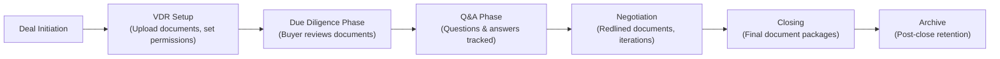
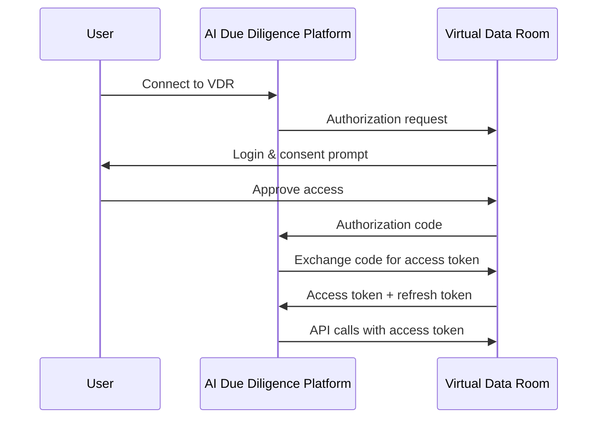
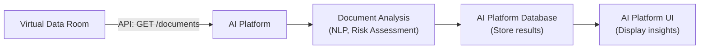
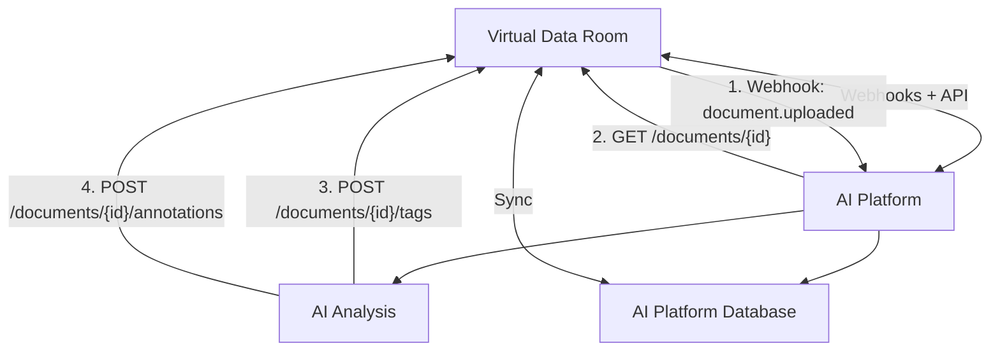
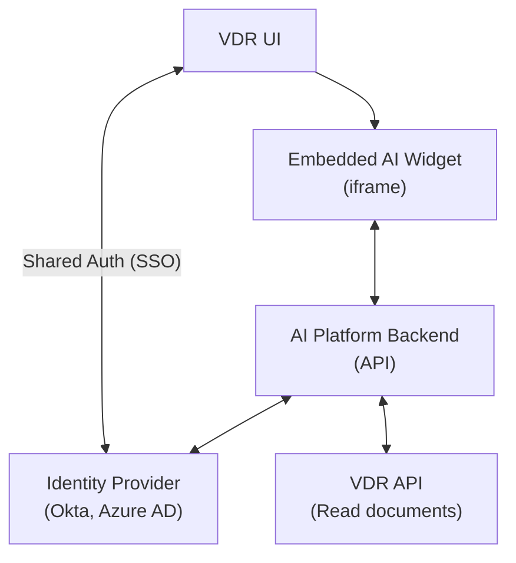

# Virtual Data Room API Integration Standards and Best Practices

**Document Metadata**
- **Title**: Virtual Data Room API Integration Standards and Best Practices for M&A Platforms
- **Date**: 2025-11-18
- **Sprint**: 05 - M&A Due Diligence Research Acceleration
- **Task**: 01 - Technical & Regulatory Landscape
- **Author**: technical-researcher skill agent

## Executive Summary

Virtual Data Rooms (VDRs) are the backbone of M&A transactions, with leading providers like Intralinks, Datasite, and DealRoom offering varying levels of API integration capabilities. Modern VDR platforms increasingly support REST API integration, OAuth/SAML authentication, and SSO (Single Sign-On), though API maturity varies significantly across providers. Intralinks has achieved ISO 27701 certification (industry's highest privacy standard) and AES 256-bit encryption, while platforms like DealRoom report 30-40% acceleration in deal execution through integrated analytics. Integration capabilities range from basic file access APIs to advanced webhooks, bidirectional sync, and embedded analytics. For AI-powered due diligence platforms, API integration enables automated document ingestion, real-time updates, and seamless workflow integration without disrupting existing deal team processes.

## Key Findings

- **ISO 27701 Leadership**: Intralinks first VDR to achieve ISO 27701 certification for data privacy [Intralinks, 2024]
- **Deal Acceleration**: DealRoom's integrated platform accelerates deals by 30-40% [DealRoom, 2024]
- **SAML 2.0 Standard**: Leading VDRs support SAML 2.0 SSO with major identity providers [Multiple sources, 2024]
- **Native Integrations**: Platforms integrate with Salesforce, SharePoint, Slack, GSuite [Intralinks, Firmex, 2024]
- **API Maturity Varies**: Enterprise VDRs (Intralinks, Datasite) offer robust APIs; mid-market solutions vary widely
- **Compliance Requirements**: SOC 2, GDPR, HIPAA compliance standard for leading providers [Firmex, 2024]

## 1. Virtual Data Room Market Overview

### 1.1 Major VDR Providers (2024-2025)

**Enterprise-Grade Platforms**:

| Provider | Market Position | Key Strengths | API Capabilities | Pricing Tier |
|----------|----------------|---------------|------------------|--------------|
| **Intralinks** | 35% market share (combined with Ideals, Citrix) | Security, M&A focus, ISO 27701 | REST API, connectors | Premium |
| **Datasite** | Major enterprise player | AI tools, end-to-end M&A support | Developer APIs, redaction AI | Premium |
| **Ansarada** | Asia-Pacific leader | AI insights, deal management | API available | Premium |
| **DealRoom** | Growing M&A platform | Integrated analytics, Slack/GSuite integration | Built-in integrations, API | Mid-Premium |
| **Firmex** | Mid-market leader | Balance of features/price | REST API, SSO | Mid-tier |
| **iDeals** | Global presence | User-friendly, good pricing | API, integrations | Mid-tier |

**Key Market Dynamics**:
- **Market Concentration**: Top 3 providers (Ideals, Intralinks, Citrix) hold ~35% combined market share [Datarooms.org, 2024]
- **Feature Convergence**: AI-powered analytics, Q&A automation, and analytics dashboards becoming table stakes
- **Security Competition**: Race to highest certifications (ISO 27001, ISO 27701, SOC 2 Type II)

### 1.2 VDR Use in M&A Transactions

**Typical VDR Lifecycle**:



**Integration Opportunities for AI Platform**:

| VDR Phase | AI Platform Value-Add | Integration Need |
|-----------|----------------------|------------------|
| **VDR Setup** | Auto-categorize uploaded documents | Read file metadata, propose folder structure |
| **Due Diligence** | Real-time risk analysis, entity extraction | Read documents, write annotations/tags |
| **Q&A Phase** | Auto-generate answers from documents | Read Q&A threads, suggest responses |
| **Negotiation** | Track changes, identify key terms | Read document versions, highlight deltas |
| **Closing** | Completeness check, compliance verification | Read full document set, generate checklists |

## 2. API Integration Standards and Technologies

### 2.1 REST API Standards

**What is REST API?**

REST (Representational State Transfer) is the dominant architectural style for web APIs, based on HTTP protocol.

**Standard HTTP Methods** in VDR APIs:

| Method | Purpose | Example VDR Use Case |
|--------|---------|---------------------|
| **GET** | Retrieve data | Get list of documents, download file, fetch metadata |
| **POST** | Create new resource | Upload document, create folder, submit Q&A |
| **PUT** | Update existing resource | Update document metadata, modify permissions |
| **PATCH** | Partial update | Update specific fields (e.g., document status) |
| **DELETE** | Remove resource | Delete document, remove user access |

**Example REST API Calls** (Hypothetical VDR API):

```http
# Get list of documents in a folder
GET /api/v1/deals/{deal_id}/folders/{folder_id}/documents
Authorization: Bearer {access_token}

Response:
{
  "documents": [
    {
      "id": "doc_abc123",
      "name": "Purchase_Agreement.pdf",
      "size": 2456789,
      "uploaded_at": "2024-03-15T10:30:00Z",
      "uploaded_by": "john.doe@example.com",
      "tags": ["contract", "legal"],
      "permissions": "read"
    },
    ...
  ]
}

# Download a specific document
GET /api/v1/documents/{document_id}/content
Authorization: Bearer {access_token}

Response: Binary file content (PDF, DOCX, etc.)

# Upload a new document
POST /api/v1/deals/{deal_id}/folders/{folder_id}/documents
Authorization: Bearer {access_token}
Content-Type: multipart/form-data

Body:
- file: [binary content]
- metadata: {"name": "Analysis_Report.pdf", "tags": ["ai-generated", "analysis"]}

Response:
{
  "document_id": "doc_xyz789",
  "status": "uploaded",
  "url": "/api/v1/documents/doc_xyz789"
}
```

### 2.2 Authentication Standards

**OAuth 2.0**:

OAuth 2.0 is the industry-standard protocol for authorization, enabling third-party applications to access user data without exposing passwords.

**OAuth 2.0 Flow for VDR Integration**:



**OAuth 2.0 Grant Types**:

| Grant Type | Use Case | Security Level | VDR Application |
|-----------|----------|----------------|-----------------|
| **Authorization Code** | User-facing web apps | High (with PKCE) | Primary integration method |
| **Client Credentials** | Machine-to-machine (no user) | Medium | Background sync, batch jobs |
| **Refresh Token** | Maintain long-lived access | High | Keep connection alive without re-auth |

**SAML 2.0 (SSO)**:

SAML (Security Assertion Markup Language) 2.0 is the standard for Single Sign-On (SSO) authentication.

**Leading VDR SAML Support** [Data-rooms.org, 2024]:

- Active Directory Federation Services (ADFS)
- Okta
- OneLogin
- Azure AD
- Ping Identity

**SAML SSO Benefits for M&A Teams**:
- Single login for all deal tools (VDR, CRM, email, AI platform)
- Centralized user provisioning/deprovisioning
- Enhanced security (MFA enforced at identity provider level)
- Compliance with corporate IT policies

### 2.3 Webhooks and Event Subscriptions

**Webhooks** enable real-time notifications when events occur in the VDR.

**Common VDR Webhook Events**:

| Event Type | Trigger | AI Platform Action |
|-----------|---------|-------------------|
| `document.uploaded` | New document added to VDR | Immediately begin AI analysis |
| `document.updated` | Document replaced or metadata changed | Re-analyze updated document |
| `document.downloaded` | User downloads document | Track engagement, prioritize popular docs |
| `qa.question_posted` | New Q&A question submitted | Auto-suggest answer from AI analysis |
| `user.added` | New user granted VDR access | Send onboarding, notify AI platform users |
| `folder.created` | New folder/category created | Sync folder structure |

**Webhook Implementation**:

```python
# AI Platform webhook receiver (FastAPI example)

from fastapi import FastAPI, HTTPException
import hmac
import hashlib

app = FastAPI()

@app.post("/webhooks/vdr/events")
async def handle_vdr_webhook(event: dict, signature: str):
    # 1. Verify webhook authenticity
    expected_signature = hmac.new(
        VDR_WEBHOOK_SECRET.encode(),
        json.dumps(event).encode(),
        hashlib.sha256
    ).hexdigest()

    if not hmac.compare_digest(signature, expected_signature):
        raise HTTPException(status_code=401, detail="Invalid signature")

    # 2. Process event based on type
    if event['type'] == 'document.uploaded':
        document_id = event['data']['document_id']
        # Trigger async AI analysis task
        analyze_document.delay(document_id)

    elif event['type'] == 'qa.question_posted':
        question_id = event['data']['question_id']
        # Generate suggested answer from AI
        generate_qa_response.delay(question_id)

    return {"status": "received"}
```

## 3. VDR Provider API Capabilities

### 3.1 Intralinks

**Company Profile**:
- **Product**: Intralinks VDRPro
- **Market Position**: Enterprise M&A standard, 35% combined market share
- **Security**: First VDR with ISO 27701 certification, AES 256-bit encryption

**API and Integration Features**:

**Native Connectors**:
- **Salesforce.com**: CRM integration for deal tracking
- **Microsoft SharePoint**: Document sync and collaboration
- **Custom Integrations**: API supports custom development

**Security Features**:
- **Encryption**: AES 256-bit at rest, 2048-bit RSA in transit
- **GDPR Compliance**: In-region data centers, encrypted archives
- **Access Controls**: Granular permissions, dynamic watermarking

**API Documentation**: Limited public documentation; typically requires enterprise agreement and NDA.

**Integration Complexity**: **Medium-High** - Enterprise-grade security means more authentication/authorization steps.

### 3.2 Datasite

**Company Profile**:
- **Product**: Datasite One (unified M&A platform)
- **Market Position**: Major enterprise provider, strong AI capabilities
- **Strengths**: End-to-end M&A lifecycle support, AI-driven redaction

**API and Integration Features**:

**Developer APIs** [Datasite, 2024]:
- REST API for programmatic access
- Webhook support for real-time events
- Bidirectional data sync capabilities

**AI-Powered Features**:
- AI-driven document redaction
- Integrated Q&A with smart categorization
- Analytics dashboards with deal insights

**API Documentation**: Available through Datasite Developer Portal (requires partnership or customer status).

**Integration Complexity**: **Medium** - Modern API design, good documentation for partners.

### 3.3 DealRoom

**Company Profile**:
- **Product**: DealRoom M&A Platform
- **Market Position**: Mid-market to enterprise, growing rapidly
- **Strengths**: Integrated diligence platform, built-in analytics

**API and Integration Features**:

**Built-In Integrations** [DealRoom, 2024]:
- **Slack**: Real-time notifications and collaboration
- **Google Workspace (GSuite)**: Document sync, calendar integration
- **Salesforce**: Deal pipeline management

**Performance Claims**:
- Clients report **30-40% faster deal execution**
- Improved process consistency and predictability

**API Availability**: API available for enterprise customers; documentation not publicly accessible.

**Integration Complexity**: **Low-Medium** - Focus on user-friendly integrations, though API may have limitations.

### 3.4 Firmex

**Company Profile**:
- **Product**: Firmex VDR
- **Market Position**: Mid-market leader, balance of features and price
- **Compliance**: SOC 2, GDPR, HIPAA compliant

**API and Integration Features**:

**REST API** [Firmex, 2024]:
- Programmatic document upload/download
- User management and permissions control
- Activity reporting and analytics

**Security and Compliance**:
- SOC 2 Type II certified
- GDPR and CCPA compliant
- SSO support (SAML)
- API for audit logs and compliance reporting

**API Documentation**: Available to customers; requires Firmex account.

**Integration Complexity**: **Low-Medium** - Straightforward REST API, good for mid-market integrations.

### 3.5 Emerging Players: Papermark

**Company Profile**:
- **Product**: Papermark (open-source VDR alternative)
- **Market Position**: Startup, developer-friendly
- **Differentiator**: Fully documented REST API and webhooks, open-source

**API and Integration Features** [Papermark, 2024]:

**Developer-First Approach**:
- **Fully documented REST API**: Public API documentation
- **Webhooks**: Event-driven architecture
- **Open-Source Components**: Some components available on GitHub

**Security**:
- SOC 2 Type II certified
- ISO 27001 compliant
- SSO, MFA, dynamic watermarks
- GDPR/CCPA compliant

**Integration Complexity**: **Low** - Modern, developer-friendly API design.

**Note**: Papermark is newer and less established than enterprise leaders, but represents trend toward API-first VDR platforms.

## 4. Integration Architecture Patterns

### 4.1 Pattern 1: Read-Only Integration (Minimal Disruption)

**Use Case**: AI platform analyzes documents but doesn't write back to VDR.

**Architecture**:



**Pros**:
- Minimal VDR impact (read-only, no data modification)
- Lower integration complexity
- Easier security approval (no write permissions needed)

**Cons**:
- Insights siloed in AI platform (not visible in VDR)
- Manual synchronization if VDR updated
- Duplicate data storage

**Best For**: Initial MVP, cautious enterprise customers, compliance-sensitive environments.

### 4.2 Pattern 2: Bidirectional Sync (Full Integration)

**Use Case**: AI platform writes analysis results back to VDR as annotations/tags.

**Architecture**:



**Pros**:
- Single source of truth (VDR remains central repository)
- AI insights visible to all deal team members in VDR
- Real-time updates (webhook-driven)

**Cons**:
- Higher complexity (write permissions, conflict resolution)
- VDR API write capabilities required (not all VDRs support)
- Potential VDR performance impact

**Best For**: Mature products, enterprise customers with IT resources, high-collaboration deals.

### 4.3 Pattern 3: Embedded Analytics (White-Label)

**Use Case**: AI platform embedded as iframe/widget within VDR interface.

**Architecture**:



**Pros**:
- Seamless user experience (no context switching)
- Shared authentication (SSO)
- AI insights in-context with documents

**Cons**:
- Requires VDR provider partnership or white-label arrangement
- iframe security considerations (CORS, CSP)
- Limited to VDRs supporting embeds

**Best For**: Strategic VDR partnerships, high-volume customers, enterprise sales channel.

## 5. Technical Implementation Guide

### 5.1 Authentication Implementation

**OAuth 2.0 Authorization Code Flow** (Recommended):

```python
# Step 1: Redirect user to VDR authorization endpoint

from urllib.parse import urlencode

def initiate_vdr_connection(user_id):
    params = {
        'client_id': VDR_CLIENT_ID,
        'redirect_uri': 'https://ai-platform.com/oauth/callback',
        'response_type': 'code',
        'scope': 'read:documents write:tags read:users',
        'state': generate_random_state(user_id)  # CSRF protection
    }
    auth_url = f"https://vdr-provider.com/oauth/authorize?{urlencode(params)}"
    return redirect(auth_url)

# Step 2: Handle callback and exchange code for token

@app.get("/oauth/callback")
async def vdr_oauth_callback(code: str, state: str):
    # Verify state (CSRF protection)
    verify_state(state)

    # Exchange authorization code for access token
    token_response = requests.post(
        "https://vdr-provider.com/oauth/token",
        data={
            'grant_type': 'authorization_code',
            'code': code,
            'redirect_uri': 'https://ai-platform.com/oauth/callback',
            'client_id': VDR_CLIENT_ID,
            'client_secret': VDR_CLIENT_SECRET
        }
    )

    tokens = token_response.json()
    # tokens = {'access_token': '...', 'refresh_token': '...', 'expires_in': 3600}

    # Store tokens securely (encrypted)
    store_vdr_credentials(user_id, tokens)

    return redirect('/dashboard?vdr_connected=true')

# Step 3: Use access token for API calls

def get_vdr_documents(user_id, deal_id):
    tokens = get_vdr_credentials(user_id)

    # Check if token expired, refresh if needed
    if token_expired(tokens):
        tokens = refresh_vdr_token(tokens['refresh_token'])
        store_vdr_credentials(user_id, tokens)

    # Make API call with access token
    response = requests.get(
        f"https://vdr-provider.com/api/v1/deals/{deal_id}/documents",
        headers={'Authorization': f"Bearer {tokens['access_token']}"}
    )

    return response.json()
```

### 5.2 Document Sync Implementation

**Incremental Sync Strategy** (Webhook + Polling Hybrid):

```python
# Webhook receiver for real-time updates
@app.post("/webhooks/vdr")
async def handle_vdr_webhook(event: VDREvent):
    if event.type == "document.uploaded":
        # Immediate processing for new documents
        await process_new_document(event.data.document_id)

    elif event.type == "document.updated":
        # Re-process updated document
        await update_document_analysis(event.data.document_id)

    return {"status": "processed"}

# Periodic full sync (catch any missed webhooks)
@scheduler.task('cron', hour=2)  # 2 AM daily
async def full_sync_vdr():
    for user in get_users_with_vdr_connections():
        vdr_docs = await get_vdr_documents(user.id)
        local_docs = get_local_documents(user.id)

        # Identify new/updated documents
        for vdr_doc in vdr_docs:
            local_doc = local_docs.get(vdr_doc.id)

            if not local_doc:
                # New document: process
                await process_new_document(vdr_doc.id)
            elif vdr_doc.updated_at > local_doc.updated_at:
                # Updated document: re-process
                await update_document_analysis(vdr_doc.id)
```

### 5.3 Error Handling and Retry Logic

**Robust API Client with Exponential Backoff**:

```python
import time
import requests
from requests.adapters import HTTPAdapter
from requests.packages.urllib3.util.retry import Retry

def create_vdr_api_client():
    session = requests.Session()

    # Configure retry strategy
    retry = Retry(
        total=5,  # Max retries
        backoff_factor=1,  # Wait 1, 2, 4, 8, 16 seconds
        status_forcelist=[429, 500, 502, 503, 504],  # Retry on these HTTP codes
        allowed_methods=["GET", "POST", "PUT", "PATCH"]  # Retry safe methods
    )

    adapter = HTTPAdapter(max_retries=retry)
    session.mount("https://", adapter)
    session.mount("http://", adapter)

    return session

# Usage
vdr_client = create_vdr_api_client()

try:
    response = vdr_client.get(
        "https://vdr-provider.com/api/v1/documents/abc123",
        headers={'Authorization': f'Bearer {access_token}'},
        timeout=30  # 30 second timeout
    )
    response.raise_for_status()  # Raise exception for 4xx/5xx
    document = response.json()
except requests.exceptions.HTTPError as e:
    if e.response.status_code == 401:
        # Token expired: refresh and retry
        refresh_token_and_retry()
    elif e.response.status_code == 404:
        # Document deleted
        handle_deleted_document()
    else:
        # Other error: log and alert
        log_error(e)
except requests.exceptions.Timeout:
    # VDR API timeout: log and retry later
    schedule_retry()
```

## 6. Security Considerations

### 6.1 Data Protection

**Encryption Requirements**:

| Data State | Encryption Standard | Implementation |
|-----------|-------------------|----------------|
| **In Transit** | TLS 1.2+ | HTTPS for all API calls, certificate pinning |
| **At Rest** | AES-256 | Encrypt stored VDR credentials, cache encrypted documents |
| **In Memory** | Secure memory handling | Clear sensitive data after use, avoid logging tokens |

**Token Storage**:

```python
# DO NOT store tokens in plain text
# BAD:
user.vdr_access_token = "eyJhbGciOiJIUzI1NiIsInR5cCI6IkpXVCJ9..."

# GOOD: Encrypt tokens before storage
from cryptography.fernet import Fernet

def store_vdr_token(user_id, access_token):
    encryption_key = get_user_encryption_key(user_id)
    f = Fernet(encryption_key)
    encrypted_token = f.encrypt(access_token.encode())

    db.execute(
        "UPDATE users SET vdr_token_encrypted = ? WHERE id = ?",
        (encrypted_token, user_id)
    )

def retrieve_vdr_token(user_id):
    encrypted_token = db.query("SELECT vdr_token_encrypted FROM users WHERE id = ?", user_id)
    encryption_key = get_user_encryption_key(user_id)
    f = Fernet(encryption_key)
    access_token = f.decrypt(encrypted_token).decode()
    return access_token
```

### 6.2 API Rate Limiting

**Typical VDR API Rate Limits**:

| Tier | Requests/Minute | Requests/Hour | Requests/Day |
|------|----------------|---------------|--------------|
| **Standard** | 60 | 1,000 | 10,000 |
| **Enterprise** | 300 | 10,000 | 100,000 |
| **Partner** | 1,000 | 50,000 | 500,000 |

**Rate Limit Handling**:

```python
import time
from collections import deque

class RateLimiter:
    def __init__(self, max_requests, time_window):
        self.max_requests = max_requests
        self.time_window = time_window  # in seconds
        self.requests = deque()

    def wait_if_needed(self):
        now = time.time()

        # Remove requests outside time window
        while self.requests and self.requests[0] < now - self.time_window:
            self.requests.popleft()

        # If at limit, wait
        if len(self.requests) >= self.max_requests:
            sleep_time = self.time_window - (now - self.requests[0])
            if sleep_time > 0:
                time.sleep(sleep_time)
                self.requests.popleft()

        # Record this request
        self.requests.append(time.time())

# Usage
vdr_rate_limiter = RateLimiter(max_requests=60, time_window=60)  # 60 req/min

def call_vdr_api(endpoint):
    vdr_rate_limiter.wait_if_needed()
    response = requests.get(f"https://vdr-provider.com/api/v1/{endpoint}")
    return response.json()
```

### 6.3 Access Control and Permissions

**Principle of Least Privilege**:

Request only necessary OAuth scopes:

```python
# GOOD: Minimal scopes
oauth_scopes = [
    'read:documents',      # Read document content
    'read:metadata',       # Read document metadata
    'write:tags'           # Write AI-generated tags
]

# BAD: Excessive scopes
oauth_scopes = [
    'read:documents',
    'write:documents',     # Not needed if only analyzing
    'delete:documents',    # Dangerous - AI platform shouldn't delete
    'admin:users'          # Far too broad
]
```

**VDR Permission Mapping**:

Respect VDR's existing permission structure:

- If user has read-only access in VDR → AI platform should only read
- If document is restricted → Don't process or display in AI platform
- Maintain audit trail of AI platform actions for VDR administrators

## 7. Testing and Quality Assurance

### 7.1 Integration Testing Checklist

**Authentication & Authorization**:
- [ ] OAuth flow completes successfully
- [ ] Token refresh works before expiration
- [ ] Invalid tokens properly handled (401 error)
- [ ] SAML SSO (if supported) redirects and authenticates correctly

**Document Operations**:
- [ ] List documents in folder
- [ ] Download document content (various formats: PDF, DOCX, XLSX)
- [ ] Upload analysis results (tags, annotations)
- [ ] Handle large files (>100MB)
- [ ] Pagination for large document sets

**Webhook Handling**:
- [ ] Webhook signature verification
- [ ] Event processing for all supported event types
- [ ] Idempotency (duplicate webhooks don't cause issues)
- [ ] Webhook failure retry mechanism

**Error Scenarios**:
- [ ] Network timeout handling
- [ ] Rate limit exceeded (429 response)
- [ ] Document deleted (404 response)
- [ ] VDR API downtime (503 response)
- [ ] Invalid API credentials (401/403 response)

### 7.2 Monitoring and Observability

**Key Metrics to Track**:

| Metric | Purpose | Alert Threshold |
|--------|---------|----------------|
| **API Success Rate** | Overall integration health | <95% |
| **API Latency (p95)** | Performance monitoring | >5 seconds |
| **Token Refresh Failures** | Auth system health | >1% |
| **Webhook Processing Time** | Real-time sync performance | >60 seconds |
| **Documents Synced/Hour** | Throughput monitoring | <expected baseline |
| **Sync Errors** | Data consistency | >0.5% |

**Logging Best Practices**:

```python
import logging
import json

logger = logging.getLogger(__name__)

# Structured logging for API calls
def call_vdr_api_with_logging(endpoint, method='GET', **kwargs):
    request_id = generate_request_id()

    logger.info("VDR API call initiated", extra={
        "request_id": request_id,
        "endpoint": endpoint,
        "method": method,
        "timestamp": datetime.utcnow().isoformat()
    })

    start_time = time.time()

    try:
        response = requests.request(method, endpoint, **kwargs)
        duration = time.time() - start_time

        logger.info("VDR API call succeeded", extra={
            "request_id": request_id,
            "status_code": response.status_code,
            "duration_ms": duration * 1000
        })

        return response

    except Exception as e:
        duration = time.time() - start_time

        logger.error("VDR API call failed", extra={
            "request_id": request_id,
            "error": str(e),
            "duration_ms": duration * 1000
        }, exc_info=True)

        raise
```

## References

1. Intralinks (2024). *Intralinks Virtual Data Room Overview*. Retrieved from https://datarooms.org/intralinks-vdr/

2. Intralinks (2024). *Virtual Data Rooms (VDR) | Intralinks VDRPro*. Retrieved from https://www.intralinks.com/products/virtual-data-room

3. Dataroom Providers (2024). *Datasite vs Intralinks: Compare to Select the Best Solution*. Retrieved from https://dataroom-providers.org/blog/datasite-vs-intralinks/

4. Datarooms.org (2024). *Intralinks vs Datasite: A Detailed Comparison for 2025*. Retrieved from https://datarooms.org/vdr-blog/intralinks-vs-datasite-comparison/

5. Datasite (2024). *Enhance Your M&A Journey with Our Developer APIs*. Retrieved from https://www.datasite.com/en/resources/developer-apis

6. DealRoom (2024). *AI Due Diligence: What it Is & Impact on M&A (Full Guide)*. Retrieved from https://dealroom.net/blog/ai-due-diligence

7. Firmex (2024). *API | Firmex*. Retrieved from https://www.firmex.com/virtual-data-room/api/

8. Papermark (2024). *Datasite VDR: Quick Overview*. Retrieved from https://www.papermark.com/blog/datasite-vdr-overview

9. Data-rooms.org (2024). *The Ultimate Guide to Virtual Data Room Features in 2024*. Retrieved from https://data-rooms.org/blog/the-ultimate-guide-to-virtual-data-room-features-in-2024/

10. Data-rooms.org (2024). *The Best Strategies for Integrating VDRs with Other Software*. Retrieved from https://data-rooms.org/blog/integrating-virtual-data-rooms-with-other-software-a-guide/

11. Imprima (2024). *Imprima Integration - API Integration*. Retrieved from https://www.imprima.com/virtual-data-room/api-integration

12. SourceForge (2025). *Best Virtual Data Room Software of 2025 - Reviews & Comparison*. Retrieved from https://sourceforge.net/software/virtual-data-room/
