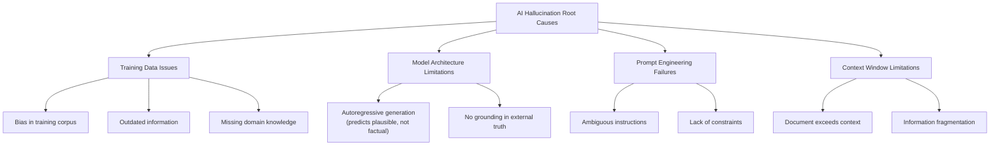
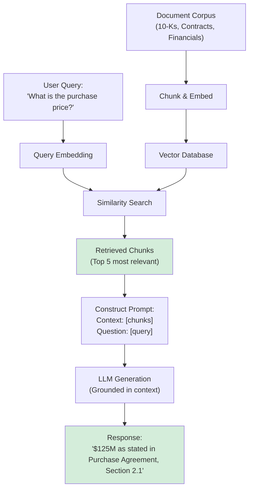
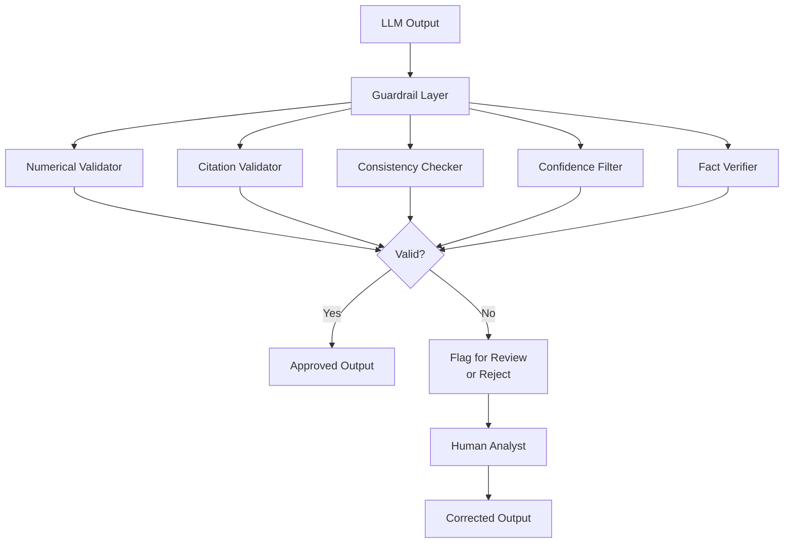
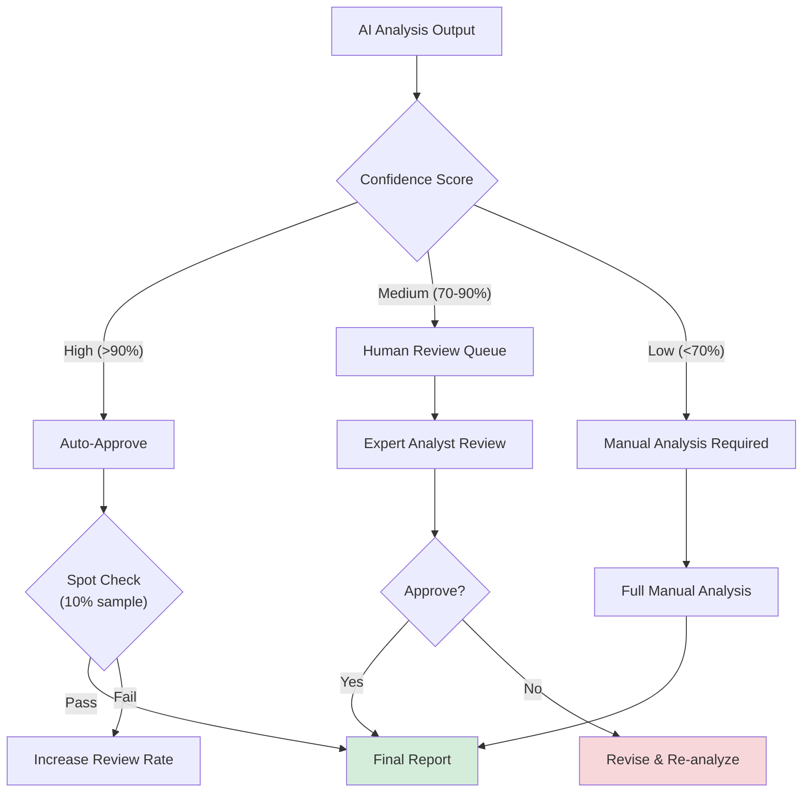

# AI Risk Assessment and Hallucination Mitigation for Automated Due Diligence

**Document Metadata**
- **Title**: AI Risk Assessment and Hallucination Mitigation Strategies for Automated Due Diligence
- **Date**: 2025-11-18
- **Sprint**: 05 - M&A Due Diligence Research Acceleration
- **Task**: 01 - Technical & Regulatory Landscape
- **Author**: technical-researcher skill agent

## Executive Summary

AI hallucination—the generation of plausible but factually incorrect information—poses the greatest risk to automated due diligence systems, where accuracy is paramount and errors can lead to multi-million dollar consequences. Wall Street firms flagged AI hallucination risks in March 2024 as financial models increasingly rely on generative tools. Mitigation strategies include Retrieval-Augmented Generation (RAG), which reduces hallucinations by 50-80%; guardrails that verify numerical outputs against source data; and mandatory human-in-the-loop verification for high-stakes decisions. The EU AI Act (effective August 2024) categorizes financial AI systems as "high risk," requiring conformity assessments, fundamental rights impact assessments, and robust accuracy measures. Data security (45%) and accuracy (43%) remain the biggest barriers to AI adoption in financial due diligence.

## Key Findings

- **Hallucination Critical Risk**: Inaccurate AI outputs can mislead legal arguments and impact financial decisions [Lexology, BayTech, 2024]
- **RAG Reduces Hallucinations**: Retrieval-augmented generation cuts hallucination rates by 50-80% [Pathway, 2024]
- **$60M+ in Penalties**: 2024 regulatory failures highlight need for AI-augmented compliance [Verified Vector, 2024]
- **EU AI Act Effective**: High-risk categorization for financial AI, enforcement begins Feb 2025 [Multiple sources, 2024]
- **90%+ Detection Accuracy**: AI systems achieve >90% risk detection accuracy with proper guardrails [Debut Infotech, 2024]
- **Adoption Barriers**: 45% data security concerns, 43% accuracy concerns [BioCatch, 2024]

## 1. Understanding AI Hallucination in Financial Context

### 1.1 Definition and Manifestations

**AI Hallucination** occurs when Generative AI models produce factually inaccurate or misleading responses, stemming from biases in training data and model limitations [BayTech Consulting, 2024].

**Types of Hallucinations in M&A Due Diligence**:

| Hallucination Type | Description | Example | Impact Severity |
|-------------------|-------------|---------|-----------------|
| **Factual Invention** | Creating non-existent information | Inventing clauses not in contract | **CRITICAL** |
| **Numerical Errors** | Incorrect figures or calculations | Misreporting revenue as $50M instead of $5M | **CRITICAL** |
| **Misattribution** | Assigning information to wrong source | Attributing competitor data to target company | **HIGH** |
| **Temporal Confusion** | Mixing up dates or time periods | Confusing FY2023 with FY2024 financials | **HIGH** |
| **Regulatory Misstatement** | Incorrect legal/regulatory citations | Citing non-existent regulation | **HIGH** |
| **Semantic Drift** | Subtle meaning changes in summarization | Changing "may be required" to "is required" | **MEDIUM** |
| **Context Loss** | Omitting critical context or caveats | Dropping "subject to regulatory approval" qualifier | **MEDIUM** |

### 1.2 Real-World Consequences

**In Financial Services**:

> "In sensitive sectors such as healthcare, law, and finance, such hallucinations can mislead diagnoses, distort legal arguments, and impact financial decisions, leading to reputational damage, regulatory scrutiny, and legal liability." [Lexology, 2024]

**Documented Risks**:

**March 2024**: Bloomberg flagged that Wall Street firms are warning investors of AI risks, including hallucinations, as financial models and compliance systems increasingly rely on generative tools [PYMNTS, 2024].

**Due Diligence Specific Concerns**:

> "It's not tough to imagine how this might become a real problem in due diligence work, where accuracy is paramount. LLMs can produce output that appears superficially plausible, but is in reality factually incorrect or based on false references, such as inaccurate weblinks or research papers that appear credible but do not exist." [S-RM Inform, 2024]

**Financial Impact Examples**:

- **Incorrect Valuation**: Hallucinated revenue figure leads to $100M+ overvaluation
- **Missed Liabilities**: AI fails to identify material warranty obligations
- **Regulatory Non-Compliance**: Misidentification of required licenses delays closing
- **Reputational Damage**: Public disclosure of AI-generated errors undermines firm credibility

### 1.3 Root Causes of Hallucination



**Key Insight**: LLMs are trained to predict plausible next tokens, NOT to ensure factual accuracy. They optimize for fluency and coherence, not truth [Multiple sources, 2024].

## 2. Hallucination Detection Methods

### 2.1 Internal Consistency Checking

**Self-Consistency Method**:

Generate multiple responses to the same query and compare for agreement.

```python
# Pseudo-code: Self-consistency check

def get_consistent_response(query, document, num_samples=5):
    responses = []

    # Generate multiple responses with temperature > 0
    for _ in range(num_samples):
        response = llm.generate(
            prompt=query,
            context=document,
            temperature=0.7  # Some randomness
        )
        responses.append(response)

    # Extract key facts from each response
    extracted_facts = [extract_key_facts(r) for r in responses]

    # Identify consensus facts (appear in majority of responses)
    consensus = find_consensus(extracted_facts, threshold=0.6)

    # Flag any facts that don't appear consistently
    inconsistent_facts = find_outliers(extracted_facts)

    if inconsistent_facts:
        log_warning(f"Inconsistent facts detected: {inconsistent_facts}")
        # Trigger human review

    return build_response_from_consensus(consensus)
```

**Effectiveness**: Reduces hallucinations by ~30-40% but computationally expensive (5x API calls).

### 2.2 Source Attribution and Citation

**Forced Citation Methodology**:

Require LLM to cite specific source passages for every claim.

**Prompt Engineering Approach**:

```
You are analyzing a due diligence document. For every factual claim you make,
you MUST cite the exact page number and section.

Format:
Claim: [Your finding]
Source: Page X, Section Y, Quote: "[exact text from document]"

If you cannot find specific evidence in the document, respond with:
"Information not found in provided documents."

DO NOT make claims without explicit source citations.
```

**Verification Process**:

```python
def verify_citations(llm_response, source_documents):
    # Parse LLM response for claims and citations
    claims = extract_claims_with_citations(llm_response)

    verified_claims = []
    hallucinated_claims = []

    for claim in claims:
        # Verify citation exists in source
        citation_valid = check_citation_exists(
            claim.citation,
            source_documents
        )

        if citation_valid:
            # Verify claim matches cited text
            semantic_match = verify_semantic_match(
                claim.text,
                claim.citation.source_text
            )

            if semantic_match > 0.85:  # High similarity threshold
                verified_claims.append(claim)
            else:
                hallucinated_claims.append(claim)
                flag_for_review(claim, reason="Claim doesn't match citation")
        else:
            hallucinated_claims.append(claim)
            flag_for_review(claim, reason="Citation not found in source")

    return verified_claims, hallucinated_claims
```

**Effectiveness**: High (90%+ detection of factual errors) but requires structured output and verification pipeline.

### 2.3 Numerical Validation

**Guardrails for Financial Figures**:

```python
def validate_financial_claims(llm_output, source_documents):
    # Extract all monetary amounts from LLM output
    claimed_amounts = extract_monetary_values(llm_output)
    # Example: [("Revenue", "$15.2M"), ("EBITDA", "$3.8M")]

    # Extract all monetary amounts from source documents
    source_amounts = extract_all_numbers_from_docs(source_documents)

    validation_results = []

    for claim_name, claim_value in claimed_amounts:
        # Parse value
        claim_numeric = parse_money(claim_value)  # $15.2M -> 15200000

        # Check if this exact value exists in sources
        exact_match = claim_numeric in source_amounts

        if exact_match:
            validation_results.append({
                "claim": claim_name,
                "value": claim_value,
                "status": "VERIFIED",
                "confidence": 1.0
            })
        else:
            # Check for close approximations (potential rounding)
            close_matches = find_close_values(
                claim_numeric,
                source_amounts,
                tolerance=0.01  # 1% tolerance
            )

            if close_matches:
                validation_results.append({
                    "claim": claim_name,
                    "value": claim_value,
                    "status": "LIKELY_VALID",
                    "confidence": 0.8,
                    "close_matches": close_matches
                })
            else:
                # Potential hallucination
                validation_results.append({
                    "claim": claim_name,
                    "value": claim_value,
                    "status": "UNVERIFIED",
                    "confidence": 0.0,
                    "action": "HUMAN_REVIEW_REQUIRED"
                })

                send_alert(f"Unverified financial claim: {claim_name} = {claim_value}")

    return validation_results
```

**Example Guardrail in Action**:

- **LLM Output**: "Company X had a net profit of $500 million in 2024"
- **Guardrail Action**: Search source financials for $500M net profit figure
- **Result**: Not found → Flag as potential hallucination → Human review
- **Actual Correct Value** (after review): $50 million (LLM added extra zero)

## 3. Hallucination Mitigation Strategies

### 3.1 Retrieval-Augmented Generation (RAG)

**How RAG Reduces Hallucinations**:

> "By connecting generation to real data, RAG dramatically reduces hallucination rates and increases factual accuracy." [Pathway, 2024]

**RAG Architecture**:



**Key Benefits**:

| Benefit | Impact | Mechanism |
|---------|--------|-----------|
| **Factual Grounding** | 50-80% reduction in hallucinations | LLM only generates from retrieved facts |
| **Source Traceability** | Every claim linked to source document | Retrieved chunks include metadata (doc, page) |
| **Reduced Model Reliance** | Less dependence on LLM's internal knowledge | External knowledge base is source of truth |
| **Dynamic Knowledge** | Always up-to-date with latest documents | Vector DB updated in real-time |

**RAG Implementation Best Practices**:

1. **Chunk Size Optimization**: 500-1000 tokens per chunk (balance context vs. precision)
2. **Overlap**: 50-100 token overlap between chunks (avoid splitting sentences)
3. **Metadata Enrichment**: Include document type, date, section headers in chunks
4. **Retrieval K**: Retrieve top 3-10 chunks (balance relevance vs. context window)
5. **Re-ranking**: Use cross-encoder to re-rank retrieved chunks for better precision

### 3.2 Guardrails Framework

**What Are Guardrails?**

Guardrails are validation layers that verify LLM outputs against known constraints and rules [Lucidworks, 2024].

**Guardrail Types for Due Diligence**:



**Commercial Guardrail Solutions**:

| Platform | Capabilities | Use Case |
|----------|-------------|----------|
| **Guardrails AI** | Schema validation, fact-checking, toxicity detection | Open-source, customizable guardrails |
| **NeMo Guardrails (NVIDIA)** | Topical guardrails, safety controls, fact-checking | Enterprise-grade, high performance |
| **Anthropic Constitutional AI** | Built-in safety, harmlessness, honesty training | Claude models have inherent guardrails |
| **LangChain Callbacks** | Custom validation functions in LLM pipeline | Flexible, developer-friendly |

**Example Guardrail Configuration**:

```python
from guardrails import Guard
import guardrails as gd

# Define guardrail schema for financial analysis
guard = Guard.from_string(
    validators=[
        # Ensure all monetary values are cited
        gd.validators.ValidChoices(
            choices=["cited"],
            on_fail="reask"  # Ask LLM to provide citation
        ),

        # Ensure numerical values within reasonable ranges
        gd.validators.ValidRange(
            min=0,
            max=1e12,  # Max $1 trillion (sanity check)
            on_fail="filter"  # Remove invalid values
        ),

        # Ensure no toxic or inappropriate content
        gd.validators.ToxicLanguage(
            threshold=0.5,
            on_fail="exception"  # Reject output entirely
        ),

        # Ensure response format compliance
        gd.validators.ValidJson(
            on_fail="reask"  # Request properly formatted JSON
        )
    ]
)

# Use guardrail in LLM call
raw_llm_output = llm.generate(prompt)
validated_output = guard.validate(raw_llm_output)

if validated_output.validation_passed:
    return validated_output.validated_output
else:
    # Handle validation failure
    log_validation_errors(validated_output.errors)
    trigger_human_review()
```

### 3.3 Human-in-the-Loop (HITL) Verification

**When to Require Human Review**:



**Critical Review Checkpoints**:

| Category | Requires Human Review | Reasoning |
|----------|----------------------|-----------|
| **Material Financial Terms** | ALWAYS | Deal price, payment structure, earn-outs |
| **Legal Interpretations** | ALWAYS | Indemnification, liability caps, dispute resolution |
| **Regulatory Compliance** | ALWAYS | Licenses, permits, regulatory approvals |
| **Risk Assessments** | HIGH confidence only | Red flags, deal-breakers, material risks |
| **Document Summaries** | MEDIUM confidence | Non-critical background information |
| **Data Extraction** | AUTO (with spot checks) | Entity extraction, dates, standard clauses |

**HITL Workflow Implementation**:

```python
class HumanReviewWorkflow:
    def process_ai_output(self, analysis):
        # Determine review requirement based on rules
        review_required = self.determine_review_level(analysis)

        if review_required == "NONE":
            # High confidence, auto-approve with spot check
            if random.random() < 0.10:  # 10% spot check rate
                self.spot_check_queue.add(analysis)
            return self.approve_output(analysis)

        elif review_required == "STANDARD":
            # Medium confidence, queue for review
            ticket = self.create_review_ticket(
                analysis=analysis,
                priority="MEDIUM",
                assigned_to=self.get_available_analyst()
            )
            self.notify_analyst(ticket)
            return {"status": "PENDING_REVIEW", "ticket_id": ticket.id}

        elif review_required == "CRITICAL":
            # Low confidence or critical topic
            ticket = self.create_review_ticket(
                analysis=analysis,
                priority="HIGH",
                assigned_to=self.get_senior_analyst()
            )
            self.notify_analyst(ticket, urgent=True)
            return {"status": "CRITICAL_REVIEW", "ticket_id": ticket.id}

    def determine_review_level(self, analysis):
        # Check confidence score
        if analysis.confidence < 0.70:
            return "CRITICAL"

        # Check for critical topics
        critical_topics = [
            "purchase price", "indemnification", "regulatory approval",
            "material adverse change", "termination rights"
        ]
        if any(topic in analysis.content.lower() for topic in critical_topics):
            return "CRITICAL"

        # Check for hallucination flags
        if analysis.hallucination_risk_score > 0.3:
            return "STANDARD"

        # Check for unverified claims
        if analysis.unverified_claims_count > 0:
            return "STANDARD"

        return "NONE"
```

## 4. Risk Assessment Framework for AI Due Diligence

### 4.1 EU AI Act Classification

**EU AI Act** (effective August 2024, enforcement begins February 2025) categorizes AI systems by risk level [EU, 2024]:

| Risk Level | Definition | Examples | Requirements |
|-----------|------------|----------|--------------|
| **Unacceptable Risk** | Prohibited AI systems | Social scoring, subliminal manipulation | **BANNED** |
| **High Risk** | Significant impact on safety/rights | Financial AI, employment decisions, critical infrastructure | Conformity assessment, FRIA, human oversight, accuracy measures |
| **Limited Risk** | Transparency obligations | Chatbots, deepfakes | Transparency disclosure |
| **Minimal Risk** | No restrictions | Spam filters, recommendation engines | No specific obligations |

**Financial Services AI Classification**: Typically **HIGH RISK**

**High-Risk AI Requirements (Applicable to M&A Due Diligence)**:

1. **Conformity Assessment**: Third-party audit before deployment
2. **Fundamental Rights Impact Assessment (FRIA)**: Assess impact on human rights
3. **Risk Management System**: Identify, analyze, mitigate AI risks
4. **Data Governance**: High-quality, relevant, representative training data
5. **Technical Documentation**: Comprehensive system documentation
6. **Record-Keeping**: Automatic logging of operations
7. **Transparency**: Clear information to users about AI use
8. **Human Oversight**: Human intervention, stopping, or overriding AI decisions
9. **Accuracy, Robustness, Cybersecurity**: Technical measures to ensure reliability

### 4.2 NIST AI RMF Applied to Due Diligence

**GOVERN Phase**:

| Component | Implementation for DD Platform |
|-----------|-------------------------------|
| **AI Governance Structure** | Establish AI Ethics Committee; assign Chief AI Officer |
| **Acceptable Use Policy** | Define approved AI use cases (document analysis, risk flagging); prohibited uses (final investment decisions) |
| **Accountability** | Assign owners for AI model performance, data quality, compliance |
| **Incident Response** | Document procedures for AI errors, hallucinations, data breaches |

**MAP Phase**:

| Component | Implementation |
|-----------|---------------|
| **Use Case Mapping** | Document review, entity extraction, risk identification, financial analysis, Q&A |
| **Stakeholder Identification** | Deal teams, compliance, legal, clients, regulators |
| **Regulatory Mapping** | Map FINRA, SEC, EU AI Act requirements to AI functions |
| **Data Sensitivity** | Classify data: public, confidential, highly confidential, PII |

**MEASURE Phase**:

| Metric | Target | Measurement Method |
|--------|--------|-------------------|
| **Accuracy** | >95% for entity extraction | Compare AI output to human-annotated test set |
| **Recall** | >90% for risk identification | Measure % of known risks detected |
| **Precision** | >85% for risk identification | Measure % of flagged items that are true risks |
| **Hallucination Rate** | <2% | Human review of sample outputs |
| **Bias** | <5% variance across deal types | Compare performance across industries, deal sizes |
| **Latency** | <60 seconds for document analysis | Monitor API response times |

**MANAGE Phase**:

| Risk | Mitigation |
|------|-----------|
| **Hallucination** | RAG architecture, guardrails, HITL for critical findings |
| **Bias** | Diverse training data, bias testing, fairness metrics |
| **Data Privacy** | Encryption, access controls, data minimization, GDPR compliance |
| **Model Drift** | Monthly performance monitoring, quarterly retraining |
| **Adversarial Attacks** | Input validation, rate limiting, anomaly detection |

### 4.3 Risk Scoring and Prioritization

**AI-Generated Risk Scoring**:

```python
class RiskAssessment:
    def score_finding(self, finding):
        # Base score from AI model
        base_score = finding.ai_confidence_score

        # Adjust based on topic criticality
        topic_multiplier = self.get_topic_multiplier(finding.topic)

        # Adjust based on verification status
        verification_factor = self.get_verification_factor(finding)

        # Calculate final risk score
        risk_score = base_score * topic_multiplier * verification_factor

        # Classify risk level
        if risk_score > 0.8:
            risk_level = "CRITICAL"
        elif risk_score > 0.6:
            risk_level = "HIGH"
        elif risk_score > 0.4:
            risk_level = "MEDIUM"
        else:
            risk_level = "LOW"

        return {
            "score": risk_score,
            "level": risk_level,
            "requires_review": risk_level in ["CRITICAL", "HIGH"]
        }

    def get_topic_multiplier(self, topic):
        critical_topics = {
            "financial_fraud": 2.0,
            "regulatory_violation": 1.8,
            "litigation": 1.5,
            "material_contract": 1.3,
            "ip_infringement": 1.5
        }
        return critical_topics.get(topic, 1.0)

    def get_verification_factor(self, finding):
        if finding.verified_by_human:
            return 1.0
        elif finding.has_source_citation:
            return 0.9
        elif finding.passed_guardrails:
            return 0.8
        else:
            return 0.5  # Unverified - heavily discount
```

## 5. Adoption Barriers and Solutions

### 5.1 Current Barriers (2024 Research)

**BioCatch AI Fraud Financial Crime Survey (2024)**:

> "Concerns about data security (45%) and accuracy (43%) are the biggest barriers to adoption."

**Barrier Breakdown**:

| Barrier | Percentage | Impact |
|---------|-----------|--------|
| **Data Security** | 45% | Concerns about confidential deal data exposure |
| **Accuracy Concerns** | 43% | Fear of hallucinations, errors in critical analysis |
| **Regulatory Uncertainty** | 35% | Unclear compliance requirements |
| **Cost** | 30% | High implementation and operational costs |
| **Change Management** | 28% | Resistance from deal teams accustomed to manual processes |
| **Vendor Lock-In** | 20% | Dependence on proprietary AI platforms |

### 5.2 Mitigation Strategies

**Addressing Data Security (45%)**:

| Concern | Solution |
|---------|----------|
| **Data Breach** | SOC 2 Type II, ISO 27001, encryption at rest/transit, zero-trust architecture |
| **Unauthorized Access** | RBAC, MFA, SSO, principle of least privilege |
| **Data Leakage to AI Vendor** | On-premise deployment option, contractual DPAs, opt-out of model training |
| **Compliance Violations** | GDPR/CCPA compliance, data residency controls, audit trails |

**Addressing Accuracy Concerns (43%)**:

| Concern | Solution |
|---------|----------|
| **Hallucinations** | RAG, guardrails, HITL, confidence scores, source citations |
| **Missed Risks** | Ensemble models (AI + rules), high recall targets (>90%), manual QA |
| **False Positives** | Precision optimization, filtering low-confidence flags, contextual analysis |
| **Lack of Explainability** | Attention visualization, LIME/SHAP explanations, audit trails |

**Building Trust Through Transparency**:

```python
class TransparentAIOutput:
    def generate_report(self, analysis):
        return {
            "findings": analysis.findings,

            # Transparency elements
            "confidence_score": analysis.confidence,
            "data_sources": [doc.name for doc in analysis.sources],
            "citations": analysis.citations,
            "model_version": "gpt-4-turbo-2024-04-09",
            "processing_date": datetime.utcnow(),

            # Risk indicators
            "hallucination_checks_passed": analysis.guardrails_passed,
            "unverified_claims": analysis.unverified_claims,
            "human_review_required": analysis.requires_review,

            # Audit trail
            "processing_log": analysis.processing_steps,
            "data_lineage": analysis.data_lineage
        }
```

## 6. Case Studies and Performance Metrics

### 6.1 Reported Performance (2024)

| Metric | Performance | Source |
|--------|-------------|--------|
| **Risk Detection Accuracy** | >90% | Debut Infotech, 2024 |
| **Time Reduction** | 70% | Multiple sources, 2024 |
| **Manual Effort Reduction** | 80% | DealRoom, RTS Labs, 2024 |
| **Hours Saved (Case Study)** | 14,450 hours | Saudi fintech, 2024 |
| **Deal Acceleration** | 30-40% faster | DealRoom clients, 2024 |

### 6.2 Regulatory Failure Case Study

**$60 Million Wake-Up Call (2024)** [Verified Vector, 2024]:

> "2024's $60+ million in FINRA penalties weren't failures of intention—they were failures of scale, as financial services firms' manual processes simply cannot keep pace with the complexity and volume of modern regulatory oversight requirements."

**Key Lessons**:

1. **Manual Processes Don't Scale**: 100% automated monitoring vs. manual sampling gaps
2. **Real-Time Monitoring Essential**: Batch processing misses time-sensitive violations
3. **AI Augmentation Necessary**: Human-only approaches overwhelmed by data volume
4. **Compliance-First AI Design**: Build compliance into AI architecture, not bolt-on

## References

1. BayTech Consulting (2024). *Hidden Dangers of AI Hallucinations in Financial Services*. Retrieved from https://www.baytechconsulting.com/blog/hidden-dangers-of-ai-hallucinations-in-financial-services

2. Pathway (2024). *How AI Agents in Finance Are Transforming Financial Due Diligence: FA3STER*. Retrieved from https://pathway.com/blog/ai-agents-finance-due-diligence/

3. Lexology (2024). *AI Hallucinations: When Creation Comes at a Cost, Who Pays?*. Retrieved from https://www.lexology.com/library/detail.aspx?g=c5f62c8c-b7cc-4d10-8281-4d1746a63c89

4. PYMNTS (2025). *The Future of Trustworthy AI: Can Hallucinations Be Tamed?*. Retrieved from https://www.pymnts.com/artificial-intelligence-2/2025/the-future-of-trustworthy-ai-can-hallucinations-be-tamed/

5. Lucidworks (2024). *Is Your AI Hallucinating? The Hidden Risks for Financial Services*. Retrieved from https://lucidworks.com/blog/is-your-ai-hallucinating-the-hidden-risks-for-financial-services

6. S-RM Inform (2024). *What are the Implications of AI for the Due Diligence and Investigations Industry in 2024?*. Retrieved from https://www.s-rminform.com/latest-thinking/what-are-the-implications-of-ai-for-the-due-diligence-and-investigations-industry-in-2024

7. Verified Vector (2024). *The $60 Million Wake-Up Call: How AI-Augmented Compliance Could Have Prevented 2024's Biggest Regulatory Failures*. Retrieved from https://verifiedvector.com/blog/ai-augmented-compliance-fintech-regulatory-failures-2024

8. Debut Infotech (2024). *AI Powered Due Diligence: Smarter Risk Assessment*. Retrieved from https://www.debutinfotech.com/blog/how-ai-powered-due-diligence-works

9. BioCatch (2024). *2024 AI Fraud Financial Crime Survey*. Retrieved from https://www.biocatch.com/ai-fraud-financial-crime-survey

10. European Union (2024). *Regulation on Artificial Intelligence (AI Act)*. Official Journal of the European Union.

11. DealRoom (2024). *AI Due Diligence: What it Is & Impact on M&A (Full Guide)*. Retrieved from https://dealroom.net/blog/ai-due-diligence

12. RTS Labs (2024). *AI in Due Diligence – What It's & How It's Transforming M&A (2025)*. Retrieved from https://rtslabs.com/ai-due-diligence/
