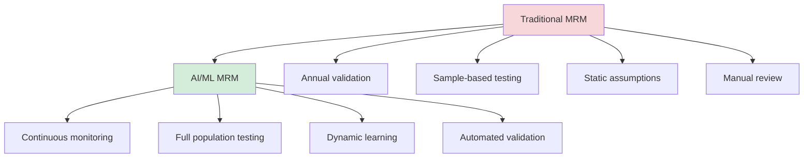
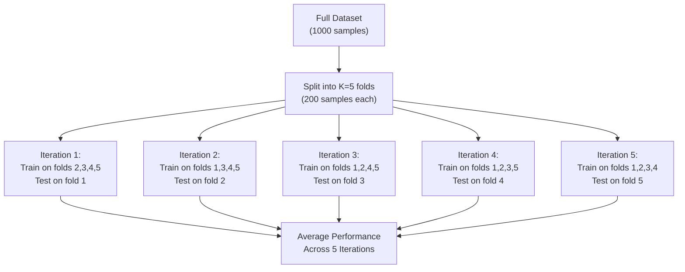
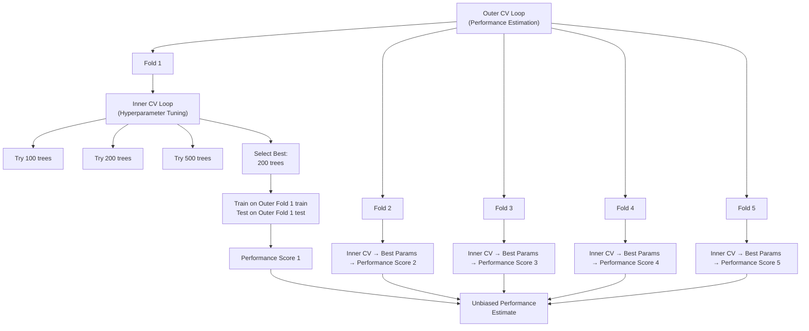
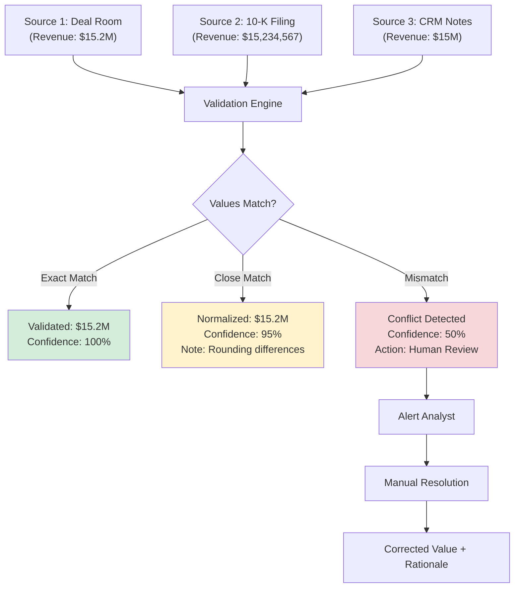
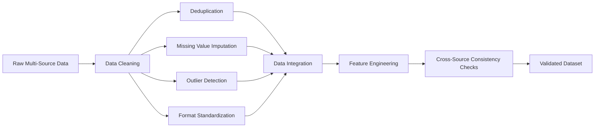
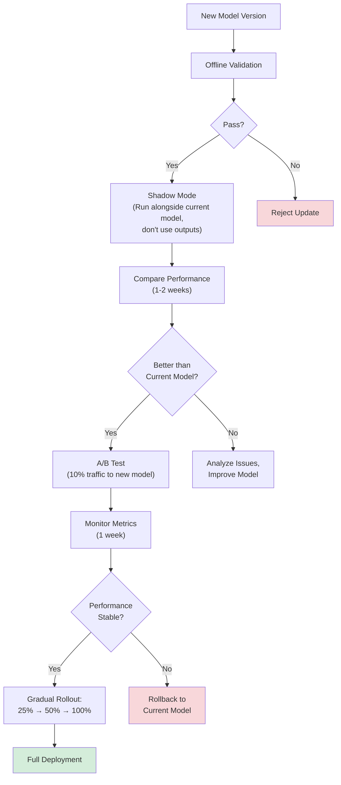

# Multi-Source Data Validation Methodologies for AI-Powered Financial Analysis

**Document Metadata**
- **Title**: Multi-Source Data Validation Methodologies for AI-Powered Financial Analysis
- **Date**: 2025-11-18
- **Sprint**: 05 - M&A Due Diligence Research Acceleration
- **Task**: 01 - Technical & Regulatory Landscape
- **Author**: technical-researcher skill agent

## Executive Summary

Multi-source data validation is critical for ensuring AI/ML model accuracy and reliability in financial due diligence, where decisions involve millions of dollars and incorrect data can lead to catastrophic outcomes. A paradigm shift from traditional model validation to AI/ML-specific methodologies requires upgraded Model Risk Management (MRM) policies incorporating k-fold cross-validation, nested cross-validation, and computationally intensive re-execution methods. Research shows comprehensive validation must integrate diverse data sources (CRM, databases, APIs), employ advanced preprocessing, and utilize combinations of machine learning and deep learning models. Explainable AI (XAI) addresses the "black box" concern, with model-agnostic methods enabling transparency for both business executives and technical stakeholders. A bibliometric review identified nine distinct research clusters covering fintech, risk management, anti-money laundering, and actuarial science applications.

## Key Findings

- **MRM Paradigm Shift**: Financial institutions upgrading MRM policies from traditional to AI/ML methodologies [Deloitte, 2024]
- **Cross-Validation Essential**: K-fold, LOOCV, nested cross-validation required for robust validation [TowardsDataScience, 2024]
- **Multi-Source Integration**: AI validates data across CRM, spreadsheets, databases, APIs [Numerous.ai, 2024]
- **XAI Critical**: Explainable AI addresses transparency concerns in financial ML applications [Springer, 2025]
- **Nine Research Clusters**: Bibliometric analysis identifies distinct AI/ML application domains in finance [ScienceDirect, 2023]
- **ACM Survey**: Comprehensive ML survey for identifying financial statement risks [ACM, 2024]

## 1. Model Validation Framework Evolution

### 1.1 Traditional vs. AI/ML Model Validation

**Traditional Model Validation** (Pre-AI):

- Linear models (regression, time series)
- Transparent, interpretable coefficients
- Straightforward assumption testing
- Static model parameters
- Annual revalidation cycles

**AI/ML Model Validation** (Current):

- Complex neural networks, ensemble methods
- "Black box" decision-making
- Data-driven feature learning
- Dynamic adaptation to new data
- Continuous monitoring required

**Paradigm Shift** [Deloitte, 2024]:

> "Model Risk Management (MRM) is a standard practice for financial institutions, but there's been a paradigm shift from traditional methodologies to AI/ML techniques, requiring upgraded MRM policies to capture and mitigate incremental risks from AI/ML methodologies."



### 1.2 Model Risk Management for AI/ML

**MRM Components Applied to AI/ML** [Federal Reserve SR 11-7, OCC 2011-12]:

| MRM Component | Traditional Application | AI/ML Application |
|--------------|------------------------|------------------|
| **Model Development** | Document assumptions, equations, parameters | Document data sources, feature engineering, algorithm selection, hyperparameters |
| **Model Validation** | Test assumptions, compare to alternatives | K-fold CV, holdout testing, back-testing, sensitivity analysis |
| **Model Governance** | Approval workflow, limitation statements | Use case documentation, ethical review, bias assessment |
| **Ongoing Monitoring** | Quarterly performance review | Real-time drift detection, periodic recalibration |
| **Audit Trail** | Change log, version control | Data lineage, model versioning, retraining logs |

**Incremental Risks from AI/ML**:

1. **Data Quality Risk**: Models highly sensitive to training data biases and errors
2. **Overfitting Risk**: Complex models may memorize training data, fail on new data
3. **Drift Risk**: Performance degradation as underlying data distribution changes
4. **Explainability Risk**: Difficulty explaining AI decisions to regulators and stakeholders
5. **Adversarial Risk**: Vulnerability to malicious inputs designed to fool models

## 2. Cross-Validation Methodologies

### 2.1 K-Fold Cross-Validation

**Purpose**: Assess model performance on multiple train/test splits to ensure generalization.

**Method** [TowardsDataScience, 2024]:



**Implementation**:

```python
from sklearn.model_selection import cross_val_score
from sklearn.ensemble import RandomForestClassifier

# Financial risk classifier example
model = RandomForestClassifier(n_estimators=100)

# 5-fold cross-validation
cv_scores = cross_val_score(
    model,
    X=financial_features,  # Features: ratios, trends, etc.
    y=risk_labels,         # Labels: high_risk, low_risk
    cv=5,                  # 5 folds
    scoring='f1_weighted'  # F1 score (balance precision/recall)
)

print(f"CV Scores: {cv_scores}")
print(f"Mean F1 Score: {cv_scores.mean():.3f} (+/- {cv_scores.std():.3f})")

# Acceptable threshold: Mean > 0.85, Std < 0.05
if cv_scores.mean() > 0.85 and cv_scores.std() < 0.05:
    print("Model validation: PASSED")
else:
    print("Model validation: FAILED - Requires improvement")
```

**Advantages**:
- Uses all data for both training and validation
- Provides robust performance estimate with confidence interval
- Detects overfitting (high train, low test performance)

**Disadvantages**:
- Computationally expensive (K training cycles)
- Assumes data is independent and identically distributed (IID)

### 2.2 Leave-One-Out Cross-Validation (LOOCV)

**Purpose**: Extreme case of k-fold (K = N) for small datasets.

**Method**:

For dataset with N samples:
- Train on N-1 samples
- Test on 1 remaining sample
- Repeat N times

**When to Use**:
- Small datasets (<1000 samples)
- High-value samples (each deal is unique in M&A)
- Maximum use of training data needed

**Implementation**:

```python
from sklearn.model_selection import LeaveOneOut

loo = LeaveOneOut()
scores = []

for train_index, test_index in loo.split(X):
    X_train, X_test = X[train_index], X[test_index]
    y_train, y_test = y[train_index], y[test_index]

    model.fit(X_train, y_train)
    score = model.score(X_test, y_test)
    scores.append(score)

print(f"LOOCV Mean Score: {np.mean(scores):.3f}")
```

**Advantages**:
- Maximizes training data usage
- No randomness in train/test splits

**Disadvantages**:
- Extremely computationally expensive (N training cycles)
- High variance in performance estimate
- Not suitable for large datasets

### 2.3 Nested Cross-Validation

**Purpose**: Unbiased hyperparameter tuning and model selection.

**Problem with Simple CV**: Using same data for hyperparameter tuning AND final validation leads to optimistic bias.

**Solution**: Nested CV structure [TowardsDataScience, 2024]:



**Implementation**:

```python
from sklearn.model_selection import GridSearchCV, cross_val_score

# Define hyperparameter grid
param_grid = {
    'n_estimators': [50, 100, 200, 500],
    'max_depth': [5, 10, 20, None],
    'min_samples_split': [2, 5, 10]
}

# Inner CV: Hyperparameter tuning (3-fold)
inner_cv = GridSearchCV(
    estimator=RandomForestClassifier(),
    param_grid=param_grid,
    cv=3,  # Inner folds
    scoring='f1_weighted'
)

# Outer CV: Performance estimation (5-fold)
outer_cv_scores = cross_val_score(
    inner_cv,  # Pass GridSearchCV as estimator
    X=features,
    y=labels,
    cv=5,      # Outer folds
    scoring='f1_weighted'
)

print(f"Nested CV Scores: {outer_cv_scores}")
print(f"Unbiased Performance: {outer_cv_scores.mean():.3f} (+/- {outer_cv_scores.std():.3f})")
```

**Critical for Financial ML**: Prevents overfitting to validation set, provides unbiased performance estimate for regulatory reporting.

## 3. Multi-Source Data Integration and Validation

### 3.1 Data Sources in M&A Due Diligence

**Typical Data Sources**:

| Source Type | Examples | Data Quality Challenges |
|------------|----------|------------------------|
| **Deal Room Documents** | Contracts, financials, legal docs | OCR errors, inconsistent formats, missing pages |
| **Public Filings** | 10-K, 10-Q, 8-K (SEC EDGAR) | Varied structures, unstructured text, tables |
| **Financial Databases** | CapIQ, Pitchbook, Bloomberg | API rate limits, subscription costs, data gaps |
| **CRM Systems** | Salesforce, HubSpot | Incomplete records, duplicate entries, stale data |
| **Spreadsheets** | Excel, Google Sheets | Formula errors, version conflicts, manual entry mistakes |
| **APIs** | Company websites, data providers | Inconsistent schemas, rate limits, downtime |
| **News & Media** | News articles, press releases | Bias, timeliness, relevance filtering |

### 3.2 AI-Powered Data Validation Across Sources

**Automated Cross-Referencing** [Numerous.ai, 2024]:

> "Many companies pull data from multiple sources (CRM, spreadsheets, financial databases, APIs), and AI-powered validation compares datasets from different systems, automatically correcting mismatched values."

**Validation Workflow**:



**Implementation**:

```python
class MultiSourceValidator:
    def validate_financial_metric(self, metric_name, sources):
        """
        Validate a financial metric across multiple data sources.

        Args:
            metric_name: e.g., "revenue", "EBITDA"
            sources: List of (source_name, value) tuples

        Returns:
            Validation result with confidence score
        """
        values = [self.normalize_value(v) for _, v in sources]

        # Check for exact agreement
        if len(set(values)) == 1:
            return {
                "status": "VALIDATED",
                "value": values[0],
                "confidence": 1.0,
                "sources": sources
            }

        # Check for close agreement (within 1%)
        mean_value = np.mean(values)
        if all(abs(v - mean_value) / mean_value < 0.01 for v in values):
            return {
                "status": "VALIDATED_WITH_ROUNDING",
                "value": mean_value,
                "confidence": 0.95,
                "sources": sources,
                "note": "Minor rounding differences detected"
            }

        # Significant mismatch
        return {
            "status": "CONFLICT",
            "values": dict(sources),
            "confidence": 0.5,
            "action": "HUMAN_REVIEW_REQUIRED",
            "reason": f"Values differ by more than 1%: {values}"
        }

    def normalize_value(self, value):
        """Convert various formats to numeric."""
        # Handle strings like "$15.2M", "15.2 million", "15234567"
        if isinstance(value, str):
            value = value.replace('$', '').replace(',', '').strip()

            # Convert M/B/K notation
            multipliers = {'K': 1e3, 'M': 1e6, 'B': 1e9}
            for suffix, mult in multipliers.items():
                if value.endswith(suffix):
                    return float(value[:-1]) * mult

        return float(value)
```

### 3.3 Comprehensive Validation Methodologies

**Research Finding** [Multiple sources, 2024]:

> "Comprehensive methodologies integrate diverse data sources, employ advanced preprocessing techniques, and utilize combinations of machine learning and deep learning models."

**Data Preprocessing Pipeline**:



**Advanced Techniques**:

| Technique | Purpose | Implementation |
|----------|---------|----------------|
| **Entity Resolution** | Match same entity across sources | Fuzzy string matching, ML deduplication models |
| **Temporal Alignment** | Align time series from different sources | Timestamp normalization, resampling |
| **Schema Mapping** | Map heterogeneous data structures | Ontology alignment, semantic matching |
| **Conflict Resolution** | Handle contradictory information | Voting, trust scoring, provenance tracking |
| **Missing Data Imputation** | Fill gaps in incomplete data | Mean/median imputation, ML-based imputation (MICE, KNN) |

## 4. Explainable AI (XAI) for Model Validation

### 4.1 The Black Box Problem

**Challenge** [Springer, 2025]:

> "The integration of AI and ML in financial applications has improved predictive capabilities in credit scoring, fraud detection, and risk assessment, but the opaque 'black box' nature raises critical concerns about transparency and trust, which Explainable AI (XAI) aims to address."

**Why Explainability Matters in Finance**:

- **Regulatory Compliance**: Regulators require explanations for adverse decisions (credit denials, etc.)
- **Risk Management**: Need to understand what drives model predictions
- **Model Validation**: Can't validate what you can't understand
- **Stakeholder Trust**: Executives and clients demand interpretability
- **Bias Detection**: Must identify and correct discriminatory patterns

### 4.2 Model-Agnostic XAI Methods

**Model-Agnostic** = works with any ML model (doesn't require access to internal structure)

**SHAP (SHapley Additive exPlanations)** [Springer, 2025]:

**Purpose**: Explain individual predictions by attributing contribution of each feature.

**How It Works**: Based on game theory (Shapley values), calculates marginal contribution of each feature.

```python
import shap
import xgboost as xgb

# Train model
model = xgb.XGBClassifier()
model.fit(X_train, y_train)

# Create SHAP explainer
explainer = shap.TreeExplainer(model)

# Explain a single prediction
shap_values = explainer.shap_values(X_test[0])

# Visualize
shap.force_plot(
    explainer.expected_value,
    shap_values,
    X_test[0],
    feature_names=feature_names
)
```

**Output**: Shows which features pushed prediction toward high risk vs. low risk, and by how much.

**LIME (Local Interpretable Model-agnostic Explanations)**:

**Purpose**: Explain individual predictions by fitting interpretable model locally.

**How It Works**: Perturb input, observe output changes, fit linear model to approximate local behavior.

```python
from lime.lime_tabular import LimeTabularExplainer

# Create explainer
explainer = LimeTabularExplainer(
    X_train,
    feature_names=feature_names,
    class_names=['Low Risk', 'High Risk'],
    mode='classification'
)

# Explain prediction
explanation = explainer.explain_instance(
    X_test[0],
    model.predict_proba,
    num_features=10
)

# Show explanation
explanation.show_in_notebook()
```

**Output**: Highlights top features influencing this specific prediction with weights.

### 4.3 Financial-Specific XAI Applications

**Use Case: Explaining Risk Assessment**:

```python
class ExplainableRiskAssessment:
    def assess_risk_with_explanation(self, company_data):
        # 1. Generate risk score
        risk_score = self.model.predict_proba(company_data)[0][1]  # Probability of high risk

        # 2. Generate SHAP explanation
        shap_values = self.explainer.shap_values(company_data)

        # 3. Identify top risk drivers
        feature_contributions = dict(zip(
            self.feature_names,
            shap_values[0]
        ))
        top_drivers = sorted(
            feature_contributions.items(),
            key=lambda x: abs(x[1]),
            reverse=True
        )[:5]

        # 4. Create human-readable explanation
        explanation = self.generate_narrative(top_drivers, risk_score)

        return {
            "risk_score": risk_score,
            "risk_level": "HIGH" if risk_score > 0.7 else "MEDIUM" if risk_score > 0.4 else "LOW",
            "top_risk_drivers": top_drivers,
            "explanation": explanation,
            "shap_values": shap_values,
            "model_version": self.model_version
        }

    def generate_narrative(self, top_drivers, risk_score):
        narrative = f"Risk Score: {risk_score:.2%}\n\n"
        narrative += "Key Risk Drivers:\n"

        for feature, contribution in top_drivers:
            direction = "increases" if contribution > 0 else "decreases"
            narrative += f"- {feature}: {direction} risk by {abs(contribution):.3f}\n"

        return narrative
```

**Example Output**:

```
Risk Score: 68%

Key Risk Drivers:
- Debt-to-Equity Ratio: increases risk by 0.234
- Revenue Growth (3Y CAGR): decreases risk by 0.189
- Days Sales Outstanding: increases risk by 0.156
- Customer Concentration (Top 3): increases risk by 0.142
- EBITDA Margin: decreases risk by 0.098

Explanation: The company exhibits elevated risk primarily due to high leverage
(Debt-to-Equity of 3.2x vs. industry average 1.5x) and customer concentration
(top 3 customers represent 67% of revenue). However, strong revenue growth
(25% CAGR) and healthy EBITDA margin (18%) partially mitigate these concerns.
```

## 5. Validation Best Practices for Financial AI

### 5.1 Pre-Deployment Validation Checklist

**Data Quality**:
- [ ] Data lineage documented for all sources
- [ ] Missing data percentage < 5% for critical features
- [ ] Outlier detection and treatment applied
- [ ] Class balance checked (imbalanced data addressed)
- [ ] Temporal leakage prevented (no future data in training)

**Model Performance**:
- [ ] Cross-validation performed (k-fold or nested CV)
- [ ] Performance metrics meet thresholds (accuracy, precision, recall, F1)
- [ ] Tested on holdout set (data model has never seen)
- [ ] Back-testing on historical data (for time series)
- [ ] Stress testing on edge cases

**Fairness and Bias**:
- [ ] Disparate impact analysis across deal types, industries, geographies
- [ ] Fairness metrics computed (demographic parity, equalized odds)
- [ ] Bias mitigation techniques applied if needed

**Explainability**:
- [ ] Model-agnostic explanations generated (SHAP, LIME)
- [ ] Feature importance documented
- [ ] Example explanations reviewed by domain experts

**Documentation**:
- [ ] Model card created (purpose, performance, limitations)
- [ ] Intended use cases documented
- [ ] Known limitations and failure modes identified
- [ ] Monitoring and retraining plan established

### 5.2 Ongoing Monitoring and Revalidation

**Performance Monitoring**:

```python
class ModelPerformanceMonitor:
    def monitor_drift(self, production_data, production_predictions):
        # 1. Data Drift Detection
        data_drift = self.detect_data_drift(production_data, self.training_data)

        # 2. Concept Drift Detection
        if len(production_predictions) > 1000:  # Sufficient data
            concept_drift = self.detect_concept_drift(production_predictions)

        # 3. Performance Degradation
        if self.has_ground_truth(production_data):
            current_performance = self.calculate_metrics(
                production_predictions,
                self.get_ground_truth(production_data)
            )
            performance_drop = self.training_performance - current_performance

            if performance_drop > 0.05:  # 5% drop threshold
                self.trigger_alert("Performance degradation detected")
                self.initiate_retraining()

        # 4. Log metrics
        self.log_monitoring_metrics({
            "timestamp": datetime.utcnow(),
            "data_drift_score": data_drift,
            "concept_drift_detected": concept_drift,
            "current_accuracy": current_performance.get('accuracy'),
            "prediction_count": len(production_predictions)
        })

    def detect_data_drift(self, production_data, training_data):
        """Detect if input data distribution has changed."""
        from scipy.stats import ks_2samp

        drift_scores = []

        for feature in self.feature_names:
            # Kolmogorov-Smirnov test
            statistic, p_value = ks_2samp(
                training_data[feature],
                production_data[feature]
            )

            if p_value < 0.05:  # Significant drift
                drift_scores.append((feature, statistic))
                self.log_warning(f"Drift detected in feature: {feature}")

        return drift_scores
```

**Retraining Triggers**:

| Trigger | Threshold | Action |
|---------|-----------|--------|
| **Performance Drop** | >5% decrease in F1 score | Immediate retraining |
| **Data Drift** | >3 features show significant drift | Scheduled retraining within 1 month |
| **Volume Threshold** | 10,000 new samples collected | Quarterly retraining |
| **Time-Based** | 6 months since last training | Scheduled retraining |
| **Regulatory Change** | New regulation impacting model | Immediate review and retraining |

### 5.3 A/B Testing for Model Updates

**Gradual Rollout Strategy**:



## 6. Industry Research and Trends

### 6.1 Bibliometric Analysis of AI/ML in Financial Services

**Study**: "AI & ML in Financial Services: Bibliometric Review" [ScienceDirect, 2023]

**Methodology**: Screened 39,498 articles, analyzed research trends

**Nine Distinct Research Clusters Identified**:

1. **Fintech Innovation**: Digital banking, payment systems, robo-advisors
2. **Risk Management**: Credit risk, market risk, operational risk modeling
3. **Anti-Money Laundering (AML)**: Transaction monitoring, suspicious activity detection
4. **Actuarial Science**: Insurance pricing, claims prediction, loss estimation
5. **Algorithmic Trading**: High-frequency trading, market making, arbitrage
6. **Credit Scoring**: Consumer credit, SME lending, alternative data
7. **Fraud Detection**: Payment fraud, identity theft, account takeover
8. **Regulatory Compliance**: RegTech, automated reporting, KYC/AML
9. **Customer Analytics**: Churn prediction, lifetime value, personalization

**Relevance to M&A Due Diligence**:

M&A due diligence AI intersects multiple clusters:
- Risk Management (target company risk assessment)
- Credit Scoring (creditworthiness evaluation)
- Fraud Detection (identifying red flags in financials)
- Regulatory Compliance (ensuring target's compliance status)

### 6.2 Machine Learning for Financial Statement Risk

**ACM Survey (2024)**: "Machine Learning for Identifying Risk in Financial Statements" [ACM Computing Surveys]

**Key Findings**:

- Comprehensive survey of ML techniques for financial statement analysis
- Applications: Fraud detection, earnings manipulation, bankruptcy prediction
- Datasets: Financial ratios, textual disclosures, audit opinions
- Models: Random forests, gradient boosting, neural networks

**Relevant Techniques for Due Diligence**:

| Technique | Application in DD | Performance |
|----------|------------------|-------------|
| **Random Forest** | Anomaly detection in financial ratios | High accuracy, interpretable |
| **XGBoost** | Bankruptcy prediction | State-of-the-art performance |
| **Text Mining** | Risk disclosure analysis | Identify red flags in MD&A |
| **Deep Learning** | Pattern recognition in complex financials | Highest accuracy, less interpretable |

## References

1. Deloitte (2024). *Adapting Model Validation in the Age of AI*. Retrieved from https://www.deloitte.com/global/en/Industries/financial-services/perspectives/adapting-model-validation.html

2. TowardsDataScience (2024). *AI/ML Model Validation Framework*. Retrieved from https://towardsdatascience.com/ai-ml-model-validation-framework-13dd3f10e824/

3. Numerous.ai (2025). *4 Best AI Data Validation Tools You Need to Know in 2025*. Retrieved from https://numerous.ai/blog/ai-data-validation

4. Springer (2025). *Model-agnostic Explainable Artificial Intelligence Methods in Finance: A Systematic Review*. Artificial Intelligence Review. Retrieved from https://link.springer.com/article/10.1007/s10462-025-11215-9

5. ACM (2024). *Machine Learning for Identifying Risk in Financial Statements: A Survey*. ACM Computing Surveys. Retrieved from https://dl.acm.org/doi/10.1145/3723157

6. Nature (2025). *AI Reshaping Financial Modeling*. npj Artificial Intelligence. Retrieved from https://www.nature.com/articles/s44387-025-00030-w

7. ScienceDirect (2023). *AI & ML in Financial Services: Bibliometric Review*. Retrieved from https://www.sciencedirect.com/science/article/pii/S2405844023107006

8. Frontiers (2024). *Predicting Financial Distress in TSX-Listed Firms Using Machine Learning Algorithms*. Frontiers in Artificial Intelligence. Retrieved from https://www.frontiersin.org/journals/artificial-intelligence/articles/10.3389/frai.2024.1466321/full

9. Harrisburg University (2024). *Utilizing AI for Improved Credit Risk Assessment*. Digital Commons. Retrieved from https://digitalcommons.harrisburgu.edu/cgi/viewcontent.cgi?article=1066&context=dandt

10. IJRIAS (2024). *AI-Powered Predictive Analytics for Financial Forecasting and Strategic Insight*. International Journal of Research and Innovation in Applied Science. Retrieved from https://rsisinternational.org/journals/ijrias/articles/ai-powered-predictive-analytics-for-financial-forecasting-and-strategic-insight/
