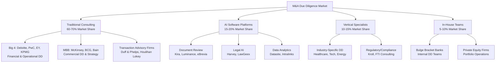
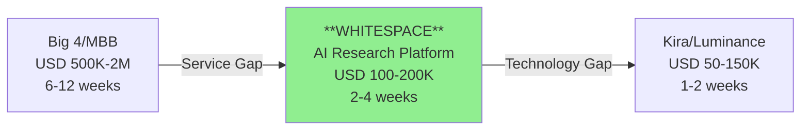

# Competitive Landscape Analysis: M&A Due Diligence Market

**Date**: 2025-11-18
**Author**: Market Analyst Agent
**Sprint**: 05 - M&A Due Diligence Research Acceleration
**Task**: 02 - Market & Competitive Assessment

---

## Executive Summary

The M&A due diligence market features a **three-tier competitive structure**: (1) **Traditional Consulting Firms** (Big 4 and MBB) dominating high-touch commercial and financial due diligence; (2) **AI-Powered Document Review Platforms** (Kira Systems, Luminance, eBrevia) automating contract analysis and legal review; and (3) **Emerging AI Research Platforms** targeting broader research automation beyond documents.

**Key Competitive Insights:**

- **Kira Systems leads AI DD software** with 64% penetration in Am Law 100 firms, 84% in top 25 global M&A firms
- **Big 4 consulting firms** (Deloitte, PwC, EY, KPMG) dominate financial DD with ~60% market share
- **MBB firms** (McKinsey, BCG, Bain) command premium pricing for commercial DD, with Bain as "gold standard"
- **Document-centric AI tools** (Kira, Luminance) focused on contract review; **gap exists** for broader research automation
- **Market fragmentation** creates opportunity for platforms integrating research, analysis, and synthesis

The competitive landscape reveals a **significant whitespace opportunity** for AI platforms that go beyond document review to automate end-to-end due diligence research, market analysis, and competitive intelligence.

---

## Competitive Structure Overview

---

## Tier 1: Traditional Consulting Firms

### Big 4 Consulting (Deloitte, PwC, EY, KPMG)

**Market Position**: Dominant in financial and operational due diligence

**Strengths:**

- **Market Share**: Estimated 50-60% of financial due diligence market
- **Service Breadth**: Financial, tax, IT, operational, and commercial DD capabilities
- **Global Footprint**: Offices in 150+ countries enable cross-border transactions
- **Deep Audit Integration**: Leverage audit relationships for transaction services cross-sell
- **Brand Trust**: Recognized by CFOs and audit committees as "safe choice"

**Service Mix:**

| Service Line | Primary Provider | Typical Fee Range |
|--------------|-----------------|-------------------|
| Financial Due Diligence | Big 4 | USD 75K-500K per deal |
| Quality of Earnings (QoE) | Big 4 | USD 35K-200K per review |
| Tax Structuring | Big 4 | USD 50K-300K per deal |
| IT Due Diligence | Big 4 + Specialists | USD 40K-150K per deal |
| Operational Due Diligence | Big 4 | USD 60K-250K per deal |

**Key Differentiators:**

1. **Audit Heritage**: Transaction services teams historically focused on financial DD, leveraging audit methodologies
2. **Regulatory Credibility**: Big 4 opinions carry weight with boards, lenders, and regulators
3. **Resource Scalability**: Can staff 20-50 consultants on megadeals within days
4. **Integration Services**: Post-merger integration (PMI) creates recurring revenue beyond DD

**Competitive Weaknesses:**

- **High Cost Structure**: Partner billing rates USD 800-1,500/hour; manager rates USD 400-600/hour
- **Slower Turnaround**: 4-8 week typical timeline for comprehensive financial DD
- **Limited Technology**: Still heavily reliant on Excel and PowerPoint; slow AI adoption
- **Conflicts of Interest**: Audit relationships limit ability to serve both buyer and seller

**Notable Players:**

- **Deloitte**: Largest transaction services practice globally (5,000+ professionals)
- **PwC**: Strong in cross-border deals; Deals practice integrated with Strategy&
- **EY**: Parthenon acquisition (2014) strengthened commercial DD capabilities
- **KPMG**: Focus on technology and healthcare sectors; strong in Asia-Pacific

### MBB Consulting (McKinsey, BCG, Bain)

**Market Position**: Premium commercial due diligence and strategic assessment

**Strengths:**

- **Strategic Insight**: Go beyond numbers to assess competitive positioning, growth strategy, management quality
- **Commercial DD Leadership**: Bain considered "gold standard" for commercial due diligence
- **C-Suite Relationships**: Direct access to CEO/board level for critical deal decisions
- **Industry Expertise**: Deep sector knowledge (e.g., BCG in healthcare, Bain in private equity)
- **Premium Pricing Power**: Command 30-50% premium vs. Big 4 for commercial DD

**Service Mix:**

| Service Line | Primary Provider | Typical Fee Range |
|--------------|-----------------|-------------------|
| Commercial Due Diligence | MBB (esp. Bain) | USD 150K-800K per deal |
| Strategic Assessment | MBB | USD 200K-1M per engagement |
| Market Opportunity Analysis | MBB | USD 100K-500K per study |
| Post-Merger Strategy | MBB | USD 300K-2M per engagement |

**Key Differentiators:**

1. **Bain's PE Focus**: From inception, Bain specialized in private equity consulting and due diligence
2. **Proprietary Frameworks**: BCG's strategic modules (market, competition, business plan, synergies)
3. **Management Assessment**: MBB firms excel at evaluating leadership teams and organizational capabilities
4. **Deal Thesis Validation**: Help PE firms refine investment theses and value creation plans

**Competitive Weaknesses:**

- **High Cost**: USD 2-5M typical for comprehensive commercial + strategic DD on $500M+ deal
- **Capacity Constraints**: Limited partner availability during busy deal seasons
- **Limited Financial Depth**: Financial modeling not as rigorous as Big 4 QoE work
- **Long Timelines**: 6-12 weeks typical for thorough commercial DD

**Notable Players:**

- **Bain & Company**: Clear leader in PE-focused commercial DD; "go-to" firm for sponsors
- **BCG**: Modular DD approach; strong in corporate M&A (vs. PE)
- **McKinsey**: Smaller transaction services footprint; focus on transformational deals

---

## Tier 2: AI-Powered Software Platforms

### Document Review Leaders

#### Kira Systems (Acquired by Litera, 2021)

**Market Position**: Clear market leader in AI-powered contract analysis for due diligence

**Key Metrics:**

- **Market Penetration**: 64% of Am Law 100 law firms; 84% of top 25 global M&A firms
- **Document Volume**: Processing 250,000+ documents monthly across user base
- **Pricing**: USD 50K-150K annual subscription for mid-sized law firms; enterprise pricing higher

**Technology Approach:**

- **Pre-Trained Models**: 1,200+ pre-built clause recognition models (change of control, liability caps, termination rights)
- **Machine Learning**: Supervised learning on millions of legal documents
- **Smart Fields**: Automated extraction of key contract terms into structured data
- **Integration**: Connects to virtual data rooms (Datasite, Intralinks, DealVDR)

**Strengths:**

- **First-Mover Advantage**: Founded 2011; 10+ years of training data and model refinement
- **Law Firm Network Effects**: Each new customer improves models; data flywheel
- **Litera Ecosystem**: Post-acquisition integration with document management, redlining, closing suites
- **Proven ROI**: 50-70% reduction in contract review time documented

**Weaknesses:**

- **Narrow Scope**: Focused on contract review; doesn't address broader research needs
- **Legal-Centric**: Product roadmap driven by law firms, not investment banks
- **Legacy Technology**: Pre-GPT architecture; slower to adopt generative AI
- **Pricing Friction**: Annual subscriptions + per-project fees create budget unpredictability

**Target Customers**: Large law firms (Am Law 100), corporate legal departments, Big 4 legal advisory

#### Luminance

**Market Position**: European-founded AI contract review challenger with pattern recognition approach

**Key Metrics:**

- **Market Share**: 3rd or 4th in AI legal DD space (after Kira, roughly tied with eBrevia)
- **Geographic Strength**: Strong in UK, Europe; expanding in US
- **Pricing**: Custom quotes; generally positioned as premium vs. Kira

**Technology Approach:**

- **Pattern Recognition**: Unsupervised learning to surface anomalies without pre-configuration
- **Generative AI Layer**: Added GPT capabilities to legacy ML models (2023-2024)
- **Unexpected Issues**: Markets ability to find problems users didn't know to look for
- **Multilingual**: Stronger non-English language support than Kira (German, French, Spanish)

**Strengths:**

- **Differentiated Positioning**: "AI that finds what you don't know to look for" vs. rules-based extraction
- **UI/UX**: More modern interface than Kira; easier onboarding
- **Cross-Border Deals**: Better for international M&A with multilingual documents
- **Flexibility**: Adapts to various document types beyond standard contracts

**Weaknesses:**

- **Smaller Training Dataset**: Less market penetration means fewer documents to learn from
- **Brand Recognition**: Lower awareness in US market vs. Kira
- **Law Firm Focus**: Like Kira, primarily serves legal teams rather than business DD teams
- **Higher Pricing**: Premium positioning limits adoption in mid-market

**Target Customers**: International law firms, European investment banks, cross-border corporate M&A

#### eBrevia (Owned by Donnelley Financial Solutions)

**Market Position**: Contract analysis specialist with strength in real estate and lease abstraction

**Key Metrics:**

- **Notable Wins**: Baker McKenzie selected eBrevia over Kira and Luminance (2017)
- **Pricing**: Not publicly disclosed; competitive with Kira
- **Specialization**: Strong in lease abstraction and real estate contracts

**Technology Approach:**

- **Specialized Modules**: Industry-specific extractors (Lease Abstractor for CRE)
- **Donnelley Integration**: Integrated with DFS virtual data room and compliance products
- **Generative AI**: Added GPT features in 2023-2024 like competitors

**Strengths:**

- **Real Estate Focus**: Differentiated expertise in lease and property due diligence
- **DFS Ecosystem**: Cross-sell to Donnelley's large financial services customer base
- **Competitive Wins**: Proven ability to win head-to-head against Kira/Luminance
- **M&A Pedigree**: Deep integration with corporate finance workflows

**Weaknesses:**

- **Narrower Market Position**: Lower overall market share than Kira/Luminance
- **Brand Confusion**: DFS corporate parent less well-known in legal AI space
- **Resource Constraints**: Smaller R&D investment than Litera-backed Kira
- **Limited International**: Weaker presence outside North America

**Target Customers**: Real estate M&A teams, corporate finance departments, mid-market investment banks

### Data Room and Workflow Platforms

#### Datasite (Merrill Corporation)

**Market Position**: Leading virtual data room (VDR) with basic AI features

**Key Capabilities:**

- **Secure Data Rooms**: Document sharing with granular permission controls
- **AI Redaction**: Automated identification of sensitive information for redaction
- **Q&A Management**: Structured due diligence request and response tracking
- **Analytics**: User activity tracking (who viewed which documents, time spent)

**Pricing**: USD 10K-50K per deal (varies by document count and user count)

**Strengths:**

- Market leader in VDR space; trusted for handling sensitive M&A documents
- Integration point for other AI tools (Kira, Luminance plug into Datasite)
- Network effects: Buyers expect sellers to use Datasite or Intralinks

**Weaknesses:**

- AI features are basic; not competing directly with Kira/Luminance
- Focused on document management, not analysis or research
- High switching costs prevent disruption, but also limit innovation pace

#### Intralinks

**Market Position**: #2 VDR provider with AI-powered insights layer

**Key Capabilities:**

- Virtual data room with security and compliance features
- **DealCentre AI**: Predictive analytics on deal progression and buyer engagement
- **Applied AI**: Automated document organization and anomaly detection

**Pricing**: Comparable to Datasite (USD 10K-50K per deal)

**Strengths:**

- Strong in financial services and private equity verticals
- DealCentre differentiator: Uses AI to predict which buyers are most engaged
- Integration with debt and equity capital markets workflows

**Weaknesses:**

- Losing market share to Datasite; #2 position solidifying
- AI features viewed as incremental, not transformative
- Focused on workflow efficiency, not research automation

---

## Tier 3: Vertical Specialists and Emerging Players

### Regulatory and Compliance Specialists

#### Kroll

**Focus**: Business intelligence, compliance, and cyber due diligence

**Key Services:**

- Background checks on management teams and beneficial owners
- Sanctions and anti-money laundering (AML) screening
- Cybersecurity due diligence and breach assessment
- Fraud investigation and forensic accounting

**Positioning**: Complements financial/commercial DD with risk-focused analysis

#### FTI Consulting

**Focus**: Forensic accounting, restructuring, and complex financial analysis

**Key Services:**

- Forensic accounting for fraud risk assessment
- Intellectual property valuation
- Disputed financial matters and litigation support
- Restructuring and distressed M&A due diligence

**Positioning**: Called in for high-risk deals or when fraud/misstatement suspected

### Technology and Cybersecurity DD

**Emerging Need**: 90%+ of technology M&A now includes cybersecurity due diligence

**Key Players:**

- **Bishop Fox**: Application security and penetration testing for tech DD
- **NCC Group**: Cybersecurity and risk mitigation for M&A
- **CrowdStrike**: Endpoint security assessment for target companies
- **Coalfire**: Compliance and security DD for regulated industries

**Pricing**: USD 25K-100K for technical security assessment

### Industry-Specific Boutiques

**Healthcare M&A DD:**

- **Leerink Partners**: Investment bank with integrated DD for healthcare
- **Medical device specialists**: Regulatory pathway and FDA compliance DD

**Technology M&A DD:**

- **FT Partners**: Fintech-focused with technology DD capabilities
- **Code review firms**: Assessment of software IP, technical debt, architecture

**Energy M&A DD:**

- **Seabury**: Transportation, maritime, aerospace & defense DD expertise
- **Reserve engineering**: Oil & gas asset valuation and technical DD

---

## Competitive Positioning Matrix

### Price vs. Scope Positioning

| Competitor Type | Price Point | Scope | Speed | Target Customer |
|----------------|-------------|-------|-------|----------------|
| **Big 4 Consulting** | USD 200K-1M per deal | Financial, Tax, IT, Operational DD | 4-8 weeks | Public companies, PE sponsors |
| **MBB Consulting** | USD 300K-2M per deal | Commercial, Strategic, Management Assessment | 6-12 weeks | PE sponsors, Strategic acquirers |
| **Kira Systems** | USD 50K-150K annual + deal fees | Contract review, Legal DD | 1-2 weeks | Law firms, Corporate legal |
| **Luminance** | USD 75K-200K annual | Contract review, Document analysis | 1-2 weeks | International law firms |
| **Vertical Specialists** | USD 50K-300K per deal | Regulatory, Cyber, Industry-specific | 2-4 weeks | Complex/high-risk deals |
| **VDR Platforms** | USD 10K-50K per deal | Document sharing, Basic AI | Real-time | All M&A transactions |

### Whitespace Opportunity

**The whitespace opportunity exists for platforms that:**

1. **Automate broader research** beyond document review (market analysis, competitive intelligence, regulatory research)
2. **Serve investment banks** (not just law firms) with business-focused outputs
3. **Deliver in days** (not weeks) at **fraction of consulting cost**
4. **Integrate research + analysis + synthesis** into unified workflow

---

## Competitive Threats and Barriers to Entry

### Threat 1: Kira Systems Expansion Beyond Contracts

**Risk**: Litera (Kira's owner) expands from contract review into broader due diligence research

**Likelihood**: Medium

**Mitigation**: Kira's roadmap driven by law firm customers; business research outside core competency

### Threat 2: Big 4 AI Investment

**Risk**: Deloitte, PwC, EY, KPMG build internal AI research tools to defend consulting revenue

**Likelihood**: Medium-High

**Indicators**: PwC launched "Powered by PwC" AI platform; Deloitte invested in generative AI centers

**Mitigation**: Big 4 incentivized to protect high-margin consulting; software cannibalizes services revenue

### Threat 3: OpenAI / Anthropic Direct Competition

**Risk**: Foundation model companies launch vertical AI agents for M&A due diligence

**Likelihood**: Low-Medium (near-term); High (long-term 3-5 years)

**Mitigation**: Domain expertise, data access, and regulatory compliance create moats vs. pure-play LLM providers

### Threat 4: Investment Bank Internal Development

**Risk**: Bulge bracket banks build proprietary AI research tools

**Likelihood**: High for bulge brackets; Low for mid-market (target segment)

**Evidence**: Goldman Sachs, Morgan Stanley investing heavily in AI/ML

**Mitigation**: Focus on 50-200 FTE mid-market banks lacking AI talent and resources

### Barrier to Entry: Data Access

**Challenge**: Accessing proprietary databases (S&P Capital IQ, FactSet, Bloomberg) requires expensive licenses

**Competitive Advantage**: Established players have legacy data relationships and volume pricing

**Mitigation**: Partner with data providers; build web scraping + public data aggregation; allow customers to BYOD (bring your own data)

### Barrier to Entry: Trust and Security

**Challenge**: Due diligence involves highly sensitive financial information; security breaches catastrophic

**Requirement**: SOC 2 Type II compliance, on-premise deployment options, customer data isolation

**Competitive Advantage**: Incumbent platforms (Kira, Datasite) have years of security track record

**Mitigation**: Prioritize security architecture; obtain certifications early; offer air-gapped deployment for sensitive deals

---

## Competitive Strategy Recommendations

### Differentiation Strategy

**Position as "Research Automation" vs. "Document Review"**

- Kira/Luminance own contract analysis; don't compete head-to-head
- Focus on end-to-end research workflow: data gathering → analysis → synthesis → report generation
- Target business users (analysts, associates, VPs) not legal teams

### Target Market Strategy

**Focus on Underserved Mid-Market Segment**

- Bulge brackets build internal; boutiques too small for software investment
- **Sweet spot: 50-200 FTE investment banks and M&A advisory firms**
- These firms have deal volume to justify platform but lack resources for internal AI development

### Pricing Strategy

**Hybrid: Subscription + Deal-Based**

- Base subscription (USD 100-150K annually) covers platform access and core research
- Per-deal fees (USD 15-25K) scale with usage and create land-and-expand motion
- Undercut Big 4 consulting by 70-80% while delivering 90% of value

### Go-To-Market Strategy

**Partner with VDR Providers**

- Integrate with Datasite/Intralinks to access deal flow
- Position as "research layer" on top of document management
- Co-marketing: "Complete DD Platform" (VDR + Research + Analysis)

**Target PE Portfolio Operations Teams**

- PE firms are early AI adopters (82% using AI)
- Portfolio operations teams coordinate DD across multiple deals annually
- Can influence which banks/advisors to use on portfolio company exits

---

## References

1. Legaltech Hub. (2024). *Due Diligence Software Market Analysis*. Retrieved from https://www.legaltechnologyhub.com
2. Artificial Lawyer. (2025). *Which Legal AI Tools Are Law Firms Actually Using?*. Retrieved from https://www.artificiallawyer.com
3. CaseCoach. (2024). *Big-4 Consulting vs McKinsey, BCG & Bain: How They Differ*. Retrieved from https://casecoach.com
4. Boston Consulting Group. (2024). *Successful Due Diligence: How BCG Supports Strategic Due Diligence*. Retrieved from https://media-publications.bcg.com
5. Capterra. (2025). *Kira Software Pricing and Reviews*. Retrieved from https://www.capterra.com
6. Tools for Humans. (2025). *Kira Systems Review 2025 - Features, Pricing & Deals*. Retrieved from https://www.toolsforhumans.ai
7. AI Content Hub. (2024). *Luminance vs Kira Systems: AI Due Diligence Platform Analysis*. Retrieved from https://aicontenthub.contractreview.net
8. Legal IT Insider. (2017). *Baker McKenzie selects eBrevia for contract review*. Retrieved from https://legaltechnology.com
9. Mergers & Inquisitions. (2024). *Top Investment Banks: Rankings by Tier and Category*. Retrieved from https://mergersandinquisitions.com
10. Wilcox Investment Bankers. (2024). *Bulge Brackets vs. Boutiques vs. Middle Markets*. Retrieved from https://www.wilcoxinvestmentbankers.com
