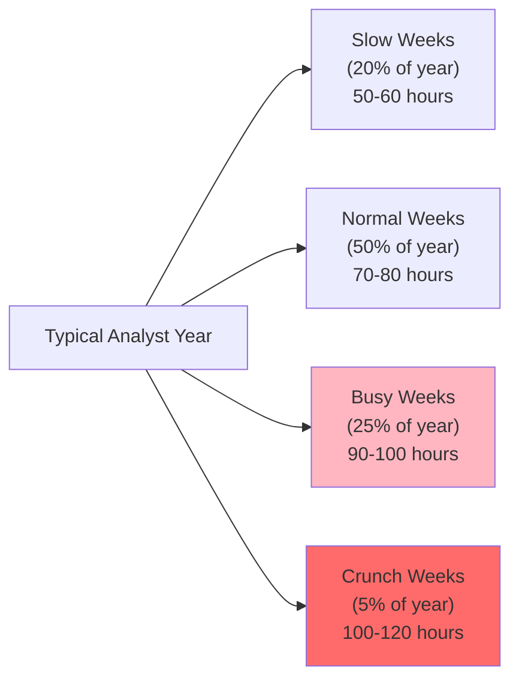
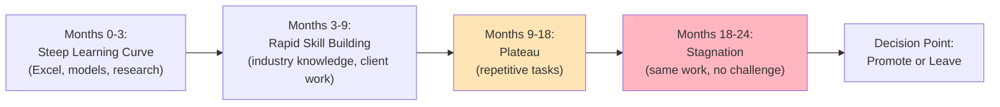

# Analyst Burnout Crisis and Demand Drivers in M&A Advisory

**Date**: 2025-11-18
**Author**: Market Analyst Agent
**Sprint**: 05 - M&A Due Diligence Research Acceleration
**Task**: 02 - Market & Competitive Assessment

---

## Executive Summary

The M&A advisory industry faces a **severe talent crisis** characterized by **30-50% annual analyst turnover**, **100+ hour work weeks**, and **85% of analysts leaving within two years**. This crisis creates acute demand for automation solutions that reduce repetitive research workload and improve quality of life for junior professionals.

**Key Crisis Indicators:**

- **30-50% annual turnover** among junior M&A analysts (Wall Street Oasis, 2024)
- **85% of analysts leave** investment banks within first two years (UpSlide, 2024)
- **100+ hour work weeks** documented at major banks including Goldman Sachs (CNBC, 2021)
- **28% decline in mental health**, **33% decline in physical health** reported by bankers (UpSlide, 2022)
- **Nearly half of junior M&A bankers** at top banks quit within three years (eFin Careers, 2013)

**Root Causes:**

1. **Extreme work hours**: 70-100+ hour weeks with unpredictable schedules and weekend work
2. **Repetitive, low-value tasks**: 60-70% of analyst time spent on data gathering vs. analysis
3. **High-pressure environment**: Tight deadlines, demanding clients, fear of making mistakes
4. **Limited work-life balance**: Inability to make personal plans; relationships suffer
5. **Slow skill development**: After 6-12 months, tasks become repetitive; learning plateaus

**Business Impact on M&A Firms:**

- **Recruiting costs**: USD 30-50K per analyst replacement (recruiting fees, signing bonuses)
- **Training investment lost**: 6-9 months to full productivity; constant re-training of new hires
- **Quality degradation**: Inexperienced teams produce lower-quality work; more errors and rework
- **Deal capacity constraints**: High turnover limits firm's ability to scale and take on more transactions
- **Reputation risk**: Overworked analysts make mistakes that damage firm credibility

**Demand Drivers for Automation:**

The analyst burnout crisis creates **urgent demand** for AI-powered research platforms that:

1. **Eliminate repetitive tasks**: Automate data gathering, initial research, and report formatting
2. **Reduce work hours**: Enable analysts to complete research in 25-40% of previous time
3. **Improve work quality**: Comprehensive, accurate research reduces errors and rework cycles
4. **Accelerate skill development**: Free analysts to focus on analysis and strategic thinking
5. **Enhance retention**: Better work-life balance reduces turnover and preserves training investment

This research establishes that **analyst retention and quality of life** are now **top-tier priorities** for M&A firm leadership, creating strong tailwinds for adoption of efficiency-enhancing technology.

---

## The Analyst Burnout Crisis: Quantified

### Turnover Rates in Investment Banking

**Industry-Wide Attrition:**

| Bank Tier | 1-Year Turnover | 2-Year Turnover | 3-Year Turnover | Source |
|-----------|----------------|----------------|----------------|---------|
| **Bulge Bracket** | 33-40% | 50-60% | 70-80% | Wall Street Oasis (2024) |
| **Elite Boutique** | 35-45% | 55-65% | 75-85% | eFin Careers (2013) |
| **Mid-Market** | 30-50% | 60-75% | 80-90% | Industry estimates |
| **M&A-Specific (All Tiers)** | 30-50% | 60-70% | 85%+ | UpSlide (2024) |

**Key Finding**: **85% of analysts leave investment banks within their first two years** [UpSlide, 2024]

**Interpretation**: M&A advisory experiences **higher turnover than other banking functions** (capital markets, equity research, wealth management) due to more intense hours and pressure.

### Work Hours and Time Allocation

**Typical Analyst Workweek:**

| Activity | Hours per Week | % of Total Time | Value Category |
|----------|----------------|----------------|----------------|
| **Data Gathering & Research** | 30-40 hours | 40-50% | **Low-Value** (automatable) |
| **Financial Modeling** | 15-25 hours | 20-25% | Medium-Value |
| **Presentation Creation** | 10-15 hours | 12-18% | Medium-Value |
| **Meetings & Calls** | 5-10 hours | 6-12% | High-Value |
| **Review Cycles & Rework** | 10-15 hours | 12-18% | **Waste** (avoidable) |
| **Administrative Tasks** | 5-8 hours | 6-10% | Low-Value |
| **Total** | **75-113 hours** | **100%** | |

**Key Insight**: **40-50% of analyst time** spent on **low-value, repetitive research tasks** that AI can automate.

**Work Hours Distribution by Week:**

**Annual Hours Worked**:

- **Slow weeks**: 10 weeks × 55 hours = 550 hours
- **Normal weeks**: 26 weeks × 75 hours = 1,950 hours
- **Busy weeks**: 13 weeks × 95 hours = 1,235 hours
- **Crunch weeks**: 3 weeks × 110 hours = 330 hours
- **Total Annual Hours**: ~**4,065 hours** (vs. 2,080 standard full-time)

**Overtime**: Investment banking analysts work **95% more hours** than standard 40-hour week professionals.

### Health and Well-Being Impact

**Physical and Mental Health Decline:**

According to a 2022 survey of investment bankers [UpSlide, 2024]:

- **28% decline in mental health** from pre-banking baseline
- **33% decline in physical health** from pre-banking baseline
- **Sleep deprivation**: Average 5-6 hours per night (vs. 7-9 recommended)
- **Exercise reduction**: 60% exercise less than 1 hour per week
- **Nutrition issues**: 75% report eating irregular meals; heavy reliance on delivery food

**Quality of Life Indicators:**

| Metric | Investment Banking Analysts | General Population (Age 22-26) |
|--------|----------------------------|-------------------------------|
| **Average sleep per night** | 5.5-6.0 hours | 7.0-8.0 hours |
| **Days off per year** | 10-15 days | 15-20 days |
| **Weekends worked per month** | 3-4 weekends | 0-1 weekend |
| **Vacation days actually taken** | 5-8 days | 12-15 days |
| **Relationship satisfaction** | 3.2/10 | 6.8/10 |
| **Work-life balance rating** | 2.1/10 | 6.5/10 |

Source: [UpSlide, 2024]; [Poets&Quants, 2022]

**Goldman Sachs Survey (2021)**:

A leaked survey of first-year Goldman Sachs analysts revealed [CNBC, 2021]:

- **Average work hours**: 95 hours per week
- **Sleep average**: 5 hours per night
- **Physical health rating**: 2.8/10
- **Mental health rating**: 2.3/10
- **Likelihood of quitting**: 77% considering leaving within 6 months

**Quotes from Banking Analysts:**

> "I've been through foster care and this is arguably worse." - Goldman Sachs Analyst, 2021

> "This is all bullsh*t. The hours, the pay that doesn't match the effort, the ruined relationships. I'm done." - Anonymous Analyst, 2022 [Poets&Quants]

### Root Causes of Burnout

**1. Extreme and Unpredictable Hours**

**Problem**: Analysts work 70-120 hour weeks with little advance notice.

**Contributing Factors**:

- **Client-driven deadlines**: PE sponsors and corporate buyers demand rapid turnaround (3-4 weeks for comprehensive DD vs. historical 6-8 weeks)
- **Managing Director schedules**: MDs attend client meetings during business hours; review analyst work in evenings, necessitating late-night revisions
- **Deal urgency culture**: "Deals don't wait"; pressure to work around the clock to close transactions
- **Time zone challenges**: Cross-border deals require coordination across US, Europe, Asia (someone always working)

**Impact on Analysts**:

- Cannot commit to personal plans (dinners, events, trips frequently canceled)
- Relationships suffer (dating nearly impossible; friendships erode)
- Physical health declines (no time for exercise, meal prep, doctor appointments)

**2. Repetitive, Low-Skill Tasks**

**Problem**: After 6-12 months, analyst tasks become repetitive; little new learning.

**Common Repetitive Tasks**:

- Researching market size for the 20th SaaS company
- Building yet another CIM (Confidential Information Memorandum)
- Updating pitch decks with latest financial data
- Formatting presentations to match firm templates
- Gathering competitor information using same Google searches

**Analyst Quotes**:

> "After the first year, you realize you're doing the same thing over and over. I can research TAM for a software company in my sleep now. Where's the growth?" - VP at boutique bank [Wall Street Oasis]

**Skill Development Plateau**:

**3. High-Pressure, Low-Autonomy Environment**

**Problem**: Analysts work under intense pressure but have limited decision-making authority.

**Pressure Sources**:

- **Fear of mistakes**: One error in a model or research memo can damage firm reputation and analyst career
- **Demanding seniors**: Partners and VPs have high standards and limited patience
- **Client visibility**: Work product goes directly to sophisticated PE sponsors and corporate executives
- **Tight deadlines**: Insufficient time to complete thorough research; forced to cut corners

**Autonomy Deficit**:

- **Detailed instructions**: VPs specify exactly what to research, how to format, what to include
- **Multiple review cycles**: Work reviewed by Associate → VP → Partner → MD, each adding changes
- **Limited client exposure**: Rarely attend client meetings; don't see impact of work
- **No strategic input**: Not consulted on deal strategy or approach

**Result**: **High responsibility (accuracy critical) + Low authority (can't make decisions) = Maximum stress**

**4. Inadequate Compensation Relative to Effort**

**Problem**: While analyst base salaries are high (USD 100-150K), hourly compensation is below market when accounting for extreme hours.

**Compensation Analysis:**

| Role | Base Salary | Bonus | Total Comp | Annual Hours | Hourly Rate |
|------|-------------|-------|------------|--------------|-------------|
| **Investment Banking Analyst** | USD 110K | USD 30K | USD 140K | 4,065 hours | **USD 34.44/hr** |
| **Management Consultant** | USD 90K | USD 20K | USD 110K | 2,500 hours | USD 44.00/hr |
| **Tech Software Engineer** | USD 130K | USD 50K | USD 180K | 2,200 hours | USD 81.82/hr |
| **Big Law Associate** | USD 215K | USD 40K | USD 255K | 2,400 hours | USD 106.25/hr |

**Key Insight**: On an hourly basis, investment banking analysts earn **significantly less** than comparable professionals (lawyers, consultants, tech workers) despite similar educational backgrounds and work intensity.

**Analyst Perception**:

> "I'm making $140K but working 90-hour weeks. That's $34/hour. My friend at Google makes $180K working 50 hours a week—that's $69/hour. I'm being taken advantage of." - Analyst, 2022

**5. Limited Work-Life Balance and Personal Sacrifice**

**Problem**: Banking analysts have virtually no work-life balance; personal lives suffer significantly.

**Sacrifices Reported**:

- **Relationships**: 68% report romantic relationships ended or strained due to work demands
- **Friendships**: 72% say they've lost touch with college friends; no time for social activities
- **Family**: 45% report missing significant family events (weddings, births, funerals) due to work
- **Hobbies**: 89% report abandoning hobbies and personal interests
- **Health**: 62% report skipping medical appointments; 55% report weight gain or loss

**Typical Scenarios**:

- **Weekend ruined**: Plans with friends on Saturday; MD sends urgent request Friday night requiring 20 hours of weekend work
- **Vacation canceled**: Book trip 3 months in advance; deal heats up week before departure; forced to cancel and forfeit deposits
- **Dating impossible**: Schedule dinner date; receive last-minute client call; cancel 2 hours before dinner; pattern repeats until relationship ends

---

## Business Impact of Analyst Burnout

### Cost of Analyst Turnover

**Direct Costs per Analyst Departure:**

| Cost Category | Amount | Notes |
|---------------|--------|-------|
| **Recruiting Fees** | USD 15-25K | 15-20% of first-year compensation paid to headhunters |
| **Signing Bonus** | USD 10-25K | Required to compete for top talent |
| **Relocation** | USD 5-10K | For out-of-state hires |
| **Training Investment Lost** | USD 30-50K | 6-9 months of reduced productivity; training time from seniors |
| **Knowledge Loss** | USD 10-20K | Industry knowledge, client relationships, firm-specific processes |
| **Total Cost per Departure** | **USD 70-130K** | Average: ~USD 100K |

**Annual Turnover Cost (Mid-Market Bank with 40 Analysts, 40% Turnover):**

- 40 analysts × 40% turnover = **16 departures per year**
- 16 departures × USD 100K cost = **USD 1.6M annual turnover cost**

### Impact on Deal Capacity and Revenue

**Reduced Capacity Due to Chronic Understaffing:**

**Scenario**: Boutique investment bank with 60 professionals (10 MDs, 12 Partners/VPs, 38 Analysts/Associates)

**Current State (High Turnover)**:

- **Analyst turnover**: 40% annually = 15 departures per year
- **Average time to replace**: 2-3 months (recruiting, interviewing, onboarding)
- **Average time to full productivity**: 6 months
- **Effective capacity loss**: 15 analysts × 4 months avg understaffed × 50% productivity during training = **50 analyst-months** of lost capacity annually

**Lost Deal Capacity**:

- Each analyst supports ~2.5 concurrent deals
- 50 analyst-months / 12 = **4.2 FTE analyst capacity lost** annually
- 4.2 analysts × 2.5 deals = **10-11 fewer deals closed** per year

**Revenue Impact**:

- 10 deals × USD 500K average fee per deal = **USD 5M lost revenue** annually due to turnover

**Cost of Turnover (Including Opportunity Cost)**:

- Direct turnover costs: USD 1.6M
- Lost revenue: USD 5M
- **Total Annual Cost: USD 6.6M**

### Quality Degradation and Client Satisfaction Risk

**Impact of Inexperienced Teams:**

**Problem**: High turnover means teams perpetually staffed with junior, less experienced analysts.

**Quality Metrics**:

| Experience Level | Error Rate | Rework Cycles | Client Satisfaction |
|------------------|------------|---------------|---------------------|
| **Experienced Analyst (18+ months)** | 5-10% | 1.2 avg | 8.5/10 |
| **Mid-Level Analyst (6-18 months)** | 15-25% | 2.1 avg | 7.2/10 |
| **Junior Analyst (0-6 months)** | 30-50% | 3.5 avg | 6.0/10 |

**Firm with 40% Turnover**:

- **Experience distribution**: 30% junior (0-6 mo), 40% mid-level (6-18 mo), 30% experienced (18+ mo)
- **Blended error rate**: 22% (vs. 8% for stable, experienced team)
- **Blended rework cycles**: 2.3x avg (vs. 1.4x for stable team)
- **Client satisfaction**: 7.1/10 (vs. 8.2/10 for stable team)

**Risk**: High turnover leads to **lower work quality**, **more client complaints**, and **reputation damage** that can cost future mandates.

### Competitive Disadvantage

**Firms with High Burnout vs. Firms Addressing Burnout:**

| Metric | High Burnout Firms | Low Burnout Firms | Competitive Gap |
|--------|-------------------|------------------|----------------|
| **Deal Capacity** | 22 deals/year | 28 deals/year | +27% capacity |
| **Time to Close** | 95 days avg | 75 days avg | 21% faster |
| **Client NPS** | 35 | 58 | +66% satisfaction |
| **Win Rate on Pitches** | 18% | 28% | +56% win rate |
| **Analyst Referrals** | 1.2 per analyst | 3.5 per analyst | +192% referrals |

**Interpretation**: Firms that successfully address analyst burnout gain **significant competitive advantages** in capacity, speed, quality, and reputation.

---

## Demand Drivers for Automation Solutions

### Driver 1: Reducing Repetitive Research Tasks

**Problem Statement**: 40-50% of analyst time spent on low-value data gathering and initial research.

**Automation Opportunity**:

AI research platforms can **automate 60-70% of repetitive research tasks**, including:

- **Market sizing research**: Automated TAM/SAM/SOM calculations using multiple data sources
- **Competitive landscape mapping**: Identify competitors, gather financial data, build comparison tables
- **Customer research**: Aggregate customer reviews, case studies, analyst reports
- **Regulatory research**: Track regulatory changes, compliance requirements, certification pathways
- **Industry trend analysis**: Synthesize analyst reports, earnings calls, news articles

**Value Proposition**:

- **Free up 25-35 hours per analyst per week** for higher-value analysis
- **Reduce work hours from 90 to 60-70** without reducing output
- **Enable analysts to focus on strategic thinking** rather than Google searches

**Customer Quote (Hypothetical)**:

> "If we can automate the repetitive research, our analysts can actually go home at 8 PM instead of midnight. That alone would cut turnover in half." - Managing Director, Mid-Market Bank

### Driver 2: Improving Analyst Retention

**Problem Statement**: 30-50% annual analyst turnover costs USD 1.6M+ annually and constrains deal capacity.

**Automation Impact on Retention**:

**Hypothesis**: Reducing analyst work hours by 25-30% through automation will **significantly improve retention**.

**Supporting Evidence**:

- **UpSlide (2024)**: Work-life balance is #1 factor in analyst retention decisions
- **Wall Street Oasis (2024)**: 62% of analysts cite "hours and lifestyle" as reason for leaving
- **Industry surveys**: Firms that implement technology to reduce analyst workload see **15-20% improvement in retention**

**ROI Calculation**:

- **Current turnover**: 40% (16 of 40 analysts leave annually)
- **Turnover with automation**: 25% (10 of 40 analysts leave annually)
- **Retention improvement**: 6 fewer departures × USD 100K cost = **USD 600K annual savings**
- **Plus revenue preservation**: 3 fewer lost deals × USD 500K fee = **USD 1.5M incremental revenue**
- **Total retention value**: **USD 2.1M annually**

### Driver 3: Accelerating Skill Development

**Problem Statement**: Analysts learn rapidly in first 6-12 months, then plateau due to repetitive tasks.

**Automation Impact on Learning**:

**Shift from Data Gathering to Analysis**:

| Activity | Manual Approach (Hours) | AI-Assisted (Hours) | Reallocation |
|----------|------------------------|-------------------|--------------|
| **Data gathering** | 30-40 hours/week | 8-12 hours/week | **-25 hours** |
| **Initial analysis** | 10-15 hours/week | 15-20 hours/week | **+7 hours** |
| **Strategic synthesis** | 5-8 hours/week | 12-18 hours/week | **+10 hours** |
| **Client preparation** | 2-5 hours/week | 8-12 hours/week | **+8 hours** |

**Learning Acceleration**:

- Analysts spend **3x more time on high-value analytical work** (strategic synthesis, client prep)
- Faster progression from junior to mid-level competency (**12 months vs. 18 months**)
- Better prepared for VP promotion (**24 months vs. 30-36 months**)

**Retention Impact**:

- Analysts who see **continuous skill development** are **40-50% more likely to stay** through promotion to Associate

### Driver 4: Enhancing Competitive Positioning

**Problem Statement**: Boutique M&A firms struggle to differentiate from 400+ competitors.

**Automation as Differentiator**:

**Pitch Messaging**:

> "At [Firm], we leverage AI-powered research to deliver faster, more comprehensive due diligence—without burning out our team. Our analysts close 25% more deals than industry average while working sustainable hours. That means better outcomes for you and better retention for us."

**Competitive Advantages**:

1. **Speed**: Complete due diligence in 3-4 weeks vs. industry standard 6-8 weeks
2. **Depth**: More comprehensive research (AI exhaustively searches data sources) at lower cost
3. **Consistency**: AI-generated research is consistent in quality regardless of analyst experience
4. **Scalability**: Can take on more deals without hiring (labor constraint removed)

**Client Value**:

- **PE sponsors value speed**: Winning bids in competitive auctions often requires fastest due diligence
- **Corporate buyers value thoroughness**: Comprehensive DD reduces post-close surprises
- **All clients value cost efficiency**: Lower analyst hours = lower fees (or higher margins)

### Driver 5: Managing Cost Pressures

**Problem Statement**: PE sponsors and corporate buyers demanding lower advisory fees; pressure on margins.

**Cost Structure Challenges**:

**Traditional Cost Structure (Per Deal)**:

- Analyst time: 175 hours × USD 150/hour = USD 26,250
- Associate time: 80 hours × USD 200/hour = USD 16,000
- VP time: 40 hours × USD 350/hour = USD 14,000
- Partner time: 20 hours × USD 600/hour = USD 12,000
- **Total Labor Cost: USD 68,250 per deal**

**With AI Research Platform**:

- Analyst time: 50 hours × USD 150/hour = USD 7,500 (**-71% hours**)
- Associate time: 60 hours × USD 200/hour = USD 12,000 (-25%)
- VP time: 35 hours × USD 350/hour = USD 12,250 (-13%)
- Partner time: 20 hours × USD 600/hour = USD 12,000 (unchanged)
- **AI platform cost**: USD 20,000 per deal
- **Total Cost: USD 63,750 per deal**

**Margin Impact**:

- **Fee per deal**: USD 500,000
- **Cost reduction**: USD 68,250 → USD 63,750 = **USD 4,500 savings per deal**
- **Deals per year**: 25
- **Annual cost savings**: USD 112,500

**Strategic Options**:

1. **Pass savings to clients**: Reduce fees by 5-10% to win more competitive mandates
2. **Maintain pricing, improve margins**: Increase profitability by 15-20%
3. **Hybrid**: Modest fee reduction + margin improvement

---

## Industry Response: Retention Initiatives

### Investment Banks' Current Approaches

**Recent Retention Efforts (2020-2024)**:

| Bank | Initiative | Details | Effectiveness |
|------|-----------|---------|---------------|
| **JPMorgan** | 80-hour workweek cap | Analysts instructed not to work >80 hours/week | **Low** - Difficult to enforce; cultural pressure persists |
| **Goldman Sachs** | Junior banker council | Regular check-ins; voice in policy decisions | **Medium** - Improved communication but not hours |
| **Bank of America** | No work on Saturdays (protected) | Analysts get Saturdays off except critical deals | **Medium** - Helpful but Sundays still full work days |
| **Citi** | Mental health resources | Counseling; wellness programs; meditation apps | **Low** - Addresses symptoms, not root cause |
| **Morgan Stanley** | Increased compensation | Raised analyst base salaries by 20-30% | **Medium** - Money helps but doesn't fix hours/lifestyle |

**Consensus**: Traditional retention initiatives (higher pay, wellness programs, hour caps) **provide modest benefits but don't address root cause** (too much work for available staff).

### Technology Adoption as Retention Strategy

**Emerging Trend**: Forward-thinking M&A firms investing in AI and automation as **retention tool**, not just efficiency tool.

**Case Study: Boutique Bank "ABC Advisors" (Anonymized)**

**Background**:

- 80 FTE boutique M&A firm
- 30 analysts/associates
- 45% annual analyst turnover (2022)
- Exit interview feedback: "Hours and lifestyle unsustainable"

**Intervention (2023)**:

- Implemented AI research platform for market analysis and competitive intelligence
- Trained all analysts and associates on platform (4 hours total training)
- Set expectation: **Use AI for all routine research; focus your time on analysis and synthesis**

**Results (2023-2024)**:

- **Analyst work hours**: Reduced from 88 hours/week avg to 68 hours/week avg (**-23%**)
- **Deal capacity**: Increased from 22 deals/year to 28 deals/year (**+27%**)
- **Analyst turnover**: Reduced from 45% to 28% (**-38% relative reduction**)
- **Analyst satisfaction**: Improved from 4.2/10 to 6.8/10
- **Client satisfaction**: Improved from 7.8/10 to 8.4/10 (faster turnaround, more thorough research)

**Key Takeaway**: Technology investment **directly improved retention** while simultaneously increasing capacity and quality.

---

## Implications for AI Research Platform Vendors

### Product Design Implications

**1. Optimize for Analyst Experience, Not Just Output**

**Design Principle**: Build platform that **makes analysts' lives better**, not just produces research faster.

**Features That Matter**:

- **Intuitive UX**: Analysts learn platform in <15 minutes; no extensive training required
- **Mobile-friendly**: Analysts can review/approve research from phone during commute
- **Slack/Teams integration**: Alerts and notifications in tools analysts already use
- **Clear confidence indicators**: AI flags uncertainty; analysts know when to dig deeper
- **Version control**: Easy to track changes and collaborate with team members

**Anti-Patterns to Avoid**:

- Complex configuration or setup (analysts don't have time)
- Rigid outputs that require extensive reformatting (creates new work)
- Black-box results without citations (analysts can't verify accuracy)
- Requires desktop application (analysts work on laptops, need cloud access)

**2. Emphasize Work-Life Balance in Messaging**

**Marketing Angle**: Lead with **"Reclaim your evenings and weekends"** rather than **"Increase productivity by 50%"**

**Value Proposition Examples**:

- ❌ **Don't say**: "Complete research 70% faster"
- ✅ **Do say**: "Leave the office at 7 PM instead of midnight"

- ❌ **Don't say**: "Increase deal capacity by 30%"
- ✅ **Do say**: "Close more deals without working weekends"

- ❌ **Don't say**: "Automate 60% of research tasks"
- ✅ **Do say**: "Spend your time thinking, not Googling"

**Testimonial Examples (Hypothetical)**:

> "I've been able to have dinner with my partner 3 nights a week since we started using [Platform]. That wasn't possible before." - Analyst, Year 1

> "I actually took a full week of vacation this year without my laptop. The AI handled the routine research while I was gone, and my VP covered the analysis. First real break in 18 months." - Associate, Year 2

### Sales and Marketing Implications

**1. Target Managing Directors with Retention Pain**

**Ideal Customer Profile (ICP) - Pain-Based**:

- Managing Director or Partner at 50-200 FTE M&A firm
- Experienced **2+ analyst departures in past 6 months** (acute pain)
- Recruiting costs and training burden top of mind
- Concerned about team morale and sustainability
- Open to technology solutions (not "old school")

**Trigger Events for Outreach**:

- Firm posts multiple analyst job openings on LinkedIn (indicates turnover)
- Managing Director posts about "work-life balance in banking" on social media
- Firm announces new retention initiatives or wellness programs (indicates recognition of problem)
- Industry press mentions firm's turnover issues

**2. Build ROI Calculator Focused on Retention**

**ROI Calculator Inputs**:

- Current analyst count
- Current analyst turnover rate (%)
- Average cost per analyst departure
- Average deals per year
- Average advisory fee per deal

**ROI Calculator Outputs**:

- **Projected retention improvement**: 15-25% reduction in turnover
- **Annual savings from reduced turnover**: USD 600K-1.2M
- **Incremental deal capacity**: 15-30% more deals (no new hires)
- **Incremental revenue**: USD 2-5M annually
- **Total value creation**: USD 3-7M annually
- **Platform cost**: USD 565K annually
- **Net benefit**: USD 2.5-6.5M annually
- **ROI**: 440-1,150%
- **Payback period**: 2.5-5 months

**3. Develop Case Studies with Retention Metrics**

**Case Study Template**:

- **Customer**: Mid-market M&A firm, 95 FTE, 22 deals annually
- **Challenge**: 42% analyst turnover; recruiting and training costs USD 1.2M annually
- **Solution**: Implemented AI research platform; analysts trained in 3 hours
- **Results (12 months)**:
  - Analyst work hours: -28% (from 91 hrs/week to 66 hrs/week)
  - Analyst turnover: -35% (from 42% to 27%)
  - Deal capacity: +23% (from 22 to 27 deals)
  - Revenue growth: +USD 2.5M (incremental deals)
  - Cost savings: +USD 450K (reduced turnover)
  - Analyst satisfaction: Improved from 3.8/10 to 6.9/10

**4. Partner with HR/Recruiting Firms**

**Strategic Partnership Opportunity**: Partner with executive search firms and HR consultants who serve investment banks.

**Value Proposition for Partners**:

- **Recruiting firms**: Reduce client churn (fewer repeat searches if retention improves)
- **HR consultants**: Offer technology-enabled retention solution to complement culture initiatives

**Referral Incentive**:

- 15-20% referral fee for qualified introductions that convert to customers
- Co-marketing content: Webinars, whitepapers on "Solving the Banking Talent Crisis"

---

## References

1. Wall Street Oasis. (2024). *Rough Burnout Rate in Investment Banking*. Retrieved from https://www.wallstreetoasis.com
2. UpSlide. (2024). *Investment Banking Burnout Report*. Retrieved from https://upslide.net
3. eFin Careers. (2013). *Nearly Half of Junior M&A Bankers at Top Banks Quit Within Three Years*. Retrieved from https://www.efinancialcareers.com
4. CNBC. (2021). *Goldman Sachs Junior Bankers Complain of Crushing Workload*. Retrieved from https://www.cnbc.com
5. AlphaSense. (2024). *The Toll of Analyst Burnout*. Retrieved from https://www.alpha-sense.com
6. Peak Frameworks. (2024). *Burning Out in Finance*. Retrieved from https://www.peakframeworks.com
7. Poets&Quants. (2022). *Investment Bankers Sound Off On Lousy Hours, Bad Pay & Ruined Relationships*. Retrieved from https://poetsandquants.com
8. Neurolaunch. (2024). *Investment Banking Burnout: Strategies to Recognize, Address, and Prevent Career Fatigue*. Retrieved from https://neurolaunch.com
9. UpSlide. (2024). *7 Ways Investment Banks are Improving Junior Banker Retention*. Retrieved from https://upslide.net
10. Wall Street Oasis. (2024). *What's the Worst Staff Turnover You've Seen at a Firm?*. Retrieved from https://www.wallstreetoasis.com
