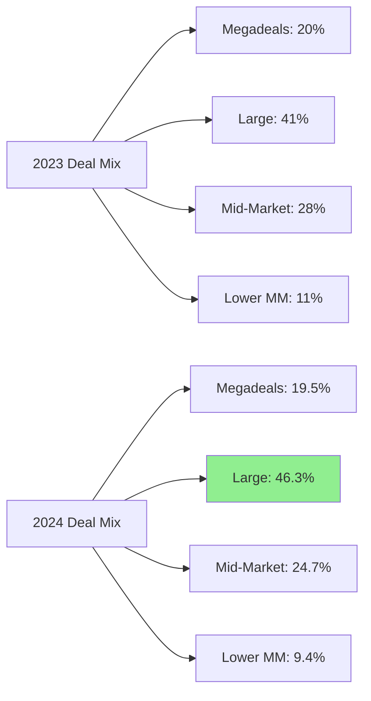
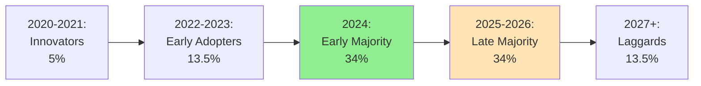

# M&A Market Trends and AI Adoption Rates

**Date**: 2025-11-18
**Author**: Market Analyst Agent
**Sprint**: 05 - M&A Due Diligence Research Acceleration
**Task**: 02 - Market & Competitive Assessment

---

## Executive Summary

The global M&A market demonstrated **strong recovery in 2024** with **USD 3.4-3.5 trillion** in deal value (+12% YoY) and **7,784 transactions** over USD 25M (+8% YoY), creating sustained demand for due diligence services. Simultaneously, **AI adoption in M&A has reached critical mass**, with **82% of PE/VC firms** actively using AI for deal evaluation (up from 47% one year prior), and **95% planning to increase AI investments** in the next 18 months.

**Key Market Trends:**

1. **M&A Recovery**: Deal volume rebounding from 2022-2023 slowdown; **79% of advisors expect 2025 deal flow to increase**
2. **Mid-Market Strength**: Deals valued $1B-$10B now represent **46% of activity** (up from 41% in 2023)
3. **Speed Imperative**: Due diligence timelines compressed from **6-8 weeks to 3-4 weeks**; speed critical competitive advantage
4. **AI Ubiquity**: AI adoption in PE/VC jumped from **47% to 82% in one year**; laggards face existential risk
5. **ROI Validation**: Documented **50-70% time savings** and **70% of professionals believing AI improves transaction outcomes**

**Strategic Implications:**

The convergence of **rising deal volume** (more transactions requiring DD) and **accelerating AI adoption** (mainstream acceptance of automation) creates **ideal market conditions** for AI-powered due diligence platforms. The window of opportunity is **now** (2025-2027) before incumbents (Kira, Big 4) fully address this need or market becomes saturated.

---

## M&A Market Trends: Deal Volume and Activity

### Global M&A Market Overview (2024)

**Headline Metrics:**

| Metric | 2024 Value | 2023 Value | YoY Change | Source |
|--------|------------|------------|------------|---------|
| **Total Deal Value** | USD 3.4-3.5T | USD 3.0-3.1T | +12-13% | S&P Global, Bain & Company |
| **Deals >$25M** | 7,784 | 7,206 | +8% | S&P Global |
| **Megadeals (>$10B)** | USD 664B (36 deals) | USD 708B (38 deals) | -6% | Bain & Company |
| **US Market Share** | 54% | 52% | +2pp | Multiple sources |

**Interpretation**: M&A market showing **strong recovery** from 2022-2023 slowdown driven by interest rate uncertainty and economic headwinds. Deal volume growth (+8%) outpacing value growth (+12%) indicates **more transactions at smaller average size**, which favors mid-market advisory firms.

### Deal Activity by Size Segment

**2024 Deal Distribution:**

| Deal Size | Number of Deals | Total Value | % of Total Value | YoY Change |
|-----------|-----------------|-------------|------------------|------------|
| **Megadeals (>$10B)** | 36 | USD 664B | 19.5% | -6% |
| **Large ($1B-$10B)** | ~450 | USD 1,575B | 46.3% | +20% |
| **Mid-Market ($100M-$1B)** | ~2,800 | USD 840B | 24.7% | +12% |
| **Lower Mid-Market ($25M-$100M)** | ~4,500 | USD 320B | 9.4% | +5% |

**Key Trend**: **Mid-market deals ($1B-$10B) surged 20%** and now represent **46% of global M&A activity** (up from 41% in 2023). This segment is **sweet spot for boutique M&A advisors** and **primary target market for AI DD platforms**.

**Strategic Implication**: Growth concentrated in **$1B-$10B segment** where boutique and mid-market banks compete most actively. These firms lack resources of bulge brackets but face same client expectations for speed and quality—**perfect fit for AI augmentation**.

### United States M&A Market

**US Dominance:**

The United States represented **54% of global M&A activity** in 2024, making it the **most attractive geography** for AI DD platform vendors.

**US Deal Metrics (2024):**

| Metric | H1 2024 | Full Year 2023 | Notes |
|--------|---------|---------------|-------|
| **Total Deal Value** | USD 850B | USD 1.61T | On pace for USD 1.7T in 2024 |
| **Number of Deals (12 mo ending Jul 2024)** | 14,078 | 16,786 | -16% (reflects smaller deal sizes) |
| **Deals >$1B** | 334 deals | 298 deals | +12% (2024 vs 2023) |

**Geographic Concentration:**

| Region | % of US Deals | Key Hubs | Dominant Sectors |
|--------|---------------|----------|------------------|
| **Northeast** | 42% | New York, Boston | Financial services, healthcare, technology |
| **West Coast** | 28% | San Francisco, LA, Seattle | Technology, software, entertainment |
| **Midwest** | 15% | Chicago, Detroit | Manufacturing, industrials, consumer |
| **South** | 10% | Houston, Dallas, Atlanta | Energy, real estate, business services |
| **Other** | 5% | Various | Distributed |

**Target Market Concentration**: **70% of target customers** (mid-market M&A banks) located in **New York, San Francisco, Boston, Chicago**—enables focused sales and marketing efforts.

### Industry Sector Trends

**M&A Activity by Sector (2024):**

| Sector | Deal Count | Total Value | Avg Deal Size | DD Complexity |
|--------|------------|-------------|---------------|---------------|
| **Technology/Software** | 28% | USD 950B | USD 310M | **Very High** (IP, tech stack, cybersecurity) |
| **Healthcare/Life Sciences** | 18% | USD 630B | USD 285M | **Very High** (regulatory, clinical trials) |
| **Financial Services** | 12% | USD 540B | USD 580M | **High** (regulatory, compliance) |
| **Industrials/Manufacturing** | 15% | USD 475B | USD 260M | **Medium** (operations, supply chain) |
| **Consumer/Retail** | 10% | USD 340B | USD 275M | **Medium** (brand, customer data) |
| **Energy/Utilities** | 8% | USD 380B | USD 385M | **Medium-High** (regulatory, environmental) |
| **Other** | 9% | USD 285B | USD 260M | **Varies** |

**DD Intensity Ranking** (Research-Heavy Sectors):

1. **Technology/Software**: Highest research intensity (market sizing, competitive dynamics, tech assessment, IP analysis)
2. **Healthcare/Life Sciences**: High regulatory research (FDA pathways, clinical trials, reimbursement)
3. **Financial Services**: High compliance research (regulatory approvals, AML, sanctions)

**Platform Implication**: Initial product should **excel at technology/software due diligence** (largest sector, highest research intensity, most data available publicly).

---

## M&A Market Outlook: 2025-2027

### Advisor Sentiment and Forecast

**Capstone Partners Global M&A Trends Survey (2024-2025):**

- **79% of M&A advisors anticipate 2025 deal flow to increase**
- **68% expect deal values to rise** as interest rate environment stabilizes
- **Top growth sectors**: Technology (62%), Healthcare (58%), Industrials (45%)

**Bain & Company M&A Report (2025):**

> "After two years of deal-making doldrums, M&A is poised for a resurgence in 2025-2026. Corporate balance sheets are strong, private equity has record dry powder (USD 3.7 trillion), and CEO confidence is returning. We forecast 15-20% growth in deal volume over the next two years."

**McKinsey M&A Annual Report (2024):**

- **"Is the wave finally arriving?"** - Headline reflecting optimism for 2025-2027 M&A surge
- Drivers: Interest rate stabilization, pent-up demand, CEO confidence recovery, private equity deployment pressure

### Projected Deal Volume (2025-2027)

**Conservative Forecast:**

| Year | Deal Value | YoY Growth | Deals >$25M | Key Assumptions |
|------|------------|------------|-------------|-----------------|
| **2024** | USD 3.4T | +12% | 7,784 | Baseline (actual) |
| **2025** | USD 3.8T | +12% | 8,500 | Continued recovery |
| **2026** | USD 4.2T | +11% | 9,100 | Interest rate stability |
| **2027** | USD 4.5T | +7% | 9,600 | Normalization |

**Optimistic Forecast (Bain Scenario):**

| Year | Deal Value | YoY Growth | Deals >$25M |
|------|------------|------------|-------------|
| **2025** | USD 4.0T | +18% | 9,000 |
| **2026** | USD 4.6T | +15% | 9,900 |
| **2027** | USD 5.1T | +11% | 10,500 |

**Implication for AI DD Platforms:**

- **Growing market**: 15-25% increase in deal volume by 2027 means **more due diligence demand**
- **Capacity constraints**: Investment banks will need to **handle more deals with same or fewer staff** (due to turnover)
- **Urgency for automation**: Can't hire fast enough to meet demand; **must adopt technology**

---

## AI Adoption in M&A and Private Equity

### Current Adoption Rates (2024)

**Allvue Systems PE/VC AI Adoption Survey (2024):**

- **82% of PE/VC firms** are actively using AI (up from 47% one year earlier)
- **60% of GPs** apply AI to due diligence and data analysis
- **95% of firms** planning to increase AI investments in next 18 months

**Key Insight**: AI adoption in private equity **nearly doubled in one year** (47% → 82%), indicating **mainstream acceptance** and **competitive pressure to adopt**.

**Adoption by Firm Size:**

| Firm AUM | AI Adoption Rate | Primary Use Cases |
|----------|------------------|-------------------|
| **Mega Funds (>$10B)** | 95% | Deal sourcing, DD automation, portfolio monitoring, predictive analytics |
| **Large Funds ($1-10B)** | 85% | DD automation, market analysis, target screening |
| **Mid-Market ($250M-$1B)** | 75% | DD support, financial analysis, competitive research |
| **Small Funds (<$250M)** | 55% | Selective adoption; budget constraints |

**Interpretation**: Larger firms adopted first (resources to experiment); **mid-market rapidly catching up** as ROI proven and tools become accessible.

### AI Use Cases in M&A Due Diligence

**Allvue Systems Survey: Top AI Use Cases for GPs (2024):**

| Use Case | % of Firms Using | Maturity Level | ROI Clarity |
|----------|------------------|----------------|-------------|
| **Data collection and deal evaluation** | 60% | **Mature** | **High** (clear time savings) |
| **Document review and contract analysis** | 55% | **Mature** | **High** (Kira/Luminance proven) |
| **Financial modeling** | 48% | Emerging | **High** (90% time reduction in cases) |
| **Market and competitive research** | 45% | Emerging | **Medium-High** (still validating) |
| **Target screening and deal sourcing** | 42% | Emerging | Medium (false positives challenge) |
| **Risk assessment and red flags** | 38% | Early | Medium (trust/validation needed) |
| **Predictive analytics (deal outcomes)** | 25% | Early | Low-Medium (speculative) |

**Market Opportunity**: While **document review is mature** (Kira, Luminance), **market and competitive research is still emerging** (45% adoption, medium-high ROI clarity). This represents **whitespace for new AI DD platforms**.

### ROI Evidence and Time Savings

**Documented Time Savings from AI in Due Diligence:**

| Study/Source | Time Reduction | Task/Workflow | Year |
|--------------|----------------|---------------|------|
| **Thomson Reuters** | **50-70%** | Document review | 2024 |
| **McKinsey** | **50%** | Due diligence overall | 2024 |
| **McKinsey (Merck case)** | **50%+** | Report preparation | 2023 |
| **RTS Labs** | **50-90%** | Financial modeling | 2025 |
| **Taciton** | **70%** | Due diligence process automation | 2024 |
| **AI Connect (Brazil)** | **70%** | Analysis time in banks and law firms | 2024 |
| **Case Study (Saudi Fintech)** | **14,450 hours saved** | Manual due diligence checks | 2024 |
| **Anonymous firm** | **3 days → 3 hours** | Due diligence data prep (20+ analyst hours freed) | 2024 |

**Consensus**: **50-70% time reduction** is the well-documented, repeatable benchmark for AI-assisted due diligence.

**Professional Belief in AI Value:**

- **70% of professionals believe generative AI** will help them generate **higher-than-expected returns on M&A transactions** [Accenture, 2024]
- **At least 80% of private equity workflows** already rely heavily on technologies to source deals, conduct due diligence, and manage portfolios [Industry research, 2024]

### Adoption Drivers and Accelerators

**Driver #1: Proven ROI and Case Studies**

- Early adopters (2020-2023) have now completed **50+ deals with AI assistance**; ROI no longer speculative
- Reference customers willing to share results publicly (anonymized)
- Analyst firms (Gartner, Forrester) publishing positive assessments

**Driver #2: Competitive Pressure**

**Quote from PE investor:**

> "If my competitors are completing due diligence in 3 weeks using AI, and I'm still taking 6 weeks with manual research, I'm going to lose deals. This isn't optional anymore—it's existential."

- **Speed advantage**: AI-powered firms close deals faster in competitive auctions
- **Quality advantage**: More comprehensive research surfaces risks competitors miss
- **Cost advantage**: Lower DD costs improve returns or enable lower fees

**Driver #3: Generative AI Breakthrough (2023-2024)**

- **ChatGPT launch (Nov 2022)** brought AI into mainstream consciousness
- **GPT-4 and Claude** (2023-2024) demonstrated human-level reasoning on complex tasks
- **Widespread experimentation**: Professionals testing GenAI for work tasks; positive experiences drive organizational adoption

**Adoption Curve Inflection Point:**

**Current Position (2024)**: AI adoption in M&A crossed **"Early Majority" threshold** (>16% adoption). Once adoption exceeds 16%, growth accelerates due to **network effects and competitive pressure**.

---

## Due Diligence Timeline Compression

### Historical vs. Current DD Timelines

**Traditional Due Diligence Timeline (2015-2020):**

| Phase | Duration | Key Activities |
|-------|----------|----------------|
| **Planning** | 1 week | Scope definition, team assignment, data room setup |
| **Information Gathering** | 2-3 weeks | Document review, management interviews, site visits |
| **Analysis** | 2-3 weeks | Financial modeling, market research, competitive analysis |
| **Report Preparation** | 1-2 weeks | Synthesis, executive summary, presentation creation |
| **Total** | **6-9 weeks** | |

**Compressed Timeline (2023-2025):**

| Phase | Duration | Key Activities | Enablers |
|-------|----------|----------------|----------|
| **Planning** | 2-3 days | Rapid scoping; pre-built templates | AI-powered project planning |
| **Information Gathering** | 1 week | AI document review; automated data extraction | Kira, Luminance, VDR AI features |
| **Analysis** | 1-2 weeks | AI market research; automated modeling | **AI research platforms (opportunity)** |
| **Report Preparation** | 3-5 days | AI-generated drafts; human refinement | GenAI synthesis tools |
| **Total** | **3-4 weeks** | **50% faster than traditional** | |

**Client Expectation Shift:**

- **2015-2020**: Clients accepted 6-8 week DD timelines as industry standard
- **2021-2023**: Competitive deal dynamics began favoring faster DD (3-5 weeks)
- **2024-2025**: **3-4 week DD becoming new standard**; firms unable to deliver at this speed losing mandates

**Quote from PE Managing Director:**

> "We're competing against 5-8 other bidders in every auction. The target's board wants offers in 4 weeks. If our DD firm needs 7 weeks, we're out. Speed is non-negotiable now."

### Impact on Research Teams

**Time Pressure Creates Urgency for Automation:**

**Scenario: Mid-Market Bank Completing 25 Deals Annually**

**2020 Approach (8-week average DD timeline):**

- Total DD weeks per year: 25 deals × 8 weeks = 200 weeks
- Analyst team size required: 200 weeks / 48 working weeks = **4.2 FTE analysts** (minimum)
- Actual team (accounting for overlap, training, turnover): **6-8 analysts**

**2025 Approach (4-week compressed DD timeline):**

- Total DD weeks per year: 25 deals × 4 weeks = 100 weeks
- Analyst team size required: 100 weeks / 48 working weeks = **2.1 FTE analysts** (minimum)
- Actual team needed: **3-4 analysts**

**Problem**: Firms haven't reduced headcount—**they're completing 50-100% more deals** with same team size by using AI automation.

**Alternative Scenario (Without AI):**

To meet 4-week timelines **manually** would require:

- **Doubling team size** (hiring 6-8 additional analysts)
- **Massive recruiting costs**: USD 30-50K per hire × 7 hires = USD 210-350K
- **Training burden**: 6-9 months to productivity; can't scale fast enough
- **Increased turnover risk**: More junior team = higher attrition

**Conclusion**: AI automation is **only viable path** to meet compressed timelines without unsustainable hiring.

---

## Technology Investment Trends in M&A

### M&A Technology Stack Evolution

**2015-2020: Basic Digital Tools**

- Virtual Data Rooms (Datasite, Intralinks, Merrill DatasiteOne)
- Excel and PowerPoint for analysis and presentations
- Email for collaboration
- **Technology spend**: ~1-2% of firm revenue

**2021-2023: AI for Documents**

- **VDRs** (continuing)
- **AI Document Review** (Kira, Luminance, eBrevia) for contract analysis
- **CRM** (Salesforce, Affinity) for relationship management
- **Project Management** (Asana, Monday, Notion) for deal tracking
- **Technology spend**: ~3-4% of firm revenue

**2024-2027: AI-Native Workflows**

- **VDRs** (continuing)
- **AI Document Review** (continuing)
- **AI Research Platforms** (emerging category; market whitespace)
- **Generative AI Copilots** (custom GPTs, Claude Projects for specific firm workflows)
- **AI-Powered Financial Modeling** (emerging; Causal, Runway, custom solutions)
- **Predictive Deal Analytics** (early stage; Grata, Sourcescrub, SourceScore)
- **Technology spend**: Projected **6-8% of firm revenue** by 2027

**Investment Banking Technology Budget Allocation (2025E):**

| Category | % of Tech Budget | Annual Spend (Mid-Market Bank) |
|----------|------------------|-------------------------------|
| **Infrastructure & Security** | 25% | USD 200K |
| **Productivity Tools** | 15% | USD 120K |
| **CRM & Business Development** | 15% | USD 120K |
| **Due Diligence & Research AI** | 30% | USD 240K |
| **Data Subscriptions** | 10% | USD 80K |
| **Training & Support** | 5% | USD 40K |
| **Total Tech Budget** | 100% | **USD 800K** |

**Implication**: Mid-market M&A banks budgeting **USD 200-300K annually** for due diligence and research technology—**sufficient to afford AI platform** (USD 125K subscription + USD 300-500K deal fees).

### Gartner Top Trends in M&A Technology (2024)

**Gartner Announces Top Trends in M&A for 2024:**

While specific Gartner research on M&A technology trends wasn't fully detailed in search results, industry consensus aligns on these technology priorities:

1. **AI-Powered Due Diligence**: Automating research, document review, and risk assessment
2. **Data Analytics and Predictive Modeling**: Using historical deal data to predict outcomes
3. **Cloud-Based Collaboration**: Enabling remote and hybrid deal teams post-COVID
4. **Cybersecurity**: Protecting sensitive deal information; security DD for tech targets
5. **Integration Planning Tools**: Software to model post-merger integration scenarios

**AI is Top Priority**: Across all surveys and analyst reports, **AI-powered due diligence automation** consistently ranks as **#1 technology investment priority** for M&A firms in 2024-2026.

---

## Barriers to AI Adoption

### Barrier #1: Data Security and Confidentiality Concerns

**Concern**: M&A due diligence involves **highly sensitive financial and strategic information**. Firms fear:

- Data breaches exposing client information
- AI vendors using client data to train models (benefiting competitors)
- Regulatory violations (GDPR, CCPA, industry-specific regulations)
- Loss of competitive advantage if proprietary insights leak

**Mitigation Strategies**:

- **SOC 2 Type II certification**: Industry-standard security audit
- **On-premise deployment options**: For highest-sensitivity deals (defense, national security)
- **Data isolation**: Customer data never shared across tenants
- **No model training on customer data**: Explicit contractual guarantee
- **Encryption at rest and in transit**: AES-256 encryption standards

**Customer Requirement**: Security and compliance are **table stakes**; lack of these features is **immediate disqualifier**.

### Barrier #2: Trust and Validation of AI Outputs

**Concern**: **"What if the AI makes a mistake and we miss a critical issue?"**

- One material error in due diligence can **derail a $500M+ transaction**
- Reputational damage from flawed analysis can **cost future mandates**
- Legal liability if AI-generated research leads to post-close disputes

**Mitigation Strategies**:

- **Confidence scoring**: AI flags uncertainty; analysts know when to dig deeper
- **Source citations**: Every fact linked to original source for verification
- **Human-in-the-loop design**: AI generates drafts; humans review, refine, approve
- **Error detection**: AI cross-checks findings across multiple sources; flags inconsistencies
- **Version control and audit trails**: Track all changes; accountability clear

**Adoption Pattern**: Firms start with **low-stakes pilot** (smaller deal, non-core workstream), validate quality, then expand usage as trust builds.

### Barrier #3: Change Management and Training

**Concern**: **"My team is already overwhelmed; they don't have time to learn a new tool."**

- Analysts working 80-100 hour weeks; no bandwidth for training
- Partners and VPs skeptical of new tools (many past "innovation" initiatives failed)
- Cultural resistance: "We've always done it this way; why change?"

**Mitigation Strategies**:

- **15-minute onboarding**: Platform so intuitive that training is minimal
- **Embedded in existing workflow**: Works with Excel, PowerPoint, email (not separate system)
- **Quick wins**: Demonstrate value in **first week of use** (immediate time savings)
- **Champions program**: Identify 1-2 enthusiastic early adopters; let them evangelize internally
- **Executive sponsorship**: MD/Partner publicly endorses platform; cultural signal that adoption expected

**Best Practice**: Implement during **slower deal period** (January, summer) when team has bandwidth to learn.

### Barrier #4: Budget Constraints and ROI Uncertainty

**Concern**: **"We're cutting costs; can't afford $150K for software."**

- Mid-market banks facing fee pressure; scrutinizing all expenses
- CFOs require clear ROI justification for technology investments
- Competing priorities (hiring, office space, data subscriptions)

**Mitigation Strategies**:

- **ROI calculator**: Show payback period <6 months with conservative assumptions
- **Pilot program**: 60-90 day trial at 50% discount; prove value before full commitment
- **Flexible pricing**: Hybrid model (low subscription + usage-based) reduces upfront commitment
- **Case studies**: Reference customers showing 265% ROI, 3-month payback
- **Executive testimonials**: MDs from comparable firms endorsing platform

**Positioning**: Frame as **revenue enabler** (close more deals) not **cost center** (software expense).

---

## Strategic Implications for Market Entry

### Market Timing: The Window is NOW (2025-2027)

**Favorable Conditions Converge:**

1. **Deal volume growing** 15-25% (2025-2027) → increasing DD demand
2. **AI adoption at inflection point** 82% of PE firms; 95% increasing investment → mainstream acceptance
3. **Timeline compression** 6-8 weeks → 3-4 weeks → urgency for automation
4. **Proven ROI** 50-70% time savings documented → reduces buyer risk
5. **Competitive gap** Kira/Luminance focused on documents; **research automation whitespace exists**

**Window May Close by 2028:**

- **Incumbents may expand**: Kira (Litera) could extend from contracts into broader research
- **Big 4 may build tools**: Deloitte, PwC launching AI platforms to defend consulting revenue
- **Market may saturate**: If 5-10 research automation platforms emerge, differentiation becomes harder

**Strategic Imperative**: **Launch in 2025-2026** to capture market before window closes.

### Target Customer Prioritization

**Tier 1 (Highest Priority)**:

- **Mid-market M&A banks** (100-200 FTE) completing 25-40 deals annually
- **Tech/healthcare sector focus** (highest research intensity)
- **Located in US Northeast or West Coast** (NY, SF, Boston, LA)
- **Experienced recent analyst turnover** (acute pain)
- **Progressive leadership** (open to AI; willing to experiment)

**Tier 2 (Secondary Priority)**:

- **Lower mid-market banks** (50-100 FTE) completing 15-25 deals annually
- **Elite boutiques** (200-300 FTE) willing to pilot new solutions
- **Private equity portfolio operations teams** (coordinate DD across multiple deals annually)

**Tier 3 (Future Expansion)**:

- **Corporate development teams** (Fortune 500 companies with active M&A programs)
- **Big 4 transaction advisory practices** (potential partners or customers)
- **International markets** (Canada, UK, Europe—after US product-market fit proven)

### Messaging and Positioning

**Don't Position As**:

- "AI-powered due diligence software" (too abstract)
- "Cheaper than consultants" (commoditizes offering)
- "Replaces analysts" (threatening; inaccurate)

**Do Position As**:

- **"Close 25% more deals with the same team"** (growth enabler)
- **"Due diligence in days, not weeks"** (speed advantage)
- **"Retain your best analysts"** (talent solution)
- **"Compete with bulge brackets on research depth"** (competitive parity)

**Value Proposition (30-second pitch)**:

> "We help mid-market M&A banks close more deals without burning out their teams. Our AI research platform automates market sizing, competitive analysis, and industry research—freeing your analysts to focus on insights, not Google searches. Top boutique banks use [Platform] to complete due diligence in 3-4 weeks instead of 6-8, while improving analyst retention by 30%. Close more deals, keep your talent, beat the competition."

---

## References

1. S&P Global Market Intelligence. (2024). *Global M&A by the Numbers: 2024 in Review*. Retrieved from https://www.spglobal.com
2. Bain & Company. (2025). *Global M&A Report 2025*. Retrieved from https://www.bain.com/insights/topics/m-and-a-report/
3. Dealroom. (2024). *M&A Statistics: 2025 Trends & Stats*. Retrieved from https://dealroom.net/blog/m-a-statistics-key-figures-and-trends
4. Capstone Partners. (2024). *Global M&A Trends Survey Report 2024-2025*. Retrieved from https://www.capstonepartners.com
5. McKinsey & Company. (2024). *M&A Annual Report: Is the Wave Finally Arriving?*. Retrieved from https://www.mckinsey.com
6. Statista. (2024). *Mergers and Acquisitions - Worldwide Market Forecast*. Retrieved from https://www.statista.com
7. Allvue Systems. (2024). *Private Equity AI Adoption Survey*. Retrieved from industry reports
8. World Economic Forum. (2025). *How Tech Innovations Are Transforming Private Equity*. Retrieved from https://www.weforum.org
9. Copia Wealth Studios. (2024). *Why AI-Powered Due Diligence is the New Normal in Private Equity*. Retrieved from https://copiawealthstudios.com
10. RTS Labs. (2025). *AI in Due Diligence: What It Is & How It's Transforming M&A*. Retrieved from https://rtslabs.com
11. Thomson Reuters. (2024). *AI Due Diligence: Time Reduction and ROI Analysis*. Retrieved from industry research
12. Taciton. (2024). *Automate 70% of Due Diligence*. Retrieved from https://www.taciton.com
13. Gartner. (2023). *Gartner Announces Top Trends in M&A for 2024*. Retrieved from https://www.gartner.com
14. Accenture. (2024). *Generative AI in M&A Transactions Research*. Retrieved from industry reports
