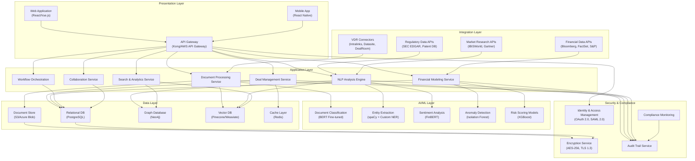
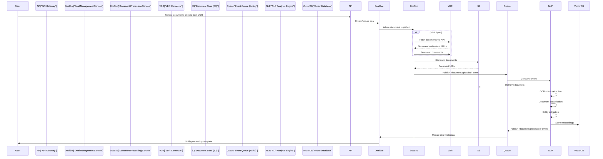
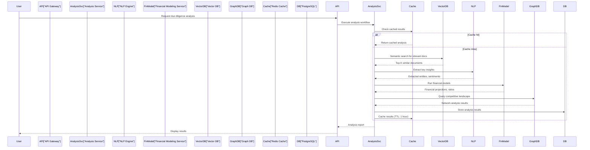
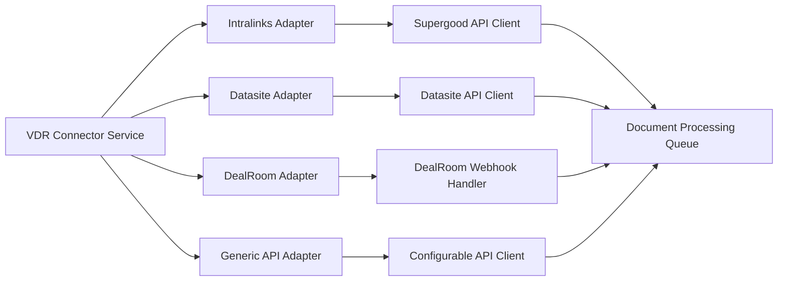
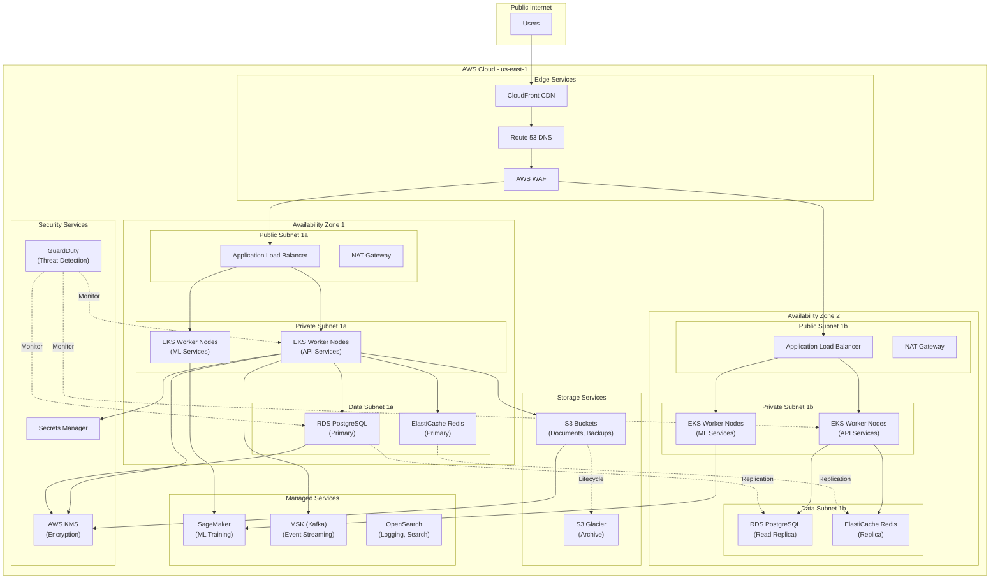

# High-Level System Architecture: AI-Powered Due Diligence Research Platform

**Sprint**: 05 - M&A Due Diligence Research Acceleration
**Task**: 03 - Solution Architecture Design
**Date**: 2025-11-18
**Author**: solution-architect skill agent

---

## Executive Summary

This document presents the high-level system architecture for an AI-powered due diligence research platform designed to accelerate M&A transaction analysis by 75-80%. The platform integrates multi-source data aggregation, advanced NLP document processing, financial modeling, and collaborative workflow management into a unified, enterprise-grade solution compliant with SOC 2 and ISO 27001 standards.

The architecture supports 20-30 private equity firms and investment banks processing 300+ deals annually, with capability to analyze 80+ evaluation criteria across market, competitive, regulatory, and operational dimensions.

---

## 1. System Architecture Overview

The platform follows a microservices architecture deployed on cloud infrastructure (AWS/Azure/GCP) with hybrid on-premise deployment options for air-gapped environments.

---

## 2. Key Architectural Decisions

### 2.1 Microservices Architecture

**Decision**: Implement microservices pattern over monolithic architecture

**Rationale**:
- **Scalability**: Independent scaling of compute-intensive services (NLP, document processing)
- **Resilience**: Failure isolation prevents cascade failures across services
- **Technology flexibility**: Different services can use optimal tech stacks (Python for ML, Node.js for APIs)
- **Team autonomy**: Multiple development teams can work independently on different services

**Trade-offs**:
- Increased operational complexity (service discovery, distributed tracing)
- Network latency between services
- Data consistency challenges across services

### 2.2 Event-Driven Architecture

**Decision**: Use event-driven patterns for asynchronous processing

**Rationale**:
- **Performance**: Long-running document analysis doesn't block user interactions
- **Scalability**: Event queues (AWS SQS, RabbitMQ) enable horizontal scaling
- **Resilience**: Retry mechanisms and dead-letter queues for failed processing
- **Auditability**: Event logs provide complete audit trail for compliance

**Implementation**:
- Apache Kafka for high-throughput event streaming
- AWS EventBridge for service-to-service communication
- Redis Streams for real-time notifications

### 2.3 Hybrid Cloud Deployment

**Decision**: Support both cloud SaaS and on-premise deployment

**Rationale**:
- **Market requirements**: Some PE firms require on-premise deployment for data sovereignty
- **Compliance**: Air-gapped environments for highly sensitive transactions
- **Flexibility**: Single codebase with deployment configuration variations
- **Revenue expansion**: Capture both SaaS and enterprise license revenue

**Deployment models**:
- **Cloud SaaS**: Multi-tenant AWS/Azure deployment (70% of customers)
- **Private cloud**: Single-tenant isolated VPC (20% of customers)
- **On-premise**: Kubernetes cluster on customer infrastructure (10% of customers)

### 2.4 API-First Design

**Decision**: All services expose REST APIs with OpenAPI 3.0 specifications

**Rationale**:
- **Integration flexibility**: Third-party integrations and custom workflows
- **Mobile/web parity**: Same APIs power all client applications
- **Testing**: API contracts enable comprehensive integration testing
- **Documentation**: Auto-generated API docs from OpenAPI specs

**API standards**:
- REST with JSON payloads for CRUD operations
- GraphQL for complex queries with nested relationships
- WebSocket for real-time updates and collaboration features
- gRPC for high-performance service-to-service communication

### 2.5 Multi-Tenant Architecture with Data Isolation

**Decision**: Shared infrastructure with logical data isolation per tenant

**Rationale**:
- **Cost efficiency**: Shared compute and storage resources reduce infrastructure costs
- **Security**: Database-level isolation ensures data segregation
- **Compliance**: Tenant-specific encryption keys and audit trails
- **Performance**: Efficient resource utilization across tenants

**Isolation strategy**:
- **Database**: Separate PostgreSQL schemas per tenant with row-level security
- **Storage**: S3 bucket prefixes with IAM policies per tenant
- **Encryption**: Customer-managed keys (CMK) in AWS KMS per tenant
- **Compute**: Kubernetes namespaces with resource quotas per tenant

---

## 3. Technology Stack Recommendations

### 3.1 Frontend Layer

**Web Application**:
- **Framework**: React 18+ with TypeScript
- **State management**: Redux Toolkit with RTK Query
- **UI components**: Material-UI (MUI) or Ant Design
- **Data visualization**: D3.js, Recharts for financial charts
- **Real-time updates**: Socket.io client

**Mobile Application**:
- **Framework**: React Native (iOS + Android from single codebase)
- **Navigation**: React Navigation v6
- **Offline support**: Redux Persist + AsyncStorage

### 3.2 Backend Services

**API Gateway**:
- **Option 1**: Kong Gateway (open-source, high performance)
- **Option 2**: AWS API Gateway (managed service, easier operations)

**Service framework**:
- **Language**: Node.js (Express.js) for API services, Python (FastAPI) for ML services
- **Authentication**: Auth0 or AWS Cognito for identity management
- **API documentation**: Swagger UI from OpenAPI specs

### 3.3 Data Layer

**Relational database**:
- **Primary**: PostgreSQL 15+ (transactional data, deal metadata)
- **Features**: JSONB columns for flexible schema, full-text search, row-level security

**Document storage**:
- **Primary**: AWS S3 or Azure Blob Storage (raw documents, processed files)
- **Features**: Lifecycle policies, versioning, server-side encryption

**Vector database**:
- **Primary**: Pinecone or Weaviate (document embeddings for semantic search)
- **Use case**: "Find similar transactions" or "Find relevant clauses"

**Graph database**:
- **Primary**: Neo4j (relationship mapping between entities, companies, deals)
- **Use case**: Competitive landscape, ownership structures, network analysis

**Cache layer**:
- **Primary**: Redis 7+ (session management, rate limiting, real-time data)
- **Features**: Pub/Sub for real-time updates, sorted sets for leaderboards

### 3.4 AI/ML Stack

**NLP frameworks**:
- **Transformer models**: Hugging Face Transformers (BERT, RoBERTa, FinBERT)
- **NER**: spaCy 3.5+ with custom entity recognition models
- **Document understanding**: LayoutLM for structured document extraction

**ML infrastructure**:
- **Training**: AWS SageMaker or Azure ML for model training
- **Inference**: TorchServe or TensorFlow Serving for model deployment
- **Monitoring**: Weights & Biases or MLflow for experiment tracking

**Key models**:
- **Document classification**: Fine-tuned BERT (financial statements, contracts, regulatory filings)
- **Entity extraction**: Custom spaCy NER models (revenue figures, company names, dates)
- **Sentiment analysis**: FinBERT fine-tuned on financial news and earnings calls
- **Anomaly detection**: Isolation Forest for financial data outliers

### 3.5 Infrastructure

**Container orchestration**:
- **Primary**: Kubernetes (EKS on AWS, AKS on Azure)
- **Service mesh**: Istio for service discovery, load balancing, security

**CI/CD**:
- **Version control**: GitHub or GitLab
- **CI/CD pipeline**: GitHub Actions or GitLab CI/CD
- **Artifact registry**: Docker Hub (private repos) or AWS ECR

**Observability**:
- **Logging**: ELK Stack (Elasticsearch, Logstash, Kibana) or AWS CloudWatch
- **Metrics**: Prometheus + Grafana
- **Tracing**: Jaeger or AWS X-Ray
- **Alerting**: PagerDuty integration

**Infrastructure as Code**:
- **Primary**: Terraform for multi-cloud provisioning
- **Alternative**: AWS CloudFormation for AWS-only deployments

---

## 4. Data Flow Architecture

### 4.1 Document Ingestion Flow

### 4.2 Analysis Request Flow

---

## 5. Scalability and Performance

### 5.1 Performance Targets

**Response times**:
- API calls: < 200ms (p95)
- Document upload: < 5 seconds (< 10MB files)
- Document processing: < 30 seconds per document (average)
- Full deal analysis: < 5 minutes (50-100 documents)
- Search queries: < 500ms (p95)

**Throughput**:
- Concurrent users: 500+ per tenant
- Document ingestion: 1000+ documents/hour per tenant
- API requests: 10,000 requests/second (platform-wide)

**Availability**:
- Uptime SLA: 99.9% (< 44 minutes downtime/month)
- Disaster recovery RPO: < 1 hour
- Disaster recovery RTO: < 4 hours

### 5.2 Scaling Strategies

**Horizontal scaling**:
- **API services**: Auto-scale based on CPU/memory utilization (target: 70% CPU)
- **Document processing**: Scale workers based on queue depth (1 worker per 10 messages)
- **NLP inference**: GPU-enabled instances with batch processing (batch size: 16-32)
- **Database**: Read replicas for analytics queries (3 read replicas)

**Vertical scaling**:
- **PostgreSQL**: Scale to r6g.4xlarge (16 vCPU, 128 GB RAM) for large tenants
- **Redis**: Scale to r6g.2xlarge (8 vCPU, 64 GB RAM) for caching layer
- **NLP workers**: GPU instances (p3.2xlarge with V100) for model inference

**Caching strategies**:
- **API responses**: Cache GET requests for 5 minutes (Redis)
- **Document embeddings**: Cache in memory for active deals
- **Financial calculations**: Cache results for 1 hour (parameterized by inputs)
- **Static assets**: CDN caching (CloudFront) with 24-hour TTL

### 5.3 Database Optimization

**PostgreSQL optimizations**:
- **Partitioning**: Partition deals table by creation date (monthly partitions)
- **Indexing**: B-tree indexes on foreign keys, GIN indexes on JSONB columns
- **Connection pooling**: PgBouncer with max 100 connections per pool
- **Query optimization**: EXPLAIN ANALYZE for slow queries, materialized views for reports

**Data lifecycle**:
- **Hot storage**: Active deals (< 6 months) in primary PostgreSQL
- **Warm storage**: Closed deals (6-24 months) in read replicas
- **Cold storage**: Archived deals (> 24 months) in S3 with Athena queries

---

## 6. Security Architecture

### 6.1 Defense in Depth

**Layer 1: Network security**:
- VPC with private subnets for databases and internal services
- Security groups with least-privilege access rules
- AWS WAF for DDoS protection and SQL injection prevention
- CloudFlare for CDN and additional DDoS mitigation

**Layer 2: Application security**:
- OAuth 2.0 with JWT tokens for authentication
- Role-based access control (RBAC) with 5 roles: Admin, Deal Manager, Analyst, Viewer, API User
- API rate limiting: 1000 requests/hour per user, 10,000 requests/hour per tenant
- Input validation and sanitization on all endpoints

**Layer 3: Data security**:
- Encryption at rest: AES-256 for all data stores
- Encryption in transit: TLS 1.3 for all connections
- Customer-managed encryption keys (CMK) in AWS KMS
- Secure key rotation every 90 days

**Layer 4: Monitoring and detection**:
- AWS GuardDuty for threat detection
- AWS Security Hub for compliance monitoring
- Intrusion detection system (IDS) with Snort
- Security Information and Event Management (SIEM) with Splunk

### 6.2 Authentication and Authorization

**Identity providers**:
- **SSO**: SAML 2.0 integration with Okta, Azure AD, Google Workspace
- **MFA**: Required for all users (TOTP, SMS, hardware tokens)
- **API keys**: Scoped to specific permissions with expiration

**Access control matrix**:

| Role | Deal Management | Document Upload | Analysis Execution | Financial Modeling | Admin Functions |
|------|----------------|-----------------|-------------------|-------------------|-----------------|
| Admin | Full access | Full access | Full access | Full access | Full access |
| Deal Manager | Create/edit/delete | Full access | Full access | Full access | No access |
| Analyst | Read-only | Upload only | Full access | Full access | No access |
| Viewer | Read-only | No access | View results | View results | No access |
| API User | API-defined scopes | API-defined scopes | API-defined scopes | API-defined scopes | No access |

---

## 7. Compliance and Audit

### 7.1 SOC 2 Type II Compliance

**Trust Services Criteria coverage**:

**Security (CC)**:
- Access controls with MFA and RBAC
- Encryption at rest and in transit
- Vulnerability scanning and penetration testing (quarterly)
- Security awareness training for employees

**Availability (A)**:
- 99.9% uptime SLA with redundancy across availability zones
- Automated failover for critical services
- Backup and disaster recovery procedures

**Confidentiality (C)**:
- Non-disclosure agreements (NDAs) with all employees
- Data classification and handling procedures
- Secure data disposal processes

**Processing Integrity (PI)**:
- Automated testing for all code changes
- Data validation and anomaly detection
- Transaction logging and reconciliation

**Privacy (P)**:
- Privacy policy and data processing agreements
- User consent management
- Data subject access request (DSAR) workflows

### 7.2 ISO 27001 Compliance

**Information Security Management System (ISMS)**:
- **Annex A.5**: Information security policies and procedures
- **Annex A.6**: Organization of information security (roles, responsibilities)
- **Annex A.8**: Asset management (inventory, classification, handling)
- **Annex A.9**: Access control (user access management, password policy)
- **Annex A.12**: Operations security (change management, capacity management)
- **Annex A.14**: System acquisition, development and maintenance (secure SDLC)
- **Annex A.17**: Business continuity management (backup, disaster recovery)
- **Annex A.18**: Compliance (legal requirements, independent reviews)

### 7.3 Audit Trail Requirements

**Comprehensive logging**:
- User authentication and authorization events
- Data access and modification events
- Document uploads and downloads
- Analysis executions and results
- Configuration changes
- Security events and alerts

**Log retention**:
- **Hot logs**: 30 days in Elasticsearch (fast search)
- **Warm logs**: 1 year in S3 (compressed, indexed)
- **Cold logs**: 7 years in Glacier (compliance archive)

**Audit reporting**:
- Real-time dashboards in Kibana
- Scheduled reports (daily, weekly, monthly)
- Anomaly detection and alerting
- SIEM integration for security operations center (SOC)

---

## 8. Integration Points

### 8.1 VDR Platform Integration

The platform integrates with leading Virtual Data Room (VDR) providers to automate document ingestion and synchronization.

**Supported VDRs**:
- **Intralinks VDRPro**: API integration via Supergood third-party service
- **Datasite Diligence**: Native API integration (REST)
- **DealRoom**: Webhook integration for real-time updates
- **Ideals VDR**: API integration with OAuth 2.0 authentication
- **Ansarada**: RESTful API integration

**Integration capabilities**:
- **Document sync**: Bi-directional sync of documents and folder structures
- **Permissions mapping**: VDR permissions reflected in platform access controls
- **Activity tracking**: User activity logs from VDR synced to audit trail
- **Watermarking**: VDR watermarks preserved in downloaded documents

**Implementation approach**:

### 8.2 Financial Data Integration

**Bloomberg Terminal API**:
- Company financials and market data
- Real-time pricing and historical data
- News sentiment analysis

**FactSet API**:
- Fundamental company data
- Ownership and management data
- Estimates and consensus data

**S&P Capital IQ API**:
- Private company financials
- M&A transaction comparables
- Industry benchmarks

**Refinitiv Eikon API**:
- Financial statements and ratios
- Credit ratings and risk metrics
- ESG scores

### 8.3 Regulatory Data Integration

**SEC EDGAR API**:
- 10-K, 10-Q, 8-K filings
- Ownership filings (13D, 13F)
- Proxy statements (DEF 14A)

**USPTO Patent API**:
- Patent applications and grants
- Patent citations and family relationships
- Inventor and assignee data

**FDA OpenFDA API**:
- Drug approvals and clinical trials
- Adverse event reports
- Establishment registrations

### 8.4 Market Research Integration

**IBISWorld API**:
- Industry reports and forecasts
- Market size and growth trends
- Competitive landscape analysis

**Gartner Magic Quadrant**:
- Technology vendor positioning
- Market trends and predictions
- Best practices and frameworks

**Forrester Research**:
- Technology adoption curves
- Customer experience data
- Market forecasts

---

## 9. Deployment Architecture

### 9.1 AWS Reference Architecture

### 9.2 Kubernetes Cluster Architecture

**Node groups**:
- **API nodes**: t3.xlarge instances (4 vCPU, 16 GB RAM) for stateless API services
- **Worker nodes**: c5.2xlarge instances (8 vCPU, 16 GB RAM) for document processing
- **ML nodes**: p3.2xlarge instances (8 vCPU, 61 GB RAM, 1 x V100 GPU) for NLP inference
- **Database nodes**: r6g.xlarge instances (4 vCPU, 32 GB RAM) for in-cluster databases

**Service deployment**:
- **Namespaces**: One namespace per tenant for isolation
- **Resource quotas**: CPU, memory, and storage limits per tenant
- **Network policies**: Restrict inter-service communication
- **Pod security policies**: Enforce security best practices

**Autoscaling**:
- **Horizontal Pod Autoscaler (HPA)**: Scale pods based on CPU/memory metrics
- **Cluster Autoscaler**: Add/remove nodes based on pending pods
- **Vertical Pod Autoscaler (VPA)**: Adjust resource requests/limits dynamically

---

## 10. Disaster Recovery and Business Continuity

### 10.1 Backup Strategy

**Database backups**:
- **PostgreSQL**: Automated daily snapshots with 30-day retention
- **Redis**: AOF (Append-Only File) with fsync every second
- **Point-in-time recovery**: 5-minute granularity for last 7 days

**Document backups**:
- **S3 versioning**: Enabled with 90-day version retention
- **Cross-region replication**: Real-time replication to secondary region (us-west-2)
- **Glacier Deep Archive**: Annual full backups with 7-year retention

**Configuration backups**:
- **Infrastructure as Code**: Terraform state in S3 with versioning
- **Kubernetes manifests**: Git repository with daily automated commits
- **Secrets**: AWS Secrets Manager with automatic rotation and backup

### 10.2 Failover Procedures

**Active-Active configuration**:
- **Multi-AZ deployment**: Services distributed across 2-3 availability zones
- **Load balancing**: Traffic distributed evenly with health checks
- **Database replication**: Synchronous replication to standby instance

**Active-Passive configuration**:
- **Secondary region**: Standby infrastructure in us-west-2 (for AWS customers)
- **Failover trigger**: Automated failover when primary region unavailable > 5 minutes
- **DNS update**: Route 53 health checks update DNS records automatically
- **Recovery time objective (RTO)**: < 4 hours
- **Recovery point objective (RPO)**: < 1 hour

### 10.3 Testing and Validation

**Disaster recovery drills**:
- **Quarterly**: Full failover to secondary region
- **Monthly**: Database restore from backup
- **Weekly**: Kubernetes pod failure simulation (chaos engineering)
- **Daily**: Automated backup verification

---

## 11. References

1. American Institute of Certified Public Accountants (AICPA). (2024). *SOC 2 Trust Services Criteria*. Retrieved from https://www.aicpa.org/

2. Amazon Web Services. (2025). *Well-Architected Framework: Security Pillar*. Retrieved from https://aws.amazon.com/architecture/well-architected/

3. Deloitte. (2025). *Argus Due Diligence Platform: AI-Powered M&A Analytics*. Retrieved from https://www.deloitte.com/

4. EY. (2024). *How AI will impact due diligence in M&A transactions*. Retrieved from https://www.ey.com/

5. International Organization for Standardization. (2022). *ISO/IEC 27001:2022 Information Security Management*. Retrieved from https://www.iso.org/

6. Microsoft Azure. (2025). *Natural Language Processing Technology - Architecture Center*. Retrieved from https://learn.microsoft.com/en-us/azure/architecture/

7. PwC. (2024). *Deal Intelligence Software: M&A Analytics Platform*. Retrieved from https://www.pwc.com/

8. Tribe AI. (2024). *The Data Stack for AI-Enabled Due Diligence in Private Equity*. Retrieved from https://www.tribe.ai/

9. V7 Labs. (2025). *AI Document Analysis: The Complete Guide for 2025*. Retrieved from https://www.v7labs.com/

10. Wolf, J., & Kumar, R. (2024). *Building a Financial Document Understanding Platform*. Intuit Engineering Blog. Retrieved from https://medium.com/intuit-engineering/
