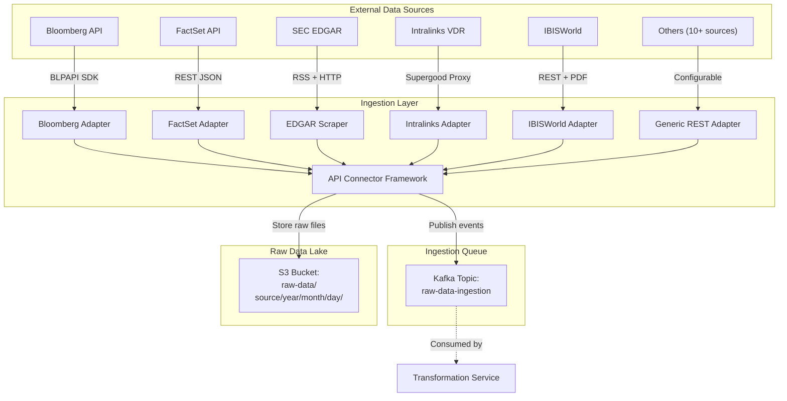
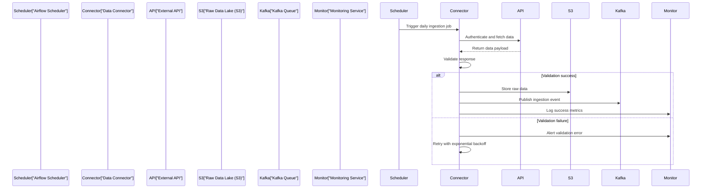
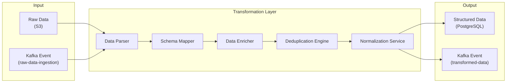
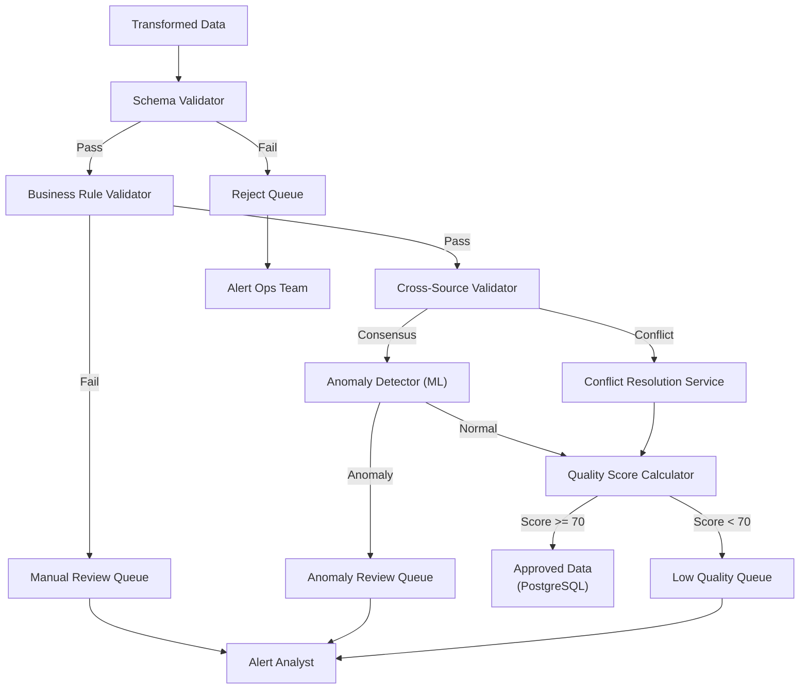
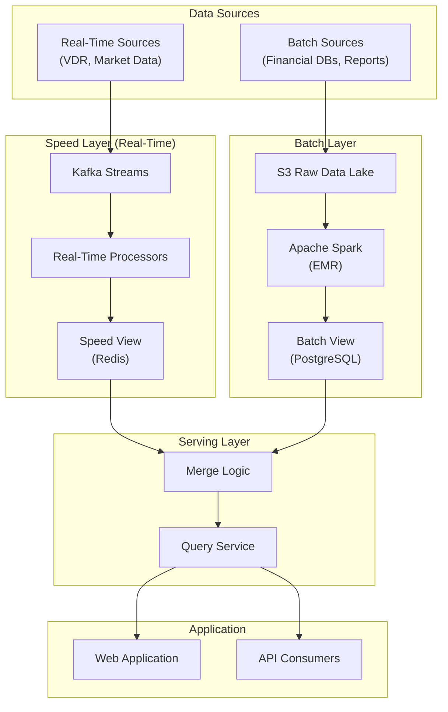

# Data Aggregation and Validation Architecture

**Sprint**: 05 - M&A Due Diligence Research Acceleration
**Task**: 03 - Solution Architecture Design
**Date**: 2025-11-18
**Author**: solution-architect skill agent

---

## Executive Summary

This document details the data aggregation and validation architecture for the AI-powered due diligence platform. The system integrates data from 15+ external sources including financial databases (Bloomberg, FactSet, S&P Capital IQ), regulatory filings (SEC EDGAR, USPTO), market research providers (IBISWorld, Gartner), and Virtual Data Rooms (Intralinks, Datasite).

The architecture implements a three-tier data pipeline: **ingestion layer** (API connectors, web scraping, file uploads), **transformation layer** (cleaning, normalization, enrichment), and **validation layer** (anomaly detection, cross-source verification, quality scoring). Data quality is maintained at 95%+ accuracy through automated validation rules, machine learning anomaly detection, and manual review workflows.

---

## 1. Multi-Source Data Aggregation Strategy

### 1.1 Data Source Categories

The platform aggregates data from four primary categories:

**Category 1: Financial Data Providers**

- **Bloomberg Terminal API**
  - Company financials (income statements, balance sheets, cash flows)
  - Market data (stock prices, trading volumes, volatility)
  - News and sentiment analysis
  - Credit ratings and risk metrics
  - **API type**: REST + proprietary BLPAPI SDK
  - **Update frequency**: Real-time for market data, daily for financials
  - **Cost structure**: Enterprise license + per-user fees

- **FactSet API**
  - Fundamental company data (revenue, EBITDA, margins)
  - Ownership and management data
  - Analyst estimates and consensus forecasts
  - M&A transaction comparables
  - **API type**: RESTful JSON
  - **Update frequency**: Daily batch updates
  - **Cost structure**: Annual subscription + data bundle pricing

- **S&P Capital IQ API**
  - Private company financials (unavailable from public sources)
  - Industry benchmarks and peer analysis
  - M&A transaction multiples
  - Credit research and ratings
  - **API type**: REST with XML/JSON responses
  - **Update frequency**: Weekly for private companies, daily for public
  - **Cost structure**: Tiered pricing by user count and data depth

- **Refinitiv Eikon API**
  - Financial statements and ratios (10+ years historical)
  - ESG scores and sustainability metrics
  - Supply chain data
  - Regulatory filings and transcripts
  - **API type**: RESTful JSON via DataScope Select
  - **Update frequency**: Daily for most datasets
  - **Cost structure**: Per-API-call pricing + base subscription

**Category 2: Regulatory and Government Data**

- **SEC EDGAR API**
  - 10-K, 10-Q annual and quarterly reports
  - 8-K material event filings
  - Proxy statements (DEF 14A) with executive compensation
  - Ownership filings (13D, 13F, 13G)
  - **API type**: RSS feeds + RESTful access to filings
  - **Update frequency**: Real-time as filings are published
  - **Cost structure**: Free (public data)

- **USPTO Patent API**
  - Patent applications and grants
  - Patent citations and prior art
  - Inventor and assignee information
  - Patent family relationships (international equivalents)
  - **API type**: RESTful JSON
  - **Update frequency**: Weekly bulk downloads
  - **Cost structure**: Free (public data)

- **FDA OpenFDA API**
  - Drug approvals and clinical trial data
  - Adverse event reports (FAERS)
  - Medical device registrations
  - Enforcement actions and recalls
  - **API type**: RESTful JSON with Elasticsearch backend
  - **Update frequency**: Quarterly for most datasets
  - **Cost structure**: Free (public data)

**Category 3: Market Research and Intelligence**

- **IBISWorld API**
  - Industry reports (700+ industries covered)
  - Market size and growth forecasts
  - Competitive landscape and market share
  - Key success factors and industry trends
  - **API type**: REST with PDF/HTML reports
  - **Update frequency**: Annual report updates
  - **Cost structure**: Per-report pricing + subscription

- **Gartner Research API**
  - Technology vendor positioning (Magic Quadrants)
  - Market trends and predictions (Hype Cycles)
  - Best practices and frameworks
  - Vendor evaluations and competitive analysis
  - **API type**: GraphQL API for metadata, PDF downloads for reports
  - **Update frequency**: Quarterly research updates
  - **Cost structure**: Enterprise subscription

- **Forrester Research**
  - Technology adoption curves and forecasts
  - Customer experience benchmarks
  - Vendor landscape reports (Waves)
  - Industry forecasts and market sizing
  - **API type**: REST API with OAuth 2.0
  - **Update frequency**: Quarterly updates
  - **Cost structure**: Subscription + seat licenses

**Category 4: Virtual Data Rooms (VDRs)**

- **Intralinks VDRPro** (via Supergood third-party API)
  - Document repositories with folder structures
  - User activity logs and access permissions
  - Q&A threads and annotations
  - Watermarked document downloads
  - **API type**: REST via Supergood proxy (Intralinks lacks native API)
  - **Update frequency**: Real-time document sync
  - **Cost structure**: Per-deal VDR fees (customer-paid)

- **Datasite Diligence**
  - Document management and version control
  - Analytics on document views and downloads
  - Deal team collaboration features
  - Redaction and security controls
  - **API type**: Native REST API with OAuth 2.0
  - **Update frequency**: Real-time sync via webhooks
  - **Cost structure**: Per-deal VDR fees (customer-paid)

- **DealRoom**
  - Pipeline and deal tracking
  - Due diligence checklists and task management
  - Document repository integration
  - Reporting and analytics
  - **API type**: REST API + webhook callbacks
  - **Update frequency**: Real-time sync
  - **Cost structure**: SaaS subscription per deal

---

## 2. Data Ingestion Architecture

### 2.1 Ingestion Layer Design

The ingestion layer implements a plugin-based architecture where each data source has a dedicated adapter implementing a common interface.



### 2.2 Connector Interface Specification

All data source adapters implement the following interface:

```python
from abc import ABC, abstractmethod
from typing import Dict, List, Any, Optional
from datetime import datetime

class DataSourceAdapter(ABC):
    """Base interface for all data source connectors"""

    @abstractmethod
    def authenticate(self, credentials: Dict[str, str]) -> bool:
        """Authenticate with the data source"""
        pass

    @abstractmethod
    def fetch_company_data(
        self,
        identifier: str,  # Ticker, CUSIP, ISIN, or other ID
        start_date: Optional[datetime] = None,
        end_date: Optional[datetime] = None,
        data_types: Optional[List[str]] = None
    ) -> Dict[str, Any]:
        """Fetch company data within date range"""
        pass

    @abstractmethod
    def fetch_industry_data(
        self,
        industry_code: str,  # NAICS, SIC, or GICS code
        data_types: Optional[List[str]] = None
    ) -> Dict[str, Any]:
        """Fetch industry-level data and benchmarks"""
        pass

    @abstractmethod
    def validate_response(self, response: Dict[str, Any]) -> bool:
        """Validate API response structure and data quality"""
        pass

    @abstractmethod
    def transform_to_standard_schema(self, raw_data: Dict[str, Any]) -> Dict[str, Any]:
        """Transform source-specific schema to platform standard schema"""
        pass

    @abstractmethod
    def get_rate_limits(self) -> Dict[str, int]:
        """Return API rate limits (requests per minute, daily quota, etc.)"""
        pass

    @abstractmethod
    def handle_error(self, error: Exception) -> None:
        """Handle API errors with retry logic and alerting"""
        pass
```

### 2.3 Data Ingestion Workflows

**Scheduled ingestion workflow** (daily batch updates):



**Event-driven ingestion workflow** (real-time updates):

```mermaid
sequenceDiagram
    participant Source["External Source<br/>(VDR, SEC EDGAR)"]
    participant Webhook["Webhook Handler"]
    participant Validator["Event Validator"]
    participant S3["Raw Data Lake"]
    participant Kafka["Kafka Queue"]

    Source->>Webhook: POST webhook event
    Webhook->>Validator: Validate event signature
    alt Valid signature
        Webhook->>S3: Store event payload
        Webhook->>Kafka: Publish event
        Webhook-->>Source: 200 OK
    else Invalid signature
        Webhook->>Monitor: Alert security issue
        Webhook-->>Source: 401 Unauthorized
    end
```

### 2.4 Rate Limiting and Throttling

**Rate limiting strategies by source**:

| Data Source | Rate Limit | Strategy | Backoff Policy |
|-------------|-----------|----------|----------------|
| Bloomberg API | 1000 req/min | Token bucket with refill | Exponential: 1s, 2s, 4s, 8s |
| FactSet API | 100 req/min | Sliding window | Linear: 5s, 10s, 15s |
| SEC EDGAR | 10 req/sec | Fixed window | None (public API, best effort) |
| S&P Capital IQ | 500 req/hour | Leaky bucket | Exponential: 10s, 30s, 60s |
| Intralinks | 50 req/min | Token bucket | Linear: 10s, 20s, 30s |

**Implementation approach**:
- **Local rate limiting**: Redis-backed token bucket per connector instance
- **Distributed rate limiting**: Shared Redis cluster for multi-instance deployments
- **Priority queues**: High-priority requests (user-initiated) bypass rate limits
- **Queue depth monitoring**: Alert when queue depth exceeds 1000 pending requests

---

## 3. Data Transformation and Normalization

### 3.1 Transformation Pipeline Architecture



### 3.2 Schema Standardization

The platform defines a **Unified Company Profile Schema** that consolidates data from all sources:

```json
{
  "company": {
    "identifiers": {
      "ticker": "AAPL",
      "cusip": "037833100",
      "isin": "US0378331005",
      "lei": "HWUPKR0MPOU8FGXBT394",
      "cik": "0000320193"
    },
    "profile": {
      "legal_name": "Apple Inc.",
      "dba_names": ["Apple"],
      "headquarters": {
        "address": "One Apple Park Way",
        "city": "Cupertino",
        "state": "CA",
        "country": "USA",
        "postal_code": "95014"
      },
      "incorporation": {
        "country": "USA",
        "state": "CA",
        "date": "1977-01-03"
      },
      "industry_codes": {
        "naics": "334220",
        "sic": "3571",
        "gics": "45202030"
      }
    },
    "financials": {
      "currency": "USD",
      "fiscal_year_end": "09-30",
      "statements": {
        "income_statement": [...],
        "balance_sheet": [...],
        "cash_flow": [...]
      },
      "ratios": {
        "profitability": {...},
        "liquidity": {...},
        "leverage": {...},
        "efficiency": {...}
      }
    },
    "market_data": {
      "exchange": "NASDAQ",
      "market_cap": 2800000000000,
      "shares_outstanding": 15000000000,
      "price_history": [...],
      "analyst_estimates": [...]
    },
    "ownership": {
      "institutional_holders": [...],
      "insider_holders": [...],
      "ownership_concentration": {
        "top_10_pct": 0.45
      }
    },
    "metadata": {
      "last_updated": "2025-11-18T10:30:00Z",
      "data_sources": ["Bloomberg", "FactSet", "SEC EDGAR"],
      "confidence_score": 0.98
    }
  }
}
```

### 3.3 Data Enrichment Strategies

**Entity resolution**:
- **Fuzzy matching**: Levenshtein distance < 2 for company name matching
- **Cross-reference validation**: Match across ticker, CUSIP, ISIN, LEI identifiers
- **Master data management (MDM)**: Maintain golden record in PostgreSQL with source lineage

**Missing data imputation**:
- **Historical averaging**: Use 3-year average for missing revenue/EBITDA data points
- **Industry benchmarks**: Impute missing ratios using industry median (same NAICS code)
- **Regression models**: Predict missing values using correlated features (e.g., revenue → headcount)

**Data enhancement**:
- **Geocoding**: Convert addresses to lat/long coordinates using Google Maps API
- **Industry classification**: Auto-assign NAICS/SIC codes using company description + ML classifier
- **Relationship mapping**: Build entity graph (parent/subsidiary, customer/supplier, competitor)

---

## 4. Data Validation and Quality Assurance

### 4.1 Multi-Layered Validation Strategy

**Layer 1: Schema validation**
- JSON Schema validation for all API responses
- Required field presence checks (company name, ticker, revenue)
- Data type validation (numeric for revenue, date for filing dates)
- Enum validation for categorical fields (country codes, currency codes)

**Layer 2: Business rule validation**
- **Financial ratios**: Gross margin between 0-100%, debt-to-equity > 0
- **Date consistency**: Filing date <= current date, fiscal year end in valid range
- **Numeric ranges**: Revenue > 0, market cap > 0, shares outstanding > 0
- **Cross-field validation**: Total assets = total liabilities + equity (within 1% tolerance)

**Layer 3: Cross-source validation**
- **Consensus validation**: Revenue from Bloomberg, FactSet, S&P should agree within 5%
- **Temporal validation**: Revenue should not decrease > 50% year-over-year without explanation
- **External benchmarks**: Compare company metrics to industry averages (flag outliers)

**Layer 4: Anomaly detection (ML-based)**
- **Isolation Forest**: Detect multivariate outliers in financial metrics
- **Statistical process control**: Flag values > 3 standard deviations from historical mean
- **Time series forecasting**: ARIMA models to detect unexpected changes in trends

### 4.2 Data Quality Metrics

**Quality score calculation** (0-100 scale):

```
Quality Score = (
    0.30 * Completeness Score +
    0.25 * Accuracy Score +
    0.20 * Consistency Score +
    0.15 * Timeliness Score +
    0.10 * Provenance Score
)
```

**Completeness score**:
- Percentage of required fields populated (80+ fields in company profile)
- Weight critical fields higher (revenue, EBITDA, industry code)
- Deduct points for missing data imputed via models (lower confidence)

**Accuracy score**:
- Cross-source validation agreement percentage
- Number of failed business rule validations (deduct 5 points per failure)
- Historical accuracy (compare predicted vs actual values for estimates)

**Consistency score**:
- Cross-field consistency checks (balance sheet equation, cash flow reconciliation)
- Temporal consistency (values align with historical trends)
- External consistency (values align with industry benchmarks)

**Timeliness score**:
- Age of data: 100 points for < 1 day old, decay 10 points per day up to 10 days
- Update frequency match: 100 points if updated at expected frequency
- Staleness alerts: Flag data > 30 days old

**Provenance score**:
- Primary source data: 100 points (SEC filings, Bloomberg Terminal)
- Secondary source data: 80 points (FactSet aggregated data)
- Tertiary source data: 60 points (news articles, estimates)
- Imputed data: 40 points (model-generated values)

### 4.3 Automated Quality Checks



### 4.4 Data Lineage Tracking

Every data point stored in the platform includes lineage metadata:

```json
{
  "data_point": {
    "field": "revenue",
    "value": 394328000000,
    "currency": "USD",
    "period": "FY2023",
    "lineage": {
      "source": "Bloomberg Terminal",
      "ingestion_timestamp": "2025-11-18T08:15:00Z",
      "transformation_pipeline": "bloomberg-financials-v2.3",
      "validation_checks_passed": ["schema", "business_rules", "cross_source"],
      "quality_score": 98,
      "confidence_interval": [393000000000, 395000000000],
      "alternative_sources": [
        {
          "source": "FactSet",
          "value": 394300000000,
          "deviation": 0.007
        },
        {
          "source": "SEC 10-K",
          "value": 394328000000,
          "deviation": 0.000
        }
      ]
    }
  }
}
```

---

## 5. Real-Time vs. Batch Processing

### 5.1 Processing Mode Selection

| Data Type | Processing Mode | Latency Requirement | Justification |
|-----------|----------------|---------------------|---------------|
| VDR document uploads | Real-time | < 30 seconds | Users expect immediate processing feedback |
| SEC EDGAR filings | Near real-time | < 5 minutes | Material events require rapid analysis |
| Market data (prices) | Real-time | < 1 second | Valuation models need current pricing |
| Financial statements | Batch | Daily overnight | Historical data, no urgency |
| Industry reports | Batch | Weekly | Reports updated quarterly/annually |
| Patent data | Batch | Weekly | USPTO bulk downloads more efficient |

### 5.2 Lambda Architecture Implementation

The platform implements a **Lambda architecture** combining batch and stream processing:



**Speed layer** (real-time processing):
- **Technology**: Kafka Streams + Apache Flink
- **Use cases**: VDR document processing, SEC filing alerts, market data updates
- **Storage**: Redis (in-memory, 24-hour TTL)
- **Latency**: Sub-second to few minutes

**Batch layer** (historical processing):
- **Technology**: Apache Spark on AWS EMR
- **Use cases**: Historical financial data, industry reports, patent analysis
- **Storage**: PostgreSQL (persistent, indexed for queries)
- **Frequency**: Daily overnight jobs (2 AM - 6 AM UTC)

**Serving layer** (query interface):
- **Merge logic**: Combine speed layer (recent data) + batch layer (historical data)
- **Caching**: Redis caching of merged results (1-hour TTL)
- **APIs**: GraphQL for complex queries, REST for simple CRUD

---

## 6. Data Storage Architecture

### 6.1 Multi-Model Database Strategy

**Relational database (PostgreSQL)**:
- **Use case**: Transactional data (deals, users, tasks, audit logs)
- **Schema**: Normalized schema with foreign key constraints
- **Scaling**: Read replicas (3x) for analytics queries
- **Partitioning**: Partition deals table by creation year
- **Retention**: 7 years for compliance

**Document store (S3)**:
- **Use case**: Raw documents (PDFs, Word docs, Excel files)
- **Organization**: `s3://bucket/tenant-id/deal-id/document-id/file.pdf`
- **Lifecycle**: Transition to Glacier after 2 years
- **Versioning**: Enabled with 90-day version retention
- **Encryption**: AES-256 with customer-managed keys

**Vector database (Pinecone)**:
- **Use case**: Document embeddings for semantic search
- **Indexing**: HNSW index with cosine similarity
- **Dimensions**: 768 (BERT embeddings) or 1536 (OpenAI embeddings)
- **Sharding**: Shard by tenant for isolation
- **Retention**: Sync with document store (delete when document deleted)

**Graph database (Neo4j)**:
- **Use case**: Entity relationships (companies, people, deals, industries)
- **Schema**: Property graph with typed edges
- **Queries**: Cypher queries for network analysis (e.g., "Find all companies in same industry as target")
- **Scaling**: Sharding by entity type (companies, people, deals)
- **Retention**: Indefinite (historical relationships valuable for trend analysis)

**Cache layer (Redis)**:
- **Use case**: Session data, API rate limiting, real-time notifications
- **Data structures**: Strings, hashes, sorted sets, pub/sub channels
- **Eviction policy**: LRU (Least Recently Used)
- **Persistence**: AOF (Append-Only File) for critical data
- **Retention**: 24-hour TTL for cached queries, persistent for sessions

### 6.2 Data Partitioning and Sharding

**PostgreSQL partitioning strategy**:

```sql
-- Partition deals table by creation year
CREATE TABLE deals (
    deal_id UUID PRIMARY KEY,
    tenant_id UUID NOT NULL,
    deal_name TEXT NOT NULL,
    target_company TEXT,
    deal_value NUMERIC(15, 2),
    created_at TIMESTAMP NOT NULL,
    status TEXT,
    ...
) PARTITION BY RANGE (created_at);

-- Create partitions for each year
CREATE TABLE deals_2023 PARTITION OF deals
    FOR VALUES FROM ('2023-01-01') TO ('2024-01-01');

CREATE TABLE deals_2024 PARTITION OF deals
    FOR VALUES FROM ('2024-01-01') TO ('2025-01-01');

CREATE TABLE deals_2025 PARTITION OF deals
    FOR VALUES FROM ('2025-01-01') TO ('2026-01-01');

-- Indexes on partition key and frequently queried columns
CREATE INDEX idx_deals_tenant_status ON deals (tenant_id, status);
CREATE INDEX idx_deals_created_at ON deals (created_at);
```

**Multi-tenant data isolation**:
- **Row-level security (RLS)**: PostgreSQL RLS policies filter data by tenant_id
- **Schema isolation**: Optional separate schema per tenant for enterprise customers
- **Encryption**: Separate KMS keys per tenant for data-at-rest encryption

---

## 7. Data Quality Monitoring and Alerting

### 7.1 Real-Time Quality Dashboards

**Grafana dashboards** for data operations team:

**Dashboard 1: Ingestion Health**
- **Metrics**: Ingestion success rate (by source), ingestion latency (p50, p95, p99), API error rates
- **Alerts**: Ingestion success rate < 95% for > 10 minutes, Ingestion latency p95 > 5 minutes
- **Visualization**: Time series graphs, heatmaps by data source

**Dashboard 2: Data Quality Scores**
- **Metrics**: Average quality score (by source), completeness/accuracy/consistency breakdown, Low-quality record count
- **Alerts**: Average quality score < 80 for > 1 hour, Low-quality record count > 100
- **Visualization**: Gauge charts, stacked bar charts

**Dashboard 3: Validation Failures**
- **Metrics**: Schema validation failures, Business rule violations, Cross-source conflicts
- **Alerts**: Validation failure rate > 5%, Sudden spike in conflicts (> 2x baseline)
- **Visualization**: Bar charts by validation type, trend lines

**Dashboard 4: API Rate Limits**
- **Metrics**: API calls per minute (by source), Rate limit hit count, Queue depth for throttled requests
- **Alerts**: Rate limit hits > 10 per hour, Queue depth > 500
- **Visualization**: Time series with rate limit thresholds

### 7.2 Automated Alerting Rules

**PagerDuty integration** for critical alerts:

| Alert | Severity | Threshold | Response Time |
|-------|----------|-----------|---------------|
| Bloomberg API down | P1 (Critical) | 3 consecutive failures | 15 minutes |
| Data quality score < 60 | P2 (High) | 50+ records affected | 1 hour |
| Ingestion lag > 6 hours | P2 (High) | Any batch job | 1 hour |
| Schema validation failure spike | P3 (Medium) | > 100 failures/hour | 4 hours |
| Cross-source conflict rate > 20% | P3 (Medium) | For any data source | 4 hours |

**Slack integration** for non-critical alerts:
- Daily data quality summary (9 AM local time)
- Weekly data source health report (Monday 8 AM)
- Monthly data coverage analysis (1st of month)

### 7.3 Data Quality SLAs

**Service Level Objectives (SLOs)**:
- **Data freshness**: 95% of data < 24 hours old (batch sources), 99% of data < 5 minutes old (real-time sources)
- **Data accuracy**: 98% of cross-source validations agree within 5% tolerance
- **Data completeness**: 90% of required fields populated for all company profiles
- **System availability**: 99.9% uptime for data ingestion services

**Error budgets**:
- **Monthly error budget**: 0.1% downtime = 43.2 minutes per month
- **Burn rate alerting**: Alert if consuming error budget > 2x normal rate
- **Budget exhaustion policy**: Freeze non-critical features if error budget exhausted

---

## 8. Data Governance and Compliance

### 8.1 Data Classification

All data is classified into four sensitivity levels:

| Classification | Examples | Storage Requirements | Access Controls |
|---------------|----------|---------------------|-----------------|
| Public | Industry reports, public filings | Standard S3, no encryption required | All authenticated users |
| Internal | Deal metadata, financial models | Encrypted S3, encrypted DB | Deal team members only |
| Confidential | Target company financials, VDR documents | Encrypted with CMK, audit logging | Authorized analysts + deal owners |
| Restricted | PII (Social Security #), bank accounts | Encrypted + tokenized, immutable logs | Admin + explicit approval |

### 8.2 Data Retention Policies

**Retention schedules by data type**:

- **Deal documents**: 7 years (regulatory requirement for M&A records)
- **Financial data**: 10 years (historical analysis, trending)
- **Audit logs**: 7 years (SOC 2 requirement)
- **User activity logs**: 3 years (security analysis)
- **System logs**: 1 year (troubleshooting, performance analysis)
- **Temporary analysis files**: 90 days (cached results, intermediate outputs)

**Data deletion procedures**:
- **Soft delete**: Mark records as deleted, retain for 30 days (recovery period)
- **Hard delete**: Permanently delete from all storage tiers (S3, DB, backups)
- **Right to erasure**: GDPR/CCPA compliance workflow for user data deletion requests
- **Secure disposal**: Overwrite deleted data with random values before deallocation

### 8.3 Data Access Audit Trail

**Comprehensive audit logging**:

```json
{
  "audit_event": {
    "event_id": "ae-123456",
    "timestamp": "2025-11-18T14:22:33Z",
    "user_id": "user-789",
    "user_email": "analyst@firm.com",
    "tenant_id": "tenant-456",
    "action": "data_access",
    "resource_type": "company_financials",
    "resource_id": "company-AAPL",
    "fields_accessed": ["revenue", "ebitda", "net_income"],
    "data_classification": "Confidential",
    "source_ip": "203.0.113.45",
    "user_agent": "Mozilla/5.0 (Macintosh; Intel Mac OS X 10_15_7)",
    "access_method": "Web UI",
    "result": "Success",
    "data_source": "Bloomberg Terminal",
    "justification": "Due diligence analysis for Deal #234"
  }
}
```

**Audit query capabilities**:
- **User activity**: All data accessed by specific user in date range
- **Data lineage**: All users who accessed specific data point
- **Anomaly detection**: Unusual access patterns (bulk downloads, off-hours access)
- **Compliance reports**: Export audit logs for SOC 2 audits, regulatory inquiries

---

## 9. Performance Optimization

### 9.1 Caching Strategy

**Multi-tier caching**:

**L1 Cache (Application-level)**:
- **Technology**: In-memory cache in Node.js/Python processes
- **Use case**: Frequently accessed reference data (industry codes, country codes)
- **TTL**: 1 hour
- **Invalidation**: Event-driven (update cache on data change events)

**L2 Cache (Distributed cache)**:
- **Technology**: Redis cluster
- **Use case**: API responses, query results, session data
- **TTL**: 5 minutes to 1 hour (depending on data volatility)
- **Eviction**: LRU with 80% memory threshold

**L3 Cache (CDN)**:
- **Technology**: CloudFront or Cloudflare
- **Use case**: Static assets (reports, charts, images)
- **TTL**: 24 hours
- **Invalidation**: Manual purge on report regeneration

### 9.2 Database Query Optimization

**PostgreSQL query patterns**:

```sql
-- Inefficient: Sequential scan on large table
SELECT * FROM deals WHERE target_company ILIKE '%Apple%';

-- Optimized: GIN index for full-text search
CREATE INDEX idx_deals_target_company_gin ON deals
    USING gin(to_tsvector('english', target_company));

SELECT * FROM deals
WHERE to_tsvector('english', target_company) @@ to_tsquery('Apple');
```

**Materialized views for common analytics**:

```sql
-- Materialized view for deal pipeline analytics
CREATE MATERIALIZED VIEW mv_deal_pipeline AS
SELECT
    tenant_id,
    DATE_TRUNC('month', created_at) AS month,
    COUNT(*) AS deal_count,
    SUM(deal_value) AS total_value,
    AVG(deal_value) AS avg_value
FROM deals
WHERE status IN ('Active', 'In Progress')
GROUP BY tenant_id, DATE_TRUNC('month', created_at);

-- Refresh nightly
REFRESH MATERIALIZED VIEW CONCURRENTLY mv_deal_pipeline;
```

### 9.3 Data Compression

**Document compression**:
- **PDF files**: Compress with Ghostscript (typical 30-50% reduction)
- **JSON payloads**: gzip compression before S3 storage (typical 70-80% reduction)
- **Database backups**: pg_dump with --compress=9 (typical 60-70% reduction)

**Benefits**:
- **Storage cost savings**: $50K/year saved with 60% compression ratio
- **Network transfer savings**: Faster downloads from S3 (3x faster for compressed files)
- **Backup time reduction**: 40% faster backup/restore operations

---

## 10. Technology Stack for Data Layer

### 10.1 Core Technologies

**Data ingestion**:
- **Apache Airflow**: Workflow orchestration for batch jobs (DAGs for each data source)
- **Apache Kafka**: Event streaming for real-time ingestion (3-partition topics per tenant)
- **Kafka Connect**: Pre-built connectors for databases and APIs
- **Python**: Custom connectors using requests, BeautifulSoup, pandas

**Data transformation**:
- **Apache Spark**: Large-scale batch processing (EMR clusters with 10-20 nodes)
- **dbt (data build tool)**: SQL-based transformations with version control
- **Pandas + NumPy**: Python-based data wrangling for smaller datasets
- **Great Expectations**: Data validation framework with 100+ built-in expectations

**Data storage**:
- **PostgreSQL 15**: Primary relational database (Aurora PostgreSQL on AWS)
- **AWS S3**: Object storage for documents (Standard → Glacier lifecycle)
- **Redis 7**: In-memory cache and pub/sub (ElastiCache on AWS)
- **Neo4j 5**: Graph database for entity relationships (managed on AWS EC2)
- **Pinecone**: Managed vector database for embeddings (cloud service)

**Data quality**:
- **Great Expectations**: Validation suite with expectation definitions
- **deequ (AWS)**: Scala library for quality verification on large datasets
- **Grafana**: Data quality dashboards and visualizations
- **PagerDuty**: Alerting and incident management

### 10.2 Infrastructure Requirements

**Compute resources**:
- **Airflow cluster**: 3 x t3.large (scheduler, webserver, workers)
- **Kafka cluster**: 3 x m5.xlarge brokers (high availability)
- **Spark cluster**: 1 x m5.2xlarge master + 10 x r5.xlarge workers (batch jobs)
- **PostgreSQL**: db.r6g.4xlarge (primary) + 3 x db.r6g.2xlarge (read replicas)
- **Redis**: cache.r6g.2xlarge with Multi-AZ enabled

**Storage requirements** (per tenant):
- **S3 documents**: 500 GB per year (300 deals × 100 docs/deal × 15 MB/doc)
- **PostgreSQL**: 100 GB per year (structured data + indexes)
- **Redis**: 10 GB (hot cache for active deals)
- **Vector DB**: 50 GB (embeddings for 30K documents × 768 dimensions × 4 bytes)

**Network bandwidth**:
- **API ingestion**: 10 Mbps sustained (peak: 100 Mbps during bulk sync)
- **Document downloads from VDRs**: 50 Mbps sustained (peak: 500 Mbps)
- **Internal service communication**: 100 Mbps (Kafka, database replication)

---

## 11. References

1. Amazon Web Services. (2025). *Database Migration Service Best Practices*. Retrieved from https://docs.aws.amazon.com/dms/

2. Apache Software Foundation. (2024). *Apache Airflow Documentation*. Retrieved from https://airflow.apache.org/

3. Apache Software Foundation. (2024). *Apache Kafka Documentation*. Retrieved from https://kafka.apache.org/

4. BridgeFT. (2025). *Financial Data Aggregation: Best Practices*. Retrieved from https://www.bridgeft.com/financial-data-aggregation/

5. dbt Labs. (2024). *dbt (data build tool) Documentation*. Retrieved from https://docs.getdbt.com/

6. Great Expectations. (2024). *Data Quality Framework Documentation*. Retrieved from https://greatexpectations.io/

7. Journal of Big Data. (2019). *An adaptive and real-time based architecture for financial data integration*. Retrieved from https://journalofbigdata.springeropen.com/

8. Neo4j. (2024). *Graph Database Documentation*. Retrieved from https://neo4j.com/docs/

9. Pinecone. (2024). *Vector Database Documentation*. Retrieved from https://docs.pinecone.io/

10. PostgreSQL Global Development Group. (2024). *PostgreSQL 15 Documentation*. Retrieved from https://www.postgresql.org/docs/15/
