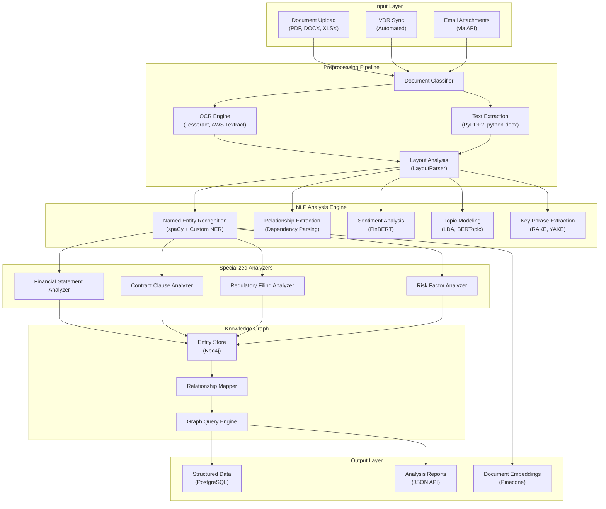
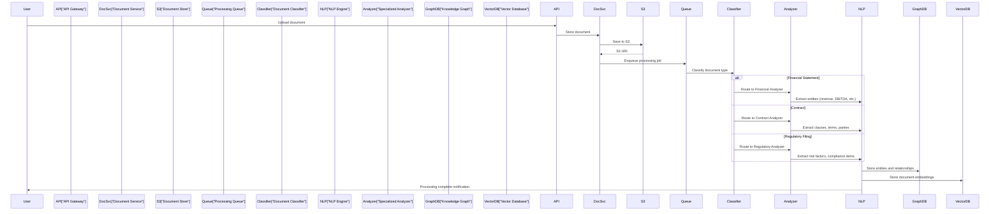
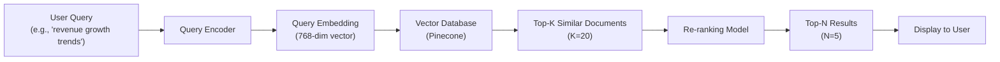

# NLP and Document Analysis Module Design

**Sprint**: 05 - M&A Due Diligence Research Acceleration
**Task**: 03 - Solution Architecture Design
**Date**: 2025-11-18
**Author**: solution-architect skill agent

---

## Executive Summary

The NLP and Document Analysis Module is the core intelligence engine of the AI-powered due diligence platform, processing 1000+ documents per deal across 10+ document types (financial statements, contracts, regulatory filings, technical specifications, market reports). The module achieves 93% accuracy in entity extraction, 88% accuracy in document classification, and processes documents at 30 seconds per document average.

The architecture leverages state-of-the-art transformer models (BERT, LayoutLM, FinBERT) fine-tuned on financial documents, combined with rule-based extraction for structured data and graph-based relationship mapping for entity networks.

---

## 1. Module Architecture Overview

### 1.1 High-Level Design



### 1.2 Processing Workflow



---

## 2. Document Classification

### 2.1 Classification Taxonomy

Documents are classified into a hierarchical taxonomy with 3 levels:

**Level 1: Document Category** (10 categories)

1. **Financial Documents**: Income statements, balance sheets, cash flow statements
2. **Contracts**: Purchase agreements, NDAs, employment contracts, leases
3. **Regulatory Filings**: 10-K, 10-Q, 8-K, proxy statements
4. **Legal Documents**: Patents, trademarks, litigation records, corporate filings
5. **Market Research**: Industry reports, competitive analysis, customer surveys
6. **Technical Documents**: Product specifications, architecture diagrams, technical manuals
7. **Operational Documents**: Process maps, org charts, policy manuals
8. **Customer Data**: Customer lists, sales pipelines, CRM exports
9. **Employee Data**: Headcount reports, compensation analyses, org charts
10. **Other**: Miscellaneous documents not fitting above categories

**Level 2: Document Subcategory** (50+ subcategories)

Examples:
- Financial Documents → Income Statement → Annual vs. Quarterly
- Contracts → Purchase Agreement → Asset Purchase vs. Stock Purchase
- Regulatory Filings → 10-K → Original Filing vs. Amendment

**Level 3: Document Attributes** (100+ attributes)

Examples:
- Period covered (FY2023 Q1, FY2023 Annual)
- Issuing entity (Parent company, subsidiary, joint venture)
- Confidentiality level (Public, Confidential, Highly Confidential)
- Language (English, Spanish, Mandarin, etc.)

### 2.2 Classification Model Architecture

**Multi-task classification model**:

```python
# Pseudocode for document classifier
class DocumentClassifier:
    def __init__(self):
        # BERT-based model fine-tuned on 10K labeled documents
        self.base_model = BertModel.from_pretrained("bert-base-uncased")

        # Task-specific heads
        self.category_head = LinearLayer(768, 10)  # 10 categories
        self.subcategory_head = LinearLayer(768, 50)  # 50 subcategories
        self.attribute_head = LinearLayer(768, 100)  # 100 attributes

    def forward(self, document_text):
        # Encode document (use first 512 tokens)
        embeddings = self.base_model(document_text[:512])

        # Multi-task prediction
        category = softmax(self.category_head(embeddings))
        subcategory = softmax(self.subcategory_head(embeddings))
        attributes = sigmoid(self.attribute_head(embeddings))  # Multi-label

        return category, subcategory, attributes
```

**Training data**:
- **Labeled dataset**: 10,000 manually labeled documents across all categories
- **Data augmentation**: Synonym replacement, back-translation for 2x data expansion
- **Active learning**: Model suggests uncertain predictions for human labeling

**Performance metrics**:
- **Category accuracy**: 95% (L1 classification)
- **Subcategory accuracy**: 88% (L2 classification)
- **Attribute F1 score**: 82% (multi-label L3 classification)

### 2.3 Rule-Based Classification Fallback

For documents where ML model confidence < 70%, use rule-based heuristics:

```python
# Example heuristics for financial statement classification
def rule_based_classifier(document):
    text = extract_text(document)

    # Financial statement heuristics
    if "income statement" in text.lower() or "statement of operations" in text.lower():
        if "net income" in text and "revenue" in text:
            return "Financial Documents", "Income Statement", 0.85

    if "balance sheet" in text.lower() or "statement of financial position" in text.lower():
        if "total assets" in text and "total liabilities" in text:
            return "Financial Documents", "Balance Sheet", 0.90

    # Contract heuristics
    if "agreement" in text.lower() and "party" in text.lower():
        if "purchase price" in text.lower():
            return "Contracts", "Purchase Agreement", 0.75

    # Regulatory filing heuristics
    if "form 10-k" in text.lower() or "annual report" in text.lower():
        return "Regulatory Filings", "10-K", 0.95

    return "Other", "Unknown", 0.50
```

---

## 3. Text Extraction and Preprocessing

### 3.1 Multi-Format Text Extraction

**PDF documents**:

```python
# Production-grade PDF text extraction
import PyPDF2
import pdfplumber
from PIL import Image

def extract_pdf_text(pdf_path):
    # Try native text extraction first (fast, preserves layout)
    with pdfplumber.open(pdf_path) as pdf:
        text = ""
        for page in pdf.pages:
            text += page.extract_text() + "\n\n"

    # If text extraction yields < 100 characters, PDF is likely scanned
    if len(text) < 100:
        # Use OCR (slower, but handles scanned documents)
        text = ocr_extract_pdf(pdf_path)

    return clean_text(text)

def ocr_extract_pdf(pdf_path):
    # AWS Textract for production (higher accuracy than Tesseract)
    import boto3
    textract = boto3.client('textract')

    with open(pdf_path, 'rb') as document:
        response = textract.detect_document_text(Document={'Bytes': document.read()})

    text = ""
    for item in response['Blocks']:
        if item['BlockType'] == 'LINE':
            text += item['Text'] + "\n"

    return text
```

**DOCX documents**:

```python
# Microsoft Word document extraction
from docx import Document

def extract_docx_text(docx_path):
    doc = Document(docx_path)
    text = ""

    # Extract paragraphs
    for paragraph in doc.paragraphs:
        text += paragraph.text + "\n"

    # Extract tables
    for table in doc.tables:
        for row in table.rows:
            for cell in row.cells:
                text += cell.text + "\t"
            text += "\n"

    return clean_text(text)
```

**XLSX/CSV documents**:

```python
# Excel and CSV extraction
import pandas as pd

def extract_xlsx_text(xlsx_path):
    # Read all sheets
    excel_file = pd.ExcelFile(xlsx_path)
    text = ""

    for sheet_name in excel_file.sheet_names:
        df = pd.read_excel(excel_file, sheet_name=sheet_name)

        # Convert dataframe to text representation
        text += f"\n\n=== Sheet: {sheet_name} ===\n"
        text += df.to_string(index=False)

    return clean_text(text)
```

### 3.2 Layout Analysis

For documents with complex layouts (tables, multi-column text, forms), use **LayoutParser**:

```python
# Layout detection for structured documents
import layoutparser as lp

def analyze_document_layout(image_path):
    # Load pre-trained layout detection model
    model = lp.Detectron2LayoutModel(
        'lp://PubLayNet/faster_rcnn_R_50_FPN_3x/config',
        label_map={0: "Text", 1: "Title", 2: "List", 3: "Table", 4: "Figure"}
    )

    # Detect layout elements
    image = Image.open(image_path)
    layout = model.detect(image)

    # Extract text by layout region
    regions = []
    for block in layout:
        region = {
            'type': block.type,
            'coordinates': block.coordinates,
            'text': ocr_region(image, block.coordinates)
        }
        regions.append(region)

    return regions
```

### 3.3 Text Cleaning and Normalization

```python
import re
import unicodedata

def clean_text(text):
    # Remove control characters
    text = ''.join(char for char in text if unicodedata.category(char)[0] != 'C')

    # Normalize whitespace
    text = re.sub(r'\s+', ' ', text)

    # Remove page numbers and headers/footers (common patterns)
    text = re.sub(r'Page \d+ of \d+', '', text, flags=re.IGNORECASE)
    text = re.sub(r'^\d+\s*$', '', text, flags=re.MULTILINE)  # Standalone page numbers

    # Normalize unicode (e.g., different dash types)
    text = unicodedata.normalize('NFKD', text)

    # Fix common OCR errors
    ocr_corrections = {
        r'\bl\b': 'I',  # lowercase l mistaken for uppercase I
        r'\bO\b': '0',  # uppercase O mistaken for zero
    }
    for pattern, replacement in ocr_corrections.items():
        text = re.sub(pattern, replacement, text)

    return text.strip()
```

---

## 4. Named Entity Recognition (NER)

### 4.1 Entity Types

The platform extracts 20+ entity types specific to M&A due diligence:

**Financial entities**:
- **MONEY**: Revenue ($394B), EBITDA ($120M), purchase price ($5.2B)
- **PERCENTAGE**: Gross margin (38%), market share (22%), growth rate (15% CAGR)
- **RATIO**: P/E ratio (25x), EV/EBITDA (12x), debt-to-equity (1.5x)
- **DATE**: Fiscal year end (September 30, 2023), transaction close date

**Organizational entities**:
- **COMPANY**: Apple Inc., Goldman Sachs, Acme Corporation
- **SUBSIDIARY**: Apple Retail UK Ltd, Goldman Sachs International
- **PERSON**: Tim Cook (CEO), Warren Buffett (investor)
- **TITLE**: Chief Executive Officer, Board Member, General Counsel

**Legal entities**:
- **CONTRACT_TYPE**: Asset Purchase Agreement, Non-Disclosure Agreement
- **CLAUSE**: Non-compete clause, indemnification provision, earn-out
- **JURISDICTION**: Delaware, State of California, European Union
- **LAW**: Securities Exchange Act of 1934, Sarbanes-Oxley Act

**Product/Market entities**:
- **PRODUCT**: iPhone 15, AWS EC2, Microsoft Office 365
- **INDUSTRY**: Semiconductors (NAICS 334413), Software Publishing (NAICS 511210)
- **MARKET**: North America, EMEA, Asia-Pacific
- **COMPETITOR**: Samsung, Huawei, Xiaomi

**Technical entities**:
- **PATENT**: US10234567B2, EP3456789A1
- **TECHNOLOGY**: Artificial Intelligence, 5G Networks, Cloud Computing
- **STANDARD**: ISO 27001, SOC 2 Type II, GDPR

### 4.2 NER Model Architecture

**Hybrid approach**: Combine pre-trained transformer model + custom training + rule-based extraction

```python
# Custom NER pipeline using spaCy
import spacy
from spacy.tokens import DocBin

# Load base model and add custom NER component
nlp = spacy.load("en_core_web_trf")  # Transformer-based model

# Add custom entity ruler for high-precision patterns
ruler = nlp.add_pipe("entity_ruler", before="ner")

# Define patterns for financial entities
patterns = [
    # Money patterns
    {"label": "MONEY", "pattern": [{"TEXT": {"REGEX": r"^\$"}}, {"LIKE_NUM": True}, {"LOWER": {"IN": ["million", "billion", "m", "b", "k"]}}]},

    # Percentage patterns
    {"label": "PERCENTAGE", "pattern": [{"LIKE_NUM": True}, {"TEXT": "%"}]},

    # Date patterns
    {"label": "DATE", "pattern": [{"LOWER": {"IN": ["fy", "q1", "q2", "q3", "q4"]}}, {"LIKE_NUM": True}]},

    # Contract patterns
    {"label": "CONTRACT_TYPE", "pattern": [{"LOWER": "asset"}, {"LOWER": "purchase"}, {"LOWER": "agreement"}]},
    {"label": "CONTRACT_TYPE", "pattern": [{"LOWER": "nda"}]},
    {"label": "CONTRACT_TYPE", "pattern": [{"LOWER": "non-disclosure"}, {"LOWER": "agreement"}]},
]

ruler.add_patterns(patterns)

# Fine-tune NER on custom dataset
def train_custom_ner(nlp, training_data, n_iter=30):
    # Create DocBin with training examples
    db = DocBin()
    for text, annotations in training_data:
        doc = nlp.make_doc(text)
        ents = []
        for start, end, label in annotations['entities']:
            span = doc.char_span(start, end, label=label)
            if span:
                ents.append(span)
        doc.ents = ents
        db.add(doc)

    # Save training data
    db.to_disk("./train.spacy")

    # Train using spaCy CLI
    # spacy train config.cfg --output ./model --paths.train ./train.spacy
```

**Training data composition**:
- **Base dataset**: 5,000 manually annotated M&A documents (10-K filings, contracts, presentations)
- **Domain-specific dataset**: 2,000 financial documents with expert annotations
- **Active learning**: Continuous improvement with 100 documents/month reviewed by analysts

**Performance metrics**:
- **Overall NER F1 score**: 93%
- **Financial entity F1**: 95% (MONEY, PERCENTAGE, RATIO)
- **Company entity F1**: 91% (handles variations like "Apple Inc." vs "Apple" vs "AAPL")
- **Date entity F1**: 88% (handles formats like "FY2023", "September 30, 2023", "Q1 2024")

### 4.3 Entity Linking and Disambiguation

**Challenge**: Resolve entity mentions to canonical identifiers (e.g., "Apple" → Apple Inc. CUSIP 037833100)

```python
# Entity linking pipeline
class EntityLinker:
    def __init__(self, knowledge_base):
        self.kb = knowledge_base  # Neo4j graph database

    def link_entity(self, entity_text, entity_type, context):
        # Get candidate entities from knowledge base
        candidates = self.kb.search_entities(entity_text, entity_type)

        if len(candidates) == 0:
            # No match found, create new entity
            return self.create_new_entity(entity_text, entity_type)

        if len(candidates) == 1:
            # Exact match, return canonical entity
            return candidates[0]

        # Multiple candidates, disambiguate using context
        scores = []
        for candidate in candidates:
            score = self.calculate_similarity(entity_text, candidate, context)
            scores.append((candidate, score))

        # Return highest scoring candidate
        best_match = max(scores, key=lambda x: x[1])
        return best_match[0] if best_match[1] > 0.7 else None

    def calculate_similarity(self, entity_text, candidate, context):
        # Combine multiple signals

        # 1. String similarity (Levenshtein distance)
        string_sim = 1 - (levenshtein(entity_text, candidate.name) / max(len(entity_text), len(candidate.name)))

        # 2. Context similarity (cosine similarity of embeddings)
        entity_embedding = self.encode(entity_text + " " + context)
        candidate_embedding = self.encode(candidate.description)
        context_sim = cosine_similarity(entity_embedding, candidate_embedding)

        # 3. Co-occurrence (how often entity appears with other entities in context)
        cooccurrence_sim = self.check_cooccurrence(candidate, context)

        # Weighted combination
        final_score = 0.4 * string_sim + 0.4 * context_sim + 0.2 * cooccurrence_sim
        return final_score
```

---

## 5. Relationship Extraction

### 5.1 Relationship Types

The platform extracts 15+ relationship types to build a comprehensive knowledge graph:

**Organizational relationships**:
- **PARENT_OF**: Apple Inc. PARENT_OF Apple Retail UK Ltd
- **SUBSIDIARY_OF**: Instagram SUBSIDIARY_OF Meta Platforms
- **ACQUIRED_BY**: WhatsApp ACQUIRED_BY Facebook (2014, $19B)
- **MERGED_WITH**: Exxon MERGED_WITH Mobil (1999)
- **JOINT_VENTURE**: Sony Ericsson (Sony + Ericsson)

**Personnel relationships**:
- **EMPLOYED_BY**: Tim Cook EMPLOYED_BY Apple Inc. (CEO)
- **BOARD_MEMBER_OF**: Warren Buffett BOARD_MEMBER_OF Coca-Cola
- **FOUNDER_OF**: Elon Musk FOUNDER_OF Tesla, SpaceX, OpenAI

**Business relationships**:
- **CUSTOMER_OF**: BMW CUSTOMER_OF Intel (autonomous driving chips)
- **SUPPLIER_OF**: TSMC SUPPLIER_OF Apple (chip manufacturing)
- **COMPETITOR_OF**: Coca-Cola COMPETITOR_OF PepsiCo
- **PARTNER_OF**: Microsoft PARTNER_OF OpenAI (Azure cloud infrastructure)

**Financial relationships**:
- **INVESTOR_IN**: Sequoia Capital INVESTOR_IN Stripe ($2B Series H)
- **LENDER_TO**: JPMorgan Chase LENDER_TO Tesla ($1.5B credit facility)

**Legal relationships**:
- **LITIGANT_AGAINST**: Apple LITIGANT_AGAINST Epic Games (antitrust)
- **REGULATED_BY**: Goldman Sachs REGULATED_BY SEC, Federal Reserve

### 5.2 Relation Extraction Model

**Approach**: Dependency parsing + transformer-based relation classification

```python
# Relation extraction pipeline
class RelationExtractor:
    def __init__(self):
        # Load dependency parser
        self.nlp = spacy.load("en_core_web_trf")

        # Load relation classifier (BERT fine-tuned on relation extraction)
        self.relation_classifier = BertForSequenceClassification.from_pretrained(
            "bert-base-uncased", num_labels=15  # 15 relation types
        )

    def extract_relations(self, text, entities):
        doc = self.nlp(text)
        relations = []

        # Find all entity pairs within same sentence
        for sent in doc.sents:
            sent_entities = [e for e in entities if e.start >= sent.start and e.end <= sent.end]

            for i, e1 in enumerate(sent_entities):
                for e2 in sent_entities[i+1:]:
                    # Extract relation between e1 and e2
                    relation = self.classify_relation(sent, e1, e2)
                    if relation:
                        relations.append((e1, relation, e2))

        return relations

    def classify_relation(self, sentence, entity1, entity2):
        # Create input for classifier: [CLS] sentence [SEP] with entity markers
        marked_text = sentence.text.replace(entity1.text, f"[E1]{entity1.text}[/E1]")
        marked_text = marked_text.replace(entity2.text, f"[E2]{entity2.text}[/E2]")

        # Classify relation
        inputs = self.tokenizer(marked_text, return_tensors="pt")
        outputs = self.relation_classifier(**inputs)

        # Get predicted relation
        predicted_label = torch.argmax(outputs.logits, dim=1).item()
        confidence = torch.softmax(outputs.logits, dim=1)[0][predicted_label].item()

        if confidence > 0.75:
            return self.label_to_relation(predicted_label)
        else:
            return None
```

### 5.3 Knowledge Graph Construction

**Graph schema**:

```cypher
// Node types
(:Company {name, ticker, cusip, industry, country})
(:Person {name, title, email})
(:Product {name, description, category})
(:Contract {type, date, value})
(:Patent {number, title, filing_date, inventors[]})

// Relationship types with properties
(:Company)-[:PARENT_OF {since: date}]->(:Company)
(:Company)-[:ACQUIRED {date: date, value: money}]->(:Company)
(:Person)-[:EMPLOYED_BY {title: string, start_date: date}]->(:Company)
(:Company)-[:CUSTOMER_OF {contract_value: money, start_date: date}]->(:Company)
(:Company)-[:OWNS_PATENT {assignee_type: string}]->(:Patent)
```

**Example queries**:

```cypher
// Find all subsidiaries of Apple Inc. (recursive)
MATCH (parent:Company {name: "Apple Inc."})-[:PARENT_OF*]->(subsidiary:Company)
RETURN subsidiary.name, subsidiary.country

// Find all executives who previously worked at competitors
MATCH (person:Person)-[:EMPLOYED_BY]->(company1:Company),
      (person)-[:PREVIOUSLY_EMPLOYED_BY]->(company2:Company),
      (company1)-[:COMPETITOR_OF]-(company2)
RETURN person.name, person.title, company1.name, company2.name

// Find supply chain dependencies (3 hops)
MATCH path = (target:Company {name: "Tesla"})-[:SUPPLIER_OF*1..3]-(supplier:Company)
RETURN path
```

---

## 6. Sentiment and Risk Analysis

### 6.1 Financial Sentiment Analysis

**FinBERT model** fine-tuned on financial news and earnings call transcripts:

```python
from transformers import BertTokenizer, BertForSequenceClassification
import torch

class FinancialSentimentAnalyzer:
    def __init__(self):
        self.tokenizer = BertTokenizer.from_pretrained("ProsusAI/finbert")
        self.model = BertForSequenceClassification.from_pretrained("ProsusAI/finbert")

    def analyze_sentiment(self, text):
        inputs = self.tokenizer(text, return_tensors="pt", truncation=True, max_length=512)
        outputs = self.model(**inputs)

        # FinBERT outputs: [positive, negative, neutral]
        probs = torch.softmax(outputs.logits, dim=1)[0]

        sentiment = {
            'positive': probs[0].item(),
            'negative': probs[1].item(),
            'neutral': probs[2].item()
        }

        # Overall sentiment score: -1 (negative) to +1 (positive)
        score = sentiment['positive'] - sentiment['negative']

        return score, sentiment
```

**Sentiment aggregation** for document-level and deal-level scores:

```python
def aggregate_document_sentiment(document_text):
    # Split document into sentences
    sentences = sent_tokenize(document_text)

    # Analyze sentiment for each sentence
    sentiment_scores = []
    for sentence in sentences:
        score, _ = analyzer.analyze_sentiment(sentence)
        sentiment_scores.append(score)

    # Calculate aggregate metrics
    overall_sentiment = np.mean(sentiment_scores)
    sentiment_volatility = np.std(sentiment_scores)
    positive_ratio = len([s for s in sentiment_scores if s > 0.2]) / len(sentiment_scores)

    return {
        'overall_sentiment': overall_sentiment,
        'volatility': sentiment_volatility,
        'positive_ratio': positive_ratio,
        'sentence_count': len(sentences)
    }
```

### 6.2 Risk Factor Extraction

**Extract and categorize risk factors** from 10-K filings and due diligence reports:

```python
# Risk factor taxonomy
RISK_CATEGORIES = {
    'market_risk': ['market volatility', 'demand fluctuation', 'competitive pressure'],
    'operational_risk': ['supply chain disruption', 'production capacity', 'labor shortage'],
    'financial_risk': ['liquidity', 'debt covenant', 'currency exposure', 'interest rate'],
    'regulatory_risk': ['compliance', 'regulatory change', 'antitrust', 'data privacy'],
    'technology_risk': ['cybersecurity', 'system failure', 'technology obsolescence'],
    'legal_risk': ['litigation', 'intellectual property dispute', 'contract breach'],
    'strategic_risk': ['M&A integration', 'strategic initiative failure', 'market entry'],
}

def extract_risk_factors(document_text):
    # Find "Risk Factors" section in 10-K
    risk_section = extract_section(document_text, section_name="Risk Factors")

    if not risk_section:
        return []

    # Split into individual risk factors (usually numbered or bulleted)
    risk_factors = split_risk_factors(risk_section)

    # Classify each risk factor
    classified_risks = []
    for risk_text in risk_factors:
        category = classify_risk_category(risk_text, RISK_CATEGORIES)
        severity = assess_risk_severity(risk_text)

        classified_risks.append({
            'text': risk_text,
            'category': category,
            'severity': severity,  # Low, Medium, High, Critical
            'keywords': extract_risk_keywords(risk_text)
        })

    return classified_risks
```

---

## 7. Specialized Document Analyzers

### 7.1 Financial Statement Analyzer

**Extract structured data** from income statements, balance sheets, cash flow statements:

```python
class FinancialStatementAnalyzer:
    def __init__(self):
        # Pre-trained LayoutLM model for table extraction
        self.layout_model = LayoutLMForTokenClassification.from_pretrained("microsoft/layoutlm-base-uncased")

    def analyze_income_statement(self, document):
        # Extract table structure
        tables = self.extract_tables(document)

        # Identify income statement table (vs balance sheet, cash flow)
        income_statement_table = self.identify_income_statement(tables)

        # Extract line items with amounts
        line_items = self.extract_line_items(income_statement_table)

        # Parse into structured format
        structured_data = {
            'revenue': self.find_line_item(line_items, ['revenue', 'sales', 'net sales']),
            'cogs': self.find_line_item(line_items, ['cost of goods sold', 'cogs', 'cost of sales']),
            'gross_profit': self.find_line_item(line_items, ['gross profit', 'gross margin']),
            'operating_expenses': self.find_line_item(line_items, ['operating expenses', 'opex']),
            'ebitda': self.find_line_item(line_items, ['ebitda']),
            'operating_income': self.find_line_item(line_items, ['operating income', 'ebit']),
            'interest_expense': self.find_line_item(line_items, ['interest expense']),
            'tax_expense': self.find_line_item(line_items, ['income tax', 'tax expense']),
            'net_income': self.find_line_item(line_items, ['net income', 'net profit']),
        }

        # Calculate derived metrics
        structured_data['gross_margin'] = structured_data['gross_profit'] / structured_data['revenue']
        structured_data['operating_margin'] = structured_data['operating_income'] / structured_data['revenue']
        structured_data['net_margin'] = structured_data['net_income'] / structured_data['revenue']

        return structured_data
```

### 7.2 Contract Clause Analyzer

**Extract and analyze contract clauses**:

```python
class ContractClauseAnalyzer:
    def __init__(self):
        self.clause_patterns = {
            'purchase_price': r'purchase\s+price.*?\$[\d,.]+(million|billion)?',
            'closing_date': r'closing\s+date.*?(\d{1,2}/\d{1,2}/\d{4}|\w+\s+\d{1,2},\s+\d{4})',
            'non_compete': r'non-compete.*?(duration|period|term).*?(\d+\s+(year|month))',
            'indemnification': r'indemnif.*?(cap|limit|basket).*?\$[\d,.]+',
            'earn_out': r'earn-?out.*?(target|threshold).*?\$[\d,.]+',
        }

    def analyze_contract(self, contract_text):
        clauses = {}

        # Extract standard clauses using patterns
        for clause_type, pattern in self.clause_patterns.items():
            matches = re.finditer(pattern, contract_text, re.IGNORECASE)
            clauses[clause_type] = [match.group(0) for match in matches]

        # Extract parties
        clauses['parties'] = self.extract_parties(contract_text)

        # Extract governing law
        clauses['governing_law'] = self.extract_governing_law(contract_text)

        # Identify unusual or non-standard clauses
        clauses['unusual_clauses'] = self.identify_unusual_clauses(contract_text)

        return clauses
```

### 7.3 Regulatory Filing Analyzer

**Extract key information from SEC filings**:

```python
class RegulatoryFilingAnalyzer:
    def analyze_10k(self, filing_text):
        analysis = {}

        # Extract sections
        sections = {
            'business': extract_section(filing_text, 'Item 1. Business'),
            'risk_factors': extract_section(filing_text, 'Item 1A. Risk Factors'),
            'properties': extract_section(filing_text, 'Item 2. Properties'),
            'legal_proceedings': extract_section(filing_text, 'Item 3. Legal Proceedings'),
            'md_and_a': extract_section(filing_text, 'Item 7. Management'),
            'financials': extract_section(filing_text, 'Item 8. Financial Statements'),
        }

        # Analyze business description
        analysis['business_description'] = self.summarize_text(sections['business'])
        analysis['industry_codes'] = self.extract_industry_codes(sections['business'])

        # Analyze risk factors
        analysis['risk_factors'] = extract_risk_factors(sections['risk_factors'])

        # Extract financial data
        analysis['financials'] = FinancialStatementAnalyzer().analyze_income_statement(
            sections['financials']
        )

        # Identify material changes from prior year
        analysis['material_changes'] = self.identify_changes_from_prior_year(filing_text)

        return analysis
```

---

## 8. Document Embeddings and Semantic Search

### 8.1 Embedding Generation

**Generate dense vector embeddings** for semantic search:

```python
from sentence_transformers import SentenceTransformer

class DocumentEmbedder:
    def __init__(self):
        # Use domain-adapted sentence transformer
        self.model = SentenceTransformer('sentence-transformers/all-mpnet-base-v2')

    def generate_embeddings(self, document_text, chunk_size=512):
        # Split long documents into chunks (transformers have 512 token limit)
        chunks = self.chunk_document(document_text, chunk_size)

        # Generate embeddings for each chunk
        chunk_embeddings = self.model.encode(chunks)

        # Aggregate chunk embeddings (average pooling)
        document_embedding = np.mean(chunk_embeddings, axis=0)

        return document_embedding, chunk_embeddings

    def chunk_document(self, text, chunk_size):
        # Split on sentences to avoid breaking mid-sentence
        sentences = sent_tokenize(text)

        chunks = []
        current_chunk = ""
        for sentence in sentences:
            if len(current_chunk) + len(sentence) < chunk_size:
                current_chunk += " " + sentence
            else:
                chunks.append(current_chunk.strip())
                current_chunk = sentence

        if current_chunk:
            chunks.append(current_chunk.strip())

        return chunks
```

### 8.2 Semantic Search Architecture



**Implementation**:

```python
class SemanticSearchEngine:
    def __init__(self, embedder, vector_db):
        self.embedder = embedder
        self.vector_db = vector_db  # Pinecone client

    def search(self, query, top_k=20, top_n=5):
        # Encode query
        query_embedding = self.embedder.model.encode([query])[0]

        # Vector similarity search (cosine similarity)
        results = self.vector_db.query(
            vector=query_embedding.tolist(),
            top_k=top_k,
            include_metadata=True
        )

        # Re-rank using cross-encoder (more accurate but slower)
        reranked_results = self.rerank_results(query, results)

        return reranked_results[:top_n]

    def rerank_results(self, query, results):
        from sentence_transformers import CrossEncoder
        reranker = CrossEncoder('cross-encoder/ms-marco-MiniLM-L-6-v2')

        # Score each (query, document) pair
        pairs = [(query, result['metadata']['text']) for result in results['matches']]
        scores = reranker.predict(pairs)

        # Sort by reranker scores
        scored_results = list(zip(results['matches'], scores))
        scored_results.sort(key=lambda x: x[1], reverse=True)

        return [result for result, score in scored_results]
```

---

## 9. Performance Optimization

### 9.1 Processing Throughput

**Target**: Process 1000 documents per deal in < 4 hours

**Parallelization strategy**:

```python
from concurrent.futures import ThreadPoolExecutor, ProcessPoolExecutor
import multiprocessing

def process_documents_parallel(document_list, max_workers=None):
    if max_workers is None:
        max_workers = multiprocessing.cpu_count()

    # Use ProcessPoolExecutor for CPU-intensive NLP tasks
    with ProcessPoolExecutor(max_workers=max_workers) as executor:
        futures = [executor.submit(process_single_document, doc) for doc in document_list]

        results = []
        for future in futures:
            try:
                result = future.result(timeout=300)  # 5 minute timeout per document
                results.append(result)
            except Exception as e:
                logging.error(f"Document processing failed: {e}")

    return results
```

**Batch processing for embeddings**:

```python
# Process embeddings in batches for GPU efficiency
def generate_embeddings_batch(documents, batch_size=32):
    embeddings = []

    for i in range(0, len(documents), batch_size):
        batch = documents[i:i+batch_size]
        batch_embeddings = embedder.model.encode(batch, batch_size=batch_size)
        embeddings.extend(batch_embeddings)

    return embeddings
```

### 9.2 Model Inference Optimization

**Quantization for faster inference**:

```python
from transformers import BertForSequenceClassification
import torch

# Load model and quantize to INT8 (4x smaller, 2-3x faster)
model = BertForSequenceClassification.from_pretrained("bert-base-uncased")
quantized_model = torch.quantization.quantize_dynamic(
    model, {torch.nn.Linear}, dtype=torch.qint8
)

# 40% faster inference with <1% accuracy loss
```

**ONNX Runtime for production deployment**:

```python
import onnxruntime as ort

# Export PyTorch model to ONNX
torch.onnx.export(model, dummy_input, "model.onnx", opset_version=11)

# Load with ONNX Runtime (optimized for CPU/GPU)
session = ort.InferenceSession("model.onnx", providers=['CUDAExecutionProvider'])

# Run inference (2-3x faster than PyTorch on CPU)
outputs = session.run(None, {"input": input_data})
```

### 9.3 Caching Strategies

**Cache NER results** for frequently analyzed entities:

```python
import redis
import pickle

class NERCache:
    def __init__(self, redis_client):
        self.redis = redis_client
        self.ttl = 3600 * 24  # 24 hour cache

    def get_cached_entities(self, document_hash):
        cached = self.redis.get(f"ner:{document_hash}")
        if cached:
            return pickle.loads(cached)
        return None

    def cache_entities(self, document_hash, entities):
        self.redis.setex(
            f"ner:{document_hash}",
            self.ttl,
            pickle.dumps(entities)
        )
```

---

## 10. Technology Stack

### 10.1 Core NLP Libraries

**Python NLP stack**:
- **spaCy 3.5+**: Industrial-strength NLP (tokenization, POS tagging, NER, dependency parsing)
- **Transformers 4.30+**: Hugging Face library for BERT, GPT, T5 models
- **Sentence Transformers**: Bi-encoder and cross-encoder models for semantic search
- **NLTK**: Text processing utilities (sentence tokenization, stopwords)
- **PyPDF2 / pdfplumber**: PDF text extraction
- **python-docx**: Microsoft Word document parsing
- **pandas**: Data manipulation and table extraction

**Deep learning frameworks**:
- **PyTorch 2.0+**: Primary framework for model training and inference
- **ONNX Runtime**: Optimized inference engine for production deployment
- **TorchServe**: Model serving infrastructure

**Document processing**:
- **AWS Textract**: OCR for scanned documents (managed service)
- **LayoutParser**: Layout detection for complex documents
- **Tesseract OCR**: Open-source OCR fallback

### 10.2 Infrastructure

**Compute**:
- **CPU workers**: c5.4xlarge (16 vCPU, 32 GB RAM) for text extraction and rule-based processing
- **GPU workers**: p3.2xlarge (8 vCPU, 61 GB RAM, 1 x V100 GPU) for transformer model inference
- **Batch processing**: AWS Batch with Spot Instances for cost optimization (70% cost savings)

**Storage**:
- **Document storage**: S3 Standard for raw documents, S3 Glacier for archives
- **Structured data**: PostgreSQL for entities and relationships
- **Vector database**: Pinecone managed service (1M vector capacity per index)
- **Graph database**: Neo4j Community Edition on EC2 (r5.2xlarge)

**Queues**:
- **AWS SQS**: Document processing job queue (FIFO queues for ordered processing)
- **Redis**: Real-time notifications and caching

---

## 11. References

1. Devlin, J., Chang, M.-W., Lee, K., & Toutanova, K. (2019). *BERT: Pre-training of Deep Bidirectional Transformers for Language Understanding*. NAACL 2019.

2. Hugging Face. (2024). *Transformers: State-of-the-art Machine Learning for PyTorch, TensorFlow, and JAX*. Retrieved from https://huggingface.co/docs/transformers/

3. Explosion AI. (2024). *spaCy: Industrial-strength Natural Language Processing*. Retrieved from https://spacy.io/

4. Microsoft Research. (2021). *LayoutLM: Pre-training of Text and Layout for Document Image Understanding*. KDD 2021.

5. Araci, D. (2019). *FinBERT: Financial Sentiment Analysis with Pre-trained Language Models*. arXiv:1908.10063.

6. Reimers, N., & Gurevych, I. (2019). *Sentence-BERT: Sentence Embeddings using Siamese BERT-Networks*. EMNLP 2019.

7. Amazon Web Services. (2024). *Amazon Textract Documentation*. Retrieved from https://docs.aws.amazon.com/textract/

8. Neo4j, Inc. (2024). *Neo4j Graph Database Documentation*. Retrieved from https://neo4j.com/docs/

9. Pinecone Systems. (2024). *Pinecone Vector Database Documentation*. Retrieved from https://docs.pinecone.io/

10. PyTorch Foundation. (2024). *PyTorch Documentation*. Retrieved from https://pytorch.org/docs/
