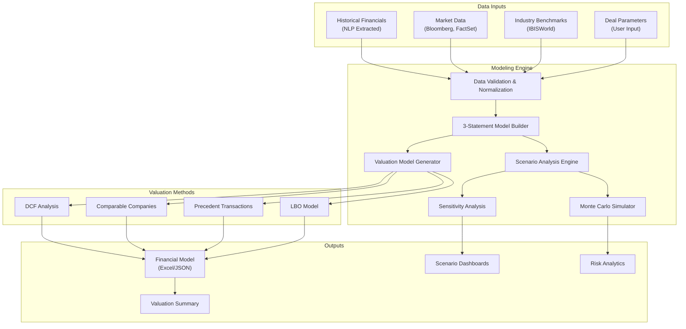
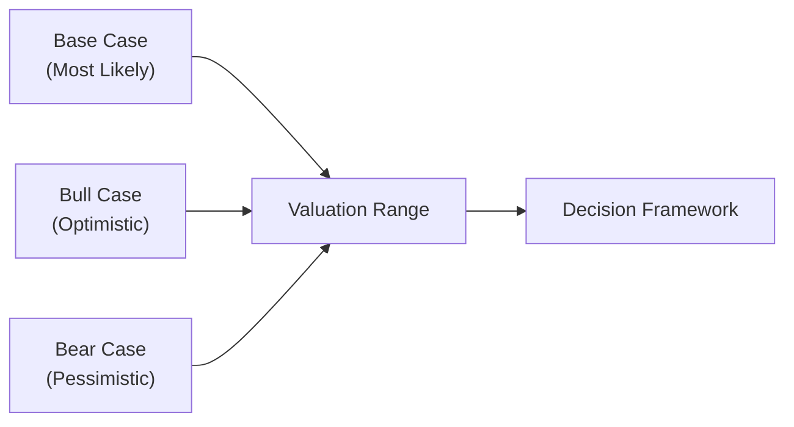

# Financial Modeling and Scenario Planning Architecture

**Sprint**: 05 - M&A Due Diligence Research Acceleration
**Task**: 03 - Solution Architecture Design
**Date**: 2025-11-18
**Author**: solution-architect skill agent

---

## Executive Summary

The Financial Modeling and Scenario Planning module provides automated financial analysis, valuation models, and scenario planning capabilities for M&A due diligence. The system integrates extracted financial data from NLP modules, applies industry-standard valuation methodologies (DCF, comparable companies, precedent transactions), and enables multi-scenario financial projections with sensitivity analysis.

Key capabilities include automated 3-statement modeling, LBO analysis, synergy quantification, and Monte Carlo simulation for risk assessment. The module processes 50+ financial metrics, generates 10-20 scenarios per deal, and produces investor-grade financial models in Excel format.

---

## 1. Financial Modeling Architecture

### 1.1 System Overview



### 1.2 Core Modeling Components

**3-Statement Financial Model**:

The platform automatically builds integrated income statement, balance sheet, and cash flow statement projections:

```python
class ThreeStatementModel:
    def __init__(self, historical_data, assumptions):
        self.historical = historical_data  # 3-5 years historical
        self.assumptions = assumptions
        self.forecast_period = 5  # years

    def build_model(self):
        # 1. Income Statement Projections
        income_statement = self.project_income_statement()

        # 2. Balance Sheet Projections (linked to IS)
        balance_sheet = self.project_balance_sheet(income_statement)

        # 3. Cash Flow Statement (derived from IS + BS)
        cash_flow = self.build_cash_flow_statement(income_statement, balance_sheet)

        # 4. Validate model integrity
        self.validate_model(income_statement, balance_sheet, cash_flow)

        return {
            'income_statement': income_statement,
            'balance_sheet': balance_sheet,
            'cash_flow': cash_flow,
            'key_metrics': self.calculate_key_metrics(income_statement, balance_sheet, cash_flow)
        }

    def project_income_statement(self):
        projections = []

        for year in range(1, self.forecast_period + 1):
            # Revenue projections
            revenue = self.project_revenue(year)

            # COGS (as % of revenue)
            cogs = revenue * self.assumptions['cogs_pct']
            gross_profit = revenue - cogs

            # Operating expenses (with inflation adjustment)
            opex = self.project_opex(year)
            ebitda = gross_profit - opex

            # Depreciation & amortization
            da = self.calculate_depreciation(year)
            ebit = ebitda - da

            # Interest expense (on debt balance)
            interest = self.calculate_interest_expense(year)

            # Taxes
            ebt = ebit - interest
            tax = ebt * self.assumptions['tax_rate'] if ebt > 0 else 0
            net_income = ebt - tax

            projections.append({
                'year': year,
                'revenue': revenue,
                'cogs': cogs,
                'gross_profit': gross_profit,
                'opex': opex,
                'ebitda': ebitda,
                'da': da,
                'ebit': ebit,
                'interest': interest,
                'ebt': ebt,
                'tax': tax,
                'net_income': net_income
            })

        return pd.DataFrame(projections)
```

**Revenue Projection Models**:

```python
class RevenueProjectionEngine:
    def __init__(self, historical_revenue, market_data, assumptions):
        self.historical = historical_revenue
        self.market = market_data
        self.assumptions = assumptions

    def project_revenue(self, method='hybrid'):
        if method == 'cagr':
            return self._cagr_projection()
        elif method == 'market_share':
            return self._market_share_projection()
        elif method == 'bottoms_up':
            return self._bottoms_up_projection()
        elif method == 'hybrid':
            # Weighted average of multiple methods
            cagr_proj = self._cagr_projection()
            market_proj = self._market_share_projection()
            bottoms_up_proj = self._bottoms_up_projection()

            return 0.4 * cagr_proj + 0.3 * market_proj + 0.3 * bottoms_up_proj

    def _cagr_projection(self):
        # Calculate historical CAGR
        years = len(self.historical)
        cagr = (self.historical[-1] / self.historical[0]) ** (1 / years) - 1

        # Apply CAGR to last year's revenue
        projections = []
        last_revenue = self.historical[-1]

        for year in range(1, 6):
            projected_revenue = last_revenue * (1 + cagr) ** year
            projections.append(projected_revenue)

        return projections

    def _market_share_projection(self):
        # Project revenue based on market growth + market share gains
        market_size = self.market['tam']
        market_growth_rate = self.market['cagr']
        current_market_share = self.historical[-1] / market_size

        projections = []
        for year in range(1, 6):
            # Market size projection
            future_market_size = market_size * (1 + market_growth_rate) ** year

            # Market share with gradual gains
            market_share_gain = self.assumptions.get('market_share_gain_annual', 0.002)
            future_market_share = min(
                current_market_share + (market_share_gain * year),
                self.assumptions.get('max_market_share', 0.25)
            )

            projected_revenue = future_market_size * future_market_share
            projections.append(projected_revenue)

        return projections

    def _bottoms_up_projection(self):
        # Project revenue from customer, pricing, volume assumptions
        current_customers = self.assumptions['customer_count']
        customer_growth_rate = self.assumptions['customer_growth_rate']
        avg_revenue_per_customer = self.assumptions['arpc']
        arpc_growth_rate = self.assumptions['arpc_growth_rate']

        projections = []
        for year in range(1, 6):
            future_customers = current_customers * (1 + customer_growth_rate) ** year
            future_arpc = avg_revenue_per_customer * (1 + arpc_growth_rate) ** year
            projected_revenue = future_customers * future_arpc
            projections.append(projected_revenue)

        return projections
```

---

## 2. Valuation Model Architecture

### 2.1 Discounted Cash Flow (DCF) Analysis

```python
class DCFValuation:
    def __init__(self, financial_model, assumptions):
        self.model = financial_model
        self.assumptions = assumptions

    def calculate_enterprise_value(self):
        # 1. Project unlevered free cash flows
        ufcf = self.calculate_unlevered_fcf()

        # 2. Calculate terminal value
        terminal_value = self.calculate_terminal_value(ufcf[-1])

        # 3. Discount cash flows to present value
        wacc = self.calculate_wacc()
        pv_cash_flows = self.discount_cash_flows(ufcf, wacc)
        pv_terminal_value = terminal_value / (1 + wacc) ** len(ufcf)

        # 4. Enterprise value
        enterprise_value = sum(pv_cash_flows) + pv_terminal_value

        # 5. Equity value
        equity_value = enterprise_value + self.assumptions['cash'] - self.assumptions['debt']

        return {
            'enterprise_value': enterprise_value,
            'equity_value': equity_value,
            'pv_cash_flows': pv_cash_flows,
            'pv_terminal_value': pv_terminal_value,
            'wacc': wacc,
            'terminal_value': terminal_value
        }

    def calculate_unlevered_fcf(self):
        # UFCF = EBIT * (1 - Tax Rate) + D&A - CapEx - Change in NWC
        ufcf = []

        for year in self.model['income_statement'].itertuples():
            nopat = year.ebit * (1 - self.assumptions['tax_rate'])
            fcf = nopat + year.da - year.capex - year.nwc_increase

            ufcf.append(fcf)

        return ufcf

    def calculate_terminal_value(self, final_year_fcf):
        # Two methods: Perpetuity Growth and Exit Multiple

        # Method 1: Perpetuity Growth
        perpetuity_growth_rate = self.assumptions.get('perpetuity_growth_rate', 0.025)
        wacc = self.calculate_wacc()
        tv_perpetuity = final_year_fcf * (1 + perpetuity_growth_rate) / (wacc - perpetuity_growth_rate)

        # Method 2: Exit Multiple
        exit_multiple = self.assumptions.get('exit_ebitda_multiple', 10.0)
        final_year_ebitda = self.model['income_statement'].iloc[-1]['ebitda']
        tv_exit_multiple = final_year_ebitda * exit_multiple

        # Use average of both methods
        terminal_value = (tv_perpetuity + tv_exit_multiple) / 2

        return terminal_value

    def calculate_wacc(self):
        # WACC = (E/V) * Re + (D/V) * Rd * (1 - Tc)

        equity_value = self.assumptions['equity_value_current']
        debt_value = self.assumptions['debt']
        total_value = equity_value + debt_value

        equity_weight = equity_value / total_value
        debt_weight = debt_value / total_value

        cost_of_equity = self.calculate_cost_of_equity()
        cost_of_debt = self.assumptions['cost_of_debt']
        tax_rate = self.assumptions['tax_rate']

        wacc = (equity_weight * cost_of_equity) + (debt_weight * cost_of_debt * (1 - tax_rate))

        return wacc

    def calculate_cost_of_equity(self):
        # CAPM: Re = Rf + Beta * (Rm - Rf)
        risk_free_rate = self.assumptions['risk_free_rate']
        beta = self.assumptions['beta']
        market_risk_premium = self.assumptions['market_risk_premium']

        cost_of_equity = risk_free_rate + beta * market_risk_premium

        return cost_of_equity
```

### 2.2 Comparable Company Analysis

```python
class ComparableCompanyAnalysis:
    def __init__(self, target_financials, comparable_companies):
        self.target = target_financials
        self.comps = comparable_companies

    def calculate_valuation(self):
        # Calculate multiples for comparable companies
        comp_multiples = self.calculate_comp_multiples()

        # Apply multiples to target company
        valuation_by_multiple = {}

        # EV/Revenue
        median_ev_revenue = np.median([c['ev_revenue'] for c in comp_multiples])
        valuation_by_multiple['ev_revenue'] = self.target['revenue'] * median_ev_revenue

        # EV/EBITDA
        median_ev_ebitda = np.median([c['ev_ebitda'] for c in comp_multiples])
        valuation_by_multiple['ev_ebitda'] = self.target['ebitda'] * median_ev_ebitda

        # P/E (Price to Earnings)
        median_pe = np.median([c['pe'] for c in comp_multiples])
        valuation_by_multiple['pe'] = self.target['net_income'] * median_pe

        # Weighted average valuation
        weights = {'ev_revenue': 0.25, 'ev_ebitda': 0.50, 'pe': 0.25}
        weighted_valuation = sum(
            valuation_by_multiple[metric] * weight
            for metric, weight in weights.items()
        )

        return {
            'valuation_by_multiple': valuation_by_multiple,
            'weighted_valuation': weighted_valuation,
            'comp_multiples': comp_multiples
        }

    def calculate_comp_multiples(self):
        multiples = []

        for comp in self.comps:
            enterprise_value = comp['market_cap'] + comp['debt'] - comp['cash']

            comp_multiples = {
                'company': comp['name'],
                'ev': enterprise_value,
                'ev_revenue': enterprise_value / comp['revenue'],
                'ev_ebitda': enterprise_value / comp['ebitda'],
                'pe': comp['market_cap'] / comp['net_income']
            }

            multiples.append(comp_multiples)

        return multiples
```

### 2.3 Precedent Transaction Analysis

```python
class PrecedentTransactionAnalysis:
    def __init__(self, target_financials, precedent_transactions):
        self.target = target_financials
        self.precedents = precedent_transactions

    def calculate_valuation(self):
        # Calculate transaction multiples
        transaction_multiples = []

        for txn in self.precedents:
            # Adjust for time (transactions lose relevance over time)
            years_ago = (datetime.now() - txn['close_date']).days / 365
            time_weight = max(0.5, 1 - (years_ago * 0.1))  # 10% decay per year

            multiples = {
                'ev_revenue': txn['enterprise_value'] / txn['revenue'],
                'ev_ebitda': txn['enterprise_value'] / txn['ebitda'],
                'premium': (txn['offer_price'] - txn['price_before_announcement']) / txn['price_before_announcement'],
                'weight': time_weight
            }

            transaction_multiples.append(multiples)

        # Weighted median multiples
        weighted_median_ev_revenue = self._weighted_median([t['ev_revenue'] for t in transaction_multiples],
                                                            [t['weight'] for t in transaction_multiples])
        weighted_median_ev_ebitda = self._weighted_median([t['ev_ebitda'] for t in transaction_multiples],
                                                           [t['weight'] for t in transaction_multiples])

        # Apply to target
        valuation = {
            'ev_revenue': self.target['revenue'] * weighted_median_ev_revenue,
            'ev_ebitda': self.target['ebitda'] * weighted_median_ev_ebitda
        }

        implied_valuation = (valuation['ev_revenue'] + valuation['ev_ebitda']) / 2

        return {
            'implied_valuation': implied_valuation,
            'valuation_by_multiple': valuation,
            'transaction_multiples': transaction_multiples
        }
```

---

## 3. Scenario Analysis and Planning

### 3.1 Scenario Framework



**Scenario definitions**:

```python
class ScenarioAnalysis:
    def __init__(self, base_assumptions):
        self.base = base_assumptions

    def generate_scenarios(self):
        scenarios = {}

        # Base Case (most likely)
        scenarios['base'] = self.base

        # Bull Case (optimistic assumptions)
        scenarios['bull'] = {
            'revenue_growth': self.base['revenue_growth'] * 1.25,  # 25% higher
            'ebitda_margin': self.base['ebitda_margin'] * 1.1,  # 10% improvement
            'capex_pct': self.base['capex_pct'] * 0.9,  # 10% lower capex
            'exit_multiple': self.base['exit_multiple'] * 1.15,  # 15% higher exit
            'probability': 0.25
        }

        # Bear Case (pessimistic assumptions)
        scenarios['bear'] = {
            'revenue_growth': self.base['revenue_growth'] * 0.7,  # 30% lower
            'ebitda_margin': self.base['ebitda_margin'] * 0.85,  # 15% worse
            'capex_pct': self.base['capex_pct'] * 1.2,  # 20% higher capex
            'exit_multiple': self.base['exit_multiple'] * 0.85,  # 15% lower exit
            'probability': 0.20
        }

        # Management Case (aggressive growth plan)
        scenarios['management'] = {
            'revenue_growth': self.base['revenue_growth'] * 1.5,  # 50% higher
            'ebitda_margin': self.base['ebitda_margin'] * 1.2,  # 20% improvement
            'capex_pct': self.base['capex_pct'],  # Same as base
            'exit_multiple': self.base['exit_multiple'] * 1.1,  # 10% higher
            'probability': 0.10  # Low probability (aspirational)
        }

        # Downside Case (recession scenario)
        scenarios['downside'] = {
            'revenue_growth': self.base['revenue_growth'] * 0.4,  # 60% lower (recession)
            'ebitda_margin': self.base['ebitda_margin'] * 0.7,  # 30% compression
            'capex_pct': self.base['capex_pct'] * 1.3,  # 30% higher (maintenance)
            'exit_multiple': self.base['exit_multiple'] * 0.7,  # 30% lower (distressed)
            'probability': 0.15
        }

        return scenarios

    def calculate_scenario_valuations(self, scenarios):
        valuations = {}

        for scenario_name, assumptions in scenarios.items():
            # Build financial model with scenario assumptions
            model = ThreeStatementModel(self.historical, assumptions).build_model()

            # Calculate DCF valuation
            dcf = DCFValuation(model, assumptions).calculate_enterprise_value()

            valuations[scenario_name] = {
                'enterprise_value': dcf['enterprise_value'],
                'equity_value': dcf['equity_value'],
                'irr': self.calculate_irr(dcf['equity_value'], assumptions),
                'moic': dcf['equity_value'] / assumptions['purchase_price']
            }

        # Probability-weighted valuation
        expected_value = sum(
            valuations[s]['equity_value'] * scenarios[s]['probability']
            for s in scenarios.keys()
        )

        valuations['expected'] = {'equity_value': expected_value}

        return valuations
```

### 3.2 Sensitivity Analysis

```python
class SensitivityAnalysis:
    def __init__(self, base_model, base_assumptions):
        self.model = base_model
        self.assumptions = base_assumptions

    def one_way_sensitivity(self, variable, range_pct=0.2, steps=11):
        """Analyze impact of varying one variable at a time"""

        base_value = self.assumptions[variable]
        value_range = np.linspace(
            base_value * (1 - range_pct),
            base_value * (1 + range_pct),
            steps
        )

        results = []
        for value in value_range:
            # Update assumption
            modified_assumptions = self.assumptions.copy()
            modified_assumptions[variable] = value

            # Recalculate valuation
            model = ThreeStatementModel(self.historical, modified_assumptions).build_model()
            dcf = DCFValuation(model, modified_assumptions).calculate_enterprise_value()

            results.append({
                variable: value,
                'enterprise_value': dcf['enterprise_value'],
                'change_pct': (value - base_value) / base_value
            })

        return pd.DataFrame(results)

    def two_way_sensitivity(self, var1, var2):
        """Analyze impact of varying two variables simultaneously"""

        var1_range = np.linspace(
            self.assumptions[var1] * 0.8,
            self.assumptions[var1] * 1.2,
            11
        )

        var2_range = np.linspace(
            self.assumptions[var2] * 0.8,
            self.assumptions[var2] * 1.2,
            11
        )

        results = np.zeros((len(var1_range), len(var2_range)))

        for i, v1 in enumerate(var1_range):
            for j, v2 in enumerate(var2_range):
                modified_assumptions = self.assumptions.copy()
                modified_assumptions[var1] = v1
                modified_assumptions[var2] = v2

                model = ThreeStatementModel(self.historical, modified_assumptions).build_model()
                dcf = DCFValuation(model, modified_assumptions).calculate_enterprise_value()

                results[i, j] = dcf['enterprise_value']

        return {
            'var1_range': var1_range,
            'var2_range': var2_range,
            'results_matrix': results
        }
```

### 3.3 Monte Carlo Simulation

```python
import numpy as np

class MonteCarloSimulation:
    def __init__(self, base_assumptions, variable_distributions):
        self.base = base_assumptions
        self.distributions = variable_distributions  # Dict of {var: distribution_params}

    def run_simulation(self, n_iterations=10000):
        """Run Monte Carlo simulation with random variable sampling"""

        simulation_results = []

        for i in range(n_iterations):
            # Sample random values for each variable
            sampled_assumptions = self.base.copy()

            for var, dist_params in self.distributions.items():
                if dist_params['type'] == 'normal':
                    sampled_value = np.random.normal(
                        dist_params['mean'],
                        dist_params['std']
                    )
                elif dist_params['type'] == 'triangular':
                    sampled_value = np.random.triangular(
                        dist_params['min'],
                        dist_params['mode'],
                        dist_params['max']
                    )
                elif dist_params['type'] == 'uniform':
                    sampled_value = np.random.uniform(
                        dist_params['min'],
                        dist_params['max']
                    )

                sampled_assumptions[var] = sampled_value

            # Calculate valuation with sampled assumptions
            try:
                model = ThreeStatementModel(self.historical, sampled_assumptions).build_model()
                dcf = DCFValuation(model, sampled_assumptions).calculate_enterprise_value()

                simulation_results.append({
                    'iteration': i,
                    'enterprise_value': dcf['enterprise_value'],
                    'equity_value': dcf['equity_value'],
                    **{f'sampled_{k}': v for k, v in sampled_assumptions.items()}
                })
            except:
                continue  # Skip invalid combinations

        # Analyze results
        results_df = pd.DataFrame(simulation_results)

        analysis = {
            'mean_ev': results_df['enterprise_value'].mean(),
            'median_ev': results_df['enterprise_value'].median(),
            'std_ev': results_df['enterprise_value'].std(),
            'percentiles': {
                'p10': results_df['enterprise_value'].quantile(0.10),
                'p25': results_df['enterprise_value'].quantile(0.25),
                'p50': results_df['enterprise_value'].quantile(0.50),
                'p75': results_df['enterprise_value'].quantile(0.75),
                'p90': results_df['enterprise_value'].quantile(0.90),
            },
            'probability_above_target': len(results_df[results_df['enterprise_value'] > self.base['target_valuation']]) / len(results_df),
            'value_at_risk_5pct': results_df['enterprise_value'].quantile(0.05),  # 95% confidence floor
            'full_results': results_df
        }

        return analysis
```

---

## 4. LBO Model Architecture

```python
class LBOModel:
    def __init__(self, target_financials, transaction_assumptions):
        self.target = target_financials
        self.txn = transaction_assumptions

    def build_lbo_model(self):
        # 1. Sources and Uses
        sources_uses = self.calculate_sources_uses()

        # 2. Debt Schedule
        debt_schedule = self.build_debt_schedule()

        # 3. Equity Returns
        equity_returns = self.calculate_equity_returns(debt_schedule)

        return {
            'sources_uses': sources_uses,
            'debt_schedule': debt_schedule,
            'equity_returns': equity_returns
        }

    def calculate_sources_uses(self):
        # Uses
        purchase_price = self.txn['enterprise_value']
        transaction_fees = purchase_price * 0.03  # 3% fees
        financing_fees = (purchase_price * self.txn['debt_pct']) * 0.02  # 2% debt fees
        total_uses = purchase_price + transaction_fees + financing_fees

        # Sources
        senior_debt = purchase_price * 0.40  # 40% senior debt (4.0x EBITDA)
        subordinated_debt = purchase_price * 0.15  # 15% sub debt (1.5x EBITDA)
        equity_contribution = total_uses - senior_debt - subordinated_debt

        return {
            'uses': {
                'purchase_price': purchase_price,
                'transaction_fees': transaction_fees,
                'financing_fees': financing_fees,
                'total': total_uses
            },
            'sources': {
                'senior_debt': senior_debt,
                'subordinated_debt': subordinated_debt,
                'equity': equity_contribution,
                'total': total_uses
            }
        }

    def build_debt_schedule(self):
        # Debt repayment schedule over holding period
        holding_period = self.txn.get('holding_period', 5)
        senior_debt = self.sources_uses['sources']['senior_debt']
        sub_debt = self.sources_uses['sources']['subordinated_debt']

        schedule = []
        for year in range(1, holding_period + 1):
            # Cash available for debt repayment (excess cash flow)
            ebitda = self.target['ebitda'] * (1 + self.txn['ebitda_growth']) ** year
            capex = ebitda * self.txn['capex_pct']
            nwc_increase = ebitda * 0.02
            cash_taxes = ebitda * 0.25
            fcf = ebitda - capex - nwc_increase - cash_taxes

            # Interest expense
            senior_interest = senior_debt * self.txn['senior_debt_rate']
            sub_interest = sub_debt * self.txn['sub_debt_rate']
            total_interest = senior_interest + sub_interest

            # Cash available for debt paydown
            cash_for_debt = fcf - total_interest

            # Mandatory amortization (e.g., 5% per year)
            mandatory_amort = senior_debt * 0.05

            # Voluntary paydown (sweep of excess cash)
            voluntary_paydown = max(0, cash_for_debt - mandatory_amort)

            # Update debt balances
            senior_debt -= (mandatory_amort + voluntary_paydown)
            senior_debt = max(0, senior_debt)

            schedule.append({
                'year': year,
                'beginning_senior_debt': senior_debt + mandatory_amort + voluntary_paydown,
                'beginning_sub_debt': sub_debt,
                'fcf': fcf,
                'interest_expense': total_interest,
                'mandatory_amort': mandatory_amort,
                'voluntary_paydown': voluntary_paydown,
                'ending_senior_debt': senior_debt,
                'ending_sub_debt': sub_debt
            })

        return pd.DataFrame(schedule)

    def calculate_equity_returns(self, debt_schedule):
        # Exit valuation (at end of holding period)
        exit_year = len(debt_schedule)
        exit_ebitda = self.target['ebitda'] * (1 + self.txn['ebitda_growth']) ** exit_year
        exit_multiple = self.txn['exit_multiple']
        exit_ev = exit_ebitda * exit_multiple

        # Net debt at exit
        exit_debt = debt_schedule.iloc[-1]['ending_senior_debt'] + debt_schedule.iloc[-1]['ending_sub_debt']

        # Exit equity value
        exit_equity_value = exit_ev - exit_debt

        # Equity invested
        equity_invested = self.sources_uses['sources']['equity']

        # Returns
        moic = exit_equity_value / equity_invested
        irr = (moic ** (1 / exit_year)) - 1

        return {
            'exit_ev': exit_ev,
            'exit_debt': exit_debt,
            'exit_equity_value': exit_equity_value,
            'equity_invested': equity_invested,
            'moic': moic,
            'irr': irr
        }
```

---

## 5. Excel Export and Reporting

### 5.1 Excel Model Generation

```python
import openpyxl
from openpyxl.styles import Font, Alignment, PatternFill

class ExcelModelExporter:
    def __init__(self, financial_model, valuation, scenarios):
        self.model = financial_model
        self.valuation = valuation
        self.scenarios = scenarios

    def export_to_excel(self, filename):
        wb = openpyxl.Workbook()

        # Create worksheets
        self.create_summary_sheet(wb)
        self.create_assumptions_sheet(wb)
        self.create_income_statement_sheet(wb)
        self.create_balance_sheet_sheet(wb)
        self.create_cash_flow_sheet(wb)
        self.create_dcf_sheet(wb)
        self.create_sensitivity_sheet(wb)
        self.create_scenarios_sheet(wb)

        # Save workbook
        wb.save(filename)

    def create_summary_sheet(self, workbook):
        ws = workbook.active
        ws.title = "Executive Summary"

        # Title
        ws['A1'] = "Financial Model Summary"
        ws['A1'].font = Font(size=16, bold=True)

        # Valuation Summary
        ws['A3'] = "Valuation Summary"
        ws['A3'].font = Font(size=14, bold=True)

        row = 4
        ws[f'A{row}'] = "DCF Enterprise Value"
        ws[f'B{row}'] = self.valuation['dcf']['enterprise_value']
        ws[f'B{row}'].number_format = '$#,##0'

        row += 1
        ws[f'A{row}'] = "Comparable Companies EV"
        ws[f'B{row}'] = self.valuation['comps']['weighted_valuation']
        ws[f'B{row}'].number_format = '$#,##0'

        # ... additional rows for other metrics

    def create_dcf_sheet(self, workbook):
        ws = workbook.create_sheet("DCF Valuation")

        # DCF calculation with formulas
        ws['A1'] = "Discounted Cash Flow Analysis"
        ws['A1'].font = Font(size=14, bold=True)

        # Unlevered FCF
        ws['A3'] = "Unlevered Free Cash Flow"
        for i, year in enumerate(range(1, 6), start=4):
            ws[f'{chr(65+i)}{3}'] = f'Year {year}'
            ws[f'{chr(65+i)}{4}'] = self.valuation['dcf']['ufcf'][year-1]

        # ... (continue with discounting, terminal value, etc.)
```

---

## 6. Technology Stack

**Core libraries**:
- **NumPy**: Numerical computing and array operations
- **Pandas**: Data manipulation and financial calculations
- **SciPy**: Statistical analysis and optimization
- **OpenPyXL**: Excel file generation
- **Matplotlib/Plotly**: Visualization for sensitivity charts

**Infrastructure**:
- **Python 3.10+**: Primary language
- **FastAPI**: REST API for model calculations
- **Celery**: Async task queue for long-running calculations
- **Redis**: Caching for model results

---

## 7. References

1. Damodaran, A. (2024). *Valuation: Measuring and Managing the Value of Companies*. McKinsey & Company.

2. Rosenbaum, J., & Pearl, J. (2020). *Investment Banking: Valuation, LBOs, M&A, and IPOs*. Wiley Finance.

3. Pignataro, P. (2021). *Financial Modeling and Valuation: A Practical Guide to Investment Banking and Private Equity*. Wiley.

4. CFA Institute. (2024). *Corporate Finance and Portfolio Management*. CFA Program Curriculum.
