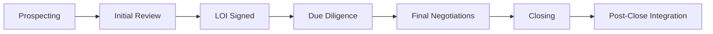
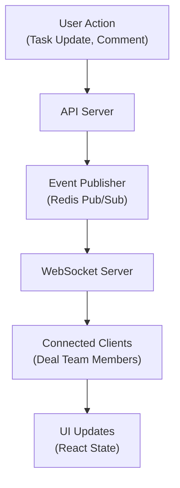

# Workflow and Collaboration System Design

**Sprint**: 05 - M&A Due Diligence Research Acceleration
**Task**: 03 - Solution Architecture Design
**Date**: 2025-11-18
**Author**: solution-architect skill agent

---

## Executive Summary

The Workflow and Collaboration System provides deal tracking, task management, team collaboration, and real-time updates for M&A due diligence teams. The system supports 5-15 team members per deal across 4-8 week due diligence periods, managing 80+ evaluation criteria with automated task assignment, progress tracking, and deadline management.

Key capabilities include Kanban-style deal pipelines, checklist-driven workflows, Q&A threads, document annotations, activity feeds, and real-time notifications via WebSocket connections.

---

## 1. Workflow Architecture

### 1.1 Deal Pipeline Management



**Deal stages and transitions**:

```python
DEAL_STAGES = {
    'prospecting': {'next': ['initial_review', 'disqualified'], 'duration_days': 30},
    'initial_review': {'next': ['loi_signed', 'pass'], 'duration_days': 14},
    'loi_signed': {'next': ['due_diligence', 'loi_expired'], 'duration_days': 7},
    'due_diligence': {'next': ['final_negotiations', 'withdraw'], 'duration_days': 45},
    'final_negotiations': {'next': ['closing', 'failed'], 'duration_days': 21},
    'closing': {'next': ['post_close_integration'], 'duration_days': 7},
    'post_close_integration': {'next': ['complete'], 'duration_days': 90}
}

class DealWorkflow:
    def transition_stage(self, deal_id, new_stage, user_id):
        deal = self.get_deal(deal_id)
        current_stage = deal['stage']

        # Validate transition
        if new_stage not in DEAL_STAGES[current_stage]['next']:
            raise InvalidTransitionError(f"Cannot move from {current_stage} to {new_stage}")

        # Check completion requirements
        if not self.stage_requirements_met(deal, current_stage):
            raise RequirementsNotMetError(f"Stage {current_stage} requirements not complete")

        # Update deal stage
        self.db.update_deal(deal_id, {
            'stage': new_stage,
            'stage_changed_at': datetime.now(),
            'stage_changed_by': user_id
        })

        # Create stage transition event
        self.create_event('deal.stage_changed', {
            'deal_id': deal_id,
            'from_stage': current_stage,
            'to_stage': new_stage,
            'user_id': user_id
        })

        # Auto-create tasks for new stage
        self.create_stage_tasks(deal_id, new_stage)
```

### 1.2 Task Management System

**Due diligence checklist with 80+ tasks**:

```python
DUE_DILIGENCE_CHECKLIST = {
    'financial': [
        {'task': 'Review 3-year historical financials', 'owner_role': 'financial_analyst', 'estimated_hours': 8},
        {'task': 'Analyze revenue composition and trends', 'owner_role': 'financial_analyst', 'estimated_hours': 6},
        {'task': 'Assess working capital requirements', 'owner_role': 'financial_analyst', 'estimated_hours': 4},
        {'task': 'Review debt agreements and covenants', 'owner_role': 'financial_analyst', 'estimated_hours': 6},
        {'task': 'Build 3-statement financial model', 'owner_role': 'senior_analyst', 'estimated_hours': 16},
        # ... 15+ more financial tasks
    ],
    'market': [
        {'task': 'Analyze market size and growth trends', 'owner_role': 'market_analyst', 'estimated_hours': 12},
        {'task': 'Identify key competitors and market share', 'owner_role': 'market_analyst', 'estimated_hours': 8},
        {'task': 'Assess competitive positioning and moats', 'owner_role': 'senior_analyst', 'estimated_hours': 10},
        # ... 10+ more market tasks
    ],
    'operational': [
        {'task': 'Review organizational structure and headcount', 'owner_role': 'operations_analyst', 'estimated_hours': 6},
        {'task': 'Assess technology infrastructure and systems', 'owner_role': 'technical_analyst', 'estimated_hours': 12},
        {'task': 'Review key customer contracts and concentration', 'owner_role': 'operations_analyst', 'estimated_hours': 8},
        # ... 15+ more operational tasks
    ],
    'legal': [
        {'task': 'Review corporate structure and governance', 'owner_role': 'legal_counsel', 'estimated_hours': 6},
        {'task': 'Assess intellectual property portfolio', 'owner_role': 'legal_counsel', 'estimated_hours': 10},
        {'task': 'Review material contracts and liabilities', 'owner_role': 'legal_counsel', 'estimated_hours': 12},
        # ... 10+ more legal tasks
    ],
    'regulatory': [
        {'task': 'Identify regulatory requirements and compliance', 'owner_role': 'compliance_analyst', 'estimated_hours': 8},
        {'task': 'Review pending litigation and disputes', 'owner_role': 'legal_counsel', 'estimated_hours': 6},
        # ... 8+ more regulatory tasks
    ]
}

class TaskManager:
    def create_deal_tasks(self, deal_id):
        team = self.get_deal_team(deal_id)

        for category, tasks in DUE_DILIGENCE_CHECKLIST.items():
            for task_template in tasks:
                # Assign to team member with matching role
                owner = self.find_team_member_by_role(team, task_template['owner_role'])

                # Calculate due date (based on deal timeline)
                deal = self.get_deal(deal_id)
                days_until_close = (deal['estimated_close_date'] - datetime.now()).days
                task_due_date = datetime.now() + timedelta(days=days_until_close * 0.7)  # 70% of time remaining

                # Create task
                self.db.create_task({
                    'deal_id': deal_id,
                    'category': category,
                    'title': task_template['task'],
                    'owner_id': owner['user_id'] if owner else None,
                    'status': 'not_started',
                    'estimated_hours': task_template['estimated_hours'],
                    'due_date': task_due_date,
                    'created_at': datetime.now()
                })
```

---

## 2. Collaboration Features

### 2.1 Q&A Thread System

```python
class QAThread:
    def create_question(self, deal_id, document_id, question_text, asked_by):
        thread = self.db.create_qa_thread({
            'deal_id': deal_id,
            'document_id': document_id,
            'question': question_text,
            'asked_by': asked_by,
            'asked_at': datetime.now(),
            'status': 'open',
            'priority': 'normal'
        })

        # Notify document owner and deal team
        self.notify_team(deal_id, f"New question on {document_name}: {question_text[:100]}")

        return thread

    def add_response(self, thread_id, response_text, responder_id):
        self.db.add_qa_response(thread_id, {
            'response': response_text,
            'responder_id': responder_id,
            'responded_at': datetime.now()
        })

        # Notify question asker
        thread = self.db.get_qa_thread(thread_id)
        self.notify_user(thread['asked_by'], f"Answer to your question: {response_text[:100]}")

    def close_thread(self, thread_id, closed_by):
        self.db.update_qa_thread(thread_id, {
            'status': 'closed',
            'closed_by': closed_by,
            'closed_at': datetime.now()
        })
```

### 2.2 Document Annotation System

```python
class DocumentAnnotation:
    def create_annotation(self, document_id, user_id, annotation_data):
        annotation = {
            'document_id': document_id,
            'user_id': user_id,
            'type': annotation_data['type'],  # 'highlight', 'comment', 'flag'
            'page': annotation_data['page'],
            'coordinates': annotation_data['coordinates'],  # x, y, width, height
            'text': annotation_data.get('text'),
            'comment': annotation_data.get('comment'),
            'created_at': datetime.now()
        }

        return self.db.create_annotation(annotation)

    def get_document_annotations(self, document_id):
        annotations = self.db.get_annotations(document_id)

        # Group by page for rendering
        annotations_by_page = {}
        for anno in annotations:
            page = anno['page']
            if page not in annotations_by_page:
                annotations_by_page[page] = []
            annotations_by_page[page].append(anno)

        return annotations_by_page
```

---

## 3. Real-Time Updates Architecture



**WebSocket implementation**:

```python
from fastapi import WebSocket, WebSocketDisconnect
import json

class ConnectionManager:
    def __init__(self):
        self.active_connections: Dict[str, List[WebSocket]] = {}

    async def connect(self, websocket: WebSocket, deal_id: str, user_id: str):
        await websocket.accept()

        if deal_id not in self.active_connections:
            self.active_connections[deal_id] = []

        self.active_connections[deal_id].append({
            'websocket': websocket,
            'user_id': user_id
        })

    def disconnect(self, websocket: WebSocket, deal_id: str):
        self.active_connections[deal_id] = [
            conn for conn in self.active_connections[deal_id]
            if conn['websocket'] != websocket
        ]

    async def broadcast_to_deal(self, deal_id: str, message: dict):
        if deal_id in self.active_connections:
            for connection in self.active_connections[deal_id]:
                await connection['websocket'].send_text(json.dumps(message))

manager = ConnectionManager()

@app.websocket("/ws/{deal_id}")
async def websocket_endpoint(websocket: WebSocket, deal_id: str, user_id: str):
    await manager.connect(websocket, deal_id, user_id)

    try:
        while True:
            # Receive messages from client (heartbeat, etc.)
            data = await websocket.receive_text()

            # Process client messages if needed
            # ...

    except WebSocketDisconnect:
        manager.disconnect(websocket, deal_id)

# Publish updates to connected clients
def publish_task_update(deal_id, task_id, update_data):
    message = {
        'type': 'task_updated',
        'task_id': task_id,
        'data': update_data,
        'timestamp': datetime.now().isoformat()
    }

    await manager.broadcast_to_deal(deal_id, message)
```

---

## 4. Progress Tracking and Analytics

```python
class DealAnalytics:
    def calculate_progress(self, deal_id):
        tasks = self.db.get_deal_tasks(deal_id)

        total_tasks = len(tasks)
        completed_tasks = len([t for t in tasks if t['status'] == 'completed'])
        in_progress_tasks = len([t for t in tasks if t['status'] == 'in_progress'])

        # Progress by category
        progress_by_category = {}
        for category in ['financial', 'market', 'operational', 'legal', 'regulatory']:
            category_tasks = [t for t in tasks if t['category'] == category]
            category_completed = len([t for t in category_tasks if t['status'] == 'completed'])
            progress_by_category[category] = category_completed / len(category_tasks) if category_tasks else 0

        # Time tracking
        total_estimated_hours = sum(t['estimated_hours'] for t in tasks)
        total_actual_hours = sum(t['actual_hours'] or 0 for t in tasks)

        # Risk indicators
        overdue_tasks = len([t for t in tasks if t['due_date'] < datetime.now() and t['status'] != 'completed'])

        return {
            'overall_progress': completed_tasks / total_tasks,
            'tasks_completed': completed_tasks,
            'tasks_total': total_tasks,
            'tasks_in_progress': in_progress_tasks,
            'progress_by_category': progress_by_category,
            'total_estimated_hours': total_estimated_hours,
            'total_actual_hours': total_actual_hours,
            'overdue_tasks': overdue_tasks
        }
```

---

## 5. References

1. Atlassian. (2024). *Jira Software Documentation*. Retrieved from https://www.atlassian.com/software/jira

2. Asana. (2024). *Asana Platform Documentation*. Retrieved from https://developers.asana.com/

3. Monday.com. (2024). *Work OS Platform Guide*. Retrieved from https://monday.com/

4. FastAPI. (2024). *WebSockets Documentation*. Retrieved from https://fastapi.tiangolo.com/advanced/websockets/
