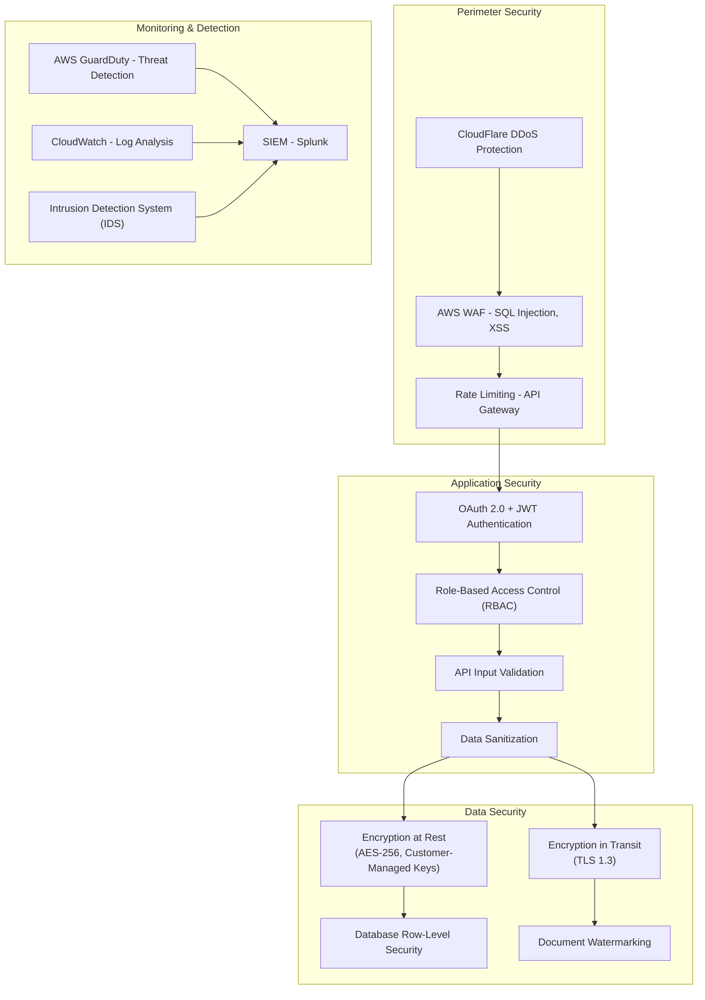

# Security and Compliance Architecture (SOC 2, ISO 27001)

**Sprint**: 05 - M&A Due Diligence Research Acceleration
**Task**: 03 - Solution Architecture Design
**Date**: 2025-11-18
**Author**: solution-architect skill agent

---

## Executive Summary

The security and compliance architecture implements defense-in-depth security controls, encryption at rest and in transit, comprehensive audit logging, and compliance frameworks for SOC 2 Type II and ISO 27001 certifications. The platform handles highly confidential M&A data requiring bank-level security with zero-trust architecture, customer-managed encryption keys, and immutable audit trails.

---

## 1. Security Architecture Overview



---

## 2. Authentication and Authorization

### 2.1 Authentication Methods

**OAuth 2.0 with SAML 2.0 SSO**:

```python
from fastapi import Depends, HTTPException, status
from fastapi.security import OAuth2PasswordBearer
import jwt

oauth2_scheme = OAuth2PasswordBearer(tokenUrl="token")

def verify_token(token: str = Depends(oauth2_scheme)):
    try:
        payload = jwt.decode(token, SECRET_KEY, algorithms=["RS256"])
        user_id = payload.get("sub")
        tenant_id = payload.get("tenant_id")

        if user_id is None or tenant_id is None:
            raise HTTPException(status_code=401, detail="Invalid authentication token")

        return {"user_id": user_id, "tenant_id": tenant_id, "roles": payload.get("roles")}

    except jwt.ExpiredSignatureError:
        raise HTTPException(status_code=401, detail="Token expired")
    except jwt.JWTError:
        raise HTTPException(status_code=401, detail="Invalid token")

# SSO Integration (Okta, Azure AD, Google Workspace)
SAML_CONFIG = {
    'entity_id': 'https://platform.example.com',
    'acs_url': 'https://platform.example.com/saml/acs',
    'sls_url': 'https://platform.example.com/saml/sls',
    'x509_cert': load_certificate('saml_cert.pem'),
    'private_key': load_private_key('saml_key.pem')
}
```

**Multi-Factor Authentication (MFA)**:

```python
import pyotp

class MFAManager:
    def generate_mfa_secret(self, user_id):
        secret = pyotp.random_base32()
        self.db.update_user(user_id, {'mfa_secret': secret})

        # Generate QR code for authenticator app
        totp_uri = pyotp.totp.TOTP(secret).provisioning_uri(
            name=user_email,
            issuer_name='M&A Due Diligence Platform'
        )

        return {'secret': secret, 'qr_code_uri': totp_uri}

    def verify_mfa_token(self, user_id, token):
        user = self.db.get_user(user_id)
        totp = pyotp.TOTP(user['mfa_secret'])

        # Verify token (with 30-second time window)
        if totp.verify(token):
            return True

        return False
```

### 2.2 Role-Based Access Control (RBAC)

**Permission matrix**:

```python
ROLE_PERMISSIONS = {
    'admin': {
        'deals': ['create', 'read', 'update', 'delete', 'export'],
        'documents': ['upload', 'view', 'download', 'delete', 'annotate'],
        'users': ['invite', 'manage', 'remove'],
        'settings': ['configure'],
        'audit_logs': ['view', 'export']
    },
    'deal_manager': {
        'deals': ['create', 'read', 'update', 'export'],
        'documents': ['upload', 'view', 'download', 'annotate'],
        'users': ['invite'],
        'audit_logs': ['view']
    },
    'analyst': {
        'deals': ['read'],
        'documents': ['view', 'download', 'annotate'],
        'tasks': ['create', 'update', 'complete']
    },
    'viewer': {
        'deals': ['read'],
        'documents': ['view'],
    }
}

def check_permission(user_roles, resource, action):
    for role in user_roles:
        if role in ROLE_PERMISSIONS:
            if resource in ROLE_PERMISSIONS[role]:
                if action in ROLE_PERMISSIONS[role][resource]:
                    return True

    return False

# Decorator for API endpoints
def require_permission(resource: str, action: str):
    def decorator(func):
        def wrapper(*args, user=Depends(get_current_user), **kwargs):
            if not check_permission(user['roles'], resource, action):
                raise HTTPException(status_code=403, detail="Permission denied")

            return func(*args, user=user, **kwargs)

        return wrapper
    return decorator

# Usage
@app.post("/deals/{deal_id}/documents")
@require_permission('documents', 'upload')
def upload_document(deal_id: str, file: UploadFile, user: dict):
    # ... upload logic
```

---

## 3. Encryption and Data Protection

### 3.1 Encryption at Rest

**Customer-Managed Encryption Keys (CMK) with AWS KMS**:

```python
import boto3

kms_client = boto3.client('kms')

class EncryptionManager:
    def create_tenant_key(self, tenant_id):
        # Create unique CMK per tenant
        response = kms_client.create_key(
            Description=f'Encryption key for tenant {tenant_id}',
            KeyUsage='ENCRYPT_DECRYPT',
            Origin='AWS_KMS',
            MultiRegion=False,
            Tags=[
                {'TagKey': 'tenant_id', 'TagValue': tenant_id},
                {'TagKey': 'environment', 'TagValue': 'production'}
            ]
        )

        key_id = response['KeyMetadata']['KeyId']

        # Store key ID in tenant record
        self.db.update_tenant(tenant_id, {'kms_key_id': key_id})

        return key_id

    def encrypt_data(self, tenant_id, plaintext):
        tenant = self.db.get_tenant(tenant_id)
        key_id = tenant['kms_key_id']

        response = kms_client.encrypt(
            KeyId=key_id,
            Plaintext=plaintext
        )

        return response['CiphertextBlob']

    def decrypt_data(self, tenant_id, ciphertext):
        response = kms_client.decrypt(
            CiphertextBlob=ciphertext
        )

        return response['Plaintext']

# S3 encryption with CMK
s3_client = boto3.client('s3')

def upload_encrypted_document(bucket, key, file_data, tenant_id):
    tenant = db.get_tenant(tenant_id)
    kms_key_id = tenant['kms_key_id']

    s3_client.put_object(
        Bucket=bucket,
        Key=key,
        Body=file_data,
        ServerSideEncryption='aws:kms',
        SSEKMSKeyId=kms_key_id
    )
```

**PostgreSQL encryption with Transparent Data Encryption (TDE)**:

```sql
-- Enable encryption for tablespace
CREATE TABLESPACE encrypted_tablespace
    LOCATION '/encrypted_data'
    WITH (encryption = on, encryption_key = 'tenant_123_key');

-- Store sensitive data in encrypted tablespace
CREATE TABLE deals (
    deal_id UUID PRIMARY KEY,
    tenant_id UUID NOT NULL,
    target_company TEXT,
    deal_value NUMERIC(15, 2),
    -- Encrypted columns
    confidential_notes TEXT ENCRYPTED,
    financial_data JSONB ENCRYPTED
) TABLESPACE encrypted_tablespace;
```

### 3.2 Encryption in Transit

**TLS 1.3 configuration**:

```nginx
# Nginx configuration for TLS 1.3
server {
    listen 443 ssl http2;
    server_name platform.example.com;

    # TLS 1.3 only (no TLS 1.2 fallback)
    ssl_protocols TLSv1.3;

    # Strong cipher suites
    ssl_ciphers 'TLS_AES_256_GCM_SHA384:TLS_CHACHA20_POLY1305_SHA256';
    ssl_prefer_server_ciphers off;

    # Certificate and key
    ssl_certificate /etc/ssl/certs/platform.crt;
    ssl_certificate_key /etc/ssl/private/platform.key;

    # OCSP stapling
    ssl_stapling on;
    ssl_stapling_verify on;

    # HSTS (force HTTPS for 1 year)
    add_header Strict-Transport-Security "max-age=31536000; includeSubDomains; preload" always;

    # CSP (Content Security Policy)
    add_header Content-Security-Policy "default-src 'self'; script-src 'self' 'unsafe-inline'; style-src 'self' 'unsafe-inline';" always;

    # ... rest of configuration
}
```

---

## 4. Audit Trail and Logging

### 4.1 Comprehensive Audit Logging

```python
class AuditLogger:
    def log_event(self, event_type, user_id, resource_type, resource_id, action, metadata=None):
        audit_event = {
            'event_id': str(uuid.uuid4()),
            'timestamp': datetime.utcnow(),
            'event_type': event_type,
            'user_id': user_id,
            'tenant_id': self.get_user_tenant(user_id),
            'resource_type': resource_type,
            'resource_id': resource_id,
            'action': action,
            'ip_address': self.get_request_ip(),
            'user_agent': self.get_user_agent(),
            'metadata': metadata or {},
            'result': 'success'  # or 'failure'
        }

        # Store in append-only audit table
        self.db.insert_audit_log(audit_event)

        # Also send to SIEM (Splunk)
        self.siem_client.send_event(audit_event)

        return audit_event

# Decorator for auto-logging
def audit_log(resource_type, action):
    def decorator(func):
        def wrapper(*args, user=Depends(get_current_user), **kwargs):
            resource_id = kwargs.get('deal_id') or kwargs.get('document_id')

            try:
                result = func(*args, user=user, **kwargs)
                audit_logger.log_event('api_call', user['user_id'], resource_type, resource_id, action, {'result': 'success'})
                return result

            except Exception as e:
                audit_logger.log_event('api_call', user['user_id'], resource_type, resource_id, action, {'result': 'failure', 'error': str(e)})
                raise

        return wrapper
    return decorator

# Usage
@app.delete("/deals/{deal_id}")
@audit_log('deal', 'delete')
def delete_deal(deal_id: str, user: dict):
    # ... deletion logic
```

### 4.2 Immutable Audit Log Storage

```sql
-- Append-only audit log table (no UPDATE or DELETE allowed)
CREATE TABLE audit_logs (
    event_id UUID PRIMARY KEY,
    timestamp TIMESTAMP NOT NULL,
    tenant_id UUID NOT NULL,
    user_id UUID,
    event_type TEXT NOT NULL,
    resource_type TEXT,
    resource_id TEXT,
    action TEXT NOT NULL,
    ip_address INET,
    user_agent TEXT,
    metadata JSONB,
    result TEXT NOT NULL  -- 'success' or 'failure'
);

-- Partition by month for performance
CREATE TABLE audit_logs_2025_11 PARTITION OF audit_logs
    FOR VALUES FROM ('2025-11-01') TO ('2025-12-01');

-- Prevent updates and deletes via row-level security
ALTER TABLE audit_logs ENABLE ROW LEVEL SECURITY;

CREATE POLICY audit_logs_append_only ON audit_logs
    FOR ALL
    USING (false)  -- No reads except by admin
    WITH CHECK (true);  -- Only inserts allowed

-- Grant insert permission to application user
GRANT INSERT ON audit_logs TO app_user;
REVOKE UPDATE, DELETE ON audit_logs FROM app_user;
```

---

## 5. SOC 2 Type II Compliance

### 5.1 Trust Services Criteria Coverage

**Security (CC6)**:

- **CC6.1 Logical Access**: MFA for all users, SSO integration, role-based access control
- **CC6.2 New Users**: Automated onboarding workflow with access request approval
- **CC6.3 User Modification**: Audit trail of all permission changes
- **CC6.4 User Termination**: Automated deprovisioning within 24 hours
- **CC6.6 Encryption**: AES-256 at rest, TLS 1.3 in transit
- **CC6.7 Data Segregation**: Tenant isolation via row-level security

**Availability (A1)**:

- **A1.1 Availability Commitments**: 99.9% uptime SLA
- **A1.2 Backup and Recovery**: Daily automated backups, 4-hour RTO, 1-hour RPO
- **A1.3 Monitoring**: 24/7 monitoring with PagerDuty alerts

**Confidentiality (C1)**:

- **C1.1 Confidentiality Commitments**: NDA with all employees, confidentiality training
- **C1.2 Data Classification**: 4-tier classification (Public, Internal, Confidential, Restricted)

**Processing Integrity (PI1)**:

- **PI1.1 Data Validation**: Input validation on all APIs, schema validation
- **PI1.2 Error Handling**: Graceful error handling, no sensitive data in error messages

**Privacy (P1)**:

- **P1.1 Privacy Notice**: Privacy policy, GDPR/CCPA compliance
- **P1.2 Data Retention**: Configurable retention policies per tenant

### 5.2 Control Implementation

```python
# Example: User deprovisioning control (CC6.4)
class UserDeprovisioning:
    def deprovision_user(self, user_id, reason):
        # 1. Revoke all access tokens
        self.revoke_user_tokens(user_id)

        # 2. Remove from all teams and deals
        self.remove_user_from_teams(user_id)

        # 3. Transfer ownership of tasks
        self.transfer_user_tasks(user_id)

        # 4. Archive user data
        self.archive_user_data(user_id)

        # 5. Log deprovisioning event
        audit_logger.log_event('user_deprovisioned', admin_user_id, 'user', user_id, 'deprovision', {'reason': reason})

        # 6. Update user status
        self.db.update_user(user_id, {
            'status': 'deprovisioned',
            'deprovisioned_at': datetime.utcnow(),
            'deprovisioned_reason': reason
        })
```

---

## 6. ISO 27001 Compliance

### 6.1 Information Security Management System (ISMS)

**Annex A Controls**:

- **A.5: Information Security Policies**: Documented security policy reviewed annually
- **A.6: Organization of Information Security**: CISO role, security team, incident response team
- **A.8: Asset Management**: Asset inventory (servers, databases, applications), data classification
- **A.9: Access Control**: RBAC, MFA, access reviews quarterly
- **A.12: Operations Security**: Change management, vulnerability scanning, patch management
- **A.14: System Acquisition**: Secure SDLC, code reviews, security testing
- **A.17: Business Continuity**: DR plan, annual DR drills, backup/restore procedures
- **A.18: Compliance**: Legal review, SOC 2 audits, penetration testing

### 6.2 Risk Assessment and Treatment

```python
RISK_REGISTER = [
    {
        'risk_id': 'R001',
        'risk': 'Unauthorized access to confidential deal data',
        'likelihood': 'Medium',
        'impact': 'Critical',
        'risk_level': 'High',
        'controls': ['MFA', 'RBAC', 'Audit logging', 'Encryption at rest'],
        'residual_risk': 'Low'
    },
    {
        'risk_id': 'R002',
        'risk': 'Data breach via SQL injection',
        'likelihood': 'Low',
        'impact': 'Critical',
        'risk_level': 'Medium',
        'controls': ['Input validation', 'Parameterized queries', 'WAF', 'Penetration testing'],
        'residual_risk': 'Very Low'
    },
    # ... 20+ more risks
]
```

---

## 7. Penetration Testing and Vulnerability Management

**Quarterly penetration testing**:

```bash
# Automated vulnerability scanning with OWASP ZAP
docker run -t owasp/zap2docker-stable zap-baseline.py \
    -t https://platform.example.com \
    -r pentest_report.html

# Dependency vulnerability scanning with Snyk
snyk test --all-projects --severity-threshold=high

# Container image scanning with Trivy
trivy image platform:latest --severity HIGH,CRITICAL
```

**Vulnerability remediation SLA**:

- Critical vulnerabilities: 7 days
- High vulnerabilities: 30 days
- Medium vulnerabilities: 90 days

---

## 8. Incident Response Plan

```python
INCIDENT_SEVERITY_LEVELS = {
    'P1': {
        'description': 'Data breach or complete system outage',
        'response_time': '15 minutes',
        'notification': ['CISO', 'CEO', 'Legal Counsel', 'Affected Customers']
    },
    'P2': {
        'description': 'Unauthorized access attempt or partial outage',
        'response_time': '1 hour',
        'notification': ['CISO', 'Security Team']
    },
    'P3': {
        'description': 'Failed login attempts or performance degradation',
        'response_time': '4 hours',
        'notification': ['Security Team']
    }
}

class IncidentResponse:
    def detect_incident(self, event):
        # Automated detection via SIEM
        if self.is_security_incident(event):
            severity = self.classify_incident(event)
            self.create_incident(event, severity)
            self.notify_responders(severity)

    def contain_incident(self, incident_id):
        # Isolate affected systems
        # Revoke compromised credentials
        # Block malicious IPs
        pass

    def eradicate_threat(self, incident_id):
        # Remove malware
        # Patch vulnerabilities
        # Reset passwords
        pass

    def recover_systems(self, incident_id):
        # Restore from backups
        # Verify system integrity
        # Resume normal operations
        pass

    def lessons_learned(self, incident_id):
        # Post-incident review
        # Update controls
        # Update incident response plan
        pass
```

---

## 9. References

1. AICPA. (2024). *SOC 2 Trust Services Criteria*. Retrieved from https://www.aicpa.org/

2. ISO/IEC 27001:2022. *Information Security Management*. International Organization for Standardization.

3. NIST. (2024). *Cybersecurity Framework 2.0*. National Institute of Standards and Technology.

4. AWS. (2025). *Security Best Practices*. Amazon Web Services. Retrieved from https://aws.amazon.com/security/
