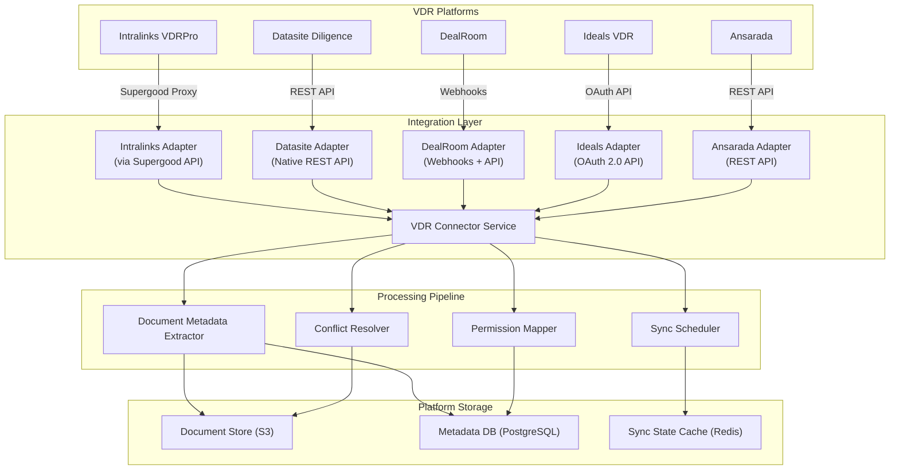

# VDR Integration Architecture

**Sprint**: 05 - M&A Due Diligence Research Acceleration
**Task**: 03 - Solution Architecture Design
**Date**: 2025-11-18
**Author**: solution-architect skill agent

---

## Executive Summary

The VDR (Virtual Data Room) Integration Architecture provides seamless connectivity with leading VDR platforms (Intralinks, Datasite, DealRoom, Ideals, Ansarada) to automate document ingestion, synchronization, and metadata extraction. The integration eliminates manual document downloads, maintains bidirectional sync, and preserves VDR permissions and audit trails.

---

## 1. VDR Integration Overview



---

## 2. VDR Platform-Specific Adapters

### 2.1 Intralinks Adapter (via Supergood)

**Challenge**: Intralinks lacks native public API

**Solution**: Third-party Supergood API proxy

```python
import requests

class IntralinksAdapter:
    def __init__(self, credentials):
        self.base_url = "https://api.supergood.ai/intralinks"
        self.api_key = credentials['supergood_api_key']
        self.username = credentials['intralinks_username']
        self.password = credentials['intralinks_password']

    def authenticate(self):
        response = requests.post(f"{self.base_url}/auth", json={
            'username': self.username,
            'password': self.password,
            'mfa_code': self.get_mfa_code()  # TOTP or SMS
        }, headers={'X-API-Key': self.api_key})

        self.session_token = response.json()['session_token']

    def fetch_projects(self):
        """GET /fetch_projects: Retrieve all accessible VDR projects"""
        response = requests.get(
            f"{self.base_url}/fetch_projects",
            headers={
                'X-API-Key': self.api_key,
                'Authorization': f'Bearer {self.session_token}'
            }
        )

        projects = response.json()['projects']
        return [self._parse_project(p) for p in projects]

    def fetch_documents(self, project_id):
        """GET /fetch_documents: Retrieve all documents in a project"""
        response = requests.get(
            f"{self.base_url}/fetch_documents",
            params={'project_id': project_id},
            headers={
                'X-API-Key': self.api_key,
                'Authorization': f'Bearer {self.session_token}'
            }
        )

        documents = response.json()['documents']
        return [self._parse_document(d) for d in documents]

    def download_document(self, project_id, document_id):
        """Download document content"""
        response = requests.get(
            f"{self.base_url}/download_document",
            params={
                'project_id': project_id,
                'document_id': document_id
            },
            headers={
                'X-API-Key': self.api_key,
                'Authorization': f'Bearer {self.session_token}'
            },
            stream=True
        )

        return response.content

    def _parse_document(self, raw_doc):
        return {
            'vdr_document_id': raw_doc['id'],
            'name': raw_doc['name'],
            'folder_path': raw_doc['folder_path'],
            'file_size': raw_doc['size_bytes'],
            'upload_date': raw_doc['upload_timestamp'],
            'last_modified': raw_doc['modified_timestamp'],
            'uploader': raw_doc['uploader_name'],
            'permissions': raw_doc['permissions'],
            'watermark': raw_doc.get('watermark_enabled', False)
        }
```

### 2.2 Datasite Adapter (Native API)

```python
class DatasiteAdapter:
    def __init__(self, credentials):
        self.base_url = "https://api.datasite.com/v1"
        self.client_id = credentials['client_id']
        self.client_secret = credentials['client_secret']
        self.access_token = None

    def authenticate(self):
        """OAuth 2.0 client credentials flow"""
        response = requests.post(f"{self.base_url}/oauth/token", data={
            'grant_type': 'client_credentials',
            'client_id': self.client_id,
            'client_secret': self.client_secret
        })

        self.access_token = response.json()['access_token']

    def list_rooms(self):
        """List all accessible data rooms"""
        response = requests.get(
            f"{self.base_url}/rooms",
            headers={'Authorization': f'Bearer {self.access_token}'}
        )

        return response.json()['rooms']

    def list_documents(self, room_id, folder_id=None):
        """List documents in a data room (optionally filtered by folder)"""
        params = {'room_id': room_id}
        if folder_id:
            params['folder_id'] = folder_id

        response = requests.get(
            f"{self.base_url}/documents",
            params=params,
            headers={'Authorization': f'Bearer {self.access_token}'}
        )

        return response.json()['documents']

    def download_document(self, room_id, document_id):
        """Download document with watermarking applied"""
        response = requests.get(
            f"{self.base_url}/documents/{document_id}/download",
            params={'room_id': room_id},
            headers={'Authorization': f'Bearer {self.access_token}'},
            stream=True
        )

        return response.content

    def get_document_analytics(self, room_id, document_id):
        """Get analytics on document views/downloads"""
        response = requests.get(
            f"{self.base_url}/documents/{document_id}/analytics",
            params={'room_id': room_id},
            headers={'Authorization': f'Bearer {self.access_token}'}
        )

        return response.json()['analytics']
```

### 2.3 DealRoom Adapter (Webhooks + API)

```python
from fastapi import Request, HTTPException
import hmac
import hashlib

class DealRoomAdapter:
    def __init__(self, credentials):
        self.base_url = "https://api.dealroom.net/v1"
        self.api_key = credentials['api_key']
        self.webhook_secret = credentials['webhook_secret']

    def list_deals(self):
        response = requests.get(
            f"{self.base_url}/deals",
            headers={'Authorization': f'Bearer {self.api_key}'}
        )

        return response.json()['deals']

    def list_documents(self, deal_id):
        response = requests.get(
            f"{self.base_url}/deals/{deal_id}/documents",
            headers={'Authorization': f'Bearer {self.api_key}'}
        )

        return response.json()['documents']

    def register_webhook(self, deal_id, webhook_url):
        """Register webhook for real-time document updates"""
        response = requests.post(
            f"{self.base_url}/webhooks",
            json={
                'deal_id': deal_id,
                'url': webhook_url,
                'events': ['document.uploaded', 'document.updated', 'document.deleted']
            },
            headers={'Authorization': f'Bearer {self.api_key}'}
        )

        return response.json()['webhook_id']

    def verify_webhook_signature(self, request: Request, payload: bytes):
        """Verify webhook signature for security"""
        signature = request.headers.get('X-DealRoom-Signature')

        expected_signature = hmac.new(
            self.webhook_secret.encode(),
            payload,
            hashlib.sha256
        ).hexdigest()

        if not hmac.compare_digest(signature, expected_signature):
            raise HTTPException(status_code=401, detail="Invalid webhook signature")

# Webhook endpoint
@app.post("/webhooks/dealroom")
async def dealroom_webhook(request: Request):
    payload = await request.body()
    adapter.verify_webhook_signature(request, payload)

    event = await request.json()

    if event['type'] == 'document.uploaded':
        # Trigger document sync
        sync_manager.sync_document(event['deal_id'], event['document_id'])

    return {"status": "received"}
```

---

## 3. Bidirectional Sync Architecture

### 3.1 Sync State Management

```python
class SyncStateManager:
    def __init__(self, redis_client, db):
        self.redis = redis_client
        self.db = db

    def get_sync_state(self, deal_id, vdr_name):
        """Get last sync timestamp and state"""
        key = f"sync:{deal_id}:{vdr_name}"
        state = self.redis.get(key)

        if state:
            return json.loads(state)

        return {'last_sync': None, 'status': 'never_synced', 'documents_synced': 0}

    def update_sync_state(self, deal_id, vdr_name, status, documents_synced):
        key = f"sync:{deal_id}:{vdr_name}"

        state = {
            'last_sync': datetime.utcnow().isoformat(),
            'status': status,
            'documents_synced': documents_synced
        }

        self.redis.setex(key, 86400, json.dumps(state))  # 24-hour TTL

    def mark_document_synced(self, deal_id, vdr_document_id, platform_document_id):
        """Track VDR document ID -> Platform document ID mapping"""
        self.db.insert_document_mapping({
            'deal_id': deal_id,
            'vdr_document_id': vdr_document_id,
            'platform_document_id': platform_document_id,
            'synced_at': datetime.utcnow()
        })
```

### 3.2 Incremental Sync

```python
class IncrementalSyncEngine:
    def sync_vdr_documents(self, deal_id, vdr_name, vdr_adapter):
        # Get last sync state
        sync_state = self.sync_state_manager.get_sync_state(deal_id, vdr_name)
        last_sync_time = sync_state['last_sync']

        # Fetch documents modified since last sync
        if last_sync_time:
            documents = vdr_adapter.list_documents_modified_since(last_sync_time)
        else:
            # Initial sync: fetch all documents
            documents = vdr_adapter.list_documents()

        synced_count = 0

        for doc in documents:
            # Check if document already synced
            existing_mapping = self.db.get_document_mapping(deal_id, doc['vdr_document_id'])

            if existing_mapping:
                # Update existing document
                self.update_document(existing_mapping['platform_document_id'], doc)
            else:
                # Download and create new document
                content = vdr_adapter.download_document(doc['vdr_document_id'])
                platform_doc_id = self.create_document(deal_id, doc, content)

                # Store mapping
                self.sync_state_manager.mark_document_synced(deal_id, doc['vdr_document_id'], platform_doc_id)

            synced_count += 1

        # Update sync state
        self.sync_state_manager.update_sync_state(deal_id, vdr_name, 'completed', synced_count)

        return synced_count
```

---

## 4. Permission Mapping

```python
class PermissionMapper:
    """Map VDR permissions to platform RBAC roles"""

    VDR_TO_PLATFORM_ROLE_MAP = {
        'owner': 'deal_manager',
        'admin': 'deal_manager',
        'full_access': 'analyst',
        'view_only': 'viewer',
        'download': 'analyst'
    }

    def map_vdr_permissions(self, vdr_permissions):
        """Convert VDR permission structure to platform permissions"""
        platform_permissions = []

        for user_perm in vdr_permissions:
            platform_role = self.VDR_TO_PLATFORM_ROLE_MAP.get(
                user_perm['permission_level'],
                'viewer'  # Default to most restrictive
            )

            platform_permissions.append({
                'user_email': user_perm['email'],
                'role': platform_role,
                'granted_by_vdr': True
            })

        return platform_permissions

    def sync_team_permissions(self, deal_id, vdr_permissions):
        """Sync VDR permissions to platform deal team"""
        platform_permissions = self.map_vdr_permissions(vdr_permissions)

        for perm in platform_permissions:
            # Find or create user
            user = self.db.find_user_by_email(perm['user_email'])

            if not user:
                # Invite user to platform
                user = self.user_manager.invite_user(perm['user_email'])

            # Add user to deal team with mapped role
            self.db.add_deal_team_member(deal_id, user['user_id'], perm['role'])
```

---

## 5. Conflict Resolution

```python
class ConflictResolver:
    def resolve_document_conflict(self, platform_doc, vdr_doc):
        """Resolve conflicts when same document modified in both systems"""

        # Conflict detection
        if platform_doc['last_modified'] > vdr_doc['last_modified']:
            # Platform version is newer
            return self._handle_platform_newer(platform_doc, vdr_doc)
        elif vdr_doc['last_modified'] > platform_doc['last_modified']:
            # VDR version is newer
            return self._handle_vdr_newer(platform_doc, vdr_doc)
        else:
            # Same timestamp but different content (rare)
            return self._handle_content_conflict(platform_doc, vdr_doc)

    def _handle_vdr_newer(self, platform_doc, vdr_doc):
        """VDR is source of truth - overwrite platform version"""
        content = self.vdr_adapter.download_document(vdr_doc['vdr_document_id'])

        # Create new version in platform
        self.document_service.create_version(platform_doc['document_id'], content, {
            'source': 'vdr_sync',
            'vdr_version_id': vdr_doc['version_id'],
            'sync_timestamp': datetime.utcnow()
        })

        return {'action': 'overwrite_platform', 'document_id': platform_doc['document_id']}

    def _handle_platform_newer(self, platform_doc, vdr_doc):
        """Platform modified after VDR - flag for manual review"""
        self.db.create_conflict_record({
            'deal_id': platform_doc['deal_id'],
            'platform_document_id': platform_doc['document_id'],
            'vdr_document_id': vdr_doc['vdr_document_id'],
            'conflict_type': 'platform_modified_after_vdr',
            'resolution_required': True,
            'created_at': datetime.utcnow()
        })

        # Notify deal manager
        self.notification_service.send_notification(
            platform_doc['owner_id'],
            f"Document conflict detected: {platform_doc['name']}"
        )

        return {'action': 'manual_review_required', 'conflict_id': conflict_id}
```

---

## 6. Sync Scheduler

```python
from celery import Celery
from celery.schedules import crontab

celery = Celery('vdr_sync')

@celery.task
def scheduled_vdr_sync(deal_id, vdr_name):
    """Periodic sync job (runs every 4 hours)"""
    try:
        vdr_adapter = get_vdr_adapter(deal_id, vdr_name)
        sync_engine = IncrementalSyncEngine()

        synced_count = sync_engine.sync_vdr_documents(deal_id, vdr_name, vdr_adapter)

        logger.info(f"Synced {synced_count} documents for deal {deal_id} from {vdr_name}")

    except Exception as e:
        logger.error(f"VDR sync failed for deal {deal_id}: {e}")
        raise

# Schedule periodic syncs
celery.conf.beat_schedule = {
    'sync-all-vdrs-every-4-hours': {
        'task': 'scheduled_vdr_sync',
        'schedule': crontab(minute=0, hour='*/4'),  # Every 4 hours
        'args': ()
    }
}
```

---

## 7. References

1. Intralinks. (2024). *Intralinks VDRPro Documentation*. Retrieved from https://www.intralinks.com/

2. Datasite. (2024). *Datasite API Documentation*. Retrieved from https://www.datasite.com/

3. DealRoom. (2024). *DealRoom API Reference*. Retrieved from https://www.dealroom.net/

4. Supergood. (2024). *Intralinks API Proxy Documentation*. Retrieved from https://docs.supergood.ai/intralinks-api/
