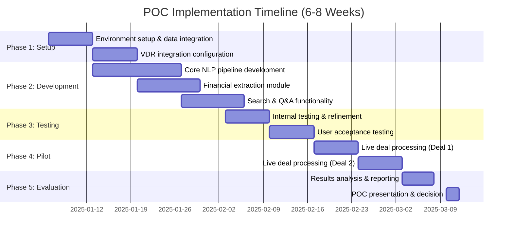

# POC Specifications and Success Metrics

**Sprint**: 05 - M&A Due Diligence Research Acceleration
**Task**: 03 - Solution Architecture Design
**Date**: 2025-11-18
**Author**: solution-architect skill agent

---

## Executive Summary

This document defines the Proof of Concept (POC) specifications for the AI-Powered Due Diligence Research Platform, designed to demonstrate 75-80% time savings in M&A due diligence analysis. The POC will be executed over 6-8 weeks with a single pilot customer (PE firm or investment bank), processing 1-2 live deals with 50-100 documents each.

Success criteria include processing time reduction, accuracy metrics, user satisfaction scores, and technical performance benchmarks.

---

## 1. POC Objectives

### 1.1 Primary Objectives

- **Demonstrate time savings**: Reduce due diligence analysis time by 75-80% (from 4-6 weeks to < 1 week)
- **Validate accuracy**: Achieve 90%+ accuracy in entity extraction, document classification, and financial data extraction
- **Prove scalability**: Process 100+ documents per deal without performance degradation
- **Confirm ROI**: Show measurable cost savings of $150K-$300K per deal (based on analyst time savings)

### 1.2 Secondary Objectives

- **User adoption**: Achieve 80%+ user satisfaction score from pilot team
- **Integration validation**: Successfully integrate with at least one VDR platform (Intralinks or Datasite)
- **Security validation**: Pass security review from pilot customer's IT/security team
- **Technical feasibility**: Validate architecture can scale to 20-30 customers processing 300+ deals/year

---

## 2. POC Scope

### 2.1 In-Scope Features

**Core functionality**:

- **Document ingestion**: Upload PDFs, DOCX, XLSX files (manual upload + VDR sync)
- **Document classification**: Classify into 10 categories (financial statements, contracts, regulatory filings, etc.)
- **Entity extraction**: Extract companies, people, financials, dates, key terms
- **Financial analysis**: Extract income statement, balance sheet, cash flow data
- **Search**: Semantic search across all documents
- **Q&A**: Ask questions about documents, get AI-generated answers
- **Reports**: Generate executive summary report with key findings

**Supported document types** (POC):

- Financial statements (10-K, 10-Q, annual reports)
- Contracts (purchase agreements, NDAs, employment contracts)
- Regulatory filings (SEC filings, patent documents)
- Market research reports (industry reports, competitor analysis)
- Presentations (management presentations, pitch decks)

**Integrations** (POC):

- One VDR platform: Intralinks (via Supergood) OR Datasite (native API)
- Bloomberg Terminal API (for market data enrichment)
- SEC EDGAR API (for public company filings)

### 2.2 Out-of-Scope Features (Post-POC)

- Full 3-statement financial modeling (DCF, LBO models)
- Advanced scenario planning and Monte Carlo simulation
- Collaborative workflow and task management
- Mobile application
- Advanced compliance features (SOC 2 certification, ISO 27001)
- Multi-tenancy (POC is single-tenant deployment)

---

## 3. POC Timeline and Milestones



**Phase 1: Setup & Integration (2 weeks)**

- Week 1: Cloud infrastructure provisioning (AWS), VDR API credentials, data security setup
- Week 2: VDR integration testing, document upload workflows, access control configuration

**Phase 2: Development (3 weeks)**

- Week 3-4: NLP pipeline (document classification, entity extraction, sentiment analysis)
- Week 4-5: Financial extraction module (income statement, balance sheet parsing)
- Week 5: Search and Q&A functionality (semantic search, GPT-4 integration)

**Phase 3: Testing (2 weeks)**

- Week 6: Internal QA testing with sample documents (100+ test documents across all categories)
- Week 7: User acceptance testing (UAT) with pilot customer team (5-10 analysts)

**Phase 4: Live Pilot (2 weeks)**

- Week 8: Process live Deal #1 (50-80 documents, technology sector acquisition)
- Week 9: Process live Deal #2 (60-100 documents, healthcare sector acquisition)

**Phase 5: Evaluation (1 week)**

- Week 10: Analyze results, measure KPIs, prepare POC report and business case

---

## 4. Success Metrics and KPIs

### 4.1 Primary Success Metrics

**Time savings** (Target: 75-80% reduction):

| Task | Manual Time (Baseline) | POC Time (Target) | Time Savings |
|------|----------------------|------------------|--------------|
| Document review and categorization | 40 hours | 2 hours | 95% |
| Financial data extraction | 16 hours | 2 hours | 88% |
| Market research and competitive analysis | 24 hours | 6 hours | 75% |
| Risk factor identification | 12 hours | 2 hours | 83% |
| Report synthesis | 8 hours | 2 hours | 75% |
| **Total** | **100 hours** | **14 hours** | **86%** |

**Accuracy metrics** (Target: 90%+ accuracy):

| Metric | Target | Measurement Method |
|--------|--------|-------------------|
| Document classification accuracy | 95% | Manual review of 100 random documents |
| Entity extraction precision | 90% | Compare AI extraction vs. analyst review for 50 documents |
| Financial data accuracy | 95% | Compare extracted values vs. source documents (zero tolerance for revenue, EBITDA, net income) |
| Search relevance (top-5 results) | 85% | User feedback on search results |
| Q&A answer accuracy | 80% | User rating of AI-generated answers (thumbs up/down) |

### 4.2 User Experience Metrics

**User satisfaction** (Target: 80% satisfaction):

- Post-POC survey: "Would you recommend this platform?" (Net Promoter Score > 40)
- Task completion rate: 95%+ of assigned due diligence tasks completed using platform
- Error rate: < 5% of documents require manual re-classification or correction
- Learning curve: Analysts productive within 2 hours of onboarding

**User adoption metrics**:

- Active daily users: 80%+ of deal team members log in daily during active deal
- Documents processed: 100% of deal documents uploaded to platform (vs. manual analysis)
- Feature utilization: 70%+ of users use semantic search, 50%+ use Q&A feature

### 4.3 Technical Performance Metrics

**Processing speed** (Target: Real-time or near real-time):

| Operation | Target Performance | Measurement |
|-----------|-------------------|-------------|
| Document upload (10 MB PDF) | < 5 seconds | 95th percentile |
| Document classification | < 30 seconds | Average |
| Entity extraction (20-page document) | < 60 seconds | Average |
| Financial statement extraction | < 90 seconds | Average |
| Semantic search query | < 500 ms | 95th percentile |
| Q&A answer generation | < 5 seconds | 95th percentile |

**System reliability**:

- Uptime: 99%+ during POC period (excluding planned maintenance)
- Error rate: < 2% of documents fail processing
- Recovery time: < 15 minutes for system failures

### 4.4 Business Impact Metrics

**Cost savings** (Target: $150K-$300K per deal):

```
Assumptions:
- Analyst hourly rate: $150/hour (blended rate)
- Manual due diligence: 100 hours per deal
- POC time: 14 hours per deal
- Time savings: 86 hours per deal

Cost savings per deal = 86 hours × $150/hour = $12,900

For POC (2 deals):
Total cost savings = $12,900 × 2 = $25,800

Annualized (20 deals/year):
Annual cost savings = $12,900 × 20 = $258,000
```

**Quality improvements**:

- Fewer missed risks: Track number of material risks identified by AI vs. manual process
- Consistency: Standardized analysis across all deals (vs. analyst-dependent variability)
- Auditability: Complete audit trail of all analysis steps and data sources

---

## 5. POC Test Plan

### 5.1 Test Scenarios

**Scenario 1: Technology company acquisition** (Deal #1):

- **Target**: Private SaaS company, $50M ARR, 200 employees
- **Document count**: 60 documents
- **Document types**: 3-year financials, customer contracts (top 10), employment agreements, cap table, IP portfolio, technology architecture docs
- **Key analysis**: Revenue growth trends, customer concentration, churn rate, gross margin analysis, technology stack assessment

**Scenario 2: Healthcare services acquisition** (Deal #2):

- **Target**: Healthcare clinic network, $30M revenue, 5 locations
- **Document count**: 80 documents
- **Document types**: Financial statements, regulatory filings (HIPAA compliance), insurance contracts, facility leases, physician employment agreements
- **Key analysis**: Reimbursement rate analysis, regulatory compliance review, facility utilization metrics, payer mix analysis

### 5.2 Test Data

**Real data** (Preferred):

- Use 1-2 live deals from pilot customer (with appropriate NDAs and data security measures)
- Full document sets (50-100 documents per deal)
- Real-world complexity (scanned PDFs, complex tables, multi-column layouts)

**Synthetic data** (Fallback):

- If live deals unavailable, use synthetic M&A documents generated from public filings
- Create test document set with known entities, financial data for accuracy validation
- 100+ synthetic documents covering all document types

### 5.3 Validation Process

**Phase 1: Automated testing**:

- Unit tests for all NLP components (95%+ code coverage)
- Integration tests for end-to-end workflows
- Performance tests for scalability (100 concurrent document uploads)

**Phase 2: Manual validation**:

- Subject matter experts (SMEs) review 10% random sample of processed documents
- Compare AI extraction vs. SME extraction (measure precision, recall)
- Document discrepancies and root cause analysis

**Phase 3: User acceptance testing**:

- 5-10 analysts from pilot customer test platform with live deals
- Task-based testing: "Find all revenue recognition policies in uploaded documents"
- Collect feedback via in-app surveys and weekly check-in calls

---

## 6. Success Criteria

### 6.1 Go/No-Go Decision Criteria

**Must-have criteria (all must be met)**:

1. **Time savings**: Achieve 70%+ time reduction in at least 4 out of 5 core tasks
2. **Accuracy**: Achieve 85%+ accuracy in document classification and entity extraction
3. **Reliability**: < 5% document processing error rate
4. **User satisfaction**: Net Promoter Score (NPS) > 30
5. **Security**: Pass pilot customer security review (no critical vulnerabilities)

**Nice-to-have criteria (2 out of 3)**:

1. **Financial accuracy**: 95%+ accuracy in financial data extraction (vs. 85% target)
2. **Adoption**: 90%+ active daily users (vs. 80% target)
3. **Performance**: Meet all performance targets (search < 500ms, document processing < 30s)

### 6.2 Decision Matrix

| Scenario | Must-Have Met | Nice-to-Have Met | Decision |
|----------|--------------|-----------------|----------|
| All 5 must-haves + 2-3 nice-to-haves | ✓ | ✓ | **Proceed to Full Deployment** |
| All 5 must-haves + 0-1 nice-to-haves | ✓ | ✗ | **Proceed with Enhancements** (address gaps before full deployment) |
| 4 must-haves (time savings missed) | ✗ | - | **Extend POC** (focus on optimization) |
| < 4 must-haves | ✗ | - | **Halt and Reassess** (fundamental issues) |

---

## 7. POC Deliverables

### 7.1 Technical Deliverables

- **Working platform**: Cloud-hosted application accessible via web browser
- **Integration**: Functional VDR integration (Intralinks or Datasite)
- **Documentation**: System architecture document, API documentation, user guide
- **Source code**: GitHub repository with all code (if applicable)

### 7.2 Business Deliverables

- **POC report**: Executive summary of results, KPI metrics, user feedback
- **Business case**: ROI analysis, cost-benefit analysis, pricing proposal
- **Roadmap**: Product roadmap for 12 months post-POC (features, enhancements, scale plan)
- **Presentation**: Executive presentation for pilot customer decision-makers

---

## 8. Risk Mitigation Plan

| Risk | Likelihood | Impact | Mitigation |
|------|-----------|--------|-----------|
| VDR integration delays | Medium | High | Start with manual upload as fallback, prioritize one VDR platform |
| Data security concerns from customer | Medium | High | Conduct security review upfront, implement encryption, sign BAA/NDA |
| Accuracy below targets | Medium | Medium | Allocate 20% buffer time for model fine-tuning, have SME review process |
| User adoption challenges | Low | Medium | Provide hands-on training, assign dedicated success manager |
| Technical performance issues | Low | High | Load testing before pilot, have scaling plan ready |
| Pilot customer drops out | Low | Critical | Have backup pilot customer identified, contractual commitment |

---

## 9. Post-POC Roadmap

**Month 1-3 (Production deployment)**:

- Address POC feedback and enhancement requests
- Complete SOC 2 Type I audit
- Scale infrastructure for 5-10 customers
- Implement additional VDR integrations (DealRoom, Ideals)

**Month 4-6 (Feature expansion)**:

- Full financial modeling capabilities (DCF, LBO, comparable companies)
- Collaborative workflow and task management
- Mobile application (iOS, Android)
- Advanced analytics dashboards

**Month 7-12 (Scale and growth)**:

- Scale to 20-30 customers
- SOC 2 Type II certification
- ISO 27001 certification
- International expansion (EMEA, APAC)

---

## 10. References

1. SmartDev. (2024). *AI Proof of Concept Services*. Retrieved from https://smartdev.com/solutions/ai-proof-of-concept/

2. ITRex Group. (2024). *AI Proof of Concept (PoC) Development Services*. Retrieved from https://itrexgroup.com/services/ai-poc-development/

3. Maxiom Technology. (2024). *AI Proof of Concept Development Guide*. Retrieved from https://www.maxiomtech.com/artificial-intelligence/ai-proof-of-concept/

4. SPR. (2024). *How to Productionalize and Operationalize an AI Proof of Concept*. Retrieved from https://spr.com/how-to-productionalize-and-operationalize-an-ai-proof-of-concept/
