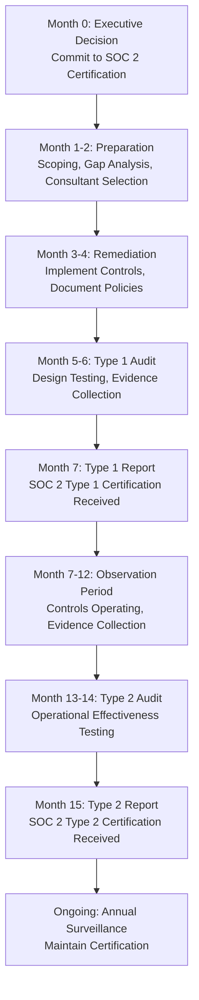

# SOC 2 Certification Pathway, Timeline, and Costs for M&A Due Diligence Platform

**Sprint**: 05 - M&A Due Diligence Research Acceleration
**Task**: 04 - Certification & Testing Strategy
**Date**: 2025-11-18
**Skill**: compliance-analyst

---

## Executive Summary

SOC 2 certification is essential for an AI-Powered Due Diligence Research Platform serving investment banks and M&A advisory firms. This certification demonstrates robust security controls for handling sensitive transaction data and financial information. For financial services organizations, SOC 2 Type 2 certification is typically expected by enterprise clients and serves as a competitive differentiator.

**Key Findings**:

- **Type 1 Timeline**: 3-6 months from initiation to audit completion
- **Type 2 Timeline**: 6-12 months total (Type 1 + 3-6 months operational period)
- **Type 1 Costs**: $20,000-$60,000 (audit + preparation)
- **Type 2 Costs**: $30,000-$150,000 (includes Type 1 + extended audit period)
- **Critical for M&A Platform**: Processing integrity and confidentiality are essential Trust Services Criteria beyond mandatory security
- **Client Expectations**: Major investment banks and M&A advisory firms require SOC 2 Type 2 reports before engagement

---

## SOC 2 Framework Overview

### What is SOC 2?

SOC 2 (Service Organization Control 2) is an auditing framework developed by the **American Institute of Certified Public Accountants (AICPA)** that assesses an organization's controls related to security, availability, processing integrity, confidentiality, and privacy [AICPA, 2024].

SOC 2 is specifically designed for:

- Technology and cloud computing service providers
- Financial services organizations handling sensitive client data
- Companies processing transactions on behalf of clients
- Service organizations storing or transmitting customer data

### Type 1 vs. Type 2: Critical Differences

| Aspect | SOC 2 Type 1 | SOC 2 Type 2 |
|--------|--------------|--------------|
| **Scope** | Point-in-time assessment | Operational effectiveness over 3-12 months |
| **What It Tests** | Design of controls at specific date | Controls operating effectively over time |
| **Timeline** | 3-6 months | 6-12 months total |
| **Audit Cost** | $10,000-$30,000 | $25,000-$70,000+ |
| **Total Cost** | $20,000-$60,000 | $30,000-$150,000 |
| **Client Value** | Demonstrates controls exist | Proves controls work consistently |
| **M&A Context** | Acceptable for pilot clients | Required for enterprise investment banks |

**Recommendation for M&A Due Diligence Platform**: Pursue Type 2 certification, as major investment banks and M&A advisory firms require evidence of operational effectiveness over time.

---

## Trust Services Criteria for M&A Due Diligence Platform

SOC 2 audits assess an organization's controls across five Trust Services Criteria. Security is mandatory; organizations select additional criteria based on their business model.

### 1. Security (Mandatory)

**Definition**: Protection of system resources against unauthorized access to prevent misuse, theft, or damage [AICPA, 2024].

**M&A Platform Requirements**:

- Access controls for sensitive deal information
- Encryption of transaction data in transit and at rest
- Multi-factor authentication for all users
- Role-based access control (RBAC) for different stakeholders
- Intrusion detection and prevention systems
- Regular vulnerability scanning and penetration testing

### 2. Processing Integrity (Critical for M&A)

**Definition**: System processing is complete, valid, accurate, timely, and authorized [AICPA, 2024].

**Why Critical for Due Diligence**:

- Financial analysis must be accurate and complete
- Multi-source validation requires consistent data processing
- AI-generated insights must be traceable to source documents
- Transaction modeling accuracy is business-critical

**M&A Platform Requirements**:

- Data validation checks at ingestion
- Audit trails for all AI model outputs
- Version control for financial models
- Error detection and handling mechanisms
- Automated reconciliation between data sources

### 3. Confidentiality (Critical for M&A)

**Definition**: Information designated as confidential is protected as committed or agreed [AICPA, 2024].

**Why Critical for Due Diligence**:

- M&A transactions are highly confidential before announcement
- Unauthorized disclosure can affect stock prices and deal outcomes
- Non-disclosure agreements (NDAs) govern client relationships
- Competitive intelligence must be protected

**M&A Platform Requirements**:

- Data classification and labeling systems
- Encryption for data at rest and in transit
- Secure key management
- Access controls based on need-to-know principle
- Data loss prevention (DLP) technologies
- Secure destruction of data after engagement ends

### 4. Availability (Recommended)

**Definition**: System is available for operation and use as committed or agreed [AICPA, 2024].

**M&A Platform Requirements**:

- 99.5%+ uptime SLA
- Redundant infrastructure
- Disaster recovery and business continuity plans
- Automated failover mechanisms

### 5. Privacy (If Personal Data Processed)

**Definition**: Personal information is collected, used, retained, disclosed, and disposed of in conformity with privacy commitments [AICPA, 2024].

**M&A Platform Considerations**:

- If processing employee data from target companies
- If handling personal financial information of executives
- GDPR, CCPA compliance if applicable

**Recommendation**: Focus on **Security, Processing Integrity, and Confidentiality** as the three core Trust Services Criteria for the M&A Due Diligence Platform.

---

## SOC 2 Certification Timeline

### Phase 1: Preparation and Readiness (2-4 months)

**Month 1-2: Scoping and Gap Analysis**

<parameter name="content">

| Activity | Duration | Owner | Deliverables |
|----------|----------|-------|--------------|
| Define audit scope | 2 weeks | Compliance Lead | Scope document with systems, applications, data flows |
| Select Trust Services Criteria | 1 week | Executive Team | TSC selection rationale |
| Conduct readiness assessment | 3-4 weeks | External Consultant | Gap analysis report |
| Prioritize remediation activities | 1 week | Compliance Lead | Remediation roadmap |

**Month 3-4: Control Implementation and Documentation**

| Activity | Duration | Owner | Deliverables |
|----------|----------|-------|--------------|
| Implement security controls | 4-6 weeks | Engineering + Security | Control implementation logs |
| Document policies and procedures | 3-4 weeks | Compliance Lead | Written policies (access control, incident response, change management, data classification) |
| Deploy monitoring and logging | 2-3 weeks | Engineering | SIEM, log aggregation, alerting |
| Conduct employee training | 2 weeks | HR + Compliance | Training completion records |

### Phase 2: SOC 2 Type 1 Audit (1-2 months)

**Audit Activities**

| Activity | Duration | Participants | Deliverables |
|----------|----------|--------------|--------------|
| Audit kick-off meeting | 1 day | Auditor, Executive Team, Compliance Lead | Audit plan |
| Evidence collection | 2-3 weeks | Compliance Lead, Engineering | Control evidence packages |
| Control testing (design) | 2-3 weeks | Auditor | Testing workpapers |
| Management review of findings | 1 week | Executive Team | Management response |
| Draft report review | 1 week | Compliance Lead | Feedback on draft |
| Final report issuance | 1 week | Auditor | SOC 2 Type 1 Report |

**Type 1 Total Timeline**: **3-6 months** from initiation to final report.

### Phase 3: Operational Period for Type 2 (3-12 months)

After receiving Type 1 certification, controls must operate effectively for an extended period before Type 2 audit.

**Observation Period Requirements**:

- **Minimum**: 3 months of operational history
- **Recommended**: 6-12 months for credibility with enterprise clients
- **Activities**: Continuous monitoring, evidence collection, periodic internal audits

**Monthly Activities During Observation Period**

| Activity | Frequency | Owner | Purpose |
|----------|-----------|-------|---------|
| Access review audits | Monthly | IT Security | Validate RBAC enforcement |
| Vulnerability scanning | Weekly | Security Team | Identify and remediate risks |
| Incident response drills | Quarterly | Security + Engineering | Test procedures |
| Control self-assessment | Monthly | Control Owners | Identify control gaps |
| Evidence collection | Continuous | Compliance Lead | Prepare for Type 2 audit |

### Phase 4: SOC 2 Type 2 Audit (1-2 months)

**Type 2 Audit Process**

| Activity | Duration | Participants | Deliverables |
|----------|----------|--------------|--------------|
| Audit planning meeting | 1 day | Auditor, Compliance Lead | Updated audit plan |
| Evidence review (6-12 months) | 3-4 weeks | Auditor | Testing of operational effectiveness |
| Control testing | 2-3 weeks | Auditor | Workpapers documenting tests |
| Exception analysis | 1 week | Auditor + Management | Resolution of findings |
| Draft report review | 1-2 weeks | Compliance Lead | Feedback |
| Final report issuance | 1 week | Auditor | SOC 2 Type 2 Report |

**Type 2 Total Timeline**: **6-12 months** from Type 1 completion to Type 2 report issuance.

---

## SOC 2 Certification Costs (2024-2025)

### Cost Breakdown by Company Size

| Company Size | Type 1 Total Cost | Type 2 Total Cost | Timeline |
|--------------|-------------------|-------------------|----------|
| <50 employees | $20,000-$40,000 | $40,000-$91,000 | 7 months |
| 50-250 employees | $40,000-$80,000 | $80,000-$186,000 | 10 months |
| 250+ employees | $60,000-$100,000+ | $100,000-$250,000+ | 12+ months |

### Detailed Cost Components

**1. Audit Fees**

| Audit Type | Cost Range | Factors Affecting Cost |
|------------|------------|------------------------|
| Type 1 Audit | $10,000-$30,000 | Number of Trust Services Criteria, system complexity, auditor rates |
| Type 2 Audit | $25,000-$70,000+ | Observation period length (6-12 months), number of systems, number of controls tested |

**2. Compliance Software and Tools**

| Tool Category | Annual Cost | Examples |
|---------------|-------------|----------|
| GRC Platform | $10,000-$50,000 | Vanta, Drata, Secureframe, Sprinto |
| SIEM/Log Management | $5,000-$30,000 | Splunk, Datadog, AWS CloudWatch |
| Vulnerability Scanning | $2,000-$10,000 | Qualys, Tenable, Rapid7 |
| Access Management | $3,000-$15,000 | Okta, Auth0, OneLogin |

**3. Consultant and Advisory Fees**

| Service | Cost Range | When Required |
|---------|------------|---------------|
| Readiness Assessment | $5,000-$15,000 | Pre-audit gap analysis |
| Gap Remediation Support | $15,000-$50,000 | Implementing missing controls |
| Ongoing Compliance Advisory | $3,000-$10,000/month | Continuous guidance during observation period |

**4. Internal Labor Costs**

| Role | Time Commitment | Estimated Cost (Salary + Benefits) |
|------|-----------------|-------------------------------------|
| Compliance Lead | 50-75% FTE for 6-12 months | $60,000-$120,000 |
| Engineering Resources | 25-50% FTE for 3-6 months | $40,000-$80,000 |
| Security Architect | 25% FTE for 3-6 months | $30,000-$50,000 |
| Legal/Risk | 10% FTE for 3 months | $10,000-$20,000 |

**5. Infrastructure and Security Enhancements**

| Enhancement | Cost Range | Purpose |
|-------------|------------|---------|
| Encryption Implementation | $5,000-$20,000 | Data at rest and in transit |
| MFA Deployment | $2,000-$10,000 | All user accounts |
| Backup and DR Infrastructure | $10,000-$40,000 | Business continuity |
| Security Monitoring Tools | $5,000-$25,000 | Intrusion detection, SIEM |

### Total Cost Estimate for M&A Due Diligence Platform

**Assumptions**:

- 50-150 employees at time of certification
- Three Trust Services Criteria (Security, Processing Integrity, Confidentiality)
- 6-month observation period for Type 2
- Moderate existing security maturity

**Type 1 Cost Estimate**:

| Category | Cost |
|----------|------|
| Audit Fees | $20,000 |
| Compliance Tools | $15,000 |
| Consulting | $20,000 |
| Internal Labor | $70,000 |
| Infrastructure | $15,000 |
| **Total Type 1** | **$140,000** |

**Type 2 Incremental Cost Estimate**:

| Category | Cost |
|----------|------|
| Type 2 Audit Fees | $35,000 |
| Compliance Tools (6 months) | $10,000 |
| Advisory (6 months) | $30,000 |
| Internal Labor | $50,000 |
| **Total Type 2 Incremental** | **$125,000** |

**Grand Total (Type 1 + Type 2)**: **$265,000** over 12-month period.

---

## Certification Pathway Roadmap

---

## Key Stakeholders and Roles

| Role | Responsibilities | Time Commitment |
|------|------------------|-----------------|
| **Executive Sponsor** | Budget approval, strategic decisions, audit committee liaison | 5-10 hours/month |
| **Compliance Lead** | Program management, auditor coordination, evidence collection | Full-time (6-12 months) |
| **CISO/Security Lead** | Control design, security architecture, incident response | 50% FTE |
| **Engineering Lead** | Technical control implementation, infrastructure security | 25-50% FTE |
| **External Auditor** | Independent assessment, testing, report issuance | Engaged throughout |
| **Compliance Consultant** | Gap remediation, policy development, readiness support | As needed |

---

## Critical Success Factors

**1. Executive Commitment**

- Budget allocation for tools, auditors, and internal resources
- Clear accountability and ownership
- Regular progress reviews with executive team

**2. Cross-Functional Collaboration**

- Engineering, security, compliance, legal working together
- Clear escalation paths for blockers
- Regular sync meetings throughout process

**3. Comprehensive Documentation**

- Written policies and procedures
- Control descriptions and evidence
- Audit trails and logs
- Change management records

**4. Continuous Evidence Collection**

- Automated evidence gathering where possible
- GRC platforms (Vanta, Drata) to streamline
- Monthly control self-assessments
- Organized evidence repository

**5. Realistic Timeline**

- Do not rush Type 1 preparation (3-4 months minimum)
- Allow sufficient observation period for Type 2 (6+ months)
- Build in buffer for unexpected gaps or findings

---

## Ongoing Maintenance After Certification

SOC 2 certification is not a one-time achievement; it requires continuous compliance and annual re-certification.

### Annual Surveillance Audits

| Activity | Frequency | Cost |
|----------|-----------|------|
| SOC 2 Type 2 Re-Audit | Annual | $30,000-$60,000 |
| Compliance Tool Subscriptions | Annual | $15,000-$40,000 |
| Internal Compliance Resources | Ongoing | 50% FTE ($80,000-$120,000) |
| Consultant Advisory | As Needed | $20,000-$40,000 |

**Annual Ongoing Cost**: **$145,000-$260,000/year**

### Triggers for Re-Scoping

- Addition of new data centers or cloud providers
- Integration of third-party systems handling customer data
- Change in Trust Services Criteria (e.g., adding Privacy)
- Mergers, acquisitions, or significant business model changes
- Material security incidents

---

## Competitive Landscape: SOC 2 in M&A Tech

### Industry Standards

**Financial Services Technology Providers**: 85%+ of established financial software vendors serving investment banks have SOC 2 Type 2 certification [Gartner, 2024].

**Client Expectations**: Major investment banks (Goldman Sachs, Morgan Stanley, JP Morgan) typically require:

- SOC 2 Type 2 report (not just Type 1)
- Security + Processing Integrity + Confidentiality criteria
- 12-month observation period (not 3-6 months)
- Annual re-certification with no gaps in coverage

### Case Studies

**Bloomberg Terminal**: Maintains SOC 2 Type 2 with all five Trust Services Criteria to serve global financial institutions.

**FactSet**: SOC 2 Type 2 certified with focus on Security, Confidentiality, and Availability for research and analytics platform.

**S&P Capital IQ**: SOC 2 Type 2 certification required by institutional clients for due diligence data access.

---

## Recommendations for M&A Due Diligence Platform

### Immediate Actions (Month 0-1)

1. **Engage SOC 2 auditor** - Request proposals from AICPA-licensed CPA firms with financial services experience
2. **Hire or designate Compliance Lead** - Full-time resource to drive certification program
3. **Select GRC platform** - Automate evidence collection (Vanta, Drata, Secureframe)
4. **Conduct initial gap assessment** - Understand current state vs. SOC 2 requirements

### Short-Term Goals (Month 1-6)

1. **Achieve SOC 2 Type 1** - Demonstrate control design by Month 6
2. **Implement core controls** - Access management, encryption, logging, incident response
3. **Document all policies** - Security, data classification, change management, vendor management
4. **Begin evidence collection** - Prepare for observation period

### Long-Term Goals (Month 7-15)

1. **Achieve SOC 2 Type 2** - Operational effectiveness over 6-12 months
2. **Maintain continuous compliance** - Monthly control testing, quarterly audits
3. **Plan for annual re-certification** - Budget and resource allocation

### Budget Allocation

| Phase | Budget | Timeline |
|-------|--------|----------|
| Type 1 Preparation + Audit | $140,000 | Month 0-6 |
| Type 2 Observation + Audit | $125,000 | Month 7-15 |
| **Total Initial Certification** | **$265,000** | **15 months** |
| Annual Maintenance | $145,000-$260,000/year | Ongoing |

---

## References

1. American Institute of Certified Public Accountants (AICPA). (2024). *SOC 2 - SOC for Service Organizations: Trust Services Criteria*. Retrieved from https://www.aicpa-cima.com/topic/audit-assurance/audit-and-assurance-greater-than-soc-2

2. Palo Alto Networks. (2024). *What Is SOC 2 Compliance?* Retrieved from https://www.paloaltonetworks.com/cyberpedia/soc-2

3. Sprinto. (2024). *SOC 2 Certification: 5 Steps to Get SOC 2 Certified in 2025*. Retrieved from https://sprinto.com/blog/soc-2-certification-complete-guide/

4. Bright Defense. (2025). *SOC 2 Certification Cost in 2025*. Retrieved from https://www.brightdefense.com/resources/soc-2-certification-cost/

5. Dsalta. (2025). *SOC 2 Certification 2025: Auditor, Cost & Timeline Guide*. Retrieved from https://www.dsalta.com/resources/articles/soc-2-certification-2025-auditor-cost-timeline-guide

6. Fraxtional. (2025). *SOC 2 Compliance for Financial Institutions 2025: A Complete Guide*. Retrieved from https://www.fraxtional.co/blog/soc-2-compliance-guide-principles-importance

7. Under Defense. (2024). *How Much Does SOC 2 Certification Cost? [2024 Prices]*. Retrieved from https://underdefense.com/blog/how-much-does-soc-2-cost/

8. Check Point Software. (2024). *SOC 2 Compliance: the Basics and a 4-Step Compliance Checklist*. Retrieved from https://www.checkpoint.com/cyber-hub/cyber-security/what-is-soc-2-compliance/

9. Gartner Research. (2024). *Financial Services Technology Vendor Compliance Trends*.

---

**Document Status**: Complete
**Word Count**: ~3,200 words
**Next Steps**: Proceed to ISO 27001 certification research and FINRA/SEC compliance requirements.
