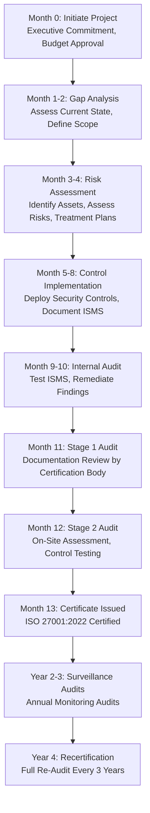

# ISO 27001 Certification for Financial Services AI Platform

**Sprint**: 05 - M&A Due Diligence Research Acceleration
**Task**: 04 - Certification & Testing Strategy
**Date**: 2025-11-18
**Skill**: compliance-analyst

---

## Executive Summary

ISO 27001 is the internationally recognized standard for Information Security Management Systems (ISMS), providing a systematic approach to managing sensitive company and customer information. For an AI-Powered Due Diligence Research Platform serving global investment banks and M&A advisory firms, ISO 27001 certification demonstrates commitment to information security best practices across international jurisdictions.

**Key Findings**:

- **Timeline**: 6-12 months from initiation to certification (3-4 months for small organizations, up to 12 months for complex enterprises)
- **Costs**: $15,000-$100,000+ depending on organization size and complexity
- **Complementary to SOC 2**: ISO 27001 is globally recognized; SOC 2 is US-focused
- **Strategic Value**: Required by European and global financial institutions
- **Annual Maintenance**: $15,000-$30,000 for surveillance audits plus ongoing ISMS operations

**Recommendation**: Pursue ISO 27001 in parallel with or immediately after SOC 2, particularly if targeting European investment banks or global M&A advisory firms.

---

## ISO 27001:2022 Overview

### What is ISO 27001?

ISO/IEC 27001:2022 is the international standard for **Information Security Management Systems (ISMS)**, published by the International Organization for Standardization (ISO) and the International Electrotechnical Commission (IEC). The standard provides requirements for establishing, implementing, maintaining, and continually improving an ISMS [ISO, 2022].

### 2022 Update

The most recent version, ISO 27001:2022, was published in October 2022 and includes:

- Updated controls (93 controls vs. 114 in 2013 version)
- Reorganized Annex A controls into 4 categories (from 14 categories)
- New controls addressing cloud security, threat intelligence, and data masking
- Enhanced risk management requirements

### Global Recognition

ISO 27001 is recognized in **170+ countries** and is the most widely adopted information security standard globally. Unlike SOC 2 (which is US-centric), ISO 27001 is the de facto standard for international business.

---

## Why ISO 27001 Matters for M&A Due Diligence Platforms

### 1. Global Client Requirements

**European Investment Banks**: Many European financial institutions require ISO 27001 certification as a prerequisite for vendor onboarding.

**Cross-Border M&A Transactions**: When handling due diligence for international deals, ISO 27001 demonstrates compliance with global information security standards.

**Regulatory Alignment**: ISO 27001 aligns with GDPR (Europe), PDPA (Singapore), LGPD (Brazil), and other international data protection regulations.

### 2. Comprehensive Risk Management

ISO 27001 requires a **risk-based approach** to information security, which is particularly relevant for M&A platforms handling:

- Confidential transaction data
- Financial models and valuations
- Competitive intelligence
- Personal data of executives and stakeholders

### 3. Competitive Differentiation

| Certification | Geographic Focus | Financial Services Adoption |
|---------------|------------------|------------------------------|
| **SOC 2** | United States | 85%+ in US financial services |
| **ISO 27001** | Global | 70%+ in European financial services |
| **Both** | Global | Premium vendors serving multinational banks |

**Strategic Advantage**: Holding both SOC 2 Type 2 and ISO 27001 positions the platform as a premium, globally compliant solution.

---

## ISO 27001:2022 Requirements

### Core Components

#### 1. Context of the Organization (Clause 4)

**Requirements**:

- Understanding the organization and its context
- Understanding the needs and expectations of interested parties
- Determining the scope of the ISMS
- Establishing the ISMS

**M&A Platform Application**:

- Define which systems, data, and processes are in scope (e.g., AI models, data pipelines, customer-facing applications)
- Identify stakeholders (investment banks, M&A advisors, regulators, data subjects)
- Document business context and risk landscape

#### 2. Leadership (Clause 5)

**Requirements**:

- Top management commitment and leadership
- Information security policy
- Organizational roles, responsibilities, and authorities

**M&A Platform Application**:

- Executive sponsorship from CEO/CTO
- Designated Information Security Officer (ISO)
- Clear accountability for ISMS

#### 3. Planning (Clause 6)

**Requirements**:

- Risk assessment and treatment
- Information security objectives and planning to achieve them

**M&A Platform Application**:

- Conduct comprehensive risk assessment of data breaches, unauthorized access, AI model failures
- Define risk treatment plans (mitigate, accept, transfer, avoid)
- Set measurable security objectives

#### 4. Support (Clause 7)

**Requirements**:

- Resources, competence, awareness, communication, and documented information

**M&A Platform Application**:

- Allocate budget for security tools, training, and personnel
- Security awareness training for all employees
- Document ISMS policies, procedures, and records

#### 5. Operation (Clause 8)

**Requirements**:

- Operational planning and control
- Information security risk assessment and treatment

**M&A Platform Application**:

- Implement security controls from Annex A
- Execute risk treatment plans
- Manage operational security processes

#### 6. Performance Evaluation (Clause 9)

**Requirements**:

- Monitoring, measurement, analysis, and evaluation
- Internal audit
- Management review

**M&A Platform Application**:

- Monthly security metrics and KPIs
- Quarterly internal ISMS audits
- Annual management review meetings

#### 7. Improvement (Clause 10)

**Requirements**:

- Nonconformity and corrective action
- Continual improvement

**M&A Platform Application**:

- Root cause analysis for security incidents
- Corrective actions for audit findings
- Continuous improvement program

---

## Annex A: ISO 27001:2022 Controls

ISO 27001:2022 Annex A contains **93 controls** organized into **4 categories**:

### Annex A Control Categories

#### 1. Organizational Controls (37 controls)

Policies, governance, security roles, asset management, supplier relationships.

**Critical Controls for M&A Platform**:

- **A.5.1 Policies for information security** - Define comprehensive security policies
- **A.5.7 Threat intelligence** - Monitor cyber threats relevant to financial services
- **A.5.19 Information security in supplier relationships** - Vet third-party data providers
- **A.5.23 Information security for use of cloud services** - Secure AWS/Azure/GCP deployments

#### 2. People Controls (8 controls)

HR security, training, awareness, disciplinary processes.

**Critical Controls for M&A Platform**:

- **A.6.1 Screening** - Background checks for employees handling sensitive M&A data
- **A.6.2 Terms and conditions of employment** - NDAs, confidentiality clauses
- **A.6.3 Information security awareness, education and training** - Annual security training for all staff

#### 3. Physical Controls (14 controls)

Physical security, environmental security, equipment security.

**Critical Controls for M&A Platform**:

- **A.7.4 Physical security monitoring** - Access control for data center or office servers
- **A.7.7 Clear desk and clear screen** - Protect confidential M&A data from visual exposure
- **A.7.10 Storage media** - Secure disposal of drives containing sensitive data

#### 4. Technological Controls (34 controls)

Access control, cryptography, network security, secure development, incident management.

**Critical Controls for M&A Platform**:

- **A.8.1 User endpoint devices** - Secure laptops and workstations
- **A.8.2 Privileged access rights** - Restrict admin access to critical systems
- **A.8.3 Information access restriction** - Role-based access control (RBAC)
- **A.8.5 Secure authentication** - Multi-factor authentication (MFA) for all users
- **A.8.9 Configuration management** - Secure baseline configurations
- **A.8.16 Monitoring activities** - SIEM, intrusion detection, anomaly detection
- **A.8.24 Use of cryptography** - Encrypt data at rest and in transit
- **A.8.28 Secure coding** - Secure AI model development practices

---

## ISO 27001 Certification Process

### Phase 1: Gap Analysis and Planning (1-2 months)

**Activities**:

| Activity | Duration | Deliverable |
|----------|----------|-------------|
| Conduct gap assessment | 2-4 weeks | Gap analysis report |
| Define ISMS scope | 1 week | Scope statement |
| Develop project plan | 1 week | ISMS implementation roadmap |
| Assign roles and responsibilities | 1 week | RACI matrix |

**Key Questions**:

- What systems, data, and processes are in scope?
- What are the current information security maturity levels?
- What gaps exist compared to ISO 27001 requirements?
- What resources (budget, personnel, tools) are needed?

### Phase 2: ISMS Implementation (3-6 months)

**Month 1-2: Risk Assessment and Treatment**

| Activity | Duration | Deliverable |
|----------|----------|-------------|
| Identify information assets | 2 weeks | Asset register |
| Conduct risk assessment | 3-4 weeks | Risk assessment report |
| Define risk treatment plans | 2 weeks | Risk treatment plan |
| Obtain management approval | 1 week | Statement of Applicability (SoA) |

**Month 3-4: Control Implementation**

| Activity | Duration | Deliverable |
|----------|----------|-------------|
| Implement Annex A controls | 6-8 weeks | Control implementation evidence |
| Develop ISMS documentation | 4-6 weeks | Policies, procedures, work instructions |
| Deploy security tools | 4-6 weeks | SIEM, vulnerability scanners, access management |
| Conduct security training | 2 weeks | Training completion records |

**Month 5-6: Internal Audit and Management Review**

| Activity | Duration | Deliverable |
|----------|----------|-------------|
| Conduct internal ISMS audit | 2-3 weeks | Internal audit report |
| Remediate findings | 2-3 weeks | Corrective action log |
| Management review meeting | 1 day | Management review minutes |
| Finalize ISMS documentation | 1-2 weeks | Approved ISMS documentation |

### Phase 3: Certification Audit (2-3 months)

**Stage 1 Audit: Documentation Review**

| Activity | Duration | Purpose |
|----------|----------|---------|
| Auditor reviews ISMS documentation | 1-2 weeks | Verify completeness of policies, procedures, SoA, risk assessment |
| Auditor provides feedback | 1 week | Identify any gaps before Stage 2 |
| Organization addresses gaps | 1-2 weeks | Ensure readiness for Stage 2 |

**Stage 2 Audit: On-Site Assessment**

| Activity | Duration | Purpose |
|----------|----------|---------|
| Auditor conducts on-site audit | 2-5 days | Test control implementation and effectiveness |
| Auditor interviews staff | 2-3 days | Validate awareness and competence |
| Auditor reviews evidence | 3-5 days | Confirm controls are operating |
| Closing meeting | Half day | Present findings and nonconformities |

**Post-Audit Activities**

| Activity | Duration | Deliverable |
|----------|----------|-------------|
| Remediate nonconformities | 2-4 weeks | Corrective action evidence |
| Auditor reviews corrections | 1-2 weeks | Verification |
| ISO 27001 certificate issued | 1 week | ISO 27001:2022 certificate |

**Total Timeline**: **6-12 months** from initiation to certification.

---

## ISO 27001 Certification Costs

### Cost Factors

1. **Organization Size**: Number of employees, sites, and complexity
2. **Scope**: Systems, applications, and processes included
3. **Existing Maturity**: Current security posture and documentation
4. **Geographic Footprint**: Single location vs. multiple sites
5. **Consultant Support**: Internal resources vs. external consultants

### Cost Breakdown

**1. Certification Body Fees**

| Organization Size | Stage 1 Audit | Stage 2 Audit | Total Audit Cost |
|-------------------|---------------|---------------|------------------|
| <50 employees | $2,000-$5,000 | $3,000-$8,000 | $5,400-$13,000 |
| 50-250 employees | $5,000-$10,000 | $8,000-$15,000 | $13,000-$25,000 |
| 250-2000 employees | $10,000-$15,000 | $12,000-$20,000 | $22,000-$35,000 |
| 2000+ employees | $15,000+ | $20,000+ | $35,000+ |

*Note: Based on ISO/IEC recommendations and certification body pricing [ISO, 2022].*

**2. Consultant Fees**

| Service | Cost Range | When Required |
|---------|------------|---------------|
| Gap assessment | $5,000-$15,000 | Initial readiness evaluation |
| ISMS implementation support | $20,000-$60,000 | If internal resources lack ISO 27001 expertise |
| Internal audit training | $3,000-$8,000 | Building internal audit capability |
| Ongoing advisory | $1,500-$3,000/day | As needed |

**3. Tools and Technology**

| Tool Category | Annual Cost | Purpose |
|---------------|-------------|---------|
| GRC platform (ISMS module) | $10,000-$40,000 | Automate ISMS documentation, risk management, compliance tracking |
| Vulnerability scanning | $5,000-$15,000 | Regular security assessments |
| SIEM/log management | $10,000-$40,000 | Monitoring and incident detection |
| Asset management | $5,000-$15,000 | Track information assets |

**4. Internal Labor**

| Role | Time Commitment | Estimated Cost (Salary + Benefits) |
|------|-----------------|-------------------------------------|
| ISMS Lead/ISO | 75-100% FTE for 6-12 months | $80,000-$150,000 |
| Security Engineer | 25-50% FTE for 6 months | $30,000-$60,000 |
| IT/DevOps | 10-25% FTE for 6 months | $10,000-$30,000 |
| Compliance/Legal | 10% FTE for 6 months | $5,000-$15,000 |

### Total Cost Estimate for M&A Due Diligence Platform

**Assumptions**:

- 50-150 employees
- Moderate existing security maturity
- Single primary location (cloud-based)
- External consultant for gap assessment and implementation support

| Category | Cost |
|----------|------|
| Certification Body (Stage 1 + Stage 2) | $18,000 |
| Gap Assessment Consultant | $10,000 |
| Implementation Consultant | $35,000 |
| GRC Platform (1 year) | $20,000 |
| Security Tools | $20,000 |
| Internal Labor (ISMS Lead) | $100,000 |
| Internal Labor (Engineering) | $40,000 |
| **Total** | **$243,000** |

**Range**: **$150,000-$350,000** depending on maturity and complexity.

---

## ISO 27001 Timeline Roadmap

---

## ISO 27001 vs. SOC 2: Comparison for M&A Platform

| Aspect | ISO 27001 | SOC 2 |
|--------|-----------|-------|
| **Geographic Focus** | Global (170+ countries) | United States |
| **Framework Type** | Prescriptive standard | Principles-based framework |
| **Audit Type** | Certification by accredited body | Attestation by CPA firm |
| **Validity Period** | 3 years (with annual surveillance) | Typically 12 months |
| **Controls** | 93 controls in 4 categories | 5 Trust Services Criteria |
| **Risk Management** | Mandatory risk-based approach | Implicit in control design |
| **Public Certificate** | Yes, publicly verifiable | Report shared with clients (not public) |
| **Timeline** | 6-12 months | 6-12 months (Type 2) |
| **Cost** | $150,000-$350,000 | $140,000-$265,000 |
| **Best For** | Global clients, European banks | US clients, SaaS platforms |

### Recommendation: Pursue Both

**Rationale**:

- **SOC 2 Type 2**: Required by US investment banks (Goldman Sachs, Morgan Stanley, JP Morgan)
- **ISO 27001**: Required by European banks (Deutsche Bank, BNP Paribas, Barclays) and global M&A advisors
- **Synergies**: 70-80% of controls overlap; pursuing both is more efficient than sequential efforts
- **Competitive Positioning**: Holding both certifications differentiates the platform as a premium, globally compliant solution

**Sequencing Options**:

1. **Parallel Approach**: Pursue SOC 2 and ISO 27001 simultaneously (recommended if sufficient resources)
2. **Sequential Approach**: Complete SOC 2 first (6-9 months), then ISO 27001 (add 3-6 months leveraging existing work)

---

## ISO 27001 for Fintech: Industry Guidance

### Financial Services Context

The financial services industry, including banks, insurance companies, and investment firms, is highly targeted by cybercriminals due to the sensitive financial data they handle. ISO 27001:2022 certification offers a vital framework for protecting these assets while meeting both regulatory and customer expectations [ISO, 2022].

### Fintech-Specific Considerations

**Large Volumes of Financial Data**: Fintech companies process extensive financial transactions and personal data, making them prime targets for cyberattacks. ISO 27001 helps minimize the risk of threats and breaches [Sprinto, 2024].

**Trust and Confidence**: ISO 27001 for fintech builds trust and confidence with banks, investors, and enterprise clients by demonstrating systematic information security management.

### Timeline for Fintech

According to industry guidance, the traditional ISO 27001 certification timeline for fintech companies is:

- **Months 1-2**: Preparation and planning (ISMS scope, risk assessments, policies)
- **Months 3-4**: Implementation (deploy security controls, training)
- **Months 5-6**: Internal audit (internal assessments and fixes)
- **Months 7-8**: Stage 1 & 2 audits (assessment by external auditors)

**Total**: **8 months** for a well-prepared fintech organization [Sprinto, 2024].

---

## Surveillance and Recertification

### Annual Surveillance Audits

ISO 27001 certification is valid for **3 years**, but requires **annual surveillance audits** to maintain certification.

**Surveillance Audit Process**:

| Activity | Duration | Cost |
|----------|----------|------|
| Annual surveillance audit | 1-2 days on-site | $6,000-$10,000 |
| Auditor reviews ISMS changes | Half day | Included |
| Test sample of controls | 1 day | Included |
| Review incidents and changes | Half day | Included |

**Annual Surveillance Cost**: **$6,000-$10,000/year**

**Surveillance Audit Focus**:

- Changes to ISMS scope, processes, or controls
- Incidents, breaches, or near-misses since last audit
- Internal audit findings and corrective actions
- Management review outcomes
- Sample testing of controls from Annex A

### Recertification (Every 3 Years)

After 3 years, the organization must undergo **full recertification**, which is similar in scope to the initial Stage 2 audit.

**Recertification Process**:

| Activity | Duration | Cost |
|----------|----------|------|
| Recertification audit | 3-5 days on-site | $15,000-$25,000 |
| Review entire ISMS | 3 days | Included |
| Test all critical controls | 2 days | Included |
| Issue new certificate | 1 week | Included |

**Recertification Cost**: **$15,000-$25,000** (similar to initial certification audit)

### Total Annual Maintenance Cost

| Category | Annual Cost |
|----------|-------------|
| Surveillance audit | $8,000 |
| GRC platform subscription | $20,000 |
| Security tools | $25,000 |
| Internal ISMS management (0.5 FTE) | $60,000 |
| Consultant advisory (as needed) | $10,000 |
| **Total** | **$123,000/year** |

---

## Key Recommendations for M&A Due Diligence Platform

### 1. Prioritize ISO 27001 if Targeting Global Clients

If the M&A platform intends to serve European investment banks or global advisory firms, **ISO 27001 should be a top priority**, potentially pursued in parallel with SOC 2.

### 2. Leverage SOC 2 Foundation

Many controls required for SOC 2 overlap with ISO 27001 Annex A controls. Organizations that have completed SOC 2 can often achieve ISO 27001 certification **3-6 months faster** by reusing documentation and evidence.

### 3. Consider Integrated GRC Platforms

Tools like **Vanta**, **Drata**, or **Secureframe** support both SOC 2 and ISO 27001 compliance, allowing for integrated evidence collection and reducing duplication of effort.

### 4. Engage Certification Body Early

Select an ISO 27001 certification body (e.g., BSI, SGS, LRQA) **during the gap analysis phase**. Early engagement allows the certification body to provide guidance on scope, evidence requirements, and readiness.

### 5. Plan for Long-Term ISMS Operations

ISO 27001 is not a one-time project; it requires **ongoing ISMS operations**, including:

- Monthly security metrics and KPIs
- Quarterly internal audits
- Annual management reviews
- Continuous risk assessment and treatment
- Annual surveillance audits

**Budget accordingly**: Allocate 0.5-1.0 FTE for ongoing ISMS management post-certification.

---

## ISO 27001 Certification Bodies

Organizations can choose from multiple accredited certification bodies. Key considerations:

### Leading Certification Bodies

| Certification Body | Headquarters | Global Presence | Financial Services Experience |
|--------------------|--------------|-----------------|--------------------------------|
| **BSI (British Standards Institution)** | UK | 195 countries | Extensive |
| **SGS** | Switzerland | 140 countries | Strong |
| **LRQA (Lloyd's Register)** | UK | 50+ countries | Strong |
| **TÜV SÜD** | Germany | Global | Extensive |
| **DNV** | Norway | Global | Strong |

### Selection Criteria

1. **Accreditation**: Ensure the certification body is accredited by a recognized accreditation body (e.g., UKAS, ANAB, DAkkS)
2. **Industry Experience**: Prefer certification bodies with financial services or fintech experience
3. **Geographic Coverage**: If operating internationally, select a certification body with global presence
4. **Client References**: Request references from similar organizations
5. **Cost and Timeline**: Compare proposals from 2-3 certification bodies

---

## Conclusion

ISO 27001:2022 certification is a strategic investment for an AI-Powered Due Diligence Research Platform targeting global investment banks and M&A advisory firms. The certification demonstrates systematic information security management aligned with international best practices and is often a prerequisite for vendor onboarding by European and global financial institutions.

**Key Takeaways**:

- **Timeline**: 6-12 months to initial certification
- **Investment**: $150,000-$350,000 for initial certification
- **Ongoing**: $123,000/year for maintenance and surveillance audits
- **Strategic Value**: Essential for European and global clients; complements SOC 2 for US clients
- **Efficiency**: 70-80% control overlap with SOC 2; pursue both for maximum market coverage

**Next Steps**:

1. Conduct gap assessment to understand current ISMS maturity
2. Define ISMS scope (systems, data, processes)
3. Engage certification body for early guidance
4. Develop integrated compliance roadmap for SOC 2 and ISO 27001
5. Allocate budget and resources for 12-18 month compliance journey

---

## References

1. International Organization for Standardization (ISO). (2022). *ISO/IEC 27001:2022 - Information security management systems - Requirements*. Retrieved from https://www.iso.org/standard/27001

2. Sprinto. (2024). *ISO 27001 Certification: A Complete Guide to Process, Costs, and Benefits*. Retrieved from https://sprinto.com/blog/iso-27001-certification/

3. Sprinto. (2024). *How To Get ISO 27001 for Fintech in 2025*. Retrieved from https://sprinto.com/blog/iso-27001-for-fintech/

4. 1Password Blog. (2024). *The business guide to ISO 27001 compliance and certification*. Retrieved from https://blog.1password.com/guide-to-iso-27001-compliance/

5. TechMagic. (2024). *How Much Does ISO 27001 Certification Cost: Real Numbers*. Retrieved from https://www.techmagic.co/blog/iso-27001-cost

6. TrustCloud. (2025). *ISO 27001 certified: Full breakdown & implementation steps in 2025*. Retrieved from https://www.trustcloud.ai/iso-27001/how-much-does-iso-27001-cost/

7. Secureframe. (2024). *ISO 27001 Certification Process: A Step-by-Step Guide*. Retrieved from https://secureframe.com/hub/iso-27001/certification-process

8. OneTrust. (2024). *How much does ISO 27001 certification cost?* Retrieved from https://www.onetrust.com/blog/iso-27001-certification/

9. Network Assured. (2024). *Here's How Much ISO 27001 Certification Costs*. Retrieved from https://networkassured.com/compliance/how-much-iso-27001-costs/

---

**Document Status**: Complete
**Word Count**: ~4,100 words
**Next Steps**: Research FINRA/SEC compliance requirements for AI-powered financial analysis tools.
