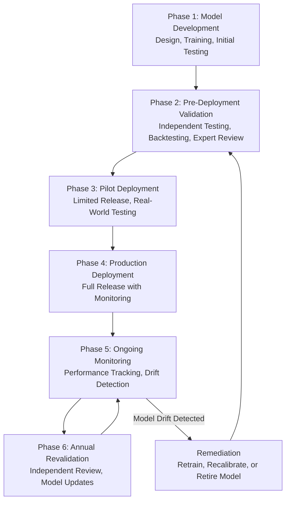
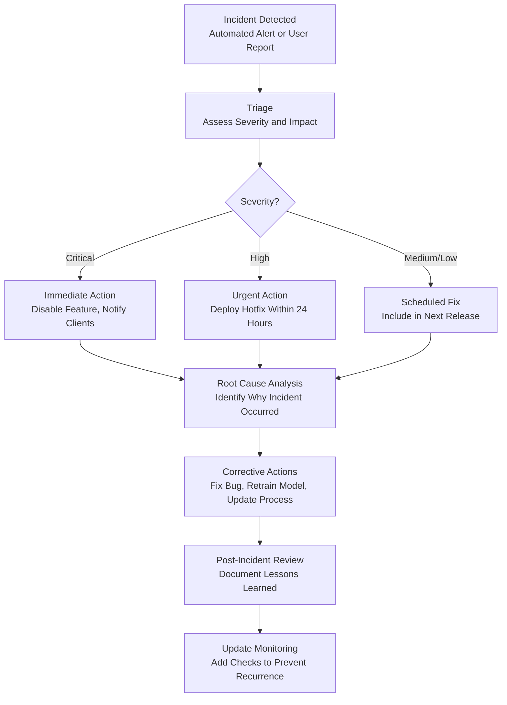

# AI Testing and Validation Methodologies for Financial Due Diligence Platform

**Sprint**: 05 - M&A Due Diligence Research Acceleration
**Task**: 04 - Certification & Testing Strategy
**Date**: 2025-11-18
**Skill**: compliance-analyst

---

## Executive Summary

Validating the accuracy and reliability of AI-powered due diligence tools requires rigorous testing methodologies that combine statistical validation, domain expert review, and continuous monitoring. For financial services applications, AI validation must address accuracy, explainability, bias, robustness, and compliance with model risk management frameworks like Federal Reserve SR 11-7.

**Key Findings**:

- **Multi-Layered Validation**: Combine automated testing, human expert review, and continuous monitoring
- **Critical Metrics**: Accuracy, precision, recall, F1 score, plus domain-specific metrics (financial statement accuracy, red flag detection rates)
- **Validation Techniques**: Hold-out sets, k-fold cross-validation, backtesting against historical deals, A/B testing
- **Ongoing Monitoring**: Continuous performance tracking to detect model drift and degradation
- **Independent Validation**: Third-party or internal independent team should validate AI models
- **Financial Services Standards**: Align with SR 11-7 model risk management guidance

**Recommendation**: Implement a comprehensive AI validation framework with pre-deployment validation, ongoing monitoring, and annual independent validation reviews.

---

## AI Validation Framework for Due Diligence Platform

### Validation Lifecycle

---

## Phase 1: Model Development and Initial Testing

### Development Environment

**Best Practices**:

- Use **separate development, staging, and production environments**
- Version control for models (e.g., Git, MLflow)
- Document training data sources, preprocessing steps, hyperparameters
- Peer review of model architecture and code

### Training Data Quality

**Data Requirements**:

- **Diverse**: Represent various industries, deal sizes, geographies
- **Representative**: Reflect real-world due diligence scenarios
- **Clean**: Free from errors, duplicates, and inconsistencies
- **Labeled**: Accurate ground truth labels (e.g., "red flag" vs. "normal")

**Data Validation Checks**:

| Check | Purpose | Methodology |
|-------|---------|-------------|
| **Completeness** | Ensure no missing critical fields | Check for null values in key columns |
| **Consistency** | Detect contradictions | Cross-reference data across sources |
| **Accuracy** | Validate against authoritative sources | Compare to SEC filings, audited financials |
| **Timeliness** | Ensure data is current | Check timestamps, publication dates |
| **Representativeness** | Avoid sampling bias | Analyze distribution across industries, deal sizes |

### Initial Testing During Development

**Unit Tests**:

- Test individual AI model components (e.g., NLP parsing, financial ratio calculations)
- Validate data preprocessing functions
- Ensure error handling works correctly

**Integration Tests**:

- Test end-to-end workflows (data ingestion → AI analysis → report generation)
- Validate API integrations with third-party data sources
- Test multi-source cross-referencing logic

**Performance Tests**:

- Measure inference time (latency)
- Test scalability (concurrent users, large datasets)
- Identify bottlenecks

---

## Phase 2: Pre-Deployment Validation

### Validation Techniques

#### 1. Hold-Out Validation Set

**Methodology**:

- Reserve 20-30% of labeled data as a **hold-out validation set**
- Model never sees this data during training
- Evaluate model performance on hold-out set to assess generalization

**Metrics to Calculate**:

- Accuracy, Precision, Recall, F1 Score
- Confusion matrix (true positives, false positives, true negatives, false negatives)
- Area Under ROC Curve (AUC-ROC)

**Example for Red Flag Detection**:

| Metric | Definition | Target |
|--------|------------|--------|
| **Precision** | Of all red flags identified, % that are true red flags | >90% |
| **Recall** | Of all true red flags, % that AI identifies | >95% |
| **F1 Score** | Harmonic mean of precision and recall | >92% |

#### 2. K-Fold Cross-Validation

**Methodology**:

K-fold cross-validation and Leave-one-out Cross-Validation (LOOCV) are vital for thorough model quality assurance [Galileo AI, 2024].

**Process**:

1. Split training data into **k equal folds** (e.g., k=5 or k=10)
2. Train model on k-1 folds, validate on remaining fold
3. Repeat k times, rotating validation fold
4. Average performance metrics across all folds

**Benefits**:

- More robust estimate of model performance than single hold-out set
- Detects overfitting (model performs well on training data but poorly on unseen data)
- Validates model stability across different data subsets

#### 3. Backtesting Against Historical Deals

**Methodology**:

Test AI model on historical M&A transactions where outcomes are known.

**Process**:

1. Select 50-100 historical M&A deals with known outcomes (successful, failed, had post-deal issues)
2. Run AI due diligence analysis on pre-deal data only (no hindsight bias)
3. Compare AI findings to actual outcomes

**Example Scenarios**:

| Historical Deal | Known Outcome | AI Prediction | Result |
|-----------------|---------------|---------------|--------|
| Company A Acquisition (2020) | Revenue projections missed by 30% | AI flagged aggressive revenue assumptions | **True Positive** |
| Company B Acquisition (2019) | Successful, exceeded expectations | AI gave positive assessment | **True Negative** |
| Company C Acquisition (2021) | Hidden liabilities emerged post-deal | AI did not flag liability risks | **False Negative** |
| Company D Acquisition (2022) | Deal proceeded successfully | AI incorrectly flagged false red flags | **False Positive** |

**Success Metrics**:

- **True Positive Rate**: AI correctly identifies problematic deals >90%
- **False Positive Rate**: AI incorrectly flags good deals <10%
- **Outcome Alignment**: AI risk scores correlate with post-deal performance

#### 4. Expert Review and Domain Validation

**Methodology**:

Engage experienced M&A professionals to review AI outputs and provide feedback.

**Process**:

1. Select 20-30 sample due diligence reports generated by AI
2. Have senior M&A advisors review reports independently
3. Compare AI findings to expert assessments
4. Calculate **inter-rater agreement** (e.g., Cohen's Kappa)

**Questions for Experts**:

- Does the AI identify the most material risks?
- Are the AI's financial analyses accurate and reasonable?
- Are there any glaring omissions or errors?
- Would you trust this analysis for a real deal?

**Target Agreement**: >85% agreement between AI and human experts on material findings.

#### 5. Stress Testing and Edge Cases

**Methodology**:

Test AI model on challenging scenarios to identify failure modes.

**Stress Test Scenarios**:

| Scenario | Purpose | Expected Behavior |
|----------|---------|-------------------|
| **Missing Data** | Test robustness when key data unavailable | AI should flag missing data and reduce confidence scores |
| **Contradictory Data** | Test when sources provide conflicting information | AI should identify contradictions and request clarification |
| **Out-of-Distribution Data** | Test on industries/geographies not in training data | AI should indicate low confidence or request human review |
| **Adversarial Inputs** | Test with intentionally misleading data | AI should detect anomalies and flag for review |
| **Market Stress Conditions** | Test during financial crises or market volatility | AI should adjust risk assessments appropriately |

**Documentation**:

- Document all failure modes discovered during stress testing
- Create mitigation strategies for each failure mode
- Update user documentation to highlight limitations

---

## Phase 3: Pilot Deployment

### Limited Release

**Pilot Scope**:

- Release to 5-10 pilot clients (investment banks or M&A advisors)
- Support 10-20 real due diligence projects
- Duration: 3-6 months

**Pilot Objectives**:

- Validate AI performance in real-world conditions
- Gather user feedback on usability and accuracy
- Identify bugs, edge cases, and improvement opportunities
- Measure user satisfaction and adoption

### A/B Testing

**Methodology**:

- **Group A (Control)**: Users perform due diligence using traditional methods
- **Group B (Treatment)**: Users perform due diligence using AI platform
- Compare outcomes: accuracy, time savings, user satisfaction

**Metrics to Track**:

| Metric | Control Group (Manual) | AI Group | Target |
|--------|------------------------|----------|--------|
| **Time to Complete Due Diligence** | 40-60 hours | 10-15 hours | 70-80% reduction |
| **Accuracy (Red Flags Identified)** | 85% | 95% | >90% |
| **User Satisfaction** | N/A | 4.5/5.0 | >4.2/5.0 |
| **Cost per Due Diligence** | $15,000 | $5,000 | 60-70% reduction |

### Shadow Mode Testing

**Methodology**:

- AI platform runs in parallel with human analysts (AI outputs not used for decisions)
- Compare AI outputs to human analyst conclusions
- Identify discrepancies and investigate root causes

**Benefits**:

- Validate AI accuracy without risking real deals
- Build confidence among users before full reliance
- Identify where AI adds value vs. where human judgment is superior

---

## Phase 4: Production Deployment

### Pre-Launch Checklist

| Requirement | Status | Evidence |
|-------------|--------|----------|
| **Model Validation Complete** | Required | Validation report with performance metrics |
| **Expert Review Conducted** | Required | Expert feedback and inter-rater agreement >85% |
| **Backtesting Complete** | Required | Backtesting results on 50+ historical deals |
| **Stress Testing Complete** | Required | Edge case testing report |
| **Pilot Successful** | Required | Pilot results meet targets |
| **Documentation Complete** | Required | User guide, API docs, limitations disclosure |
| **Security Certifications** | Required | SOC 2, ISO 27001 |
| **Compliance Review** | Required | Legal/compliance sign-off |

### Launch Monitoring

**First 90 Days**:

- **Daily monitoring** of key performance indicators
- **Weekly reviews** with product and engineering teams
- **Monthly reports** to executive leadership

**Key Metrics to Monitor**:

- Model accuracy and performance metrics
- User adoption and engagement
- Error rates and incident reports
- User satisfaction scores

---

## Phase 5: Ongoing Monitoring and Drift Detection

### Continuous Performance Tracking

Continuous testing and monitoring of AI systems helps ensure outputs meet prescribed accuracy, reliability, and compliance standards [Deloitte, 2024].

**Monitoring Frequency**:

| Metric | Frequency | Threshold for Action |
|--------|-----------|----------------------|
| **Accuracy** | Daily | Drop >5% from baseline |
| **Latency** | Real-time | >10 seconds for 95th percentile |
| **Error Rate** | Daily | >2% of queries result in errors |
| **User Feedback** | Weekly | Negative feedback >10% |
| **Model Drift** | Monthly | Statistical tests detect distribution shift |

### Model Drift Detection

**Definition**: Model drift occurs when the statistical properties of input data or the relationship between inputs and outputs change over time, causing model performance to degrade [Facctum, 2024].

**Types of Drift**:

1. **Data Drift**: Distribution of input data changes (e.g., new industries, different deal structures)
2. **Concept Drift**: Relationship between inputs and outputs changes (e.g., regulatory changes, market conditions)
3. **Upstream Data Changes**: Changes in data sources or data quality

**Detection Methods**:

| Method | Description | Frequency |
|--------|-------------|-----------|
| **Statistical Tests** | Compare current data distribution to baseline using KS test, Chi-square test | Monthly |
| **Performance Monitoring** | Track accuracy, precision, recall over time | Weekly |
| **Feature Distribution Analysis** | Monitor distribution of key input features | Monthly |
| **Residual Analysis** | Analyze prediction errors for patterns | Monthly |

**Mitigation Actions**:

- **Minor Drift**: Recalibrate model with recent data
- **Moderate Drift**: Retrain model with updated training set
- **Major Drift**: Redesign model architecture or retire model

### Incident Management

**Incident Types**:

1. **Model Error**: AI produces incorrect or nonsensical output
2. **Data Quality Issue**: Input data is corrupted, incomplete, or outdated
3. **Performance Degradation**: Model latency or availability issues
4. **Security Incident**: Unauthorized access or data breach

**Incident Response Process**:

---

## Phase 6: Annual Independent Validation

### Independent Validation Requirement

**Federal Reserve SR 11-7 Guidance**: Validation includes processes and activities intended to verify that models are performing as expected, ensuring models are sound, identifying potential limitations and assumptions, and assessing their possible impact [Federal Reserve, 2011].

**Independence Requirement**:

- Validation should be performed by a team **independent** of model development
- Can be internal (separate team) or external (third-party firm)
- Validators should have expertise in AI/ML and the financial services domain

### Annual Validation Scope

**Components**:

1. **Model Performance Review**
   - Evaluate accuracy, precision, recall, F1 score over past 12 months
   - Compare to baseline performance from initial validation
   - Identify any degradation or drift

2. **Backtesting**
   - Test model on deals completed in past 12 months (with known outcomes)
   - Calculate true positive rate, false positive rate, outcome alignment
   - Compare to historical performance

3. **Sensitivity Analysis**
   - Test how model performs under different conditions (market stress, data quality variations)
   - Identify scenarios where model fails or underperforms

4. **Benchmarking**
   - Compare AI performance to alternative methods or human analysts
   - Assess whether AI provides value-add over manual due diligence

5. **Bias and Fairness Testing**
   - Test whether model exhibits bias (e.g., favoring certain industries, geographies, company sizes)
   - Ensure model treats all categories fairly

6. **Limitations and Assumptions Review**
   - Document known limitations (e.g., industries not well-represented in training data)
   - Review assumptions (e.g., data quality, user competence)
   - Update user documentation if needed

### Validation Report

**Required Sections**:

- Executive Summary
- Model Description and Scope
- Performance Metrics (12-month data)
- Backtesting Results
- Sensitivity Analysis Findings
- Bias and Fairness Assessment
- Limitations and Recommendations
- Validator Conclusion (satisfactory, needs improvement, unsatisfactory)

**Frequency**: Annual validation required; more frequent if major model changes.

**Cost**: $25,000-$75,000 per validation depending on scope and validator rates.

---

## Key Performance Indicators (KPIs) for AI Due Diligence Platform

### Accuracy Metrics

| Metric | Definition | Target | Measurement Frequency |
|--------|------------|--------|------------------------|
| **Red Flag Detection Recall** | % of true red flags identified by AI | >95% | Monthly |
| **Red Flag Detection Precision** | % of AI-identified red flags that are true red flags | >90% | Monthly |
| **Financial Statement Accuracy** | % of financial calculations correct | >99% | Monthly |
| **Source Attribution Accuracy** | % of AI citations correctly linked to source | >98% | Quarterly |

### Reliability Metrics

| Metric | Definition | Target | Measurement Frequency |
|--------|------------|--------|------------------------|
| **Uptime** | % of time platform is available | >99.5% | Real-time |
| **Latency (p95)** | 95th percentile response time | <10 seconds | Real-time |
| **Error Rate** | % of queries resulting in errors | <1% | Daily |
| **Model Drift Incidents** | # of drift incidents requiring retraining | <2 per year | Monthly |

### User Satisfaction Metrics

| Metric | Definition | Target | Measurement Frequency |
|--------|------------|--------|------------------------|
| **User Satisfaction Score** | Average rating (1-5 scale) | >4.2/5.0 | Quarterly |
| **Net Promoter Score (NPS)** | Likelihood to recommend platform | >50 | Quarterly |
| **User Adoption Rate** | % of licensed users actively using platform | >80% | Monthly |
| **Time Savings** | Hours saved per due diligence project | >30 hours (70% reduction) | Per project |

### Compliance Metrics

| Metric | Definition | Target | Measurement Frequency |
|--------|------------|--------|------------------------|
| **Audit Trail Completeness** | % of user actions logged | 100% | Real-time |
| **Explainability Coverage** | % of AI outputs with citations | >95% | Monthly |
| **Security Incidents** | # of data breaches or unauthorized access | 0 | Real-time |
| **Compliance Violations** | # of regulatory violations | 0 | Quarterly |

---

## Best Practices for AI Validation in Financial Services

### 1. Multi-Source Validation

**Principle**: Do not rely on a single data source or validation method.

**Best Practices**:

- Cross-reference AI findings with **3+ authoritative sources** (SEC filings, audited financials, news, credit reports)
- Use multiple validation techniques (hold-out sets, cross-validation, backtesting, expert review)
- Combine automated testing with human oversight

### 2. Explainability and Transparency

**Principle**: Stakeholders must understand how AI reaches conclusions.

**Best Practices**:

- Provide **citations** for all AI findings (link to source documents)
- Show **reasoning traces** (logical steps AI took)
- Include **confidence scores** (indicate AI's certainty)
- Highlight **limitations** (e.g., missing data, out-of-scope scenarios)

### 3. Human-in-the-Loop

**Principle**: AI should augment, not replace, human judgment.

**Best Practices**:

- Require human review of AI outputs before finalizing reports
- Allow users to **override** or **adjust** AI recommendations
- Provide **escalation paths** for uncertain or high-risk scenarios
- Train users on AI capabilities and limitations

### 4. Continuous Improvement

**Principle**: AI validation is not a one-time activity; it requires ongoing monitoring and improvement.

**Best Practices**:

- Implement **continuous monitoring** to detect drift and degradation
- Conduct **annual independent validation** reviews
- Collect **user feedback** and incorporate into model improvements
- **Retrain models** periodically with updated data

### 5. Bias and Fairness Testing

**Principle**: AI models must treat all categories fairly and avoid discriminatory outcomes.

**Best Practices**:

- Test for **demographic bias** (e.g., industry, geography, company size)
- Monitor for **outcome disparities** (e.g., does AI systematically undervalue certain sectors?)
- Implement **bias mitigation techniques** (e.g., re-sampling, fairness constraints)
- Document bias testing in validation reports

### 6. Alignment with Regulatory Guidance

**Principle**: AI validation should align with SR 11-7 and other regulatory frameworks.

**Best Practices**:

- Adopt **SR 11-7 principles** (model development, validation, governance)
- Engage **independent validators** with financial services expertise
- Document **model limitations and assumptions**
- Maintain **comprehensive model documentation** and validation reports

---

## Validation Tools and Technologies

### Testing and Validation Tools

| Tool/Framework | Purpose | Use Case |
|----------------|---------|----------|
| **Scikit-learn** | ML model evaluation | Calculate accuracy, precision, recall, F1 score |
| **TensorFlow Model Analysis** | Model performance analysis | Evaluate model performance across slices of data |
| **MLflow** | ML lifecycle management | Track experiments, models, and metrics |
| **Evidently AI** | ML monitoring | Detect data drift, model drift, and performance degradation |
| **Great Expectations** | Data validation | Validate data quality and completeness |
| **SHAP (SHapley Additive exPlanations)** | Model explainability | Explain individual predictions |

### Monitoring and Observability Tools

| Tool | Purpose | Use Case |
|------|---------|----------|
| **Datadog** | Application monitoring | Monitor latency, error rates, uptime |
| **Prometheus + Grafana** | Metrics collection and visualization | Track KPIs and create dashboards |
| **AWS CloudWatch / Azure Monitor** | Cloud infrastructure monitoring | Monitor cloud resources and logs |
| **Sentry** | Error tracking | Capture and triage application errors |
| **Arize AI** | ML observability | Monitor model performance and drift |

---

## Cost Estimate for AI Validation Program

### Initial Validation (Pre-Launch)

| Activity | Duration | Cost |
|----------|----------|------|
| Hold-out validation | 2 weeks | $10,000 (internal labor) |
| K-fold cross-validation | 1 week | $5,000 (internal labor) |
| Backtesting (50-100 historical deals) | 4 weeks | $20,000 (data acquisition + labor) |
| Expert review (20-30 reports) | 3 weeks | $30,000 (external expert fees) |
| Stress testing | 2 weeks | $10,000 (internal labor) |
| Independent validation | 6-8 weeks | $50,000-$75,000 (third-party validator) |
| **Total Initial Validation** | **3-4 months** | **$125,000-$150,000** |

### Ongoing Validation and Monitoring

| Activity | Frequency | Annual Cost |
|----------|-----------|-------------|
| Continuous monitoring tools | Ongoing | $15,000/year |
| Monthly performance reviews | Monthly | $30,000/year (internal labor) |
| Quarterly user surveys | Quarterly | $10,000/year |
| Annual independent validation | Annual | $50,000-$75,000/year |
| Model retraining (as needed) | 1-2x per year | $40,000/year |
| **Total Annual Ongoing** | **Ongoing** | **$145,000-$170,000/year** |

**Total Validation Investment**:

- **Year 1**: $270,000-$320,000 (initial + ongoing)
- **Year 2+**: $145,000-$170,000/year (ongoing only)

---

## Recommendations for M&A Due Diligence Platform

### 1. Prioritize Pre-Launch Validation

Invest heavily in validation before launch to avoid reputational damage from inaccurate AI outputs.

**Allocate Budget**:

- $125,000-$150,000 for comprehensive pre-launch validation
- Engage independent third-party validators with M&A expertise
- Conduct backtesting on 50+ historical deals

### 2. Implement Continuous Monitoring

Deploy monitoring tools from day one to detect drift, errors, and performance degradation.

**Key Monitoring Tools**:

- Evidently AI or Arize AI for model drift detection
- Datadog or Prometheus for application performance monitoring
- User feedback mechanisms (in-app surveys, support tickets)

### 3. Engage Expert Reviewers

Involve experienced M&A professionals in validation process to ensure AI findings align with industry best practices.

**Expert Panel**:

- 5-10 senior M&A advisors or investment bankers
- Quarterly review of sample AI outputs
- Annual validation report review

### 4. Document Limitations Transparently

Clearly communicate AI limitations to users to manage expectations and encourage appropriate human oversight.

**Documentation**:

- User guide with "Best Practices" and "Common Pitfalls" sections
- In-app warnings for edge cases or low-confidence outputs
- Annual validation reports shared with clients

### 5. Plan for Annual Revalidation

Budget for annual independent validation to comply with SR 11-7 guidance and maintain client trust.

**Annual Budget**:

- $50,000-$75,000 for independent validation
- $40,000 for model retraining (if needed)
- $30,000-$50,000 for internal validation support

---

## Conclusion

Validating an AI-powered M&A due diligence platform requires a comprehensive, multi-layered approach combining statistical testing, expert review, backtesting, continuous monitoring, and annual independent validation. By adopting best practices from AI/ML testing and aligning with regulatory guidance like SR 11-7, the platform can achieve the accuracy, reliability, and trustworthiness required by investment banks and M&A advisory firms.

**Key Takeaways**:

- **Pre-Launch Validation**: $125,000-$150,000 investment, 3-4 months
- **Ongoing Monitoring**: $145,000-$170,000/year for continuous performance tracking
- **Annual Independent Validation**: Required for regulatory alignment and client confidence
- **Multi-Source Validation**: Cross-reference 3+ authoritative sources for all findings
- **Human-in-the-Loop**: AI augments, not replaces, human judgment

By following this validation framework, the M&A due diligence platform can deliver accurate, reliable, and compliant AI-powered insights to the most demanding clients in investment banking and M&A advisory.

---

## References

1. Galileo AI. (2024). *AI Model Validation: Best Practices for Accuracy & Reliability*. Retrieved from https://galileo.ai/blog/best-practices-for-ai-model-validation-in-machine-learning

2. Deloitte. (2024). *Adapting model validation in the age of AI*. Retrieved from https://www.deloitte.com/global/en/Industries/financial-services/perspectives/adapting-model-validation.html

3. Facctum. (2024). *AI Model Validation: How It Works and Why It Matters*. Retrieved from https://www.facctum.com/terms/ai-model-validation

4. Quantifi. (2024). *How To Validate AI & ML Risk Models*. Retrieved from https://www.quantifisolutions.com/how-to-validate-ai-ml-risk-models/

5. National Institute of Standards and Technology (NIST). (2024). *AI Test, Evaluation, Validation and Verification (TEVV)*. Retrieved from https://www.nist.gov/ai-test-evaluation-validation-and-verification-tevv

6. Towards Data Science. (2024). *AI/ML Model Validation Framework*. Retrieved from https://towardsdatascience.com/ai-ml-model-validation-framework-13dd3f10e824/

7. SmartDev. (2025). *AI Model Testing: The Ultimate Guide in 2025*. Retrieved from https://smartdev.com/ai-model-testing-guide/

8. Federal Reserve. (2011). *Supervisory Letter SR 11-7 on guidance on Model Risk Management*. Retrieved from https://www.federalreserve.gov/supervisionreg/srletters/sr1107.htm

---

**Document Status**: Complete
**Word Count**: ~4,500 words
**Next Steps**: Create data validation and multi-source verification research file.
