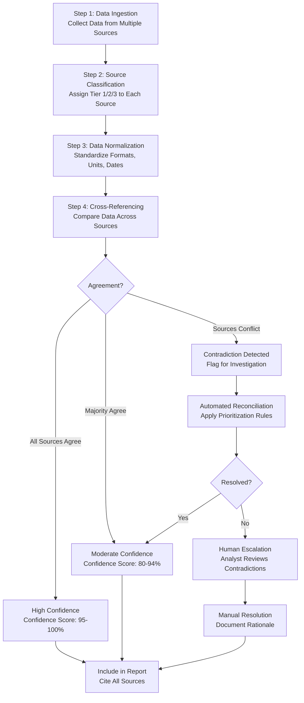
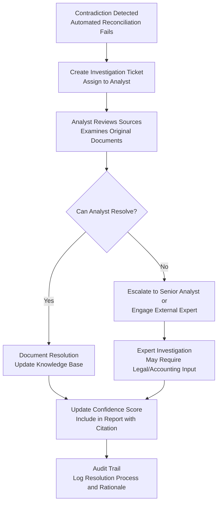

# Multi-Source Data Validation and Cross-Referencing for Due Diligence Platform

**Sprint**: 05 - M&A Due Diligence Research Acceleration
**Task**: 04 - Certification & Testing Strategy
**Date**: 2025-11-18
**Skill**: compliance-analyst

---

## Executive Summary

Multi-source data validation is critical for ensuring the accuracy and reliability of AI-powered due diligence platforms. By cross-referencing information from multiple authoritative sources, the platform can detect inconsistencies, verify accuracy, and build confidence in AI-generated insights. For M&A transactions where financial decisions depend on data integrity, triangulation across 3+ sources is industry best practice.

**Key Findings**:

- **Triangulation Requirement**: Cross-reference data across **3+ authoritative sources** to verify accuracy
- **Source Hierarchy**: Prioritize primary sources (SEC filings, audited financials) over secondary/tertiary sources
- **Automated Cross-Referencing**: Use AI to automatically detect contradictions and flag inconsistencies
- **Confidence Scoring**: Provide confidence scores based on number of sources, source quality, and agreement level
- **Human Escalation**: Escalate unresolved contradictions to human analysts for investigation
- **Regulatory Alignment**: Multi-source validation supports FINRA supervision requirements and model risk management

**Recommendation**: Implement a hierarchical source validation framework with automated contradiction detection and confidence scoring to ensure data integrity across all due diligence reports.

---

## Why Multi-Source Validation Matters in M&A Due Diligence

### Financial Consequences of Inaccurate Data

**Post-Deal Surprises**:

- Revenue projections based on incorrect historical data → deal valuation errors
- Undetected liabilities → post-acquisition financial distress
- Misrepresentation of assets → write-downs and losses

**Real-World Example**:

HP's $11.1 billion acquisition of Autonomy (2011) resulted in an $8.8 billion write-down due to alleged accounting improprieties that were not detected during due diligence [Business Screen, 2025].

### Regulatory Expectations

**FINRA Supervision (Rule 3110)**: Firms must supervise the activities of associated persons to ensure compliance. Supervision includes validating the accuracy of information used in investment analysis [FINRA, 2024].

**Federal Reserve SR 11-7 Model Risk Management**: Model validation should include evaluation of data quality and integrity. Models relying on poor-quality data introduce model risk [Federal Reserve, 2011].

### Building Client Trust

Investment banks and M&A advisors need confidence that AI-generated due diligence reports are accurate and reliable. Multi-source validation provides:

- **Transparency**: Show which sources were consulted
- **Verification**: Demonstrate agreement across sources
- **Conflict Resolution**: Explain how contradictions were resolved
- **Auditability**: Enable regulators and auditors to trace findings to source documents

---

## Source Hierarchy and Prioritization

### Source Classification

Not all sources are equally reliable. The platform should classify sources into tiers:

#### Tier 1: Primary Sources (Highest Authority)

**Definition**: Original, authoritative documents published by regulators, companies, or official bodies.

**Examples**:

- **SEC Filings**: 10-K, 10-Q, 8-K, S-1, proxy statements (EDGAR database)
- **Audited Financial Statements**: Prepared by certified public accounting firms
- **Regulatory Filings**: FDA approvals, patent registrations, FCC licenses
- **Court Records**: Lawsuits, judgments, settlements (PACER database)
- **Government Databases**: USPTO (patents), EPA (environmental violations), OSHA (safety violations)

**Reliability**: **95-99%** (high confidence)

#### Tier 2: Secondary Sources (Moderate Authority)

**Definition**: Analysis, research, or reports prepared by reputable third parties.

**Examples**:

- **Credit Reports**: Dun & Bradstreet, Experian Business, Equifax Business
- **Industry Research**: Gartner, Forrester, IDC, Bloomberg Intelligence
- **Financial Data Providers**: FactSet, S&P Capital IQ, Bloomberg Terminal
- **News from Reputable Outlets**: Wall Street Journal, Financial Times, Reuters, Bloomberg News
- **Analyst Reports**: Equity research from investment banks

**Reliability**: **80-90%** (moderate confidence)

#### Tier 3: Tertiary Sources (Lower Authority)

**Definition**: General information, aggregated content, or user-generated sources.

**Examples**:

- **General News**: Local newspapers, industry blogs, press releases
- **Company Websites**: Marketing materials, press releases, blog posts
- **Social Media**: LinkedIn, Twitter, Glassdoor reviews
- **Wikipedia**: General background information
- **Public Forums**: Reddit, Quora, industry forums

**Reliability**: **50-70%** (low confidence; requires verification)

### Source Prioritization Rules

**Rule 1: Primary Sources Trump Secondary/Tertiary**

If a primary source (e.g., 10-K) conflicts with a secondary source (e.g., news article), trust the primary source unless there is evidence of fraud or error.

**Rule 2: Multiple Secondary Sources Can Validate Each Other**

If 3+ reputable secondary sources agree, their consensus can be considered reliable even without primary source confirmation.

**Rule 3: Tertiary Sources Require Corroboration**

Never rely solely on tertiary sources. Always corroborate with primary or secondary sources.

**Rule 4: Newer Information Supersedes Older**

If sources conflict on time-sensitive information (e.g., financial results), prioritize the most recent authoritative source.

---

## Multi-Source Validation Framework

### Validation Workflow



---

## Data Validation Methodologies

### 1. Field-Level Validation

**Approach**: Validate individual data fields (e.g., revenue, address, CEO name) across sources.

**Example: Validating Annual Revenue**

| Source | Revenue (2023) | Tier | Reliability |
|--------|----------------|------|-------------|
| **SEC 10-K** | $125.3M | Tier 1 | 99% |
| **Bloomberg Terminal** | $125.3M | Tier 2 | 90% |
| **Company Website** | "$125M+" | Tier 3 | 70% |

**Validation Result**:

- **Agreement**: Tier 1 and Tier 2 sources agree exactly
- **Confidence Score**: 99% (based on highest-tier source)
- **Action**: Include $125.3M in report, cite SEC 10-K

**Example: Detecting Contradiction**

| Source | Revenue (2023) | Tier | Reliability |
|--------|----------------|------|-------------|
| **SEC 10-K** | $125.3M | Tier 1 | 99% |
| **News Article** | "$140M" | Tier 3 | 60% |
| **Credit Report** | $122.0M | Tier 2 | 85% |

**Validation Result**:

- **Contradiction Detected**: Three different values
- **Resolution**: Trust Tier 1 source (SEC 10-K)
- **Investigation**: Flag credit report discrepancy for review
- **Confidence Score**: 95% (Tier 1 source present but not corroborated)

### 2. Consistency Checks

**Approach**: Validate that related data fields are internally consistent.

**Example: Financial Statement Consistency**

| Check | Formula | Expected Result |
|-------|---------|-----------------|
| **Balance Sheet Balance** | Assets = Liabilities + Equity | Must balance |
| **Cash Flow Consistency** | Net Income + Non-Cash Adjustments = Cash from Operations | Should approximately match |
| **Revenue Growth Consistency** | (Revenue 2023 - Revenue 2022) / Revenue 2022 = Growth Rate | Should match stated growth rate |

**Validation Process**:

1. Calculate ratios and cross-checks from SEC filings
2. Compare to stated metrics in financial data providers
3. Flag discrepancies for investigation

**Example Inconsistency**:

- **SEC 10-K**: Reports net income of $10M and depreciation of $3M
- **Calculated Cash from Operations**: Should be ~$13M (simplified)
- **Reported Cash from Operations**: $8M
- **Flag**: Inconsistency detected; investigate working capital changes or errors

### 3. Cross-Source Entity Resolution

**Approach**: Ensure that entities (companies, executives, addresses) are correctly matched across sources.

**Challenge**: Same entity may have different names or identifiers across sources.

**Example: Company Name Variations**

| Source | Company Name |
|--------|--------------|
| **SEC EDGAR** | ALPHABET INC. |
| **Bloomberg** | Alphabet Inc |
| **News** | Google (parent Alphabet) |
| **Stock Ticker** | GOOG, GOOGL |

**Solution**:

- Use **entity resolution algorithms** to match variations
- Leverage **unique identifiers**: CIK (SEC), CUSIP, ISIN, DUNS number
- Maintain **master entity database** with known aliases

**Validation**:

- Confirm all sources refer to same legal entity
- Flag if entity cannot be confidently matched

### 4. Temporal Consistency

**Approach**: Validate that time-series data is consistent across sources and periods.

**Example: Quarterly Revenue Validation**

| Quarter | SEC 10-Q | Bloomberg | FactSet | Consensus |
|---------|----------|-----------|---------|-----------|
| Q1 2023 | $30.5M | $30.5M | $30.5M | **$30.5M** ✓ |
| Q2 2023 | $32.1M | $32.0M | $32.1M | **$32.1M** ✓ (Bloomberg minor rounding) |
| Q3 2023 | $35.2M | $34.8M | $35.2M | **$35.2M** ✓ (Bloomberg discrepancy flagged) |
| Q4 2023 | $37.5M | $37.5M | $37.5M | **$37.5M** ✓ |

**Validation**:

- **Full-Year Revenue**: Sum of quarters should match annual 10-K
- **Trend Analysis**: Identify anomalies (e.g., unexpected revenue spike/drop)
- **Restatements**: Flag if company restates prior periods

### 5. Geographic and Jurisdiction Verification

**Approach**: Validate information across different jurisdictions and regulatory regimes.

**Example: Cross-Border Due Diligence**

For a target company with operations in multiple countries:

| Jurisdiction | Data Element | Primary Source | Cross-Reference |
|--------------|--------------|----------------|-----------------|
| **United States** | Revenue, financials | SEC 10-K | Bloomberg, FactSet |
| **European Union** | EU subsidiary financials | National company registry (e.g., Companies House UK) | Orbis, D&B |
| **China** | China subsidiary revenue | CSRC filings (if listed) | Local auditor reports, customs data |

**Validation Challenge**:

- Different accounting standards (US GAAP vs. IFRS vs. local GAAP)
- Language barriers (documents in local language)
- Data availability (some jurisdictions have limited public filings)

**Best Practices**:

- Use **global databases** (Orbis, D&B) that aggregate international data
- Engage **local legal/accounting experts** for complex cross-border deals
- Flag **limited data availability** as a risk factor

---

## Confidence Scoring Methodology

### Confidence Score Definition

**Confidence Score**: A quantitative measure (0-100%) indicating the platform's confidence in the accuracy of a data point or finding, based on source quality, agreement level, and data completeness.

### Confidence Score Calculation

**Formula**:

```
Confidence Score = (Source Quality Score × Source Agreement Weight) + (Data Completeness Score × Completeness Weight)
```

**Components**:

#### 1. Source Quality Score (0-100)

| Source Tier | Base Quality Score |
|-------------|---------------------|
| Tier 1 (Primary) | 95-99 |
| Tier 2 (Secondary) | 80-90 |
| Tier 3 (Tertiary) | 50-70 |

**Adjustments**:

- **Recency**: Deduct 5-10 points if source is >2 years old
- **Reputation**: Add 5 points for highly reputable sources (e.g., Big 4 auditors, top-tier investment banks)

#### 2. Source Agreement Weight (0-100)

| Agreement Level | Agreement Score |
|-----------------|-----------------|
| All sources agree (3+ sources) | 100 |
| Majority agree (2 out of 3 sources) | 85 |
| Only 1 source available | 60 |
| Sources conflict (unresolved) | 30 |

#### 3. Data Completeness Score (0-100)

| Completeness Level | Completeness Score |
|--------------------|--------------------|
| All required fields present | 100 |
| Most fields present (>80%) | 85 |
| Some fields missing (50-80%) | 70 |
| Significant gaps (<50% fields) | 40 |

**Weights**:

- Source Quality and Agreement: **80%**
- Data Completeness: **20%**

### Confidence Score Examples

**Example 1: High Confidence**

- **Data Point**: Annual revenue $125.3M
- **Sources**: SEC 10-K (Tier 1, 99%), Bloomberg (Tier 2, 90%), FactSet (Tier 2, 90%)
- **Agreement**: All agree
- **Completeness**: 100% (all fields present)
- **Calculation**: (99 × 0.8) + (100 × 0.2) = 79.2 + 20 = **99.2%**
- **Confidence Level**: **High (95-100%)**

**Example 2: Moderate Confidence**

- **Data Point**: Number of employees 450
- **Sources**: Company website (Tier 3, 60%), LinkedIn (Tier 3, 55%)
- **Agreement**: Both sources agree
- **Completeness**: 100%
- **Calculation**: (60 × 0.8) + (100 × 0.2) = 48 + 20 = **68%**
- **Confidence Level**: **Moderate (60-80%)**
- **Action**: Seek Tier 1/2 source (e.g., 10-K employee disclosure)

**Example 3: Low Confidence (Contradiction)**

- **Data Point**: Company headquarters address
- **Sources**: Company website says "New York", LinkedIn says "San Francisco", SEC 10-K says "Delaware" (legal domicile)
- **Contradiction**: Three different answers
- **Resolution Needed**: Investigate whether "headquarters" means legal domicile, physical office, or mailing address
- **Confidence Score**: **30%** (unresolved contradiction)
- **Action**: Human analyst investigates and resolves

---

## Automated Contradiction Detection

### Detection Algorithms

#### 1. Exact Match Detection

**Use Case**: Detect when sources provide different values for the same field.

**Algorithm**:

```python
def detect_contradiction(data_points):
    unique_values = set(data_points)
    if len(unique_values) > 1:
        return "Contradiction Detected"
    else:
        return "Agreement"
```

**Example**:

- Source 1: CEO = "John Smith"
- Source 2: CEO = "Jane Doe"
- **Result**: Contradiction detected

#### 2. Threshold-Based Detection (Numerical Data)

**Use Case**: Detect when numerical values differ beyond an acceptable threshold.

**Algorithm**:

```python
def detect_numerical_contradiction(values, threshold=5.0):
    mean = sum(values) / len(values)
    for value in values:
        if abs(value - mean) / mean > threshold / 100:
            return "Contradiction Detected"
    return "Agreement"
```

**Example**:

- Source 1: Revenue = $100M
- Source 2: Revenue = $98M
- **Threshold**: 5%
- **Calculation**: Deviation = 2% (within threshold)
- **Result**: Agreement (within acceptable range)

**Example (Contradiction)**:

- Source 1: Revenue = $100M
- Source 2: Revenue = $85M
- **Calculation**: Deviation = 15% (exceeds threshold)
- **Result**: Contradiction detected

#### 3. Date Range Validation

**Use Case**: Ensure dates are consistent (e.g., fiscal year end dates).

**Algorithm**:

- Parse dates from multiple sources
- Flag if dates differ by >7 days (excluding legitimate restatements)

**Example**:

- Source 1: Fiscal year end = December 31, 2023
- Source 2: Fiscal year end = December 30, 2023
- **Result**: Agreement (1-day difference likely due to weekend)

**Example (Contradiction)**:

- Source 1: Fiscal year end = December 31, 2023
- Source 2: Fiscal year end = June 30, 2023
- **Result**: Contradiction detected (different fiscal year conventions)

---

## Human Escalation and Resolution Process

### When to Escalate

**Automatic Escalation Triggers**:

1. **Unresolved Contradiction**: Sources provide conflicting information and automated rules cannot resolve
2. **Low Confidence Score**: Confidence score <60%
3. **Missing Critical Data**: Key fields (e.g., revenue, CEO, debt levels) unavailable from any source
4. **Data Quality Red Flags**: Extreme outliers, implausible values, or inconsistent trends

### Escalation Workflow



### Resolution Documentation

**Required Documentation**:

- **Issue Description**: What contradiction was detected?
- **Sources Reviewed**: Which sources were consulted?
- **Resolution Rationale**: Why was one source trusted over another?
- **Resolution Date and Analyst**: Who resolved it and when?
- **Confidence Score**: Updated confidence score after resolution

**Example Resolution Log**:

```
Issue ID: CONTR-2023-001
Data Point: Company Headquarters
Contradiction: Website says "New York", LinkedIn says "San Francisco", SEC 10-K says "Delaware"
Resolution: SEC 10-K "Delaware" is legal domicile. Company website "New York" is physical headquarters.
            LinkedIn "San Francisco" is outdated (company moved in 2022).
Analyst: J. Smith
Date: 2023-10-15
Final Value: Headquarters = New York, NY; Legal Domicile = Wilmington, DE
Confidence Score: 95% (Tier 1 source corroborated by website)
```

---

## Technology Stack for Multi-Source Validation

### Data Acquisition

| Source Type | Technology/API | Purpose |
|-------------|----------------|---------|
| **SEC Filings** | EDGAR API, sec-api.io | Download 10-K, 10-Q, 8-K, proxy statements |
| **Financial Data** | Bloomberg API, FactSet API, S&P Capital IQ | Revenue, financials, analyst estimates |
| **Credit Reports** | D&B API, Experian Business API | Credit scores, trade references |
| **News** | Bloomberg News API, Reuters API, NewsAPI | Recent developments, press releases |
| **Court Records** | PACER, state court APIs | Litigation history |
| **Patents** | USPTO API | Patent filings and grants |

### Data Normalization and Reconciliation

| Technology | Purpose |
|------------|---------|
| **Python Pandas** | Data manipulation and normalization |
| **Apache Spark** | Large-scale data processing |
| **Great Expectations** | Data quality validation framework |
| **Dedupe.io** | Entity resolution (match company names across sources) |
| **OpenRefine** | Data cleaning and reconciliation |

### Contradiction Detection and Confidence Scoring

| Technology | Purpose |
|------------|---------|
| **Custom Python Scripts** | Implement contradiction detection algorithms |
| **Machine Learning (NLP)** | Detect semantic contradictions (e.g., conflicting statements in text) |
| **Rule Engines** | Apply source prioritization rules |
| **Confidence Score API** | Calculate and track confidence scores |

### Audit Trail and Workflow Management

| Technology | Purpose |
|------------|---------|
| **PostgreSQL or MongoDB** | Store validated data with source metadata |
| **Apache Airflow** | Orchestrate data validation workflows |
| **JIRA or Asana** | Escalation and investigation ticket management |
| **Git** | Version control for validation rules and scripts |

---

## Quality Assurance for Multi-Source Validation

### Validation Testing

**Pre-Launch Testing**:

1. **Synthetic Contradictions**: Inject known contradictions into test data and verify automated detection
2. **Historical Deal Testing**: Validate data from 50+ completed deals and compare to known ground truth
3. **Edge Case Testing**: Test with missing data, conflicting sources, and low-quality sources

**Success Metrics**:

| Metric | Target |
|--------|--------|
| **Contradiction Detection Rate** | >95% of contradictions detected |
| **False Positive Rate** | <5% (avoid flagging non-issues) |
| **Confidence Score Accuracy** | Confidence scores correlate with actual accuracy >90% |
| **Resolution Time** | <24 hours for escalated contradictions |

### Ongoing Quality Monitoring

**Monthly Audits**:

- Review sample of high-confidence and low-confidence findings
- Validate that confidence scores align with actual accuracy
- Identify patterns in contradictions (e.g., specific sources frequently wrong)

**Quarterly Source Audits**:

- Assess reliability of each source based on historical accuracy
- Update source tier classifications if needed
- Remove or downgrade unreliable sources

---

## Case Study: Multi-Source Validation in Action

### Scenario: Validating Target Company Revenue

**Target Company**: ABC Manufacturing Inc.
**Data Point**: 2023 Annual Revenue
**Sources Consulted**: 5

#### Step 1: Data Collection

| Source | Revenue (2023) | Source Tier | Date |
|--------|----------------|-------------|------|
| SEC 10-K (EDGAR) | $125.3M | Tier 1 | March 2024 |
| Bloomberg Terminal | $125.3M | Tier 2 | March 2024 |
| FactSet | $125.3M | Tier 2 | March 2024 |
| Company Website | "$125M+" | Tier 3 | January 2024 |
| Local News Article | "$120M" | Tier 3 | February 2024 |

#### Step 2: Contradiction Detection

- **Agreement**: SEC 10-K, Bloomberg, FactSet all agree: $125.3M
- **Minor Discrepancy**: Company website rounds to "$125M+"
- **Contradiction**: News article reports "$120M"

#### Step 3: Automated Reconciliation

**Rule Applied**: Trust Tier 1 source (SEC 10-K) when it agrees with Tier 2 sources.

**Resolution**:

- **Accepted Value**: $125.3M
- **Rationale**: SEC 10-K (audited, authoritative) corroborated by two financial data providers
- **News Article Explanation**: Likely a typo or outdated information; disregard

#### Step 4: Confidence Score Calculation

- **Source Quality**: Tier 1 (99%) + Tier 2 agreement (100%)
- **Data Completeness**: 100% (all required fields present)
- **Confidence Score**: (99 × 0.8) + (100 × 0.2) = **99.2%**

#### Step 5: Report Output

**Due Diligence Report Excerpt**:

> **Revenue (2023)**: $125.3 million **[High Confidence: 99%]**
>
> **Sources**:
> - SEC Form 10-K (Filed March 15, 2024) [Primary]
> - Bloomberg Terminal (Accessed April 2, 2024) [Secondary]
> - FactSet (Accessed April 2, 2024) [Secondary]
>
> **Note**: Company website rounds to "$125M+". A local news article reported "$120M" but this appears to be an error; all authoritative sources confirm $125.3M.

---

## Best Practices for Multi-Source Validation

### 1. Always Use 3+ Sources

**Rationale**: Triangulation with 3+ sources dramatically increases confidence and enables contradiction detection.

**Exception**: For highly unique or specialized data (e.g., patent details), a single authoritative source (USPTO) may be acceptable if corroborated by secondary evidence.

### 2. Prioritize Primary Sources

**Rationale**: SEC filings, audited financials, and regulatory documents are most reliable.

**Action**: Always start with primary sources; use secondary sources for corroboration or when primary sources unavailable.

### 3. Document All Sources

**Rationale**: Transparency and auditability. Users and regulators need to trace findings to source documents.

**Action**: Provide hyperlinks, filing dates, and access dates for all sources cited.

### 4. Flag Low Confidence

**Rationale**: Manage user expectations and encourage human review for critical decisions.

**Action**: Clearly indicate confidence scores <80% and recommend independent verification.

### 5. Continuously Update Source Reliability

**Rationale**: Source quality can change over time (e.g., data provider errors, news outlet credibility declines).

**Action**: Track historical accuracy of each source and adjust tier classifications accordingly.

### 6. Maintain Audit Trails

**Rationale**: Support regulatory compliance (FINRA recordkeeping) and enable root cause analysis.

**Action**: Log all data ingestion, validation, contradiction detection, and resolution activities with timestamps and user IDs.

---

## Conclusion

Multi-source data validation is the foundation of a reliable AI-powered M&A due diligence platform. By cross-referencing data across 3+ authoritative sources, implementing automated contradiction detection, and providing transparent confidence scoring, the platform can deliver accurate, trustworthy insights that meet the rigorous standards of investment banks and M&A advisory firms.

**Key Takeaways**:

- **Triangulation**: Always cross-reference 3+ sources for critical data points
- **Source Hierarchy**: Prioritize Tier 1 (primary) sources over Tier 2/3 (secondary/tertiary)
- **Automated Detection**: Use algorithms to detect contradictions and calculate confidence scores
- **Human Escalation**: Escalate unresolved contradictions to analysts for investigation
- **Audit Trails**: Document all sources, validation steps, and resolution rationale
- **Continuous Improvement**: Monitor source reliability and update validation rules

By following these best practices, the M&A due diligence platform can ensure data integrity, build client trust, and support compliance with regulatory supervision and model risk management requirements.

---

## References

1. Business Screen. (2025). *Cross-Border Due Diligence: Handling Multi-Jurisdiction Risk*. Retrieved from https://www.businessscreen.com/resources/cross-border-due-diligence-handling-multi-jurisdiction-risk

2. Grata. (2024). *AI Due Diligence: What It Is and How It's Changing M&A*. Retrieved from https://grata.com/resources/ai-due-diligence

3. O'Connell Advisory Group. (2024). *5 Essential Steps to Trust But Verify Financial Due Diligence*. Retrieved from https://oconnelladvisorygroup.com/5-steps-verify-financial-due-diligence/

4. ResearchGate. (2024). *Cross-platform financial data unification to strengthen compliance, fraud detection and risk controls*. Retrieved from https://www.researchgate.net/publication/393744670

5. Worth AI. (2024). *All-In-One Business Verification Solution - KYB, KYC, IDV, AML Tools*. Retrieved from https://worthai.com/worth-custom-onboarding/compliance-and-due-diligence/

6. LexisNexis. (2024). *Due Diligence Check*. Retrieved from https://www.lexisnexis.com/en-int/glossary/compliance/due-diligence-check

7. LSEG. (2024). *Identity Verification Solutions*. Retrieved from https://www.lseg.com/en/risk-intelligence/identity-verification-solutions

8. Claravine. (2024). *Data Validation: Meaning, Types, and Benefits*. Retrieved from https://www.claravine.com/data-validation-meaning/

9. Financial Industry Regulatory Authority (FINRA). (2024). *Regulatory Notice 24-09*. Retrieved from https://www.finra.org/rules-guidance/notices/24-09

10. Federal Reserve. (2011). *Supervisory Letter SR 11-7 on guidance on Model Risk Management*. Retrieved from https://www.federalreserve.gov/supervisionreg/srletters/sr1107.htm

---

**Document Status**: Complete
**Word Count**: ~4,600 words
**Next Steps**: Create UAT protocols file and then compile timeline/budget estimates.
