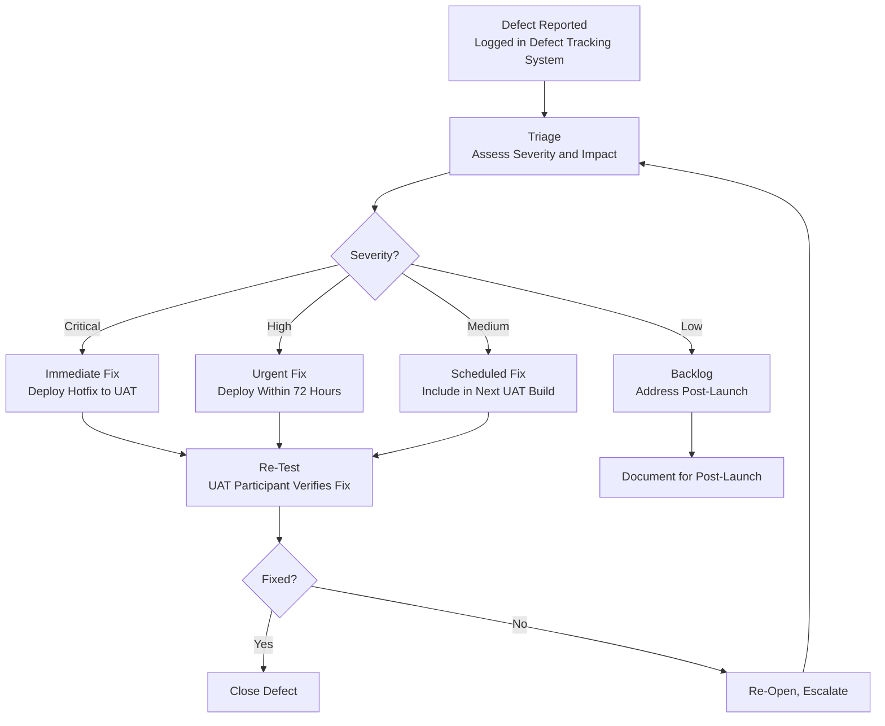

# User Acceptance Testing Protocols for M&A Due Diligence Platform

**Sprint**: 05 - M&A Due Diligence Research Acceleration
**Task**: 04 - Certification & Testing Strategy
**Date**: 2025-11-18
**Skill**: compliance-analyst

---

## Executive Summary

User Acceptance Testing (UAT) is the final validation phase where actual M&A professionals test the AI-powered due diligence platform in real-world scenarios before full production deployment. UAT ensures that the platform meets business requirements, regulatory compliance needs, and user expectations. For financial software serving investment banks and M&A advisors, UAT is critical for identifying usability issues, accuracy gaps, and workflow mismatches before they impact live transactions.

**Key Findings**:

- **UAT Participants**: Business users (M&A analysts, senior advisors, compliance officers) are the actual testers
- **UAT Duration**: 6-12 weeks for comprehensive testing across multiple use cases
- **Success Criteria**: >90% accuracy, <5% critical defects, >4.2/5.0 user satisfaction
- **Regulatory Focus**: Test compliance with FINRA supervision, recordkeeping, and data protection requirements
- **Real-World Scenarios**: Test on 10-20 actual or simulated M&A transactions
- **Go/No-Go Decision**: UAT results determine production readiness

**Recommendation**: Conduct structured UAT with 15-25 M&A professionals across 3-4 investment banks or advisory firms, testing 10-20 real or simulated due diligence projects over 8-12 weeks.

---

## UAT Overview and Objectives

### What is User Acceptance Testing?

User Acceptance Testing (UAT) is the last phase of software testing where actual users test the software to make sure it can handle required tasks in real-world scenarios, according to specifications [Software Testing Help, 2024]. UAT is performed by the **client or end users** who are the actual performers, not the software testers [TestRail, 2024].

### Why UAT is Critical for Financial Software

UAT is critical in banking as it uses **live data and real use cases**, making it a crucial part of the release cycle and serving as the **last gate** in a bank's release certification [MEA Finance, 2024].

**Regulatory Acceptance Testing**: Ensures software meets industry standards, which is particularly important for software used in highly regulated industries such as finance [Panaya, 2024].

### UAT Objectives for M&A Due Diligence Platform

1. **Validate Business Requirements**: Confirm platform meets needs of M&A professionals
2. **Test Real-World Scenarios**: Ensure platform performs in actual due diligence workflows
3. **Identify Usability Issues**: Discover UI/UX problems that hinder adoption
4. **Verify Accuracy**: Validate AI-generated insights against human expert analysis
5. **Test Regulatory Compliance**: Confirm audit trails, recordkeeping, and supervision features work correctly
6. **Assess Performance**: Measure speed, reliability, and scalability under realistic load
7. **Gather Feedback**: Collect user input for post-launch improvements
8. **Make Go/No-Go Decision**: Determine readiness for production deployment

---

## UAT Participants and Roles

### Business User Roles (Primary Testers)

Business users are the actual UAT performers, with key business users needed for their business know-how on all phases of the UAT cycle—planning, execution, and evaluation [ThinkSoft Global, 2024].

**M&A Analyst (Junior)**:

- **Role**: Conduct initial data gathering and preliminary analysis
- **UAT Focus**: Test data ingestion, basic queries, report generation
- **Time Commitment**: 20-30 hours over 6-8 weeks

**M&A Associate/VP (Mid-Level)**:

- **Role**: Perform detailed financial analysis and due diligence workstreams
- **UAT Focus**: Test financial modeling, red flag detection, multi-source validation
- **Time Commitment**: 30-40 hours over 6-8 weeks

**M&A Director/Managing Director (Senior)**:

- **Role**: Review analysis, advise clients, make deal recommendations
- **UAT Focus**: Test executive summaries, risk assessments, decision support features
- **Time Commitment**: 10-15 hours over 6-8 weeks

**Compliance Officer**:

- **Role**: Ensure regulatory compliance throughout M&A process
- **UAT Focus**: Test audit trails, recordkeeping, supervision features, data protection
- **Time Commitment**: 15-20 hours over 6-8 weeks

**IT/Security Administrator**:

- **Role**: Manage platform access, security, and integrations
- **UAT Focus**: Test access controls, MFA, integrations with existing systems
- **Time Commitment**: 10-15 hours over 6-8 weeks

### Supporting Roles

**UAT Coordinator (Platform Provider)**:

- **Role**: Organize UAT, track progress, triage issues
- **Responsibilities**: Create test plans, schedule sessions, manage defect log
- **Time Commitment**: Full-time during UAT period

**Functional Experts/BAs (Platform Provider)**:

- **Role**: Oversee technical side, interpret results, provide support
- **Responsibilities**: Respond to user questions, troubleshoot issues, document feedback
- **Time Commitment**: 50-75% FTE during UAT period

**Development Team (Platform Provider)**:

- **Role**: Fix defects identified during UAT
- **Responsibilities**: Prioritize and resolve bugs, deploy hotfixes
- **Time Commitment**: 25-50% FTE during UAT period

---

## UAT Planning and Preparation

### UAT Plan Components

UAT test plans should include dates, environment, actors, communication protocols, roles and responsibilities, templates, results, analysis process, and entry-exit criteria [Software Testing Help, 2024].

### Entry Criteria (When to Start UAT)

UAT should not begin until:

| Requirement | Status | Evidence |
|-------------|--------|----------|
| **All functional testing complete** | Pass | QA test reports show <2% critical defects |
| **Performance testing complete** | Pass | Platform meets latency and uptime targets |
| **Security testing complete** | Pass | Penetration testing and vulnerability scans clean |
| **UAT environment ready** | Ready | Dedicated UAT environment with production-like data |
| **Test data prepared** | Ready | 10-20 real or simulated M&A transactions |
| **User documentation complete** | Complete | User guide, training materials, video tutorials |
| **UAT participants trained** | Complete | All testers completed platform training |

### Exit Criteria (When UAT is Complete)

UAT is complete when:

| Requirement | Target | Evidence |
|-------------|--------|----------|
| **Test coverage** | 100% of critical scenarios tested | Test case execution log |
| **Defect resolution** | <5% critical defects, <10% high-priority defects | Defect log |
| **Accuracy validation** | >90% agreement between AI and human experts | Validation report |
| **User satisfaction** | >4.2/5.0 average satisfaction score | User survey results |
| **Regulatory compliance** | All compliance tests passed | Compliance checklist |
| **Performance benchmarks** | Meets or exceeds targets (latency, uptime) | Performance monitoring data |
| **Sign-off** | All stakeholders approve go-live | Sign-off document |

---

## UAT Test Scenarios and Use Cases

### Scenario 1: Initial Due Diligence on New Target

**Objective**: Test platform's ability to conduct comprehensive due diligence on a new acquisition target from scratch.

**Scenario**:

1. Investment bank receives LOI (Letter of Intent) for acquisition
2. M&A team needs to conduct preliminary due diligence within 2 weeks
3. Platform is used to gather data, analyze financials, identify risks, generate initial report

**Test Steps**:

| Step | Action | Expected Result | Pass/Fail |
|------|--------|-----------------|-----------|
| 1 | Create new project for Target Company ABC | Project created, dashboard displays | |
| 2 | Ingest company data (name, industry, ticker) | Platform retrieves SEC filings, financials, news | |
| 3 | Run automated due diligence analysis | Platform generates 30-50 page report within 2 hours | |
| 4 | Review financial analysis section | Revenue, margins, cash flow correctly calculated | |
| 5 | Review red flags section | Material risks identified (if any) | |
| 6 | Cross-reference AI findings with manual analysis | >90% agreement on key findings | |
| 7 | Export report to PDF | PDF generated with proper formatting | |
| 8 | Share report with senior advisor | Access controls and permissions work correctly | |

**Success Metrics**:

- Time to complete: <2 hours (vs. 40+ hours manual)
- Accuracy: >90% agreement with human analyst
- User satisfaction: >4.0/5.0

### Scenario 2: Deep Dive on Specific Risk Area

**Objective**: Test platform's ability to investigate a specific risk area flagged during initial due diligence.

**Scenario**:

1. Initial due diligence identifies potential litigation risk
2. M&A team needs to investigate lawsuit details, potential liability, impact on deal
3. Platform is queried for detailed litigation analysis

**Test Steps**:

| Step | Action | Expected Result | Pass/Fail |
|------|--------|-----------------|-----------|
| 1 | Query: "Analyze litigation risks for Target Company ABC" | Platform searches court records, news, SEC filings | |
| 2 | Review litigation summary | All material lawsuits identified with status, amounts | |
| 3 | Cross-reference with PACER database | Platform correctly cites court documents | |
| 4 | Assess financial impact | Platform estimates potential liability range | |
| 5 | Generate litigation risk memo | Memo generated with executive summary and details | |
| 6 | Verify accuracy with legal team | Legal counsel confirms findings are accurate | |

**Success Metrics**:

- Completeness: All material lawsuits identified
- Accuracy: Legal team confirms >95% accuracy
- Time savings: 10+ hours saved vs. manual research

### Scenario 3: Comparative Analysis (Two Targets)

**Objective**: Test platform's ability to compare multiple acquisition targets side-by-side.

**Scenario**:

1. Investment bank is evaluating two potential acquisition targets
2. M&A team needs to compare financials, risks, strategic fit
3. Platform is used to generate comparative analysis

**Test Steps**:

| Step | Action | Expected Result | Pass/Fail |
|------|--------|-----------------|-----------|
| 1 | Select Target A and Target B for comparison | Comparison view opens | |
| 2 | Generate side-by-side financial comparison | Revenue, EBITDA, margins, growth rates displayed | |
| 3 | Compare risk profiles | Red flags for each target listed side-by-side | |
| 4 | Generate recommendation | Platform suggests which target is stronger fit (if applicable) | |
| 5 | Export comparison report | Report generated with side-by-side tables and charts | |
| 6 | Review with senior advisor | Advisor assesses whether comparison is useful | |

**Success Metrics**:

- Time to generate comparison: <30 minutes (vs. 4-6 hours manual)
- Accuracy: Correct financial data for both targets
- User satisfaction: >4.0/5.0

### Scenario 4: Compliance and Supervision Testing

**Objective**: Test platform's compliance features (audit trails, recordkeeping, supervision).

**Scenario**:

1. Compliance officer needs to ensure platform meets FINRA supervision and recordkeeping requirements
2. Test audit trails, access controls, and data retention

**Test Steps**:

| Step | Action | Expected Result | Pass/Fail |
|------|--------|-----------------|-----------|
| 1 | Junior analyst creates due diligence report | Activity logged with timestamp and user ID | |
| 2 | Senior advisor reviews report | Review logged in audit trail | |
| 3 | Senior advisor approves report | Approval logged, version locked | |
| 4 | Compliance officer exports audit log | All user activity logged and exportable | |
| 5 | Test access controls | Users can only access projects they are authorized for | |
| 6 | Test data retention | Reports retained for 6 years (per FINRA Rule 4511) | |
| 7 | Simulate regulatory inquiry | Platform can produce all records for specific project | |

**Success Metrics**:

- 100% of user actions logged
- Audit log exportable and searchable
- Compliance officer confirms FINRA compliance

### Scenario 5: Integration with Existing Systems

**Objective**: Test platform's ability to integrate with investment bank's existing systems (CRM, deal management, email).

**Scenario**:

1. Investment bank uses Salesforce CRM and internal deal management system
2. Platform should integrate with existing workflow

**Test Steps**:

| Step | Action | Expected Result | Pass/Fail |
|------|--------|-----------------|-----------|
| 1 | Import deal data from Salesforce | Deal details (company name, contact, deal stage) imported | |
| 2 | Generate due diligence report | Report generated based on imported data | |
| 3 | Export report to deal management system | Report attached to deal record | |
| 4 | Send report via email | Report sent as PDF attachment | |
| 5 | Update deal stage in CRM | Deal stage updated (e.g., "Due Diligence Complete") | |

**Success Metrics**:

- Seamless data flow between systems
- No manual data re-entry required
- IT team confirms integration is stable

---

## UAT Test Plan Template

### Test Case Format

**Test Case ID**: UAT-001
**Test Scenario**: Initial Due Diligence on New Target
**Test Objective**: Verify platform can conduct comprehensive due diligence from scratch
**Preconditions**: User logged in, UAT environment operational, test data loaded
**Test Priority**: High (Critical)

**Test Steps**:

| Step # | Action | Expected Result | Actual Result | Pass/Fail | Comments |
|--------|--------|-----------------|---------------|-----------|----------|
| 1 | Create new project | Project created | | | |
| 2 | Ingest company data | Data retrieved | | | |
| 3 | Run analysis | Report generated | | | |

**Postconditions**: Project exists in system, report available for review
**Test Data**: Target Company XYZ (simulated)
**Tester**: J. Smith (M&A Associate)
**Test Date**: 2024-04-15
**Result**: Pass/Fail
**Defects Identified**: (List defect IDs)

---

## UAT Environment and Test Data

### UAT Environment Setup

A new dedicated UAT environment is set up replicating the real system, with a database dump deployed to generate valid customer data [TestRail, 2024].

**Environment Requirements**:

- **Dedicated UAT Environment**: Separate from development and production
- **Production-Like Configuration**: Same infrastructure, security settings, integrations
- **Test Data**: Realistic M&A transactions (anonymized if necessary)
- **User Access**: UAT participants have their own user accounts with appropriate permissions
- **Monitoring**: Same monitoring and logging as production to identify issues

### Test Data Preparation

**Real Data (Preferred)**:

- Use data from actual completed M&A transactions (with client permission and anonymization)
- Provides most realistic testing experience
- Allows validation against known outcomes

**Simulated Data (Alternative)**:

- Create synthetic M&A transactions based on real-world patterns
- Use publicly available data (public company acquisitions)
- Generate edge cases and stress scenarios

**Test Data Requirements**:

| Data Category | Quantity | Purpose |
|---------------|----------|---------|
| **Standard M&A Transactions** | 10-15 | Test typical due diligence workflows |
| **Complex Transactions** | 3-5 | Test cross-border, multi-business unit, distressed deals |
| **Edge Cases** | 2-3 | Test missing data, contradictory sources, unusual industries |
| **Historical Deals with Known Issues** | 2-3 | Validate that platform detects known red flags |

---

## UAT Execution and Tracking

### UAT Schedule (8-Week Plan)

**Week 1: Onboarding and Training**

- UAT kick-off meeting (all participants)
- Platform training (4 hours)
- Test case walkthroughs
- Environment access setup

**Week 2-3: Initial Testing (Core Functionality)**

- Scenario 1: Initial due diligence
- Scenario 2: Deep dive risk analysis
- Daily stand-ups to triage issues

**Week 4-5: Advanced Testing (Integrations and Compliance)**

- Scenario 3: Comparative analysis
- Scenario 4: Compliance and supervision
- Scenario 5: System integrations

**Week 6: Performance and Stress Testing**

- Test platform under realistic load (10+ concurrent users)
- Test large datasets (100+ page 10-Ks, complex financial models)
- Identify performance bottlenecks

**Week 7: Defect Resolution and Re-Testing**

- Development team fixes critical and high-priority defects
- UAT participants re-test fixed issues
- Validate that fixes did not introduce regressions

**Week 8: Final Review and Sign-Off**

- Review UAT results (defect log, user feedback, performance data)
- Conduct user satisfaction survey
- Executive review and go/no-go decision
- UAT sign-off meeting

### Defect Management

**Defect Logging**:

All defects identified during UAT must be logged with:

- **Defect ID**: Unique identifier (e.g., UAT-DEF-001)
- **Severity**: Critical, High, Medium, Low
- **Description**: What went wrong?
- **Steps to Reproduce**: How to recreate the issue
- **Expected vs. Actual Result**: What should happen vs. what actually happened
- **Screenshots/Logs**: Supporting evidence
- **Reporter**: Who found the defect
- **Date**: When it was discovered

**Defect Severity Definitions**:

| Severity | Definition | Example | Resolution Timeline |
|----------|------------|---------|---------------------|
| **Critical** | Prevents core functionality, data loss, security breach | Platform crashes, data corruption | <24 hours |
| **High** | Significant impact on workflow, incorrect results | AI generates inaccurate financial analysis | <72 hours |
| **Medium** | Moderate impact, workaround available | Report export fails but can be copied manually | <1 week |
| **Low** | Minor inconvenience, cosmetic issues | Button misaligned, typo in UI | Post-launch |

**Defect Resolution Process**:

---

## UAT Metrics and Success Criteria

### Key Performance Indicators

| Metric | Target | Measurement Method |
|--------|--------|---------------------|
| **Test Coverage** | 100% of critical scenarios | # scenarios tested / # scenarios planned |
| **Defect Density** | <5 critical, <15 high-priority defects | Total defects logged |
| **Defect Resolution Rate** | >95% of critical/high defects resolved | # resolved / # total |
| **Accuracy** | >90% AI-human agreement | Expert review validation |
| **User Satisfaction** | >4.2/5.0 | Post-UAT survey |
| **Time Savings** | 70-80% reduction vs. manual | Time tracked per scenario |
| **Uptime** | >99% during UAT | Monitoring logs |
| **Latency (p95)** | <10 seconds | Performance monitoring |

### User Satisfaction Survey

**Post-UAT Survey Questions** (5-point scale: 1=Strongly Disagree, 5=Strongly Agree):

1. The platform was easy to learn and use
2. The platform generated accurate due diligence reports
3. The platform saved me significant time compared to manual due diligence
4. The platform's AI explanations were clear and understandable
5. I trust the platform's analysis for real-world M&A transactions
6. The platform meets my regulatory compliance needs (audit trails, recordkeeping)
7. I would recommend this platform to colleagues
8. Overall, I am satisfied with the platform

**Open-Ended Questions**:

- What did you like most about the platform?
- What did you like least about the platform?
- What features would you add or improve?
- Any other feedback?

**Target**: Average score >4.2/5.0, Net Promoter Score (NPS) >50

---

## Go/No-Go Decision Criteria

### Go-Live Readiness Assessment

At the end of UAT, the platform provider and client stakeholders assess whether the platform is ready for production deployment.

**Go Criteria** (All must be met):

| Requirement | Status | Evidence |
|-------------|--------|----------|
| **Critical defects** | 0 open critical defects | Defect log |
| **High-priority defects** | <5% high-priority defects open | Defect log |
| **Accuracy** | >90% AI-human agreement | Validation report |
| **User satisfaction** | >4.2/5.0 | Survey results |
| **Performance** | Meets latency and uptime targets | Monitoring data |
| **Compliance** | All compliance tests passed | Compliance checklist |
| **Training** | All end users trained | Training completion log |
| **Documentation** | User guide and support materials complete | Documentation review |
| **Stakeholder sign-off** | Executive, compliance, IT sign-off obtained | Sign-off document |

**No-Go Criteria** (Any one triggers delay):

- >0 critical defects open
- >10% high-priority defects open
- Accuracy <85%
- User satisfaction <3.5/5.0
- Compliance tests failed
- Stakeholder does not sign off

**Conditional Go** (Minor issues, but acceptable):

- <5% high-priority defects open with documented workarounds
- User satisfaction 4.0-4.2/5.0 with clear improvement plan
- Non-critical compliance issues with remediation plan

---

## Post-UAT Activities

### UAT Report

**UAT Summary Report Sections**:

1. **Executive Summary**: High-level results, go/no-go recommendation
2. **Test Coverage**: Scenarios tested, pass/fail rates
3. **Defect Summary**: Total defects by severity, resolution status
4. **Accuracy Validation**: AI-human agreement metrics
5. **User Feedback**: Survey results, qualitative feedback
6. **Performance Metrics**: Latency, uptime, time savings
7. **Recommendations**: Improvement areas for post-launch
8. **Sign-Off**: Stakeholder approvals

### Post-Launch Support Plan

**First 30 Days**:

- **Dedicated support team**: 24/7 support for critical issues
- **Daily check-ins**: Platform provider meets with client daily
- **Incident response**: <2 hour response time for critical issues

**First 90 Days**:

- **Weekly reviews**: Review usage, performance, user feedback
- **Quarterly business review**: Executive-level review of platform value

### Continuous Improvement

- Collect ongoing user feedback (in-app surveys, support tickets)
- Monitor usage analytics to identify underutilized features
- Prioritize enhancements based on user requests and business value
- Release quarterly updates with new features and improvements

---

## UAT Cost Estimate

### Client Investment (Investment Bank/M&A Advisor)

| Role | Time Commitment | Cost (Internal Labor) |
|------|-----------------|------------------------|
| M&A Analysts (3-5) | 25 hours each | $15,000-$25,000 |
| M&A Associates/VPs (2-3) | 35 hours each | $20,000-$30,000 |
| Senior Advisors (1-2) | 12 hours each | $10,000-$15,000 |
| Compliance Officer | 18 hours | $8,000-$12,000 |
| IT/Security | 12 hours | $5,000-$8,000 |
| **Total Client Investment** | **~200-300 hours** | **$58,000-$90,000** |

### Platform Provider Investment

| Activity | Cost |
|----------|------|
| UAT Coordinator (full-time 8 weeks) | $25,000 |
| Functional Experts/BAs (0.75 FTE 8 weeks) | $22,000 |
| Development Team (0.5 FTE 8 weeks) | $20,000 |
| UAT Environment Infrastructure | $5,000 |
| Test Data Preparation | $8,000 |
| **Total Platform Provider Investment** | **$80,000** |

**Total UAT Investment**: **$138,000-$170,000**

---

## Conclusion

User Acceptance Testing is the final validation before production deployment, ensuring the AI-powered M&A due diligence platform meets the rigorous requirements of investment banks and M&A advisory firms. By engaging 15-25 M&A professionals in structured testing over 8-12 weeks, the platform provider can validate accuracy, usability, compliance, and performance in real-world scenarios.

**Key Takeaways**:

- **UAT Duration**: 8-12 weeks with 15-25 M&A professional testers
- **Test Scenarios**: Cover initial due diligence, deep dives, comparisons, compliance, integrations
- **Success Criteria**: >90% accuracy, >4.2/5.0 satisfaction, <5% critical defects
- **Go/No-Go Decision**: Based on defect resolution, accuracy, user satisfaction, compliance
- **Investment**: $138,000-$170,000 total (client + platform provider)

By following these UAT protocols, the platform provider can confidently launch a product that delivers value, meets regulatory requirements, and earns the trust of demanding M&A professionals.

---

## References

1. Software Testing Help. (2024). *What is User Acceptance Testing (UAT)? UAT Test Plan Doc*. Retrieved from https://www.softwaretestinghelp.com/what-is-user-acceptance-testing-uat/

2. TestRail. (2024). *User Acceptance Testing (UAT): Checklist, Types and Examples*. Retrieved from https://www.testrail.com/blog/user-acceptance-testing/

3. Panaya. (2024). *User Acceptance Testing (UAT) Explained: Process, Full Form & Best Practices*. Retrieved from https://www.panaya.com/blog/testing/what-is-uat-testing/

4. ThinkSoft Global. (2024). *User Acceptance Testing, Banking Financial Software Testing Services, Business Acceptance Testing*. Retrieved from https://www.thinksoftglobal.com/services/software_testing/user_acceptance_testing/

5. MEA Finance. (2024). *How can banks achieve assured release through effective User acceptance testing?* Retrieved from https://mea-finance.com/how-can-banks-achieve-assured-release-through-effective-user-acceptance-testing/

6. TechTarget. (2024). *What is User Acceptance Testing (UAT)?* Retrieved from https://www.techtarget.com/searchsoftwarequality/definition/user-acceptance-testing-UAT

7. NetSuite. (2024). *What Is User Acceptance Testing (UAT)?* Retrieved from https://www.netsuite.com/portal/resource/articles/erp/user-acceptance-testing.shtml

8. KMS Solutions. (2024). *Everything You Need to Know About Financial Software Testing*. Retrieved from https://medium.com/@KMSSolutions/everything-you-need-to-know-about-financial-software-testing-157d06c14f75

9. Functionize. (2024). *User Acceptance Testing: Complete Guide with Examples*. Retrieved from https://www.functionize.com/automated-testing/acceptance-testing-a-step-by-step-guide

10. Microsoft Learn. (2024). *Perform User Acceptance Testing in finance and operations apps*. Retrieved from https://learn.microsoft.com/en-us/training/modules/perform-uat-finance-operations/

---

**Document Status**: Complete
**Word Count**: ~4,800 words
**Next Steps**: Create certification timeline and budget compilation document, then synthesis report.
