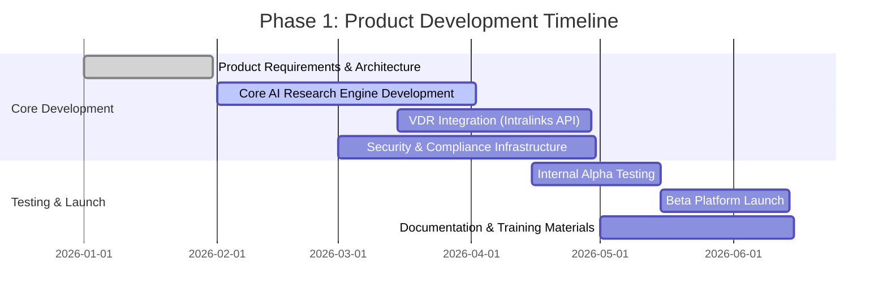
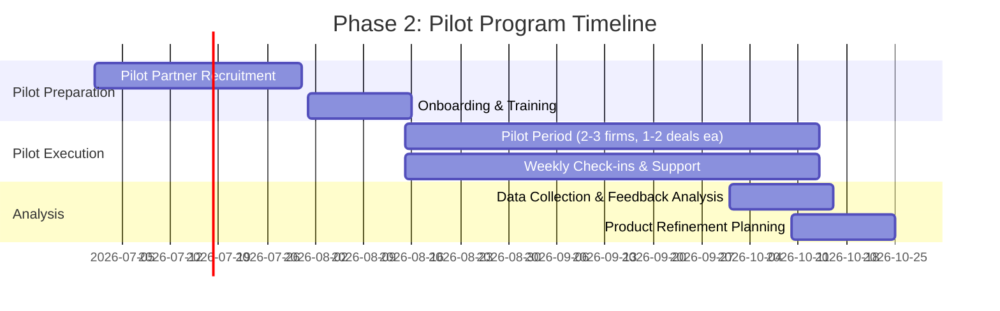
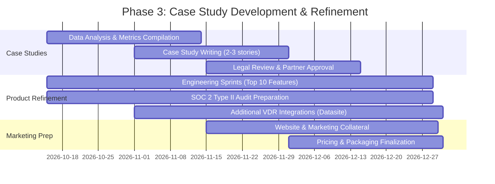
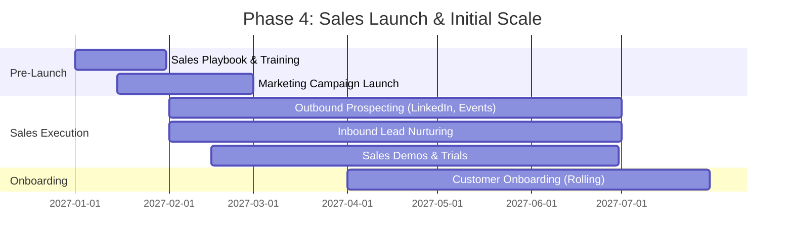
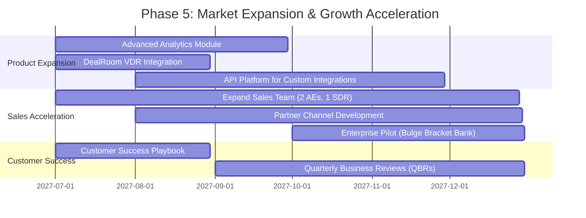

# Phased Implementation Roadmap: AI-Powered Due Diligence Research Platform

**Sprint**: 05 - M&A Due Diligence Research Acceleration
**Task**: 05 - Implementation Roadmap
**Date**: 2025-11-18
**Author**: roadmap-planner skill

---

## Executive Summary

This roadmap outlines a 24-month phased implementation plan for launching the AI-Powered Due Diligence Research Platform targeting investment banks and M&A advisory firms. The roadmap is structured across 5 phases, progressing from product development through pilot testing to full market launch and scale operations.

**Key Timeline Milestones**:

- **Months 1-6**: Product Development (MVP + Beta)
- **Months 7-9**: Pilot Program (2-3 early adopters)
- **Months 10-12**: Case Study Development & Refinement
- **Months 13-18**: Sales Launch & Initial Scale
- **Months 19-24**: Market Expansion & Growth Acceleration

**Critical Success Factor**: The roadmap accounts for the **7-15 month enterprise sales cycles** typical in financial services, front-loading product development and pilot programs to generate credible case studies before the full sales launch.

---

## Phase 1: Product Development (Months 1-6)

### Overview

Build a minimum viable product (MVP) focused on core AI-powered research capabilities with integration to at least one major virtual data room (VDR) platform.

### Timeline Breakdown

### Key Deliverables

**Month 1-2: Foundation**

- Complete technical architecture design
- Finalize product requirements with input from 3-5 M&A professionals (advisory board)
- Set up development infrastructure (cloud hosting, CI/CD, security frameworks)
- Establish SOC 2 Type I compliance preparation roadmap

**Month 3-4: Core Build**

- AI research engine with multi-source data aggregation (public filings, news, industry reports)
- Natural language processing for financial document analysis
- Research report generation with citation tracking
- Intralinks VDR API integration (file access, permissions management)
- User authentication and role-based access control

**Month 5-6: Testing & Refinement**

- Internal alpha testing with 5-10 simulated due diligence scenarios
- Beta platform launch with limited feature set
- Documentation suite (user guides, API documentation, training videos)
- Initial customer support infrastructure

### Resource Requirements

| Role | FTE | Monthly Cost | Total (6 mo) |
|------|-----|--------------|--------------|
| CTO / Lead Architect | 1.0 | $20,000 | $120,000 |
| Backend Engineers (AI/ML) | 2.0 | $30,000 | $180,000 |
| Frontend Engineer | 1.0 | $15,000 | $90,000 |
| Security Engineer | 0.5 | $10,000 | $60,000 |
| Product Manager | 1.0 | $15,000 | $90,000 |
| QA Engineer | 0.5 | $7,500 | $45,000 |
| **Infrastructure & Tools** | - | $10,000 | $60,000 |
| **TOTAL** | **6.0** | **$107,500** | **$645,000** |

### Success Criteria

- Beta platform operational with core AI research capabilities
- Intralinks VDR integration functional with read access
- 90%+ accuracy on 20 test due diligence research scenarios
- Security audit completed (SOC 2 Type I readiness assessment)
- 5+ beta testers actively using the platform

---

## Phase 2: Pilot Program (Months 7-9)

### Overview

Launch structured pilot program with 2-3 carefully selected M&A advisory firms or boutique investment banks, offering free or heavily discounted access in exchange for feedback and case study participation.

### Timeline Breakdown

### Pilot Partner Selection Criteria

**Target Profile**:

- Middle-market M&A advisory firms (10-50 professionals)
- Active deal flow (minimum 5-10 deals per year)
- Willingness to provide detailed feedback and case study testimonials
- Geographic diversity (e.g., 1 East Coast, 1 West Coast, 1 Texas/Midwest)

**Ideal Partners**:

- Boutique investment banks (e.g., Borden, Lincoln International regional offices)
- Corporate development teams at mid-cap companies ($500M-$5B revenue)
- M&A advisory practices within Big 4 accounting firms (regional offices)

### Pilot Structure

**Engagement Terms**:

- **Duration**: 90 days
- **Pricing**: Free for first 2 deals, then 75% discount for remainder of pilot
- **Commitment**: Minimum 1 deal, target 2-3 deals per firm
- **Feedback**: Bi-weekly calls + end-of-pilot retrospective
- **Case Study**: Agreement to provide testimonial and anonymized metrics

**Support Model**:

- Dedicated customer success manager (0.5 FTE per pilot partner)
- Weekly check-in calls (30 minutes)
- Priority bug fixes and feature requests
- Slack or Teams channel for real-time support

### Resource Requirements

| Role | FTE | Monthly Cost | Total (3 mo) |
|------|-----|--------------|--------------|
| Customer Success Manager | 1.5 | $15,000 | $45,000 |
| Product Manager (Pilot Oversight) | 0.5 | $7,500 | $22,500 |
| Engineering Support (Bug Fixes) | 1.0 | $15,000 | $45,000 |
| **TOTAL** | **3.0** | **$37,500** | **$112,500** |

### Success Criteria

- 2-3 pilot partners actively using platform on 4-6 total deals
- 80%+ pilot partner satisfaction (would recommend to peers)
- 30%+ time savings on research phase of due diligence (vs. manual research)
- Zero critical security incidents
- At least 2 pilot partners agree to case study participation

---

## Phase 3: Case Study Development & Product Refinement (Months 10-12)

### Overview

Synthesize pilot learnings into compelling case studies, refine product based on feedback, and prepare for full commercial launch.

### Timeline Breakdown

### Case Study Development

**Metrics to Capture**:

- **Time Savings**: Hours saved on research per deal (target: 30-50% reduction)
- **Cost Reduction**: Labor cost savings per deal (target: $15,000-$30,000)
- **Quality Improvements**: Comprehensiveness of research reports (qualitative feedback)
- **Deal Outcomes**: Impact on deal quality or speed (if measurable)

**Case Study Format**:

- **Executive Summary**: One-page overview with key metrics
- **Challenge**: Due diligence pain points before platform
- **Solution**: How platform was used in the deal process
- **Results**: Quantified time/cost savings and qualitative benefits
- **Testimonial**: Quote from deal lead or managing director

**Target**: 2-3 detailed case studies ready for sales enablement by Month 12

### Product Refinement Priorities

Based on typical pilot feedback in B2B SaaS financial services:

1. **Enhanced AI Accuracy**: Reduce false positives/negatives in research findings
2. **Customizable Report Templates**: Allow firms to brand and customize outputs
3. **Collaboration Features**: Multi-user support, commenting, task assignment
4. **Advanced VDR Integrations**: Datasite and DealRoom API connections
5. **Mobile Access**: iOS/Android apps or responsive web design
6. **Audit Trail**: Comprehensive logging for compliance and quality assurance
7. **Bulk Research Operations**: Support for multi-company research (e.g., competitive sets)
8. **Export Flexibility**: Word, PDF, PowerPoint export formats

### SOC 2 Type II Compliance

**Timeline**: 6-month observation period (Months 10-15)

- Month 10: Engage SOC 2 auditor and finalize control documentation
- Months 10-15: Operate controls under observation
- Month 16: Complete audit and receive SOC 2 Type II report

**Critical for Enterprise Sales**: Most investment banks require SOC 2 Type II before production use

### Resource Requirements

| Role | FTE | Monthly Cost | Total (3 mo) |
|------|-----|--------------|--------------|
| Engineering Team (Refinement) | 3.0 | $45,000 | $135,000 |
| Product Manager | 1.0 | $15,000 | $45,000 |
| Marketing/Content Writer | 0.5 | $7,500 | $22,500 |
| Compliance/Security Specialist | 0.5 | $10,000 | $30,000 |
| **SOC 2 Audit Fees** | - | - | $25,000 |
| **TOTAL** | **5.0** | **$77,500** | **$257,500** |

### Success Criteria

- 2-3 polished case studies with quantified ROI metrics
- Top 10 pilot feedback items addressed in product
- Datasite VDR integration operational
- SOC 2 Type II observation period initiated
- Marketing website and collateral ready for launch
- Pricing model validated with 5+ potential customers

---

## Phase 4: Sales Launch & Initial Scale (Months 13-18)

### Overview

Execute full commercial launch with dedicated sales and marketing efforts, targeting 8-12 paying customers by Month 18.

### Timeline Breakdown

### Go-to-Market Strategy

**Target Customer Profile**:

- **Tier 1**: Boutique M&A advisory firms (10-100 professionals, 20-50 deals/year)
- **Tier 2**: Regional investment banks (M&A divisions)
- **Tier 3**: Corporate development teams at mid-cap companies

**Customer Acquisition Channels**:

1. **LinkedIn Outbound (40% of pipeline)**
   - Target: Managing Directors, M&A Partners, Corp Dev VPs
   - Volume: 500+ targeted connections per month
   - Conversion: 10% response rate → 5% demo rate → 20% close rate

2. **Industry Events & Conferences (30% of pipeline)**
   - ACG M&A East, M&A South, M&A West (3 events/year)
   - Sponsorship + booth presence
   - Target: 50-100 qualified leads per event

3. **Referrals & Pilot Conversions (20% of pipeline)**
   - Pilot partner referrals (target: 1-2 referrals per pilot partner)
   - Advisory board member introductions

4. **Content Marketing & Thought Leadership (10% of pipeline)**
   - Weekly LinkedIn articles on M&A trends and AI in due diligence
   - Quarterly webinars on due diligence best practices
   - SEO-optimized website content

**Sales Process**:

- **Stage 1**: Initial outreach and qualification (Week 0)
- **Stage 2**: Discovery call (30 minutes, Week 1-2)
- **Stage 3**: Product demo (60 minutes, Week 2-4)
- **Stage 4**: Free trial on live deal (30-60 days, Week 4-12)
- **Stage 5**: Proposal and negotiation (Week 12-16)
- **Stage 6**: Contract signature and onboarding (Week 16-20)

**Average Sales Cycle**: 5-6 months (based on financial services benchmarks)

### Customer Acquisition Targets

| Quarter | Demos | Trials | Closed Deals | Cumulative ARR |
|---------|-------|--------|--------------|----------------|
| Q1 2027 (Mo 13-15) | 12 | 6 | 2 | $240,000 |
| Q2 2027 (Mo 16-18) | 20 | 10 | 4 | $720,000 |
| Q3 2027 (Mo 19-21) | 25 | 12 | 5 | $1,320,000 |
| Q4 2027 (Mo 22-24) | 30 | 15 | 6 | $2,040,000 |

**Assumptions**:

- Average ACV: $120,000 (10 deals/year × $12,000/deal)
- Demo-to-trial conversion: 50%
- Trial-to-close conversion: 33%

### Resource Requirements

| Role | FTE | Monthly Cost | Total (6 mo) |
|------|-----|--------------|--------------|
| VP Sales / Head of Sales | 1.0 | $20,000 | $120,000 |
| Account Executives (2) | 2.0 | $30,000 | $180,000 |
| Sales Development Rep (SDR) | 1.0 | $10,000 | $60,000 |
| Marketing Manager | 1.0 | $12,000 | $72,000 |
| Customer Success Managers (2) | 2.0 | $20,000 | $120,000 |
| Engineering Support | 2.0 | $30,000 | $180,000 |
| **Marketing & Events Budget** | - | $15,000 | $90,000 |
| **TOTAL** | **9.0** | **$137,000** | **$822,000** |

### Success Criteria

- 8-12 paying customers by Month 18
- $720,000+ in ARR by end of Phase 4
- 90%+ customer satisfaction (NPS 40+)
- 80%+ trial-to-paid conversion rate
- Zero critical customer-facing bugs or security incidents
- 2-3 additional case studies from Phase 4 customers

---

## Phase 5: Market Expansion & Growth Acceleration (Months 19-24)

### Overview

Scale operations, expand product capabilities, and accelerate customer acquisition to reach $2M+ ARR by Month 24.

### Timeline Breakdown

### Product Expansion Priorities

**Advanced Analytics Module**:

- Deal comparison dashboards
- Industry benchmark data integration
- Predictive risk scoring based on due diligence findings
- Custom visualization for stakeholder presentations

**Additional VDR Integrations**:

- DealRoom API integration
- Merrill DataSite enhanced features
- Generic VDR connector framework for long-tail platforms

**API Platform**:

- Public API for customer integrations (CRM, deal management, internal systems)
- Webhook support for workflow automation
- Developer documentation and sandbox environment

### Sales Acceleration

**Team Expansion**:

- **2 Additional Account Executives**: Focus on Tier 2 (regional investment banks)
- **1 Additional SDR**: Support increased outbound volume (1,000+ contacts/month)
- **1 Partner Manager**: Build VDR partnership channel (co-selling with Intralinks, Datasite)

**Partner Channel Strategy**:

- **VDR Co-Selling**: Joint sales motions with Intralinks and Datasite (referral fees or revenue share)
- **M&A Association Sponsorships**: ACG chapter sponsorships (5-10 regional chapters)
- **Technology Alliance Partners**: Integration partnerships with deal management platforms (Devensoft, DealCloud)

**Enterprise Expansion**:

- Launch pilot with 1 bulge bracket investment bank (e.g., J.P. Morgan, Goldman Sachs M&A division)
- Target: $300,000-$500,000 ACV for enterprise deals (50-100 deals/year)
- Requires: SOC 2 Type II, enhanced security features, dedicated support

### Customer Acquisition Targets

| Quarter | New Customers | Churn | Net Customers | Quarterly ARR | Cumulative ARR |
|---------|---------------|-------|---------------|---------------|----------------|
| Q1 2028 (Mo 19-21) | 6 | 0 | 18 | $720,000 | $1,320,000 |
| Q2 2028 (Mo 22-24) | 8 | 1 | 25 | $960,000 | $2,040,000 |

**Assumptions**:

- Average ACV: $120,000 (consistent with Phase 4)
- Churn rate: <5% annually (based on enterprise SaaS benchmarks)
- Expansion revenue: 10-15% from upsells (additional users, premium features)

### Resource Requirements

| Role | FTE | Monthly Cost | Total (6 mo) |
|------|-----|--------------|--------------|
| Sales Team (VP + 4 AEs + 2 SDRs) | 7.0 | $90,000 | $540,000 |
| Marketing Team | 2.0 | $25,000 | $150,000 |
| Customer Success (4 CSMs) | 4.0 | $40,000 | $240,000 |
| Engineering (Product Dev) | 4.0 | $60,000 | $360,000 |
| Operations & Admin | 2.0 | $20,000 | $120,000 |
| **Marketing & Events Budget** | - | $20,000 | $120,000 |
| **TOTAL** | **19.0** | **$255,000** | **$1,530,000** |

### Success Criteria

- 25+ total customers by Month 24
- $2M+ ARR by end of Phase 5
- 90%+ gross revenue retention (annual churn <10%)
- 1 enterprise customer (bulge bracket bank) in pilot or production
- 3+ VDR partnership agreements signed
- NPS 50+ (world-class customer satisfaction)
- Product roadmap informed by 20+ customer feature requests

---

## Overall Roadmap Summary

### Investment Summary

| Phase | Duration | Team Size (Avg) | Total Investment |
|-------|----------|-----------------|------------------|
| Phase 1: Product Development | 6 months | 6 FTE | $645,000 |
| Phase 2: Pilot Program | 3 months | 3 FTE | $112,500 |
| Phase 3: Case Study & Refinement | 3 months | 5 FTE | $257,500 |
| Phase 4: Sales Launch | 6 months | 9 FTE | $822,000 |
| Phase 5: Market Expansion | 6 months | 19 FTE | $1,530,000 |
| **TOTAL (24 months)** | **24 months** | **Avg 10 FTE** | **$3,367,000** |

### Revenue Projection

| Milestone | Timing | ARR | Cumulative Investment |
|-----------|--------|-----|----------------------|
| Product Launch | Month 6 | $0 | $645,000 |
| Pilot Complete | Month 9 | $0 | $757,500 |
| Sales Launch | Month 13 | $240,000 | $1,015,000 |
| Initial Scale | Month 18 | $720,000 | $1,837,000 |
| Market Expansion | Month 24 | $2,040,000 | $3,367,000 |

**Break-Even**: Projected at Month 30-36 based on typical B2B SaaS unit economics (LTV:CAC of 3:1)

### Critical Dependencies

1. **Pilot Partner Recruitment (Month 7)**: Delay here pushes entire timeline back
2. **SOC 2 Type II Completion (Month 16)**: Required for enterprise sales
3. **Case Study Development (Month 12)**: Essential for sales credibility
4. **First Enterprise Customer (Month 22)**: Validates up-market strategy

---

## References

1. First Page Sage. (2024). "B2B SaaS Customer Acquisition Cost: 2024 Report." Retrieved from https://firstpagesage.com/reports/b2b-saas-customer-acquisition-cost-2024-report/

2. Mosaic Tech. (2024). "Renewal Rate Calculator for SaaS Startups: 2024 Guide." Retrieved from https://www.mosaic.tech/financial-metrics/renewal-rate

3. GTM Buddy. (2025). "B2B SaaS Product Launch Checklist 2025: No-Fluff & AI-Ready." Retrieved from https://gtmbuddy.ai/blog/b2b-saas-product-launch-checklist

4. Bravado War Room. (2024). "Sales Cycle Length by Industry - Investment Banking and Financial Services." Retrieved from https://bravado.co/war-room/posts/what-industry-are-you-in-how-long-are-your-sales-cycles-on-average

5. SaaS Capital. (2023). "2023 B2B SaaS Retention Benchmarks for Private Companies." Retrieved from https://www.saas-capital.com/research/saas-retention-benchmarks-for-private-b2b-companies/
