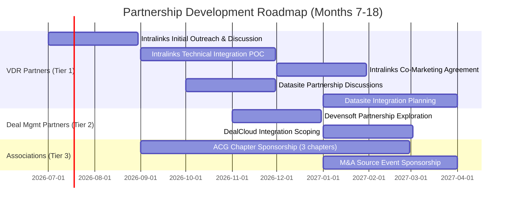

# Strategic Partnership Strategy and Target Partner List

**Sprint**: 05 - M&A Due Diligence Research Acceleration
**Task**: 05 - Implementation Roadmap
**Date**: 2025-11-18
**Author**: roadmap-planner skill

---

## Executive Summary

Strategic partnerships are critical for accelerating market penetration of the AI-Powered Due Diligence Research Platform. This document outlines a three-tier partnership strategy focused on:

1. **VDR Integration Partners** (Tier 1): Intralinks, Datasite, DealRoom - enable seamless data access
2. **Deal Management Platform Partners** (Tier 2): Devensoft, DealCloud, 4Degrees - expand ecosystem reach
3. **Industry Association Partners** (Tier 3): ACG, M&A Source, IMN - provide credibility and lead generation

**Partnership Value Proposition**: Enhance partner platforms with AI-powered research capabilities, creating a differentiated offering that increases customer retention and deal flow visibility.

**Target**: Secure **3-5 Tier 1/2 partnerships** and **2-3 Tier 3 sponsorships** by Month 18 of roadmap.

---

## Partnership Strategy Framework

### Strategic Rationale

**Why Partnerships Matter**:

- **Accelerated Distribution**: VDR platforms have existing relationships with 1,000+ M&A firms globally
- **Reduced CAC**: Partner referrals have 40-60% higher close rates vs. cold outbound [Bravado, 2024]
- **Product Differentiation**: Integration partners can co-market AI capabilities as premium features
- **Credibility Signal**: Association endorsements and sponsorships validate solution in conservative industry

**Partnership Model Types**:

1. **Technology Integration**: API-based integrations with bi-directional data flow
2. **Co-Selling Agreement**: Joint sales motions with revenue share or referral fees
3. **Sponsorship/Endorsement**: Event sponsorships and thought leadership collaborations
4. **White-Label/OEM**: Platform embedded within partner's offering (longer-term opportunity)

### Partnership Development Timeline

---

## Tier 1: Virtual Data Room (VDR) Integration Partners

### Priority 1: SS&C Intralinks

**Company Overview**:

- **Market Position**: Leading VDR provider with 6M+ users, $500B+ in deals facilitated annually
- **Customer Base**: Investment banks, law firms, M&A advisors, corporate development teams
- **API Capabilities**: Comprehensive API library for file access, permissions, user management, activity tracking

**Partnership Value Proposition**:

**For Intralinks**:

- **Product Differentiation**: First VDR with integrated AI research capabilities
- **Customer Retention**: Stickier platform reduces churn to competitors (Datasite, Ansarada)
- **Upsell Opportunity**: Premium AI research module as add-on revenue stream ($5-10K/deal)

**For AI Due Diligence Platform**:

- **Customer Access**: Direct integration with 99% of M&A deals using VDRs
- **Seamless UX**: Single sign-on, in-VDR research interface reduces user friction
- **Data Access**: Authorized access to deal documents for AI analysis (with permissions)

**Partnership Model**:

- **Phase 1 (Months 7-9)**: Technical API integration POC with 2-3 pilot customers
- **Phase 2 (Months 10-12)**: Co-marketing agreement and case study development
- **Phase 3 (Months 13-18)**: Revenue share model (15-20% of AI module revenue to Intralinks)

**Key Contacts & Approach**:

| Contact Type | Outreach Strategy | Timeline |
|--------------|-------------------|----------|
| **BD/Partnerships Team** | LinkedIn outreach to VP of Business Development Intro email highlighting pilot results | Month 7 |
| **Product Team** | Technical integration proposal with API documentation Joint customer benefit analysis | Month 8 |
| **C-Suite Sponsor** | Leverage investor/board connections for warm intro to CRO/CPO | Month 9 |

**Success Metrics**:

- Integration live with 3+ joint customers by Month 12
- Co-marketing agreement signed by Month 13
- 5+ joint customer wins by Month 18

---

### Priority 2: Datasite (Merrill Corporation)

**Company Overview**:

- **Market Position**: #2 VDR provider, 170+ countries, 13,000+ projects annually
- **Customer Base**: M&A advisors, investment banks, private equity firms, corporate development
- **Differentiation**: AI-powered document management and analytics capabilities

**Partnership Value Proposition**:

**For Datasite**:

- **Competitive Response**: Match Intralinks' AI research capabilities
- **Enhanced Analytics**: Complement existing AI document analysis with external research layer
- **Geographic Expansion**: Leverage partner's presence in emerging markets (LATAM, APAC)

**For AI Due Diligence Platform**:

- **Market Coverage**: Access to different customer segments vs. Intralinks
- **International Expansion**: Datasite strong in Europe and Asia-Pacific
- **Competitive Hedge**: Avoid single-partner dependency risk

**Partnership Model**:

- **Phase 1 (Months 10-12)**: Partnership exploration and technical scoping
- **Phase 2 (Months 13-18)**: API integration development and pilot launch
- **Phase 3 (Months 19-24)**: Full commercial launch with revenue share

**Key Contacts & Approach**:

| Contact Type | Outreach Strategy | Timeline |
|--------------|-------------------|----------|
| **Technology Alliances** | Cold outreach via Datasite partner portal Reference Intralinks partnership as credibility | Month 10 |
| **Product Innovation** | Propose joint AI research webinar/thought leadership | Month 11 |
| **Regional Sales Leads** | Engage via shared customer introductions | Month 13 |

**Success Metrics**:

- Partnership agreement signed by Month 15
- Technical integration beta by Month 18
- 2+ joint pilot customers by Month 20

---

### Priority 3: DealRoom

**Company Overview**:

- **Market Position**: Modern VDR platform focused on pipeline management and M&A lifecycle
- **Customer Base**: Corporate M&A teams, private equity firms, investment banks
- **Differentiation**: Agile-based project management integrated with VDR

**Partnership Value Proposition**:

**For DealRoom**:

- **AI Capabilities**: DealRoom lacks AI research layer - perfect fit for partnership
- **Customer Expansion**: Joint offering targets corporate development teams (high growth segment)
- **Product Velocity**: Smaller company, faster partnership decision-making vs. incumbents

**For AI Due Diligence Platform**:

- **Modern Tech Stack**: API-first architecture enables faster integration
- **Customer Profile**: Corporate development teams have higher research needs vs. advisors
- **Differentiated Channel**: Less competition vs. Intralinks/Datasite partner channels

**Partnership Model**:

- **Phase 1 (Months 13-15)**: Technical integration (faster due to modern APIs)
- **Phase 2 (Months 16-18)**: Joint go-to-market and co-selling agreement
- **Revenue Model**: Flat referral fee ($5K per customer) or 10% revenue share

**Key Contacts & Approach**:

| Contact Type | Outreach Strategy | Timeline |
|--------------|-------------------|----------|
| **CEO/Founder** | Direct LinkedIn message highlighting mutual customer benefit Reference modern API compatibility | Month 13 |
| **Head of Partnerships** | Propose pilot with 1-2 shared customers | Month 14 |
| **Engineering Team** | Joint technical architecture review | Month 15 |

**Success Metrics**:

- Partnership signed by Month 16
- Integration live by Month 18
- 3+ joint customers by Month 21

---

## Tier 2: Deal Management & Relationship Intelligence Partners

### Priority 4: Devensoft

**Company Overview**:

- **Product**: M&A software for deals, due diligence, integrations, and divestitures
- **Customer Base**: Corporate development teams, private equity firms
- **Capabilities**: End-to-end M&A project management from pipeline to integration

**Partnership Value Proposition**:

**For Devensoft**:

- **Research Module**: Add AI-powered research to existing deal management workflows
- **Competitive Edge**: Differentiate from competitors (Midaxo, Navatar)

**For AI Due Diligence Platform**:

- **Workflow Integration**: Research findings flow directly into deal evaluation frameworks
- **Corporate Dev Focus**: Target underserved market segment (vs. advisory-focused VDRs)

**Partnership Model**:

- **Integration Type**: API integration for research output delivery into Devensoft deal records
- **Go-to-Market**: Joint webinars and case studies targeting corporate development teams
- **Revenue Model**: 10% referral fee for Devensoft-sourced customers

**Outreach Timeline**: Months 13-18

---

### Priority 5: DealCloud (Intapp)

**Company Overview**:

- **Product**: Deal and relationship management platform for investment banks and PE firms
- **Parent**: Intapp (public company, $300M+ revenue)
- **Customer Base**: 500+ investment banks, private equity firms, law firms

**Partnership Value Proposition**:

**For DealCloud**:

- **Research Automation**: Reduce manual research time for deal teams
- **Data Enrichment**: AI research findings enhance deal records and CRM data quality

**For AI Due Diligence Platform**:

- **Enterprise Access**: DealCloud used by bulge bracket banks (Goldman, JPM, etc.)
- **CRM Integration**: Research becomes part of relationship intelligence workflow

**Partnership Model**:

- **Integration Type**: Bi-directional API (research findings → DealCloud; deal data → AI platform)
- **Enterprise Channel**: Co-selling to DealCloud's enterprise customer base
- **Revenue Model**: Revenue share or enterprise license bundling

**Outreach Timeline**: Months 16-21 (longer sales cycle due to Intapp bureaucracy)

---

### Priority 6: 4Degrees

**Company Overview**:

- **Product**: Relationship intelligence CRM purpose-built for investment bankers
- **Focus**: Network analysis and warm introduction surfacing for deal sourcing
- **Customer Base**: Investment banks, M&A advisors, private equity firms

**Partnership Value Proposition**:

**For 4Degrees**:

- **Research Layer**: Complement relationship data with company research and due diligence insights
- **Deal Velocity**: Faster research accelerates time from introduction to close

**For AI Due Diligence Platform**:

- **Relationship Data**: Leverage 4Degrees network graph to identify warm referral paths
- **Investment Banking Focus**: Deep penetration in target customer segment

**Partnership Model**:

- **Integration Type**: Research findings integrated into 4Degrees company profiles
- **Go-to-Market**: Joint thought leadership on AI in investment banking
- **Revenue Model**: Flat referral fee ($3-5K per customer)

**Outreach Timeline**: Months 18-24 (lower priority than VDR integrations)

---

## Tier 3: Industry Association & Event Partnerships

### Priority 7: Association for Corporate Growth (ACG)

**Organization Overview**:

- **Membership**: 100,000+ M&A professionals across 59 chapters worldwide
- **Events**: Regional M&A conferences (M&A East, M&A South, M&A West, InterGrowth)
- **Audience**: Private equity, investment banks, M&A advisors, corporate development teams

**Partnership Value Proposition**:

**For ACG**:

- **Sponsorship Revenue**: $15,000-$50,000 per event sponsorship
- **Member Value**: Access to cutting-edge AI technology for due diligence

**For AI Due Diligence Platform**:

- **Lead Generation**: 50-100 qualified leads per event
- **Credibility**: ACG association signals legitimacy to conservative M&A audience
- **Thought Leadership**: Speaking opportunities at chapter meetings and conferences

**Partnership Model**:

- **Event Sponsorships**: 3-5 regional chapters + 1 national conference per year
- **Webinar Series**: Quarterly educational webinars for ACG members
- **Member Discounts**: 15-20% discount for ACG members (promo code tracking)

**Investment & ROI**:

| Activity | Annual Cost | Expected Leads | Cost per Lead | Expected Conversions |
|----------|-------------|----------------|---------------|----------------------|
| Regional Sponsorships (3x) | $45,000 | 150 | $300 | 4-6 customers |
| National Conference | $50,000 | 200 | $250 | 5-8 customers |
| Webinar Series (4x) | $10,000 | 100 | $100 | 2-3 customers |
| **TOTAL** | **$105,000** | **450** | **$233** | **11-17 customers** |

**ROI Analysis**: At average ACV of $120,000, 11-17 customers = $1.32M-$2.04M revenue on $105K investment = **12-19x ROI**

**Engagement Timeline**:

- **Months 9-12**: Initial outreach and chapter sponsorship agreements
- **Months 13-18**: Active sponsorship presence at 3-4 events
- **Months 19-24**: Expand to 5-7 chapters + national conference

---

### Priority 8: M&A Source

**Organization Overview**:

- **Focus**: Middle-market M&A community for deal sourcing and networking
- **Membership**: 1,300+ M&A intermediaries, business brokers, investment bankers
- **Platform**: Online deal marketplace + quarterly regional summits

**Partnership Value Proposition**:

**For M&A Source**:

- **Technology Partnership**: Enhance platform with AI research capabilities
- **Member Benefit**: Exclusive access to AI due diligence tools

**For AI Due Diligence Platform**:

- **Qualified Audience**: 100% M&A professionals (vs. broader ACG membership)
- **Deal Flow Visibility**: Access to active deal pipeline on platform

**Partnership Model**:

- **Preferred Vendor**: Listed as recommended due diligence technology provider
- **Event Sponsorships**: 2-3 regional summit sponsorships per year ($15K-$25K each)
- **Platform Integration**: Research tools accessible within M&A Source member portal

**Investment & ROI**:

| Activity | Annual Cost | Expected Leads | Cost per Lead |
|----------|-------------|----------------|---------------|
| Preferred Vendor Listing | $20,000 | 50 | $400 |
| Summit Sponsorships (3x) | $60,000 | 120 | $500 |
| **TOTAL** | **$80,000** | **170** | **$471** |

**Engagement Timeline**: Months 13-18 (after ACG validation)

---

### Priority 9: IMN (Institute for Mergers, Acquisitions and Alliances)

**Organization Overview**:

- **Focus**: M&A education and networking for corporate development professionals
- **Events**: M&A Advisor Summit, Distressed Investing Summit, Corporate Development Summit
- **Audience**: 60% corporate development, 30% PE/VC, 10% advisors

**Partnership Value Proposition**:

**For IMN**:

- **Sponsor Revenue**: Event sponsorships and exhibition
- **Educational Content**: Co-host workshops on AI in due diligence

**For AI Due Diligence Platform**:

- **Corporate Development Access**: Highest concentration of corporate dev professionals
- **Educational Positioning**: Thought leadership establishes credibility

**Partnership Model**:

- **Event Sponsorships**: 2 events per year ($20K-$30K each)
- **Workshop Facilitation**: Pre-conference workshops on AI-powered M&A processes
- **Content Collaboration**: Co-author white papers and research reports

**Investment**: $50K-$60K annually

**Engagement Timeline**: Months 19-24 (lower priority than ACG and M&A Source)

---

## Partnership Prioritization Matrix

| Partner | Tier | Strategic Fit | Integration Effort | Time to Value | Priority | Start Month |
|---------|------|---------------|-------------------|---------------|----------|-------------|
| **Intralinks** | 1 | Very High | High | 6-9 months | **P0** | Month 7 |
| **Datasite** | 1 | High | High | 6-9 months | **P1** | Month 10 |
| **DealRoom** | 1 | Medium | Medium | 3-6 months | **P2** | Month 13 |
| **ACG** | 3 | High | Low | 1-3 months | **P0** | Month 9 |
| **Devensoft** | 2 | Medium | Medium | 4-6 months | **P2** | Month 13 |
| **M&A Source** | 3 | Medium | Low | 1-3 months | **P1** | Month 13 |
| **DealCloud** | 2 | High | Very High | 9-12 months | **P3** | Month 16 |
| **4Degrees** | 2 | Medium | Medium | 4-6 months | **P3** | Month 18 |
| **IMN** | 3 | Low-Medium | Low | 1-3 months | **P3** | Month 19 |

**P0 (Critical)**: Launch-dependent partnerships - start immediately 
**P1 (High)**: Important for scale - start within 12 months 
**P2 (Medium)**: Valuable but not essential - start within 18 months 
**P3 (Low)**: Nice-to-have - start if resources available

---

## Partnership Success Metrics

### Overall Partnership KPIs (24-Month Horizon)

| Metric | Target | Measurement Period |
|--------|--------|--------------------|
| **Active Partnerships** | 5-7 partnerships | Month 24 |
| **VDR Integrations Live** | 2-3 platforms | Month 18 |
| **Association Sponsorships** | 5-7 chapters/events | Ongoing |
| **Partner-Sourced Revenue** | 30-40% of total ARR | Month 24 |
| **Partner-Sourced Leads** | 200+ qualified leads | Annual |
| **Joint Case Studies** | 3-5 published | Month 24 |

### Partnership ROI Calculation

**Assumptions**:

- Partner-sourced customers have **60% higher close rate** vs. outbound (50% vs. 30%)
- Partner-sourced customers have **20% lower CAC** ($10K vs. $12.5K)
- Partnership development cost: $150K (1 FTE Partnership Manager + integration costs)

**Projected ROI**:

| Source | Customers (Mo 24) | ARR Contribution | CAC | Total CAC | Net Revenue (Yr 1) |
|--------|-------------------|------------------|-----|-----------|-------------------|
| **Direct Sales** | 15 | $1.8M | $12.5K | $187.5K | $1.61M |
| **Partnerships** | 10 | $1.2M | $10K | $100K | $1.10M |
| **TOTAL** | **25** | **$3.0M** | - | **$287.5K** | **$2.71M** |

**Partnership Investment**: $150K (partnership manager + integration) + $100K CAC = $250K

**Partnership-Attributed Revenue**: $1.2M (40% of total ARR)

**Partnership ROI**: ($1.2M - $250K) / $250K = **380% ROI** in Year 1

---

## Partnership Management & Governance

### Partnership Manager Role (Hire: Month 12)

**Responsibilities**:

- Manage all partner relationships and quarterly business reviews
- Negotiate partnership agreements and revenue share terms
- Coordinate technical integrations with engineering team
- Track partnership KPIs and ROI metrics
- Develop co-marketing campaigns and joint customer programs

**Target Profile**:

- 5+ years in B2B SaaS partnerships or business development
- Experience with API-based technology partnerships
- Financial services or M&A industry knowledge preferred
- Existing relationships with VDR or deal management platforms (bonus)

**Compensation**: $120K-$150K base + 10-15% bonus tied to partner-sourced revenue

### Partnership Governance

**Quarterly Business Reviews (QBRs)**:

- Review partnership performance metrics (leads, integrations, revenue)
- Align on roadmap priorities and joint customer needs
- Identify co-marketing opportunities and case study candidates
- Address integration issues or customer feedback

**Partnership Success Criteria**:

- **Tier 1 (VDR)**: 5+ joint customers using integrated solution within 12 months of launch
- **Tier 2 (Deal Mgmt)**: 3+ integrations live, 10+ joint customers within 18 months
- **Tier 3 (Associations)**: 100+ qualified leads per year, 3+ customer conversions

**Exit Criteria**: If partnership doesn't meet success criteria after 18 months, re-evaluate investment and consider termination.

---

## References

1. SS&C Intralinks. (2024). "Virtual Data Rooms (VDR) | Intralinks VDRPro." Retrieved from https://www.intralinks.com/products/virtual-data-room

2. Datasite. (2024). "Datasite vs Intralinks: Compare to Select the Best Solution." Retrieved from https://dataroom-providers.org/blog/datasite-vs-intralinks/

3. Association for Corporate Growth. (2024). "ACG Global | Association for Corporate Growth." Retrieved from https://www.acg.org/

4. Devensoft. (2024). "M&A Software for Deals, Due Diligence, Integrations & Divestitures." Retrieved from https://www.devensoft.com/

5. 4Degrees. (2024). "Top Tools Investment Bankers Need in 2025." Retrieved from https://www.4degrees.ai/blog/top-tools-investment-bankers-need-in-2025
