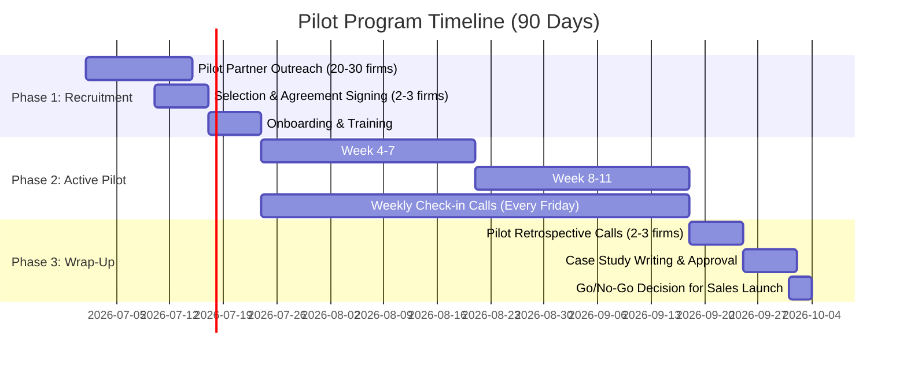

# Pilot Program Design and Success Criteria

**Sprint**: 05 - M&A Due Diligence Research Acceleration
**Task**: 05 - Implementation Roadmap
**Date**: 2025-11-18
**Author**: roadmap-planner skill

---

## Executive Summary

The pilot program is the **most critical phase** of the go-to-market strategy, serving as proof of concept, source of case studies, and foundation for product-market fit validation. This document outlines a structured 90-day pilot program with 2-3 carefully selected M&A advisory firms.

**Key Program Elements**:

- **Duration**: 90 days (Months 7-9 of implementation roadmap)
- **Participants**: 2-3 boutique M&A advisory firms or regional investment banks
- **Pricing**: Free for first 2 deals, 75% discount thereafter
- **Commitment**: Minimum 1 deal per firm, target 2-3 deals
- **Deliverable**: Quantified case studies with 30%+ time savings validation

**Success Metric**: 80%+ pilot satisfaction rate with 2+ participants agreeing to serve as customer references.

---

## Pilot Partner Selection Criteria

### Target Firm Profile

**Firm Size & Type**:

| Criteria | Target Range | Rationale |
|----------|--------------|-----------|
| **Firm Type** | Boutique M&A advisory or regional investment bank | Mid-market focus aligns with product positioning |
| **Professional Count** | 10-50 professionals | Large enough for credible case study, small enough for fast decision-making |
| **Annual Deal Volume** | 15-30 deals/year | Sufficient volume to test platform on 2-3 deals in 90 days |
| **Average Deal Size** | $50M-$500M enterprise value | Complexity requires robust due diligence, not too large for pilot risk |
| **Geographic Location** | US-based (diverse regions) | Example: 1 East Coast, 1 West Coast, 1 Texas/Midwest |

**Decision-Maker Profile**:

- **Title**: Managing Director, Partner, or Head of M&A
- **Pain Point Awareness**: Actively seeking to improve due diligence efficiency
- **Tech Adoption Attitude**: Early adopter or pragmatist (not laggard)
- **Time Availability**: Can commit to bi-weekly check-ins and end-of-pilot retrospective

### Selection Criteria Scorecard

Rate each potential pilot partner on 1-5 scale (5 = best fit):

| Criteria | Weight | Scoring Guidelines |
|----------|--------|--------------------|
| **Deal Volume** | 20% | 5 = 20+ deals/year, 1 = <10 deals/year |
| **Technical Sophistication** | 15% | 5 = Uses multiple SaaS tools, 1 = Email/Excel only |
| **Sponsor Engagement** | 25% | 5 = MD/Partner champion, 1 = Junior analyst advocate |
| **Reference Potential** | 20% | 5 = Strong brand + willing to be public reference, 1 = No reference commitment |
| **Feedback Quality** | 10% | 5 = Articulate, specific feedback in initial calls, 1 = Generic feedback |
| **Time Commitment** | 10% | 5 = Can dedicate resources for onboarding/training, 1 = Limited bandwidth |

**Minimum Qualifying Score**: 3.5/5.0 average across all criteria

---

## Pilot Program Structure

### Phase 1: Recruitment & Onboarding (Weeks 1-3)

#### Week 1-2: Pilot Partner Outreach

**Outreach Channels**:

1. **Warm Introductions (Preferred)**:
   - Leverage advisory board member connections
   - Angel investor/seed investor network referrals
   - Prior colleague relationships in M&A industry

2. **LinkedIn Targeted Outreach**:
   - Identify 20-30 Managing Directors at target firms
   - Personalized InMail highlighting pilot opportunity
   - Follow-up with phone calls to interested respondents

3. **Industry Event Networking**:
   - ACG regional chapter meetings (if available in Month 7)
   - M&A conferences and networking events

**Outreach Message Template**:

> Subject: [First Name], Pilot Opportunity: AI-Powered Due Diligence Research
>
> Hi [First Name],
>
> I'm reaching out because [Firm Name] fits the profile for a limited pilot program we're launching for AI-powered due diligence research automation.
>
> **What We're Offering**:
> - Free access to AI research platform for 2 M&A deals (90-day pilot)
> - Dedicated customer success support (weekly check-ins)
> - Target outcome: 30-50% time savings on research phase
>
> **What We're Asking**:
> - Feedback on product usability and value proposition
> - Participation in case study (can be anonymized)
> - 2-3 hours of time over 90 days (onboarding, check-ins, retrospective)
>
> Would you be open to a 20-minute call to explore if this could benefit [Firm Name]'s deal team?
>
> Best regards, 
> [Your Name]

**Target**: Secure 4-5 interested firms by end of Week 2, select 2-3 best fits

#### Week 3: Onboarding & Training

**Onboarding Checklist**:

- [ ] Pilot agreement signed (letter of intent with terms and data handling provisions)
- [ ] User accounts created for 3-5 professionals per firm
- [ ] Initial onboarding call (60 minutes) with demo and Q&A
- [ ] Training materials shared (user guide, video tutorials, FAQ)
- [ ] First deal identified for platform use
- [ ] Weekly check-in schedule established (Fridays at 10am ET, for example)

**Onboarding Call Agenda** (60 minutes):

1. **Introductions & Pilot Objectives** (10 min)
   - Team intros, pilot goals, success criteria

2. **Platform Demo** (30 min)
   - Live demonstration on sample deal scenario
   - Key features: AI research, VDR integration, report generation

3. **First Deal Planning** (15 min)
   - Identify first deal for platform use
   - Set research objectives and timelines
   - Assign point of contact for ongoing support

4. **Q&A & Next Steps** (5 min)
   - Address questions and concerns
   - Confirm weekly check-in schedule

**Deliverable**: All pilot partners onboarded and trained by end of Week 3

---

### Phase 2: Active Pilot Period (Weeks 4-11)

#### Week 4-11: Platform Usage & Support

**Pilot Partner Activities**:

- Use platform on minimum 1 deal (target 2-3 deals per firm)
- Conduct research tasks: company overview, industry analysis, competitive landscape, financial analysis
- Generate research reports and integrate into due diligence materials
- Provide real-time feedback via Slack/Teams channel

**Our Support Activities**:

- **Weekly Check-In Calls** (30 minutes every Friday)
  - Review usage metrics (research queries, reports generated, time spent)
  - Collect qualitative feedback (usability, accuracy, value)
  - Address technical issues or feature requests
  - Plan for upcoming deals

- **Slack/Teams Channel** (real-time support)
  - Dedicated channel per pilot partner
  - Response SLA: <2 hours during business hours, <24 hours off-hours

- **Usage Monitoring**
  - Track platform usage metrics (logins, research queries, reports generated)
  - Identify low-engagement partners and proactively reach out
  - Document all feedback in shared Airtable/Notion database

**Success Indicators (Weeks 4-11)**:

- 80%+ of pilot partners actively using platform weekly
- 3-5 research reports generated per partner per deal
- Average user satisfaction: 4/5 stars or higher (weekly pulse check)
- <3 critical bugs reported (platform stability)

---

### Phase 3: Retrospective & Case Study Development (Weeks 12-13)

#### Week 12: Pilot Retrospective Calls

**Retrospective Agenda** (60 minutes per partner):

1. **Quantitative Results Review** (20 min)
   - Present usage data: deals analyzed, reports generated, time spent
   - Calculate time savings vs. manual research (based on estimates)
   - Review cost savings (labor cost per hour × time saved)

2. **Qualitative Feedback Collection** (25 min)
   - What worked well? (features, support, usability)
   - What didn't work? (pain points, missing features, bugs)
   - Would you recommend to peers? (NPS question)
   - Would you pay for this product? At what price point?

3. **Case Study Participation** (10 min)
   - Request permission for case study (public or anonymized)
   - Agree on metrics to highlight (time savings, cost reduction, quality improvement)
   - Collect testimonial quote

4. **Next Steps** (5 min)
   - Discuss transition to paid plan (if interested)
   - Outline product roadmap and upcoming features
   - Thank you and closing

**Deliverable**: Retrospective completed with all 2-3 pilot partners

#### Week 13: Case Study Writing & Approval

**Case Study Structure** (2-3 pages each):

1. **Executive Summary**: One-paragraph overview with key metrics
2. **Customer Profile**: Firm description, deal volume, due diligence challenges
3. **Challenge**: Specific pain points before using platform
4. **Solution**: How platform was used in pilot deals
5. **Results**: Quantified time/cost savings and qualitative benefits
6. **Testimonial**: Quote from Managing Director or deal lead

**Metrics to Highlight**:

| Metric Category | Target Range | Example |
|----------------|--------------|---------|
| **Time Savings** | 30-50% reduction | "Reduced research phase from 40 hours to 25 hours per deal" |
| **Cost Savings** | $15K-$30K per deal | "Saved $22,500 in labor costs per deal (15 hours × $150/hour)" |
| **Quality Improvement** | Qualitative feedback | "Uncovered 3 competitive threats we would have missed manually" |
| **Deal Velocity** | Days saved | "Completed due diligence 7 days faster, accelerating close timeline" |

**Approval Process**:

1. Draft case study (Week 13, Days 1-3)
2. Share with pilot partner for legal/compliance review (Week 13, Days 4-5)
3. Incorporate feedback and finalize (Week 13, Days 6-7)
4. Publish on website and use in sales materials (Month 10+)

**Deliverable**: 2-3 approved case studies ready for sales enablement

---

## Pilot Program Economics

### Investment Analysis

| Cost Category | Detail | Total Cost (90 days) |
|---------------|--------|---------------------|
| **Customer Success Manager** | 1.5 FTE × $15K/mo × 3 months | $67,500 |
| **Engineering Support** | 1 FTE × $15K/mo × 3 months (bug fixes, feature requests) | $45,000 |
| **Product Manager** | 0.5 FTE × $7.5K/mo × 3 months (pilot oversight) | $22,500 |
| **Free Product Usage** | 2 deals/firm × 3 firms × $12K/deal (opportunity cost) | $72,000 |
| **TOTAL INVESTMENT** | - | **$207,000** |

### Expected Return

**Immediate Returns** (Months 7-12):

- **2-3 Case Studies**: Value = $50K-$75K (equivalent agency cost for professional case studies)
- **Product Feedback**: Value = $30K-$50K (equivalent user research/testing cost)
- **Pilot-to-Paid Conversions**: 1-2 paying customers × $120K ACV = $120K-$240K ARR

**Longer-Term Returns** (Months 13-24):

- **Sales Enablement**: Case studies contribute to 20-30% of sales wins (5-8 customers) = $600K-$960K ARR
- **Referrals**: Pilot partners refer 1-2 peers each = 2-4 additional customers = $240K-$480K ARR

**Total Expected Return (24 months)**: $960K-$1.68M ARR attributable to pilot program

**ROI Calculation**: ($960K - $207K) / $207K = **364% ROI** (conservative scenario)

---

## Success Criteria & KPIs

### Pilot Completion Criteria

The pilot is considered successful if:

1. **Usage Metrics**:
   - ✅ 2-3 pilot partners complete full 90-day program
   - ✅ 4-6 total deals analyzed across all partners
   - ✅ 80%+ weekly active usage rate (partners using platform at least once per week)

2. **Customer Satisfaction**:
   - ✅ 80%+ pilot partner satisfaction (4/5 stars or higher)
   - ✅ Net Promoter Score (NPS) of 30+ (would recommend to peers)
   - ✅ 2+ pilot partners agree to serve as customer references

3. **Value Validation**:
   - ✅ 30%+ time savings demonstrated on research phase (vs. manual)
   - ✅ $15K+ cost savings per deal (quantified)
   - ✅ Qualitative feedback confirms value proposition ("yes, I would pay for this")

4. **Case Study Deliverables**:
   - ✅ 2+ completed case studies with quantified metrics
   - ✅ 2+ testimonial quotes for marketing materials

5. **Product Quality**:
   - ✅ <5 critical bugs reported during pilot
   - ✅ 90%+ AI research accuracy (validated by pilot partner subject matter experts)
   - ✅ Zero security incidents or data breaches

### Weekly KPI Dashboard

Track these metrics every week during pilot:

| KPI | Target | Measurement Method |
|-----|--------|--------------------|
| **Active Users** | 6-9 (2-3 per firm) | Login frequency (weekly) |
| **Research Queries** | 30-50/week total | Platform analytics |
| **Reports Generated** | 10-15/week total | Platform analytics |
| **Avg. Time Saved/Deal** | 30-50% | User self-reported + time tracking |
| **Customer Satisfaction** | 4/5 stars | Weekly pulse survey (1 question) |
| **Support Tickets** | <5 critical/week | Zendesk or Slack channel |
| **Feature Requests** | Track all | Airtable database |

### Go/No-Go Decision Criteria (End of Pilot)

**Proceed to Sales Launch if**:

- ✅ 2+ pilot partners willing to convert to paid plans
- ✅ 2+ case studies completed with strong ROI metrics
- ✅ Product feedback indicates clear product-market fit (not major pivot needed)
- ✅ <10 critical product gaps identified (addressable in 3-6 months)

**Delay Sales Launch if**:

- ⚠️ <2 pilot partners satisfied (major product issues)
- ⚠️ Pilot partners would not pay for product at proposed pricing
- ⚠️ >20 critical product gaps (requires significant rework)

**Pivot or Terminate if**:

- ❌ Zero pilot partners willing to convert to paid
- ❌ No demonstrable time/cost savings vs. manual research
- ❌ Fundamental product-market fit issues (wrong target customer, wrong value proposition)

---

## Risk Mitigation Strategies

### Risk 1: Pilot Partner Recruitment Challenges

**Risk**: Difficulty finding 2-3 qualified firms willing to participate

**Mitigation**:

- Start outreach in Month 6 (1 month early) to allow buffer time
- Cast wider net (target 20-30 firms to get 2-3 participants)
- Offer additional incentives (e.g., 6-month free access post-pilot, executive advisory board membership)
- Leverage investor/advisor networks for warm introductions

### Risk 2: Low Pilot Engagement

**Risk**: Pilot partners sign up but don't actively use the platform

**Mitigation**:

- Weekly check-in calls (mandatory, not optional)
- Proactive outreach if usage drops below threshold (e.g., no logins for 1 week)
- Identify specific upcoming deals and schedule platform use in advance
- Provide white-glove support (e.g., "we'll run the first research query for you")

### Risk 3: Negative Feedback or Product Issues

**Risk**: Pilot reveals major product gaps or usability problems

**Mitigation**:

- Set expectations upfront that this is beta software (not production-grade)
- Prioritize critical bug fixes and feature requests during pilot (1-week SLA)
- Have engineering team on standby for rapid issue resolution
- Document all feedback and create transparent product roadmap

### Risk 4: Case Study Participation Refusal

**Risk**: Pilot partners satisfied but unwilling to participate in case studies

**Mitigation**:

- Include case study participation in pilot agreement (signed upfront)
- Offer anonymized case studies (no firm name, industry/region only)
- Provide financial incentive (e.g., $5K credit toward paid plan for public case study)
- Make it easy (we write the case study, they just review and approve)

### Risk 5: Insufficient ROI Validation

**Risk**: Unable to demonstrate clear time/cost savings

**Mitigation**:

- Establish baseline metrics before pilot (current time spent on research per deal)
- Use time-tracking tools during pilot to measure actual usage
- Conduct blind comparison (manual research vs. AI research on same company)
- Focus on qualitative value if quantitative metrics unclear (e.g., comprehensiveness, uncovering insights)

---

## Pilot Program Timeline & Milestones

---

## Pilot Partner Communication Plan

### Pre-Pilot Communication

**Week -2 to 0** (Before pilot start):

- **Pilot Agreement Email**: Formal agreement with terms, data handling, expectations
- **Welcome Email**: Introduction to team, onboarding schedule, training materials link
- **Pre-Pilot Survey**: Baseline questions (current research process, time spent, pain points)

### During Pilot Communication

**Weeks 1-11**:

- **Weekly Check-In Calls**: Every Friday, 30 minutes, agenda shared 24 hours in advance
- **Weekly Pulse Survey**: One-question email survey (How satisfied are you with the platform this week? 1-5 stars)
- **Real-Time Support**: Slack/Teams channel for questions, monitored 9am-6pm ET weekdays

### Post-Pilot Communication

**Week 12-13**:

- **Retrospective Invitation**: Email 1 week in advance with pre-read (usage data, key metrics)
- **Case Study Draft**: Share draft within 3 days of retrospective call
- **Thank You Gift**: Personalized thank you (e.g., branded swag, Amazon gift card, donation to charity of choice)

---

## References

1. SaaS Capital. (2023). "2023 B2B SaaS Retention Benchmarks for Private Companies." Retrieved from https://www.saas-capital.com/research/saas-retention-benchmarks-for-private-b2b-companies/

2. Mosaic Tech. (2024). "Renewal Rate Calculator for SaaS Startups: 2024 Guide." Retrieved from https://www.mosaic.tech/financial-metrics/renewal-rate

3. GTM Buddy. (2025). "B2B SaaS Product Launch Checklist 2025: No-Fluff & AI-Ready." Retrieved from https://gtmbuddy.ai/blog/b2b-saas-product-launch-checklist

4. Bravado War Room. (2024). "Sales Cycle Length by Industry - Investment Banking." Retrieved from https://bravado.co/war-room/posts/what-industry-are-you-in-how-long-are-your-sales-cycles-on-average

5. Recurly. (2024). "Customer Churn Benchmarks: How Does Your Churn Rate Compare?" Retrieved from https://recurly.com/research/churn-rate-benchmarks/
