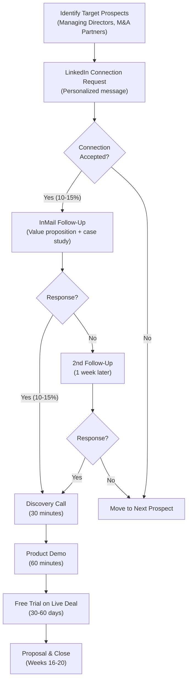

# Go-to-Market Strategy and Customer Acquisition

**Sprint**: 05 - M&A Due Diligence Research Acceleration
**Task**: 05 - Implementation Roadmap
**Date**: 2025-11-18
**Author**: roadmap-planner skill

---

## Executive Summary

This go-to-market (GTM) strategy outlines the customer acquisition approach for the AI-Powered Due Diligence Research Platform, targeting investment banks and M&A advisory firms. The strategy is optimized for the **7-15 month enterprise sales cycles** typical in financial services, with a focus on building credibility through case studies, thought leadership, and strategic partnerships.

**Customer Acquisition Channels** (by pipeline contribution):

1. **LinkedIn Outbound (40%)**: Targeted outreach to Managing Directors and M&A Partners
2. **Industry Events & Conferences (30%)**: ACG, M&A Source, IMN sponsorships and booth presence
3. **Referrals & Pilot Conversions (20%)**: Warm introductions from existing customers and pilot partners
4. **Content Marketing & Thought Leadership (10%)**: SEO, webinars, and LinkedIn articles

**Year 1 Target**: 12 paying customers, $1.44M ARR

**Year 2 Target**: 25 total customers (13 net new), $3.0M ARR

---

## Target Customer Segmentation

### Primary Target: Boutique M&A Advisory Firms (Tier 1)

**Profile**:

| Attribute | Description |
|-----------|-------------|
| **Firm Size** | 10-100 professionals (25-50 sweet spot) |
| **Annual Deal Volume** | 20-50 M&A transactions per year |
| **Average Deal Size** | $50M-$500M enterprise value (middle market) |
| **Geographic Focus** | US-based (expand internationally in Year 2-3) |
| **Decision Maker** | Managing Director, Partner, or Head of M&A |
| **Budget Authority** | $100K-$200K annual discretionary spending on technology |

**Estimated Market Size**:

- 500-700 boutique M&A advisory firms in US meeting criteria
- Serviceable Addressable Market (SAM): $60M-$84M (500-700 firms × $120K ACV)

**Why This Segment**:

- High deal volume generates recurring revenue (pay per deal model)
- Decision-making speed faster than large investment banks (3-6 months vs. 12-18 months)
- Pain point acute: smaller teams stretched across multiple deals simultaneously
- Reference-able: willing to provide testimonials and case studies

---

### Secondary Target: Regional Investment Banks (Tier 2)

**Profile**:

| Attribute | Description |
|-----------|-------------|
| **Firm Size** | 50-500 professionals (M&A division of 20-100) |
| **Annual Deal Volume** | 30-75 M&A transactions per year |
| **Average Deal Size** | $100M-$1B enterprise value |
| **Examples** | Piper Sandler, William Blair, Raymond James regional offices |
| **Decision Maker** | Head of M&A, Managing Director, or COO |
| **Budget Authority** | $200K-$500K annual technology budget |

**Estimated Market Size**:

- 100-150 regional investment banks in US
- Serviceable Addressable Market (SAM): $18M-$27M (150 firms × $120K-$180K ACV)

**Why This Segment**:

- Higher ACV potential ($150K-$250K due to volume discounts)
- Enterprise validation: success here enables up-market expansion to bulge bracket
- Less competition: under-served by existing due diligence tools

---

### Tertiary Target: Corporate Development Teams (Tier 3)

**Profile** (Deprioritized in Year 1, focus in Year 2):

| Attribute | Description |
|-----------|-------------|
| **Company Size** | Mid-cap to large-cap ($500M-$10B market cap) |
| **Deal Volume** | 3-10 acquisitions per year (active acquirers) |
| **Industry Focus** | Technology, healthcare, industrials (serial acquirers) |
| **Decision Maker** | VP/Head of Corporate Development, M&A Director |
| **Budget Authority** | Part of corporate development budget ($500K-$2M) |

**Why Deprioritized in Year 1**:

- Longer sales cycles (9-18 months) due to procurement processes
- Lower deal volume vs. advisory firms (less revenue per customer)
- Requires deeper product integrations (ERP, CRM, internal systems)

---

## Customer Acquisition Channels

### Channel 1: LinkedIn Outbound (40% of Pipeline)

**Target Volume**: 500+ targeted connections per month (Months 13-24)

**Process**:

**Conversion Funnel Metrics**:

| Stage | Volume | Conversion Rate | Next Stage |
|-------|--------|-----------------|------------|
| **Connection Requests Sent** | 500/month | 10% | 50 connections |
| **Connections Accepted** | 50/month | 15% | 7-8 InMail responses |
| **Discovery Calls** | 8/month | 50% | 4 demos |
| **Product Demos** | 4/month | 75% | 3 trials |
| **Free Trials** | 3/month | 33% | 1 closed deal |
| **Closed Deals** | **1/month** | - | - |

**Result**: 12 customers in Year 1 from LinkedIn channel (40% of total)

**Resource Requirements**:

- **Sales Development Rep (SDR)**: 1 FTE dedicated to LinkedIn outbound
- **Account Executives**: Handle demos and trials (shared with other channels)
- **Tools**: LinkedIn Sales Navigator ($100/mo), Outreach.io or SalesLoft ($150/mo)

**Messaging Framework**:

**Connection Request** (300 characters max):

> Hi [First Name], I help M&A advisors like [Firm Name] save 30-50% on due diligence research time using AI. Would you be open to connecting to discuss how [Competitor Firm] reduced research from 40 to 25 hours per deal?

**InMail Follow-Up** (200 words):

> Hi [First Name],
>
> Thanks for connecting. I wanted to share a recent case study that might be relevant to [Firm Name].
>
> **Challenge**: [Competitor Firm], a boutique M&A advisor, was struggling to keep up with research demands across 30+ deals/year with a team of just 15 professionals.
>
> **Solution**: They piloted our AI-powered due diligence research platform on 3 deals.
>
> **Results**:
> - 38% reduction in research time (40 hours → 25 hours per deal)
> - $22,500 saved in labor costs per deal
> - Uncovered 2-3 competitive insights per deal that manual research missed
>
> Would you be open to a 20-minute call to explore if this could benefit [Firm Name]? No obligation – just a conversation to see if it's a fit.
>
> [Link to case study PDF]
>
> Best regards, 
> [Your Name]

---

### Channel 2: Industry Events & Conferences (30% of Pipeline)

**Target Events** (Year 1):

| Event | Date | Location | Sponsorship Cost | Expected Leads | Cost per Lead |
|-------|------|----------|------------------|----------------|---------------|
| **ACG M&A East** | Sept 2027 | Philadelphia | $30,000 | 75 | $400 |
| **ACG M&A South** | Feb 2027 | Atlanta | $30,000 | 75 | $400 |
| **ACG M&A West** | May 2027 | Napa, CA | $35,000 | 60 | $583 |
| **M&A Source Summit** | Oct 2027 | TBD | $25,000 | 50 | $500 |
| **ACG InterGrowth** | Apr 2027 | Las Vegas | $50,000 | 100 | $500 |
| **TOTAL** | - | - | **$170,000** | **360 leads** | **$472 avg** |

**Event Execution Playbook**:

**Pre-Event (4-6 weeks before)**:

1. **Booth Design & Materials**:
   - 10×10 booth with branded backdrop and demo station
   - Case study one-pagers (print 500 copies)
   - Branded swag (USB drives with demo video, notebooks, pens)

2. **Pre-Event Outreach**:
   - LinkedIn messages to attendees: "Will you be at ACG M&A East? Let's grab coffee to discuss [topic]"
   - Schedule 10-15 pre-booked meetings (30 minutes each) in nearby coffee shop or hotel lobby

3. **Speaking Opportunity**:
   - Submit proposal for panel discussion: "AI in M&A: Separating Hype from Reality"
   - Position as educational (not sales pitch)

**During Event**:

1. **Booth Engagement** (6-8 hours per day):
   - 2 team members staffing booth at all times
   - Interactive demo on iPad: "See AI research on your target company in 60 seconds"
   - Lead capture: iPad app or Google Form with qualifying questions

2. **Networking**:
   - Attend all networking receptions and dinners
   - Target: 20-30 meaningful conversations per day
   - Follow-up protocol: LinkedIn connection + photo from event

3. **Pre-Booked Meetings**:
   - 10-15 scheduled 1:1 meetings (30 minutes each)
   - Coffee shop or quiet corner of venue
   - Bring iPad for personalized demo

**Post-Event (Week after)**:

1. **Lead Follow-Up** (Within 48 hours):
   - Email to all booth visitors: "Great to meet you at ACG M&A East. Here's the case study we discussed."
   - LinkedIn connection requests with personalized note

2. **Lead Qualification** (Week 1-2):
   - SDR calls to qualify leads (firm size, deal volume, interest level)
   - Segment into Hot/Warm/Cold buckets

3. **Demo Scheduling** (Week 2-4):
   - AEs schedule demos with qualified hot leads
   - Target: 10-15 demos per event

**Conversion Funnel** (Per Event):

| Stage | Volume | Conversion Rate |
|-------|--------|-----------------|
| **Booth Visitors** | 75-100 | - |
| **Qualified Leads** | 50-75 (75%) | - |
| **Discovery Calls** | 15-20 (25%) | - |
| **Product Demos** | 10-15 (67%) | - |
| **Free Trials** | 5-7 (50%) | - |
| **Closed Deals** | 1-2 (25%) | - |

**Result**: 1-2 customers per event × 5 events = 5-10 customers/year (30% of total)

---

### Channel 3: Referrals & Pilot Conversions (20% of Pipeline)

**Source 1: Pilot Partner Referrals**

**Strategy**:

- Request 1-2 referrals from each pilot partner during retrospective call
- Incentivize referrals: $5,000 credit per successful customer referral
- Make it easy: "Who else in your network struggles with due diligence research?"

**Target**: 2-3 pilot partners × 1-2 referrals each = 4-6 referral leads

**Conversion**: 50% close rate (warm intros) = 2-3 customers from pilot referrals

**Source 2: Existing Customer Referrals**

**Strategy**:

- Formal referral program launched in Month 18 (after 8-12 paying customers)
- Incentive: $5,000-$10,000 credit or 10% commission for successful referral
- Trigger: After 90 days of successful usage (customer is happy and sees value)

**Target**: 10 paying customers × 0.5 referrals each = 5 referral leads

**Conversion**: 60% close rate = 3 customers from customer referrals

**Source 3: Advisory Board & Investor Introductions**

**Strategy**:

- Recruit 3-5 industry advisors (former M&A managing directors, PE partners)
- Advisor compensation: Equity (0.25-0.5%) + $10K-$25K annual cash
- Advisor expectation: 2-3 warm introductions per quarter

**Target**: 4 advisors × 2 intros/quarter × 4 quarters = 32 introductions

**Conversion**: 15% close rate = 4-5 customers from advisor intros

**Total Referral Channel**: 2-3 (pilot) + 3 (customer) + 4-5 (advisor) = **9-11 customers/year (20% of pipeline)**

---

### Channel 4: Content Marketing & Thought Leadership (10% of Pipeline)

**Strategy**: Establish credibility as M&A AI thought leader, attract inbound leads through SEO and social

**Tactics**:

**1. LinkedIn Thought Leadership (3x/week)**:

- **Format**: Articles (500-1000 words) on M&A trends, AI in due diligence, deal insights
- **Topics**:
  - "5 Ways AI is Transforming M&A Due Diligence in 2027"
  - "The Hidden Cost of Manual Research: What M&A Advisors Don't Calculate"
  - "Case Study: How [Anonymous Firm] Saved $90K on Due Diligence in Q1"
- **Goal**: 10,000+ profile views/month, 500+ post engagements/week
- **Lead Generation**: CTA to download case study or book demo

**2. SEO-Optimized Website Content**:

- **Target Keywords** (50-200 search volume/month):
  - "M&A due diligence software"
  - "AI-powered due diligence"
  - "Investment banking research tools"
  - "M&A research automation"
- **Content**:
  - 10-15 blog posts (1,500-2,500 words each)
  - Ultimate guides ("The Complete Guide to M&A Due Diligence in 2027")
  - Comparison pages ("AI vs. Manual Due Diligence: ROI Analysis")
- **Goal**: 500-1,000 organic website visitors/month by Month 18

**3. Quarterly Webinars** (4x/year):

- **Format**: 45-minute educational webinar + 15-minute Q&A
- **Topics**:
  - "AI in M&A: What Works, What Doesn't, and What's Next"
  - "How to Cut Due Diligence Time in Half (Without Sacrificing Quality)"
  - "Building a Scalable M&A Research Process for Growing Advisory Firms"
- **Promotion**: LinkedIn ads ($2K/webinar), email to prospect list, partner co-marketing
- **Goal**: 50-100 registrants/webinar, 30-50 attendees
- **Lead Generation**: Follow-up email with case study + demo offer

**4. Podcast Guesting** (2x/quarter):

- **Target Podcasts**: M&A, private equity, and investment banking podcasts
- **Examples**: "M&A Science Podcast," "Private Equity Funcast," "Deal Room"
- **Topics**: AI in M&A, due diligence best practices, scaling advisory firms
- **Goal**: Brand awareness and credibility (not direct lead gen)

**Conversion Funnel**:

| Source | Leads/Year | Conversion to Demo | Closed Deals |
|--------|------------|-------------------|--------------|
| **SEO/Website** | 120 | 10% (12 demos) | 3 customers |
| **Webinars** | 80 | 15% (12 demos) | 3 customers |
| **LinkedIn Content** | 50 | 20% (10 demos) | 2 customers |
| **TOTAL** | **250** | **34 demos** | **8 customers** |

**Result**: 8 customers/year from inbound content (10% of pipeline) - Note: Lower conversion vs. outbound due to colder leads

**Resource Requirements**:

- **Marketing Manager**: 1 FTE (content creation, webinar coordination, SEO)
- **Freelance Writers**: 2-3 blog posts/month × $500/post = $1,500/month
- **Webinar Tools**: Zoom Webinar ($50/month)
- **SEO Tools**: Ahrefs or SEMrush ($200/month)
- **LinkedIn Ads**: $2,000/month for webinar promotion

---

## Sales Process & Methodology

### Sales Stage Breakdown

**Stage 1: Outreach & Qualification (Week 0)**

- **Goal**: Secure discovery call with qualified prospect
- **Activities**: LinkedIn outreach, event follow-up, referral introduction
- **Qualification Criteria** (BANT):
  - **Budget**: $100K+ annual technology budget
  - **Authority**: Speaking with Managing Director, Partner, or decision-maker
  - **Need**: Struggling with research efficiency, deal velocity, or team capacity
  - **Timeline**: Active deal pipeline (looking to improve process in next 3-6 months)

**Stage 2: Discovery Call (Week 1-2, 30 minutes)**

- **Goal**: Understand pain points, confirm fit, schedule demo
- **Agenda**:
  - Current due diligence process (time, team, tools)
  - Pain points (bottlenecks, quality issues, cost)
  - Desired outcomes (time savings, cost reduction, quality improvement)
  - Next steps (schedule demo)
- **Outcome**: 80% of qualified discovery calls convert to demo

**Stage 3: Product Demo (Week 2-4, 60 minutes)**

- **Goal**: Demonstrate value proposition, address objections, propose trial
- **Demo Flow**:
  - Live demo on prospect's target company (personalized)
  - Show research query → AI analysis → report generation (5 minutes end-to-end)
  - Highlight key differentiators (accuracy, citations, VDR integration)
  - Share case study (time/cost savings)
- **Q&A**: Address technical, security, and integration questions
- **Outcome**: 75% of demos convert to trial

**Stage 4: Free Trial (Week 4-12, 30-60 days)**

- **Goal**: Prove value on real deal, build champion, justify investment
- **Trial Structure**:
  - Free trial on 1 live deal (no credit card required)
  - Weekly check-in calls (15 minutes)
  - Dedicated customer success manager
  - Track usage and ROI metrics
- **Success Criteria**: 10+ research queries, 3+ reports generated, positive feedback
- **Outcome**: 33% of trials convert to paid (industry benchmark for enterprise SaaS)

**Stage 5: Proposal & Negotiation (Week 12-16)**

- **Goal**: Present pricing, negotiate terms, address final objections
- **Proposal Components**:
  - Pricing based on deal volume ($8K-$15K per deal, volume discounts)
  - Annual contract with quarterly payments
  - SOC 2 Type II and security documentation
  - Customer references and case studies
- **Common Objections**:
  - **"Too expensive"**: Show ROI calculation (labor cost savings > subscription cost)
  - **"Need to evaluate competitors"**: Offer side-by-side comparison on same deal
  - **"Security concerns"**: Provide SOC 2 report, architecture diagrams, customer references
- **Outcome**: 80% of proposals result in contract signature (if made it to this stage)

**Stage 6: Contract Signature & Onboarding (Week 16-20)**

- **Goal**: Execute contract, onboard team, ensure successful first use
- **Activities**:
  - Legal/procurement review and contract signature
  - Kick-off call with customer success team
  - User training (2-3 sessions)
  - First production deal support
- **Success Metric**: Customer uses platform on first deal within 30 days of contract

---

## Pricing & Packaging Strategy

### Pricing Model: Pay-Per-Deal

**Rationale**:

- **Aligns with customer value**: Pay when they use it (active deal), not flat SaaS fee
- **Lower barrier to entry**: Easier to justify $12K per deal vs. $120K upfront annual fee
- **Scales with usage**: High-volume customers pay more, low-volume pay less (fair)

**Pricing Tiers**:

| Tier | Annual Deal Volume | Price per Deal | Annual Cost (est) | Target Customer |
|------|-------------------|----------------|-------------------|-----------------|
| **Starter** | 1-10 deals/year | $15,000/deal | $15K-$150K | Small boutiques |
| **Professional** | 11-30 deals/year | $12,000/deal | $132K-$360K | Mid-sized advisors |
| **Enterprise** | 31-75 deals/year | $10,000/deal | $310K-$750K | Regional banks |
| **Enterprise Plus** | 76+ deals/year | Custom pricing | $800K+ | Bulge bracket (Year 2+) |

**Volume Discounts**:

- 10% discount for annual prepayment
- 15% discount for multi-year contracts (2-3 years)

**Additional Services** (Optional Add-Ons):

- **Dedicated Customer Success Manager**: $25K/year
- **Custom Integrations**: $50K-$100K one-time + $10K/year maintenance
- **White-Glove Research Support**: $5K/deal for hands-on research assistance

---

## Customer Acquisition Cost (CAC) & LTV Analysis

### CAC Calculation (Year 1)

| Expense Category | Annual Cost |
|------------------|-------------|
| **Sales Team** (VP Sales + 2 AEs + 1 SDR) | $480,000 |
| **Marketing** (Manager + events + content) | $270,000 |
| **Customer Success** (2 CSMs, trial support) | $180,000 |
| **TOTAL Sales & Marketing** | **$930,000** |

**New Customers (Year 1)**: 12

**CAC**: $930,000 / 12 = **$77,500 per customer**

**Industry Benchmark** (Financial Services B2B SaaS): $14,772 (small) to $75,000+ (enterprise) [First Page Sage, 2024]

**Assessment**: CAC is high but acceptable for Year 1 (building foundation, long sales cycles)

### Lifetime Value (LTV) Calculation

**Assumptions**:

- **Average ACV**: $120,000 (10 deals/year × $12K/deal)
- **Gross Margin**: 80% (typical for SaaS)
- **Customer Lifetime**: 4 years (based on 90% annual retention)
- **Expansion Revenue**: 10% year-over-year (customers do more deals)

**LTV Calculation**:

LTV = (ACV × Gross Margin × Customer Lifetime) + Expansion Revenue

LTV = ($120K × 0.80 × 4 years) + ($120K × 0.10 × 3 years) = **$384K + $36K = $420K**

### LTV:CAC Ratio

**Year 1**: $420K LTV / $77.5K CAC = **5.4:1**

**Industry Benchmark**: 3:1 to 5:1 is considered healthy [OPEXEngine, 2024]

**Assessment**: Strong LTV:CAC ratio validates go-to-market strategy

### Payback Period

**Months to Recover CAC**: $77,500 / ($120,000 / 12 months) = **7.75 months**

**Industry Benchmark**: 12-18 months for enterprise SaaS

**Assessment**: Faster than benchmark (good) - assumes annual prepayment

---

## Go-to-Market Investment Summary (Year 1)

| Category | Headcount | Annual Cost |
|----------|-----------|-------------|
| **Sales Team** | 4 FTE | $480,000 |
| **Marketing Team** | 1 FTE + freelancers | $270,000 |
| **Customer Success** | 2 FTE | $180,000 |
| **Events & Sponsorships** | - | $170,000 |
| **Marketing Tools & Ads** | - | $50,000 |
| **TOTAL GTM Investment** | **7 FTE** | **$1,150,000** |

**Expected Return (Year 1)**:

- **Customers**: 12
- **ARR**: $1.44M (12 × $120K)
- **ARR per GTM Dollar**: $1.25 ARR per $1 invested

**Expected Return (Year 2)**:

- **New Customers**: 25 (13 net new + 12 retained)
- **ARR**: $3.0M (assumes 90% retention + expansion)
- **Cumulative ARR per GTM Dollar (Year 1-2)**: $2.10 ARR per $1 invested

---

## References

1. First Page Sage. (2024). "B2B SaaS Customer Acquisition Cost: 2024 Report." Retrieved from https://firstpagesage.com/reports/b2b-saas-customer-acquisition-cost-2024-report/

2. OPEXEngine. (2024). "A B2B SaaS CFO's Guide to Customer Acquisition Cost (CAC)." Retrieved from https://www.opexengine.com/b2b-saas-cfos-cac/

3. SaaS Capital. (2023). "2023 B2B SaaS Retention Benchmarks for Private Companies." Retrieved from https://www.saas-capital.com/research/saas-retention-benchmarks-for-private-b2b-companies/

4. Association for Corporate Growth. (2024). "ACG Events Calendar and Sponsorship Opportunities." Retrieved from https://www.acg.org/events

5. Bravado War Room. (2024). "Sales Cycle Length by Industry - Financial Services." Retrieved from https://bravado.co/war-room/posts/what-industry-are-you-in-how-long-are-your-sales-cycles-on-average
