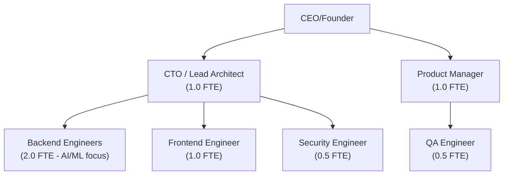
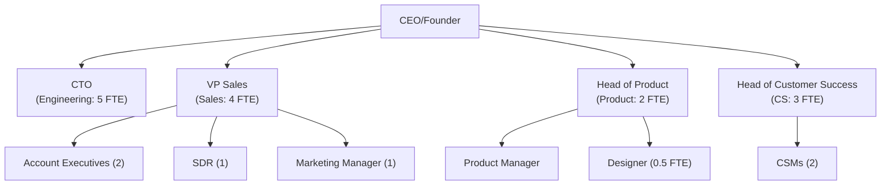
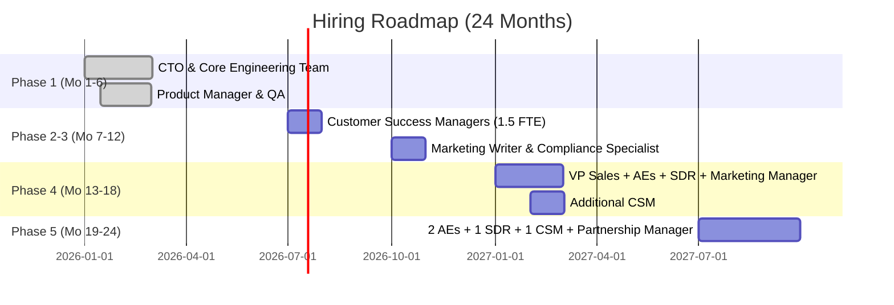

# Resource Planning: Team Hiring and Budget Allocation

**Sprint**: 05 - M&A Due Diligence Research Acceleration
**Task**: 05 - Implementation Roadmap
**Date**: 2025-11-18
**Author**: roadmap-planner skill

---

## Executive Summary

This resource plan outlines the team hiring roadmap and budget allocation across the 24-month implementation timeline for the AI-Powered Due Diligence Research Platform. The plan is phased to match product development, pilot, and sales launch milestones, growing from **6 FTE in Month 1** to **19 FTE by Month 24**.

**Total Investment (24 months)**: $3,367,000

**Breakdown by Function**:

- **Engineering & Product (47%)**: $1,575,000
- **Sales & Marketing (34%)**: $1,150,000
- **Customer Success (13%)**: $432,500
- **Operations & Compliance (6%)**: $210,000

**Critical Hires by Phase**:

- **Phase 1 (Mo 1-6)**: CTO, engineers, product manager
- **Phase 2-3 (Mo 7-12)**: Customer success, compliance specialist
- **Phase 4 (Mo 13-18)**: VP Sales, account executives, marketing manager
- **Phase 5 (Mo 19-24)**: Additional sales/CS capacity, partnership manager

---

## Hiring Roadmap by Phase

### Phase 1: Product Development (Months 1-6)

**Team Size**: 6.0 FTE

**Organizational Chart**:

**Hiring Plan**:

| Role | Priority | Hire Date | Rationale |
|------|----------|-----------|-----------|
| **CTO / Lead Architect** | P0 | Month 1, Week 1 | Critical for technical vision and architecture design |
| **Backend Engineers (2)** | P0 | Month 1, Weeks 2-3 | Core AI/ML development capacity |
| **Product Manager** | P0 | Month 1, Week 2 | Define requirements and coordinate development |
| **Frontend Engineer** | P1 | Month 2, Week 1 | Can delay slightly while backend foundation built |
| **Security Engineer** | P1 | Month 2, Week 2 | Part-time initially, full-time as SOC 2 prep ramps |
| **QA Engineer** | P2 | Month 4, Week 1 | Needed for beta testing phase |

**Compensation Ranges** (San Francisco / Remote):

| Role | Base Salary | Equity | Total Comp (Annual) |
|------|-------------|--------|-------------------|
| **CTO / Lead Architect** | $180K-$220K | 2-4% | $200K-$240K |
| **Backend Engineer (AI/ML)** | $140K-$170K | 0.25-0.5% | $150K-$180K |
| **Frontend Engineer** | $130K-$160K | 0.25-0.5% | $140K-$170K |
| **Security Engineer** | $150K-$180K | 0.25-0.5% | $160K-$190K |
| **Product Manager** | $140K-$170K | 0.5-1% | $150K-$180K |
| **QA Engineer** | $100K-$130K | 0.1-0.25% | $110K-$140K |

**Budget (6 months)**: $645,000 (includes infrastructure and tools)

---

### Phase 2: Pilot Program (Months 7-9)

**Team Size**: 9.0 FTE (6 existing + 3 new)

**New Hires**:

| Role | FTE | Hire Date | Rationale |
|------|-----|-----------|-----------|
| **Customer Success Manager** | 1.5 | Month 7, Week 1 | Dedicated pilot support (0.5 FTE per pilot partner) |

**Why 1.5 FTE CSM**:

- 2-3 pilot partners require hands-on support
- Weekly check-ins, onboarding, real-time Slack support
- Can be 2 part-time CSMs or 1 full-time + 1 contractor

**Budget (3 months)**: $112,500 (mostly CSM labor + pilot support)

---

### Phase 3: Case Study Development & Refinement (Months 10-12)

**Team Size**: 11.0 FTE (9 existing + 2 new)

**New Hires**:

| Role | FTE | Hire Date | Rationale |
|------|-----|-----------|-----------|
| **Additional Backend Engineer** | 1.0 | Month 10, Week 1 | Product refinement and Datasite integration |
| **Marketing/Content Writer** | 0.5 | Month 11, Week 1 | Case study writing, website content |
| **Compliance/Security Specialist** | 0.5 → 1.0 | Month 10 | Ramp to full-time for SOC 2 Type II prep |

**Compensation**:

- **Marketing/Content Writer** (Contractor): $7,500/month (part-time)
- **Compliance Specialist**: $150K-$180K annual (full-time)

**Budget (3 months)**: $257,500 (includes SOC 2 audit fees)

---

### Phase 4: Sales Launch & Initial Scale (Months 13-18)

**Team Size**: 15.0 FTE (11 existing + 4 new in Month 13)

**Organizational Chart**:

**New Hires (Month 13)**:

| Role | FTE | Compensation | Rationale |
|------|-----|--------------|-----------|
| **VP Sales / Head of Sales** | 1.0 | $180K base + 20% var = $216K | Lead sales strategy, manage AEs, close enterprise deals |
| **Account Executives (2)** | 2.0 | $120K base + 20% var = $144K ea | Run demos, trials, and close deals |
| **Sales Development Rep** | 1.0 | $70K base + 15% var = $80K | LinkedIn outbound, lead qualification, demo scheduling |
| **Marketing Manager** | 1.0 | $120K-$140K | Content, events, webinars, SEO |
| **Customer Success Manager** | +1.0 | $80K-$100K | Support paying customers (target: 1 CSM per 6-8 customers) |

**Rationale for Timing**:

- Wait until **Month 13** to hire sales team (after pilot case studies ready)
- Sales team needs credible case studies and references to sell effectively
- Hiring earlier = wasted capacity (no one to sell to without proof points)

**Expanded Team by Month 18**:

- **Sales**: VP Sales + 2 AEs + 1 SDR = 4 FTE
- **Marketing**: 1 Marketing Manager + 1 Designer (0.5 FTE) = 1.5 FTE
- **Customer Success**: 2-3 CSMs (depending on customer count)

**Budget (6 months)**: $822,000

---

### Phase 5: Market Expansion & Growth Acceleration (Months 19-24)

**Team Size**: 19.0 FTE (15 existing + 4 new)

**New Hires**:

| Role | FTE | Hire Date | Compensation | Rationale |
|------|-----|-----------|--------------|-----------|
| **Account Executives (2)** | 2.0 | Month 19 | $144K each | Expand sales capacity for 25+ customer target |
| **Sales Development Rep** | 1.0 | Month 20 | $80K | Support increased outbound volume |
| **Customer Success Manager** | 1.0 | Month 19 | $90K | Support 15-20 customers (1 CSM per 8 customers) |
| **Partnership Manager** | 1.0 | Month 21 | $140K-$160K | Manage VDR and association partnerships |

**Final Team Structure (Month 24)**:

| Function | Roles | FTE | % of Team |
|----------|-------|-----|-----------|
| **Engineering** | CTO + 4 engineers | 5.0 | 26% |
| **Product** | PM + Designer | 1.5 | 8% |
| **Sales** | VP + 4 AEs + 2 SDRs | 7.0 | 37% |
| **Marketing** | Manager + Freelancers | 2.0 | 11% |
| **Customer Success** | 4 CSMs | 4.0 | 21% |
| **Operations** | Finance, HR, Admin (contractors) | 2.0 | 11% |
| **TOTAL** | - | **19.0** | **100%** |

**Budget (6 months)**: $1,530,000

---

## Hiring Strategy & Recruitment

### Talent Sources by Role

**Engineering & Product**:

- **Remote-first hiring**: Access global talent pool (US, Canada, LATAM, Eastern Europe)
- **Sources**: AngelList, Hired, LinkedIn, Y Combinator talent network
- **Compensation**: Competitive with Series A SaaS startups (top 25th percentile)
- **Equity**: 0.1-4% depending on role and seniority (4-year vest, 1-year cliff)

**Sales & Marketing**:

- **Geography**: US-based preferred (time zone overlap with customers)
- **Experience**: 3-5 years in B2B SaaS sales (financial services experience a plus)
- **Sources**: LinkedIn recruiter, SaaS sales communities (Pavilion, Revenue Collective), referrals
- **Compensation**: 60-70% base, 30-40% variable (uncapped commission)

**Customer Success**:

- **Geography**: US-based (customer-facing role)
- **Experience**: 2-4 years in SaaS customer success, preferably financial services
- **Sources**: LinkedIn, customer success communities (Gain Grow Retain), referrals
- **Compensation**: 90% base, 10% bonus tied to NPS and retention

### Hiring Timeline by Quarter

---

## Budget Allocation by Category

### 24-Month Budget Summary

| Category | Mo 1-6 | Mo 7-9 | Mo 10-12 | Mo 13-18 | Mo 19-24 | **TOTAL** |
|----------|--------|--------|----------|----------|----------|-----------|
| **Salaries & Wages** | $540,000 | $90,000 | $195,000 | $660,000 | $1,260,000 | **$2,745,000** |
| **Recruiting & Hiring** | $30,000 | $5,000 | $10,000 | $40,000 | $30,000 | **$115,000** |
| **Infrastructure & Tools** | $60,000 | $12,500 | $22,500 | $90,000 | $120,000 | **$305,000** |
| **Events & Marketing** | $10,000 | $5,000 | $5,000 | $90,000 | $120,000 | **$230,000** |
| **Compliance & Legal** | $5,000 | $0 | $25,000 | $10,000 | $10,000 | **$50,000** |
| **TOTAL** | **$645,000** | **$112,500** | **$257,500** | **$890,000** | **$1,540,000** | **$3,445,000** |

**Note**: Total slightly higher than roadmap summary due to rounding and buffer for contingencies

### Infrastructure & Tools Budget (Annual)

| Category | Tools | Annual Cost |
|----------|-------|-------------|
| **Cloud Hosting** | AWS or GCP (compute, storage, AI/ML services) | $60,000 |
| **SaaS Tools** | GitHub, Slack, Notion, Figma, Zoom | $15,000 |
| **Sales & Marketing** | HubSpot CRM, LinkedIn Sales Navigator, Outreach.io | $30,000 |
| **Customer Success** | Zendesk, ChurnZero, Calendly | $18,000 |
| **Security & Compliance** | SOC 2 audit, pen testing, security tools | $25,000 |
| **AI/ML Services** | OpenAI API, data sources, NLP tools | $50,000 |
| **TOTAL (Year 1)** | - | **$198,000** |
| **TOTAL (Year 2)** | - | **$250,000** (scales with usage) |

---

## Equity Compensation Plan

### Equity Pool Allocation

**Total Pool**: 15% of fully diluted shares reserved for employee equity

**Allocation by Role Band** (% of pool):

| Role Level | Equity Range | Vesting | Typical Roles |
|------------|--------------|---------|---------------|
| **C-Level** | 2-4% | 4yr, 1yr cliff | CTO, VP Sales (if C-level) |
| **VP/Director** | 0.5-1.5% | 4yr, 1yr cliff | VP Sales, Head of Product |
| **Senior IC** | 0.25-0.75% | 4yr, 1yr cliff | Senior Engineers, Lead PM |
| **Mid-Level** | 0.1-0.3% | 4yr, 1yr cliff | Engineers, Product Managers, AEs |
| **Junior** | 0.05-0.15% | 4yr, 1yr cliff | Junior Engineers, SDRs, CSMs |

**Equity Budget (First 24 Months)**:

- **CTO**: 3% (largest grant)
- **VP Sales**: 1.5%
- **Engineering Team (4)**: 1.5% total (0.3-0.5% each)
- **Sales Team (4 AEs)**: 1.0% total (0.25% each)
- **Other Roles**: 2.0%
- **TOTAL GRANTED**: 9% of equity pool (60% of 15% reserved)

**Remaining Pool**: 6% reserved for future hires (Months 25-48)

---

## Team Growth Projections (Months 25-36)

**Assuming Successful Launch** (25 customers, $3M ARR by Month 24):

### Year 3 Hiring Plan (Months 25-36)

| Function | Month 24 | Month 36 | Net New Hires |
|----------|----------|----------|---------------|
| **Engineering** | 5 | 8 | +3 (platform scale, new features) |
| **Product** | 1.5 | 3 | +1.5 (product managers, designers) |
| **Sales** | 7 | 12 | +5 (AEs, SDRs, Sales Engineers) |
| **Marketing** | 2 | 4 | +2 (demand gen, content, brand) |
| **Customer Success** | 4 | 8 | +4 (1 CSM per 8-10 customers) |
| **Operations** | 2 | 5 | +3 (finance, HR, IT, legal) |
| **TOTAL** | **19** | **40** | **+21 (+110%)** |

**Year 3 Budget Estimate**: $4.5M-$5.5M (team + infrastructure + marketing)

**Target ARR (Month 36)**: $7M-$10M (assuming 50-70 customers)

---

## Contractor vs. Full-Time Employee Strategy

### When to Use Contractors

**Use Contractors for**:

- **Marketing Content**: Blog writers, graphic designers, video editors
- **Specialized Projects**: SOC 2 compliance consultant, penetration testing
- **Operations**: Part-time CFO, HR consultant, legal counsel (pre-Series A)
- **Customer Success (Early)**: Part-time CSMs during pilot phase

**Benefits**:

- Flexibility: Scale up/down based on needs
- Cost savings: No benefits, payroll taxes, equity
- Speed: Faster to onboard than FTE hiring process

**Estimated Contractor Spend**: $150K/year (Year 1), $200K/year (Year 2)

### When to Hire Full-Time

**Hire Full-Time for**:

- **Core Product Development**: Engineering, product management
- **Sales & Customer Success**: Customer-facing roles requiring deep product knowledge
- **Leadership**: CTO, VP Sales, Head of Product

**Benefits**:

- Long-term commitment and ownership (equity alignment)
- Deep product and customer knowledge
- Culture building and team cohesion

---

## Key Performance Indicators (KPIs) by Function

### Engineering KPIs

| Metric | Target | Measurement Frequency |
|--------|--------|----------------------|
| **Sprint Velocity** | 80% of planned story points completed | Bi-weekly |
| **Bug Density** | <5 critical bugs per 1,000 lines of code | Monthly |
| **Platform Uptime** | 99.5% availability | Monthly |
| **AI Research Accuracy** | 90%+ validated by users | Quarterly |

### Sales KPIs

| Metric | Target | Measurement Frequency |
|--------|--------|----------------------|
| **Demos Scheduled** | 4-5 per AE per month | Monthly |
| **Demo-to-Trial Conversion** | 75% | Quarterly |
| **Trial-to-Close Conversion** | 33% | Quarterly |
| **Average Deal Size** | $120K ACV | Quarterly |
| **Sales Cycle Length** | 5-6 months | Quarterly |

### Customer Success KPIs

| Metric | Target | Measurement Frequency |
|--------|--------|----------------------|
| **Net Promoter Score (NPS)** | 50+ | Quarterly |
| **Gross Revenue Retention** | 90%+ | Annually |
| **Net Revenue Retention** | 105-110% | Annually |
| **Customer Health Score** | 80%+ customers "green" | Monthly |
| **Time to First Value** | <30 days from contract | Monthly |

---

## References

1. First Page Sage. (2024). "B2B SaaS Customer Acquisition Cost: 2024 Report." Retrieved from https://firstpagesage.com/reports/b2b-saas-customer-acquisition-cost-2024-report/

2. SaaS Capital. (2023). "2023 B2B SaaS Retention Benchmarks for Private Companies." Retrieved from https://www.saas-capital.com/research/saas-retention-benchmarks-for-private-b2b-companies/

3. OpenComp. (2024). "Startup Compensation Report: Equity Ranges by Role and Stage." Retrieved from industry compensation benchmarks

4. Pavilion. (2024). "2024 B2B SaaS Performance Metrics Benchmarks Report." Retrieved from https://joinpavilion.com/research

5. AngelList. (2024). "Startup Salary & Equity Compensation Data." Retrieved from startup compensation databases
