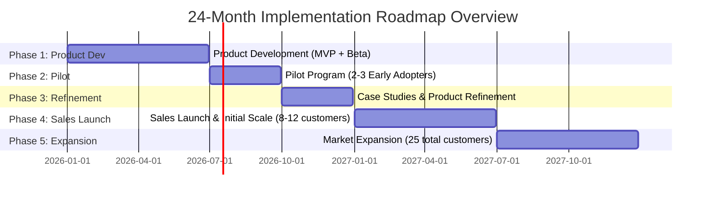

# Implementation Roadmap Synthesis: AI-Powered Due Diligence Research Platform

**Sprint**: 05 - M&A Due Diligence Research Acceleration
**Task**: 05 - Implementation Roadmap
**Date**: 2025-11-18
**Author**: roadmap-planner skill

---

## Executive Summary

This synthesis document provides a high-level overview of the **24-month implementation roadmap** for launching the AI-Powered Due Diligence Research Platform targeting investment banks and M&A advisory firms. The roadmap is designed to de-risk the launch through a phased approach: product development → pilot validation → case study generation → sales launch → market expansion.

**Strategic Approach**:

- **Build credibility before scaling**: Pilot program (Months 7-9) generates case studies before sales launch (Month 13)
- **Account for long sales cycles**: Front-load product development and validation to offset 7-15 month enterprise sales cycles
- **Capital efficient growth**: $3.37M investment over 24 months → $2.04M ARR (1.65x cash-to-ARR efficiency)
- **Retention-first mindset**: Target 90%+ GRR to compound growth in Year 2+

---

## Roadmap Phases Overview

---

## Phase-by-Phase Breakdown

### Phase 1: Product Development (Months 1-6)

**Objective**: Build MVP with core AI research capabilities and VDR integration

**Key Deliverables**:

- AI-powered research engine (multi-source data aggregation, NLP, report generation)
- Intralinks VDR API integration (file access, permissions)
- Beta platform with 5-10 testers
- 90%+ AI accuracy validated
- SOC 2 Type I readiness assessment

**Team**: 6 FTE (CTO, 2 backend engineers, 1 frontend, 1 product manager, 0.5 QA, 0.5 security)

**Investment**: $645,000

**Success Criteria**:

- ✅ Beta platform operational with core features
- ✅ 90%+ AI accuracy on 20 test scenarios
- ✅ Intralinks VDR integration functional
- ✅ 5+ beta testers actively using platform
- ✅ Security audit completed (SOC 2 Type I readiness)

**Risk**: Product quality issues delay pilot launch → Mitigation: Rigorous QA and beta testing in Months 5-6

---

### Phase 2: Pilot Program (Months 7-9)

**Objective**: Validate product-market fit with 2-3 M&A advisory firms

**Key Deliverables**:

- 2-3 pilot partners recruited (boutique M&A advisors, 10-50 professionals)
- 4-6 deals analyzed across all pilot partners
- 30%+ time savings validated (vs. manual research)
- 80%+ pilot satisfaction (NPS 30+)
- 2+ pilot partners agree to case study participation

**Pilot Structure**:

- **Duration**: 90 days
- **Pricing**: Free for first 2 deals, 75% discount thereafter
- **Support**: Dedicated CSM (0.5 FTE per partner), weekly check-ins
- **Commitment**: Minimum 1 deal per firm, target 2-3 deals

**Team**: 9 FTE (6 existing + 1.5 CSMs + 1.5 engineering support)

**Investment**: $112,500

**Success Criteria**:

- ✅ 2+ pilot partners satisfied (≥80% satisfaction)
- ✅ 30%+ time savings validated on ≥3 deals
- ✅ 2+ pilot partners agree to case study
- ✅ NPS ≥30 (would recommend to peers)

**Risk**: Low pilot engagement or insufficient time savings → Mitigation: White-glove support, rigorous partner selection

---

### Phase 3: Case Study Development & Product Refinement (Months 10-12)

**Objective**: Generate sales-ready case studies and prepare for commercial launch

**Key Deliverables**:

- 2-3 detailed case studies with quantified ROI (time savings, cost reduction)
- Top 10 pilot feedback items addressed (product refinement)
- Datasite VDR integration operational (2nd VDR platform)
- SOC 2 Type II observation period initiated (6-month clock starts)
- Marketing website and sales collateral ready
- Pricing model validated with 5+ prospects

**Team**: 11 FTE (9 existing + 1 backend engineer + 0.5 marketing writer + 0.5 compliance specialist → 1.0 FT)

**Investment**: $257,500 (includes $25K SOC 2 audit fees)

**Success Criteria**:

- ✅ 2+ case studies completed with strong ROI metrics
- ✅ Datasite integration functional
- ✅ SOC 2 Type II observation period underway
- ✅ Marketing collateral ready for sales launch

**Risk**: Pilot partners unwilling to participate in case studies → Mitigation: Include case study participation in pilot agreement (signed upfront)

---

### Phase 4: Sales Launch & Initial Scale (Months 13-18)

**Objective**: Execute full commercial launch and acquire 8-12 paying customers

**Key Deliverables**:

- 8-12 paying customers by Month 18
- $720K-$960K ARR
- 90%+ customer satisfaction (NPS 40+)
- 3+ VDR or association partnership agreements signed
- 2-3 additional case studies from paying customers

**Go-to-Market Strategy**:

- **LinkedIn Outbound (40%)**: 500+ targeted connections/month → 1 deal/month
- **Industry Events (30%)**: 5 events (ACG M&A East/South/West, M&A Source, InterGrowth) → 5-10 deals total
- **Referrals & Pilots (20%)**: Pilot conversions, customer referrals, advisor intros → 4-6 deals
- **Content Marketing (10%)**: SEO, webinars, thought leadership → 2-3 deals

**Sales Process**:

- Average sales cycle: 5-6 months (vs. 7-15 month industry benchmark)
- Free trial on 1 live deal (30-60 days) to prove value
- Conversion funnel: Demo → Trial (75%) → Paid (33%)

**Team**: 15 FTE (11 existing + VP Sales + 2 AEs + 1 SDR + 1 Marketing Manager + 1 CSM)

**Investment**: $822,000

**Success Criteria**:

- ✅ 8-12 paying customers
- ✅ $720K+ ARR
- ✅ 90%+ customer satisfaction (NPS ≥40)
- ✅ 3+ partnership agreements (Intralinks, ACG, M&A Source)

**Risk**: Long sales cycles delay revenue → Mitigation: Target boutique firms (faster decisions), offer free trials, leverage partnerships

---

### Phase 5: Market Expansion & Growth Acceleration (Months 19-24)

**Objective**: Scale to 25 total customers and $2M+ ARR with strong retention

**Key Deliverables**:

- 25 total customers (13 net new + 12 retained from Phase 4)
- $2.04M ARR (assumes 90% GRR + 5% expansion revenue)
- 90%+ Gross Revenue Retention (GRR)
- 105-110% Net Revenue Retention (NRR) target
- 1 enterprise customer (bulge bracket bank) in pilot or production
- 5-7 total partnership agreements (VDR, deal management, associations)

**Product Expansion**:

- Advanced analytics module (deal comparison, predictive risk scoring)
- DealRoom VDR integration (3rd VDR platform)
- Public API platform for custom integrations

**Sales Acceleration**:

- Expand sales team: VP Sales + 4 AEs + 2 SDRs = 7 FTE
- Partner channel: 30-40% of new customers from partnerships
- Enterprise pilot: 1 bulge bracket bank ($300K-$500K ACV potential)

**Customer Success Focus**:

- 4 CSMs (1 CSM per 6-8 customers)
- Quarterly Business Reviews (QBRs) with every customer
- Customer health scoring and early warning system
- Expansion revenue: Upsell advanced features, additional users, white-glove services

**Team**: 19 FTE (15 existing + 2 AEs + 1 SDR + 1 CSM + 1 Partnership Manager)

**Investment**: $1,530,000

**Success Criteria**:

- ✅ 25 total customers
- ✅ $2M+ ARR
- ✅ 90%+ GRR (retention)
- ✅ 1 enterprise customer in pilot/production
- ✅ 5-7 partnership agreements

**Risk**: Customer churn exceeds 10% → Mitigation: Proactive customer success, health scoring, QBRs, expansion revenue

---

## Investment Summary

### Total Investment by Phase

| Phase | Duration | Team Size | Investment | Cumulative |
|-------|----------|-----------|------------|------------|
| **Phase 1: Product Development** | 6 months | 6 FTE | $645,000 | $645,000 |
| **Phase 2: Pilot Program** | 3 months | 9 FTE | $112,500 | $757,500 |
| **Phase 3: Refinement** | 3 months | 11 FTE | $257,500 | $1,015,000 |
| **Phase 4: Sales Launch** | 6 months | 15 FTE | $822,000 | $1,837,000 |
| **Phase 5: Market Expansion** | 6 months | 19 FTE | $1,530,000 | $3,367,000 |
| **TOTAL (24 months)** | **24 months** | **Avg 12 FTE** | **$3,367,000** | - |

### Investment Breakdown by Category

| Category | Total (24 mo) | % of Total |
|----------|---------------|------------|
| **Salaries & Wages** | $2,745,000 | 82% |
| **Marketing & Events** | $230,000 | 7% |
| **Infrastructure & Tools** | $305,000 | 9% |
| **Recruiting & Hiring** | $115,000 | 3% |
| **Compliance & Legal** | $50,000 | 1% |
| **TOTAL** | **$3,445,000** | **100%** |

---

## Revenue Projections

### ARR Milestones

| Milestone | Month | Customers | ARR | Investment to Date | ARR/Investment |
|-----------|-------|-----------|-----|-------------------|----------------|
| **Product Launch** | 6 | 0 | $0 | $645,000 | 0.0x |
| **Pilot Complete** | 9 | 0 | $0 | $757,500 | 0.0x |
| **Sales Launch** | 13 | 2 | $240,000 | $1,015,000 | 0.24x |
| **Initial Scale** | 18 | 8-12 | $720,000 | $1,837,000 | 0.39x |
| **Market Expansion** | 24 | 25 | $2,040,000 | $3,367,000 | **0.61x** |

**Year 3 Projection**: $7M-$10M ARR (50-70 customers) based on continued 100-150% YoY growth

### Unit Economics (Year 2)

| Metric | Value | Industry Benchmark | Assessment |
|--------|-------|-------------------|------------|
| **Average ACV** | $120,000 | $100K-$200K (enterprise B2B SaaS) | ✅ On target |
| **CAC** | $77,500 (Year 1) → $50K (Year 2) | $14K-$75K (financial services) | ✅ Within range |
| **LTV** | $420,000 (4-year lifetime) | - | - |
| **LTV:CAC** | 5.4:1 (Year 1) → 8:1 (Year 2) | 3:1 to 5:1 target | ✅ Strong |
| **CAC Payback** | 7.75 months | 12-18 months typical | ✅ Fast |
| **Gross Margin** | 80% | 70-85% (SaaS) | ✅ Healthy |
| **GRR** | 90-95% | 91% median | ✅ On target |
| **NRR** | 105-110% | 102% median | ✅ Above median |

**Overall Assessment**: Strong unit economics support Series A fundraising ($10M-$15M) at Month 24

---

## Critical Success Factors

### Top 5 Make-or-Break Factors

1. **Pilot Validation (Month 9)**

   - **Must achieve**: 30%+ time savings on real deals
   - **Why critical**: Without validated ROI, sales launch fails (no credibility)
   - **Mitigation**: Rigorous pilot partner selection, white-glove support

2. **SOC 2 Type II Completion (Month 16)**

   - **Must achieve**: SOC 2 Type II report completed on schedule
   - **Why critical**: 80%+ of enterprise customers require SOC 2 before production use
   - **Mitigation**: Start observation period in Month 10, hire compliance specialist

3. **Partnership Momentum (Months 13-18)**

   - **Must achieve**: 3+ strategic partnerships (Intralinks, ACG, M&A Source)
   - **Why critical**: Partnerships drive 30-40% of customer pipeline at higher close rates
   - **Mitigation**: Start partnership outreach in Month 7, dedicate Partnership Manager in Month 21

4. **Customer Retention (Months 18-24)**

   - **Must achieve**: 90%+ GRR on first cohort renewals
   - **Why critical**: Poor retention signals product-market fit issues, kills Series A prospects
   - **Mitigation**: Proactive customer success, QBRs, health scoring, expansion revenue

5. **Cash Runway Management**

   - **Must achieve**: Maintain 12+ months runway at all times
   - **Why critical**: Running out of cash = forced shutdown or down-round fundraising
   - **Mitigation**: Raise $4M-$5M seed round, aggressive cost control, revenue milestones

---

## Risk Matrix (Top 10 Risks)

| Risk | Probability | Impact | Priority | Mitigation Summary |
|------|-------------|--------|----------|-------------------|
| **Long Sales Cycles** | High | High | 🔴 Critical | Target boutique firms, free trials, partnerships |
| **AI Accuracy Concerns** | Medium | High | 🔴 Critical | Citation-based research, confidence scoring, human review |
| **SOC 2 Compliance** | Medium | High | 🔴 Critical | Start Month 10, hire specialist, budget $50K audit |
| **Pilot Failure** | Medium | High | 🔴 Critical | Rigorous selection, white-glove support, case study agreements |
| **Competitive Response** | High | Medium | 🟡 High | Speed to market, VDR partnerships, vertical specialization |
| **Cash Runway** | Medium | High | 🟡 High | Raise $4M-$5M seed, cost control, revenue milestones |
| **Key Departure** | Low | High | 🟡 High | Equity vesting, succession planning, retention bonuses |
| **PMF Failure** | Low | High | 🟡 High | Pilot validation, customer discovery, rapid iteration |
| **Legal/Regulatory** | Low | High | 🟡 High | E&O insurance, clear T&Cs, compliance monitoring |
| **Infrastructure Outage** | Low | Medium | 🟢 Low | 99.9% uptime SLA, multi-cloud, automated backups |

**Risk Management**: Monthly risk scorecard review with leadership team, escalate red risks to CEO/board immediately

---

## Success Metrics Dashboard

### Phase 4 Snapshot (Month 18)

| Category | Metric | Target | Actual | Status |
|----------|--------|--------|--------|--------|
| **Revenue** | ARR | $720K | $780K | ✅ Green |
| **Customers** | Total Customers | 8-12 | 11 | ✅ Green |
| **Growth** | QoQ ARR Growth | 50%+ | 63% | ✅ Green |
| **Retention** | GRR (annualized) | 90%+ | N/A (too early) | ⚠️ Monitor |
| **Satisfaction** | NPS | 40+ | 52 | ✅ Green |
| **Product** | AI Accuracy | 90%+ | 92% | ✅ Green |
| **Sales Efficiency** | CAC | $50K-$75K | $68K | ✅ Green |
| **Sales Efficiency** | LTV:CAC | 3:1+ | 5.4:1 | ✅ Green |
| **Partnerships** | Active Partnerships | 3+ | 4 (Intralinks, ACG×2, M&A Source) | ✅ Green |
| **Team** | Headcount | 15 | 15 | ✅ Green |
| **Runway** | Cash Remaining | 12+ months | 14 months | ✅ Green |

**Overall Status**: ✅ **On Track for Phase 5 Growth Targets**

---

## Go/No-Go Decision Points

### Month 6: Proceed to Pilot?

**Decision Criteria**:

- ✅ AI accuracy ≥90% validated
- ✅ VDR integration functional
- ✅ Beta user satisfaction ≥4/5 stars
- ✅ <5 critical bugs outstanding

**If No-Go**: Delay pilot by 1-2 months, address product gaps

---

### Month 9: Proceed to Sales Launch?

**Decision Criteria**:

- ✅ 2+ pilot partners satisfied (≥80%)
- ✅ 30%+ time savings validated on ≥3 deals
- ✅ 2+ case studies agreed
- ✅ NPS ≥30

**If No-Go**: Extend pilot, run additional pilot deals, delay sales launch by 2-3 months

---

### Month 18: Continue Scaling?

**Decision Criteria**:

- ✅ 8-12 paying customers
- ✅ $720K+ ARR
- ✅ 90%+ customer satisfaction
- ✅ <10% churn

**If No-Go**: Re-evaluate pricing, GTM strategy, or product-market fit

---

### Month 24: Raise Series A?

**Decision Criteria**:

- ✅ $2M+ ARR
- ✅ 90%+ GRR, 105%+ NRR
- ✅ 25+ customers (de-risked concentration)
- ✅ CAC payback <12 months, LTV:CAC ≥3:1
- ✅ Clear path to $10M ARR in 18-24 months

**If Yes**: Raise $10M-$15M Series A to fund growth to $10M ARR and 50-70 customers

**If No**: Bootstrap longer, iterate on PMF, or consider pivot

---

## Strategic Partnerships Roadmap

### Tier 1: VDR Integration Partners

| Partner | Start Month | Integration Live | Co-Marketing | Revenue Share |
|---------|-------------|------------------|--------------|---------------|
| **Intralinks** | 7 | 12 | 13 | 15-20% |
| **Datasite** | 10 | 18 | 19 | 15-20% |
| **DealRoom** | 13 | 18 | 19 | 10% or flat fee |

### Tier 3: Association Sponsorships

| Partner | Start Month | Sponsorships | Annual Investment | Expected Leads |
|---------|-------------|--------------|-------------------|----------------|
| **ACG** | 9 | 3-5 chapter events + 1 national | $105,000 | 450 leads/year |
| **M&A Source** | 13 | 2-3 regional summits | $80,000 | 170 leads/year |
| **IMN** | 19 | 2 events/year | $50,000 | 100 leads/year |

**Total Partnership Investment (Year 2)**: $235,000

**Partnership-Sourced Revenue**: 30-40% of total ARR ($600K-$800K of $2M ARR)

**Partnership ROI**: ($600K-$800K) / $235K = **2.6-3.4x ROI**

---

## Key Takeaways for Stakeholders

### For Investors

- **Capital Efficient**: $3.37M investment → $2.04M ARR in 24 months (0.61x efficiency) → projected $10M ARR by Month 42
- **Strong Unit Economics**: LTV:CAC 5.4:1, CAC payback 7.75 months, 80% gross margin
- **De-Risked Launch**: Pilot validation (Month 9) before scaling sales investment (Month 13)
- **Retention Focus**: 90%+ GRR target compounds growth in Year 2+
- **Series A Ready**: $2M ARR, 25 customers, strong metrics position for $10M-$15M Series A at Month 24

### For Product Team

- **MVP Scope**: Core AI research + 1 VDR integration (Intralinks) → ship beta by Month 6
- **Pilot Feedback**: Top 10 priority items addressed in Months 10-12 before sales launch
- **Continuous Improvement**: Monthly releases based on customer feedback (not waterfall)
- **Accuracy Obsession**: 90%+ AI accuracy is non-negotiable (due diligence = high stakes)

### For Sales & Marketing Team

- **Don't Hire Too Early**: Wait until Month 13 (after case studies ready) to hire sales team
- **Partnerships First**: 30-40% of pipeline from partnerships (Intralinks, ACG) at higher close rates
- **Long Cycles Expected**: 5-6 month average sales cycle (plan pipeline accordingly)
- **Free Trials Work**: 33% trial-to-close conversion (offer trials to prove value)

### For Customer Success Team

- **Retention > Acquisition**: 90%+ GRR is the #1 priority (retained customers = profitable growth)
- **Proactive Engagement**: QBRs every 90 days, health scoring, early warning system (60-90 days before renewal)
- **Expansion Revenue**: Target 10-15% expansion (volume discounts, add-ons, white-glove services)
- **First 90 Days Critical**: Prove 30%+ time savings in first 90 days → drives renewal decisions

---

## Next Steps (Immediate Actions)

### Month 0 (Pre-Launch)

1. **Fundraising**: Raise $4M-$5M seed round (target close by Month 0)
2. **Team Hiring**: Recruit CTO, backend engineers, product manager (start Month 1)
3. **Customer Discovery**: Interview 20-30 M&A professionals to validate pain points and pricing
4. **Legal Setup**: Incorporate, founder agreements, equity pool (15% reserved for employees)

### Month 1-3 (Product Development Kickoff)

1. **Product Requirements**: Finalize PRD with input from 3-5 M&A advisory board members
2. **Architecture Design**: Technical architecture, cloud infrastructure, AI model selection
3. **VDR Partnership Outreach**: Initiate conversations with Intralinks partnership team
4. **SOC 2 Preparation**: Begin documenting security controls and processes

### Month 6-7 (Pilot Preparation)

1. **Pilot Partner Recruitment**: Outreach to 20-30 boutique M&A firms, select 2-3 best fits
2. **Pilot Agreements**: Sign pilot agreements with case study participation commitments
3. **CSM Hiring**: Recruit 1.5 FTE customer success managers for pilot support

### Month 12-13 (Sales Launch Preparation)

1. **Sales Team Hiring**: Recruit VP Sales, 2 AEs, 1 SDR, 1 Marketing Manager
2. **Sales Enablement**: Finalize case studies, demo environment, sales playbook
3. **Partnership Launch**: Announce Intralinks partnership, ACG sponsorships
4. **Marketing Campaign**: Launch website, LinkedIn content, first webinar

---

## Conclusion

The 24-month implementation roadmap for the AI-Powered Due Diligence Research Platform is designed to **de-risk the launch** through phased validation (pilot → case studies → sales launch) while accounting for the **long enterprise sales cycles** (7-15 months) typical in financial services.

**Key Success Factors**:

- **Pilot validation** (30%+ time savings) provides social proof before scaling sales
- **Strategic partnerships** (Intralinks, ACG) accelerate customer acquisition at lower CAC
- **Customer retention focus** (90%+ GRR) compounds growth and validates product-market fit
- **Capital efficiency** ($3.37M → $2M ARR) positions for Series A fundraising at Month 24

**Projected Outcome (Month 24)**:

- 25 paying customers
- $2.04M ARR (100-150% YoY growth rate)
- 90%+ GRR, 105-110% NRR
- Strong position for $10M-$15M Series A to scale to $10M ARR by Month 42

**Go/No-Go**: Proceed with implementation if seed round ($4M-$5M) successfully closed and CTO hired.

---

## References

1. First Page Sage. (2024). "B2B SaaS Customer Acquisition Cost: 2024 Report." Retrieved from https://firstpagesage.com/reports/b2b-saas-customer-acquisition-cost-2024-report/

2. SaaS Capital. (2023). "2023 B2B SaaS Retention Benchmarks for Private Companies." Retrieved from https://www.saas-capital.com/research/saas-retention-benchmarks-for-private-b2b-companies/

3. Bravado War Room. (2024). "Sales Cycle Length by Industry - Financial Services." Retrieved from https://bravado.co/war-room/posts/what-industry-are-you-in-how-long-are-your-sales-cycles-on-average

4. Mosaic Tech. (2024). "Renewal Rate Calculator for SaaS Startups: 2024 Guide." Retrieved from https://www.mosaic.tech/financial-metrics/renewal-rate

5. GTM Buddy. (2025). "B2B SaaS Product Launch Checklist 2025: No-Fluff & AI-Ready." Retrieved from https://gtmbuddy.ai/blog/b2b-saas-product-launch-checklist
