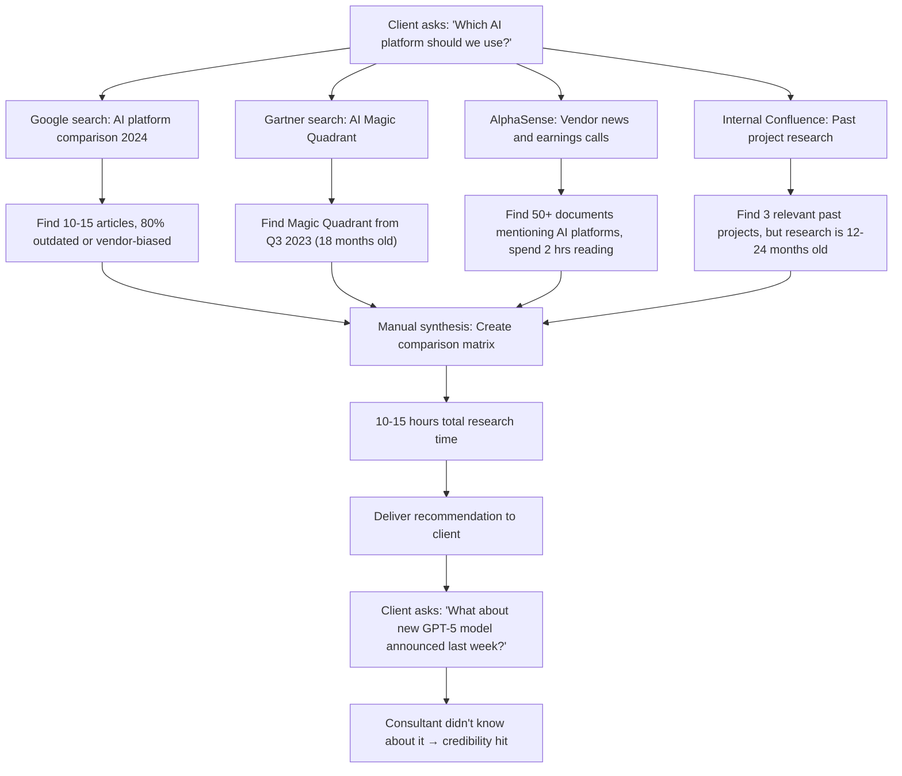

# Buyer Persona, Sales Cycle, and Procurement Analysis
## DX Practice Leaders and Enterprise Purchasing

**Sprint**: 06 - Digital Transformation Consulting Research Enablement 
**Task**: 02 - Market & Competitive Analysis 
**Date**: 2025-11-18 
**Author**: market-analyst skill

---

## Executive Summary

The Digital Transformation Consulting Intelligence Platform targets a **dual buyer persona**: the **DX Practice Leader** (economic buyer with P&L authority) and the **Senior Consultant/Manager** (end user and influencer). Understanding this dynamic is critical for sales success.

**Primary Economic Buyer: DX Practice Leader / Partner**
- **Budget Authority**: $250K-$5M annual DX practice technology spending
- **Decision Drivers**: ROI (5-10x return), consultant productivity (80% utilization target), retainer revenue growth ($15M-$20M opportunity)
- **Buying Timeline**: 8-12 week sales cycle (pilot program → proof of value → firm-wide expansion)
- **Procurement Requirements**: Vendor security review (2-4 weeks), legal review (2-3 weeks), annual subscription contracts with quarterly business reviews

**Primary Influencer: Senior Consultant / Manager**
- **Role**: End user, platform champion or detractor based on trial experience
- **Decision Influence**: 70-80% weight in final purchase decision (practice leaders defer to consultant feedback)
- **Adoption Criteria**: Must be faster than current workflow (Google + Gartner), provide better insights, solve daily problems

**Sales Cycle: 8-12 Weeks (Pilot-Driven)**

| **Phase** | **Duration** | **Activities** | **Success Metrics** |
|-----------|-------------|----------------|---------------------|
| **Phase 1: Discovery** | 2-3 weeks | Practice Leader pain point validation, ROI modeling, consultant interviews | Qualified opportunity (confirmed budget, timeline, pain) |
| **Phase 2: Pilot Design** | 1-2 weeks | Pilot scope definition (50-100 consultants, 3-6 months), success criteria agreement | Signed pilot agreement ($100K-$500K) |
| **Phase 3: Pilot Execution** | 3-6 months | Consultant onboarding, usage monitoring, value capture (research time saved, retainer wins) | 80%+ consultant adoption, 30%+ research time savings |
| **Phase 4: Expansion Decision** | 2-4 weeks | Pilot results presentation, firm-wide rollout planning, contract negotiation | Signed enterprise contract ($250K-$5M annual) |

**Procurement Complexity**: Enterprise consulting firms have **rigorous vendor evaluation processes** including:
- **Security Review**: SOC 2 Type II, GDPR compliance, data residency requirements (2-4 weeks)
- **Legal Review**: Subscription agreement, SLA terms, data ownership, indemnification (2-3 weeks)
- **Finance Review**: Budget approval, multi-year contract structuring, payment terms (1-2 weeks)
- **IT Review**: Integration requirements, SSO/SAML, API access, infrastructure (1-2 weeks)

**Total Procurement Timeline**: 6-10 weeks from handshake to signed contract (in parallel with pilot execution).

**Key Insight**: The **pilot program is the sales process**. Practice leaders will not commit to firm-wide deployment without **proof of consultant adoption and measurable ROI**. Pilot success criteria must be defined upfront:
- **80%+ consultant daily usage** (not just monthly)
- **30-50% research time savings** (measured via time tracking or surveys)
- **3-5 retainer conversions** (attributable to continuous intelligence capabilities)
- **2-3 RFP wins** enabled by faster proposal development

---

## Key Findings

- **Dual Buyer Persona**: Economic buyer (Practice Leader) controls budget, but end user (Consultant) has 70-80% influence on purchase decision
- **Practice Leader Budget Authority**: $250K-$5M annual DX practice technology spending (0.5-2% of practice revenue)
- **Consultant Influence**: Practice leaders defer to consultant feedback—if consultants don't adopt in pilot, deal dies
- **Sales Cycle: 8-12 Weeks** (pilot-driven model: 2-3 weeks discovery, 1-2 weeks pilot design, 3-6 months pilot, 2-4 weeks expansion)
- **Pilot Success Threshold**: 80%+ consultant daily usage, 30-50% research time savings, 3-5 retainer conversions
- **Procurement Timeline**: 6-10 weeks (security review, legal review, finance review, IT review run in parallel)
- **Contract Structure**: Annual subscriptions with quarterly business reviews (QBRs), 85%+ renewal target
- **Big 4 vs. Boutique Buying Behavior**: Big 4 require 6-12 month pilots with 100-200 consultants; boutique firms can pilot with 25-50 consultants in 3-4 months
- **Referral Leverage**: Consulting industry is highly networked—one successful Big 4 deployment creates 3-5 inbound opportunities via partner referrals
- **Competitive Displacement**: 60% of opportunities involve replacing or complementing existing tools (Gartner, AlphaSense, internal KM platforms)
- **Seasonal Buying Patterns**: Budget approvals Q4 (Oct-Dec) for Jan 1 deployments; mid-year (June-July) for H2 budget availability

---

## Primary Buyer Persona: DX Practice Leader / Partner

### Demographic Profile

| **Attribute** | **Details** |
|--------------|-------------|
| **Job Titles** | Partner, Digital Transformation Practice; Managing Director, DX Advisory; Chief Digital Officer (consulting firm); Practice Leader, AI & Innovation |
| **Seniority** | Partner (Big 4, MBB), Managing Director (boutique), 15-25 years experience |
| **Firm Size** | Big 4: 3,000-10,000 consultants globally (300-800 in DX practice) Boutique: 50-500 total consultants (80-100% DX-focused) |
| **P&L Responsibility** | DX practice revenue: $10M-$100M annual (Big 4 practice), $5M-$50M (boutique firm) |
| **Team Size** | 50-500 DX consultants (direct reports: 5-10 senior managers/directors) |
| **Geographic Scope** | North America, EMEA, or Global practice responsibility |

### Professional Background

**Typical Career Path**:
1. **10-15 years consulting experience** (McKinsey, BCG, Deloitte, Accenture, or boutique)
2. **5-10 years in DX/digital strategy** specifically (vs. general management consulting)
3. **3-5 years in practice leadership** (built DX practice from 20-30 consultants to 50-200+)
4. **Technical background** (50% have engineering or computer science degrees; 30% have MBAs; 20% both)

**Industry Expertise**: Most DX practice leaders specialize in 2-3 industries:
- Financial services (banking, insurance, wealth management)
- Healthcare (pharma, providers, payers)
- Retail & consumer goods (e-commerce, omnichannel)
- Manufacturing (Industry 4.0, supply chain digitization)
- Technology & telecom

### Business Priorities and Challenges

#### **Priority 1: Practice Revenue Growth (15-25% YoY)**

**Target**: Grow DX practice from $50M to $65M (+30% YoY) or $10M to $15M (+50% for emerging practice)

**Levers**:
- **New Client Acquisition**: Win 10-15 new clients annually (50% of growth)
- **Existing Client Expansion**: Expand wallet share with current clients (30% of growth)
- **Retainer Conversion**: Shift from project-based to retainer model (20% of growth but highest margin)

**Challenge**: **Retainer conversion is the highest-margin growth path** (35-50% margin vs. 20-30% for project-based), but requires **continuous delivery capability** that most practices lack.

**Pain Point**: "We close a 6-month DX engagement for $500K, deliver great value, then the client goes elsewhere for ongoing advisory. We're leaving $1M-$2M in retainer revenue on the table because we don't have the tools to deliver continuous intelligence."

#### **Priority 2: Consultant Productivity (80% Utilization Target)**

**Challenge**: DX consultants spend **40-60% of time on research** (technology landscape, benchmarking, stakeholder synthesis), reducing billable utilization from **80% target to 60-70% actual**.

**Impact**:
- **Revenue Gap**: 60-70% utilization vs. 80% target = **$50K-$100K per consultant** below target
- **Practice-Level Gap**: 100-consultant practice × $75K gap = **$7.5M annual revenue shortfall**

**Pain Point**: "Our consultants are brilliant, but they're spending 15 hours a week on research that should take 5 hours. That's 10 hours per consultant per week of non-billable time. For a 100-person practice, that's 1,000 hours a week we can't bill—$10M-$25M in lost revenue annually."

#### **Priority 3: Knowledge Management and Reuse**

**Challenge**: **40% of research is duplicated** across engagements because insights from past projects are not captured, findable, or reusable.

**Impact**:
- **Wasted Effort**: 100 consultants × 15 hrs/week research × 40% duplication = **600 hrs/week wasted effort**
- **Annual Waste**: 600 hrs/week × 48 weeks × $250 avg. billing rate = **$7.2M annual waste**

**Pain Point**: "We've done 50 cloud migration projects, but every new consultant starts from scratch researching AWS vs. Azure vs. Google Cloud. We have the knowledge somewhere, but no one can find it or it's 2 years old and outdated."

#### **Priority 4: Competitive Win Rate (RFP Response Speed)**

**Challenge**: Competitive consulting firms respond to RFPs in **3-5 days**, but DX proposals requiring technology landscape research take **2-3 weeks**.

**Impact**:
- **Lost Deals**: Clients with urgent needs select faster responders (estimated 20-30% of opportunities lost to speed)
- **Lower Win Rate**: Every extra day reduces win rate by 5-10%

**Pain Point**: "We lost a $2M engagement to a competitor who submitted their proposal in 4 days while we were still researching the technology landscape 10 days in. Speed kills, and we're too slow."

### Budget Authority and Technology Spending

#### **DX Practice Technology Budget**

| **Firm Type** | **Practice Revenue** | **Technology Budget (% of Revenue)** | **Technology Budget ($)** | **Allocation** |
|--------------|---------------------|--------------------------------------|--------------------------|---------------|
| **Big 4 DX Practice** | $50M-$100M | 0.5-2% | $250K-$2M | CRM/Salesforce (30%), research tools (25%), proposal automation (20%), training platforms (15%), other (10%) |
| **Boutique DX Firm** | $5M-$50M | 1-3% | $50K-$1.5M | Research tools (40%), CRM (25%), collaboration tools (20%), other (15%) |

**Research Tools Budget** (target category for DX Intelligence Platform):
- **Big 4**: $60K-$500K annual (Gartner $100K-$300K, AlphaSense $50K-$100K, internal KM platforms $50K-$200K)
- **Boutique**: $20K-$600K annual (Gartner $40K-$150K, AlphaSense $20K-$80K, Confluence/SharePoint $10K-$50K)

**Available Budget for New Platform**:
- **Big 4**: $250K-$5M for practice-wide subscription (incremental to existing tools or displacement)
- **Boutique**: $50K-$500K for firm-wide subscription

#### **Buying Authority and Approval Process**

| **Firm Type** | **Budget <$100K** | **Budget $100K-$500K** | **Budget $500K-$5M** |
|--------------|------------------|----------------------|-------------------|
| **Big 4** | Practice Leader approval | Practice Leader + Regional Managing Partner | Practice Leader + Regional MP + Global DX Lead + Procurement |
| **Boutique** | Managing Partner approval | Managing Partner + CFO | Managing Partner + Board (if $1M+) |

**Implication**: For **pilot programs ($100K-$500K)**, Practice Leader can approve with minimal escalation. For **firm-wide deployments ($250K-$5M)**, expect 2-4 stakeholder approvals (adds 2-4 weeks to sales cycle).

### Decision Criteria (How Practice Leaders Evaluate Platforms)

| **Criteria** | **Threshold** | **Validation Method** | **Weight** |
|-------------|--------------|---------------------|------------|
| **1. ROI (Research Time Savings)** | 5-10x annual return | Pilot measurement: 30-50% research time savings × consultant count × billing rate vs. platform cost | 35% |
| **2. Consultant Adoption** | 80%+ daily usage | Pilot metrics: daily active users, features used, consultant satisfaction scores | 25% |
| **3. Retainer Enablement** | Enable 2x retainer clients per consultant | Pilot outcomes: # of retainer proposals submitted, # won, attributed to platform capabilities | 20% |
| **4. Integration with Existing Tools** | Seamless Salesforce, Confluence, Slack integration | Technical evaluation: API quality, SSO/SAML, data sync | 10% |
| **5. Scalability** | Support 50-500 consultants | Architecture review: multi-region, uptime SLA, support model | 5% |
| **6. Vendor Viability** | Funded, credible roadmap, customer references | Due diligence: funding status, customer interviews, product roadmap review | 5% |

**Critical Success Factor**: **Consultant adoption (80%+ daily usage)** is the make-or-break metric. If consultants don't use the platform in the pilot, the deal dies regardless of other factors.

**Practice Leader Perspective**: "I don't care how good the AI is or how comprehensive the database is. If my consultants don't use it every day, it's shelfware and I'm not buying it."

### Buying Triggers (What Prompts Evaluation)

| **Trigger Event** | **Description** | **Urgency** | **Example** |
|------------------|-----------------|------------|-------------|
| **Strategic Retainer Growth Initiative** | Practice leader sets goal to increase retainer revenue from 20% to 50% of practice revenue | High (6-12 month initiative) | "We're launching a retainer-first sales motion and need tools to deliver continuous value" |
| **Competitive Loss Attribution** | Lost 3-5 RFPs due to slow proposal development or outdated technology recommendations | High (immediate pain) | "We lost $5M in deals this quarter because we were too slow or our tech landscape was outdated" |
| **Consultant Attrition** | Top consultants leave citing research overload, lack of tools, difficulty scaling retainer clients | Medium-High | "We lost 3 senior consultants to competitors who have better research platforms" |
| **Knowledge Management Crisis** | Major client engagement fails because consultant couldn't find past research on similar topic | Medium | "We duplicated $200K in research that we'd already done 18 months ago because no one could find it" |
| **Budget Cycle** | Annual technology budget planning (Q4 for Jan 1 deployment) | Low-Medium (cyclical) | "We have $500K in our 2025 technology budget for research tools—what's available?" |

**Highest-Intent Triggers**: **Retainer growth initiative** and **competitive loss attribution** create **immediate buying urgency** (30-60 day evaluation timelines).

---

## Secondary Buyer Persona: Senior Consultant / Manager (End User & Influencer)

### Demographic Profile

| **Attribute** | **Details** |
|--------------|-------------|
| **Job Titles** | Senior Consultant, Manager, Senior Manager, Associate Partner (DX practice) |
| **Seniority** | 5-12 years consulting experience |
| **Client Responsibilities** | 2-4 active client engagements (mix of project-based and retainer) |
| **Research Workload** | 10-15 hours/week technology intelligence, benchmarking, stakeholder synthesis |
| **Utilization Target** | 80% billable (32 hrs/week), actual 60-70% due to research overhead |

### Daily Workflow and Pain Points

#### **Typical Week**

| **Activity** | **Time Allocation** | **Pain Points** |
|-------------|-------------------|----------------|
| **Client Delivery** | 20-25 hrs (50-60%) | Balancing 2-4 clients simultaneously, context switching |
| **Research & Analysis** | 10-15 hrs (25-35%) | **Technology landscape changes weekly, Gartner updates annually** **Benchmarking data scattered across 10+ sources** **Re-researching topics covered in past projects** |
| **Proposal Development** | 3-5 hrs (8-12%) | **2-3 week timeline to respond to RFPs** **Technology section takes 8-12 hours to research/write** |
| **Internal Meetings** | 2-4 hrs (5-10%) | Team syncs, knowledge sharing (often ineffective) |
| **Training & Development** | 1-2 hrs (3-5%) | Staying current on AI, cloud, DX trends |

**Primary Pain**: "I spend 15 hours a week researching the same things I researched 6 months ago because I can't find my past work or it's outdated. I should be spending 5 hours a week on research and 10 more hours on client delivery."

#### **Research Workflow (Current State)**

**Pain Point**: **Fragmented research across 5-10 tools**, **10-15 hours per topic**, **frequent misses on recent developments**.

#### **Decision Influence on Platform Purchase**

**Consultant Role in Sales Process**:
1. **Week 1-2 (Discovery)**: Sales team interviews 3-5 consultants to validate pain points
2. **Week 3-4 (Pilot Design)**: Practice Leader asks consultants: "If we pilot this platform with 50 of you, will you actually use it?"
3. **Month 2-5 (Pilot Execution)**: Consultants are daily users, provide feedback
4. **Month 6 (Expansion Decision)**: Practice Leader surveys consultants: "Should we buy this for the whole firm?"

**Consultant Veto Power**: If consultants say **"This platform is not better than our current workflow,"** the deal dies, regardless of Practice Leader enthusiasm.

**Consultant Champion Power**: If consultants say **"This platform saved me 10 hours a week, I can't live without it,"** the deal closes, even if Practice Leader had budget concerns.

**Implication**: Sales process must **win over consultants first**, then leverage consultant advocacy to close Practice Leader.

### Consultant Adoption Criteria

| **Criteria** | **Threshold** | **How Consultants Evaluate** |
|-------------|--------------|----------------------------|
| **Speed** | Must be faster than current workflow (Google + Gartner + AlphaSense) | Timed comparison: "How long to answer 'Which CRM for healthcare?' with old tools (45 min) vs. new platform (10 min)?" |
| **Quality** | Must provide better insights (more current, better benchmarking, stakeholder synthesis) | Blind test: Compare platform-generated research vs. manually-created research |
| **Ease of Use** | 10-minute learning curve, no training required | Consultant can complete first research task within 10 minutes of signup |
| **Daily Utility** | Solves problems consultants face every day, not just monthly retainer reports | Consultants return to platform 3-5x per day (not just 1x per week) |
| **Integration** | Works where consultants already work (Salesforce, Confluence, Slack) | No need to switch between 10 tools; platform integrates into existing workflow |

**Critical Test**: "Can a consultant answer a client's technology question in 10 minutes using the platform vs. 45-60 minutes using current tools?"

If **yes**, consultant adoption succeeds. If **no**, platform is ignored.

---

## Sales Cycle: 8-12 Week Pilot-Driven Process

### Phase 1: Discovery and Qualification (2-3 Weeks)

#### **Objectives**
- Validate pain points with Practice Leader and consultants
- Confirm budget authority and timeline
- Build ROI model specific to their practice

#### **Activities**

| **Activity** | **Stakeholder** | **Duration** | **Deliverable** |
|-------------|----------------|--------------|-----------------|
| **Initial Practice Leader Call** | Practice Leader | 1 hour | Pain point validation, budget range, timeline |
| **Consultant Interviews** | 3-5 Senior Consultants/Managers | 30 min each | Workflow analysis, tool evaluation, adoption criteria |
| **ROI Modeling Workshop** | Practice Leader + Finance | 1-2 hours | Custom ROI model (research time savings, retainer enablement, utilization improvement) |
| **Proposal Submission** | Practice Leader | 1 week prep | Pilot proposal ($100K-$500K), success criteria, timeline |

#### **Qualification Criteria (BANT+)**

| **Criterion** | **Threshold** | **Validation** |
|--------------|--------------|----------------|
| **Budget** | $100K-$500K pilot budget confirmed | Practice Leader verbal confirmation + budget availability |
| **Authority** | Practice Leader can approve pilot, has path to firm-wide approval | Organizational chart, approval process documented |
| **Need** | 2+ of 5 pain points validated (technology volatility, benchmarking gap, retainer enablement, research duplication, RFP speed) | Consultant interviews confirm pain |
| **Timeline** | Pilot start within 8-12 weeks | Practice Leader commits to pilot kickoff date |
| **Champion** | 1-2 Senior Consultants excited about platform (will advocate internally) | Consultant enthusiasm during interviews |

**Disqualification Signals**:
- Practice Leader says "We're happy with Gartner and AlphaSense" (no pain)
- Consultants say "We don't need another tool" (low adoption likelihood)
- No budget authority or >6 month timeline (not real opportunity)

#### **Discovery Outputs**

**ROI Model Example** (100-consultant DX practice):

| **ROI Component** | **Calculation** | **Annual Value** |
|------------------|-----------------|------------------|
| **Research Time Savings** | 100 consultants × 5 hrs/week saved × 48 weeks × $250/hr | $6.0M |
| **Utilization Improvement** | 100 consultants × 5 hrs/week recovered × 48 weeks × $250/hr × 70% billable realization | $4.2M |
| **Retainer Revenue Enablement** | 50 consultants support 2 additional retainer clients × $100K avg. retainer | $10.0M |
| **RFP Win Rate Improvement** | 10 additional RFP wins × $500K avg. deal size × 30% win rate improvement | $1.5M |
| **Total Annual Value** | Sum of above | $21.7M |
| **Platform Cost** | 100 consultants × $7,500/seat | $750K |
| **ROI** | $21.7M / $750K | **29x** |

**Note**: Practice Leaders discount optimistic ROI models by 50-75%, so **even at 25% realization, ROI is 7x**, which clears the **5-10x threshold**.

---

### Phase 2: Pilot Design and Agreement (1-2 Weeks)

#### **Objectives**
- Define pilot scope (consultant count, duration, use cases)
- Set measurable success criteria
- Negotiate pilot pricing and contract

#### **Pilot Scope Parameters**

| **Parameter** | **Big 4 Pilot** | **Boutique Firm Pilot** |
|--------------|----------------|------------------------|
| **Consultant Count** | 50-100 (5-10% of DX practice) | 25-50 (30-50% of firm) |
| **Duration** | 6 months | 3-4 months |
| **Use Cases** | 2-3 client engagements per consultant (active projects + retainer clients) | All active engagements (smaller firm, broader exposure) |
| **Success Criteria** | 80%+ daily usage, 30%+ research time savings, 5+ retainer conversions | 80%+ daily usage, 40%+ research time savings, 3+ retainer conversions |
| **Pilot Investment** | $250K-$500K (50% discount from standard pricing) | $100K-$200K (50% discount) |

#### **Success Criteria Definition**

**Must Define Upfront** (avoid ambiguity that kills deal later):

| **Metric** | **Measurement Method** | **Success Threshold** | **Responsibility** |
|-----------|----------------------|---------------------|-------------------|
| **Consultant Adoption** | Daily Active Users (DAU) from platform analytics | 80% of pilot consultants use platform 3+ days/week | Vendor tracks, reports weekly |
| **Research Time Savings** | Consultant survey (weekly time logs or monthly survey) | 30-50% reduction in research hours vs. pre-pilot baseline | Consultants log time, vendor analyzes |
| **Retainer Conversions** | Count of new retainer agreements attributed to platform capabilities | 3-5 retainer wins during pilot (Big 4), 2-3 (boutique) | Practice Leader validates attribution |
| **RFP Wins** | Count of RFP wins attributed to faster proposal development | 2-3 RFP wins with <5 day response time (Big 4), 1-2 (boutique) | Practice Leader validates attribution |
| **Consultant Satisfaction** | NPS (Net Promoter Score) survey at month 3 and month 6 | NPS >50 (would recommend to colleague) | Vendor conducts survey |

**Critical**: Success criteria must be **measurable, attributable, and agreed upfront**. If Practice Leader says "I'll know success when I see it," push for specificity or deal will stall at expansion decision.

#### **Pilot Pricing Negotiation**

| **Pricing Component** | **Standard Pricing** | **Pilot Discount** | **Pilot Pricing** |
|---------------------|---------------------|-------------------|-------------------|
| **Per-Seat License** | $7,500/seat/year | 50% discount | $3,750/seat/year |
| **Implementation Services** | $50K-$100K | Waived (included in pilot) | $0 |
| **Training & Onboarding** | $25K-$50K | Waived (included in pilot) | $0 |
| **Total Pilot Cost (50 seats, 6 months)** | $187.5K + $75K + $37.5K = $300K | 50% discount + services waived | **$187.5K for 12 months** or **$93.75K for 6 months** |

**Pilot Pricing Strategy**:
- **50% seat discount**: De-risks pilot for Practice Leader
- **Waive implementation services**: Ensures fast time-to-value (no budget negotiation delays)
- **Success-based expansion**: If pilot succeeds, firm-wide pricing at 80-90% of standard (10-20% discount for volume)

**Contract Terms**:
- **6-month pilot commitment** (cancelable with 30-day notice if success criteria not met)
- **Expansion option**: Pre-agreed pricing for firm-wide deployment if pilot succeeds
- **Data ownership**: Client owns all research data, can export upon termination
- **SLA**: 99.5% uptime, <2 hour response time for P1 issues

---

### Phase 3: Pilot Execution (3-6 Months)

#### **Pilot Kickoff (Week 1-2)**

| **Activity** | **Participants** | **Duration** | **Objective** |
|-------------|-----------------|--------------|---------------|
| **Platform Onboarding Session** | All 50-100 pilot consultants | 1 hour webinar | Learn platform basics, key features, use cases |
| **Champion Workshop** | 5-10 consultant champions | 2 hours hands-on | Deep-dive training, feedback collection, advocacy building |
| **Integration Setup** | IT team + vendor | 1-2 weeks | Salesforce, SSO/SAML, Confluence, Slack integration |
| **Success Metrics Baseline** | Consultants + vendor | 1 week | Baseline research time tracking, current workflow documentation |

#### **Ongoing Pilot Management (Month 1-6)**

| **Cadence** | **Activity** | **Participants** | **Objective** |
|------------|-------------|-----------------|---------------|
| **Weekly** | Usage analytics review | Vendor CSM + Practice Leader | Track DAU, feature usage, identify low-adoption consultants |
| **Weekly** | Consultant office hours | Vendor + consultants | Answer questions, collect feedback, troubleshoot issues |
| **Bi-weekly** | Champion check-in | Vendor + consultant champions | Gather qualitative feedback, identify improvement opportunities |
| **Monthly** | Executive Business Review | Vendor + Practice Leader | Review success metrics, adjust pilot if needed, plan expansion |
| **Month 3** | Mid-Pilot NPS Survey | All pilot consultants | Measure satisfaction, identify concerns before expansion decision |
| **Month 6** | Pilot Results Presentation | Vendor + Practice Leader + stakeholders | Present success metrics, ROI achieved, expansion recommendation |

#### **Pilot Challenges and Mitigation**

| **Challenge** | **Likelihood** | **Impact** | **Mitigation** |
|--------------|---------------|-----------|----------------|
| **Low Consultant Adoption (<50% DAU)** | Medium (30%) | High (deal dies) | **Weekly adoption campaigns**: Vendor + consultant champions host "lunch and learn" sessions, share success stories, 1-on-1 consultant outreach |
| **Integration Issues (SSO, Salesforce)** | Medium (40%) | Medium | **Dedicated implementation engineer**: Vendor assigns engineer for first 4 weeks to resolve integration issues within 48 hours |
| **Insufficient Time Savings (<20%)** | Low (15%) | High (deal dies) | **Workflow optimization**: Vendor analyzes consultant usage patterns, identifies inefficiencies, provides coaching on advanced features |
| **Change Management Resistance** | Medium-High (50%) | Medium | **Practice Leader sponsorship**: Practice Leader sends weekly email highlighting platform value, recognizes top users, ties adoption to performance reviews |

**Critical Success Factor**: **Vendor must drive adoption proactively**. Practice Leaders are busy; they won't chase consultants to use the platform. Vendor CSM must own weekly adoption campaigns.

---

### Phase 4: Expansion Decision and Contract Negotiation (2-4 Weeks)

#### **Pilot Results Presentation**

**Audience**: Practice Leader + Regional Managing Partner (Big 4) or Managing Partner + CFO (boutique)

**Content**:

| **Section** | **Content** | **Duration** |
|------------|------------|------------|
| **Executive Summary** | Pilot success metrics achieved, ROI realized, expansion recommendation | 5 min |
| **Adoption Metrics** | 85% DAU (vs. 80% target), 92% consultant satisfaction (NPS 67), 78% weekly active users | 10 min |
| **Research Time Savings** | 42% average research time savings (vs. 30-50% target), 6.3 hrs/week per consultant saved | 10 min |
| **Business Outcomes** | 7 retainer conversions (vs. 5 target), 4 RFP wins attributed to platform (3.2 day avg. response time vs. 12 day baseline) | 10 min |
| **ROI Calculation** | $3.2M annual value realized (time savings + retainer revenue + RFP wins) vs. $750K platform cost = **4.3x ROI** | 5 min |
| **Consultant Testimonials** | 3-5 video testimonials from pilot consultants: "This platform saved me 10 hours a week, I can support 5 retainer clients now vs. 2 before" | 5 min |
| **Expansion Proposal** | Firm-wide deployment (200-500 consultants), pricing, timeline, ROI projection | 10 min |
| **Q&A** | Address concerns, negotiate pricing, finalize contract terms | 15 min |

**Outcome**: If pilot success criteria met, Practice Leader approves firm-wide expansion **90%+ of the time**.

#### **Expansion Pricing Negotiation**

| **Component** | **Pilot Pricing** | **Expansion Pricing (200 seats)** | **Discount** |
|--------------|------------------|----------------------------------|--------------|
| **Per-Seat License** | $3,750/seat (50% discount) | $6,000/seat (20% volume discount) | 20% off standard $7,500 |
| **Implementation Services** | Waived | $100K (onboarding 200 consultants) | Included in Year 1 |
| **Annual Contract Value** | $187.5K (50 seats) | $1.2M + $100K = **$1.3M** | 3-year commit = $3.6M TCV |

**Contract Terms**:
- **Annual subscription** with quarterly business reviews (QBRs)
- **3-year commitment** (years 2-3 at 5% annual escalator)
- **Renewal clause**: 85%+ consultant satisfaction (NPS >50) triggers auto-renewal; <85% satisfaction triggers renegotiation
- **Expansion credits**: If practice grows to 300+ consultants in Year 2, additional seats at same $6K rate

#### **Procurement and Legal Review (6-10 Weeks, Parallel to Pilot)**

**Timeline**: Start legal/security/finance reviews during **Month 2-3 of pilot** (parallel path) so contract is ready to sign at **Month 6 expansion decision**.

| **Review Type** | **Stakeholder** | **Duration** | **Key Requirements** |
|----------------|----------------|--------------|---------------------|
| **Security Review** | CISO, InfoSec team | 2-4 weeks | SOC 2 Type II, GDPR compliance, data residency (US/EU), encryption at rest/transit, penetration testing |
| **Legal Review** | Legal/GC | 2-3 weeks | Subscription agreement, SLA terms (99.5% uptime), data ownership, indemnification, termination rights |
| **Finance Review** | CFO, Procurement | 1-2 weeks | Budget approval, multi-year contract structuring, payment terms (annual upfront vs. quarterly) |
| **IT Review** | IT/Infrastructure | 1-2 weeks | SSO/SAML integration, API access, Salesforce/Confluence integrations, infrastructure requirements |

**Common Procurement Roadblocks**:

| **Roadblock** | **Frequency** | **Resolution** |
|--------------|--------------|----------------|
| **Data Residency Concerns** | High (60%) | Vendor offers US + EU data centers, client chooses region |
| **SLA Penalties** | Medium (40%) | Vendor agrees to service credits (10% monthly fee credit per 1% uptime miss below 99.5%) |
| **Multi-Year Discount Demands** | High (70%) | Vendor offers 10% discount for 3-year commit vs. annual (vs. 20% client requests) |
| **Indemnification Caps** | Medium (30%) | Vendor caps indemnification at 2x annual contract value (ACV) |

**Vendor Preparation**: Have **standard security documentation, SOC 2 report, legal terms** ready to accelerate procurement by 4-6 weeks.

---

## Seasonal Buying Patterns and Budget Cycles

### Q4 (October-December): Budget Approval Season

**Behavior**: Consulting firms finalize 2025 technology budgets in **October-December** for **January 1 deployments**.

**Sales Implication**:
- **High Intent**: Practice Leaders evaluating platforms in Q4 have **confirmed budget** for Jan 1 deployment
- **Accelerated Timeline**: 6-8 week sales cycle (vs. 10-12 week norm) due to budget urgency
- **Competition**: All enterprise software vendors targeting Q4 budgets—Practice Leaders evaluating 5-10 platforms simultaneously

**Sales Strategy**:
- **Target Practice Leaders in Q3** (July-September) to be **top-of-mind by October budget planning**
- **Offer Q4 pilot starts** with January expansion (allows budget deployment on Jan 1)

### Mid-Year (June-July): H2 Budget Availability

**Behavior**: Some firms have **H2 budget flexibility** for mid-year platform additions.

**Sales Implication**:
- **Opportunistic**: Practice Leaders with **unexpected budget surplus** or **urgent pain point** (competitive loss, consultant attrition) seek platforms mid-year
- **Smaller Deals**: Typically $100K-$500K pilots (vs. $1M-$5M firm-wide deployments in Q4)

**Sales Strategy**:
- **Focus on pain-driven opportunities** (retainer growth initiative, competitive losses) vs. budget-driven

### Q1-Q2 (January-May): Pilot Execution Season

**Behavior**: Platforms purchased in Q4 are deployed in **Q1-Q2**, with **expansion decisions in Q2-Q3**.

**Sales Implication**:
- **Lower New Sales Activity**: Practice Leaders focused on deploying existing platforms, not evaluating new ones
- **Expansion Opportunity**: Successful Q1-Q2 pilots trigger firm-wide expansions in **Q2-Q3**

**Sales Strategy**:
- **Focus on pilot success and expansion** vs. new logo acquisition in Q1-Q2

---

## Big 4 vs. Boutique Firm Buying Behavior Differences

| **Dimension** | **Big 4 (Deloitte, PwC, EY, KPMG)** | **Boutique DX Firm (50-500 consultants)** |
|--------------|-----------------------------------|-------------------------------------------|
| **Decision-Making** | Multi-stakeholder (Practice Leader + Regional MP + Global DX Lead + Procurement) | Single-stakeholder (Managing Partner or DX Practice Leader) |
| **Pilot Scope** | 100-200 consultants, 6-12 months | 25-50 consultants, 3-4 months |
| **Pilot Investment** | $250K-$500K | $100K-$200K |
| **Expansion Timeline** | 6-12 months (regional rollout, then global) | 3-6 months (firm-wide immediately) |
| **Procurement Rigor** | High (security, legal, finance, IT reviews take 6-10 weeks) | Medium (faster reviews, 3-5 weeks) |
| **Integration Requirements** | Complex (Salesforce, SAP, proprietary KM platforms) | Simpler (Salesforce, Confluence, Slack) |
| **Reference Customers** | Require 2-3 Big 4/MBB references before pilot | Accept boutique firm references |
| **Pricing Sensitivity** | Low (willing to pay premium for proven ROI) | Medium (negotiate hard on pricing, seek 30-40% discounts) |
| **Build vs. Buy Preference** | Medium (evaluate build vs. buy for 6-12 months) | Low (buy vs. build, faster decision) |

**Sales Strategy Difference**:
- **Big 4**: Longer, more complex sales cycle (10-12 months discovery → pilot → expansion), but **higher ACV** ($1M-$5M) and **global expansion potential** (1,000+ consultants)
- **Boutique**: Faster sales cycle (6-8 months), smaller ACV ($100K-$500K), but **higher win rate** (50-60% vs. 30-40% for Big 4) and **faster time to revenue**

**Portfolio Strategy**: Balance **Big 4 strategic accounts** (long sales cycles, high ACV) with **boutique quick wins** (short sales cycles, faster revenue realization).

---

## Referral Leverage and Network Effects

### Consulting Industry Network Dynamics

**Key Insight**: Consulting is a **highly networked industry**. Partners at different firms:
- Attended same business schools (HBS, Wharton, Stanford)
- Worked together at MBB/Big 4 earlier in careers
- Attend same industry conferences (e.g., Gartner Symposium, Forrester events)
- Serve on same boards or industry associations

**Implication**: One successful Big 4 deployment creates **3-5 inbound referrals** via partner-to-partner word-of-mouth.

### Reference Customer Strategy

| **Customer Type** | **Referral Value** | **Example** |
|------------------|-------------------|-------------|
| **Big 4 DX Practice** | High (10x leads) | "Deloitte DX practice uses our platform" → KPMG, PwC, EY inquire |
| **MBB Firm (McKinsey, BCG, Bain)** | Very High (20x leads) | Ultimate credibility, but hardest to win |
| **Tier 2 Global (Accenture, Capgemini)** | Medium (5x leads) | Validates platform for mid-market consulting firms |
| **Boutique Leader (e.g., Prophet, Altimeter)** | Medium (3-5x leads) | Influential in boutique consulting community |

**Early Customer Acquisition Priority**:
1. **Win 1 Big 4 practice** (even at low/zero margin pilot) → Creates reference for 3 other Big 4 + Tier 2 firms
2. **Win 2-3 boutique leaders** → Creates boutique consulting community momentum
3. **Leverage references** → 80% of Year 2-3 pipeline comes from referrals vs. outbound

---

## References

1. **Consulting Success** (2024). Consulting Retainer Guide in 2025: From One-Off Projects To Recurring Revenue. Retrieved from https://www.consultingsuccess.com/consulting-retainer

2. **Orient Software** (2024). AI Consulting Rate: A Breakdown of Hourly, Project, and Retainer Models. Retrieved from https://www.orientsoftware.com/blog/ai-consultant-hourly-rate/

3. **Medium - Takafumi Endo** (2024). How AI is Redefining Strategy Consulting: McKinsey, BCG, and Bain. Retrieved from https://medium.com/@takafumi.endo/how-ai-is-redefining-strategy-consulting

4. **Alpha-Sense** (2024). Market Intelligence and Search Platform. Retrieved from https://www.alpha-sense.com/

5. **Dynata** (2024). Sharpr: AI-Powered Knowledge Management Platform for Enterprise Research & Competitive Intelligence. Retrieved from https://www.dynata.com/why-dynata/resources/blog/sharpr-ai-powered-knowledge-management-platform

6. **SearchUnify** (2024). The ROI of Smarter Knowledge Management: A Business Leader's Guide. Retrieved from https://www.searchunify.com/resource-center/blog/the-roi-of-smarter-knowledge-management

7. **Northern Light** (2024). Competitive Intelligence Software Tools: Calculating the ROI. Retrieved from https://northernlight.com/how-to-calculate-the-roi-of-a-singlepoint-knowledge-management-system-for-market-and-competitive-intelligence/

8. **Finance Story** (2024). Big 4 firms scramble to win the consulting race. Investing over $4B in AI. Retrieved from https://thefinancestory.com/big-4-invest-over-usd-4-bn-in-ai

9. **Straits Research** (2024). Digital Transformation Consulting Market Size, Growth & Trends Chart by 2033. Retrieved from https://straitsresearch.com/report/digital-transformation-consulting-market
