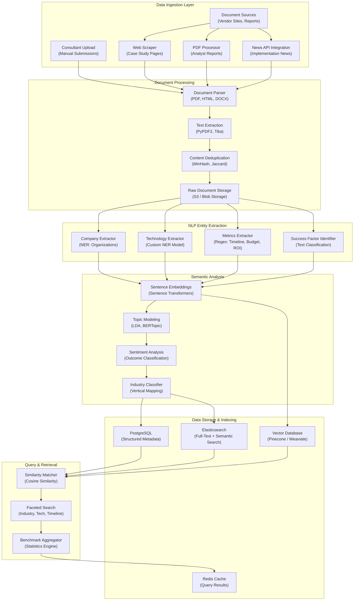

# Benchmarking Database & Case Study Synthesis Pipeline

**Date**: 2025-11-18
**Sprint**: 06 - Digital Transformation Consulting Research Enablement
**Task**: 03 - Solution Architecture
**Author**: Solution Architect Skill

---

## Executive Summary

The Benchmarking Database is a critical intelligence component that aggregates and synthesizes 1,000+ digital transformation implementation case studies from public sources (vendor case studies, analyst reports, news articles, conference presentations). It provides consultants with implementation benchmarks, success factors, failure patterns, timelines, budgets, and ROI metrics across industries and technology categories.

The architecture combines automated document ingestion, NLP-based entity extraction (company names, technologies, timelines, budgets, outcomes), similarity matching for consultant queries, and multi-dimensional indexing for faceted search. The pipeline is designed for continuous enrichment with weekly batch imports and real-time consultant contributions.

Key technology choices include PostgreSQL for structured case study metadata, Elasticsearch for full-text search and similarity matching, S3 for raw document storage, and a custom NLP pipeline using spaCy for entity extraction and sentence transformers for semantic similarity.

---

## Benchmarking Database Architecture

### High-Level Pipeline Architecture



---

## Data Ingestion Layer

### 1. Document Sources

**Vendor Case Study Pages**<br/>
Direct scraping of vendor websites (Salesforce Success Stories, Microsoft Customer Stories, AWS Case Studies)<br/>
Volume: 300+ vendors, 3,000+ case studies<br/>
Update frequency: Weekly batch scraping with change detection

**Analyst Reports**<br/>
Gartner, Forrester, IDC research reports with implementation data<br/>
Source: Paid subscriptions, publicly available research<br/>
Volume: 200+ reports annually<br/>
Format: PDF, HTML

**News Articles**<br/>
Technology news covering DX implementations (TechCrunch, VentureBeat, industry publications)<br/>
Source: News APIs (NewsAPI, Bing News)<br/>
Volume: 500+ articles monthly<br/>
Filter: Implementation announcements, ROI disclosures, project milestones

**Conference Presentations**<br/>
Slide decks from industry conferences (AWS re:Invent, Dreamforce, Microsoft Ignite)<br/>
Source: SlideShare, conference websites, YouTube transcripts<br/>
Volume: 100+ presentations annually

**Consultant Contributions**<br/>
Manual uploads from consultants with client permission<br/>
Validation: Admin approval workflow<br/>
Incentive: Premium analytics access for contributors

### 2. Web Scraper (Case Study Pages)

**Scrapy Spider for Vendor Case Studies**:

```python
import scrapy
from scrapy.linkextractors import LinkExtractor

class VendorCaseStudySpider(scrapy.Spider):
    name = 'vendor_case_studies'

    # Target vendor case study directories
    start_urls = [
        'https://www.salesforce.com/customer-success-stories/',
        'https://customers.microsoft.com/en-us/search',
        'https://aws.amazon.com/solutions/case-studies/',
        # ... 300+ vendors
    ]

    custom_settings = {
        'DEPTH_LIMIT': 3,
        'DOWNLOAD_DELAY': 2,  # Respect server load
    }

    def parse(self, response):
        # Extract case study links
        le = LinkExtractor(allow=r'/customer-success-stories/[\w-]+')
        for link in le.extract_links(response):
            yield scrapy.Request(link.url, callback=self.parse_case_study)

    def parse_case_study(self, response):
        """Extract structured data from case study page"""

        yield {
            'url': response.url,
            'vendor': self._extract_vendor(response.url),
            'title': response.css('h1::text').get(),
            'customer_name': response.css('.customer-name::text').get(),
            'industry': response.css('.industry::text').get(),
            'technologies': response.css('.technology-tag::text').getall(),
            'full_text': response.css('article').get(),
            'published_date': response.css('.publish-date::text').get(),
            'scraped_at': datetime.utcnow().isoformat(),
        }
```

**Deduplication Strategy**:
- URL-based deduplication (canonical URLs)
- Content-based deduplication (MinHash for fuzzy matching)
- Title similarity matching (Jaccard coefficient > 0.8)

### 3. PDF Processor (Analyst Reports)

**PDF Text Extraction Pipeline**:

```python
from PyPDF2 import PdfReader
from io import BytesIO
import re

class AnalystReportProcessor:
    def __init__(self):
        self.section_patterns = {
            'executive_summary': r'Executive Summary',
            'methodology': r'Methodology|Research Method',
            'case_studies': r'Case Studies|Implementation Examples',
            'recommendations': r'Recommendations|Best Practices',
        }

    def process_pdf(self, pdf_bytes: bytes) -> dict:
        """Extract structured data from analyst report PDF"""

        reader = PdfReader(BytesIO(pdf_bytes))

        # Extract full text
        full_text = ''
        for page in reader.pages:
            full_text += page.extract_text()

        # Identify sections
        sections = self._extract_sections(full_text)

        # Extract case studies from dedicated section
        case_studies = self._extract_case_studies(sections.get('case_studies', ''))

        return {
            'report_metadata': self._extract_metadata(reader),
            'sections': sections,
            'case_studies': case_studies,
            'full_text': full_text,
        }

    def _extract_case_studies(self, text: str) -> list:
        """Extract individual case studies from report text"""

        # Split by case study headers (e.g., "Company: Acme Corp")
        case_study_pattern = r'(?:Company|Organization|Customer):\s*([^\n]+)'
        matches = re.finditer(case_study_pattern, text)

        case_studies = []
        positions = [m.start() for m in re.finditer(case_study_pattern, text)]

        for i, pos in enumerate(positions):
            # Extract text until next case study
            end_pos = positions[i + 1] if i + 1 < len(positions) else len(text)
            case_text = text[pos:end_pos]

            case_studies.append({
                'company_name': re.search(case_study_pattern, case_text).group(1),
                'text': case_text,
            })

        return case_studies
```

**OCR for Scanned PDFs**:
- Use Tesseract OCR for image-based PDFs
- Pre-processing: deskew, noise removal, contrast enhancement
- Accuracy: 95%+ for clean scanned documents

### 4. News API Integration

**NewsAPI Configuration**:

```python
from newsapi import NewsApiClient
from datetime import datetime, timedelta

class DXImplementationNewsAggregator:
    def __init__(self, api_key: str):
        self.newsapi = NewsApiClient(api_key=api_key)

        # Query keywords for DX implementations
        self.keywords = [
            '"digital transformation" AND (implementation OR deployment)',
            '"Salesforce" AND (implementation OR "go-live")',
            '"cloud migration" AND (completed OR success)',
            # ... 50+ keyword combinations
        ]

    def fetch_recent_articles(self, days_back: int = 7) -> list:
        """Fetch DX implementation news from past week"""

        articles = []
        from_date = (datetime.now() - timedelta(days=days_back)).isoformat()

        for query in self.keywords:
            response = self.newsapi.get_everything(
                q=query,
                from_param=from_date,
                language='en',
                sort_by='relevancy',
                page_size=100
            )

            articles.extend(response['articles'])

        # Deduplicate by URL
        unique_articles = {a['url']: a for a in articles}.values()

        return list(unique_articles)
```

---

## NLP Entity Extraction

### 1. Company Extractor (NER: Organizations)

**Purpose**: Extract company names (customer, vendor, partner) from unstructured case study text

**Implementation with spaCy**:

```python
import spacy
from typing import List, Dict

class CompanyExtractor:
    def __init__(self):
        # Load pre-trained NER model
        self.nlp = spacy.load('en_core_web_lg')

    def extract_companies(self, text: str) -> Dict[str, List[str]]:
        """Extract company entities with role classification"""

        doc = self.nlp(text)

        companies = {
            'customer': [],
            'vendor': [],
            'partner': [],
        }

        for ent in doc.ents:
            if ent.label_ == 'ORG':
                # Classify company role based on context
                role = self._classify_company_role(ent, doc)
                companies[role].append(ent.text)

        # Deduplicate
        for role in companies:
            companies[role] = list(set(companies[role]))

        return companies

    def _classify_company_role(self, entity, doc) -> str:
        """Classify company as customer, vendor, or partner based on context"""

        # Extract sentence containing entity
        sent = [s for s in doc.sents if entity.start >= s.start and entity.end <= s.end][0]
        sent_text = sent.text.lower()

        # Rule-based classification
        if any(keyword in sent_text for keyword in ['customer', 'client', 'deployed', 'implemented']):
            return 'customer'
        elif any(keyword in sent_text for keyword in ['vendor', 'provider', 'solution from', 'powered by']):
            return 'vendor'
        elif any(keyword in sent_text for keyword in ['partner', 'integration', 'in conjunction with']):
            return 'partner'
        else:
            return 'customer'  # Default assumption
```

**Entity Resolution**:
- Normalize company name variants ("Microsoft" vs "Microsoft Corp" vs "MSFT")
- Use company name database (Crunchbase, Clearbit) for canonical names
- Fuzzy matching with Levenshtein distance threshold

### 2. Technology Extractor (Custom NER Model)

**Purpose**: Extract technology/product names from case study text (specialized NER model for DX technologies)

**Training Data Annotation**:

```json
{
  "text": "Acme Corp implemented Salesforce Sales Cloud and Einstein AI to automate lead scoring, resulting in 40% increase in qualified leads.",
  "entities": [
    {"start": 23, "end": 45, "label": "TECHNOLOGY", "text": "Salesforce Sales Cloud"},
    {"start": 50, "end": 61, "label": "TECHNOLOGY", "text": "Einstein AI"},
    {"start": 75, "end": 88, "label": "FEATURE", "text": "lead scoring"},
    {"start": 103, "end": 107, "label": "METRIC", "text": "40%"},
    {"start": 120, "end": 135, "label": "OUTCOME", "text": "qualified leads"}
  ]
}
```

**Custom NER Model Training**:

```python
import spacy
from spacy.training import Example

class TechnologyNERTrainer:
    def __init__(self):
        self.nlp = spacy.blank('en')
        self.ner = self.nlp.add_pipe('ner')

        # Custom entity labels
        self.labels = ['TECHNOLOGY', 'FEATURE', 'METRIC', 'OUTCOME']
        for label in self.labels:
            self.ner.add_label(label)

    def train(self, training_data: List[Dict], epochs: int = 30):
        """Train custom NER model on annotated case studies"""

        # Convert to spaCy training format
        train_examples = []
        for item in training_data:
            doc = self.nlp.make_doc(item['text'])
            entities = [(e['start'], e['end'], e['label']) for e in item['entities']]
            example = Example.from_dict(doc, {'entities': entities})
            train_examples.append(example)

        # Training loop
        optimizer = self.nlp.begin_training()
        for epoch in range(epochs):
            losses = {}
            self.nlp.update(train_examples, sgd=optimizer, losses=losses)
            print(f"Epoch {epoch}: Loss = {losses['ner']:.2f}")

        # Save model
        self.nlp.to_disk('./models/technology_ner_v2')

    def extract_technologies(self, text: str) -> Dict:
        """Extract technology entities from case study text"""
        doc = self.nlp(text)

        return {
            'technologies': [ent.text for ent in doc.ents if ent.label_ == 'TECHNOLOGY'],
            'features': [ent.text for ent in doc.ents if ent.label_ == 'FEATURE'],
            'metrics': [ent.text for ent in doc.ents if ent.label_ == 'METRIC'],
            'outcomes': [ent.text for ent in doc.ents if ent.label_ == 'OUTCOME'],
        }
```

**Training Dataset**:
- 5,000+ manually annotated case studies
- Technology taxonomy alignment (500+ DX technologies)
- Active learning: Model suggests annotations, human verifies

### 3. Metrics Extractor (Regex: Timeline, Budget, ROI)

**Purpose**: Extract quantitative metrics (implementation timeline, budget, ROI, cost savings) using regex patterns

**Metric Extraction Patterns**:

```python
import re
from typing import Dict, List, Optional

class MetricsExtractor:
    def __init__(self):
        # Regex patterns for common metrics
        self.patterns = {
            'timeline': [
                r'(?:implemented|deployed|completed)\s+in\s+(\d+)\s+(weeks?|months?|years?)',
                r'(\d+)[-\s](?:week|month|year)\s+(?:implementation|deployment|project)',
                r'from\s+(?:start\s+to\s+)?(?:go-live|launch)\s+in\s+(\d+)\s+(weeks?|months?)',
            ],
            'budget': [
                r'\$(\d+(?:,\d{3})*(?:\.\d{2})?)\s*(?:million|M|K|thousand)',
                r'budget\s+of\s+\$(\d+(?:,\d{3})*)',
                r'investment\s+of\s+\$(\d+(?:,\d{3})*)',
                r'total\s+cost[:\s]+\$(\d+(?:,\d{3})*)',
            ],
            'roi': [
                r'ROI\s+of\s+(\d+(?:\.\d+)?)%',
                r'return\s+on\s+investment[:\s]+(\d+(?:\.\d+)?)%',
                r'(\d+)x\s+ROI',
                r'(\d+(?:\.\d+)?)[:\s]*1\s+ROI',
            ],
            'cost_savings': [
                r'(?:saved|reduced\s+costs\s+by|cost\s+savings\s+of)\s+\$(\d+(?:,\d{3})*(?:\.\d{2})?)\s*(?:million|M|K)?',
                r'(\d+)%\s+(?:reduction\s+in\s+costs|cost\s+savings)',
            ],
            'efficiency_gains': [
                r'(\d+)%\s+(?:increase\s+in\s+productivity|faster|improvement)',
                r'(?:improved|increased)\s+(?:efficiency|productivity)\s+by\s+(\d+)%',
            ],
        }

    def extract_metrics(self, text: str) -> Dict[str, List[Dict]]:
        """Extract all metrics from case study text"""

        metrics = {key: [] for key in self.patterns.keys()}

        for metric_type, patterns in self.patterns.items():
            for pattern in patterns:
                matches = re.finditer(pattern, text, re.IGNORECASE)

                for match in matches:
                    value = match.group(1)
                    unit = match.group(2) if len(match.groups()) > 1 else None

                    metrics[metric_type].append({
                        'value': self._normalize_value(value, unit),
                        'unit': self._normalize_unit(unit),
                        'raw_text': match.group(0),
                        'confidence': self._calculate_confidence(match, text)
                    })

        return metrics

    def _normalize_value(self, value: str, unit: Optional[str]) -> float:
        """Convert extracted value to standard numeric format"""

        # Remove commas
        numeric_value = float(value.replace(',', ''))

        # Scale by unit (million, thousand)
        if unit and 'million' in unit.lower():
            numeric_value *= 1_000_000
        elif unit and ('thousand' in unit.lower() or unit.upper() == 'K'):
            numeric_value *= 1_000

        return numeric_value

    def _calculate_confidence(self, match, full_text: str) -> float:
        """Estimate confidence based on context"""

        # Higher confidence if metric appears in structured section
        structured_sections = ['results', 'outcomes', 'benefits', 'roi', 'key metrics']
        context_before = full_text[max(0, match.start() - 100):match.start()].lower()

        if any(section in context_before for section in structured_sections):
            return 0.95
        else:
            return 0.75
```

**Post-Processing**:
- Filter unrealistic values (e.g., timeline > 10 years, ROI > 10,000%)
- Aggregate multiple mentions of same metric (take median)
- Flag conflicting metrics for manual review

### 4. Success Factor Identifier (Text Classification)

**Purpose**: Identify key success factors and failure patterns from case study narratives

**Success Factor Taxonomy**:

```yaml
success_factors:
  - category: Executive Sponsorship
    keywords: [C-level support, leadership buy-in, executive champion]

  - category: Change Management
    keywords: [training program, user adoption, communication plan]

  - category: Agile Methodology
    keywords: [iterative approach, sprints, continuous delivery]

  - category: Vendor Partnership
    keywords: [vendor support, implementation partner, consulting]

  - category: Data Migration Strategy
    keywords: [data quality, ETL, migration planning]

failure_patterns:
  - category: Scope Creep
    keywords: [expanded scope, additional requirements, timeline delays]

  - category: User Resistance
    keywords: [low adoption, resistance to change, training challenges]

  - category: Integration Issues
    keywords: [compatibility problems, API limitations, data sync issues]
```

**Text Classification Model**:

```python
from transformers import AutoTokenizer, AutoModelForSequenceClassification
import torch

class SuccessFactorClassifier:
    def __init__(self, model_path='./models/success_factor_classifier'):
        self.tokenizer = AutoTokenizer.from_pretrained(model_path)
        self.model = AutoModelForSequenceClassification.from_pretrained(model_path)

        self.labels = [
            'executive_sponsorship',
            'change_management',
            'agile_methodology',
            'vendor_partnership',
            'data_migration',
            'scope_creep',  # Failure pattern
            'user_resistance',  # Failure pattern
            'integration_issues',  # Failure pattern
        ]

    def identify_factors(self, text: str, threshold: float = 0.7) -> List[Dict]:
        """Identify success factors and failure patterns in case study text"""

        # Split text into sentences for granular classification
        sentences = self._split_sentences(text)

        identified_factors = []

        for sent in sentences:
            # Tokenize
            inputs = self.tokenizer(
                sent,
                return_tensors='pt',
                truncation=True,
                max_length=128
            )

            # Get predictions
            with torch.no_grad():
                outputs = self.model(**inputs)
                predictions = torch.sigmoid(outputs.logits)  # Multi-label

            # Extract factors above threshold
            for idx, prob in enumerate(predictions[0]):
                if prob > threshold:
                    identified_factors.append({
                        'factor': self.labels[idx],
                        'type': 'success' if idx < 5 else 'failure',
                        'confidence': prob.item(),
                        'evidence': sent
                    })

        return identified_factors
```

---

## Semantic Analysis

### 1. Sentence Embeddings (Sentence Transformers)

**Purpose**: Generate dense vector embeddings for case study text to enable semantic similarity search

**Model Selection**:
- **all-MiniLM-L6-v2**: Fast, lightweight (384-dim embeddings)
- **all-mpnet-base-v2**: Higher quality (768-dim embeddings)
- **Custom fine-tuned model**: Trained on DX case study corpus

**Embedding Generation Pipeline**:

```python
from sentence_transformers import SentenceTransformer
import numpy as np

class CaseStudyEmbedder:
    def __init__(self, model_name='all-mpnet-base-v2'):
        self.model = SentenceTransformer(model_name)

    def generate_embedding(self, case_study_text: str) -> np.ndarray:
        """Generate dense embedding for case study text"""

        # Truncate to max length (typically 512 tokens)
        embedding = self.model.encode(
            case_study_text,
            convert_to_numpy=True,
            show_progress_bar=False
        )

        return embedding

    def generate_batch_embeddings(self, texts: List[str]) -> np.ndarray:
        """Generate embeddings for batch of case studies (GPU-accelerated)"""

        embeddings = self.model.encode(
            texts,
            batch_size=32,
            convert_to_numpy=True,
            show_progress_bar=True
        )

        return embeddings
```

**Storage in Vector Database**:

```python
from pinecone import Pinecone, ServerlessSpec

class VectorDatabaseManager:
    def __init__(self, api_key: str):
        self.pc = Pinecone(api_key=api_key)

        # Create index for case study embeddings
        if 'case-studies' not in self.pc.list_indexes().names():
            self.pc.create_index(
                name='case-studies',
                dimension=768,  # all-mpnet-base-v2 dimension
                metric='cosine',
                spec=ServerlessSpec(cloud='aws', region='us-east-1')
            )

        self.index = self.pc.Index('case-studies')

    def upsert_case_study(self, case_study_id: str, embedding: np.ndarray, metadata: dict):
        """Insert/update case study embedding with metadata"""

        self.index.upsert(
            vectors=[{
                'id': case_study_id,
                'values': embedding.tolist(),
                'metadata': metadata  # Industry, technology, company, etc.
            }]
        )

    def search_similar(self, query_embedding: np.ndarray, top_k: int = 10, filters: dict = None):
        """Find similar case studies via vector similarity"""

        results = self.index.query(
            vector=query_embedding.tolist(),
            top_k=top_k,
            include_metadata=True,
            filter=filters  # e.g., {'industry': 'Healthcare', 'technology': 'Salesforce'}
        )

        return results['matches']
```

### 2. Topic Modeling (BERTopic)

**Purpose**: Discover latent topics in case study corpus for automatic categorization

**BERTopic Implementation**:

```python
from bertopic import BERTopic
from sklearn.feature_extraction.text import CountVectorizer

class CaseStudyTopicModeler:
    def __init__(self):
        # Use custom stopwords for DX domain
        self.vectorizer = CountVectorizer(
            stop_words='english',
            ngram_range=(1, 3),
            min_df=5
        )

        self.topic_model = BERTopic(
            vectorizer_model=self.vectorizer,
            min_topic_size=10,
            nr_topics='auto'
        )

    def fit_topics(self, case_studies: List[str]):
        """Discover topics in case study corpus"""

        topics, probs = self.topic_model.fit_transform(case_studies)

        # Get topic information
        topic_info = self.topic_model.get_topic_info()
        print(topic_info)

        # Save model
        self.topic_model.save('./models/case_study_topics')

        return topics, probs

    def assign_topics(self, new_case_study: str) -> Dict:
        """Assign topics to new case study"""

        topics, probs = self.topic_model.transform([new_case_study])

        return {
            'topic_id': topics[0],
            'topic_label': self.topic_model.get_topic(topics[0]),
            'confidence': probs[0][topics[0]]
        }
```

**Example Topics Discovered**:
- Topic 0: Cloud migration, legacy modernization, AWS, Azure
- Topic 1: CRM implementation, Salesforce, customer 360, sales automation
- Topic 2: Data analytics, BI platform, Tableau, real-time dashboards
- Topic 3: Change management, training, user adoption, stakeholder engagement

### 3. Sentiment Analysis (Outcome Classification)

**Purpose**: Classify case study outcome as positive, mixed, or negative

**Sentiment Classification**:

```python
from transformers import pipeline

class OutcomeSentimentAnalyzer:
    def __init__(self):
        self.classifier = pipeline(
            'sentiment-analysis',
            model='distilbert-base-uncased-finetuned-sst-2-english'
        )

    def analyze_outcome(self, case_study_text: str) -> Dict:
        """Classify case study outcome sentiment"""

        # Extract "results" or "outcomes" section
        outcome_section = self._extract_outcome_section(case_study_text)

        if not outcome_section:
            return {'sentiment': 'unknown', 'confidence': 0.0}

        # Classify sentiment
        result = self.classifier(outcome_section[:512])[0]  # Truncate to max length

        return {
            'sentiment': result['label'].lower(),  # 'positive' or 'negative'
            'confidence': result['score']
        }

    def _extract_outcome_section(self, text: str) -> str:
        """Extract results/outcomes section from case study"""

        # Look for common section headers
        section_patterns = [
            r'(?:Results|Outcomes|Benefits|Impact)[:\n](.*?)(?:\n\n|\Z)',
            r'(?:Key\s+)?(?:Results|Achievements)[:\n](.*?)(?:\n\n|\Z)',
        ]

        for pattern in section_patterns:
            match = re.search(pattern, text, re.IGNORECASE | re.DOTALL)
            if match:
                return match.group(1)

        # Fallback: Last 500 characters (often contain conclusion)
        return text[-500:]
```

---

## Data Storage & Indexing

### PostgreSQL Schema Design

**Case Study Metadata Table**:

```sql
CREATE TABLE case_studies (
    id UUID PRIMARY KEY DEFAULT gen_random_uuid(),
    tenant_id UUID NOT NULL REFERENCES tenants(id),

    -- Source information
    source_type VARCHAR(50) NOT NULL,  -- 'vendor', 'analyst', 'news', 'consultant'
    source_url TEXT,
    scraped_at TIMESTAMP NOT NULL,
    published_date DATE,

    -- Core metadata
    title TEXT NOT NULL,
    customer_company VARCHAR(255),
    customer_industry VARCHAR(100),
    vendor_company VARCHAR(255),
    technologies JSONB,  -- Array of technology names

    -- Extracted metrics
    timeline_weeks INTEGER,
    budget_usd NUMERIC(12, 2),
    roi_percent NUMERIC(5, 2),
    cost_savings_usd NUMERIC(12, 2),

    -- NLP-extracted entities
    success_factors JSONB,  -- Array of success factor objects
    failure_patterns JSONB,  -- Array of failure pattern objects

    -- Semantic analysis
    topics JSONB,  -- Array of topic IDs and probabilities
    outcome_sentiment VARCHAR(20),  -- 'positive', 'negative', 'mixed'
    outcome_confidence NUMERIC(3, 2),

    -- Full content
    full_text TEXT,
    summary TEXT,

    -- Indexing
    embedding_id VARCHAR(100),  -- Reference to vector DB

    -- Audit
    created_at TIMESTAMP DEFAULT NOW(),
    updated_at TIMESTAMP DEFAULT NOW()
);

-- Indexes for faceted search
CREATE INDEX idx_case_studies_industry ON case_studies(customer_industry);
CREATE INDEX idx_case_studies_technologies ON case_studies USING GIN(technologies);
CREATE INDEX idx_case_studies_timeline ON case_studies(timeline_weeks);
CREATE INDEX idx_case_studies_budget ON case_studies(budget_usd);
CREATE INDEX idx_case_studies_tenant ON case_studies(tenant_id);

-- Full-text search index
CREATE INDEX idx_case_studies_fulltext ON case_studies USING GIN(to_tsvector('english', full_text));
```

**Benchmark Statistics Table**:

```sql
CREATE TABLE benchmark_statistics (
    id UUID PRIMARY KEY DEFAULT gen_random_uuid(),
    tenant_id UUID NOT NULL REFERENCES tenants(id),

    -- Aggregation dimensions
    technology VARCHAR(255) NOT NULL,
    industry VARCHAR(100),
    company_size VARCHAR(50),  -- 'SMB', 'Mid-Market', 'Enterprise'

    -- Aggregated metrics
    case_study_count INTEGER NOT NULL,
    avg_timeline_weeks NUMERIC(5, 1),
    median_timeline_weeks INTEGER,
    p90_timeline_weeks INTEGER,

    avg_budget_usd NUMERIC(12, 2),
    median_budget_usd NUMERIC(12, 2),
    p90_budget_usd NUMERIC(12, 2),

    avg_roi_percent NUMERIC(5, 2),
    median_roi_percent NUMERIC(5, 2),

    -- Success factors (aggregated from case studies)
    top_success_factors JSONB,  -- Array of {factor, frequency}

    -- Computed at
    computed_at TIMESTAMP DEFAULT NOW(),

    UNIQUE(tenant_id, technology, industry, company_size)
);

CREATE INDEX idx_benchmark_stats_technology ON benchmark_statistics(technology);
CREATE INDEX idx_benchmark_stats_industry ON benchmark_statistics(industry);
```

### Elasticsearch Index Mapping

**Case Study Index**:

```json
{
  "settings": {
    "number_of_shards": 3,
    "number_of_replicas": 2,
    "analysis": {
      "analyzer": {
        "case_study_analyzer": {
          "type": "custom",
          "tokenizer": "standard",
          "filter": ["lowercase", "stop", "snowball"]
        }
      }
    }
  },
  "mappings": {
    "properties": {
      "tenant_id": {"type": "keyword"},
      "title": {
        "type": "text",
        "analyzer": "case_study_analyzer",
        "fields": {"keyword": {"type": "keyword"}}
      },
      "customer_company": {"type": "keyword"},
      "customer_industry": {"type": "keyword"},
      "vendor_company": {"type": "keyword"},
      "technologies": {"type": "keyword"},

      "timeline_weeks": {"type": "integer"},
      "budget_usd": {"type": "scaled_float", "scaling_factor": 100},
      "roi_percent": {"type": "scaled_float", "scaling_factor": 100},

      "success_factors": {
        "type": "nested",
        "properties": {
          "factor": {"type": "keyword"},
          "confidence": {"type": "float"}
        }
      },

      "full_text": {
        "type": "text",
        "analyzer": "case_study_analyzer"
      },

      "published_date": {"type": "date"},
      "scraped_at": {"type": "date"}
    }
  }
}
```

---

## Query & Retrieval

### Similarity Matcher (Cosine Similarity)

**Purpose**: Find case studies similar to consultant's current engagement based on semantic similarity

**Hybrid Search (Keyword + Semantic)**:

```python
from typing import List, Dict
import numpy as np

class CaseStudySimilarityMatcher:
    def __init__(self, embedder, vector_db, elasticsearch):
        self.embedder = embedder
        self.vector_db = vector_db
        self.es = elasticsearch

    def find_similar_case_studies(
        self,
        query: str,
        filters: Dict = None,
        top_k: int = 20
    ) -> List[Dict]:
        """Hybrid search: Combine semantic similarity + keyword search"""

        # Step 1: Semantic search via vector similarity
        query_embedding = self.embedder.generate_embedding(query)
        vector_results = self.vector_db.search_similar(
            query_embedding,
            top_k=50,  # Over-fetch for re-ranking
            filters=filters
        )

        # Step 2: Keyword search via Elasticsearch
        es_query = {
            "query": {
                "bool": {
                    "must": [
                        {"multi_match": {
                            "query": query,
                            "fields": ["title^3", "full_text", "customer_company^2"],
                            "type": "best_fields"
                        }}
                    ],
                    "filter": self._build_filters(filters)
                }
            },
            "size": 50
        }

        es_results = self.es.search(index='case_studies', body=es_query)

        # Step 3: Merge and re-rank using reciprocal rank fusion
        merged_results = self._reciprocal_rank_fusion(
            vector_results,
            es_results['hits']['hits'],
            top_k=top_k
        )

        return merged_results

    def _reciprocal_rank_fusion(
        self,
        vector_results: List[Dict],
        es_results: List[Dict],
        k: int = 60,
        top_k: int = 20
    ) -> List[Dict]:
        """Combine rankings using reciprocal rank fusion"""

        scores = {}

        # Score from vector search
        for rank, result in enumerate(vector_results, start=1):
            case_id = result['id']
            scores[case_id] = scores.get(case_id, 0) + 1 / (k + rank)

        # Score from keyword search
        for rank, result in enumerate(es_results, start=1):
            case_id = result['_id']
            scores[case_id] = scores.get(case_id, 0) + 1 / (k + rank)

        # Sort by combined score
        ranked = sorted(scores.items(), key=lambda x: x[1], reverse=True)[:top_k]

        # Fetch full case study details
        return [self._get_case_study(case_id) for case_id, score in ranked]
```

### Faceted Search

**Purpose**: Enable consultants to filter case studies by industry, technology, timeline, budget ranges

**Elasticsearch Aggregation Query**:

```python
class FacetedCaseStudySearch:
    def __init__(self, elasticsearch):
        self.es = elasticsearch

    def search_with_facets(
        self,
        query: str = None,
        filters: Dict = None,
        page: int = 1,
        page_size: int = 20
    ) -> Dict:
        """Search with faceted navigation"""

        es_query = {
            "query": self._build_query(query, filters),
            "aggs": {
                "industries": {
                    "terms": {"field": "customer_industry", "size": 20}
                },
                "technologies": {
                    "terms": {"field": "technologies", "size": 50}
                },
                "timeline_ranges": {
                    "range": {
                        "field": "timeline_weeks",
                        "ranges": [
                            {"to": 12, "key": "0-3 months"},
                            {"from": 12, "to": 26, "key": "3-6 months"},
                            {"from": 26, "to": 52, "key": "6-12 months"},
                            {"from": 52, "key": "12+ months"}
                        ]
                    }
                },
                "budget_ranges": {
                    "range": {
                        "field": "budget_usd",
                        "ranges": [
                            {"to": 100000, "key": "$0-100K"},
                            {"from": 100000, "to": 500000, "key": "$100K-500K"},
                            {"from": 500000, "to": 1000000, "key": "$500K-1M"},
                            {"from": 1000000, "key": "$1M+"}
                        ]
                    }
                }
            },
            "from": (page - 1) * page_size,
            "size": page_size
        }

        results = self.es.search(index='case_studies', body=es_query)

        return {
            "results": results['hits']['hits'],
            "total": results['hits']['total']['value'],
            "facets": {
                "industries": results['aggregations']['industries']['buckets'],
                "technologies": results['aggregations']['technologies']['buckets'],
                "timeline_ranges": results['aggregations']['timeline_ranges']['buckets'],
                "budget_ranges": results['aggregations']['budget_ranges']['buckets'],
            }
        }
```

### Benchmark Aggregator

**Purpose**: Generate statistical benchmarks (median timeline, average ROI) for specific technology/industry combinations

**Benchmark Calculation**:

```python
import pandas as pd
from typing import Dict

class BenchmarkAggregator:
    def __init__(self, db_connection):
        self.db = db_connection

    def calculate_benchmarks(
        self,
        technology: str,
        industry: str = None,
        company_size: str = None
    ) -> Dict:
        """Calculate benchmark statistics for technology implementation"""

        # Build query
        query = """
            SELECT
                timeline_weeks,
                budget_usd,
                roi_percent,
                cost_savings_usd,
                success_factors
            FROM case_studies
            WHERE technologies @> %s::jsonb
        """

        params = [f'["{technology}"]']

        if industry:
            query += " AND customer_industry = %s"
            params.append(industry)

        if company_size:
            query += " AND company_size = %s"
            params.append(company_size)

        # Fetch data
        df = pd.read_sql_query(query, self.db, params=params)

        if len(df) == 0:
            return {"error": "No case studies found for criteria"}

        # Calculate statistics
        benchmarks = {
            "case_study_count": len(df),

            "timeline": {
                "avg_weeks": df['timeline_weeks'].mean(),
                "median_weeks": df['timeline_weeks'].median(),
                "p90_weeks": df['timeline_weeks'].quantile(0.9),
                "min_weeks": df['timeline_weeks'].min(),
                "max_weeks": df['timeline_weeks'].max(),
            },

            "budget": {
                "avg_usd": df['budget_usd'].mean(),
                "median_usd": df['budget_usd'].median(),
                "p90_usd": df['budget_usd'].quantile(0.9),
            },

            "roi": {
                "avg_percent": df['roi_percent'].mean(),
                "median_percent": df['roi_percent'].median(),
            },

            "top_success_factors": self._aggregate_success_factors(df['success_factors']),
        }

        return benchmarks

    def _aggregate_success_factors(self, success_factors_series) -> List[Dict]:
        """Count frequency of success factors across case studies"""

        factor_counts = {}

        for factors in success_factors_series:
            if factors:
                for factor_obj in factors:
                    factor = factor_obj['factor']
                    factor_counts[factor] = factor_counts.get(factor, 0) + 1

        # Sort by frequency
        sorted_factors = sorted(
            factor_counts.items(),
            key=lambda x: x[1],
            reverse=True
        )[:10]

        return [
            {"factor": factor, "frequency": count, "percentage": count / len(success_factors_series) * 100}
            for factor, count in sorted_factors
        ]
```

---

## Performance Optimization

### Caching Strategy

**Redis Cache for Benchmark Queries**:

```python
import json
from redis import Redis

class BenchmarkCache:
    def __init__(self, redis_client: Redis):
        self.redis = redis_client
        self.ttl = 3600  # 1 hour

    def get_cached_benchmark(self, technology: str, industry: str) -> Dict:
        """Retrieve cached benchmark or compute if missing"""

        cache_key = f"benchmark:{technology}:{industry}"
        cached = self.redis.get(cache_key)

        if cached:
            return json.loads(cached)

        # Cache miss - compute benchmark
        benchmark = self.aggregator.calculate_benchmarks(technology, industry)

        # Store in cache
        self.redis.setex(
            cache_key,
            self.ttl,
            json.dumps(benchmark)
        )

        return benchmark
```

**Query Performance Targets**:

| Query Type | Target Latency (p95) | Cache Hit Rate |
|------------|----------------------|----------------|
| Similarity Search | < 300ms | 75% |
| Faceted Search | < 400ms | 70% |
| Benchmark Calculation | < 500ms | 90% |
| Full-Text Search | < 200ms | 80% |

---

## Data Quality & Validation

### Validation Pipeline

**Case Study Quality Checks**:

```python
class CaseStudyValidator:
    def validate(self, case_study: Dict) -> Dict:
        """Run quality checks on extracted case study data"""

        validation_results = {
            "valid": True,
            "errors": [],
            "warnings": [],
            "quality_score": 100
        }

        # Required fields
        required_fields = ['title', 'customer_company', 'technologies', 'full_text']
        for field in required_fields:
            if not case_study.get(field):
                validation_results["errors"].append(f"Missing required field: {field}")
                validation_results["valid"] = False
                validation_results["quality_score"] -= 20

        # Minimum text length
        if len(case_study.get('full_text', '')) < 500:
            validation_results["warnings"].append("Text content too short (< 500 chars)")
            validation_results["quality_score"] -= 10

        # Timeline plausibility
        timeline = case_study.get('timeline_weeks')
        if timeline and (timeline < 1 or timeline > 520):  # 1 week to 10 years
            validation_results["warnings"].append(f"Implausible timeline: {timeline} weeks")
            validation_results["quality_score"] -= 15

        # Budget plausibility
        budget = case_study.get('budget_usd')
        if budget and (budget < 1000 or budget > 100_000_000):
            validation_results["warnings"].append(f"Implausible budget: ${budget}")
            validation_results["quality_score"] -= 15

        # ROI plausibility
        roi = case_study.get('roi_percent')
        if roi and (roi < -100 or roi > 10000):
            validation_results["warnings"].append(f"Implausible ROI: {roi}%")
            validation_results["quality_score"] -= 15

        return validation_results
```

---

## References

1. spaCy Documentation. (2024). *Named Entity Recognition*. Retrieved from https://spacy.io/usage/linguistic-features#named-entities

2. Sentence Transformers Documentation. (2024). *Pre-trained Models*. Retrieved from https://www.sbert.net/docs/pretrained_models.html

3. BERTopic Documentation. (2024). *Topic Modeling with BERT Embeddings*. Retrieved from https://maartengr.github.io/BERTopic/

4. Pinecone Documentation. (2024). *Vector Database for Machine Learning*. Retrieved from https://docs.pinecone.io/

5. Elasticsearch Documentation. (2024). *Full-Text Search and Analytics Engine*. Retrieved from https://www.elastic.co/guide/en/elasticsearch/reference/current/

6. NewsAPI Documentation. (2024). *News API for Developers*. Retrieved from https://newsapi.org/docs

7. PyPDF2 Documentation. (2024). *Python PDF Library*. Retrieved from https://pypdf2.readthedocs.io/

8. Hugging Face Transformers. (2024). *State-of-the-Art Natural Language Processing*. Retrieved from https://huggingface.co/docs/transformers/

9. Instant API. (2024). *Introduction to Natural Language Processing in Web Scraping*. Retrieved from https://web.instantapi.ai/blog/introduction-to-natural-language-processing-in-web-scraping/

10. TrackIt Medium. (2024). *How to Add a Redis Caching Layer to Your Elasticsearch Queries*. Retrieved from https://medium.com/trackit/how-to-add-a-redis-caching-layer-to-your-elasticsearch-queries-ca56e5e84d9b
