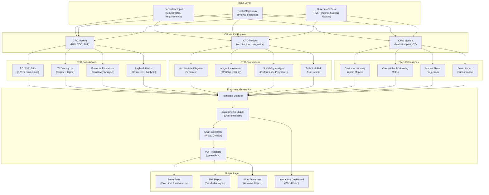
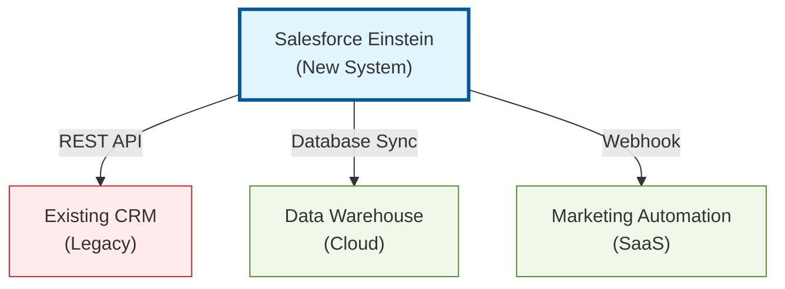

# Business Case Generator - Stakeholder-Specific Modules (CFO/CTO/CMO)

**Date**: 2025-11-18
**Sprint**: 06 - Digital Transformation Consulting Research Enablement
**Task**: 03 - Solution Architecture
**Author**: Solution Architect Skill

---

## Executive Summary

The Business Case Generator automatically creates stakeholder-specific business cases tailored to CFO (financial ROI/TCO), CTO (technical architecture/integration), and CMO (customer impact/market positioning) perspectives. This module transforms technology intelligence and benchmarking data into compelling executive presentations that address each stakeholder's unique priorities and decision criteria.

The architecture features modular calculation engines (ROI, TCO, risk modeling), template-based document generation (PowerPoint, PDF, Word), integration with benchmarking data for industry-specific assumptions, and customizable financial models. The system supports rapid iteration (< 5 seconds generation time), multi-currency support, and sensitivity analysis with interactive dashboards.

Key technology choices include Python for calculation engines, Docxtemplater for Office document generation, Chart.js/Plotly for interactive visualizations, and PostgreSQL for storing calculation assumptions and templates.

---

## Business Case Generator Architecture

### High-Level Component Architecture



---

## CFO Module - Financial Business Case

### 1. ROI Calculator (5-Year Projections)

**Purpose**: Calculate return on investment over 5-year period with industry-specific benchmarks

**ROI Calculation Model**:

```python
from typing import Dict, List
from dataclasses import dataclass
import numpy as np

@dataclass
class ROIInputs:
    """Input parameters for ROI calculation"""
    technology_name: str
    industry: str
    company_size: str  # 'SMB', 'Mid-Market', 'Enterprise'

    # Implementation costs
    software_licenses: float
    implementation_services: float
    hardware_infrastructure: float
    training_costs: float
    change_management: float

    # Ongoing costs (annual)
    annual_subscription: float
    maintenance_support: float
    staffing_costs: float

    # Benefits (annual)
    productivity_gains_pct: float  # % improvement
    cost_reduction_annual: float
    revenue_increase_annual: float

    # Assumptions
    discount_rate: float = 0.10  # 10% WACC
    inflation_rate: float = 0.03  # 3% annual inflation


class ROICalculator:
    def __init__(self, benchmark_service):
        self.benchmark_service = benchmark_service

    def calculate_roi(self, inputs: ROIInputs) -> Dict:
        """Calculate 5-year ROI with NPV, IRR, and payback period"""

        # Fetch industry benchmarks for validation
        benchmarks = self.benchmark_service.get_benchmarks(
            inputs.technology_name,
            inputs.industry,
            inputs.company_size
        )

        # Year 0: Implementation costs
        implementation_cost = (
            inputs.software_licenses +
            inputs.implementation_services +
            inputs.hardware_infrastructure +
            inputs.training_costs +
            inputs.change_management
        )

        # Years 1-5: Ongoing costs and benefits
        cash_flows = [-implementation_cost]  # Year 0

        for year in range(1, 6):
            # Annual costs (with inflation)
            annual_costs = (
                inputs.annual_subscription +
                inputs.maintenance_support +
                inputs.staffing_costs
            ) * (1 + inputs.inflation_rate) ** year

            # Annual benefits (with growth assumptions)
            annual_benefits = (
                self._calculate_productivity_value(inputs, year) +
                inputs.cost_reduction_annual * (1 + inputs.inflation_rate) ** year +
                inputs.revenue_increase_annual * (1.05 ** year)  # 5% revenue growth
            )

            # Net cash flow for year
            net_cash_flow = annual_benefits - annual_costs
            cash_flows.append(net_cash_flow)

        # Calculate financial metrics
        npv = self._calculate_npv(cash_flows, inputs.discount_rate)
        irr = self._calculate_irr(cash_flows)
        payback_period = self._calculate_payback_period(cash_flows)

        # Total ROI
        total_benefits = sum(cash_flows[1:])  # Sum of years 1-5
        total_costs = abs(cash_flows[0]) + sum(
            inputs.annual_subscription * (1 + inputs.inflation_rate) ** year
            for year in range(1, 6)
        )
        roi_percent = (total_benefits - total_costs) / total_costs * 100

        return {
            "summary": {
                "roi_percent": round(roi_percent, 1),
                "npv": round(npv, 2),
                "irr": round(irr * 100, 1) if irr else None,
                "payback_period_months": round(payback_period, 1),
                "total_investment": round(total_costs, 2),
                "total_benefits": round(total_benefits, 2),
            },
            "cash_flows": {
                f"year_{i}": round(cf, 2)
                for i, cf in enumerate(cash_flows)
            },
            "benchmarks": {
                "industry_avg_roi": benchmarks.get('avg_roi_percent'),
                "industry_median_timeline": benchmarks.get('median_timeline_weeks'),
                "variance_from_industry": round(roi_percent - benchmarks.get('avg_roi_percent', 0), 1)
            }
        }

    def _calculate_npv(self, cash_flows: List[float], discount_rate: float) -> float:
        """Calculate Net Present Value"""
        npv = sum(
            cf / (1 + discount_rate) ** year
            for year, cf in enumerate(cash_flows)
        )
        return npv

    def _calculate_irr(self, cash_flows: List[float]) -> float:
        """Calculate Internal Rate of Return using numpy"""
        try:
            return np.irr(cash_flows)
        except:
            return None  # No solution

    def _calculate_payback_period(self, cash_flows: List[float]) -> float:
        """Calculate payback period in months"""
        cumulative = 0
        initial_investment = abs(cash_flows[0])

        for year, cf in enumerate(cash_flows[1:], start=1):
            cumulative += cf
            if cumulative >= initial_investment:
                # Linear interpolation for fractional year
                previous_cumulative = cumulative - cf
                fraction = (initial_investment - previous_cumulative) / cf
                return (year - 1 + fraction) * 12  # Convert to months

        return None  # Payback not achieved in 5 years

    def _calculate_productivity_value(self, inputs: ROIInputs, year: int) -> float:
        """Estimate productivity gains in dollar value"""

        # Estimate current labor costs (industry average)
        avg_employee_cost = self._get_avg_employee_cost(inputs.company_size)
        affected_employees = self._estimate_affected_headcount(inputs.technology_name)

        # Productivity value = (labor cost * affected employees * productivity gain %)
        productivity_value = (
            avg_employee_cost *
            affected_employees *
            (inputs.productivity_gains_pct / 100)
        )

        return productivity_value * (1.03 ** year)  # Adjust for inflation
```

**Benchmark Integration**:

```python
class BenchmarkIntegrationService:
    def get_benchmarks(self, technology: str, industry: str, company_size: str) -> Dict:
        """Fetch industry benchmarks for ROI validation"""

        # Query benchmarking database
        query = """
            SELECT
                avg_roi_percent,
                median_roi_percent,
                avg_timeline_weeks,
                median_timeline_weeks,
                avg_budget_usd,
                top_success_factors
            FROM benchmark_statistics
            WHERE technology = %s
              AND (industry = %s OR industry IS NULL)
              AND (company_size = %s OR company_size IS NULL)
            ORDER BY
                CASE WHEN industry = %s THEN 1 ELSE 2 END,
                CASE WHEN company_size = %s THEN 1 ELSE 2 END
            LIMIT 1
        """

        result = self.db.execute(query, (technology, industry, company_size, industry, company_size))

        return result.fetchone() if result else {}
```

### 2. TCO Analyzer (CapEx + OpEx)

**Purpose**: Calculate Total Cost of Ownership over 5 years including hidden costs

**TCO Components**:

```yaml
capex_components:
  - Software Licenses (perpetual or initial subscription)
  - Hardware Infrastructure (servers, networking, storage)
  - Implementation Services (consulting, configuration)
  - Training & Onboarding (initial user training)
  - Change Management (communication, adoption programs)
  - Data Migration (ETL tools, consulting)

opex_components:
  - Annual Subscription Fees (SaaS recurring)
  - Maintenance & Support (vendor support contracts)
  - Staffing Costs (dedicated admin, power users)
  - Infrastructure Costs (cloud hosting, bandwidth)
  - Upgrades & Enhancements (version upgrades, new modules)
  - Training (ongoing user training, new hires)
  - Third-Party Integrations (API connectors, middleware)

hidden_costs:
  - Customization & Configuration (beyond standard implementation)
  - Data Quality & Governance (cleansing, master data management)
  - Shadow IT Mitigation (decommissioning legacy systems)
  - Opportunity Cost (executive time, IT resources)
```

**TCO Calculation Engine**:

```python
from typing import Dict, List

class TCOAnalyzer:
    def __init__(self):
        # Default cost multipliers based on company size
        self.size_multipliers = {
            'SMB': {'staffing': 0.5, 'infrastructure': 0.3},
            'Mid-Market': {'staffing': 1.0, 'infrastructure': 1.0},
            'Enterprise': {'staffing': 2.5, 'infrastructure': 3.0},
        }

    def calculate_tco(self, inputs: Dict) -> Dict:
        """Calculate 5-year TCO with CapEx and OpEx breakdown"""

        company_size = inputs['company_size']
        multiplier = self.size_multipliers[company_size]

        # Year 0: CapEx
        capex = {
            'software_licenses': inputs.get('software_licenses', 0),
            'hardware': inputs.get('hardware_infrastructure', 0) * multiplier['infrastructure'],
            'implementation': inputs.get('implementation_services', 0),
            'training': inputs.get('training_costs', 0),
            'change_management': inputs.get('change_management', 0),
            'data_migration': inputs.get('data_migration', 0),
        }

        total_capex = sum(capex.values())

        # Years 1-5: OpEx
        annual_opex = {
            'subscription': inputs.get('annual_subscription', 0),
            'maintenance': inputs.get('maintenance_support', 0),
            'staffing': inputs.get('staffing_costs', 0) * multiplier['staffing'],
            'infrastructure': inputs.get('annual_infrastructure', 0) * multiplier['infrastructure'],
            'training': inputs.get('annual_training', 500) * inputs.get('user_count', 100) * 0.01,  # $5/user
            'integrations': inputs.get('integration_costs', 0),
        }

        # Hidden costs (% of CapEx)
        hidden_costs = {
            'customization': total_capex * 0.15,  # 15% of CapEx
            'data_quality': total_capex * 0.10,  # 10% of CapEx
            'opportunity_cost': inputs.get('executive_time_hours', 200) * 300,  # $300/hour
        }

        # Project 5-year OpEx with inflation
        inflation_rate = inputs.get('inflation_rate', 0.03)
        opex_by_year = []

        for year in range(1, 6):
            year_opex = sum(
                cost * (1 + inflation_rate) ** year
                for cost in annual_opex.values()
            )
            opex_by_year.append(year_opex)

        total_opex_5yr = sum(opex_by_year)

        # Total TCO
        total_tco = total_capex + sum(hidden_costs.values()) + total_opex_5yr

        return {
            "summary": {
                "total_tco_5yr": round(total_tco, 2),
                "total_capex": round(total_capex + sum(hidden_costs.values()), 2),
                "total_opex_5yr": round(total_opex_5yr, 2),
                "avg_annual_cost": round(total_tco / 5, 2),
            },
            "capex_breakdown": {k: round(v, 2) for k, v in capex.items()},
            "hidden_costs": {k: round(v, 2) for k, v in hidden_costs.items()},
            "annual_opex": {k: round(v, 2) for k, v in annual_opex.items()},
            "opex_by_year": {
                f"year_{i}": round(opex, 2)
                for i, opex in enumerate(opex_by_year, start=1)
            }
        }
```

### 3. Financial Risk Model (Sensitivity Analysis)

**Purpose**: Assess financial risk with sensitivity analysis on key assumptions

**Risk Variables**:

```yaml
high_risk_variables:
  - User Adoption Rate (50% to 95%)
  - Implementation Timeline (6 months to 18 months)
  - Annual Subscription Increase (3% to 15%)
  - Productivity Gains (10% to 40%)

medium_risk_variables:
  - Discount Rate (8% to 12%)
  - Revenue Growth Rate (0% to 10%)
  - Integration Complexity (Low to High)

low_risk_variables:
  - Inflation Rate (2% to 4%)
  - Staffing Costs (+/- 10%)
```

**Monte Carlo Simulation**:

```python
import numpy as np
from scipy import stats

class FinancialRiskModel:
    def __init__(self):
        self.num_simulations = 10000

    def run_sensitivity_analysis(self, base_inputs: ROIInputs) -> Dict:
        """Run Monte Carlo simulation on ROI with variable assumptions"""

        roi_results = []
        npv_results = []

        for _ in range(self.num_simulations):
            # Randomly vary key assumptions
            varied_inputs = self._vary_assumptions(base_inputs)

            # Calculate ROI with varied inputs
            calculator = ROICalculator(None)
            result = calculator.calculate_roi(varied_inputs)

            roi_results.append(result['summary']['roi_percent'])
            npv_results.append(result['summary']['npv'])

        # Statistical analysis
        roi_stats = {
            "mean": np.mean(roi_results),
            "median": np.median(roi_results),
            "std_dev": np.std(roi_results),
            "p10": np.percentile(roi_results, 10),  # Pessimistic
            "p50": np.percentile(roi_results, 50),  # Base case
            "p90": np.percentile(roi_results, 90),  # Optimistic
            "probability_positive": sum(1 for r in roi_results if r > 0) / len(roi_results) * 100,
        }

        npv_stats = {
            "mean": np.mean(npv_results),
            "p10": np.percentile(npv_results, 10),
            "p50": np.percentile(npv_results, 50),
            "p90": np.percentile(npv_results, 90),
        }

        # Risk assessment
        risk_level = self._assess_risk_level(roi_stats)

        return {
            "roi_statistics": {k: round(v, 2) for k, v in roi_stats.items()},
            "npv_statistics": {k: round(v, 2) for k, v in npv_stats.items()},
            "risk_assessment": risk_level,
            "distribution_data": {
                "roi_values": roi_results,
                "npv_values": npv_results,
            }
        }

    def _vary_assumptions(self, base_inputs: ROIInputs) -> ROIInputs:
        """Randomly vary input assumptions within realistic ranges"""

        varied = base_inputs.__dict__.copy()

        # User adoption rate (normal distribution, mean=75%, std=15%)
        adoption_rate = np.random.normal(0.75, 0.15)
        adoption_rate = np.clip(adoption_rate, 0.5, 0.95)

        # Adjust benefits by adoption rate
        varied['productivity_gains_pct'] *= adoption_rate
        varied['revenue_increase_annual'] *= adoption_rate

        # Subscription price increase (uniform 3% to 15%)
        price_increase = np.random.uniform(1.03, 1.15)
        varied['annual_subscription'] *= price_increase

        # Implementation cost variance (triangular distribution, -10% to +30%)
        cost_variance = np.random.triangular(0.9, 1.0, 1.3)
        varied['implementation_services'] *= cost_variance

        return ROIInputs(**varied)

    def _assess_risk_level(self, roi_stats: Dict) -> Dict:
        """Assess risk level based on ROI distribution"""

        if roi_stats['p10'] > 50:
            risk_level = "Low"
            risk_color = "green"
        elif roi_stats['p10'] > 0:
            risk_level = "Medium"
            risk_color = "yellow"
        else:
            risk_level = "High"
            risk_color = "red"

        return {
            "level": risk_level,
            "color": risk_color,
            "explanation": f"{roi_stats['probability_positive']:.0f}% probability of positive ROI"
        }
```

---

## CTO Module - Technical Business Case

### 1. Architecture Diagram Generator

**Purpose**: Auto-generate system architecture diagrams showing technology integration with existing stack

**Mermaid Diagram Generation**:

```python
class ArchitectureDiagramGenerator:
    def __init__(self):
        self.integration_patterns = {
            'REST API': {'icon': 'fa-plug', 'color': 'blue'},
            'Webhook': {'icon': 'fa-arrow-right', 'color': 'green'},
            'Database Sync': {'icon': 'fa-database', 'color': 'purple'},
            'Message Queue': {'icon': 'fa-stream', 'color': 'orange'},
        }

    def generate_architecture_diagram(
        self,
        new_technology: Dict,
        existing_systems: List[Dict],
        integration_points: List[Dict]
    ) -> str:
        """Generate Mermaid architecture diagram"""

        diagram = ['graph TB']

        # Add new technology node
        diagram.append(f'    A["{new_technology["name"]}<br/>(New System)"]')
        diagram.append('    style A fill:#e1f5ff,stroke:#01579b,stroke-width:3px')

        # Add existing systems
        for i, system in enumerate(existing_systems, start=1):
            node_id = chr(65 + i)  # B, C, D, ...
            diagram.append(f'    {node_id}["{system["name"]}<br/>({system["type"]})"]')

            # Style based on system type
            if system['type'] == 'Legacy':
                diagram.append(f'    style {node_id} fill:#ffebee,stroke:#c62828')
            else:
                diagram.append(f'    style {node_id} fill:#f1f8e9,stroke:#558b2f')

        # Add integration connections
        for integration in integration_points:
            source = integration['source']
            target = integration['target']
            method = integration['method']

            diagram.append(f'    {source} -->|"{method}"| {target}')

        return '\n'.join(diagram)
```

**Example Output**:



### 2. Integration Assessor (API Compatibility)

**Purpose**: Assess integration complexity and API compatibility with existing tech stack

**Integration Assessment Matrix**:

```python
class IntegrationAssessor:
    def __init__(self):
        # Pre-built integration compatibility matrix
        self.compatibility_matrix = {
            ('Salesforce', 'Microsoft Dynamics'): {'difficulty': 'Medium', 'method': 'REST API'},
            ('Salesforce', 'SAP'): {'difficulty': 'High', 'method': 'Middleware (MuleSoft)'},
            ('HubSpot', 'Salesforce'): {'difficulty': 'Low', 'method': 'Native Connector'},
            # ... 1,000+ pre-mapped integrations
        }

    def assess_integration(
        self,
        new_technology: str,
        existing_systems: List[str]
    ) -> List[Dict]:
        """Assess integration difficulty for each existing system"""

        assessments = []

        for system in existing_systems:
            # Check compatibility matrix
            key = (new_technology, system)
            compatibility = self.compatibility_matrix.get(key)

            if compatibility:
                assessment = compatibility
            else:
                # Fallback: Analyze based on API capabilities
                assessment = self._analyze_api_compatibility(new_technology, system)

            assessments.append({
                'existing_system': system,
                'difficulty': assessment['difficulty'],
                'method': assessment['method'],
                'estimated_hours': self._estimate_integration_hours(assessment['difficulty']),
                'recommended_tools': self._recommend_integration_tools(assessment['method']),
            })

        return assessments

    def _estimate_integration_hours(self, difficulty: str) -> int:
        """Estimate integration effort in hours"""
        difficulty_hours = {
            'Low': 40,       # 1 week
            'Medium': 120,   # 3 weeks
            'High': 240,     # 6 weeks
            'Very High': 480  # 12 weeks
        }
        return difficulty_hours.get(difficulty, 160)

    def _recommend_integration_tools(self, method: str) -> List[str]:
        """Recommend integration tools based on method"""
        tool_recommendations = {
            'REST API': ['Postman', 'Custom code', 'Zapier'],
            'Middleware (MuleSoft)': ['MuleSoft Anypoint', 'Dell Boomi', 'Informatica'],
            'Native Connector': ['Vendor-provided connector'],
            'Database Sync': ['Fivetran', 'Stitch', 'AWS Glue'],
        }
        return tool_recommendations.get(method, ['Custom integration required'])
```

### 3. Scalability Analyzer

**Purpose**: Project performance and scalability for future growth

**Performance Projection Model**:

```python
class ScalabilityAnalyzer:
    def analyze_scalability(
        self,
        technology: str,
        current_metrics: Dict,
        growth_projections: Dict
    ) -> Dict:
        """Project performance at future scale"""

        # Current state
        current_users = current_metrics['user_count']
        current_transactions_per_day = current_metrics['transactions_per_day']

        # 3-year growth projections
        projected_users_3yr = current_users * (1 + growth_projections['user_growth_rate']) ** 3
        projected_transactions_3yr = current_transactions_per_day * (1 + growth_projections['transaction_growth_rate']) ** 3

        # Technology-specific performance characteristics
        performance_limits = self._get_performance_limits(technology)

        # Calculate utilization at projected scale
        user_utilization_3yr = projected_users_3yr / performance_limits['max_users'] * 100
        transaction_utilization_3yr = projected_transactions_3yr / performance_limits['max_transactions_per_day'] * 100

        # Scaling recommendations
        scaling_needed = user_utilization_3yr > 70 or transaction_utilization_3yr > 70

        if scaling_needed:
            recommendations = self._generate_scaling_recommendations(
                user_utilization_3yr,
                transaction_utilization_3yr,
                performance_limits
            )
        else:
            recommendations = ["No additional scaling required for 3-year horizon"]

        return {
            "current_state": {
                "users": current_users,
                "transactions_per_day": current_transactions_per_day,
            },
            "projected_state_3yr": {
                "users": int(projected_users_3yr),
                "transactions_per_day": int(projected_transactions_3yr),
                "user_utilization_pct": round(user_utilization_3yr, 1),
                "transaction_utilization_pct": round(transaction_utilization_3yr, 1),
            },
            "performance_limits": performance_limits,
            "scaling_needed": scaling_needed,
            "recommendations": recommendations,
        }

    def _get_performance_limits(self, technology: str) -> Dict:
        """Get technology-specific performance limits"""

        # Pre-configured limits for major platforms
        limits_database = {
            'Salesforce Sales Cloud': {
                'max_users': 100000,
                'max_transactions_per_day': 5000000,
                'storage_per_user_mb': 20,
            },
            'Microsoft Dynamics 365': {
                'max_users': 50000,
                'max_transactions_per_day': 2000000,
                'storage_per_user_mb': 10,
            },
            # ... more technologies
        }

        return limits_database.get(technology, {
            'max_users': 10000,
            'max_transactions_per_day': 1000000,
            'storage_per_user_mb': 5,
        })
```

---

## CMO Module - Market Impact Business Case

### 1. Customer Journey Impact Mapper

**Purpose**: Visualize how technology improves customer touchpoints across journey stages

**Customer Journey Framework**:

```yaml
journey_stages:
  - stage: Awareness
    touchpoints: [Website, Social Media, Ads, Content Marketing]
    metrics: [Traffic, Impressions, Engagement Rate]

  - stage: Consideration
    touchpoints: [Product Pages, Demo Requests, Webinars, Case Studies]
    metrics: [Page Views, Demo Conversion, Time on Site]

  - stage: Purchase
    touchpoints: [Checkout, Sales Call, Contract Signing]
    metrics: [Conversion Rate, Cart Abandonment, Deal Velocity]

  - stage: Retention
    touchpoints: [Customer Portal, Support, Training, Community]
    metrics: [NPS, Support Tickets, Usage Frequency]

  - stage: Advocacy
    touchpoints: [Reviews, Referrals, Social Shares, Case Studies]
    metrics: [Review Score, Referral Rate, Customer Lifetime Value]
```

**Impact Quantification**:

```python
class CustomerJourneyImpactMapper:
    def __init__(self):
        self.journey_stages = ['Awareness', 'Consideration', 'Purchase', 'Retention', 'Advocacy']

    def map_technology_impact(
        self,
        technology: str,
        current_metrics: Dict,
        industry_benchmarks: Dict
    ) -> Dict:
        """Map technology impact on customer journey stages"""

        impact_by_stage = {}

        for stage in self.journey_stages:
            # Get current performance
            current_performance = current_metrics.get(stage, {})

            # Get industry benchmarks
            benchmark_performance = industry_benchmarks.get(stage, {})

            # Calculate technology-specific improvements
            improvements = self._calculate_stage_improvements(
                technology,
                stage,
                current_performance,
                benchmark_performance
            )

            impact_by_stage[stage] = improvements

        return {
            "impact_summary": self._summarize_impact(impact_by_stage),
            "stage_details": impact_by_stage,
            "journey_visualization": self._generate_journey_diagram(impact_by_stage)
        }

    def _calculate_stage_improvements(
        self,
        technology: str,
        stage: str,
        current: Dict,
        benchmark: Dict
    ) -> Dict:
        """Calculate expected improvements for journey stage"""

        # Technology-specific improvement factors
        improvement_factors = {
            ('Salesforce Einstein', 'Consideration'): {
                'demo_conversion_rate': 0.25,  # +25%
                'time_to_demo': -0.30,  # -30%
            },
            ('HubSpot Marketing Hub', 'Awareness'): {
                'email_open_rate': 0.20,
                'lead_generation': 0.35,
            },
            # ... more mappings
        }

        key = (technology, stage)
        improvements = improvement_factors.get(key, {})

        # Apply improvements to current metrics
        projected = {}
        for metric, improvement_pct in improvements.items():
            current_value = current.get(metric, 0)
            projected_value = current_value * (1 + improvement_pct)
            projected[metric] = {
                'current': current_value,
                'projected': projected_value,
                'improvement_pct': improvement_pct * 100,
                'gap_to_benchmark': self._calculate_gap(projected_value, benchmark.get(metric))
            }

        return projected

    def _generate_journey_diagram(self, impact_by_stage: Dict) -> str:
        """Generate Mermaid customer journey diagram"""

        diagram = ['graph LR']

        for i, stage in enumerate(self.journey_stages):
            node_id = f"S{i+1}"
            impact_summary = impact_by_stage.get(stage, {})

            # Count improved metrics
            improved_count = len([m for m in impact_summary.values() if m.get('improvement_pct', 0) > 0])

            diagram.append(f'    {node_id}["{stage}<br/>{improved_count} metrics improved"]')

            # Color based on impact level
            if improved_count >= 3:
                diagram.append(f'    style {node_id} fill:#c8e6c9,stroke:#2e7d32')
            elif improved_count >= 1:
                diagram.append(f'    style {node_id} fill:#fff9c4,stroke:#f57f17')
            else:
                diagram.append(f'    style {node_id} fill:#eeeeee,stroke:#616161')

        # Connect stages
        for i in range(len(self.journey_stages) - 1):
            diagram.append(f'    S{i+1} --> S{i+2}')

        return '\n'.join(diagram)
```

### 2. Competitive Positioning Matrix

**Purpose**: Generate 2x2 competitive positioning matrix (Gartner Magic Quadrant style)

**Positioning Matrix Generator**:

```python
class CompetitivePositioningMatrix:
    def generate_matrix(
        self,
        technology: str,
        competitors: List[str],
        dimensions: Dict = None
    ) -> Dict:
        """Generate competitive positioning matrix"""

        if not dimensions:
            dimensions = {
                'x_axis': 'Completeness of Vision',
                'y_axis': 'Ability to Execute'
            }

        # Fetch competitive scores from database
        scores = self._fetch_competitive_scores(technology, competitors)

        # Generate quadrant assignments
        quadrants = {
            'Leaders': [],
            'Challengers': [],
            'Visionaries': [],
            'Niche Players': [],
        }

        median_x = np.median([s['x_score'] for s in scores])
        median_y = np.median([s['y_score'] for s in scores])

        for vendor in scores:
            if vendor['x_score'] >= median_x and vendor['y_score'] >= median_y:
                quadrants['Leaders'].append(vendor['name'])
            elif vendor['x_score'] < median_x and vendor['y_score'] >= median_y:
                quadrants['Challengers'].append(vendor['name'])
            elif vendor['x_score'] >= median_x and vendor['y_score'] < median_y:
                quadrants['Visionaries'].append(vendor['name'])
            else:
                quadrants['Niche Players'].append(vendor['name'])

        return {
            "dimensions": dimensions,
            "quadrants": quadrants,
            "vendor_scores": scores,
            "chart_data": self._format_for_chart(scores)
        }
```

---

## Document Generation Engine

### Template-Based Generation (Docxtemplater)

**PowerPoint Template Example**:

```python
from docxtemplater import DocxTemplater
from pptx import Presentation

class BusinessCaseDocumentGenerator:
    def __init__(self, template_path: str):
        self.template_path = template_path

    def generate_cfo_presentation(self, data: Dict) -> bytes:
        """Generate CFO-focused PowerPoint presentation"""

        # Load PowerPoint template
        prs = Presentation(f'{self.template_path}/cfo_business_case_template.pptx')

        # Slide 1: Executive Summary
        slide1 = prs.slides[0]
        self._replace_placeholders(slide1, {
            '{{technology_name}}': data['technology_name'],
            '{{roi_percent}}': f"{data['roi']['roi_percent']}%",
            '{{npv}}': f"${data['roi']['npv']:,.0f}",
            '{{payback_months}}': f"{data['roi']['payback_period_months']:.1f} months",
        })

        # Slide 2: ROI Breakdown Chart
        slide2 = prs.slides[1]
        self._insert_chart(slide2, data['roi']['cash_flows'], chart_type='waterfall')

        # Slide 3: TCO Analysis
        slide3 = prs.slides[2]
        self._insert_chart(slide3, data['tco']['capex_breakdown'], chart_type='pie')

        # Slide 4: Risk Assessment
        slide4 = prs.slides[3]
        self._insert_chart(slide4, data['risk']['distribution_data'], chart_type='histogram')

        # Save to bytes
        output = BytesIO()
        prs.save(output)
        output.seek(0)

        return output.read()

    def _insert_chart(self, slide, data: Dict, chart_type: str):
        """Insert chart into PowerPoint slide using plotly"""

        import plotly.graph_objects as go
        from plotly.io import to_image

        # Generate chart based on type
        if chart_type == 'waterfall':
            fig = go.Figure(go.Waterfall(
                x=list(data.keys()),
                y=list(data.values()),
                connector={"line": {"color": "rgb(63, 63, 63)"}},
            ))
        elif chart_type == 'pie':
            fig = go.Figure(go.Pie(
                labels=list(data.keys()),
                values=list(data.values())
            ))
        # ... more chart types

        # Convert to image
        img_bytes = to_image(fig, format='png', width=800, height=450)

        # Insert into slide
        left = Inches(1.0)
        top = Inches(2.0)
        pic = slide.shapes.add_picture(BytesIO(img_bytes), left, top)
```

---

## References

1. Business Value Engineering. (2024). *Building an ROI/TCO Calculator: A Comprehensive Guide*. Retrieved from https://www.businessvalueengineering.com/articles/building-an-roitco-calculator-a-comprehensive-guide-to-value-analysis

2. NewStore. (2024). *Building a Business Case for Digital Transformation Using TCO and ROI*. Retrieved from https://www.newstore.com/articles/business-case-for-digital-transformation-tco-roi/

3. Commercetools. (2024). *The TCO and ROI Equation in Commerce*. Retrieved from https://commercetools.com/tco-and-roi

4. Docxtemplater Documentation. (2024). *Generate Word, PowerPoint, Excel Documents from Templates*. Retrieved from https://docxtemplater.com/

5. Plotly Documentation. (2024). *Python Graphing Library*. Retrieved from https://plotly.com/python/

6. Microsoft Power Platform Blog. (2024). *Automating Document Workflows with Power Automate*. Retrieved from https://www.microsoft.com/en-us/power-platform/blog/power-automate/automating-document-workflows-with-power-automate-and-adobe/

7. Apryse. (2024). *Document Generation & Automation*. Retrieved from https://apryse.com/capabilities/document-generation

8. Smartsheet. (2024). *Free ROI Templates and Calculators*. Retrieved from https://www.smartsheet.com/roi-calculation-templates

9. Windward Studios. (2024). *Document Generation Software Trusted by 2000+ Clients*. Retrieved from https://www.windwardstudios.com/overview

10. NumPy Documentation. (2024). *Financial Functions*. Retrieved from https://numpy.org/doc/stable/reference/routines.financial.html
