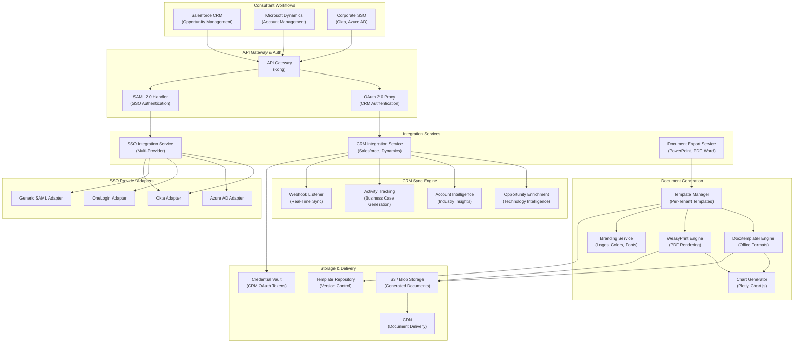
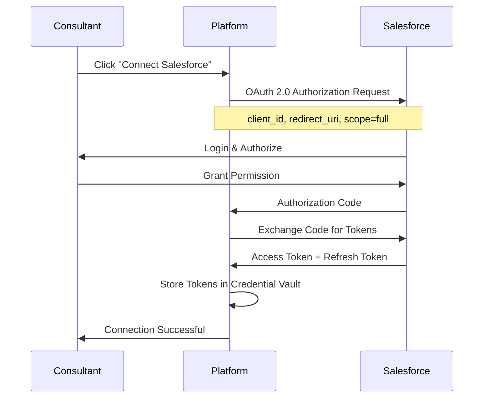
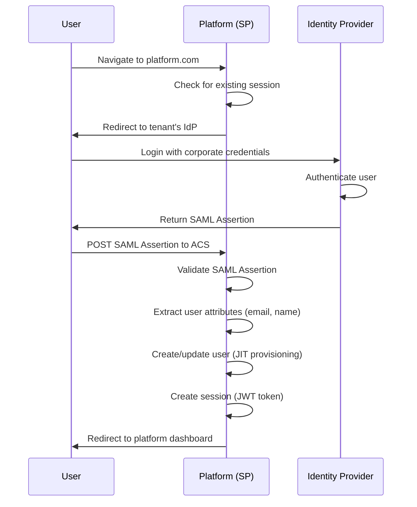

# CRM Integration, SSO, and Document Export Architecture

**Date**: 2025-11-18
**Sprint**: 06 - Digital Transformation Consulting Research Enablement
**Task**: 03 - Solution Architecture
**Author**: Solution Architect Skill

---

## Executive Summary

The Integration Layer provides seamless connectivity between the Continuous Intelligence Platform and consultants' existing workflows through three core capabilities: (1) CRM integration with Salesforce and Microsoft Dynamics for opportunity enrichment and activity tracking, (2) Enterprise SSO/SAML authentication with Okta, Azure AD, and OneLogin for secure single sign-on, and (3) Document export engine for generating branded PowerPoint, PDF, and Word deliverables.

This architecture enables consultants to access technology intelligence directly within their CRM workflows, authenticate using existing corporate credentials, and rapidly generate client-ready presentations without leaving the platform. The integration layer is designed for multi-tenant configuration, supporting per-tenant CRM credentials, SSO providers, and document templates.

Key technology choices include OAuth 2.0 for CRM authentication, SAML 2.0 for SSO, Docxtemplater for Office document generation, and WeasyPrint for PDF rendering with custom branding.

---

## Integration Layer Architecture

### High-Level Component Architecture



---

## CRM Integration Architecture

### Salesforce Integration

#### OAuth 2.0 Authentication Flow



**OAuth Configuration**:

```python
from typing import Dict
import httpx
from cryptography.fernet import Fernet

class SalesforceOAuthClient:
    def __init__(self, client_id: str, client_secret: str, redirect_uri: str):
        self.client_id = client_id
        self.client_secret = client_secret
        self.redirect_uri = redirect_uri
        self.auth_url = 'https://login.salesforce.com/services/oauth2/authorize'
        self.token_url = 'https://login.salesforce.com/services/oauth2/token'

    def get_authorization_url(self, state: str) -> str:
        """Generate OAuth authorization URL"""
        params = {
            'response_type': 'code',
            'client_id': self.client_id,
            'redirect_uri': self.redirect_uri,
            'scope': 'full refresh_token',
            'state': state,  # CSRF protection
        }
        query_string = '&'.join(f"{k}={v}" for k, v in params.items())
        return f"{self.auth_url}?{query_string}"

    async def exchange_code_for_tokens(self, authorization_code: str) -> Dict:
        """Exchange authorization code for access and refresh tokens"""
        async with httpx.AsyncClient() as client:
            response = await client.post(
                self.token_url,
                data={
                    'grant_type': 'authorization_code',
                    'code': authorization_code,
                    'client_id': self.client_id,
                    'client_secret': self.client_secret,
                    'redirect_uri': self.redirect_uri,
                }
            )
            response.raise_for_status()
            return response.json()

    async def refresh_access_token(self, refresh_token: str) -> Dict:
        """Refresh expired access token"""
        async with httpx.AsyncClient() as client:
            response = await client.post(
                self.token_url,
                data={
                    'grant_type': 'refresh_token',
                    'refresh_token': refresh_token,
                    'client_id': self.client_id,
                    'client_secret': self.client_secret,
                }
            )
            response.raise_for_status()
            return response.json()
```

**Token Storage (Encrypted)**:

```python
from cryptography.fernet import Fernet
import base64
import os

class CredentialVault:
    def __init__(self, encryption_key: str):
        self.cipher = Fernet(encryption_key.encode())

    def store_credentials(self, tenant_id: str, user_id: str, credentials: Dict):
        """Store encrypted CRM credentials in database"""

        # Encrypt sensitive tokens
        encrypted_access_token = self.cipher.encrypt(credentials['access_token'].encode())
        encrypted_refresh_token = self.cipher.encrypt(credentials['refresh_token'].encode())

        # Store in database
        query = """
            INSERT INTO crm_credentials (tenant_id, user_id, crm_provider, access_token, refresh_token, instance_url, expires_at)
            VALUES (%s, %s, %s, %s, %s, %s, %s)
            ON CONFLICT (tenant_id, user_id, crm_provider)
            DO UPDATE SET
                access_token = EXCLUDED.access_token,
                refresh_token = EXCLUDED.refresh_token,
                expires_at = EXCLUDED.expires_at,
                updated_at = NOW()
        """

        self.db.execute(query, (
            tenant_id,
            user_id,
            'salesforce',
            encrypted_access_token,
            encrypted_refresh_token,
            credentials['instance_url'],
            datetime.utcnow() + timedelta(seconds=credentials.get('expires_in', 7200))
        ))

    def retrieve_credentials(self, tenant_id: str, user_id: str, crm_provider: str) -> Dict:
        """Retrieve and decrypt CRM credentials"""

        query = """
            SELECT access_token, refresh_token, instance_url, expires_at
            FROM crm_credentials
            WHERE tenant_id = %s AND user_id = %s AND crm_provider = %s
        """

        result = self.db.execute(query, (tenant_id, user_id, crm_provider)).fetchone()

        if not result:
            raise ValueError("No credentials found")

        # Check if token expired
        if result['expires_at'] < datetime.utcnow():
            # Refresh token automatically
            return self._refresh_and_update(tenant_id, user_id, crm_provider, result['refresh_token'])

        # Decrypt tokens
        return {
            'access_token': self.cipher.decrypt(result['access_token']).decode(),
            'refresh_token': self.cipher.decrypt(result['refresh_token']).decode(),
            'instance_url': result['instance_url'],
        }
```

#### Opportunity Enrichment

**Use Case**: Enrich Salesforce opportunities with technology intelligence when consultant views opportunity

**Implementation**:

```python
class SalesforceOpportunityEnricher:
    def __init__(self, sf_client, platform_api):
        self.sf = sf_client
        self.platform = platform_api

    async def enrich_opportunity(self, opportunity_id: str, user_id: str) -> Dict:
        """Fetch opportunity from Salesforce and enrich with platform intelligence"""

        # Fetch opportunity details
        opportunity = await self.sf.query(f"""
            SELECT Id, Name, AccountId, Account.Name, Account.Industry,
                   StageName, Amount, Technologies__c, CloseDate
            FROM Opportunity
            WHERE Id = '{opportunity_id}'
        """)

        if not opportunity['records']:
            raise ValueError(f"Opportunity {opportunity_id} not found")

        opp = opportunity['records'][0]

        # Extract technologies mentioned in opportunity
        technologies = opp.get('Technologies__c', '').split(';')

        # Fetch intelligence for each technology
        intelligence = {}
        for tech in technologies:
            if tech.strip():
                intelligence[tech] = await self.platform.get_technology_intelligence(tech)

        # Fetch industry benchmarks
        benchmarks = await self.platform.get_industry_benchmarks(
            industry=opp['Account']['Industry'],
            technologies=technologies
        )

        # Update opportunity custom fields
        await self.sf.update_opportunity(opportunity_id, {
            'Technology_Intelligence__c': json.dumps(intelligence),
            'Industry_Benchmarks__c': json.dumps(benchmarks),
            'Last_Enrichment__c': datetime.utcnow().isoformat(),
            'Enrichment_User__c': user_id,
        })

        return {
            'opportunity': opp,
            'intelligence': intelligence,
            'benchmarks': benchmarks,
        }
```

#### Webhook Listener (Real-Time Sync)

**Purpose**: Listen for Salesforce opportunity updates and trigger platform actions

**Webhook Configuration**:

```python
from fastapi import FastAPI, Request, HTTPException
import hmac
import hashlib

app = FastAPI()

class SalesforceWebhookListener:
    def __init__(self, webhook_secret: str):
        self.webhook_secret = webhook_secret

    def verify_signature(self, payload: bytes, signature: str) -> bool:
        """Verify Salesforce webhook signature"""
        expected_signature = hmac.new(
            self.webhook_secret.encode(),
            payload,
            hashlib.sha256
        ).hexdigest()

        return hmac.compare_digest(signature, expected_signature)

    @app.post("/webhooks/salesforce")
    async def handle_webhook(self, request: Request):
        """Handle Salesforce webhook events"""

        # Verify signature
        signature = request.headers.get('X-Salesforce-Signature')
        payload = await request.body()

        if not self.verify_signature(payload, signature):
            raise HTTPException(status_code=401, detail="Invalid signature")

        # Parse event
        event = await request.json()
        event_type = event.get('event', {}).get('type')

        # Route to appropriate handler
        if event_type == 'opportunity.updated':
            await self.handle_opportunity_updated(event)
        elif event_type == 'opportunity.created':
            await self.handle_opportunity_created(event)

        return {"status": "received"}

    async def handle_opportunity_updated(self, event: Dict):
        """Handle opportunity update event"""

        opportunity_id = event['data']['object']['Id']
        changed_fields = event['data']['object']['changedFields']

        # If technologies changed, re-enrich
        if 'Technologies__c' in changed_fields:
            await self.enrich_opportunity(opportunity_id)

        # Log activity in platform
        await self.platform.log_activity({
            'type': 'crm_opportunity_updated',
            'opportunity_id': opportunity_id,
            'changed_fields': changed_fields,
            'timestamp': event['data']['object']['LastModifiedDate'],
        })
```

### Microsoft Dynamics 365 Integration

**Similar Architecture** with adjustments for Dynamics API:

- **Authentication**: Azure AD OAuth 2.0 with Microsoft Graph API scopes
- **API Endpoints**: Dynamics Web API (OData)
- **Webhook Events**: Azure Service Bus or Event Grid for real-time notifications

**Key Differences**:

```yaml
salesforce_vs_dynamics:
  authentication:
    salesforce: Salesforce OAuth 2.0
    dynamics: Azure AD OAuth 2.0 (Microsoft Graph)

  api_protocol:
    salesforce: REST API + SOQL queries
    dynamics: OData Web API + FetchXML queries

  webhooks:
    salesforce: Platform Events or Outbound Messages
    dynamics: Azure Event Grid or Service Bus

  custom_fields:
    salesforce: Custom Fields (API Name__c)
    dynamics: Custom Attributes (new_attributename)
```

---

## SSO/SAML Integration Architecture

### SAML 2.0 Authentication Flow



### Multi-Provider SSO Architecture

**Tenant-Specific SSO Configuration**:

```python
from typing import Dict, Optional
from onelogin.saml2.auth import OneLogin_Saml2_Auth
from onelogin.saml2.settings import OneLogin_Saml2_Settings

class MultiProviderSSOService:
    def __init__(self):
        self.provider_adapters = {
            'okta': OktaSAMLAdapter(),
            'azure_ad': AzureADSAMLAdapter(),
            'onelogin': OneLoginSAMLAdapter(),
            'generic': GenericSAMLAdapter(),
        }

    def get_tenant_sso_config(self, tenant_id: str) -> Dict:
        """Retrieve tenant-specific SSO configuration"""

        query = """
            SELECT sso_provider, idp_entity_id, idp_sso_url, idp_x509_cert,
                   sp_entity_id, sp_acs_url, attribute_mapping
            FROM tenant_sso_config
            WHERE tenant_id = %s AND enabled = true
        """

        result = self.db.execute(query, (tenant_id,)).fetchone()

        if not result:
            raise ValueError(f"No SSO configuration for tenant {tenant_id}")

        return {
            'provider': result['sso_provider'],
            'idp': {
                'entityId': result['idp_entity_id'],
                'singleSignOnService': {'url': result['idp_sso_url']},
                'x509cert': result['idp_x509_cert'],
            },
            'sp': {
                'entityId': result['sp_entity_id'],
                'assertionConsumerService': {'url': result['sp_acs_url']},
            },
            'attribute_mapping': result['attribute_mapping'],
        }

    def initiate_sso_login(self, tenant_id: str, relay_state: str = None):
        """Initiate SSO login for tenant"""

        sso_config = self.get_tenant_sso_config(tenant_id)

        # Select appropriate adapter
        adapter = self.provider_adapters[sso_config['provider']]

        # Generate SAML AuthnRequest
        auth_request = adapter.create_authn_request(sso_config, relay_state)

        return {
            'redirect_url': auth_request['sso_url'],
            'saml_request': auth_request['saml_request'],
        }

    def handle_saml_response(self, saml_response: str, tenant_id: str) -> Dict:
        """Process SAML assertion from IdP"""

        sso_config = self.get_tenant_sso_config(tenant_id)
        adapter = self.provider_adapters[sso_config['provider']]

        # Validate SAML assertion
        assertion = adapter.validate_assertion(saml_response, sso_config)

        if not assertion['valid']:
            raise ValueError(f"Invalid SAML assertion: {assertion['errors']}")

        # Extract user attributes
        attributes = self._extract_user_attributes(
            assertion['attributes'],
            sso_config['attribute_mapping']
        )

        # Just-In-Time (JIT) user provisioning
        user = self._provision_user(tenant_id, attributes)

        # Create session
        session_token = self._create_session(user)

        return {
            'user': user,
            'session_token': session_token,
            'redirect_url': assertion.get('relay_state', '/dashboard'),
        }

    def _extract_user_attributes(self, saml_attributes: Dict, mapping: Dict) -> Dict:
        """Map SAML attributes to platform user attributes"""

        user_attributes = {}

        for platform_attr, saml_attr in mapping.items():
            value = saml_attributes.get(saml_attr)
            if value:
                # SAML attributes often come as lists
                user_attributes[platform_attr] = value[0] if isinstance(value, list) else value

        return user_attributes

    def _provision_user(self, tenant_id: str, attributes: Dict) -> Dict:
        """Create or update user (Just-In-Time provisioning)"""

        email = attributes.get('email')
        if not email:
            raise ValueError("Email attribute required for JIT provisioning")

        # Check if user exists
        query = """
            SELECT id, email, first_name, last_name
            FROM users
            WHERE tenant_id = %s AND email = %s
        """

        user = self.db.execute(query, (tenant_id, email)).fetchone()

        if user:
            # Update user attributes
            update_query = """
                UPDATE users
                SET first_name = %s, last_name = %s, last_login = NOW()
                WHERE id = %s
            """
            self.db.execute(update_query, (
                attributes.get('first_name'),
                attributes.get('last_name'),
                user['id']
            ))
        else:
            # Create new user
            insert_query = """
                INSERT INTO users (tenant_id, email, first_name, last_name, auth_method, created_at)
                VALUES (%s, %s, %s, %s, 'sso', NOW())
                RETURNING id, email, first_name, last_name
            """
            user = self.db.execute(insert_query, (
                tenant_id,
                email,
                attributes.get('first_name'),
                attributes.get('last_name')
            )).fetchone()

        return user
```

### Provider-Specific Adapters

**Okta SAML Adapter**:

```python
class OktaSAMLAdapter:
    def create_authn_request(self, sso_config: Dict, relay_state: str) -> Dict:
        """Generate Okta-compatible SAML AuthnRequest"""

        auth = OneLogin_Saml2_Auth({
            'sp': sso_config['sp'],
            'idp': sso_config['idp'],
        })

        sso_url = auth.login(return_to=relay_state)
        saml_request = auth.get_last_request_xml()

        return {
            'sso_url': sso_url,
            'saml_request': saml_request,
        }

    def validate_assertion(self, saml_response: str, sso_config: Dict) -> Dict:
        """Validate Okta SAML assertion"""

        auth = OneLogin_Saml2_Auth({
            'sp': sso_config['sp'],
            'idp': sso_config['idp'],
        })

        auth.process_response()
        errors = auth.get_errors()

        if errors:
            return {'valid': False, 'errors': errors}

        return {
            'valid': True,
            'attributes': auth.get_attributes(),
            'name_id': auth.get_nameid(),
            'session_index': auth.get_session_index(),
            'relay_state': auth.get_relay_state(),
        }
```

**Azure AD SAML Adapter** (similar structure with Azure-specific attribute names):

```python
class AzureADSAMLAdapter:
    # Azure AD uses different attribute names
    DEFAULT_ATTRIBUTE_MAPPING = {
        'email': 'http://schemas.xmlsoap.org/ws/2005/05/identity/claims/emailaddress',
        'first_name': 'http://schemas.xmlsoap.org/ws/2005/05/identity/claims/givenname',
        'last_name': 'http://schemas.xmlsoap.org/ws/2005/05/identity/claims/surname',
        'department': 'http://schemas.microsoft.com/identity/claims/department',
    }

    # Similar methods to OktaSAMLAdapter with Azure-specific handling
```

---

## Document Export Architecture

### Template Management System

**Per-Tenant Template Library**:

```python
from typing import List, Dict
import git

class TemplateManager:
    def __init__(self, template_repo_path: str):
        self.template_repo = git.Repo(template_repo_path)

    def get_tenant_templates(self, tenant_id: str) -> List[Dict]:
        """Retrieve template library for tenant"""

        query = """
            SELECT id, name, description, file_type, file_path, version, is_default
            FROM document_templates
            WHERE tenant_id = %s OR tenant_id IS NULL  -- Include global templates
            ORDER BY is_default DESC, name ASC
        """

        templates = self.db.execute(query, (tenant_id,)).fetchall()

        return [
            {
                'id': t['id'],
                'name': t['name'],
                'description': t['description'],
                'file_type': t['file_type'],  # 'pptx', 'pdf', 'docx'
                'preview_url': self._generate_preview_url(t['file_path']),
                'is_default': t['is_default'],
            }
            for t in templates
        ]

    def upload_custom_template(
        self,
        tenant_id: str,
        template_file: bytes,
        metadata: Dict
    ) -> Dict:
        """Upload custom template for tenant"""

        # Validate template file
        validation = self._validate_template(template_file, metadata['file_type'])
        if not validation['valid']:
            raise ValueError(f"Invalid template: {validation['errors']}")

        # Generate unique file path
        file_path = f"templates/{tenant_id}/{metadata['name']}.{metadata['file_type']}"

        # Store in S3
        self.s3.upload_fileobj(
            BytesIO(template_file),
            bucket='platform-templates',
            key=file_path
        )

        # Insert into database
        query = """
            INSERT INTO document_templates (tenant_id, name, description, file_type, file_path, version)
            VALUES (%s, %s, %s, %s, %s, %s)
            RETURNING id
        """

        template_id = self.db.execute(query, (
            tenant_id,
            metadata['name'],
            metadata['description'],
            metadata['file_type'],
            file_path,
            '1.0'
        )).fetchone()['id']

        return {'template_id': template_id, 'file_path': file_path}

    def _validate_template(self, template_file: bytes, file_type: str) -> Dict:
        """Validate template structure and placeholders"""

        if file_type == 'pptx':
            return self._validate_pptx_template(template_file)
        elif file_type == 'docx':
            return self._validate_docx_template(template_file)
        else:
            return {'valid': False, 'errors': ['Unsupported file type']}

    def _validate_pptx_template(self, template_file: bytes) -> Dict:
        """Validate PowerPoint template"""

        try:
            from pptx import Presentation

            prs = Presentation(BytesIO(template_file))

            # Check for required placeholders
            required_placeholders = ['{{technology_name}}', '{{client_name}}', '{{date}}']
            found_placeholders = set()

            for slide in prs.slides:
                for shape in slide.shapes:
                    if hasattr(shape, 'text'):
                        for placeholder in required_placeholders:
                            if placeholder in shape.text:
                                found_placeholders.add(placeholder)

            missing = set(required_placeholders) - found_placeholders

            if missing:
                return {
                    'valid': False,
                    'errors': [f"Missing required placeholders: {', '.join(missing)}"]
                }

            return {'valid': True, 'errors': []}

        except Exception as e:
            return {'valid': False, 'errors': [str(e)]}
```

### PowerPoint Generation (Docxtemplater)

**Business Case Presentation Generation**:

```python
from docxtemplater import DocxTemplater
from pptx import Presentation
from io import BytesIO
import plotly.graph_objects as go

class PowerPointGenerator:
    def __init__(self, template_manager, branding_service):
        self.template_manager = template_manager
        self.branding = branding_service

    def generate_business_case_presentation(
        self,
        tenant_id: str,
        template_id: str,
        data: Dict
    ) -> bytes:
        """Generate PowerPoint presentation from template and data"""

        # Retrieve template
        template_file = self.template_manager.get_template_file(template_id)

        # Load presentation
        prs = Presentation(BytesIO(template_file))

        # Apply branding
        branding_config = self.branding.get_tenant_branding(tenant_id)
        self._apply_branding(prs, branding_config)

        # Replace text placeholders
        self._replace_placeholders(prs, data)

        # Insert charts
        if 'roi_chart_data' in data:
            self._insert_roi_chart(prs, data['roi_chart_data'])

        if 'tco_chart_data' in data:
            self._insert_tco_chart(prs, data['tco_chart_data'])

        # Save to bytes
        output = BytesIO()
        prs.save(output)
        output.seek(0)

        return output.read()

    def _replace_placeholders(self, prs: Presentation, data: Dict):
        """Replace {{placeholder}} with actual data"""

        for slide in prs.slides:
            for shape in slide.shapes:
                if hasattr(shape, 'text_frame'):
                    for paragraph in shape.text_frame.paragraphs:
                        for run in paragraph.runs:
                            # Replace placeholders
                            for key, value in data.items():
                                placeholder = f"{{{{{key}}}}}"
                                if placeholder in run.text:
                                    run.text = run.text.replace(placeholder, str(value))

    def _insert_roi_chart(self, prs: Presentation, chart_data: Dict):
        """Insert ROI waterfall chart"""

        from pptx.util import Inches
        from plotly.io import to_image

        # Generate chart with Plotly
        fig = go.Figure(go.Waterfall(
            name="ROI",
            orientation="v",
            x=list(chart_data.keys()),
            y=list(chart_data.values()),
            connector={"line": {"color": "rgb(63, 63, 63)"}},
        ))

        fig.update_layout(
            title="5-Year ROI Projection",
            showlegend=False,
            width=800,
            height=450
        )

        # Convert to image
        img_bytes = to_image(fig, format='png')

        # Find slide with {{roi_chart}} placeholder
        for slide_idx, slide in enumerate(prs.slides):
            for shape in slide.shapes:
                if hasattr(shape, 'text') and '{{roi_chart}}' in shape.text:
                    # Insert chart at placeholder location
                    left = shape.left
                    top = shape.top
                    width = shape.width
                    height = shape.height

                    # Remove placeholder
                    sp = shape.element
                    sp.getparent().remove(sp)

                    # Insert chart image
                    slide.shapes.add_picture(
                        BytesIO(img_bytes),
                        left, top, width, height
                    )
                    break
```

### PDF Rendering (WeasyPrint)

**PDF Report Generation with Custom Branding**:

```python
from weasyprint import HTML, CSS
from jinja2 import Template

class PDFReportGenerator:
    def __init__(self, branding_service):
        self.branding = branding_service

    def generate_pdf_report(
        self,
        tenant_id: str,
        html_template: str,
        data: Dict
    ) -> bytes:
        """Generate PDF report from HTML template"""

        # Render HTML template with data
        template = Template(html_template)
        html_content = template.render(**data)

        # Get tenant branding
        branding = self.branding.get_tenant_branding(tenant_id)

        # Generate CSS from branding config
        custom_css = self._generate_branded_css(branding)

        # Render PDF
        pdf_bytes = HTML(string=html_content).write_pdf(
            stylesheets=[CSS(string=custom_css)]
        )

        return pdf_bytes

    def _generate_branded_css(self, branding: Dict) -> str:
        """Generate CSS from branding configuration"""

        return f"""
        @page {{
            size: Letter;
            margin: 1in;
            @top-right {{
                content: url({branding['logo_url']});
                width: 2in;
            }}
        }}

        body {{
            font-family: {branding['font_family']};
            color: {branding['text_color']};
        }}

        h1, h2, h3 {{
            color: {branding['primary_color']};
        }}

        .header {{
            background-color: {branding['header_background']};
            padding: 20px;
        }}

        .footer {{
            text-align: center;
            color: {branding['footer_text_color']};
        }}
        """
```

### Branding Service

**Per-Tenant Branding Configuration**:

```python
class BrandingService:
    def get_tenant_branding(self, tenant_id: str) -> Dict:
        """Retrieve tenant branding configuration"""

        query = """
            SELECT logo_url, primary_color, secondary_color, font_family,
                   header_background, footer_text_color, text_color
            FROM tenant_branding
            WHERE tenant_id = %s
        """

        branding = self.db.execute(query, (tenant_id,)).fetchone()

        if not branding:
            # Return default branding
            return self._get_default_branding()

        return {
            'logo_url': branding['logo_url'],
            'primary_color': branding['primary_color'],
            'secondary_color': branding['secondary_color'],
            'font_family': branding['font_family'],
            'header_background': branding['header_background'],
            'footer_text_color': branding['footer_text_color'],
            'text_color': branding['text_color'],
        }

    def upload_logo(self, tenant_id: str, logo_file: bytes, filename: str) -> str:
        """Upload tenant logo to S3"""

        # Generate unique path
        logo_path = f"branding/{tenant_id}/logo_{filename}"

        # Upload to S3
        self.s3.upload_fileobj(
            BytesIO(logo_file),
            bucket='platform-branding',
            key=logo_path,
            ExtraArgs={'ContentType': 'image/png'}
        )

        # Generate CDN URL
        logo_url = f"https://cdn.platform.com/{logo_path}"

        # Update database
        query = """
            UPDATE tenant_branding
            SET logo_url = %s
            WHERE tenant_id = %s
        """
        self.db.execute(query, (logo_url, tenant_id))

        return logo_url
```

---

## Performance Optimization

### Document Generation Optimization

**Background Processing**:

```python
from celery import Celery

celery_app = Celery('document_export', broker='redis://localhost:6379/0')

@celery_app.task
def generate_document_async(tenant_id: str, template_id: str, data: Dict, user_id: str):
    """Generate document asynchronously"""

    generator = PowerPointGenerator(template_manager, branding_service)

    # Generate document
    document_bytes = generator.generate_business_case_presentation(
        tenant_id,
        template_id,
        data
    )

    # Upload to S3
    document_id = str(uuid.uuid4())
    document_path = f"documents/{tenant_id}/{document_id}.pptx"

    s3_client.upload_fileobj(
        BytesIO(document_bytes),
        bucket='platform-documents',
        key=document_path
    )

    # Generate pre-signed URL (expires in 24 hours)
    download_url = s3_client.generate_presigned_url(
        'get_object',
        Params={'Bucket': 'platform-documents', 'Key': document_path},
        ExpiresIn=86400
    )

    # Notify user
    notification_service.send_notification(
        user_id,
        f"Your business case presentation is ready: {download_url}"
    )

    return {'document_id': document_id, 'download_url': download_url}
```

**Performance Targets**:

| Document Type | Generation Time (p95) | Queue Wait Time |
|---------------|----------------------|-----------------|
| PowerPoint (10 slides) | < 5 seconds | < 30 seconds |
| PDF Report (20 pages) | < 8 seconds | < 30 seconds |
| Word Document (15 pages) | < 6 seconds | < 30 seconds |

---

## References

1. Salesforce Architects. (2024). *Integration Patterns and Designs*. Retrieved from https://architect.salesforce.com/fundamentals/integration-patterns

2. Salesforce Help. (2024). *Configure SAML SSO with Salesforce as Service Provider*. Retrieved from https://help.salesforce.com/s/articleView?id=sf.sso_saml.htm

3. Okta Documentation. (2024). *How to Configure SAML 2.0 for Salesforce*. Retrieved from https://saml-doc.okta.com/SAML_Docs/How-to-Configure-SAML-2.0-in-Salesforce.html

4. Microsoft Learn. (2024). *Automate Document Generation with Power Automate*. Retrieved from https://learn.microsoft.com/en-us/microsoft-365/documentprocessing/automate-document-generation

5. Docxtemplater Documentation. (2024). *Generate Word, PowerPoint, Excel Documents*. Retrieved from https://docxtemplater.com/

6. WeasyPrint Documentation. (2024). *The Awesome Document Factory*. Retrieved from https://weasyprint.org/

7. Auth0 Documentation. (2024). *Configure Salesforce as SAML Identity Provider*. Retrieved from https://auth0.com/docs/authenticate/protocols/saml/saml-sso-integrations/configure-auth0-saml-service-provider/configure-salesforce-as-saml-identity-provider

8. OneLogin SAML Python Toolkit. (2024). *SAML Python Toolkit Documentation*. Retrieved from https://github.com/onelogin/python-saml

9. Plotly Python Documentation. (2024). *Python Graphing Library*. Retrieved from https://plotly.com/python/

10. Celery Documentation. (2024). *Distributed Task Queue*. Retrieved from https://docs.celeryq.dev/
