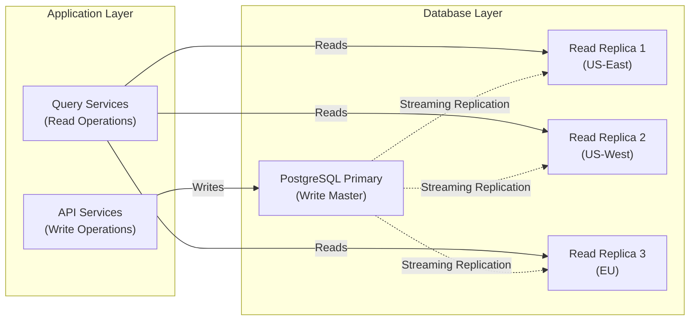

# Scalability, Performance, and Multi-Tenant Architecture

**Date**: 2025-11-18
**Sprint**: 06 - Digital Transformation Consulting Research Enablement
**Task**: 03 - Solution Architecture
**Author**: Solution Architect Skill

---

## Executive Summary

This document details the scalability and performance architecture designed to support 500-1,000 concurrent consultant users with sub-second query response times, real-time technology updates, and continuous benchmarking refreshes. The multi-tenant SaaS architecture ensures tenant isolation, efficient resource utilization, and horizontal scalability across all platform components.

The architecture employs schema-per-tenant database isolation for PostgreSQL, tenant-aware Elasticsearch indices, Redis caching for query acceleration, and Kubernetes-based container orchestration for auto-scaling. Performance optimization strategies include multi-layer caching, connection pooling, asynchronous background processing, and CDN-based content delivery.

Key design decisions include hybrid multi-tenancy (schema isolation for core data, shared infrastructure for platform services), horizontal scaling with stateless microservices, and comprehensive monitoring with auto-scaling triggers based on CPU, memory, and queue depth metrics.

---

## Multi-Tenant Architecture

### Tenant Isolation Strategy


### PostgreSQL Multi-Tenant Database Design

**Schema-Per-Tenant Isolation**:

```python
from typing import Dict, Optional
import psycopg2
from contextlib import contextmanager

class MultiTenantDatabaseManager:
    def __init__(self, database_url: str):
        self.database_url = database_url
        self.connection_pool = psycopg2.pool.ThreadedConnectionPool(
            minconn=10,
            maxconn=100,
            dsn=database_url
        )

    @contextmanager
    def get_tenant_connection(self, tenant_id: str):
        """Get database connection with tenant schema set"""

        conn = self.connection_pool.getconn()
        cursor = conn.cursor()

        try:
            # Set search_path to tenant schema
            cursor.execute(f"SET search_path TO tenant_{tenant_id}, public")
            yield cursor
            conn.commit()
        except Exception as e:
            conn.rollback()
            raise e
        finally:
            cursor.close()
            self.connection_pool.putconn(conn)

    def create_tenant_schema(self, tenant_id: str):
        """Create isolated schema for new tenant"""

        with self.connection_pool.getconn() as conn:
            cursor = conn.cursor()

            # Create schema
            cursor.execute(f"CREATE SCHEMA IF NOT EXISTS tenant_{tenant_id}")

            # Create tables in tenant schema
            cursor.execute(f"SET search_path TO tenant_{tenant_id}")

            # Core tables
            cursor.execute("""
                CREATE TABLE IF NOT EXISTS users (
                    id UUID PRIMARY KEY DEFAULT gen_random_uuid(),
                    email VARCHAR(255) UNIQUE NOT NULL,
                    first_name VARCHAR(100),
                    last_name VARCHAR(100),
                    role VARCHAR(50) DEFAULT 'consultant',
                    auth_method VARCHAR(20) DEFAULT 'password',
                    created_at TIMESTAMP DEFAULT NOW(),
                    last_login TIMESTAMP
                )
            """)

            cursor.execute("""
                CREATE TABLE IF NOT EXISTS case_studies (
                    id UUID PRIMARY KEY DEFAULT gen_random_uuid(),
                    title TEXT NOT NULL,
                    customer_company VARCHAR(255),
                    customer_industry VARCHAR(100),
                    vendor_company VARCHAR(255),
                    technologies JSONB,
                    timeline_weeks INTEGER,
                    budget_usd NUMERIC(12, 2),
                    roi_percent NUMERIC(5, 2),
                    full_text TEXT,
                    created_at TIMESTAMP DEFAULT NOW()
                )
            """)

            # ... more tables

            # Create indexes
            cursor.execute("CREATE INDEX idx_users_email ON users(email)")
            cursor.execute("CREATE INDEX idx_case_studies_industry ON case_studies(customer_industry)")
            cursor.execute("CREATE INDEX idx_case_studies_technologies ON case_studies USING GIN(technologies)")

            conn.commit()
            cursor.close()

    def migrate_tenant_schema(self, tenant_id: str, migration_version: str):
        """Apply schema migration to specific tenant"""

        with self.get_tenant_connection(tenant_id) as cursor:
            # Check current migration version
            cursor.execute("""
                CREATE TABLE IF NOT EXISTS schema_migrations (
                    version VARCHAR(50) PRIMARY KEY,
                    applied_at TIMESTAMP DEFAULT NOW()
                )
            """)

            cursor.execute(
                "SELECT version FROM schema_migrations WHERE version = %s",
                (migration_version,)
            )

            if cursor.fetchone():
                print(f"Migration {migration_version} already applied to tenant {tenant_id}")
                return

            # Apply migration
            migration_sql = self._get_migration_sql(migration_version)
            cursor.execute(migration_sql)

            # Record migration
            cursor.execute(
                "INSERT INTO schema_migrations (version) VALUES (%s)",
                (migration_version,)
            )

            print(f"Migration {migration_version} applied to tenant {tenant_id}")
```

**Shared Lookup Tables**:

```sql
-- Global schema (shared across all tenants)
CREATE SCHEMA IF NOT EXISTS public;

-- Technology taxonomy (shared)
CREATE TABLE public.technology_taxonomy (
    id UUID PRIMARY KEY DEFAULT gen_random_uuid(),
    category VARCHAR(100) NOT NULL,
    subcategory VARCHAR(100),
    technology_name VARCHAR(255) NOT NULL,
    vendor VARCHAR(255),
    description TEXT,
    created_at TIMESTAMP DEFAULT NOW()
);

CREATE INDEX idx_tech_taxonomy_category ON public.technology_taxonomy(category);
CREATE INDEX idx_tech_taxonomy_name ON public.technology_taxonomy(technology_name);

-- Industry classifications (shared)
CREATE TABLE public.industry_classifications (
    id UUID PRIMARY KEY DEFAULT gen_random_uuid(),
    industry_name VARCHAR(100) NOT NULL,
    naics_code VARCHAR(10),
    parent_industry VARCHAR(100),
    created_at TIMESTAMP DEFAULT NOW()
);
```

### Elasticsearch Multi-Tenant Index Strategy

**Tenant-Aware Index Naming**:

```python
from elasticsearch import Elasticsearch
from typing import Dict, List

class MultiTenantElasticsearchManager:
    def __init__(self, es_hosts: List[str]):
        self.es = Elasticsearch(es_hosts)

    def get_tenant_index_name(self, tenant_id: str, index_type: str) -> str:
        """Generate tenant-specific index name"""
        return f"{index_type}_tenant_{tenant_id}"

    def create_tenant_indices(self, tenant_id: str):
        """Create Elasticsearch indices for new tenant"""

        # Case studies index
        case_studies_index = self.get_tenant_index_name(tenant_id, 'case_studies')
        self.es.indices.create(
            index=case_studies_index,
            body={
                "settings": {
                    "number_of_shards": 2,
                    "number_of_replicas": 1,
                    "analysis": {
                        "analyzer": {
                            "case_study_analyzer": {
                                "type": "custom",
                                "tokenizer": "standard",
                                "filter": ["lowercase", "stop", "snowball"]
                            }
                        }
                    }
                },
                "mappings": {
                    "properties": {
                        "title": {"type": "text", "analyzer": "case_study_analyzer"},
                        "customer_company": {"type": "keyword"},
                        "customer_industry": {"type": "keyword"},
                        "technologies": {"type": "keyword"},
                        "timeline_weeks": {"type": "integer"},
                        "budget_usd": {"type": "scaled_float", "scaling_factor": 100},
                        "full_text": {"type": "text", "analyzer": "case_study_analyzer"},
                        "created_at": {"type": "date"}
                    }
                }
            }
        )

        # Technologies index
        technologies_index = self.get_tenant_index_name(tenant_id, 'technologies')
        self.es.indices.create(
            index=technologies_index,
            body={
                "settings": {"number_of_shards": 1, "number_of_replicas": 1},
                "mappings": {
                    "properties": {
                        "name": {"type": "text", "fields": {"keyword": {"type": "keyword"}}},
                        "vendor": {"type": "keyword"},
                        "category": {"type": "keyword"},
                        "features": {"type": "keyword"},
                        "pricing_tiers": {"type": "nested"},
                        "updated_at": {"type": "date"}
                    }
                }
            }
        )

    def search_tenant_case_studies(
        self,
        tenant_id: str,
        query: str,
        filters: Dict = None,
        page: int = 1,
        page_size: int = 20
    ) -> Dict:
        """Search case studies within tenant scope"""

        index = self.get_tenant_index_name(tenant_id, 'case_studies')

        # Build query
        es_query = {
            "query": {
                "bool": {
                    "must": [
                        {"multi_match": {
                            "query": query,
                            "fields": ["title^3", "full_text", "customer_company^2"],
                            "type": "best_fields"
                        }}
                    ]
                }
            },
            "from": (page - 1) * page_size,
            "size": page_size,
            "sort": [{"created_at": "desc"}]
        }

        # Add filters
        if filters:
            filter_clauses = []
            if filters.get('industry'):
                filter_clauses.append({"term": {"customer_industry": filters['industry']}})
            if filters.get('technologies'):
                filter_clauses.append({"terms": {"technologies": filters['technologies']}})

            if filter_clauses:
                es_query["query"]["bool"]["filter"] = filter_clauses

        # Execute search
        results = self.es.search(index=index, body=es_query)

        return {
            "total": results['hits']['total']['value'],
            "results": [hit['_source'] for hit in results['hits']['hits']],
            "page": page,
            "page_size": page_size
        }
```

### Redis Multi-Tenant Cache Strategy

**Tenant-Prefixed Cache Keys**:

```python
import redis
import json
from typing import Any, Optional

class MultiTenantCacheManager:
    def __init__(self, redis_url: str):
        self.redis = redis.from_url(redis_url)

    def get_tenant_key(self, tenant_id: str, key: str) -> str:
        """Generate tenant-prefixed cache key"""
        return f"tenant:{tenant_id}:{key}"

    def set(self, tenant_id: str, key: str, value: Any, ttl: int = 3600):
        """Set cached value with tenant isolation"""

        cache_key = self.get_tenant_key(tenant_id, key)

        # Serialize value
        serialized = json.dumps(value)

        # Set with TTL
        self.redis.setex(cache_key, ttl, serialized)

    def get(self, tenant_id: str, key: str) -> Optional[Any]:
        """Get cached value for tenant"""

        cache_key = self.get_tenant_key(tenant_id, key)
        cached = self.redis.get(cache_key)

        if cached:
            return json.loads(cached)

        return None

    def invalidate_pattern(self, tenant_id: str, pattern: str):
        """Invalidate cache keys matching pattern for tenant"""

        cache_pattern = self.get_tenant_key(tenant_id, pattern)

        # Find matching keys
        keys = self.redis.keys(cache_pattern)

        if keys:
            self.redis.delete(*keys)

    def get_tenant_cache_stats(self, tenant_id: str) -> Dict:
        """Get cache statistics for tenant"""

        pattern = self.get_tenant_key(tenant_id, "*")
        keys = self.redis.keys(pattern)

        total_size = sum(self.redis.memory_usage(key) for key in keys)

        return {
            "total_keys": len(keys),
            "total_size_bytes": total_size,
            "total_size_mb": round(total_size / (1024 * 1024), 2)
        }
```

---

## Horizontal Scaling Architecture

### Kubernetes Deployment Configuration

**Microservices Auto-Scaling**:

```yaml
# Deployment for Technology Monitoring Service
apiVersion: apps/v1
kind: Deployment
metadata:
  name: technology-monitoring-service
  namespace: core-services
spec:
  replicas: 5  # Initial replicas
  selector:
    matchLabels:
      app: technology-monitoring
  template:
    metadata:
      labels:
        app: technology-monitoring
    spec:
      containers:
      - name: technology-monitoring
        image: platform/technology-monitoring:v1.2.3
        ports:
        - containerPort: 8000
        env:
        - name: DATABASE_URL
          valueFrom:
            secretKeyRef:
              name: database-credentials
              key: url
        - name: REDIS_URL
          valueFrom:
            secretKeyRef:
              name: redis-credentials
              key: url
        resources:
          requests:
            memory: "512Mi"
            cpu: "250m"
          limits:
            memory: "1Gi"
            cpu: "500m"
        livenessProbe:
          httpGet:
            path: /health
            port: 8000
          initialDelaySeconds: 30
          periodSeconds: 10
        readinessProbe:
          httpGet:
            path: /ready
            port: 8000
          initialDelaySeconds: 10
          periodSeconds: 5

---
# Horizontal Pod Autoscaler
apiVersion: autoscaling/v2
kind: HorizontalPodAutoscaler
metadata:
  name: technology-monitoring-hpa
  namespace: core-services
spec:
  scaleTargetRef:
    apiVersion: apps/v1
    kind: Deployment
    name: technology-monitoring-service
  minReplicas: 5
  maxReplicas: 20
  metrics:
  - type: Resource
    resource:
      name: cpu
      target:
        type: Utilization
        averageUtilization: 70
  - type: Resource
    resource:
      name: memory
      target:
        type: Utilization
        averageUtilization: 80
  behavior:
    scaleUp:
      stabilizationWindowSeconds: 60
      policies:
      - type: Percent
        value: 50
        periodSeconds: 60
      - type: Pods
        value: 2
        periodSeconds: 60
      selectPolicy: Max
    scaleDown:
      stabilizationWindowSeconds: 300
      policies:
      - type: Percent
        value: 10
        periodSeconds: 60
```

### Database Scaling Strategy

**PostgreSQL Read Replicas**:



**Connection Pooling (PgBouncer)**:

```ini
# PgBouncer configuration
[databases]
platform_db = host=postgres-primary.internal port=5432 dbname=platform

[pgbouncer]
listen_addr = *
listen_port = 6432
auth_type = md5
auth_file = /etc/pgbouncer/userlist.txt

# Connection pool settings
pool_mode = transaction
max_client_conn = 1000
default_pool_size = 25
min_pool_size = 10
reserve_pool_size = 5

# Performance tuning
server_idle_timeout = 600
server_lifetime = 3600
server_connect_timeout = 15

# Logging
log_connections = 0
log_disconnections = 0
log_pooler_errors = 1
```

**Database Partitioning Strategy**:

```sql
-- Partition case_studies table by created_at (monthly partitions)
CREATE TABLE case_studies (
    id UUID NOT NULL,
    tenant_id UUID NOT NULL,
    title TEXT NOT NULL,
    customer_company VARCHAR(255),
    created_at TIMESTAMP NOT NULL,
    -- ... other columns
    PRIMARY KEY (id, created_at)
) PARTITION BY RANGE (created_at);

-- Create partitions for each month
CREATE TABLE case_studies_2025_01 PARTITION OF case_studies
    FOR VALUES FROM ('2025-01-01') TO ('2025-02-01');

CREATE TABLE case_studies_2025_02 PARTITION OF case_studies
    FOR VALUES FROM ('2025-02-01') TO ('2025-03-01');

-- ... more partitions

-- Automatic partition creation function
CREATE OR REPLACE FUNCTION create_monthly_partition()
RETURNS void AS $$
DECLARE
    partition_date DATE;
    partition_name TEXT;
    start_date TEXT;
    end_date TEXT;
BEGIN
    partition_date := date_trunc('month', CURRENT_DATE + interval '1 month');
    partition_name := 'case_studies_' || to_char(partition_date, 'YYYY_MM');
    start_date := partition_date::TEXT;
    end_date := (partition_date + interval '1 month')::TEXT;

    EXECUTE format(
        'CREATE TABLE IF NOT EXISTS %I PARTITION OF case_studies FOR VALUES FROM (%L) TO (%L)',
        partition_name, start_date, end_date
    );
END;
$$ LANGUAGE plpgsql;

-- Schedule monthly partition creation (via cron job or pg_cron)
```

### Elasticsearch Cluster Scaling

**Cluster Configuration**:

```yaml
# Elasticsearch cluster configuration (Kubernetes)
apiVersion: elasticsearch.k8s.elastic.co/v1
kind: Elasticsearch
metadata:
  name: platform-es-cluster
  namespace: data-layer
spec:
  version: 8.10.0
  nodeSets:
  - name: master
    count: 3
    config:
      node.roles: ["master"]
      node.store.allow_mmap: false
    volumeClaimTemplates:
    - metadata:
        name: elasticsearch-data
      spec:
        accessModes:
        - ReadWriteOnce
        resources:
          requests:
            storage: 50Gi
        storageClassName: fast-ssd
    podTemplate:
      spec:
        containers:
        - name: elasticsearch
          resources:
            requests:
              memory: 4Gi
              cpu: 2
            limits:
              memory: 8Gi
              cpu: 4

  - name: data-hot
    count: 6
    config:
      node.roles: ["data_hot", "data_content", "ingest"]
      node.store.allow_mmap: false
    volumeClaimTemplates:
    - metadata:
        name: elasticsearch-data
      spec:
        accessModes:
        - ReadWriteOnce
        resources:
          requests:
            storage: 500Gi
        storageClassName: fast-ssd
    podTemplate:
      spec:
        containers:
        - name: elasticsearch
          resources:
            requests:
              memory: 16Gi
              cpu: 4
            limits:
              memory: 32Gi
              cpu: 8

  - name: data-warm
    count: 3
    config:
      node.roles: ["data_warm"]
      node.store.allow_mmap: false
    volumeClaimTemplates:
    - metadata:
        name: elasticsearch-data
      spec:
        accessModes:
        - ReadWriteOnce
        resources:
          requests:
            storage: 1Ti
        storageClassName: standard-ssd
```

**Index Lifecycle Management (ILM)**:

```python
from elasticsearch import Elasticsearch

class ElasticsearchILMManager:
    def __init__(self, es_client: Elasticsearch):
        self.es = es_client

    def create_ilm_policy(self):
        """Create index lifecycle management policy"""

        ilm_policy = {
            "policy": {
                "phases": {
                    "hot": {
                        "actions": {
                            "rollover": {
                                "max_size": "50GB",
                                "max_age": "30d",
                                "max_docs": 10000000
                            },
                            "set_priority": {
                                "priority": 100
                            }
                        }
                    },
                    "warm": {
                        "min_age": "30d",
                        "actions": {
                            "readonly": {},
                            "allocate": {
                                "number_of_replicas": 1,
                                "require": {
                                    "data": "warm"
                                }
                            },
                            "set_priority": {
                                "priority": 50
                            }
                        }
                    },
                    "cold": {
                        "min_age": "90d",
                        "actions": {
                            "readonly": {},
                            "allocate": {
                                "number_of_replicas": 0,
                                "require": {
                                    "data": "cold"
                                }
                            },
                            "set_priority": {
                                "priority": 0
                            }
                        }
                    },
                    "delete": {
                        "min_age": "365d",
                        "actions": {
                            "delete": {}
                        }
                    }
                }
            }
        }

        self.es.ilm.put_lifecycle(policy='case_studies_ilm', body=ilm_policy)
```

---

## Performance Optimization

### Multi-Layer Caching Strategy


**Cache Warming Strategy**:

```python
from typing import List, Dict
import asyncio

class CacheWarmingService:
    def __init__(self, cache_manager, database, elasticsearch):
        self.cache = cache_manager
        self.db = database
        self.es = elasticsearch

    async def warm_tenant_cache(self, tenant_id: str):
        """Pre-populate cache with frequently accessed data"""

        # Identify hot data (most queried in past 24 hours)
        hot_queries = await self._get_hot_queries(tenant_id)

        # Parallel cache warming
        tasks = [
            self._warm_technology_data(tenant_id),
            self._warm_benchmark_data(tenant_id),
            self._warm_case_study_searches(tenant_id, hot_queries),
        ]

        await asyncio.gather(*tasks)

    async def _warm_technology_data(self, tenant_id: str):
        """Pre-cache top 100 technologies"""

        query = """
            SELECT id, name, vendor, category, pricing_tiers, features
            FROM technologies
            ORDER BY query_count DESC
            LIMIT 100
        """

        technologies = await self.db.fetch_all(query)

        for tech in technologies:
            cache_key = f"technology:{tech['id']}"
            await self.cache.set(tenant_id, cache_key, dict(tech), ttl=3600)

    async def _warm_benchmark_data(self, tenant_id: str):
        """Pre-cache common benchmark queries"""

        # Top industry-technology combinations
        common_benchmarks = [
            ('Salesforce', 'Healthcare'),
            ('Microsoft Dynamics', 'Manufacturing'),
            ('SAP', 'Retail'),
            # ... more combinations
        ]

        for technology, industry in common_benchmarks:
            benchmark_data = await self._calculate_benchmark(technology, industry)
            cache_key = f"benchmark:{technology}:{industry}"
            await self.cache.set(tenant_id, cache_key, benchmark_data, ttl=3600)

    async def _warm_case_study_searches(self, tenant_id: str, hot_queries: List[str]):
        """Pre-cache popular search queries"""

        for query in hot_queries[:50]:  # Top 50 queries
            results = await self.es.search_tenant_case_studies(tenant_id, query)
            cache_key = f"search:{hashlib.md5(query.encode()).hexdigest()}"
            await self.cache.set(tenant_id, cache_key, results, ttl=1800)
```

### Query Performance Optimization

**PostgreSQL Query Optimization**:

```sql
-- Materialized view for benchmark statistics (pre-aggregated)
CREATE MATERIALIZED VIEW benchmark_statistics_mv AS
SELECT
    technology,
    customer_industry,
    company_size,
    COUNT(*) as case_study_count,
    AVG(timeline_weeks) as avg_timeline,
    PERCENTILE_CONT(0.5) WITHIN GROUP (ORDER BY timeline_weeks) as median_timeline,
    PERCENTILE_CONT(0.9) WITHIN GROUP (ORDER BY timeline_weeks) as p90_timeline,
    AVG(budget_usd) as avg_budget,
    PERCENTILE_CONT(0.5) WITHIN GROUP (ORDER BY budget_usd) as median_budget,
    AVG(roi_percent) as avg_roi,
    MAX(created_at) as last_updated
FROM case_studies
WHERE technologies IS NOT NULL
GROUP BY technology, customer_industry, company_size;

-- Index on materialized view
CREATE INDEX idx_benchmark_stats_mv_tech ON benchmark_statistics_mv(technology);
CREATE INDEX idx_benchmark_stats_mv_industry ON benchmark_statistics_mv(customer_industry);

-- Refresh materialized view (scheduled daily)
REFRESH MATERIALIZED VIEW CONCURRENTLY benchmark_statistics_mv;
```

**Prepared Statements**:

```python
import asyncpg

class OptimizedDatabaseClient:
    def __init__(self, database_url: str):
        self.pool = None

    async def init_pool(self):
        """Initialize connection pool with prepared statements"""

        self.pool = await asyncpg.create_pool(
            dsn=self.database_url,
            min_size=10,
            max_size=100,
            command_timeout=60,
            max_queries=50000,
            max_inactive_connection_lifetime=300,
        )

        # Prepare common queries
        async with self.pool.acquire() as conn:
            await conn.execute("""
                PREPARE get_technology_by_id (UUID) AS
                SELECT id, name, vendor, category, pricing_tiers, features
                FROM technologies
                WHERE id = $1
            """)

            await conn.execute("""
                PREPARE search_case_studies (TEXT, VARCHAR, INTEGER, INTEGER) AS
                SELECT id, title, customer_company, customer_industry, technologies
                FROM case_studies
                WHERE full_text ILIKE '%' || $1 || '%'
                  AND ($2 IS NULL OR customer_industry = $2)
                ORDER BY created_at DESC
                LIMIT $3 OFFSET $4
            """)

    async def get_technology(self, technology_id: str) -> Dict:
        """Execute prepared statement"""

        async with self.pool.acquire() as conn:
            result = await conn.fetchrow("EXECUTE get_technology_by_id($1)", technology_id)
            return dict(result) if result else None
```

---

## Background Processing Scalability

### Celery Worker Auto-Scaling

**Worker Configuration**:

```python
# celeryconfig.py
from kombu import Queue

# Broker and result backend
broker_url = 'redis://redis-cluster:6379/0'
result_backend = 'redis://redis-cluster:6379/1'

# Task queues with priorities
task_queues = (
    Queue('high_priority', routing_key='high'),
    Queue('default', routing_key='default'),
    Queue('low_priority', routing_key='low'),
    Queue('scraping', routing_key='scraping'),
    Queue('document_generation', routing_key='documents'),
)

# Worker settings
worker_prefetch_multiplier = 4
worker_max_tasks_per_child = 1000  # Restart worker after 1000 tasks (memory cleanup)
worker_concurrency = 8  # Processes per worker

# Task routing
task_routes = {
    'platform.tasks.scrape_vendor': {'queue': 'scraping', 'routing_key': 'scraping'},
    'platform.tasks.generate_document': {'queue': 'document_generation', 'routing_key': 'documents'},
    'platform.tasks.calculate_benchmark': {'queue': 'default', 'routing_key': 'default'},
    'platform.tasks.enrich_crm_opportunity': {'queue': 'high_priority', 'routing_key': 'high'},
}

# Task time limits
task_time_limit = 300  # 5 minutes hard limit
task_soft_time_limit = 240  # 4 minutes soft limit
```

**Kubernetes Auto-Scaling for Workers**:

```yaml
apiVersion: autoscaling/v2
kind: HorizontalPodAutoscaler
metadata:
  name: celery-workers-hpa
  namespace: background-jobs
spec:
  scaleTargetRef:
    apiVersion: apps/v1
    kind: Deployment
    name: celery-workers
  minReplicas: 10
  maxReplicas: 50
  metrics:
  - type: External
    external:
      metric:
        name: celery_queue_length
        selector:
          matchLabels:
            queue_name: default
      target:
        type: AverageValue
        averageValue: "100"  # Scale up if queue length > 100
  - type: Resource
    resource:
      name: cpu
      target:
        type: Utilization
        averageUtilization: 75
```

---

## Performance Monitoring & Metrics

### Key Performance Indicators

**Application Performance**:

| Metric | Target | Measurement Method |
|--------|--------|-------------------|
| API Response Time (p95) | < 200ms | API Gateway metrics |
| Database Query Time (p95) | < 100ms | PostgreSQL slow query log |
| Elasticsearch Query (p95) | < 300ms | Elasticsearch slow log |
| Redis Cache Hit Rate | > 90% | Redis INFO stats |
| Document Generation Time | < 5 seconds | Application metrics |
| Background Job Processing | < 30 seconds | Celery Flower dashboard |

**Monitoring Stack**:

```yaml
# Prometheus monitoring configuration
apiVersion: v1
kind: ConfigMap
metadata:
  name: prometheus-config
  namespace: monitoring
data:
  prometheus.yml: |
    global:
      scrape_interval: 15s
      evaluation_interval: 15s

    scrape_configs:
    - job_name: 'kubernetes-apiservers'
      kubernetes_sd_configs:
      - role: endpoints

    - job_name: 'kubernetes-nodes'
      kubernetes_sd_configs:
      - role: node

    - job_name: 'kubernetes-pods'
      kubernetes_sd_configs:
      - role: pod
      relabel_configs:
      - source_labels: [__meta_kubernetes_pod_annotation_prometheus_io_scrape]
        action: keep
        regex: true

    - job_name: 'postgresql'
      static_configs:
      - targets: ['postgres-exporter:9187']

    - job_name: 'elasticsearch'
      static_configs:
      - targets: ['elasticsearch-exporter:9114']

    - job_name: 'redis'
      static_configs:
      - targets: ['redis-exporter:9121']
```

**Alert Rules**:

```yaml
# Prometheus alert rules
groups:
- name: performance_alerts
  interval: 30s
  rules:
  - alert: HighAPILatency
    expr: histogram_quantile(0.95, rate(http_request_duration_seconds_bucket[5m])) > 0.5
    for: 5m
    labels:
      severity: warning
    annotations:
      summary: "High API latency detected"
      description: "95th percentile API latency is {{ $value }}s (threshold: 0.5s)"

  - alert: LowCacheHitRate
    expr: redis_keyspace_hits_total / (redis_keyspace_hits_total + redis_keyspace_misses_total) < 0.85
    for: 10m
    labels:
      severity: warning
    annotations:
      summary: "Low Redis cache hit rate"
      description: "Cache hit rate is {{ $value | humanizePercentage }} (threshold: 85%)"

  - alert: HighDatabaseConnections
    expr: pg_stat_database_numbackends > 80
    for: 5m
    labels:
      severity: critical
    annotations:
      summary: "High database connection count"
      description: "Database has {{ $value }} active connections (threshold: 80)"

  - alert: CeleryQueueBacklog
    expr: celery_queue_length{queue="default"} > 1000
    for: 5m
    labels:
      severity: warning
    annotations:
      summary: "Celery queue backlog detected"
      description: "Queue length is {{ $value }} (threshold: 1000)"
```

---

## Scalability Targets

### Growth Projections

| Year | Concurrent Users | Tenants | Case Studies | Technologies | API Requests/Day |
|------|-----------------|---------|--------------|--------------|------------------|
| Year 1 | 500 | 50 | 10,000 | 500 | 5,000,000 |
| Year 2 | 1,000 | 100 | 50,000 | 750 | 15,000,000 |
| Year 3 | 2,000 | 200 | 150,000 | 1,000 | 40,000,000 |

### Infrastructure Scaling Plan

**Year 1 Infrastructure**:

```yaml
infrastructure_year_1:
  kubernetes:
    - 10 nodes (8 vCPU, 32GB RAM each)
    - 5 API service pods (auto-scale to 20)
    - 10 background worker pods (auto-scale to 50)

  databases:
    - PostgreSQL: 1 primary (16 vCPU, 64GB RAM), 2 read replicas (8 vCPU, 32GB RAM)
    - Elasticsearch: 3 master nodes, 6 data-hot nodes (16 vCPU, 64GB RAM each)
    - Redis: 3-node cluster (8 vCPU, 32GB RAM each)

  storage:
    - S3: 10TB initial capacity (documents, templates, raw data)

  estimated_monthly_cost: $15,000
```

**Year 3 Infrastructure** (4x scale):

```yaml
infrastructure_year_3:
  kubernetes:
    - 40 nodes (8 vCPU, 32GB RAM each)
    - 20 API service pods (auto-scale to 80)
    - 50 background worker pods (auto-scale to 200)

  databases:
    - PostgreSQL: 1 primary (32 vCPU, 128GB RAM), 5 read replicas (16 vCPU, 64GB RAM)
    - Elasticsearch: 3 master nodes, 15 data-hot nodes, 6 data-warm nodes
    - Redis: 6-node cluster with cluster mode

  storage:
    - S3: 100TB capacity

  estimated_monthly_cost: $50,000
```

---

## References

1. Microsoft Learn. (2024). *Multitenant SaaS Patterns - Azure SQL Database*. Retrieved from https://learn.microsoft.com/en-us/azure/azure-sql/database/saas-tenancy-app-design-patterns

2. AWS Architecture Blog. (2024). *Building Multi-Tenant SaaS Systems*. Retrieved from https://aws.amazon.com/blogs/architecture/lets-architect-building-multi-tenant-saas-systems/

3. Kubernetes Documentation. (2024). *Horizontal Pod Autoscaler*. Retrieved from https://kubernetes.io/docs/tasks/run-application/horizontal-pod-autoscale/

4. Elasticsearch Documentation. (2024). *Index Lifecycle Management*. Retrieved from https://www.elastic.co/guide/en/elasticsearch/reference/current/index-lifecycle-management.html

5. PostgreSQL Documentation. (2024). *Table Partitioning*. Retrieved from https://www.postgresql.org/docs/current/ddl-partitioning.html

6. PgBouncer Documentation. (2024). *Lightweight Connection Pooler for PostgreSQL*. Retrieved from https://www.pgbouncer.org/

7. Celery Documentation. (2024). *Distributed Task Queue*. Retrieved from https://docs.celeryq.dev/en/stable/

8. Prometheus Documentation. (2024). *Monitoring System and Time Series Database*. Retrieved from https://prometheus.io/docs/

9. Redis Documentation. (2024). *Cluster Tutorial*. Retrieved from https://redis.io/docs/manual/scaling/

10. Frontegg. (2024). *SaaS Multitenancy: Best Practices*. Retrieved from https://frontegg.com/blog/saas-multitenancy
